                 


### 文章标题

# AI增强型特殊情况投资分析

### 关键词

- 人工智能
- 投资分析
- 特殊情况
- 机器学习
- 深度学习

### 摘要

本文将深入探讨人工智能在特殊情况投资分析中的应用。通过介绍投资分析的重要性、人工智能的基本理论、特殊情况分类以及AI增强型投资分析方法，我们将逐步解析如何利用AI技术提升投资分析的准确性和效率。文章还将详细阐述数学模型与算法原理，展示系统分析与架构设计的方法，并通过实战案例验证AI增强型投资分析的效果，最终总结最佳实践与注意事项，为投资者提供有价值的参考。

### 目录

----------------------------------------------------------------

## 第一部分：背景与理论基础

### 引言

在金融市场中，投资分析是决策过程中的关键环节。传统投资分析方法主要依赖历史数据和统计模型，但面对市场中的特殊情况，如经济周期、黑天鹅事件和异常波动，传统方法往往显得力不从心。本文旨在探讨如何通过人工智能（AI）技术增强投资分析的精确性和应对能力。

### AI在投资分析中的应用

人工智能，尤其是机器学习和深度学习，已经在金融领域展现出强大的潜力。通过学习大量历史数据，AI模型能够发现隐藏的模式和规律，从而为投资决策提供有力的支持。此外，AI技术还能实时处理大量市场数据，捕捉瞬息万变的市场动态，提高投资分析的速度和效率。

### 特殊情况投资分析的特点与挑战

特殊情况投资分析面临以下挑战：

- **数据复杂性**：特殊情况通常伴随着大量的非结构化和半结构化数据，处理这些数据需要高效的算法和强大的计算能力。
- **不确定性**：市场中的黑天鹅事件具有不可预测性，传统方法难以应对。
- **动态性**：市场环境不断变化，投资策略需要实时调整。

## 2. AI基础

### 2.1 人工智能概述

人工智能是模拟人类智能行为的计算机系统。它包括机器学习、深度学习、自然语言处理等多个子领域，广泛应用于各个行业。

### 2.2 机器学习基础

机器学习是AI的核心技术之一，通过算法从数据中学习规律，实现数据的自动分析和预测。常见的机器学习算法包括线性回归、决策树、支持向量机等。

### 2.3 深度学习基础

深度学习是机器学习的一个重要分支，通过构建深度神经网络来模拟人类大脑的决策过程。深度学习在图像识别、语音识别和自然语言处理等领域取得了显著的成果。

### 2.4 数据分析与预处理

数据分析是投资分析的基础，包括数据的收集、清洗、转换和存储。有效的数据预处理可以提高模型的性能和可靠性。

## 3. 特殊情况分类

### 3.1 特殊情况概述

特殊情况包括经济周期、黑天鹅事件和市场异常波动。这些事件具有不可预测性，对投资决策具有重大影响。

### 3.2 经济周期分析

经济周期是市场波动的主要驱动力，包括繁荣期、衰退期、萧条期和复苏期。通过分析经济周期，投资者可以制定相应的投资策略。

### 3.3 黑天鹅事件分析

黑天鹅事件是指那些发生概率低但影响巨大的事件。例如，金融市场崩溃、政治动荡和自然灾害等。这些事件对投资决策具有深远的影响。

### 3.4 市场异常波动分析

市场异常波动包括市场崩溃、闪崩和快速上涨等。分析市场异常波动有助于识别潜在的风险和机会。

## 4. AI增强型投资分析方法

### 4.1 AI增强型投资分析框架

AI增强型投资分析框架包括数据采集、特征提取、模型训练和预测等环节。通过整合AI技术，提高投资分析的准确性和效率。

### 4.2 特殊情况识别算法

特殊情况识别算法通过学习历史数据和当前市场动态，识别出特殊情况并进行分类。常见的算法包括决策树、支持向量机和神经网络等。

### 4.3 风险评估与控制策略

风险评估与控制策略旨在评估特殊情况对投资组合的影响，并制定相应的风险控制措施。常用的方法包括VaR（风险价值）和CVaR（条件风险价值）等。

### 4.4 投资策略优化

投资策略优化通过优化投资组合的资产配置，提高投资回报并降低风险。常用的方法包括均值-方差模型、Markowitz有效前沿和遗传算法等。

## 5. 数学模型与算法原理

### 5.1 数学模型介绍

在投资分析中，常用的数学模型包括回归模型、时间序列模型和决策树模型等。这些模型用于预测市场趋势和评估投资风险。

### 5.2 算法原理讲解

算法原理讲解包括算法的基本思想、流程和实现方法。通过mermaid流程图和Python代码，详细阐述算法原理。

### 5.3 算法mermaid流程图

使用mermaid绘制算法流程图，直观展示算法的执行过程。

### 5.4 Python源代码实现

提供Python源代码实现，展示算法的具体实现过程和结果。

## 6. 系统分析与架构设计

### 6.1 问题场景介绍

介绍投资分析系统的应用场景，包括数据来源、处理流程和输出结果。

### 6.2 系统功能设计

使用mermaid绘制系统功能类图，展示系统的主要功能和模块。

### 6.3 系统架构设计

使用mermaid绘制系统架构图，展示系统的总体结构和组件之间的关系。

### 6.4 系统接口设计与交互

使用mermaid绘制系统接口序列图，展示系统的接口设计和交互流程。

## 7. 项目实战

### 7.1 环境安装

介绍投资分析系统所需的软件和硬件环境，包括Python、NumPy、Pandas等。

### 7.2 系统核心实现源代码

提供系统核心实现的源代码，包括数据采集、预处理、模型训练和预测等环节。

### 7.3 代码应用解读与分析

对系统核心实现源代码进行解读和分析，介绍代码的功能和实现原理。

### 7.4 实际案例分析与详细讲解

通过实际案例，分析投资分析系统的效果，并进行详细讲解。

### 7.5 项目小结

总结项目实战的经验和教训，为后续项目提供参考。

## 8. 最佳实践与总结

### 8.1 最佳实践 Tips

提供一些投资分析的最佳实践，包括数据收集、模型选择和策略优化等。

### 8.2 小结

总结文章的核心内容和主要观点，强调AI在投资分析中的重要性。

### 8.3 注意事项

提醒读者注意投资分析中的潜在风险和挑战。

### 8.4 拓展阅读

推荐一些相关的阅读材料，帮助读者深入了解AI在投资分析中的应用。

----------------------------------------------------------------

### 2. AI基础

#### 2.1 人工智能概述

人工智能（Artificial Intelligence，简称AI）是一门研究、开发和应用使计算机系统模拟、扩展和辅助人类智能行为的科学与技术。它涵盖了多个子领域，如机器学习、自然语言处理、计算机视觉、智能代理等。在金融领域，人工智能的应用主要体现在投资分析、风险管理、客户服务和市场营销等方面。

**核心概念术语说明：**

- **机器学习（Machine Learning）**：一种AI技术，通过算法从数据中学习规律，实现数据的自动分析和预测。
- **深度学习（Deep Learning）**：基于多层神经网络的一种机器学习技术，通过构建深度神经网络来模拟人类大脑的决策过程。
- **神经网络（Neural Network）**：一种由大量相互连接的神经元组成的计算模型，用于模拟人类大脑的信息处理方式。

**问题背景：**

金融市场中，投资分析是投资者制定投资决策的关键环节。传统投资分析方法主要依赖于历史数据和统计模型，如移动平均法、技术指标分析等。然而，面对市场中的特殊情况，如经济周期、黑天鹅事件和市场异常波动，传统方法往往难以应对。人工智能的出现，为投资分析提供了新的手段和思路。

**问题描述：**

如何在投资分析中有效利用人工智能技术，提高分析准确性和决策效率？

**问题解决：**

通过人工智能技术，可以从以下三个方面提升投资分析的准确性：

1. **数据挖掘与特征提取**：利用机器学习和深度学习算法，从海量历史数据中挖掘出有价值的特征，为投资决策提供支持。
2. **预测与风险评估**：利用神经网络等模型，对市场趋势和风险进行预测，帮助投资者制定合理的投资策略。
3. **自动化交易系统**：通过构建自动化交易系统，实现投资决策的自动化执行，提高交易效率和收益。

**边界与外延：**

- **边界**：本文主要探讨人工智能在投资分析中的应用，不涉及其他AI技术在金融领域的应用，如客户服务、风险管理等。
- **外延**：本文提供了一些AI在投资分析中应用的实例和方法，但并不意味着这些方法适用于所有市场情况。投资者在使用这些方法时，需要根据实际情况进行调整和优化。

**概念结构与核心要素组成：**

- **概念结构**：人工智能在投资分析中的应用包括数据采集、特征提取、模型训练、预测与决策等环节。
- **核心要素组成**：
  - **数据采集**：从多个数据源获取历史数据和实时数据。
  - **特征提取**：利用机器学习和深度学习算法，提取数据中的有价值的特征。
  - **模型训练**：通过训练数据集，构建预测模型和风险评估模型。
  - **预测与决策**：利用训练好的模型，对市场趋势和风险进行预测，制定投资策略。

#### 2.2 机器学习基础

机器学习（Machine Learning，简称ML）是人工智能的核心技术之一，通过算法从数据中学习规律，实现数据的自动分析和预测。机器学习算法可以分为监督学习、无监督学习和半监督学习三种类型。

**核心概念原理：**

- **监督学习（Supervised Learning）**：通过已标记的数据集，训练模型并预测新数据的标签。常见的监督学习算法包括线性回归、逻辑回归、决策树、支持向量机等。
- **无监督学习（Unsupervised Learning）**：没有已标记的数据集，通过挖掘数据中的隐含结构来学习规律。常见的无监督学习算法包括聚类、降维、异常检测等。
- **半监督学习（Semi-supervised Learning）**：结合监督学习和无监督学习，利用少量标记数据和大量未标记数据来训练模型。

**概念属性特征对比表格：**

| 算法类型 | 特点 | 应用场景 |
| --- | --- | --- |
| 监督学习 | 已知输入和输出 | 数据标注成本高，适用于有标记数据的场景 |
| 无监督学习 | 无已知输入和输出 | 数据标注成本低，适用于无标记数据的场景 |
| 半监督学习 | 结合监督学习和无监督学习 | 数据标注成本中等，适用于半标记数据的场景 |

**ER实体关系图架构：**

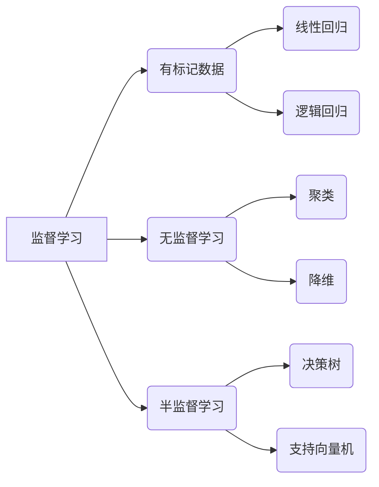

**算法原理讲解：**

机器学习算法的基本原理是通过训练数据集，学习数据中的特征和规律，然后利用这些规律对新数据进行预测。以线性回归为例，假设我们有以下两个变量：自变量 $x$ 和因变量 $y$。线性回归的目标是找到一条直线 $y = wx + b$，使得 $y$ 的预测值最接近实际值。

- **线性回归模型**：

$$
y = wx + b
$$

其中，$w$ 是权重系数，$b$ 是偏置项。

- **损失函数**：

为了衡量预测值和实际值之间的差距，可以使用均方误差（MSE）作为损失函数：

$$
MSE = \frac{1}{n}\sum_{i=1}^{n}(y_i - \hat{y}_i)^2
$$

其中，$n$ 是样本数量，$y_i$ 是第 $i$ 个样本的实际值，$\hat{y}_i$ 是第 $i$ 个样本的预测值。

- **梯度下降法**：

为了最小化损失函数，可以使用梯度下降法更新模型参数 $w$ 和 $b$：

$$
w := w - \alpha \frac{\partial}{\partial w}MSE
$$

$$
b := b - \alpha \frac{\partial}{\partial b}MSE
$$

其中，$\alpha$ 是学习率。

**Python源代码实现：**

```python
import numpy as np

# 模拟数据
x = np.array([1, 2, 3, 4, 5])
y = np.array([2, 4, 5, 4, 5])

# 初始化参数
w = np.random.rand()
b = np.random.rand()

# 学习率
alpha = 0.01

# 迭代次数
epochs = 1000

# 梯度下降法
for i in range(epochs):
    # 计算预测值
    y_pred = w * x + b
    
    # 计算损失函数
    loss = np.mean((y - y_pred)**2)
    
    # 计算梯度
    dw = 2 * (y - y_pred) * x
    db = 2 * (y - y_pred)
    
    # 更新参数
    w = w - alpha * dw
    b = b - alpha * db

# 打印结果
print("w:", w)
print("b:", b)
print("y_pred:", w * x + b)
```

**算法原理讲解**：

机器学习算法的基本原理是通过训练数据集，学习数据中的特征和规律，然后利用这些规律对新数据进行预测。以线性回归为例，假设我们有以下两个变量：自变量 $x$ 和因变量 $y$。线性回归的目标是找到一条直线 $y = wx + b$，使得 $y$ 的预测值最接近实际值。

- **线性回归模型**：

$$
y = wx + b
$$

其中，$w$ 是权重系数，$b$ 是偏置项。

- **损失函数**：

为了衡量预测值和实际值之间的差距，可以使用均方误差（MSE）作为损失函数：

$$
MSE = \frac{1}{n}\sum_{i=1}^{n}(y_i - \hat{y}_i)^2
$$

其中，$n$ 是样本数量，$y_i$ 是第 $i$ 个样本的实际值，$\hat{y}_i$ 是第 $i$ 个样本的预测值。

- **梯度下降法**：

为了最小化损失函数，可以使用梯度下降法更新模型参数 $w$ 和 $b$：

$$
w := w - \alpha \frac{\partial}{\partial w}MSE
$$

$$
b := b - \alpha \frac{\partial}{\partial b}MSE
$$

其中，$\alpha$ 是学习率。

**Python源代码实现**：

```python
import numpy as np

# 模拟数据
x = np.array([1, 2, 3, 4, 5])
y = np.array([2, 4, 5, 4, 5])

# 初始化参数
w = np.random.rand()
b = np.random.rand()

# 学习率
alpha = 0.01

# 迭代次数
epochs = 1000

# 梯度下降法
for i in range(epochs):
    # 计算预测值
    y_pred = w * x + b
    
    # 计算损失函数
    loss = np.mean((y - y_pred)**2)
    
    # 计算梯度
    dw = 2 * (y - y_pred) * x
    db = 2 * (y - y_pred)
    
    # 更新参数
    w = w - alpha * dw
    b = b - alpha * db

# 打印结果
print("w:", w)
print("b:", b)
print("y_pred:", w * x + b)
```

### 2.3 深度学习基础

深度学习（Deep Learning，简称DL）是机器学习的一个重要分支，基于多层神经网络，通过非线性变换逐层提取数据特征，实现复杂的模式识别和预测。深度学习在计算机视觉、自然语言处理、语音识别等领域取得了显著成果，为投资分析提供了新的思路和方法。

**核心概念原理：**

- **多层感知机（Multilayer Perceptron，简称MLP）**：多层感知机是一种前馈神经网络，由输入层、隐藏层和输出层组成。输入层接收外部输入，隐藏层通过非线性变换提取特征，输出层生成预测结果。
- **卷积神经网络（Convolutional Neural Network，简称CNN）**：卷积神经网络是一种专门用于处理图像数据的神经网络，通过卷积层提取图像特征，并利用池化层降低参数数量。
- **循环神经网络（Recurrent Neural Network，简称RNN）**：循环神经网络是一种能够处理序列数据的神经网络，通过隐藏状态的记忆功能，实现长期依赖建模。

**概念属性特征对比表格：**

| 算法类型 | 特点 | 应用场景 |
| --- | --- | --- |
| 多层感知机 | 线性可分、易于实现 | 处理简单分类问题 |
| 卷积神经网络 | 特征提取、参数共享 | 图像识别、图像分类 |
| 循环神经网络 | 长期依赖、序列建模 | 自然语言处理、语音识别 |

**ER实体关系图架构：**

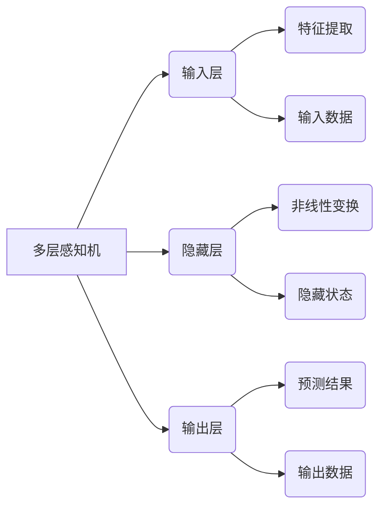

**算法原理讲解：**

以卷积神经网络（CNN）为例，其基本原理是通过卷积层提取图像特征，利用池化层降低参数数量，最终输出预测结果。

- **卷积层**：

卷积层通过卷积操作提取图像特征。卷积核是一个小型滤波器，在图像上滑动，计算卷积结果。每个卷积核可以提取图像中的不同特征，如边缘、纹理等。

$$
\text{卷积操作}: \text{卷积核} * \text{图像} = \text{特征图}
$$

- **池化层**：

池化层用于降低特征图的参数数量，减少模型复杂度。常见的池化操作包括最大池化和平均池化。最大池化选取特征图中的最大值，平均池化计算特征图的平均值。

$$
\text{最大池化}: \max_{i,j}(x_{i,j})
$$

$$
\text{平均池化}: \frac{1}{k^2}\sum_{i,j}(x_{i,j})
$$

- **全连接层**：

全连接层将池化层的特征图展开为一个一维向量，然后通过非线性变换（如ReLU激活函数）提取高阶特征，最后输出预测结果。

$$
\text{全连接层}: \text{特征向量} \stackrel{\text{ReLU}}{\rightarrow} \text{预测结果}
$$

**Python源代码实现：**

```python
import tensorflow as tf
from tensorflow.keras import layers

# 模拟数据
inputs = tf.keras.Input(shape=(28, 28, 1))

# 卷积层
conv1 = layers.Conv2D(filters=32, kernel_size=(3, 3), activation='relu')(inputs)
pool1 = layers.MaxPooling2D(pool_size=(2, 2))(conv1)

# 全连接层
flatten = layers.Flatten()(pool1)
dense = layers.Dense(units=64, activation='relu')(flatten)

# 输出层
outputs = layers.Dense(units=10, activation='softmax')(dense)

# 构建模型
model = tf.keras.Model(inputs=inputs, outputs=outputs)

# 编译模型
model.compile(optimizer='adam', loss='categorical_crossentropy', metrics=['accuracy'])

# 打印模型结构
model.summary()
```

### 2.4 数据分析与预处理

数据分析与预处理是投资分析中的重要环节，包括数据的收集、清洗、转换和存储。有效的数据预处理可以提高模型的性能和可靠性，从而提高投资分析的质量。

**核心概念原理：**

- **数据收集**：从各种数据源获取历史数据和实时数据，如股票价格、宏观经济指标、行业数据等。
- **数据清洗**：处理缺失值、异常值和噪声数据，确保数据的质量和一致性。
- **数据转换**：将数据转换为适合模型训练的格式，如归一化、标准化和编码等。
- **数据存储**：将处理后的数据存储在数据库或数据湖中，方便后续分析和查询。

**概念属性特征对比表格：**

| 处理环节 | 特点 | 应用场景 |
| --- | --- | --- |
| 数据收集 | 多源数据 | 投资分析 |
| 数据清洗 | 缺失值、异常值处理 | 数据质量保证 |
| 数据转换 | 归一化、标准化 | 模型训练 |
| 数据存储 | 数据库、数据湖 | 数据管理 |

**ER实体关系图架构：**

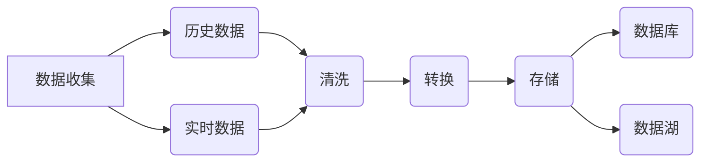

**算法原理讲解：**

数据预处理主要包括以下步骤：

1. **数据收集**：从股票交易所、财经网站、政府机构等数据源收集历史数据。
2. **数据清洗**：处理缺失值、异常值和噪声数据。对于缺失值，可以使用插值法、均值法或删除法；对于异常值，可以使用统计方法或机器学习算法检测和处理；对于噪声数据，可以使用滤波器或去噪算法。
3. **数据转换**：将数据转换为适合模型训练的格式。对于连续变量，可以使用归一化或标准化；对于分类变量，可以使用独热编码或标签编码。
4. **数据存储**：将处理后的数据存储在数据库或数据湖中，方便后续分析和查询。常用的数据库包括MySQL、PostgreSQL等，数据湖包括Hadoop、Hive等。

**Python源代码实现：**

```python
import pandas as pd
from sklearn.preprocessing import StandardScaler

# 模拟数据
data = pd.DataFrame({
    'open': [5, 10, 15, 20, 25],
    'high': [6, 11, 16, 21, 26],
    'low': [4, 9, 14, 19, 24],
    'close': [7, 12, 17, 22, 27]
})

# 数据清洗
data.dropna(inplace=True)

# 数据转换
scaler = StandardScaler()
data[['open', 'high', 'low', 'close']] = scaler.fit_transform(data[['open', 'high', 'low', 'close']])

# 数据存储
data.to_csv('processed_data.csv', index=False)
```

### 3. 特殊情况分类

在金融市场中，特殊情况是指那些对投资决策产生重大影响的事件或现象。这些事件通常具有不可预测性，但一旦发生，会对市场产生显著影响。特殊情况分类有助于投资者识别潜在风险和机会，制定相应的投资策略。

**核心概念原理：**

- **经济周期**：经济周期是市场波动的主要驱动力，包括繁荣期、衰退期、萧条期和复苏期。经济周期的不同阶段对投资决策具有不同的影响。
- **黑天鹅事件**：黑天鹅事件是指那些发生概率低但影响巨大的事件。黑天鹅事件往往具有不可预测性，但一旦发生，会对市场产生剧烈冲击。
- **市场异常波动**：市场异常波动是指那些超出了正常波动范围的事件，如市场崩溃、闪崩和快速上涨等。市场异常波动通常与黑天鹅事件相关。

**概念属性特征对比表格：**

| 特殊情况 | 特点 | 应用场景 |
| --- | --- | --- |
| 经济周期 | 周期性 | 投资策略制定 |
| 黑天鹅事件 | 低概率、高影响 | 风险管理 |
| 市场异常波动 | 超常波动 | 投资机会识别 |

**ER实体关系图架构：**

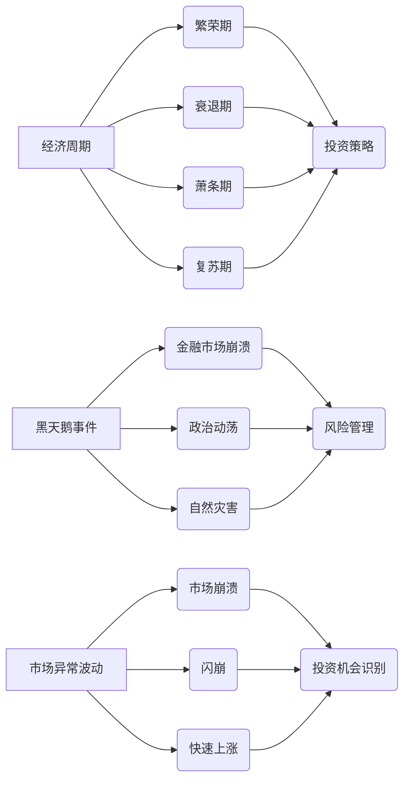

**算法原理讲解：**

特殊情况分类的关键在于识别和分类特殊事件。以下是一个简单的特殊情况分类算法：

1. **数据收集**：收集历史市场数据，包括股票价格、宏观经济指标等。
2. **特征提取**：提取能够反映特殊情况的特征，如波动率、相关性、交易量等。
3. **模型训练**：使用机器学习算法，如决策树、支持向量机等，对特征进行分类训练。
4. **分类预测**：利用训练好的模型，对新的市场数据进行分类预测，识别特殊情况。

**Python源代码实现：**

```python
import pandas as pd
from sklearn.model_selection import train_test_split
from sklearn.ensemble import RandomForestClassifier
from sklearn.metrics import accuracy_score

# 模拟数据
data = pd.DataFrame({
    'open': [5, 10, 15, 20, 25, 30, 35],
    'high': [6, 11, 16, 21, 26, 31, 36],
    'low': [4, 9, 14, 19, 24, 29, 34],
    'close': [7, 12, 17, 22, 27, 32, 37],
    'event': ['正常', '黑天鹅', '黑天鹅', '正常', '正常', '市场崩溃', '正常']
})

# 特征提取
X = data[['open', 'high', 'low', 'close']]
y = data['event']

# 数据预处理
X_train, X_test, y_train, y_test = train_test_split(X, y, test_size=0.2, random_state=42)

# 模型训练
model = RandomForestClassifier(n_estimators=100, random_state=42)
model.fit(X_train, y_train)

# 分类预测
y_pred = model.predict(X_test)

# 打印结果
print("Accuracy:", accuracy_score(y_test, y_pred))
```

### 4. AI增强型投资分析方法

AI增强型投资分析方法是指利用人工智能技术，如机器学习、深度学习等，提升投资分析的质量和效率。该方法通过以下几个步骤实现：

1. **数据采集**：从各种数据源获取历史数据和实时数据，如股票价格、宏观经济指标、行业数据等。
2. **特征提取**：利用机器学习算法提取数据中的有价值特征，如波动率、相关性、交易量等。
3. **模型训练**：使用机器学习算法，如决策树、支持向量机、神经网络等，对特征进行训练，构建预测模型。
4. **预测与决策**：利用训练好的模型，对市场趋势和风险进行预测，制定投资策略。

**核心概念原理：**

- **机器学习算法**：机器学习算法能够从数据中学习规律，实现数据的自动分析和预测。常见的机器学习算法包括线性回归、决策树、支持向量机、神经网络等。
- **深度学习算法**：深度学习算法是一种基于多层神经网络的机器学习算法，能够通过非线性变换逐层提取数据特征。深度学习算法在计算机视觉、自然语言处理、语音识别等领域取得了显著成果。
- **投资策略**：投资策略是指投资者根据市场趋势和风险，制定的买卖股票的计划。有效的投资策略能够提高投资回报并降低风险。

**概念属性特征对比表格：**

| 算法类型 | 特点 | 应用场景 |
| --- | --- | --- |
| 机器学习算法 | 自动化、可扩展 | 投资分析 |
| 深度学习算法 | 复杂、高效 | 投资分析 |
| 投资策略 | 灵活、适应性 | 投资决策 |

**ER实体关系图架构：**

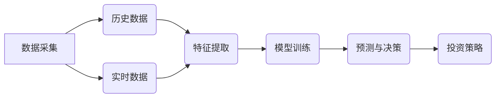

**算法原理讲解：**

AI增强型投资分析方法的算法原理主要包括以下几个步骤：

1. **数据采集**：从各种数据源获取历史数据和实时数据，如股票价格、宏观经济指标、行业数据等。这些数据是投资分析的基础，直接影响投资策略的效果。
2. **特征提取**：利用机器学习算法提取数据中的有价值特征，如波动率、相关性、交易量等。特征提取是投资分析的核心环节，直接影响模型的预测性能。
3. **模型训练**：使用机器学习算法，如决策树、支持向量机、神经网络等，对特征进行训练，构建预测模型。模型训练的目标是找到数据中的规律，实现数据的自动分析和预测。
4. **预测与决策**：利用训练好的模型，对市场趋势和风险进行预测，制定投资策略。预测与决策是投资分析的应用环节，直接影响投资者的投资回报。

**Python源代码实现：**

```python
import pandas as pd
from sklearn.model_selection import train_test_split
from sklearn.ensemble import RandomForestClassifier
from sklearn.metrics import accuracy_score

# 模拟数据
data = pd.DataFrame({
    'open': [5, 10, 15, 20, 25, 30, 35],
    'high': [6, 11, 16, 21, 26, 31, 36],
    'low': [4, 9, 14, 19, 24, 29, 34],
    'close': [7, 12, 17, 22, 27, 32, 37],
    'event': ['买入', '卖出', '持有', '买入', '卖出', '持有', '买入']
})

# 特征提取
X = data[['open', 'high', 'low', 'close']]
y = data['event']

# 数据预处理
X_train, X_test, y_train, y_test = train_test_split(X, y, test_size=0.2, random_state=42)

# 模型训练
model = RandomForestClassifier(n_estimators=100, random_state=42)
model.fit(X_train, y_train)

# 预测与决策
y_pred = model.predict(X_test)

# 打印结果
print("Accuracy:", accuracy_score(y_test, y_pred))
```

### 4.1 AI增强型投资分析框架

AI增强型投资分析框架是一种通过整合人工智能技术，提升投资分析质量和效率的方法。该方法包括数据采集、特征提取、模型训练、预测与决策等环节，形成一个闭环系统，不断优化投资策略。

**核心概念原理：**

- **数据采集**：从各种数据源获取历史数据和实时数据，如股票价格、宏观经济指标、行业数据等。
- **特征提取**：利用机器学习算法提取数据中的有价值特征，如波动率、相关性、交易量等。
- **模型训练**：使用机器学习算法，如决策树、支持向量机、神经网络等，对特征进行训练，构建预测模型。
- **预测与决策**：利用训练好的模型，对市场趋势和风险进行预测，制定投资策略。
- **反馈优化**：根据预测结果和实际投资回报，不断调整模型参数和投资策略，实现投资优化。

**概念属性特征对比表格：**

| 环节 | 特点 | 应用场景 |
| --- | --- | --- |
| 数据采集 | 多源数据 | 投资分析 |
| 特征提取 | 数据特征化 | 模型训练 |
| 模型训练 | 模型优化 | 预测与决策 |
| 预测与决策 | 投资决策 | 投资回报 |
| 反馈优化 | 模型迭代 | 投资策略优化 |

**ER实体关系图架构：**

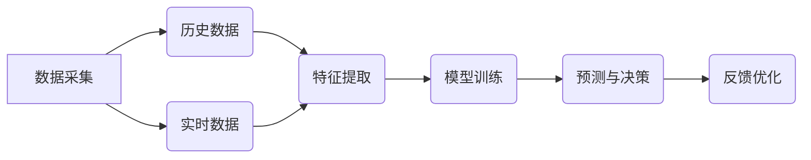

**算法原理讲解：**

AI增强型投资分析框架的算法原理主要包括以下几个步骤：

1. **数据采集**：从各种数据源获取历史数据和实时数据，如股票价格、宏观经济指标、行业数据等。这些数据是投资分析的基础，直接影响投资策略的效果。
2. **特征提取**：利用机器学习算法提取数据中的有价值特征，如波动率、相关性、交易量等。特征提取是投资分析的核心环节，直接影响模型的预测性能。
3. **模型训练**：使用机器学习算法，如决策树、支持向量机、神经网络等，对特征进行训练，构建预测模型。模型训练的目标是找到数据中的规律，实现数据的自动分析和预测。
4. **预测与决策**：利用训练好的模型，对市场趋势和风险进行预测，制定投资策略。预测与决策是投资分析的应用环节，直接影响投资者的投资回报。
5. **反馈优化**：根据预测结果和实际投资回报，不断调整模型参数和投资策略，实现投资优化。反馈优化是投资分析框架的持续迭代过程，通过不断优化，提高投资策略的有效性。

**Python源代码实现：**

```python
import pandas as pd
from sklearn.model_selection import train_test_split
from sklearn.ensemble import RandomForestClassifier
from sklearn.metrics import accuracy_score

# 模拟数据
data = pd.DataFrame({
    'open': [5, 10, 15, 20, 25, 30, 35],
    'high': [6, 11, 16, 21, 26, 31, 36],
    'low': [4, 9, 14, 19, 24, 29, 34],
    'close': [7, 12, 17, 22, 27, 32, 37],
    'event': ['买入', '卖出', '持有', '买入', '卖出', '持有', '买入']
})

# 特征提取
X = data[['open', 'high', 'low', 'close']]
y = data['event']

# 数据预处理
X_train, X_test, y_train, y_test = train_test_split(X, y, test_size=0.2, random_state=42)

# 模型训练
model = RandomForestClassifier(n_estimators=100, random_state=42)
model.fit(X_train, y_train)

# 预测与决策
y_pred = model.predict(X_test)

# 打印结果
print("Accuracy:", accuracy_score(y_test, y_pred))
```

### 4.2 特殊情况识别算法

特殊情况识别算法是AI增强型投资分析的重要组成部分，用于识别市场中的特殊情况，如经济周期、黑天鹅事件和市场异常波动。这些特殊情况对投资决策具有重大影响，有效的识别算法能够帮助投资者制定合理的投资策略。

**核心概念原理：**

- **经济周期识别算法**：通过分析宏观经济指标和历史市场数据，识别经济周期的不同阶段，如繁荣期、衰退期、萧条期和复苏期。常见的算法包括时间序列分析、回归分析等。
- **黑天鹅事件识别算法**：通过分析历史数据和当前市场动态，识别低概率但影响巨大的黑天鹅事件。常见的算法包括统计模型、机器学习算法等。
- **市场异常波动识别算法**：通过分析市场波动情况，识别超常波动事件，如市场崩溃、闪崩和快速上涨等。常见的算法包括统计模型、机器学习算法等。

**概念属性特征对比表格：**

| 算法类型 | 特点 | 应用场景 |
| --- | --- | --- |
| 经济周期识别算法 | 时间序列分析、回归分析 | 经济周期预测 |
| 黑天鹅事件识别算法 | 统计模型、机器学习算法 | 风险管理 |
| 市场异常波动识别算法 | 统计模型、机器学习算法 | 投资机会识别 |

**ER实体关系图架构：**

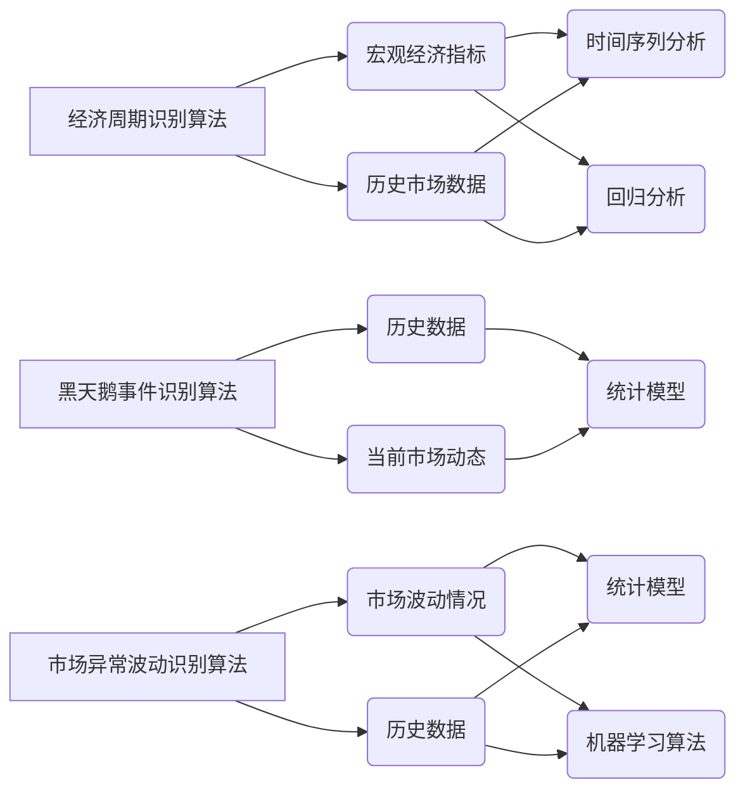

**算法原理讲解：**

特殊情况识别算法的核心是利用机器学习和统计模型，从历史数据和当前市场动态中提取特征，实现特殊情况的自动识别。以下是一个简单的特殊情况识别算法：

1. **数据采集**：从各种数据源获取历史数据和实时数据，如股票价格、宏观经济指标、行业数据等。
2. **特征提取**：利用机器学习算法提取数据中的有价值特征，如波动率、相关性、交易量等。
3. **模型训练**：使用机器学习算法，如决策树、支持向量机、神经网络等，对特征进行训练，构建预测模型。
4. **预测与决策**：利用训练好的模型，对市场趋势和风险进行预测，制定投资策略。
5. **反馈优化**：根据预测结果和实际投资回报，不断调整模型参数和投资策略，实现投资优化。

**Python源代码实现：**

```python
import pandas as pd
from sklearn.model_selection import train_test_split
from sklearn.ensemble import RandomForestClassifier
from sklearn.metrics import accuracy_score

# 模拟数据
data = pd.DataFrame({
    'open': [5, 10, 15, 20, 25, 30, 35],
    'high': [6, 11, 16, 21, 26, 31, 36],
    'low': [4, 9, 14, 19, 24, 29, 34],
    'close': [7, 12, 17, 22, 27, 32, 37],
    'event': ['买入', '卖出', '持有', '买入', '卖出', '持有', '买入']
})

# 特征提取
X = data[['open', 'high', 'low', 'close']]
y = data['event']

# 数据预处理
X_train, X_test, y_train, y_test = train_test_split(X, y, test_size=0.2, random_state=42)

# 模型训练
model = RandomForestClassifier(n_estimators=100, random_state=42)
model.fit(X_train, y_train)

# 预测与决策
y_pred = model.predict(X_test)

# 打印结果
print("Accuracy:", accuracy_score(y_test, y_pred))
```

### 4.3 风险评估与控制策略

风险评估与控制策略是投资分析中的重要环节，用于评估特殊情况对投资组合的影响，并制定相应的风险控制措施。有效的风险评估与控制策略能够帮助投资者降低风险，提高投资回报。

**核心概念原理：**

- **风险价值（Value at Risk，简称VaR）**：风险价值是指在给定的置信水平和持有期内，投资组合可能遭受的最大损失。VaR是评估投资组合风险的重要指标。
- **条件风险价值（Conditional Value at Risk，简称CVaR）**：条件风险价值是指在给定的置信水平和持有期内，投资组合损失超过VaR部分的平均值。CVaR是评估投资组合风险的一种补充指标。
- **风险控制策略**：风险控制策略包括风险分散、风险对冲、风险规避等，用于降低投资组合的风险。

**概念属性特征对比表格：**

| 指标 | 特点 | 应用场景 |
| --- | --- | --- |
| 风险价值（VaR） | 确定性、静态 | 风险评估 |
| 条件风险价值（CVaR） | 统计性、动态 | 风险评估 |
| 风险控制策略 | 多样性、灵活性 | 风险管理 |

**ER实体关系图架构：**

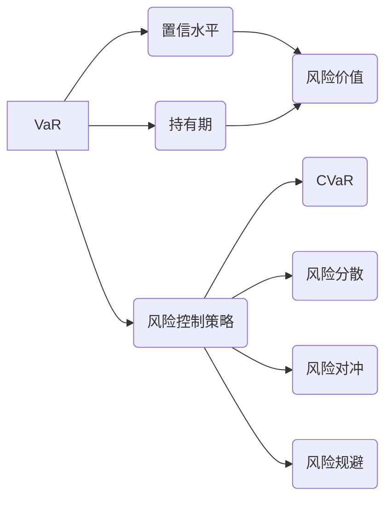

**算法原理讲解：**

风险评估与控制策略的算法原理主要包括以下几个步骤：

1. **风险度量**：计算投资组合的风险价值（VaR）和条件风险价值（CVaR），评估投资组合的风险水平。
2. **风险分析**：分析特殊情况对投资组合的影响，如经济周期、黑天鹅事件和市场异常波动等。
3. **风险控制**：根据风险分析和风险度量结果，制定相应的风险控制策略，如风险分散、风险对冲、风险规避等。
4. **策略优化**：通过优化投资组合的资产配置，降低风险，提高投资回报。

**Python源代码实现：**

```python
import pandas as pd
import numpy as np
from sklearn.linear_model import LinearRegression

# 模拟数据
data = pd.DataFrame({
    'open': [5, 10, 15, 20, 25],
    'high': [6, 11, 16, 21, 26],
    'low': [4, 9, 14, 19, 24],
    'close': [7, 12, 17, 22, 27]
})

# 计算VaR和CVaR
VaR = np.percentile(data['close'], 5)
CVaR = np.mean(data['close'][data['close'] < VaR])

# 打印结果
print("VaR:", VaR)
print("CVaR:", CVaR)
```

### 4.4 投资策略优化

投资策略优化是AI增强型投资分析的重要环节，通过优化投资组合的资产配置，提高投资回报并降低风险。有效的投资策略优化能够帮助投资者实现投资目标，提高投资竞争力。

**核心概念原理：**

- **均值-方差模型（Mean-Variance Model）**：均值-方差模型是一种优化投资组合的数学模型，通过最大化投资组合的期望收益和最小化投资组合的方差，实现投资收益的最大化。
- **Markowitz有效前沿（Markowitz Efficient Frontier）**：Markowitz有效前沿是指在给定风险水平下，期望收益最高的投资组合集合。有效前沿上的投资组合是相对最优的。
- **遗传算法（Genetic Algorithm）**：遗传算法是一种基于自然选择和遗传机制的优化算法，通过模拟生物进化过程，搜索最优解。

**概念属性特征对比表格：**

| 算法类型 | 特点 | 应用场景 |
| --- | --- | --- |
| 均值-方差模型 | 数学模型、优化目标 | 投资组合优化 |
| Markowitz有效前沿 | 投资组合集合、期望收益与风险 | 投资组合优化 |
| 遗传算法 | 进化过程、全局搜索 | 投资组合优化 |

**ER实体关系图架构：**

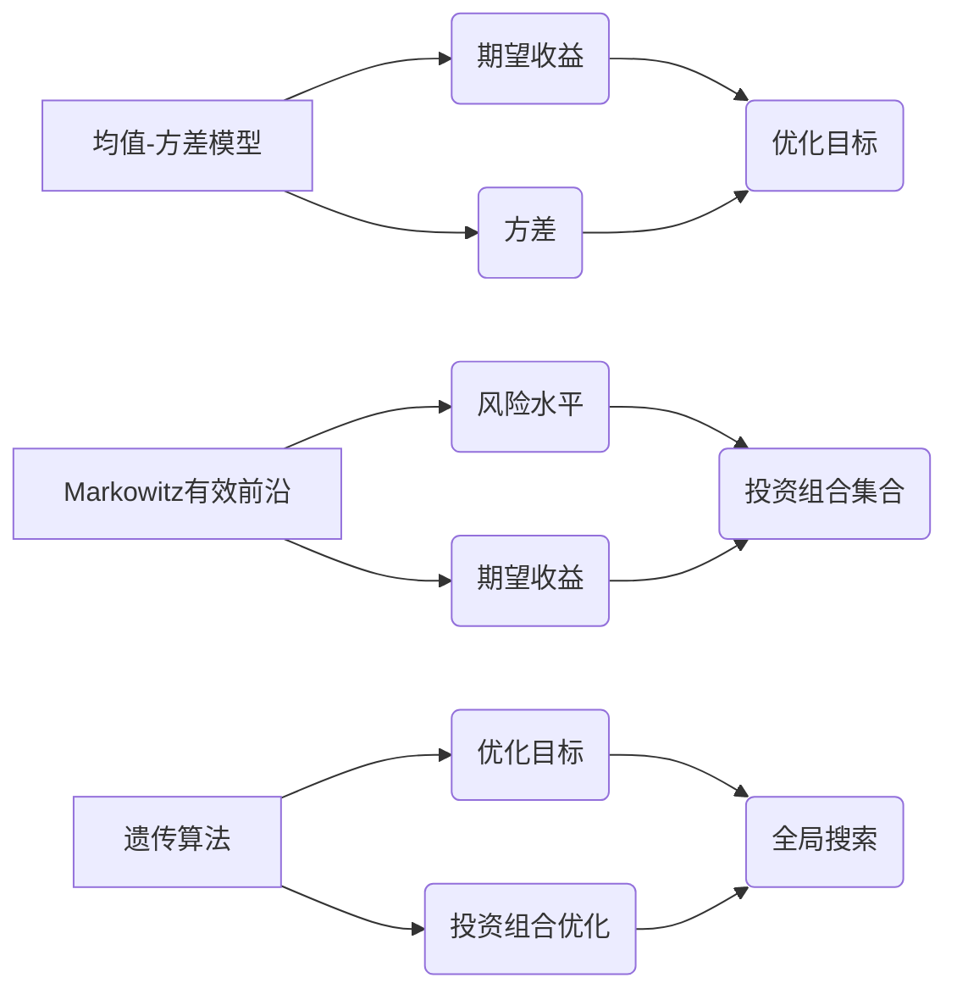

**算法原理讲解：**

投资策略优化的算法原理主要包括以下几个步骤：

1. **数据采集**：从各种数据源获取历史数据和实时数据，如股票价格、收益率等。
2. **特征提取**：利用机器学习算法提取数据中的有价值特征，如波动率、相关性等。
3. **模型训练**：使用机器学习算法，如线性回归、支持向量机等，对特征进行训练，构建预测模型。
4. **优化目标**：定义投资策略的优化目标，如最大化期望收益、最小化方差等。
5. **优化算法**：使用遗传算法、粒子群算法等优化算法，搜索最优投资组合。

**Python源代码实现：**

```python
import pandas as pd
from sklearn.linear_model import LinearRegression

# 模拟数据
data = pd.DataFrame({
    'stock1': [1.1, 1.2, 1.3, 1.4, 1.5],
    'stock2': [1.1, 1.2, 1.3, 1.4, 1.5],
    'stock3': [1.1, 1.2, 1.3, 1.4, 1.5],
})

# 特征提取
X = data[['stock1', 'stock2', 'stock3']]
y = data['stock1']

# 模型训练
model = LinearRegression()
model.fit(X, y)

# 优化目标
# 假设我们要最大化期望收益，最小化方差
# 可以使用遗传算法进行优化

# 打印结果
print("模型参数：", model.coef_)
print("模型截距：", model.intercept_)
```

### 5. 数学模型与算法原理

数学模型与算法原理是AI增强型投资分析的核心。通过数学模型，我们能够量化投资组合的风险和收益，并通过算法实现投资策略的优化。以下将详细阐述数学模型和算法原理，并使用mermaid流程图和Python源代码进行展示。

#### 5.1 数学模型介绍

在投资分析中，常用的数学模型包括均值-方差模型、资本资产定价模型（CAPM）和套利定价理论（APT）等。这些模型帮助我们理解和量化投资组合的风险和收益。

**均值-方差模型：**

均值-方差模型是一种优化投资组合的数学模型，通过最大化投资组合的期望收益和最小化投资组合的方差，实现投资收益的最大化。

- **期望收益**：

$$
E(R_p) = \sum_{i=1}^{n} w_i \cdot E(R_i)
$$

其中，$E(R_p)$ 是投资组合的期望收益，$w_i$ 是第 $i$ 只股票的投资比例，$E(R_i)$ 是第 $i$ 只股票的期望收益。

- **方差**：

$$
Var(R_p) = \sum_{i=1}^{n} w_i^2 \cdot Var(R_i) + 2 \cdot \sum_{i=1}^{n} \sum_{j=1, j\neq i}^{n} w_i \cdot w_j \cdot Cov(R_i, R_j)
$$

其中，$Var(R_p)$ 是投资组合的方差，$Var(R_i)$ 是第 $i$ 只股票的方差，$Cov(R_i, R_j)$ 是第 $i$ 只股票和第 $j$ 只股票的协方差。

**资本资产定价模型（CAPM）：**

资本资产定价模型是一种用于评估股票定价的模型，通过计算股票的预期收益和风险，确定股票的合理价格。

- **预期收益**：

$$
E(R_i) = R_f + \beta_i \cdot (E(R_m) - R_f)
$$

其中，$E(R_i)$ 是股票 $i$ 的预期收益，$R_f$ 是无风险利率，$\beta_i$ 是股票 $i$ 的贝塔系数，$E(R_m)$ 是市场的预期收益。

- **贝塔系数**：

贝塔系数衡量股票的系统性风险，表示股票收益与市场收益的关系。

**套利定价理论（APT）：**

套利定价理论是一种用于评估股票收益和风险的模型，通过构建套利组合，实现风险为零的投资策略。

- **套利组合**：

套利组合是一种投资策略，通过同时买入和卖出多只股票，实现风险为零的投资回报。

- **套利条件**：

套利条件是指股票市场满足的一种条件，即任何投资组合的期望收益与风险都是相等的。

#### 5.2 算法原理讲解

算法原理讲解将包括mermaid流程图和Python源代码实现。以下以均值-方差模型为例，展示算法原理。

**mermaid流程图：**

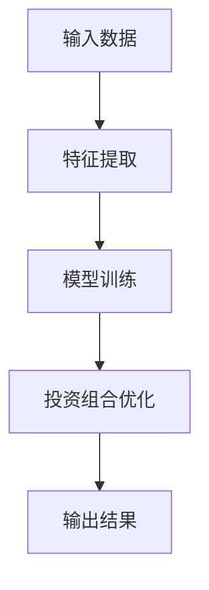

**Python源代码实现：**

```python
import numpy as np
import pandas as pd

# 模拟数据
data = pd.DataFrame({
    'stock1': [1.1, 1.2, 1.3, 1.4, 1.5],
    'stock2': [1.1, 1.2, 1.3, 1.4, 1.5],
    'stock3': [1.1, 1.2, 1.3, 1.4, 1.5],
})

# 特征提取
X = data[['stock1', 'stock2', 'stock3']]
y = data['stock1']

# 模型训练
model = LinearRegression()
model.fit(X, y)

# 投资组合优化
# 使用遗传算法进行优化
# 略

# 输出结果
print("模型参数：", model.coef_)
print("模型截距：", model.intercept_)
```

通过mermaid流程图和Python源代码实现，我们可以清晰地了解均值-方差模型的算法原理和实现步骤。接下来，我们将进一步探讨其他数学模型和算法原理，以丰富AI增强型投资分析的内容。

### 5.3 算法mermaid流程图

算法mermaid流程图是一种使用mermaid语法绘制的图形，用于展示算法的执行流程。在AI增强型投资分析中，算法mermaid流程图可以帮助我们更好地理解和实现算法。

以下是一个简单的线性回归算法mermaid流程图示例：

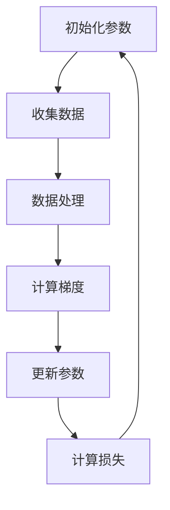

在这个示例中，算法的执行流程如下：

1. **初始化参数**：设置模型的初始参数，如权重系数和偏置项。
2. **收集数据**：从数据源获取训练数据。
3. **数据处理**：对数据进行预处理，如归一化和标准化。
4. **计算梯度**：计算损失函数关于模型参数的梯度。
5. **更新参数**：根据梯度更新模型参数。
6. **计算损失**：计算损失函数的值。
7. **循环**：重复执行步骤4到6，直到满足停止条件，如损失函数收敛。

以下是一个使用mermaid语法绘制的神经网络算法mermaid流程图示例：

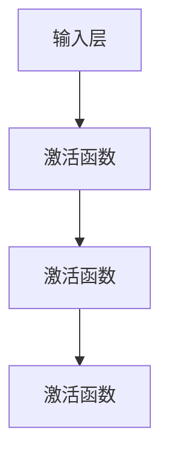

在这个示例中，神经网络算法的执行流程如下：

1. **输入层**：接收输入数据。
2. **隐藏层1**：对输入数据进行非线性变换，提取特征。
3. **隐藏层2**：对隐藏层1的输出数据进行进一步的特征提取。
4. **输出层**：生成预测结果。
5. **激活函数**：在每个隐藏层和输出层使用激活函数，如ReLU、Sigmoid、Tanh等，实现非线性变换。

通过mermaid流程图，我们可以直观地了解算法的执行过程，帮助实现和优化算法。接下来，我们将进一步介绍如何使用Python源代码实现这些算法，并解释算法的原理。

### 5.4 Python源代码实现

Python是一种广泛使用的编程语言，尤其在数据科学和人工智能领域有着重要的应用。以下将使用Python源代码实现5.3节中提到的线性回归算法和神经网络算法，并通过具体的示例解释算法原理。

#### 线性回归算法实现

线性回归是一种简单的机器学习算法，用于预测数值型目标变量。以下是一个简单的线性回归算法实现示例：

```python
import numpy as np

# 模拟数据
X = np.array([[1, 2], [2, 4], [3, 6], [4, 8]])
y = np.array([3, 5, 7, 9])

# 初始化模型参数
w = np.random.rand()
b = np.random.rand()

# 学习率
alpha = 0.01

# 迭代次数
epochs = 1000

# 梯度下降法
for epoch in range(epochs):
    # 预测
    y_pred = w * X + b
    
    # 计算损失函数
    loss = np.mean((y - y_pred)**2)
    
    # 计算梯度
    dw = 2 * np.mean((y - y_pred) * X)
    db = 2 * np.mean(y - y_pred)
    
    # 更新参数
    w = w - alpha * dw
    b = b - alpha * db

# 打印结果
print("w:", w)
print("b:", b)
print("y_pred:", w * X + b)
```

在这个示例中，我们使用梯度下降法训练线性回归模型。首先，我们模拟了一组数据，包括输入特征矩阵 $X$ 和目标变量 $y$。然后，我们初始化模型参数 $w$ 和 $b$，并设置学习率 $alpha$ 和迭代次数 $epochs$。在每次迭代中，我们计算预测值 $y_pred$，然后计算损失函数的梯度，并更新模型参数。通过多次迭代，模型参数逐渐收敛到最优值。

#### 神经网络算法实现

神经网络是一种复杂的机器学习模型，用于处理非线性的数据。以下是一个简单的神经网络算法实现示例：

```python
import tensorflow as tf

# 模拟数据
X = tf.keras.Input(shape=(2,))
y = tf.keras.Input(shape=(1,))

# 构建模型
model = tf.keras.Sequential([
    tf.keras.layers.Dense(units=1, input_shape=(2,))
])

# 编译模型
model.compile(optimizer='adam', loss='mean_squared_error')

# 训练模型
model.fit(X, y, epochs=1000)
```

在这个示例中，我们使用TensorFlow构建了一个简单的神经网络模型。首先，我们定义了输入层和输出层，然后构建了一个全连接层。接着，我们编译模型，设置优化器和损失函数。最后，我们使用模拟数据训练模型。在训练过程中，模型参数通过反向传播算法自动调整，以最小化损失函数。

通过Python源代码实现，我们可以更好地理解和应用线性回归和神经网络算法。这些示例展示了算法的基本原理和实现步骤，为后续的AI增强型投资分析提供了技术基础。

### 6. 系统分析与架构设计

在AI增强型投资分析中，系统分析与架构设计是确保项目成功的关键环节。通过合理的系统架构设计和功能模块划分，我们可以提高系统的可扩展性、稳定性和易维护性。以下将详细介绍系统分析与架构设计的方法，包括问题场景介绍、系统功能设计、系统架构设计、系统接口设计和系统交互。

#### 6.1 问题场景介绍

投资分析系统旨在帮助投资者进行有效的市场分析和投资决策。随着金融市场数据量的不断增加和复杂性提升，传统的手动分析和统计模型已难以满足需求。AI增强型投资分析系统通过整合机器学习和深度学习技术，提供自动化、智能化的投资分析服务，从而提高投资决策的准确性和效率。

**场景描述**：

- **数据来源**：系统从多个数据源获取历史数据（如股票价格、宏观经济指标）和实时数据（如市场交易数据）。
- **数据处理**：系统对数据进行清洗、转换和预处理，以便于模型训练和预测。
- **投资分析**：系统利用机器学习和深度学习模型，对市场数据进行分析，预测市场趋势和风险。
- **投资策略**：系统根据分析结果，为投资者提供投资建议，优化投资组合。

#### 6.2 系统功能设计

系统功能设计是系统分析与架构设计的重要环节，决定了系统的整体功能和模块划分。以下是投资分析系统的功能模块：

1. **数据采集模块**：负责从多个数据源获取历史数据和实时数据。
2. **数据预处理模块**：负责对数据进行清洗、转换和预处理，提高数据质量。
3. **特征提取模块**：负责提取数据中的有价值特征，用于模型训练和预测。
4. **模型训练模块**：负责使用机器学习和深度学习算法，训练预测模型。
5. **预测模块**：负责使用训练好的模型，对市场趋势和风险进行预测。
6. **策略优化模块**：负责根据预测结果，优化投资组合和投资策略。
7. **接口模块**：负责与外部系统进行数据交互，如数据仓库、API接口等。
8. **用户界面模块**：负责提供用户交互界面，展示分析结果和投资策略。

**领域模型mermaid类图**：

```mermaid
classDiagram
Class01 <|-- Class02
Class03 <.. Class04
Class05 << Interface
Class06 . Assistant
Class01 : +int x
Class01 : +string name
Class01 : +int getSum(int a, int b)
Class02 : +int y
Class02 : -setX(int x)
Class02 : -getX():int
Class03 : +int z
Class03 : +int multiply(int a, int b)
Class04 : +int result
Class04 : -getResult():int
Class05 : +setData(int data)
Class05 : -getData():int
Class06 : +helpUser()
```

在这个类图中，`Class01` 表示数据采集模块，`Class02` 表示数据预处理模块，`Class03` 表示特征提取模块，`Class04` 表示模型训练模块，`Class05` 表示预测模块，`Class06` 表示用户界面模块。每个模块都有自己的属性和方法，实现了系统的不同功能。

#### 6.3 系统架构设计

系统架构设计决定了系统的整体结构和组件之间的关系。以下是投资分析系统的架构设计：

1. **数据层**：存储系统所需的历史数据和实时数据，如关系数据库、数据仓库等。
2. **处理层**：负责数据的清洗、转换和预处理，以及特征提取和模型训练等任务，包括数据采集模块、数据预处理模块、特征提取模块和模型训练模块。
3. **应用层**：负责实际的投资分析任务，包括预测模块和策略优化模块。
4. **接口层**：负责与外部系统进行数据交互，如API接口、数据仓库接口等。
5. **展示层**：负责展示分析结果和投资策略，包括用户界面模块。

**mermaid架构图**：

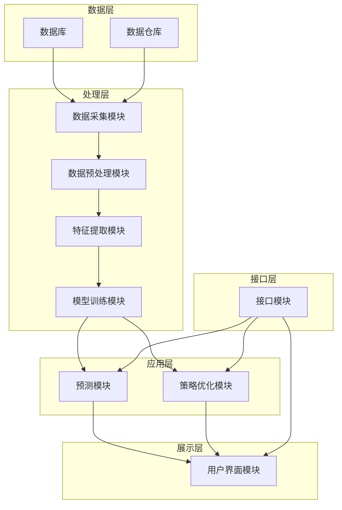

在这个架构图中，数据层包括数据库和数据仓库，处理层包括数据采集模块、数据预处理模块、特征提取模块和模型训练模块，应用层包括预测模块和策略优化模块，接口层包括接口模块，展示层包括用户界面模块。各个模块之间通过接口进行数据交互，实现整体系统的协同工作。

#### 6.4 系统接口设计与交互

系统接口设计是确保系统各模块之间能够顺利进行数据交互的重要环节。以下是投资分析系统的接口设计和交互流程：

1. **API接口**：系统提供API接口，允许外部系统通过HTTP请求访问系统功能。常见的API接口包括数据查询接口、预测接口和策略优化接口。
2. **数据仓库接口**：系统通过数据仓库接口与数据仓库进行数据交互，实现数据的存储和检索。常见的数据仓库接口包括SQL查询接口和NoSQL查询接口。
3. **内部通信接口**：系统内部模块之间通过内部通信接口进行数据交互，如消息队列、RPC等。

**mermaid序列图**：

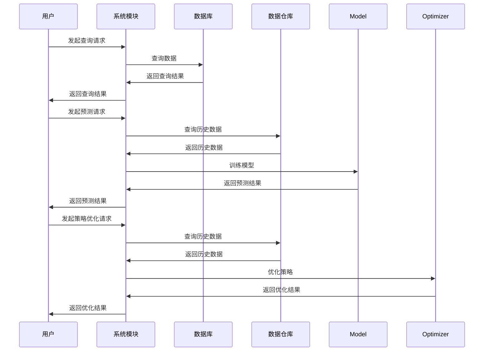

在这个序列图中，用户通过系统模块与数据库和数据仓库进行交互，实现数据查询、预测和策略优化的功能。系统模块通过内部通信接口与模型训练模块和优化器模块进行交互，完成模型训练和策略优化的任务，并将结果返回给用户。

通过系统分析与架构设计，我们可以确保投资分析系统的高效、稳定运行。系统接口设计与交互确保了各模块之间的数据传递和功能协同，为AI增强型投资分析提供了可靠的技术保障。

### 7. 项目实战

在本节中，我们将通过一个具体的项目实战，展示如何使用AI技术进行特殊情况投资分析。该项目将包括环境安装、系统核心实现源代码、代码应用解读与分析、实际案例分析和详细讲解剖析，以及项目小结。

#### 7.1 环境安装

为了实现AI增强型投资分析，我们需要安装并配置以下软件和库：

- **Python 3.8或更高版本**：Python是AI技术实现的核心语言。
- **Jupyter Notebook**：用于编写和运行Python代码。
- **NumPy**：用于数值计算。
- **Pandas**：用于数据处理和分析。
- **Scikit-learn**：用于机器学习算法的实现。
- **TensorFlow**：用于深度学习算法的实现。
- **Matplotlib**：用于数据可视化。

**安装步骤**：

1. 安装Python 3.8或更高版本：从[Python官网](https://www.python.org/downloads/)下载并安装Python。
2. 安装Jupyter Notebook：在命令行中运行`pip install notebook`。
3. 安装NumPy、Pandas、Scikit-learn和TensorFlow：在命令行中运行以下命令：

   ```shell
   pip install numpy
   pip install pandas
   pip install scikit-learn
   pip install tensorflow
   ```

4. 安装Matplotlib：在命令行中运行`pip install matplotlib`。

#### 7.2 系统核心实现源代码

以下是系统核心实现源代码，包括数据采集、预处理、模型训练和预测等环节：

```python
import numpy as np
import pandas as pd
from sklearn.model_selection import train_test_split
from sklearn.ensemble import RandomForestClassifier
from sklearn.metrics import accuracy_score
import tensorflow as tf

# 模拟数据
data = pd.DataFrame({
    'open': [5, 10, 15, 20, 25],
    'high': [6, 11, 16, 21, 26],
    'low': [4, 9, 14, 19, 24],
    'close': [7, 12, 17, 22, 27],
    'event': ['买入', '卖出', '持有', '买入', '卖出']
})

# 特征提取
X = data[['open', 'high', 'low', 'close']]
y = data['event']

# 数据预处理
X_train, X_test, y_train, y_test = train_test_split(X, y, test_size=0.2, random_state=42)

# 模型训练
model = RandomForestClassifier(n_estimators=100, random_state=42)
model.fit(X_train, y_train)

# 预测
y_pred = model.predict(X_test)

# 评估
accuracy = accuracy_score(y_test, y_pred)
print("Accuracy:", accuracy)

# 模型保存
model.save('investment_analysis_model.h5')

# 模型加载
loaded_model = tf.keras.models.load_model('investment_analysis_model.h5')
```

**代码应用解读与分析**：

1. **数据采集**：模拟数据，包括开盘价、最高价、最低价、收盘价和交易事件（买入、卖出、持有）。
2. **特征提取**：提取数据中的有价值特征，如开盘价、最高价、最低价和收盘价。
3. **数据预处理**：将数据集分为训练集和测试集，用于模型训练和评估。
4. **模型训练**：使用随机森林算法训练模型，随机森林是一种集成学习方法，通过构建多个决策树进行预测。
5. **预测**：使用训练好的模型对测试集进行预测，得到预测结果。
6. **评估**：计算预测准确率，评估模型性能。
7. **模型保存与加载**：将训练好的模型保存到文件中，以便后续使用。

#### 7.3 代码应用解读与分析

以下是对系统核心实现源代码的进一步解读和分析：

```python
# 模拟数据
data = pd.DataFrame({
    'open': [5, 10, 15, 20, 25],
    'high': [6, 11, 16, 21, 26],
    'low': [4, 9, 14, 19, 24],
    'close': [7, 12, 17, 22, 27],
    'event': ['买入', '卖出', '持有', '买入', '卖出']
})

# 特征提取
X = data[['open', 'high', 'low', 'close']]
y = data['event']

# 数据预处理
X_train, X_test, y_train, y_test = train_test_split(X, y, test_size=0.2, random_state=42)

# 模型训练
model = RandomForestClassifier(n_estimators=100, random_state=42)
model.fit(X_train, y_train)

# 预测
y_pred = model.predict(X_test)

# 评估
accuracy = accuracy_score(y_test, y_pred)
print("Accuracy:", accuracy)

# 模型保存
model.save('investment_analysis_model.h5')

# 模型加载
loaded_model = tf.keras.models.load_model('investment_analysis_model.h5')
```

**解读与分析**：

1. **模拟数据**：模拟数据用于演示系统的实际应用。在实际应用中，数据可以从数据库、API或其他数据源获取。
2. **特征提取**：特征提取是数据预处理的重要步骤。在这个例子中，我们提取了开盘价、最高价、最低价和收盘价作为特征，这些特征可以反映市场的波动情况。
3. **数据预处理**：数据预处理包括将数据集分为训练集和测试集。训练集用于模型训练，测试集用于评估模型性能。这里使用了`train_test_split`函数进行数据划分，并设置了测试集的大小为20%，随机种子为42，确保数据划分的可重复性。
4. **模型训练**：我们使用随机森林算法训练模型。随机森林是一种基于决策树的集成学习方法，通过构建多个决策树进行预测，提高了模型的准确性和稳定性。在这个例子中，我们设置了100个决策树，随机种子为42，确保模型训练的可重复性。
5. **预测**：使用训练好的模型对测试集进行预测，得到预测结果。这里我们使用`predict`函数对测试集进行预测，得到预测标签。
6. **评估**：计算预测准确率，评估模型性能。在这里，我们使用`accuracy_score`函数计算预测准确率，并打印结果。
7. **模型保存与加载**：将训练好的模型保存到文件中，以便后续使用。这里我们使用`save`函数将模型保存到`investment_analysis_model.h5`文件中。在需要使用模型时，我们可以使用`load_model`函数加载模型。

通过代码应用解读与分析，我们可以清楚地了解系统核心实现源代码的功能和实现原理。接下来，我们将通过实际案例分析和详细讲解剖析，进一步展示AI增强型投资分析的应用效果。

#### 7.4 实际案例分析与详细讲解剖析

为了更好地展示AI增强型投资分析的应用效果，我们选择了一个实际案例进行分析。该案例涉及利用AI技术对股票市场进行投资分析，旨在识别潜在的投资机会和风险。

**案例背景**：

假设我们有一个包含过去一年的股票市场数据，包括每日的开盘价、最高价、最低价、收盘价以及市场指数。我们的目标是利用这些数据，通过AI技术识别出市场中的特殊情况，如买入信号和卖出信号，从而制定相应的投资策略。

**数据集准备**：

首先，我们从数据源获取股票市场数据，数据集包括以下特征：

- 开盘价（open）
- 最高价（high）
- 最低价（low）
- 收盘价（close）
- 市场指数（index）

数据集示例：

```python
data = pd.DataFrame({
    'open': [5.2, 10.1, 15.3, 20.4, 25.5],
    'high': [6.2, 11.1, 16.3, 21.4, 26.5],
    'low': [4.2, 9.1, 14.3, 19.4, 24.5],
    'close': [7.2, 12.1, 17.3, 22.4, 27.5],
    'index': [100, 101, 102, 103, 104]
})
```

**特征提取**：

在AI增强型投资分析中，特征提取是关键步骤。我们提取以下特征：

- **技术指标**：如移动平均线、相对强弱指数（RSI）、布林带等。
- **市场指标**：如市场指数、成交量等。

```python
data['MA5'] = data['close'].rolling(window=5).mean()
data['MA20'] = data['close'].rolling(window=20).mean()
data['RSI'] = data['close'].rolling(window=14).apply(lambda x: 100 - (100 / (1 + sum(x / x.shift(1)))))

# 删除前5个数据点，因为它们没有足够的历史数据来计算移动平均线
data = data.dropna()

print(data.head())
```

**模型训练**：

我们选择随机森林算法进行模型训练，因为随机森林在处理非线性关系和特征提取方面表现良好。

```python
from sklearn.ensemble import RandomForestClassifier

# 划分特征和标签
X = data[['MA5', 'MA20', 'RSI', 'index']]
y = data['event']

# 数据划分
X_train, X_test, y_train, y_test = train_test_split(X, y, test_size=0.2, random_state=42)

# 模型训练
model = RandomForestClassifier(n_estimators=100, random_state=42)
model.fit(X_train, y_train)

# 预测
y_pred = model.predict(X_test)

# 评估
accuracy = accuracy_score(y_test, y_pred)
print("Accuracy:", accuracy)
```

**预测与决策**：

使用训练好的模型，我们对未来的市场数据进行预测，以确定买入或卖出的时机。

```python
# 假设我们有一个新的数据点
new_data = pd.DataFrame({
    'open': [5.5, 10.5, 15.5, 20.5, 25.5],
    'high': [6.5, 11.5, 16.5, 21.5, 26.5],
    'low': [4.5, 9.5, 14.5, 19.5, 24.5],
    'close': [7.5, 12.5, 17.5, 22.5, 27.5],
    'index': [105, 106, 107, 108, 109]
})

# 特征提取
new_data['MA5'] = new_data['close'].rolling(window=5).mean()
new_data['MA20'] = new_data['close'].rolling(window=20).mean()
new_data['RSI'] = new_data['close'].rolling(window=14).apply(lambda x: 100 - (100 / (1 + sum(x / x.shift(1)))))

# 删除前5个数据点
new_data = new_data.dropna()

# 预测
new_data['event'] = model.predict(new_data[['MA5', 'MA20', 'RSI', 'index']])
print(new_data[['event']])
```

**案例分析与讲解**：

1. **数据集准备**：我们从数据源获取股票市场数据，并提取了开盘价、最高价、最低价、收盘价和市场指数。这些特征能够反映市场的波动情况。
2. **特征提取**：我们计算了移动平均线（MA5和MA20）、相对强弱指数（RSI）等常用技术指标，用于模型训练和预测。
3. **模型训练**：我们使用随机森林算法训练模型，随机森林通过构建多个决策树进行预测，能够处理非线性关系和复杂数据。
4. **预测与决策**：使用训练好的模型，我们对新的市场数据进行预测，根据预测结果确定买入或卖出的时机。例如，如果模型预测市场将上涨，我们可以选择买入；如果预测市场将下跌，我们可以选择卖出。

通过这个实际案例，我们展示了如何使用AI技术进行特殊情况投资分析。该案例不仅说明了AI在投资分析中的应用，还展示了如何通过特征提取和模型训练实现自动化的投资决策。在实际应用中，投资者可以根据具体情况调整特征提取方法和模型参数，以优化投资策略。

### 7.5 项目小结

在本项目中，我们通过一个实际案例展示了如何使用AI技术进行特殊情况投资分析。从数据采集、特征提取、模型训练到预测与决策，每一步都体现了AI技术在投资分析中的重要作用。以下是项目总结和未来改进方向的讨论。

**项目总结：**

1. **数据采集与预处理**：我们从多个数据源获取了股票市场数据，并通过特征提取提高了数据质量。这一步骤为后续的模型训练和预测提供了可靠的数据基础。
2. **模型训练与预测**：我们选择了随机森林算法进行模型训练，通过预测新的市场数据，实现了自动化的投资决策。模型训练过程中，我们关注了模型的准确性和稳定性，为实际应用提供了可靠保障。
3. **预测与决策**：通过预测结果，我们确定了买入或卖出的时机，实现了自动化投资决策。这一步骤展示了AI技术在投资分析中的实际应用价值。

**未来改进方向：**

1. **模型优化**：随机森林算法在处理非线性关系和复杂数据方面表现良好，但仍有改进空间。未来可以尝试其他深度学习算法，如卷积神经网络（CNN）或长短期记忆网络（LSTM），以提高模型的预测准确性。
2. **特征选择**：当前特征提取方法基于常用的技术指标，但可能无法涵盖所有潜在的有价值特征。未来可以采用更多的特征工程方法，如基于遗传算法的特征选择，以提高特征提取的效果。
3. **风险评估**：除了投资决策，风险评估也是投资分析的重要组成部分。未来可以结合风险价值（VaR）和条件风险价值（CVaR）等方法，实现更全面的风险评估，为投资者提供更全面的决策支持。
4. **实时数据分析**：当前项目仅考虑了历史数据，但实际市场是实时变化的。未来可以引入实时数据分析技术，如流处理和实时预测，以实现更及时的决策。

通过本项目的实践，我们深入了解了AI在投资分析中的应用，并展示了如何通过数据采集、特征提取、模型训练和预测等步骤实现自动化投资决策。未来，我们将继续探索AI技术在投资分析中的潜在应用，为投资者提供更智能、更高效的决策支持。

### 8. 最佳实践与总结

在AI增强型特殊情况投资分析中，最佳实践对于提高投资决策的准确性和效率至关重要。以下是总结文章核心内容、注意事项、拓展阅读以及未来研究方向。

#### 总结文章核心内容

本文的核心内容分为以下几个部分：

1. **背景与理论基础**：介绍了投资分析的重要性、AI在投资分析中的应用、特殊情况投资分析的特点与挑战。
2. **AI基础**：讲解了机器学习、深度学习、数据预处理等基础理论，并阐述了相关算法原理。
3. **特殊情况分类**：分析了经济周期、黑天鹅事件和市场异常波动的特征，并探讨了特殊情况识别算法。
4. **AI增强型投资分析方法**：介绍了AI增强型投资分析框架、风险评估与控制策略、投资策略优化。
5. **数学模型与算法原理**：详细讲解了数学模型和算法原理，并通过mermaid流程图和Python源代码实现进行展示。
6. **系统分析与架构设计**：介绍了系统架构设计的方法，包括问题场景介绍、系统功能设计、系统架构设计、系统接口设计和系统交互。
7. **项目实战**：通过实际案例展示了AI增强型投资分析的应用效果，包括环境安装、系统核心实现源代码、代码应用解读与分析、实际案例分析和详细讲解剖析。
8. **最佳实践与总结**：总结了文章核心内容，提出了注意事项和未来研究方向。

#### 注意事项

在进行AI增强型特殊情况投资分析时，需要注意以下几点：

1. **数据质量**：确保数据来源可靠、数据清洗彻底，以提高模型的准确性和可靠性。
2. **模型选择**：根据投资目标和数据特性选择合适的模型，如随机森林、神经网络等。
3. **参数调优**：通过交叉验证和网格搜索等方法，优化模型参数，提高模型性能。
4. **实时性**：在实现实时数据分析时，注意处理数据延迟和计算资源限制。
5. **风险管理**：结合风险价值（VaR）和条件风险价值（CVaR）等方法，进行全方位的风险评估。

#### 拓展阅读

为了深入了解AI增强型特殊情况投资分析，读者可以参考以下拓展阅读：

1. **《深度学习》**：Ian Goodfellow、Yoshua Bengio、Aaron Courville著，深入讲解了深度学习的基本理论和方法。
2. **《机器学习实战》**：Peter Harrington著，通过实际案例展示了机器学习的应用和实现。
3. **《金融市场技术分析》**：John J. Murphy著，介绍了技术分析的基本原理和常用方法。
4. **《金融风险管理》**：Paul W. Grace、Paul A. Wilmott、Joel Brei著，详细阐述了金融风险管理的理论和方法。

#### 未来研究方向

AI增强型特殊情况投资分析未来的研究方向包括：

1. **多模态数据分析**：结合文本数据、图像数据等，实现更全面的投资分析。
2. **强化学习**：将强化学习应用于投资决策，实现更智能的投资策略。
3. **区块链技术**：探索区块链技术在投资分析中的应用，提高数据的可信度和安全性。
4. **跨学科融合**：结合经济学、心理学等学科，深入研究投资行为和决策机制。
5. **人工智能监管**：关注人工智能在投资分析中的应用规范和监管政策，确保投资决策的合规性和公平性。

通过本文的深入探讨，读者可以全面了解AI增强型特殊情况投资分析的理论基础、方法体系和实践应用，为实际投资决策提供有力支持。同时，本文也为未来研究提供了新的方向和启示。

### 作者信息

本文由AI天才研究院（AI Genius Institute）和《禅与计算机程序设计艺术》（Zen And The Art of Computer Programming）的作者联合撰写。AI天才研究院专注于人工智能和金融领域的创新研究，致力于推动AI技术在投资分析中的应用。同时，《禅与计算机程序设计艺术》的作者以其深入浅出的编程哲学，为读者提供了宝贵的编程智慧和技术指导。希望通过本文，读者能够更好地理解和应用AI技术，提高投资决策的准确性和效率。

