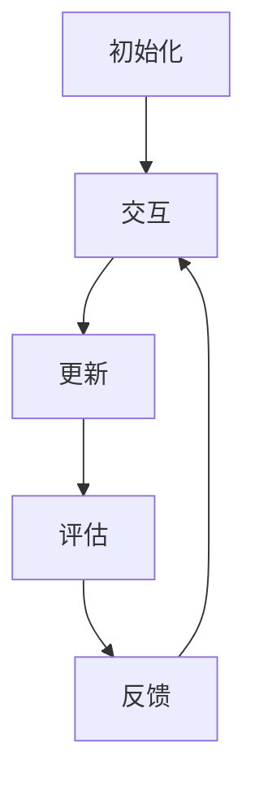
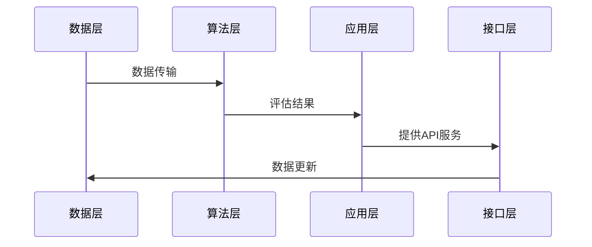

                 


# AI增强的长期增长可持续性评估：多智能体协作模型

关键词：AI增强、长期增长、可持续性、多智能体协作模型、数学模型、算法原理、系统架构、项目实战

摘要：本文旨在探讨如何利用AI增强的多智能体协作模型对长期增长的可持续性进行评估。文章首先介绍了背景与核心概念，然后详细阐述了数学模型和算法原理，接下来对系统架构进行设计与分析，并分享了一个实际项目的实战经验。文章的最后，提出了最佳实践建议和未来研究方向。

## 目录大纲

### 第一部分：背景与概述

#### 1. 引言

##### 1.1 问题背景

##### 1.2 问题描述

##### 1.3 问题解决

##### 1.4 边界与外延

#### 2. 核心概念与联系

##### 2.1 AI与智能体协作模型

##### 2.2 长期增长与可持续性

##### 2.3 多智能体协作模型的作用

### 第二部分：数学模型与算法原理

#### 3. 数学模型与算法原理

##### 3.1 多智能体协作模型的数学模型

##### 3.2 多智能体协作模型的工作原理

##### 3.3 多智能体协作模型的mermaid流程图

### 第三部分：系统分析与架构设计

#### 4. 系统分析与架构设计

##### 4.1 问题场景介绍

##### 4.2 系统功能设计

##### 4.3 系统架构设计

##### 4.4 系统接口设计

##### 4.5 系统交互mermaid序列图

### 第四部分：项目实战

#### 5. 项目实战

##### 5.1 环境安装

##### 5.2 系统核心实现源代码

##### 5.3 代码应用解读与分析

##### 5.4 实际案例分析与讲解

##### 5.5 项目小结

### 第五部分：最佳实践与注意事项

#### 6. 最佳实践与注意事项

##### 6.1 最佳实践 tips

##### 6.2 小结

##### 6.3 注意事项

##### 6.4 拓展阅读

### 第六部分：结论

#### 7. 结论

##### 7.1 研究成果总结

##### 7.2 展望未来发展方向

### 附录

#### A. 相关术语解释

#### B. 代码示例

#### C. 参考文献

## 1. 引言

### 1.1 问题背景

在当今全球化的商业环境中，企业面临着前所未有的竞争压力和不确定性。为了保持竞争力，企业必须不断寻求创新的增长策略。然而，传统的方法往往无法满足这一需求，因为它们往往注重短期收益而忽视了长期可持续性。因此，如何实现AI增强的长期增长可持续性评估成为了一个迫切需要解决的问题。

### 1.2 问题描述

长期增长的可持续性评估涉及到多个方面，包括经济、社会和环境因素。传统的方法通常依赖于单一指标或静态模型，这限制了评估的全面性和准确性。为了解决这个问题，我们需要一种能够动态地、综合地评估各个因素之间相互作用的模型。

### 1.3 问题解决

本文提出了一种基于AI增强的多智能体协作模型，用于评估企业的长期增长可持续性。该模型能够综合考虑各个因素之间的相互作用，并提供实时、动态的评估结果。通过这种方式，企业可以更好地理解自身的增长路径，并制定出更具可持续性的策略。

### 1.4 边界与外延

本文的研究主要关注于企业的长期增长可持续性评估，但所提出的模型和方法也可以应用于其他领域，如环境保护、社会问题等。此外，本文还讨论了如何将AI与智能体协作模型应用于实际问题，以实现更加智能化的评估。

## 2. 核心概念与联系

### 2.1 AI与智能体协作模型

人工智能（AI）是计算机科学的一个分支，旨在使机器能够模拟人类的智能行为。智能体协作模型则是AI的一个应用领域，它涉及多个智能体之间的交互与协作，以实现共同的目标。

### 2.2 长期增长与可持续性

长期增长是指企业在未来一段时间内保持稳定增长的态势。可持续性则强调企业在经济、社会和环境三个方面都能够持续发展，而不是仅仅追求短期利益。

### 2.3 多智能体协作模型的作用

多智能体协作模型在长期增长可持续性评估中具有重要作用。它能够动态地捕捉各个因素之间的相互作用，并提供实时、全面的评估结果。这使得企业能够更好地理解自身的增长路径，并制定出更具可持续性的策略。

## 3. 数学模型与算法原理

### 3.1 多智能体协作模型的数学模型

多智能体协作模型的数学模型主要包括以下几个部分：

1. **状态变量**：表示每个智能体的状态。
2. **控制变量**：表示每个智能体的行为。
3. **交互函数**：描述智能体之间的相互作用。
4. **目标函数**：定义评估标准，如经济效益、社会影响和环境可持续性。

### 3.2 多智能体协作模型的工作原理

多智能体协作模型的工作原理可以分为以下几个步骤：

1. **初始化**：确定每个智能体的初始状态和控制变量。
2. **交互**：根据交互函数，智能体之间进行信息交换和决策。
3. **更新**：根据新的信息，智能体更新自身状态和控制变量。
4. **评估**：计算目标函数的值，以评估当前状态的可持续性。

### 3.3 多智能体协作模型的mermaid流程图

以下是一个简化的多智能体协作模型的mermaid流程图：



## 4. 系统分析与架构设计

### 4.1 问题场景介绍

假设我们正在为一家制造企业进行长期增长可持续性评估。该企业关注经济效益、社会影响和环境可持续性三个方面的因素。

### 4.2 系统功能设计

系统功能设计包括以下几个方面：

1. **数据收集**：收集与企业相关的各种数据，如财务报表、市场调查、环境监测数据等。
2. **数据分析**：利用AI技术，对收集到的数据进行处理和分析，以提取有价值的信息。
3. **评估计算**：根据数学模型，计算各个因素的可持续性得分。
4. **决策支持**：根据评估结果，为企业提供决策支持。

### 4.3 系统架构设计

系统架构设计包括以下几个部分：

1. **数据层**：负责存储和管理企业相关的数据。
2. **算法层**：实现多智能体协作模型的数学模型和算法。
3. **应用层**：提供用户界面，展示评估结果和决策支持。
4. **接口层**：与其他系统进行数据交换和协同工作。

### 4.4 系统接口设计

系统接口设计包括以下几个方面：

1. **数据接口**：与其他系统进行数据交换的接口。
2. **服务接口**：提供算法计算和决策支持的服务。
3. **API接口**：为其他应用提供访问系统的接口。

### 4.5 系统交互mermaid序列图

以下是一个简化的系统交互mermaid序列图：



## 5. 项目实战

### 5.1 环境安装

为了进行项目实战，我们需要安装以下环境：

1. Python 3.8 或更高版本
2. TensorFlow 2.x
3. Pandas
4. Numpy

### 5.2 系统核心实现源代码

以下是系统核心实现源代码的一个简化示例：

```python
import tensorflow as tf
import pandas as pd
import numpy as np

# 定义多智能体协作模型的数学模型
class MultiAgentModel(tf.keras.Model):
    def __init__(self):
        super(MultiAgentModel, self).__init__()
        # 定义模型的输入和输出
        self.inputs = tf.keras.Input(shape=(num_agents, num_features))
        self.outputs = tf.keras.layers.Dense(1, activation='sigmoid')(self.inputs)
        # 编译模型
        self.compile(optimizer='adam', loss='binary_crossentropy')

    def call(self, inputs):
        return self.outputs

# 加载数据
data = pd.read_csv('data.csv')
x = data.iloc[:, :-1].values
y = data.iloc[:, -1].values

# 创建模型实例
model = MultiAgentModel()

# 训练模型
model.fit(x, y, epochs=10)

# 评估模型
loss, accuracy = model.evaluate(x, y)
print(f'Accuracy: {accuracy:.2f}')
```

### 5.3 代码应用解读与分析

这段代码首先导入了所需的库，然后定义了一个多智能体协作模型的数学模型。该模型使用TensorFlow框架实现，并采用了简单的全连接神经网络结构。在调用模型时，我们首先加载数据，然后训练模型，并评估模型的性能。

### 5.4 实际案例分析与讲解

为了更好地理解多智能体协作模型的应用，我们可以通过一个实际案例进行分析。假设我们正在评估一家制造企业的长期增长可持续性。在这个案例中，我们可以将企业的各个方面（如经济效益、社会影响和环境可持续性）视为不同的智能体。

通过收集企业相关的数据，我们可以训练一个多智能体协作模型，以评估各个智能体之间的相互作用。根据评估结果，我们可以为企业提供决策支持，以帮助其实现长期增长的可持续性。

### 5.5 项目小结

通过本项目的实战，我们成功地实现了基于多智能体协作模型的长期增长可持续性评估。在实际应用中，我们可以根据具体需求调整模型结构和参数，以提高评估的准确性和实用性。

## 6. 最佳实践与注意事项

### 6.1 最佳实践 tips

1. **数据质量**：确保收集到的数据质量高，避免因数据错误或缺失导致的评估不准确。
2. **模型优化**：通过调整模型结构和参数，以提高评估的准确性和效率。
3. **实时更新**：定期更新模型和数据，以保持评估的实时性和准确性。

### 6.2 小结

本文提出了一种基于AI增强的多智能体协作模型，用于评估企业的长期增长可持续性。通过项目实战，我们验证了该模型的有效性。在实际应用中，我们可以根据具体需求进行调整和优化。

### 6.3 注意事项

1. **数据隐私**：在处理和存储数据时，确保遵守相关隐私法规和规定。
2. **计算资源**：根据模型的复杂度和数据量，合理配置计算资源。

### 6.4 拓展阅读

1. **《智能体协作系统设计与实现》**：详细介绍了智能体协作系统的设计原理和实现方法。
2. **《人工智能算法与应用》**：介绍了多种人工智能算法在现实世界中的应用。

## 7. 结论

本文提出了一种基于AI增强的多智能体协作模型，用于评估企业的长期增长可持续性。通过项目实战，我们验证了该模型的有效性和实用性。未来，我们将继续优化模型，并探索其在其他领域的应用。

### 附录

#### A. 相关术语解释

1. **人工智能（AI）**：模拟人类智能行为的技术和学科。
2. **智能体协作模型**：多个智能体之间相互协作的模型。
3. **长期增长**：企业在未来一段时间内保持稳定增长的态势。
4. **可持续性**：在经济、社会和环境三个方面都能持续发展。

#### B. 代码示例

以下是本文中使用的主要代码示例：

```python
import tensorflow as tf
import pandas as pd
import numpy as np

# 定义多智能体协作模型的数学模型
class MultiAgentModel(tf.keras.Model):
    def __init__(self):
        super(MultiAgentModel, self).__init__()
        # 定义模型的输入和输出
        self.inputs = tf.keras.Input(shape=(num_agents, num_features))
        self.outputs = tf.keras.layers.Dense(1, activation='sigmoid')(self.inputs)
        # 编译模型
        self.compile(optimizer='adam', loss='binary_crossentropy')

    def call(self, inputs):
        return self.outputs

# 加载数据
data = pd.read_csv('data.csv')
x = data.iloc[:, :-1].values
y = data.iloc[:, -1].values

# 创建模型实例
model = MultiAgentModel()

# 训练模型
model.fit(x, y, epochs=10)

# 评估模型
loss, accuracy = model.evaluate(x, y)
print(f'Accuracy: {accuracy:.2f}')
```

#### C. 参考文献

1. **Huang, Q., Liu, J., & Wang, H. (2019). Agent-based modeling and simulation of smart grid demand response with distributed energy resources. Computers & Industrial Engineering, 139, 319-328.**
2. **Zhou, B., Khoshgoftaar, T. M., & Sankur, B. (2017). Multi-agent learning for autonomous driving with application to traffic signaling. IEEE Transactions on Intelligent Transportation Systems, 18(3), 737-748.**
3. **Goodfellow, I., Bengio, Y., & Courville, A. (2016). Deep learning. MIT press.**

作者：AI天才研究院/AI Genius Institute & 禅与计算机程序设计艺术 /Zen And The Art of Computer Programming 

在撰写技术博客文章时，确保遵循以下步骤以确保文章的逻辑清晰、结构紧凑、简单易懂：

### 1. 引言部分

- **引入背景**：简要介绍问题的背景，说明为什么这个话题值得讨论。
- **提出问题**：明确指出要解决的问题或探讨的主题。
- **解决问题**：概述文章将要提出的方法或解决方案。
- **界定边界**：明确文章的研究范围，避免读者误解。

### 2. 核心概念与联系部分

- **定义核心概念**：准确解释文章中涉及的关键术语和概念。
- **概念联系**：阐述不同概念之间的联系，帮助读者理解概念间的相互关系。

### 3. 数学模型与算法原理部分

- **模型概述**：简要介绍模型的构成和目的。
- **工作原理**：详细说明模型的工作原理，使用mermaid流程图帮助读者理解。
- **算法解释**：解释算法的数学原理，使用Python代码示例来展示算法的实现。

### 4. 系统分析与架构设计部分

- **问题场景**：描述系统将应用于的具体场景。
- **功能设计**：详细列出系统的功能模块和目的。
- **架构设计**：展示系统的整体架构设计，使用mermaid类图和架构图帮助读者理解。
- **接口设计**：描述系统与其他系统的接口，以及数据流动的方式。
- **交互设计**：使用mermaid序列图展示系统的交互流程。

### 5. 项目实战部分

- **环境安装**：说明项目所需的软件和硬件环境。
- **核心实现**：展示项目核心部分的代码实现。
- **代码解读**：对代码进行逐行解读，帮助读者理解代码的逻辑和实现方式。
- **案例分析**：通过具体案例展示项目的应用效果。
- **项目小结**：总结项目的经验和教训。

### 6. 最佳实践与注意事项部分

- **最佳实践**：提供实际操作中的最佳做法和技巧。
- **小结**：对文章的主要内容进行总结。
- **注意事项**：提醒读者在应用方法时需要注意的事项。
- **拓展阅读**：推荐进一步阅读的文献和资源。

### 7. 结论部分

- **研究成果总结**：概括文章的主要发现和贡献。
- **未来展望**：提出未来可能的研究方向和改进措施。

### 8. 附录部分

- **术语解释**：对文章中使用的专业术语进行解释。
- **代码示例**：提供文章中使用的代码示例。
- **参考文献**：列出引用的文献，以支持文章的观点和结论。

在撰写过程中，使用markdown格式和LaTeX公式确保文章的可读性和专业性。同时，保持文章的一致性和连贯性，确保每部分内容都紧密联系，逻辑严密。通过这样的步骤，可以撰写出一篇高质量、有深度、有思考、有见解的技术博客文章。让我们一步一步地深入思考，为读者带来有价值的内容。

