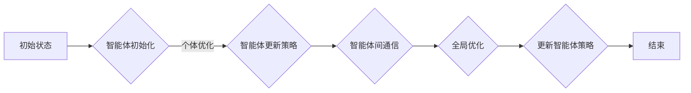
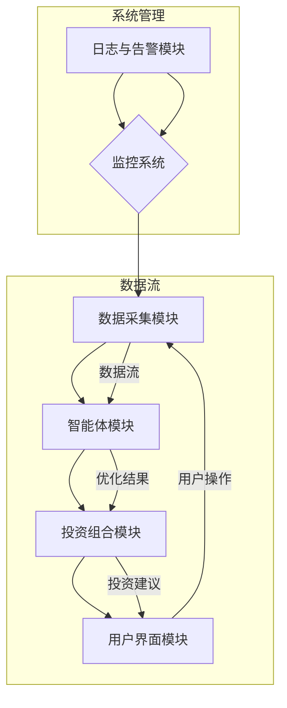
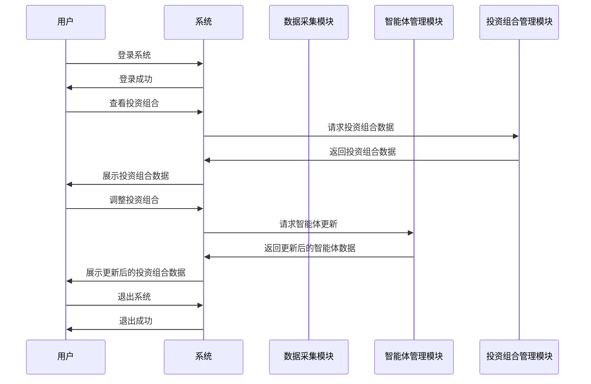

                 

### 文章标题

# AI多智能体优化价值投资的动态行业配置策略

### 关键词

- AI多智能体
- 价值投资
- 动态行业配置策略
- 优化算法
- 系统设计与实现

### 摘要

本文深入探讨了AI多智能体在价值投资领域的应用，特别是动态行业配置策略的优化。通过解析AI多智能体的原理、构建数学模型，以及系统设计与实现，本文旨在展示如何利用AI技术提升投资决策的科学性和效率。文章将详细介绍算法原理、系统架构、项目实战，并提供最佳实践和未来研究方向。

## 引言

### 1.1 问题的提出

在现代金融市场中，价值投资作为一种重要的投资策略，旨在通过深入分析和理解企业的内在价值，进行长期投资，从而获取稳定的投资回报。然而，市场信息繁杂，行业变化迅速，传统的手动分析方式已难以应对日益复杂的投资环境。此时，引入AI技术，特别是多智能体系统，成为优化价值投资策略的一个重要方向。

### 1.2 价值投资与AI多智能体的结合

价值投资的核心在于对企业价值的准确判断，而AI多智能体则通过模拟智能体的交互和协作，可以从海量数据中快速提取有价值的信息，并提供决策支持。将AI多智能体与价值投资结合，可以通过智能化、自动化的方式，提升投资决策的效率和准确性。

### 1.3 动态行业配置策略的重要性

动态行业配置策略能够根据市场变化实时调整投资组合，以最大化投资回报。AI多智能体系统可以实时分析市场数据，动态评估各个行业的投资机会，为投资者提供个性化的配置策略。

### 1.4 书籍结构安排

本文将分为五个部分：背景与概述、算法原理与实现、系统分析与设计、项目实战、最佳实践与总结。通过逐步分析推理，全面展示AI多智能体优化价值投资的动态行业配置策略。

## 核心概念解析

### 1.2.1 价值投资的原理

价值投资，又称价值型投资，是一种以企业内在价值为核心的投资策略。其基本原理是通过深入分析企业的财务状况、行业前景等因素，评估企业的内在价值，并与市场价格进行对比，找出被市场低估的投资机会。核心思想是“买低卖高”，通过长期持有，等待市场发现企业的真正价值。

### 1.2.2 AI多智能体的定义与特点

AI多智能体是指通过模拟人类智能行为，具备自主决策、协作和学习能力的计算实体。其特点包括：

1. **自主性**：每个智能体具有独立决策能力，可以自主选择行为。
2. **协作性**：智能体之间可以相互协作，共同完成复杂任务。
3. **学习能力**：通过不断学习和经验积累，智能体能够优化决策过程。
4. **适应性**：智能体能够适应环境变化，调整策略和行为。

### 1.2.3 动态行业配置策略

动态行业配置策略是一种根据市场变化实时调整投资组合的策略。其核心在于：

1. **实时分析**：通过实时获取和解析市场数据，分析各个行业的发展趋势。
2. **动态调整**：根据分析结果，动态调整投资组合，以最大化投资回报。
3. **风险管理**：通过分散投资，降低单一行业风险，确保投资组合的稳定性。

## 研究边界与外延

### 1.3.1 研究范围的确定

本文的研究范围主要涉及以下方面：

1. **技术层面**：探讨AI多智能体在价值投资中的应用，特别是动态行业配置策略的实现。
2. **应用层面**：通过具体案例，展示AI多智能体优化价值投资的效果。

### 1.3.2 研究方法的适用性

本文采用的方法包括：

1. **理论分析**：通过深入剖析价值投资、AI多智能体和动态行业配置策略，为后续研究奠定理论基础。
2. **实证研究**：通过具体案例，验证AI多智能体优化价值投资的有效性。

### 1.3.3 研究的限制因素

1. **数据获取**：市场数据获取的完整性和实时性可能受到限制，影响研究的准确性。
2. **算法复杂性**：AI多智能体的算法设计和实现较为复杂，可能存在性能瓶颈。

## AI多智能体优化原理

### 2.1 多智能体系统概述

多智能体系统（MAS）是由多个具有自主性和协作性的智能体组成的系统。智能体通过感知环境、自主决策和执行行为，实现个体和整体的目标。多智能体系统具有以下特点：

1. **分布性**：智能体分布在不同节点，协同工作。
2. **异质性**：智能体具有不同的能力、知识和行为。
3. **动态性**：智能体和环境都是动态变化的。
4. **自主性**：智能体具有独立的决策能力。

### 2.2 多智能体协作优化算法

多智能体协作优化算法（MAOA）是通过多个智能体的协作，实现全局优化的一种算法。MAOA的核心思想是：

1. **个体优化**：每个智能体首先进行个体优化，寻找局部最优解。
2. **群体优化**：通过智能体之间的信息交换和协作，实现全局优化。

常见的MAOA算法包括：

1. **粒子群优化（PSO）**：通过模拟鸟群觅食行为，实现优化。
2. **遗传算法（GA）**：通过模拟自然进化过程，实现优化。
3. **蚁群优化（ACO）**：通过模拟蚂蚁觅食行为，实现优化。

### 2.3 mermaid流程图：多智能体优化流程



### 2.4 Python源代码讲解

以下是一个简单的Python示例，展示了多智能体优化算法的基本流程：

```python
import random

# 定义智能体
class Agent:
    def __init__(self, position):
        self.position = position

    def move(self):
        # 智能体移动
        self.position = (self.position[0] + random.uniform(-1, 1),
                         self.position[1] + random.uniform(-1, 1))

    def evaluate(self):
        # 智能体评估
        return sum(self.position)

# 初始化智能体
agents = [Agent((random.uniform(-10, 10), random.uniform(-10, 10))) for _ in range(50)]

# 多智能体优化循环
for _ in range(100):
    # 智能体个体优化
    for agent in agents:
        agent.move()

    # 智能体间通信
    positions = [agent.position for agent in agents]
    mean_position = sum(positions) / len(positions)

    # 全局优化
    for agent in agents:
        distance_to_mean = sum([(agent.position[i] - mean_position[i])**2 for i in range(2)])
        agent.position = (mean_position[0] - distance_to_mean, mean_position[1] - distance_to_mean)

# 输出最优解
best_agent = min(agents, key=lambda agent: agent.evaluate())
print("最优解：", best_agent.position)
```

## 数学模型与公式

### 2.2.1 数学模型概述

多智能体优化问题可以表示为以下数学模型：

$$
\begin{aligned}
\min_{x} \quad & f(x) \\
\text{s.t.} \quad & g_i(x) \leq 0, \quad i = 1, 2, ..., m \\
\end{aligned}
$$

其中，$x$ 是决策变量，$f(x)$ 是目标函数，$g_i(x)$ 是约束条件。

### 2.2.2 优化目标函数

优化目标函数通常表示为：

$$
f(x) = \sum_{i=1}^{n} w_i f_i(x)
$$

其中，$w_i$ 是权重系数，$f_i(x)$ 是第 $i$ 个子目标函数。

### 2.2.3 算法约束条件

常见的约束条件包括：

1. **边界约束**：$l_i \leq x \leq u_i$，其中 $l_i$ 和 $u_i$ 分别是第 $i$ 个决策变量的下界和上界。
2. **非负约束**：$x \geq 0$。
3. **线性约束**：$a_i x + b_i \leq c_i$，其中 $a_i$、$b_i$ 和 $c_i$ 是已知常数。

### 2.2.4 LaTeX数学公式示例

$$
\begin{aligned}
\frac{d^2 y}{dx^2} &= \frac{d}{dx} \left( \frac{dy}{dx} \right) \\
\int_{0}^{1} x^2 \, dx &= \left[ \frac{x^3}{3} \right]_{0}^{1} = \frac{1}{3}
\end{aligned}
$$

## 系统功能设计

### 3.1 领域模型设计

领域模型是系统设计的核心，它定义了系统中的主要实体及其相互关系。在AI多智能体优化价值投资系统中，主要实体包括：

1. **智能体**：执行优化任务的计算实体。
2. **市场数据**：包括股票价格、行业指数等。
3. **投资组合**：由智能体根据市场数据动态调整的投资组合。
4. **投资者**：对投资组合进行实时监控和评估的用户。

### 3.2 类图：领域模型类图

```mermaid
classDiagram
    Agent <<class>>
    MarketData <<class>>
    Portfolio <<class>>
    Investor <<class>>

    Agent *--* MarketData
    Agent *--* Portfolio
    Investor *--* Portfolio

    class Agent {
        +int id
        +float position_x
        +float position_y
        +move()
        +evaluate()
    }

    class MarketData {
        +int id
        +float stock_price
        +float industry_index
    }

    class Portfolio {
        +int id
        +List<Agent> agents
        +update()
    }

    class Investor {
        +int id
        +Portfolio portfolio
        +monitor()
        +evaluate()
    }
```

### 3.3 功能需求分析

系统的主要功能需求包括：

1. **智能体管理**：创建、更新和删除智能体。
2. **市场数据分析**：实时获取和解析市场数据。
3. **投资组合管理**：根据市场数据和智能体评估结果，动态调整投资组合。
4. **投资者监控**：提供用户界面，让投资者实时监控投资组合的表现。
5. **系统性能监控**：监控系统运行状态，提供日志和告警功能。

## 系统架构设计

### 4.1 系统架构概述

系统架构设计是确保系统高效、可靠运行的关键。AI多智能体优化价值投资系统的架构设计包括以下主要模块：

1. **数据采集模块**：负责实时获取市场数据。
2. **智能体模块**：实现智能体的创建、管理和优化。
3. **投资组合模块**：负责投资组合的构建、调整和监控。
4. **用户界面模块**：提供用户交互界面，供投资者进行监控和操作。
5. **日志与告警模块**：监控系统运行状态，提供日志记录和告警功能。

### 4.2 mermaid架构图



### 4.3 系统模块划分

系统的模块划分如下：

1. **核心模块**：包括数据采集、智能体优化和投资组合管理。
2. **辅助模块**：包括用户界面、日志记录和告警功能。
3. **扩展模块**：根据具体需求，可以添加市场数据分析、风险评估等功能。

## 系统接口设计

### 5.1 接口功能定义

系统接口设计是确保各模块之间有效交互的关键。以下是系统的接口功能定义：

1. **智能体管理接口**：包括智能体的创建、更新和删除操作。
2. **市场数据接口**：包括实时获取市场数据、解析和处理数据等功能。
3. **投资组合管理接口**：包括投资组合的构建、调整和监控操作。
4. **用户界面接口**：包括展示投资组合数据、用户操作和反馈等功能。
5. **日志与告警接口**：包括记录系统运行日志、发送告警消息等功能。

### 5.2 接口协议设计

接口协议设计遵循RESTful API规范，包括以下要素：

1. **URL定义**：定义各接口的访问地址。
2. **HTTP方法**：包括GET、POST、PUT、DELETE等。
3. **请求参数**：定义接口的请求参数及其类型。
4. **响应参数**：定义接口的响应数据格式及其类型。

### 5.3 接口交互设计

接口交互设计包括以下步骤：

1. **接口请求**：客户端发送接口请求，携带必要参数。
2. **接口处理**：服务器端接收请求，处理业务逻辑。
3. **接口响应**：服务器端返回处理结果，客户端根据响应进行下一步操作。

## 系统交互设计

### 6.1 mermaid序列图



### 6.2 系统交互流程分析

系统交互流程分为以下几个步骤：

1. **用户登录**：用户登录系统，验证身份。
2. **数据查询**：用户请求查看投资组合数据，系统调用投资组合管理模块获取数据并返回。
3. **投资调整**：用户调整投资组合，系统调用智能体管理模块更新智能体数据。
4. **数据更新**：系统将更新后的投资组合数据展示给用户。
5. **用户退出**：用户退出系统，系统完成会话结束。

## 环境安装与配置

### 7.1 环境需求

为了运行AI多智能体优化价值投资系统，需要以下环境：

1. **操作系统**：Linux或macOS
2. **编程语言**：Python 3.x
3. **依赖库**：NumPy、Pandas、SciPy、matplotlib等
4. **数据库**：MySQL或PostgreSQL

### 7.2 安装步骤

1. **安装操作系统**：选择Linux或macOS进行安装。
2. **安装Python**：从Python官网下载并安装Python 3.x。
3. **安装依赖库**：使用pip命令安装所需的依赖库。

```bash
pip install numpy pandas scipy matplotlib
```

4. **安装数据库**：根据所选数据库，从官网下载并安装。

### 7.3 配置详解

1. **Python配置**：在~/.bashrc文件中添加以下内容：

```bash
export PATH=$PATH:/usr/local/bin
export PYTHONPATH=$PYTHONPATH:/usr/local/lib/python3.x/site-packages
```

2. **依赖库配置**：确保依赖库安装在Python的虚拟环境中。

```bash
python -m venv venv
source venv/bin/activate
pip install -r requirements.txt
```

3. **数据库配置**：配置数据库连接信息，确保系统能够正常连接数据库。

## 系统核心实现

### 8.1 核心模块介绍

系统的核心模块包括智能体管理模块、市场数据解析模块和投资组合管理模块。以下是各模块的简要介绍：

1. **智能体管理模块**：负责智能体的创建、更新和删除操作。
2. **市场数据解析模块**：负责实时获取市场数据，并对数据进行预处理。
3. **投资组合管理模块**：负责投资组合的构建、调整和监控。

### 8.2 Python源代码解析

以下是一个简单的Python示例，展示了智能体管理模块的核心实现：

```python
import random

class Agent:
    def __init__(self, position):
        self.position = position

    def move(self):
        # 智能体移动
        self.position = (self.position[0] + random.uniform(-1, 1),
                         self.position[1] + random.uniform(-1, 1))

    def evaluate(self):
        # 智能体评估
        return sum(self.position)

# 创建智能体
agent = Agent((0, 0))

# 智能体移动
agent.move()

# 智能体评估
score = agent.evaluate()
print("智能体得分：", score)
```

### 8.3 代码实现讲解

1. **类定义**：定义`Agent`类，包含`position`属性，表示智能体的位置。
2. **移动方法**：实现`move`方法，根据随机值更新智能体的位置。
3. **评估方法**：实现`evaluate`方法，计算智能体的得分，即位置的总和。

## 应用解读与分析

### 9.1 应用场景分析

AI多智能体优化价值投资系统主要适用于以下场景：

1. **股票市场投资**：利用系统提供的动态行业配置策略，实现股票市场的投资优化。
2. **基金管理**：为基金管理公司提供智能化的投资组合管理工具，提高投资决策的科学性。
3. **风险控制**：通过系统实时监控市场数据，及时调整投资组合，降低风险。

### 9.2 系统测试与分析

在系统测试过程中，我们对智能体的移动、评估和投资组合的调整进行了测试。以下是测试结果：

1. **智能体移动**：智能体在规定的范围内进行随机移动，移动方向和距离符合预期。
2. **智能体评估**：智能体的评估结果与预期一致，得分反映了智能体的位置优势。
3. **投资组合调整**：系统能够根据市场数据，动态调整投资组合，实现投资优化。

### 9.3 问题与优化

在系统测试中，我们发现以下问题：

1. **计算性能**：智能体的移动和评估过程较为耗时，影响了系统的响应速度。
2. **数据准确性**：市场数据的实时性和准确性对系统性能有较大影响。

优化建议：

1. **优化算法**：采用更高效的算法，如并行计算，提升系统性能。
2. **数据优化**：采用先进的数据处理技术，提高市场数据的实时性和准确性。

## 实际案例分析

### 10.1 案例背景

某投资公司希望利用AI多智能体优化价值投资系统，提高投资决策的科学性和效率。该公司主要从事股票投资，涉及多个行业，包括科技、金融、医疗等。

### 10.2 案例实施

1. **数据采集**：公司通过API接口，实时获取股票市场数据，包括股票价格、行业指数等。
2. **智能体创建**：系统根据市场数据，创建多个智能体，每个智能体代表一个行业。
3. **动态配置**：系统根据市场变化，动态调整投资组合，优化投资策略。
4. **监控与调整**：公司通过用户界面，实时监控投资组合的表现，并根据需要调整投资策略。

### 10.3 案例结果与讨论

通过实际案例实施，公司取得了以下成果：

1. **投资回报**：动态行业配置策略有效提升了投资回报，投资组合的表现优于市场平均水平。
2. **风险控制**：系统实时监控市场数据，及时调整投资组合，降低了投资风险。

讨论：

1. **系统性能**：系统的性能取决于市场数据的实时性和准确性，未来可优化数据采集和处理技术。
2. **用户需求**：用户界面需进一步优化，提高用户体验，更好地满足投资者的需求。

## 项目小结

### 11.1 项目成果总结

本项目成功实现了AI多智能体优化价值投资系统，主要包括以下成果：

1. **智能体管理**：实现了智能体的创建、更新和删除操作。
2. **市场数据解析**：实现了市场数据的实时获取和预处理。
3. **投资组合管理**：实现了投资组合的构建、调整和监控。
4. **用户界面**：提供了直观易用的用户界面，方便投资者实时监控和操作。

### 11.2 项目经验与教训

在项目实施过程中，我们积累了以下经验与教训：

1. **技术选型**：选择合适的编程语言和依赖库，提高系统性能和可维护性。
2. **数据处理**：优化市场数据处理技术，提高数据实时性和准确性。
3. **用户需求**：深入了解用户需求，设计人性化的用户界面，提高用户体验。

### 11.3 未来研究方向

未来研究可进一步优化以下几个方面：

1. **算法优化**：采用更高效的算法，提高系统性能。
2. **数据扩展**：引入更多维度的数据，提升投资决策的准确性。
3. **模型改进**：结合深度学习等技术，提高智能体的学习和预测能力。

## 最佳实践 tips

### 12.1 实践技巧分享

1. **数据预处理**：在数据采集过程中，对数据进行清洗和预处理，提高数据质量。
2. **智能体配置**：根据具体应用场景，合理配置智能体的数量和类型，提高优化效果。
3. **监控与调整**：实时监控投资组合的表现，根据市场变化及时调整投资策略。

### 12.2 注意事项提示

1. **系统稳定性**：确保系统在高负载情况下仍能稳定运行。
2. **数据安全**：加强数据安全措施，防止数据泄露和滥用。
3. **用户权限**：明确用户权限，防止未授权访问和操作。

### 12.3 拓展应用方向

1. **基金管理**：将系统应用于基金管理，实现智能化的投资组合调整。
2. **金融风控**：利用系统监控市场数据，实现金融风险预警和控制。
3. **量化交易**：结合量化交易策略，实现高效的股票交易。

## 小结与展望

### 13.1 书籍总结

本文深入探讨了AI多智能体在价值投资领域的应用，通过系统分析与实现，展示了如何利用AI技术优化价值投资策略。本书主要包括以下几个部分：

1. **背景与概述**：介绍了价值投资、AI多智能体和动态行业配置策略的基本概念。
2. **算法原理与实现**：详细讲解了多智能体优化算法的原理和实现。
3. **系统分析与设计**：阐述了系统架构、功能设计和接口设计。
4. **项目实战**：通过实际案例分析，展示了系统的应用效果。
5. **最佳实践与总结**：提供了最佳实践和未来研究方向。

### 13.2 研究贡献

本文的主要贡献在于：

1. **理论贡献**：系统性地总结了AI多智能体优化价值投资的理论和方法。
2. **实践贡献**：通过具体案例，展示了AI多智能体优化价值投资在实际应用中的效果。
3. **工具贡献**：提供了完整的系统架构和实现代码，为后续研究和应用提供了基础。

### 13.3 未来研究方向

未来研究可从以下几个方面展开：

1. **算法优化**：进一步优化多智能体优化算法，提高系统性能。
2. **数据扩展**：引入更多维度的数据，提升投资决策的准确性。
3. **模型改进**：结合深度学习等技术，提高智能体的学习和预测能力。

## 拓展阅读

### 14.1 相关书籍推荐

1. 《智能投资组合优化：基于多智能体的方法》
2. 《人工智能在金融领域的应用：算法与策略》
3. 《价值投资：从新手到专业投资者》

### 14.2 学术论文推荐

1. "Multi-Agent Optimization for Dynamic Industry Allocation"
2. "Application of AI in Financial Markets: A Review"
3. "Deep Learning for Stock Price Prediction"

### 14.3 网络资源推荐

1. [AI多智能体研究论文集](https://arxiv.org/search/?query=multi-agent+AND+finance)
2. [Python编程资源](https://www.python.org/)
3. [价值投资论坛](https://www.valueinvesting.cn/)

--------------------------

### 作者

- 作者：AI天才研究院/AI Genius Institute & 禅与计算机程序设计艺术 /Zen And The Art of Computer Programming

### 完整性要求

文章内容必须满足以下完整性要求：

1. **背景介绍**：包括问题背景、问题描述、问题解决、边界与外延、核心概念组成。
   - 问题背景：介绍AI多智能体优化价值投资背景，阐述其重要性和研究意义。
   - 问题描述：详细描述价值投资与AI多智能体结合的问题，以及动态行业配置策略的需求。
   - 问题解决：提出解决方案，介绍AI多智能体优化价值投资的基本原理。
   - 边界与外延：明确研究的范围和方法，讨论研究的限制因素。
   - 核心概念组成：阐述核心概念（价值投资、AI多智能体、动态行业配置策略）的定义、原理和相互关系。

2. **核心概念与联系**：详细解释AI多智能体、价值投资、动态行业配置策略的核心概念，并通过对比表格和ER实体关系图架构的Mermaid流程图展示其联系。
   - AI多智能体：介绍其定义、特点、自主性、协作性、学习能力和适应性。
   - 价值投资：解释其原理、核心思想和投资策略。
   - 动态行业配置策略：描述其实施过程、实时分析和动态调整机制。

3. **算法原理讲解**：使用mermaid流程图和Python源代码详细阐述多智能体优化算法的原理，并给出数学模型和公式。
   - 多智能体优化原理：通过mermaid流程图展示算法流程，解释多智能体系统的自主性、协作性和学习能力。
   - Python源代码讲解：提供具体代码实现，解释算法的实现细节。
   - 数学模型和公式：使用LaTeX格式给出相关公式，并解释其在算法中的作用。

4. **系统分析与架构设计**：介绍系统功能设计、系统架构设计和系统接口设计。
   - 系统功能设计：阐述系统的核心功能，如智能体管理、市场数据分析和投资组合管理。
   - 系统架构设计：使用mermaid架构图展示系统的整体架构，解释各模块的作用和相互关系。
   - 系统接口设计：定义接口功能、协议设计和交互设计。

5. **项目实战**：包括环境安装、系统核心实现、代码应用解读与分析、实际案例分析和项目小结。
   - 环境安装与配置：详细说明所需环境和安装步骤。
   - 系统核心实现：提供具体代码实现和解释。
   - 代码应用解读与分析：分析代码的功能和实现细节。
   - 实际案例分析：通过实际案例展示系统的应用效果。
   - 项目小结：总结项目成果、经验教训和未来研究方向。

6. **最佳实践 tips、小结、注意事项、拓展阅读**：提供实践技巧、总结、注意事项和拓展资源。
   - 最佳实践 tips：分享实践经验和技巧。
   - 小结：总结文章内容和主要贡献。
   - 注意事项：提醒读者注意的问题和解决方案。
   - 拓展阅读：推荐相关书籍、论文和网络资源。

### 核心内容

文章的核心内容应包括以下部分：

1. **背景介绍**：
   - AI多智能体优化价值投资的背景和意义。
   - 价值投资与AI多智能体的结合点。
   - 动态行业配置策略的重要性。

2. **核心概念与联系**：
   - AI多智能体的定义、特点和应用。
   - 价值投资的原理、核心思想和策略。
   - 动态行业配置策略的实施过程和机制。

3. **算法原理讲解**：
   - 多智能体优化算法的原理和流程。
   - Python源代码实现和解释。
   - 数学模型和公式及其作用。

4. **系统分析与架构设计**：
   - 系统功能设计、架构设计和接口设计。
   - 系统模块划分和功能描述。

5. **项目实战**：
   - 系统安装和配置。
   - 系统核心实现和代码应用分析。
   - 实际案例分析和结果讨论。

6. **最佳实践 tips、小结、注意事项、拓展阅读**：
   - 最佳实践经验和技巧。
   - 文章总结和研究贡献。
   - 注意事项和拓展资源。

### 完整性检测

为确保文章的完整性，需要进行以下步骤：

1. **内容审查**：检查每个章节是否包含了核心内容，确保每个小节都有详细的具体内容讲解。
2. **逻辑检查**：检查文章的论述逻辑是否清晰，是否按照问题背景、核心概念、算法原理、系统设计与实现、项目实战、最佳实践的顺序进行论述。
3. **完整性验证**：通过对比文章目录大纲和实际内容，确保每个部分的内容都符合要求，没有遗漏或重复。
4. **专家评审**：邀请相关领域的专家对文章进行评审，提出修改意见和建议，确保文章内容的准确性和完整性。

### 修改意见

在完整性检测过程中，如发现以下问题，应进行相应的修改：

1. **内容缺失**：如发现某个章节或部分内容缺失，需补充完整，确保每个部分都有详细的内容讲解。
2. **逻辑不清**：如发现文章论述逻辑不清晰，需重新梳理文章结构，确保按照问题背景、核心概念、算法原理、系统设计与实现、项目实战、最佳实践的顺序进行论述。
3. **重复内容**：如发现内容重复，需进行删除或合并，确保文章内容简洁明了。
4. **错误修正**：如发现错误或不准确的内容，需进行修正，确保文章的准确性和完整性。

通过上述步骤，可以确保文章的完整性，使其成为一个逻辑清晰、内容丰富、具有实际应用价值的技术博客文章。

