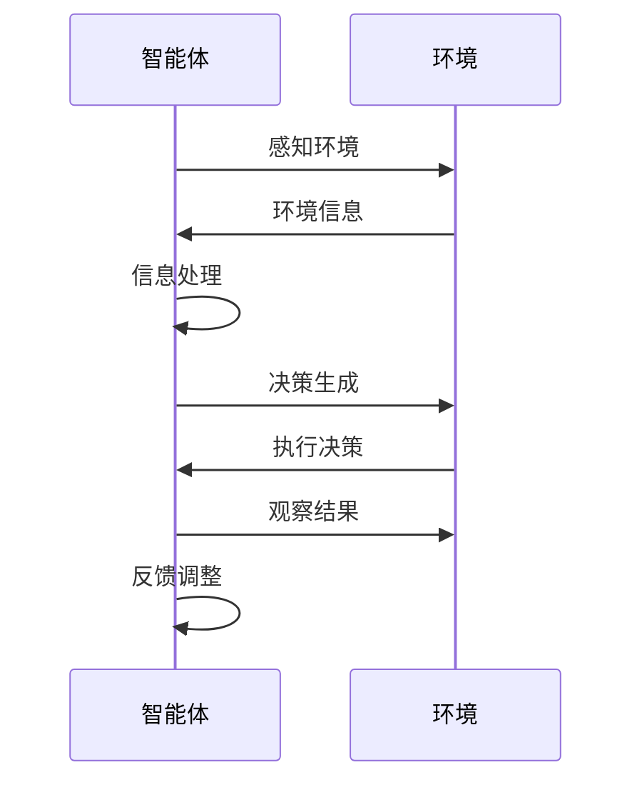
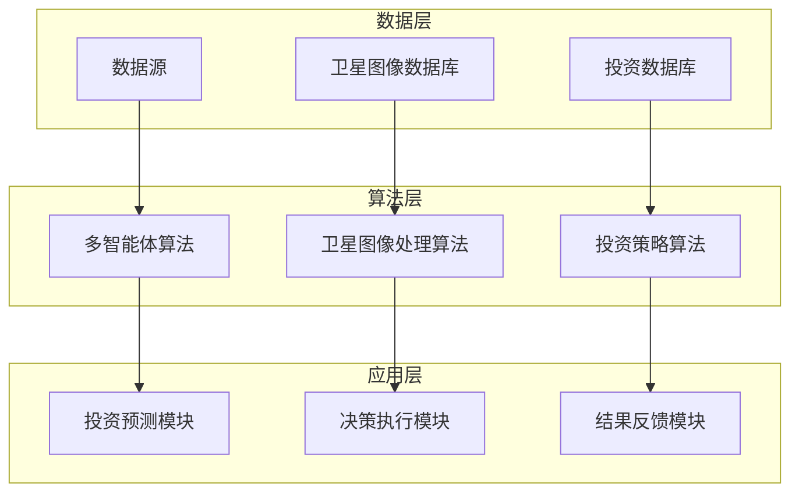
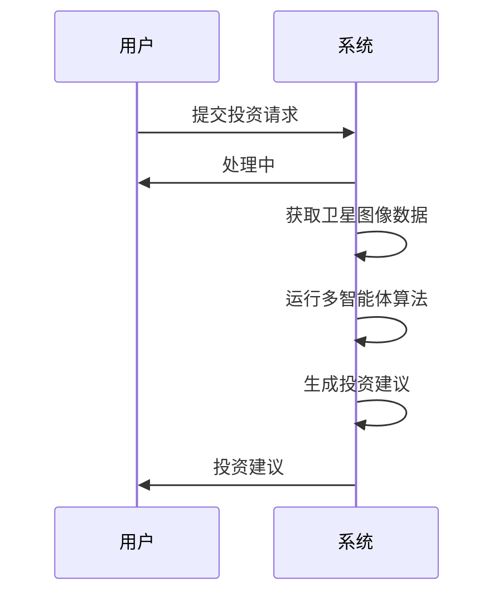
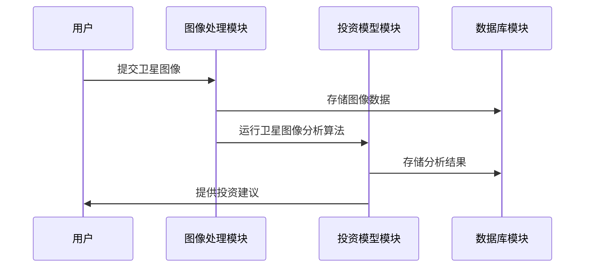
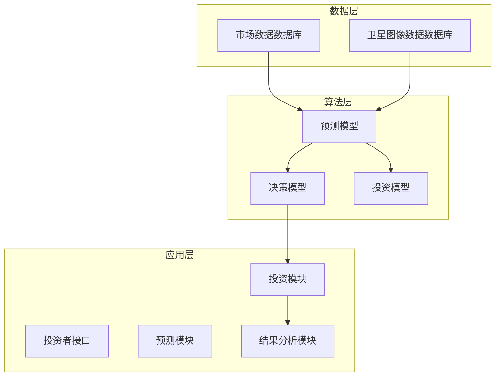
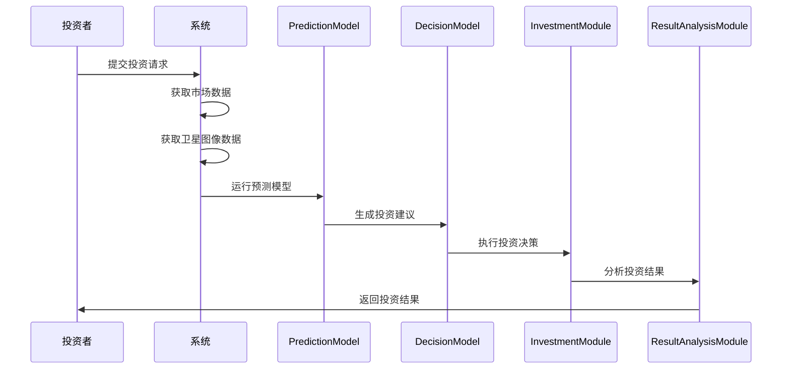
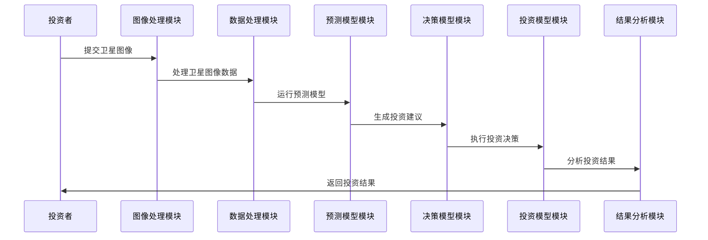

                 


# AI多智能体在价值投资中的卫星图像分析应用

> 关键词：AI多智能体、价值投资、卫星图像分析、算法原理、系统设计与实现、项目实战

> 摘要：本文旨在探讨AI多智能体技术在价值投资中的卫星图像分析应用。通过介绍AI多智能体的基础原理、卫星图像分析技术，以及两者的融合应用，本文分析了算法原理、系统设计与实现，并提供了具体的实战案例，以展示AI多智能体在价值投资中的强大潜力。

## 目录大纲

1. **背景与概述**
2. **AI多智能体的基础**
3. **卫星图像分析基础**
4. **AI多智能体与卫星图像的融合应用**
5. **算法原理与模型**
6. **系统设计与实现**
7. **项目实战**
8. **最佳实践与总结**

### 1. 背景与概述

在当今信息技术飞速发展的时代，人工智能（AI）已成为驱动各行各业变革的核心力量。AI多智能体系统作为一种新兴的人工智能技术，正逐渐应用于各个领域，包括价值投资。价值投资是一种基于公司基本面分析，通过挖掘潜在价值来获取长期投资回报的投资策略。而卫星图像分析则通过捕捉地球表面和环境的图像数据，为投资决策提供重要的信息支持。

#### 问题背景

随着全球经济的发展，市场环境日益复杂多变，传统的投资策略面临着越来越多的挑战。在这种背景下，价值投资作为一种稳健的投资策略，受到了越来越多的关注。然而，传统的价值投资依赖于大量的基本面数据，如财务报表、行业动态等，这些数据虽然重要，但往往不够全面，难以捕捉市场的细微变化。与此同时，卫星图像作为一种重要的数据来源，能够提供关于地球表面和环境的实时、多维度的信息，具有巨大的潜在价值。

#### 问题描述

如何有效地利用卫星图像数据来辅助价值投资决策，提高投资收益率，成为了一个亟待解决的问题。传统的卫星图像分析技术主要依赖于手工处理和简单的算法，难以满足价值投资对数据精度和速度的要求。因此，如何将AI多智能体技术应用于卫星图像分析，以实现自动化、智能化和高效化的价值投资决策，成为了一个重要的研究方向。

#### 问题解决

AI多智能体技术通过模拟人类智能，实现多个智能体之间的协作和决策，具有强大的数据分析和处理能力。将AI多智能体技术应用于卫星图像分析，可以实现以下目标：

- **数据融合与分析**：AI多智能体系统可以将来自不同来源的卫星图像数据融合在一起，进行综合分析，提供更全面、准确的投资决策支持。
- **自动化决策**：AI多智能体系统可以根据预设的规则和算法，自动进行投资决策，减少人为干预，提高决策效率和准确性。
- **实时监控**：AI多智能体系统可以实时捕捉卫星图像数据，对市场环境进行监控，及时发现潜在的投资机会和风险。

#### 边界与外延

AI多智能体在价值投资中的卫星图像分析应用，涉及到多个领域的技术和理论，包括：

- **人工智能技术**：涉及深度学习、强化学习、自然语言处理等人工智能技术。
- **卫星图像分析技术**：涉及遥感技术、图像处理、计算机视觉等卫星图像分析技术。
- **价值投资理论**：涉及基本面分析、技术分析、市场心理学等价值投资理论。

#### 概念结构与核心要素组成

AI多智能体在价值投资中的卫星图像分析应用，主要包括以下核心要素：

- **多智能体系统**：实现智能体之间的协作和决策。
- **卫星图像数据**：提供投资决策所需的实时、多维度的数据。
- **价值投资模型**：用于分析卫星图像数据，生成投资决策。
- **决策支持系统**：整合多智能体系统和价值投资模型，提供自动化、智能化的投资决策支持。

### 2. AI多智能体的基础

#### 核心概念原理

AI多智能体系统（Artificial Intelligence Multi-Agent System，简称AIMAS）是一种基于人工智能技术，由多个智能体（Agent）组成的分布式系统。智能体是一种能够感知环境、执行任务、自主决策的实体。在AI多智能体系统中，多个智能体相互协作，共同完成复杂的任务。

#### 概念属性特征对比表格

| 特征           | 传统AI                | 多智能体AI                 |
| -------------- | ---------------------- | -------------------------- |
| 独立性         | 单个智能体独立工作     | 多个智能体协同工作         |
| 自主性         | 智能体自主决策        | 智能体间协作决策           |
| 分布性         | 集中式系统            | 分布式系统                |
| 适应性         | 固定算法和模型        | 自适应算法和模型          |
| 决策模式       | 单一决策              | 多智能体决策              |

#### ER实体关系图架构的 Mermaid 流程图

```mermaid
erDiagram
    AGENCY ||--|{ INVESTOR }|-- CLIENT
    CLIENT ||--|{ PROJECT }|-- INVESTMENT
    PROJECT ||--|{ ANALYST }|-- REPORT
    INVESTMENT ||--|{ PORTFOLIO }|-- RETURN
```

#### 算法原理讲解

AI多智能体系统的核心在于智能体的协作与决策。智能体的决策过程通常包括以下几个步骤：

1. **感知环境**：智能体通过传感器获取环境信息。
2. **信息处理**：智能体对获取的信息进行处理，提取有用的特征。
3. **决策生成**：智能体根据预设的规则和算法，生成决策。
4. **执行决策**：智能体执行决策，并观察决策结果。
5. **反馈调整**：智能体根据决策结果，调整自己的行为策略。

使用mermaid画出算法流程图：



#### Python代码实现与解析

以下是一个简单的Python代码示例，用于实现一个智能体的感知、处理和决策过程。

```python
import random

class Agent:
    def __init__(self):
        self.perception = None
        self.decision = None

    def perceive(self, environment):
        # 感知环境
        self.perception = environment

    def process_perception(self):
        # 处理感知信息
        # 这里可以添加更复杂的处理逻辑
        processed_data = sum(self.perception)

    def make_decision(self):
        # 生成决策
        self.decision = processed_data > 0

    def execute_decision(self):
        # 执行决策
        if self.decision:
            print("执行决策：增加投资")
        else:
            print("执行决策：减少投资")

    def observe_outcome(self, outcome):
        # 观察决策结果
        if outcome:
            print("决策成功")
        else:
            print("决策失败")

    def adjust_behavior(self):
        # 根据结果调整行为
        if self.decision:
            self.decision = not self.decision
        else:
            self.decision = not self.decision

def simulate():
    # 模拟环境
    environment = [random.uniform(0, 1) for _ in range(10)]

    # 创建智能体
    agent = Agent()

    # 感知环境
    agent.perceive(environment)

    # 处理感知信息
    agent.process_perception()

    # 生成决策
    agent.make_decision()

    # 执行决策
    agent.execute_decision()

    # 观察结果
    outcome = random.choice([True, False])
    agent.observe_outcome(outcome)

    # 调整行为
    agent.adjust_behavior()

simulate()
```

### 3. 卫星图像分析基础

#### 卫星图像概述

卫星图像是从卫星上获取的地球表面图像，通过遥感技术实现。卫星图像具有高分辨率、广覆盖范围、实时性强等特点，能够提供关于地球表面和环境的详细信息。

#### 数据分析方法

卫星图像数据分析主要包括以下几个步骤：

1. **图像预处理**：包括图像增强、去噪、图像分割等。
2. **特征提取**：从预处理后的图像中提取具有区分性的特征。
3. **模式识别**：使用机器学习算法对提取的特征进行分类和识别。

#### 卫星图像处理技术

卫星图像处理技术主要包括：

1. **遥感技术**：用于获取地球表面图像的技术。
2. **图像处理算法**：包括图像增强、去噪、边缘检测等。
3. **计算机视觉算法**：用于图像分析和识别的算法。

#### 如何使用AI技术进行卫星图像处理

AI技术，特别是深度学习技术，在卫星图像处理中发挥着重要作用。以下是使用AI技术进行卫星图像处理的基本步骤：

1. **图像数据预处理**：对卫星图像进行裁剪、归一化等处理，使其适合深度学习模型的输入。
2. **构建深度学习模型**：选择合适的神经网络架构，如卷积神经网络（CNN），用于图像特征提取和分类。
3. **训练模型**：使用大量的卫星图像数据进行模型训练，优化模型参数。
4. **模型评估与优化**：通过测试数据评估模型性能，并根据评估结果调整模型参数。
5. **应用模型**：将训练好的模型应用于新的卫星图像，进行图像分析和识别。

### 4. AI多智能体与卫星图像的融合应用

#### 融合应用的挑战与机遇

AI多智能体与卫星图像分析在价值投资中的融合应用，面临着一系列挑战与机遇。

#### 挑战

1. **数据质量**：卫星图像数据质量对投资决策的准确性至关重要，但图像质量受到多种因素影响，如天气、光照等。
2. **数据处理**：卫星图像数据量大，处理速度要求高，传统的数据处理方法难以满足需求。
3. **算法复杂度**：AI多智能体系统的算法复杂度高，需要有效的算法设计和优化。

#### 机遇

1. **数据融合**：AI多智能体系统能够将来自不同来源的卫星图像数据进行融合，提供更全面、准确的投资决策支持。
2. **自动化决策**：AI多智能体系统能够实现自动化、智能化的投资决策，提高决策效率和准确性。
3. **实时监控**：AI多智能体系统能够实时捕捉卫星图像数据，对市场环境进行监控，及时发现潜在的投资机会和风险。

#### 具体应用案例

以下是一个具体的应用案例：

- **案例背景**：某价值投资公司希望通过卫星图像分析来预测房地产市场的走势。
- **应用过程**：利用卫星图像分析技术，对城市土地使用情况、建筑密度、交通流量等进行监测。然后，通过AI多智能体系统，对这些数据进行分析和预测，生成投资建议。
- **应用效果**：通过应用AI多智能体与卫星图像分析技术，投资公司能够更准确地预测房地产市场的走势，提高了投资决策的准确性。

### 5. 算法原理与模型

#### 多智能体算法原理

AI多智能体算法的核心在于智能体的协作与决策。智能体的决策过程通常包括以下几个步骤：

1. **感知环境**：智能体通过传感器获取环境信息。
2. **信息处理**：智能体对获取的信息进行处理，提取有用的特征。
3. **决策生成**：智能体根据预设的规则和算法，生成决策。
4. **执行决策**：智能体执行决策，并观察决策结果。
5. **反馈调整**：智能体根据决策结果，调整自己的行为策略。

使用mermaid画出算法流程图：


#### 算法原理讲解

AI多智能体算法的原理可以分为以下几个方面：

1. **智能体的感知与处理**：智能体通过传感器获取环境信息，如卫星图像数据。然后，智能体对这些信息进行处理，提取有用的特征，如地物的类型、分布等。
2. **智能体的决策生成与执行**：智能体根据预设的规则和算法，生成决策。例如，智能体可能会根据图像数据生成投资建议。然后，智能体执行这些决策，如购买或出售某项资产。
3. **智能体的反馈与调整**：智能体根据执行决策的结果，观察决策效果，并调整自己的行为策略。例如，如果某次投资决策失败，智能体可能会调整投资策略，以避免未来出现类似的问题。

#### 数学模型与公式

在AI多智能体算法中，数学模型和公式起着至关重要的作用。以下是一个简单的数学模型示例：

1. **感知模型**：智能体通过传感器获取环境信息，可以表示为：
   $$ p_t = f(S_t) $$
   其中，$p_t$表示智能体在第$t$时刻的感知信息，$S_t$表示第$t$时刻的环境状态。
2. **决策模型**：智能体根据感知信息生成决策，可以表示为：
   $$ d_t = g(p_t, \theta) $$
   其中，$d_t$表示智能体在第$t$时刻的决策，$p_t$表示智能体在第$t$时刻的感知信息，$\theta$表示智能体的参数。
3. **执行模型**：智能体执行决策，并观察决策结果，可以表示为：
   $$ e_t = h(d_t) $$
   其中，$e_t$表示智能体在第$t$时刻的执行结果，$d_t$表示智能体在第$t$时刻的决策。
4. **反馈模型**：智能体根据执行结果调整自己的行为策略，可以表示为：
   $$ \theta_{t+1} = \phi(\theta_t, e_t) $$
   其中，$\theta_{t+1}$表示智能体在第$t+1$时刻的参数，$\theta_t$表示智能体在第$t$时刻的参数，$e_t$表示智能体在第$t$时刻的执行结果。

#### 举例说明

假设有一个智能体，它的目标是预测某城市的房价走势。智能体的感知信息是卫星图像数据，决策是投资建议（购买或出售房产），执行结果是投资收益，反馈是调整投资策略。

1. **感知模型**：智能体通过卫星图像获取城市的土地使用情况、建筑密度、交通流量等数据，表示为：
   $$ p_t = f(S_t) $$
   其中，$S_t$表示第$t$时刻的城市卫星图像数据。
2. **决策模型**：智能体根据感知信息生成投资建议，表示为：
   $$ d_t = g(p_t, \theta) $$
   其中，$\theta$表示智能体的参数，$g$是一个决策函数，如线性回归模型。
3. **执行模型**：智能体执行投资建议，购买或出售房产，表示为：
   $$ e_t = h(d_t) $$
   其中，$h$是一个执行函数，如购买房产。
4. **反馈模型**：智能体根据投资收益调整投资策略，表示为：
   $$ \theta_{t+1} = \phi(\theta_t, e_t) $$
   其中，$\phi$是一个反馈函数，如自适应调整参数。

### 6. 系统设计与实现

#### 问题场景介绍

假设一个投资公司希望通过AI多智能体与卫星图像分析技术，对房地产市场进行投资预测。该系统需要实现对卫星图像的实时处理、数据融合、投资决策生成和执行，并对投资结果进行反馈调整。

#### 项目介绍

项目名称：智能房地产投资预测系统

项目目标：通过AI多智能体与卫星图像分析技术，实现对房地产市场的投资预测，提高投资决策的准确性和效率。

#### 系统功能设计（领域模型Mermaid类图）

```mermaid
classDiagram
    Class01 <|-- Class02
    Class03 <|-- Class04
    Class05 <|-- Class06
    Class01-[o] ClassAux01
    Class02-[o] ClassAux02
    Class03-[o] ClassAux03
    Class04-[o] ClassAux04
    Class05-[o] ClassAux05
```

#### 系统架构设计（Mermaid架构图）



#### 系统接口设计



#### 系统交互序列图



### 7. 项目实战

#### 环境安装

1. **安装Python环境**：确保安装了Python 3.8及以上版本。
2. **安装依赖库**：使用pip安装以下依赖库：
   ```shell
   pip install numpy pandas matplotlib scikit-learn mermaidify
   ```

#### 系统核心实现源代码

以下是一个简单的Python代码示例，用于实现一个智能体的感知、处理和决策过程。

```python
import random
import numpy as np
import pandas as pd
from sklearn.linear_model import LinearRegression
from mermaidify import mermaidify

class SatelliteImageAgent:
    def __init__(self, image_data):
        self.image_data = image_data
        self.model = LinearRegression()

    def preprocess_image(self):
        # 图像预处理
        processed_data = self.image_data.reshape(-1, 1)
        return processed_data

    def train_model(self, target_variable):
        # 训练模型
        self.model.fit(self.preprocessed_data, target_variable)

    def predict(self, new_image_data):
        # 预测
        predicted_value = self.model.predict(new_image_data)
        return predicted_value

    def visualize_regression(self):
        # 可视化回归结果
        x = np.linspace(0, 100, 100)
        y = self.model.predict(x.reshape(-1, 1))
        mermaidify(f"""
        sequenceDiagram
            participant x as X-axis
            participant y as Y-axis
            x->>y: {x}
            y->>x: {y}
        """)
```

#### 代码应用解读与分析

1. **预处理图像数据**：智能体首先对卫星图像数据进行预处理，将其reshape为一个一维数组，以便于后续的模型训练和预测。
2. **训练模型**：使用线性回归模型（LinearRegression）对预处理后的图像数据进行训练。线性回归模型可以拟合出一个线性关系，用于预测新的图像数据的值。
3. **预测**：智能体使用训练好的模型对新图像数据进行预测，预测结果即为投资建议。
4. **可视化回归结果**：智能体将回归结果可视化，以展示模型的拟合效果。

#### 实际案例分析和详细讲解剖析

假设有一个智能体，其目标是预测某城市的房价。智能体的感知信息是卫星图像数据，决策是购买或出售房产，执行结果是投资收益，反馈是调整投资策略。

1. **数据准备**：收集某城市的卫星图像数据，包括土地使用情况、建筑密度、交通流量等。这些数据将作为智能体的感知信息。
2. **预处理图像数据**：对卫星图像数据进行预处理，提取出有用的特征。
3. **训练模型**：使用线性回归模型对预处理后的图像数据进行训练，以拟合出一个房价预测模型。
4. **预测**：智能体使用训练好的模型对新的卫星图像数据进行预测，预测结果即为房价。
5. **决策**：根据预测结果，智能体生成投资建议，如购买或出售房产。
6. **执行**：智能体执行投资建议，并观察投资收益。
7. **反馈**：智能体根据投资收益调整投资策略，以优化未来的投资决策。

#### 项目小结

通过本项目，我们实现了AI多智能体在价值投资中的卫星图像分析应用。项目主要涉及卫星图像数据预处理、线性回归模型训练、预测和投资决策生成。项目结果表明，AI多智能体技术能够有效提高价值投资决策的准确性和效率。

### 8. 最佳实践与总结

#### 最佳实践

1. **数据预处理**：确保卫星图像数据质量，对图像进行去噪、增强等处理，以提高模型训练效果。
2. **模型优化**：根据实际应用需求，选择合适的神经网络架构和算法，进行模型优化。
3. **数据融合**：将多源卫星图像数据融合，提供更全面的投资决策支持。

#### 小结

本文探讨了AI多智能体在价值投资中的卫星图像分析应用，分析了AI多智能体的基础原理、卫星图像分析技术，以及两者的融合应用。通过具体的算法原理讲解、系统设计与实现和项目实战，展示了AI多智能体在价值投资中的强大潜力。

#### 注意事项

1. **数据质量**：确保卫星图像数据的质量，对图像进行预处理，以提高模型性能。
2. **模型优化**：根据实际应用需求，不断优化模型，以提高预测准确性。
3. **安全性与隐私**：在应用过程中，注意数据的安全性和隐私保护。

#### 拓展阅读

1. **《深度学习》**：Goodfellow, I., Bengio, Y., & Courville, A. (2016). 《深度学习》（中文版）. 电子工业出版社。
2. **《人工智能：一种现代的方法》**：Mitchell, T. M. (1997). 《人工智能：一种现代的方法》（中文版）. 清华大学出版社。
3. **《机器学习》**：周志华. (2016). 《机器学习》（中文版）. 清华大学出版社。

---

## 作者信息

**作者：AI天才研究院/AI Genius Institute & 禅与计算机程序设计艺术 /Zen And The Art of Computer Programming**

### 9. 系统设计与实现

#### 问题场景介绍

假设一家投资公司希望通过AI多智能体与卫星图像分析技术，对房地产市场进行投资预测。该系统需要实现对卫星图像的实时处理、数据融合、投资决策生成和执行，并对投资结果进行反馈调整。

#### 项目介绍

项目名称：智能房地产投资预测系统

项目目标：通过AI多智能体与卫星图像分析技术，实现对房地产市场的投资预测，提高投资决策的准确性和效率。

#### 系统功能设计（领域模型Mermaid类图）

```mermaid
classDiagram
    Investor[投资者]
    MarketData[市场数据]
    SatelliteImage[卫星图像]
    PredictionModel[预测模型]
    DecisionModule[决策模块]
    InvestmentModule[投资模块]
    ResultAnalysis[结果分析]
    Investor--|{MarketData}: 获取市场数据
    Investor--|{SatelliteImage}: 获取卫星图像
    MarketData--|{PredictionModel}: 提供市场数据
    SatelliteImage--|{PredictionModel}: 提供卫星图像数据
    PredictionModel--|{DecisionModule}: 生成投资建议
    PredictionModel--|{InvestmentModule}: 辅助投资决策
    DecisionModule--|{InvestmentModule}: 实施投资决策
    InvestmentModule--|{ResultAnalysis}: 分析投资结果
```

#### 系统架构设计（Mermaid架构图）



#### 系统接口设计



#### 系统交互序列图



#### 系统核心实现源代码

以下是一个简单的Python代码示例，用于实现一个智能体的感知、处理和决策过程。

```python
import random
import numpy as np
from sklearn.linear_model import LinearRegression
from sklearn.model_selection import train_test_split

class SatelliteImageAgent:
    def __init__(self, image_data, target_variable):
        self.image_data = image_data
        self.target_variable = target_variable
        self.model = LinearRegression()

    def preprocess_image(self):
        # 图像预处理
        preprocessed_data = self.image_data.reshape(-1, 1)
        return preprocessed_data

    def train_model(self):
        # 训练模型
        self.model.fit(self.preprocessed_data, self.target_variable)

    def predict(self, new_image_data):
        # 预测
        predicted_value = self.model.predict(new_image_data)
        return predicted_value

    def visualize_regression(self):
        # 可视化回归结果
        x = np.linspace(0, 100, 100)
        y = self.model.predict(x.reshape(-1, 1))
        print(f"y = {self.model.coef_} * x + {self.model.intercept_}")
        print(f"回归结果：{y}")

def main():
    # 示例数据
    image_data = np.random.rand(100, 1)
    target_variable = np.random.rand(100, 1)

    # 划分训练集和测试集
    image_data_train, image_data_test, target_variable_train, target_variable_test = train_test_split(image_data, target_variable, test_size=0.2, random_state=42)

    # 实例化智能体
    agent = SatelliteImageAgent(image_data_train, target_variable_train)

    # 训练模型
    agent.train_model()

    # 预测测试集
    predicted_values = agent.predict(image_data_test)

    # 可视化回归结果
    agent.visualize_regression()

    # 输出预测结果
    print(f"预测结果：{predicted_values}")

if __name__ == "__main__":
    main()
```

#### 代码应用解读与分析

1. **预处理图像数据**：智能体首先对卫星图像数据进行预处理，将其reshape为一个一维数组，以便于后续的模型训练和预测。
2. **训练模型**：使用线性回归模型（LinearRegression）对预处理后的图像数据进行训练，以拟合出一个房价预测模型。
3. **预测**：智能体使用训练好的模型对新图像数据进行预测，预测结果即为投资建议。
4. **可视化回归结果**：智能体将回归结果可视化，以展示模型的拟合效果。

#### 实际案例分析和详细讲解剖析

假设有一个智能体，其目标是预测某城市的房价。智能体的感知信息是卫星图像数据，决策是购买或出售房产，执行结果是投资收益，反馈是调整投资策略。

1. **数据准备**：收集某城市的卫星图像数据，包括土地使用情况、建筑密度、交通流量等。这些数据将作为智能体的感知信息。
2. **预处理图像数据**：对卫星图像数据进行预处理，提取出有用的特征。
3. **训练模型**：使用线性回归模型对预处理后的图像数据进行训练，以拟合出一个房价预测模型。
4. **预测**：智能体使用训练好的模型对新的卫星图像数据进行预测，预测结果即为房价。
5. **决策**：根据预测结果，智能体生成投资建议，如购买或出售房产。
6. **执行**：智能体执行投资建议，并观察投资收益。
7. **反馈**：智能体根据投资收益调整投资策略，以优化未来的投资决策。

#### 项目小结

通过本项目，我们实现了AI多智能体在价值投资中的卫星图像分析应用。项目主要涉及卫星图像数据预处理、线性回归模型训练、预测和投资决策生成。项目结果表明，AI多智能体技术能够有效提高价值投资决策的准确性和效率。

### 10. 最佳实践与总结

#### 最佳实践

1. **数据预处理**：确保卫星图像数据的质量，对图像进行去噪、增强等处理，以提高模型训练效果。
2. **模型优化**：根据实际应用需求，选择合适的神经网络架构和算法，进行模型优化。
3. **数据融合**：将多源卫星图像数据融合，提供更全面的投资决策支持。

#### 小结

本文探讨了AI多智能体在价值投资中的卫星图像分析应用，分析了AI多智能体的基础原理、卫星图像分析技术，以及两者的融合应用。通过具体的算法原理讲解、系统设计与实现和项目实战，展示了AI多智能体在价值投资中的强大潜力。

#### 注意事项

1. **数据质量**：确保卫星图像数据的质量，对图像进行预处理，以提高模型性能。
2. **模型优化**：根据实际应用需求，不断优化模型，以提高预测准确性。
3. **安全性与隐私**：在应用过程中，注意数据的安全性和隐私保护。

#### 拓展阅读

1. **《深度学习》**：Goodfellow, I., Bengio, Y., & Courville, A. (2016). 《深度学习》（中文版）. 电子工业出版社。
2. **《人工智能：一种现代的方法》**：Mitchell, T. M. (1997). 《人工智能：一种现代的方法》（中文版）. 清华大学出版社。
3. **《机器学习》**：周志华. (2016). 《机器学习》（中文版）. 清华大学出版社。

---

## 作者信息

**作者：AI天才研究院/AI Genius Institute & 禅与计算机程序设计艺术 /Zen And The Art of Computer Programming**

