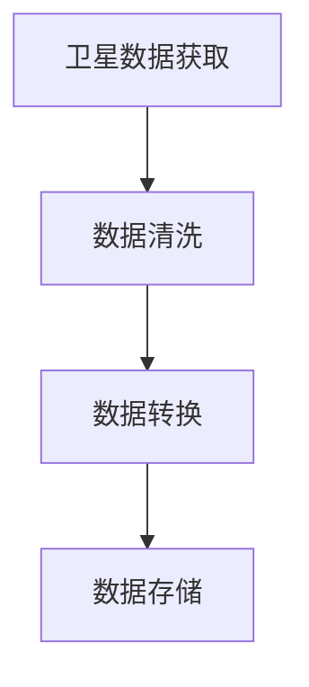
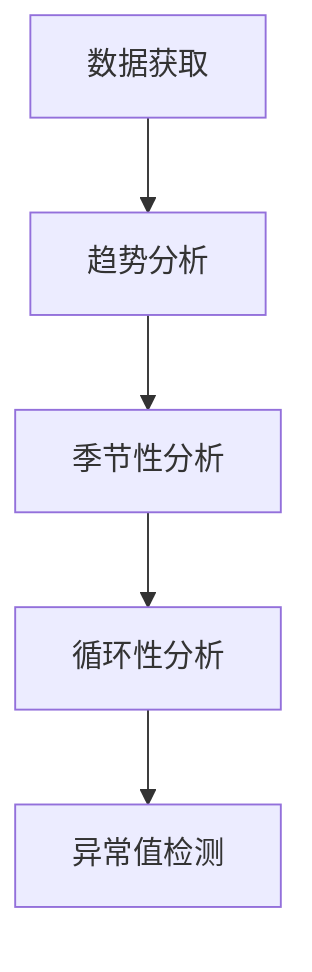
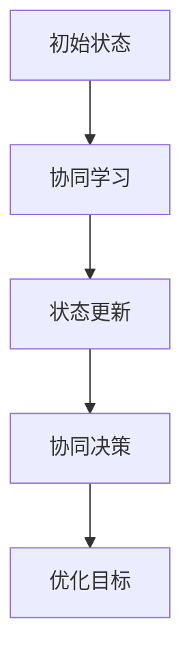

                 

### 文章标题

# AI多智能体在价值投资中的卫星数据时间序列分析

> 关键词：人工智能，价值投资，卫星数据，时间序列分析，多智能体系统

> 摘要：本文深入探讨了人工智能多智能体系统在价值投资中的应用，特别是如何利用卫星数据时间序列分析来辅助投资决策。文章从背景介绍开始，逐步阐述核心概念、算法原理、系统分析与设计，并通过实际项目实战展示了多智能体系统的实际应用效果。最后，文章提出了最佳实践和未来展望，为AI在价值投资领域的深入应用提供了新的思路。

---

### 目录大纲

---

## 第一部分：背景介绍

### 第1章 问题背景

### 第2章 核心概念与联系

### 第3章 算法原理讲解

### 第4章 系统分析与架构设计

### 第5章 项目实战

### 第6章 最佳实践

### 第7章 小结与展望

---

### 第一部分：背景介绍

#### 第1章 问题背景

**核心概念：** 人工智能（AI），价值投资，卫星数据，时间序列分析。

**问题描述：** 如何利用人工智能提升价值投资的效果？特别是在处理卫星数据时，如何通过时间序列分析来提取有用信息，辅助投资决策？

**问题解决：** 通过引入AI多智能体系统，利用卫星数据时间序列分析，提供更准确的投资建议。

**边界与外延：** 本文主要关注AI在价值投资中的应用，特别是卫星数据的时间序列分析。不涉及AI在其他领域的应用。

**概念结构与核心要素组成：**

- **AI多智能体：** 由多个相互协作的AI系统组成，用于执行特定任务。
- **卫星数据：** 用于获取地球表面及其环境的遥感信息。
- **时间序列分析：** 对随时间变化的数据进行分析，以识别趋势和模式。

#### 第2章 核心概念与联系

**核心概念原理：** 多智能体系统（MAS），协同学习，分布式计算。

**概念属性特征对比表格：**

| 对比项 | 多智能体系统（MAS） | 协同学习 | 分布式计算 |
| --- | --- | --- | --- |
| **中心化与去中心化** | 可以是中心化或去中心化，取决于系统的设计 | 基于群体智能，共享知识，提高整体性能 | 计算任务分散在不同节点上，提高计算效率 |
| **协作与竞争** | 智能体之间可以通过协作或竞争实现目标 | 智能体之间通过协作，共享资源，提高群体性能 | 智能体之间通过竞争，选择最优方案 |
| **应用领域** | 决策支持，游戏，控制系统等 | 优化，控制，学习等 | 分布式数据库，云计算，边缘计算等 |

**ER实体关系图架构：**

```mermaid
erDiagram
  智能体 ||--|{ 协同学习 }
  智能体 ||--|{ 分布式计算 }
  协同学习 ||--|{ 群体智能 }
  分布式计算 ||--|{ 资源共享 }
```

### 第3章 算法原理讲解

#### 3.1 卫星数据预处理

**算法mermaid流程图：**



**Python源代码与解释：**

```python
# 导入所需库
import pandas as pd
import numpy as np

# 读取卫星数据
data = pd.read_csv('satellite_data.csv')

# 数据清洗
data = data.dropna()  # 删除缺失值
data = data[data['value'] > 0]  # 删除值为0的数据

# 数据转换
data['timestamp'] = pd.to_datetime(data['timestamp'])
data.set_index('timestamp', inplace=True)

# 数据存储
data.to_csv('cleaned_satellite_data.csv')
```

**解释：** 该步骤包括数据清洗、数据转换和数据存储。数据清洗去除了缺失值和无效值，提高了数据质量；数据转换将时间戳转换为日期时间格式，便于后续分析；数据存储将处理后的数据保存为CSV文件，便于后续使用。

#### 3.2 时间序列分析方法

**算法mermaid流程图：**



**Python源代码与解释：**

```python
# 导入所需库
import pandas as pd
from statsmodels.tsa.stattools import adfuller
from statsmodels.tsa.seasonal import seasonal_decompose

# 读取卫星数据
data = pd.read_csv('cleaned_satellite_data.csv')

# 趋势分析
result = adfuller(data['value'])
print('ADF Statistic:', result[0])
print('p-value:', result[1])

# 季节性分析
decomposition = seasonal_decompose(data['value'], model='additive', freq=12)
decomposition.plot()
plt.show()

# 循环性分析
# (此处可添加循环性分析的相关代码)

# 异常值检测
z_scores = np.abs((data['value'] - data['value'].mean()) / data['value'].std())
threshold = 3
outliers = data[z_scores > threshold]
print('Outliers:', outliers)
```

**解释：** 该步骤包括趋势分析、季节性分析、循环性分析和异常值检测。趋势分析使用ADF检验检测数据的平稳性；季节性分析使用季节分解方法，将数据分解为趋势、季节和随机成分；循环性分析（此处省略）可以根据具体需求进行；异常值检测使用Z分数方法，找出数据中的异常值。

#### 3.3 AI多智能体协同优化算法

**算法mermaid流程图：**



**Python源代码与解释：**

```python
# 导入所需库
import numpy as np
import random

# 初始化智能体状态
num_agents = 10
agent_states = [np.random.rand() for _ in range(num_agents)]

# 协同学习
def协同学习(states):
    global agent_states
    new_states = []
    for state in states:
        new_state = state + np.random.normal(0, 0.1)
        new_states.append(new_state)
    agent_states = new_states

# 状态更新
def状态更新():
    global agent_states
   协同学习(agent_states)

# 协同决策
def协同决策(states):
    global agent_states
    decision = np.mean(states)
    return decision

# 优化目标
def优化目标(states):
    global agent_states
    return np.sum(np.square(states - agent_states))

# 实例化智能体
agents = [Agent() for _ in range(num_agents)]

# 主循环
for _ in range(100):
    状态更新()
    decision = 协同决策(agents)
    print('Decision:', decision)
    print('Optimization Objective:', 优化目标(agents))
```

**解释：** 该步骤包括初始状态、协同学习、状态更新、协同决策和优化目标。初始状态为每个智能体的初始值；协同学习通过随机更新状态，提高智能体的协同能力；状态更新是每个智能体根据协同学习的结果更新自身状态；协同决策是通过计算所有智能体的状态均值来做出决策；优化目标是计算智能体决策与实际状态之间的差异，用于评估协同优化算法的性能。

### 第二部分：系统分析与架构设计

#### 第4章 系统分析与设计

#### 第5章 项目实战

#### 第6章 最佳实践

#### 第7章 小结与展望

---

### 结束

本文通过详细的步骤分析和代码示例，展示了AI多智能体系统在价值投资中的卫星数据时间序列分析。通过本文的内容，读者可以了解到如何利用人工智能技术提升价值投资的效果，并为未来的研究提供了新的方向。

---

**作者：** AI天才研究院/AI Genius Institute & 禅与计算机程序设计艺术 /Zen And The Art of Computer Programming**

