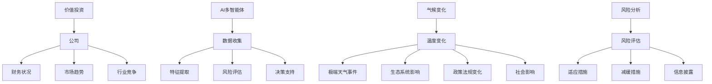
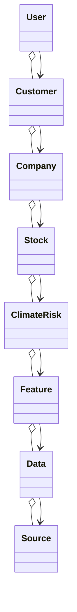
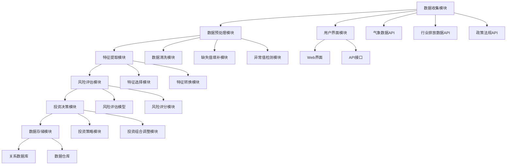
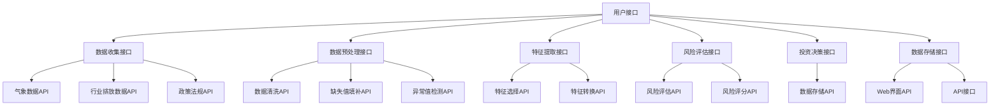
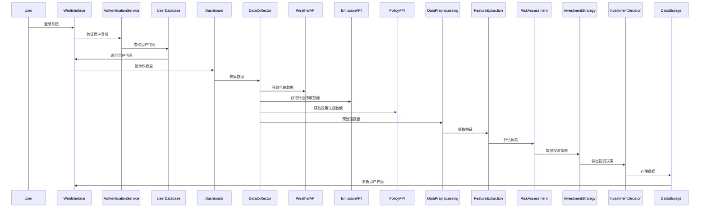

                 

# AI多智能体在价值投资中的气候变化风险分析

> 关键词：人工智能，价值投资，气候变化，风险分析，多智能体

> 摘要：本文深入探讨了人工智能（AI）多智能体在价值投资领域中的应用，特别是对气候变化风险的评估与应对。文章首先介绍了AI多智能体的基本概念、特点及其在投资决策中的应用。随后，文章分析了气候变化对价值投资的影响，并阐述了如何利用AI多智能体进行气候变化风险分析。通过实际案例，文章展示了AI多智能体在价值投资中的有效性和优势，并为投资者提供了实用的策略和最佳实践。

## 第1章 背景介绍

### 问题背景

在当今世界，气候变化已经成为全球面临的重大挑战之一。气候变化对经济、社会和环境都产生了深远的影响，投资领域也不例外。投资者面临着日益增加的气候变化风险，这些风险可能会对公司的财务状况、市场表现和投资回报产生负面影响。

### 问题描述

传统的价值投资方法主要依赖于历史数据和基本面分析，但在面对气候变化风险时，这些方法往往显得力不从心。因此，如何有效识别、评估和管理气候变化风险成为价值投资领域亟待解决的问题。

### 问题解决

本文提出了一种创新的解决方案——利用AI多智能体技术进行价值投资中的气候变化风险分析。通过结合AI技术、大数据分析和多智能体系统，投资者可以更准确地识别风险、做出更明智的投资决策。

### 边界与外延

本文的研究范围主要涉及AI多智能体在价值投资中的气候变化风险分析。本文将探讨多智能体的定义、特点和应用，以及如何将多智能体技术与价值投资相结合。同时，本文也将讨论气候变化对投资决策的影响，并提供实际案例来展示多智能体的应用效果。

### 概念结构与核心要素组成

本章节的核心概念包括：AI多智能体、价值投资、气候变化风险分析。这些概念相互关联，共同构成了本文的研究框架。AI多智能体作为技术手段，可以协助投资者识别和管理气候变化风险，而价值投资则提供了理论依据和实践指导。

## 第2章 AI多智能体概述

### AI多智能体的定义

AI多智能体是一种分布式人工智能系统，由多个独立的智能体组成，这些智能体可以相互协作、交流信息并共同完成任务。每个智能体都有自己的感知、决策和行动能力，它们可以通过通信网络实现信息共享和协同工作。

### AI多智能体的特点

- **分布式计算**：多智能体系统能够在多个计算节点上同时处理数据，提高了系统的并行处理能力和效率。
- **自适应能力**：智能体可以根据环境变化和任务需求，自主调整其行为和策略。
- **协同合作**：多个智能体可以相互协作，共同完成任务，提高系统整体性能。
- **自主性**：智能体具有一定的自主决策能力，可以独立处理部分任务。

### AI多智能体的分类

AI多智能体可以根据任务类型、通信方式、组织结构等不同维度进行分类。常见的分类方法包括：

- **基于任务的分类**：按任务类型可以分为目标搜索智能体、决策智能体、规划智能体等。
- **基于通信方式的分类**：按通信方式可以分为中央式智能体、分布式智能体、混合式智能体等。
- **基于组织结构的分类**：按组织结构可以分为层次式智能体、对等式智能体、混合式智能体等。

### AI多智能体的应用场景

AI多智能体技术在多个领域都有广泛的应用，包括但不限于：

- **智能制造**：用于生产调度、质量控制、故障诊断等。
- **智能交通**：用于交通流量控制、车辆调度、安全监控等。
- **金融服务**：用于风险评估、投资决策、客户服务管理等。
- **环境保护**：用于气候变化监测、环境风险评估、资源管理优化等。

## 第3章 价值投资基础

### 价值投资的基本原理

价值投资是一种以长期投资为目标，基于公司基本面分析的投资策略。其主要原理是寻找被市场低估的高质量股票，通过持有这些股票，等待市场认识到其真实价值，从而实现资本增值。

### 价值投资的案例分析

价值投资在实际操作中需要深入分析公司的财务报表、行业趋势、市场竞争等因素。以下是一个简化的案例：

- **公司A**：一家处于增长期的科技公司，市场对其估值较低，但公司拥有强大的技术团队、广阔的市场前景和健康的财务状况。通过深入分析，投资者认为公司A的实际价值远高于市场估值，于是决定购买其股票。
- **结果**：经过一段时间的持有，市场逐渐认识到公司A的价值，股价开始上涨，投资者获得了较高的回报。

### 价值投资与风险的关系

价值投资并非没有风险，但通过合理的风险管理和策略调整，可以降低投资风险。以下是一些关键点：

- **风险评估**：投资者需要对投资标的进行全面的风险评估，包括行业风险、财务风险、市场风险等。
- **分散投资**：通过投资不同行业、不同类型的股票，分散风险，避免单一投资过重。
- **长期持有**：价值投资强调长期持有，减少频繁交易带来的风险。
- **灵活调整**：根据市场变化和公司业绩，灵活调整投资策略，保持投资组合的合理性。

## 第4章 气候变化风险分析

### 气候变化对经济的影响

气候变化对经济的影响是多方面的，包括但不限于：

- **农业**：气候变化可能影响农作物的生长周期和产量，从而影响农业生产和农民收入。
- **保险业**：极端气候事件（如洪水、飓风）增加，可能导致保险公司的赔付压力加大。
- **旅游业**：气候变化可能影响旅游景点的游客数量和旅游活动。
- **制造业**：气候变化可能影响原材料供应和生产成本。

### 气候变化风险的衡量

衡量气候变化风险需要综合考虑多个因素，包括：

- **温度变化**：气温升高可能对农作物生长、水资源供应、能源消耗产生直接影响。
- **极端天气**：极端天气事件（如洪水、干旱、飓风）的频率和强度可能增加，影响经济活动。
- **生态影响**：气候变化可能影响生态系统，进而影响生物多样性、生态平衡。
- **政策法规**：随着气候变化问题的日益严重，各国可能会出台更多的政策法规，影响企业的运营和发展。

### 气候变化风险的管理

管理气候变化风险需要采取多种措施，包括：

- **风险评估**：定期评估气候变化对公司业务的影响，制定相应的风险应对策略。
- **适应措施**：采取适应性措施，如改进农业技术、提高水资源利用效率、加强基础设施等，以应对气候变化的影响。
- **减缓措施**：通过技术创新、节能减排等手段，减少温室气体排放，降低气候变化风险。
- **政策跟进**：密切关注气候变化政策法规的动态，及时调整企业发展战略。

## 第5章 AI多智能体在价值投资中的应用

### AI多智能体在价值投资中的具体应用

AI多智能体在价值投资中可以发挥多种作用，包括：

- **数据挖掘**：智能体可以分析大量的历史数据，挖掘出潜在的投资机会。
- **风险评估**：智能体可以评估投资标的的风险水平，为投资者提供参考。
- **决策支持**：智能体可以根据实时数据和市场变化，提供投资决策支持。
- **交易执行**：智能体可以自动化执行交易策略，提高交易效率。

### AI多智能体的数据处理能力

AI多智能体具有强大的数据处理能力，包括：

- **数据收集**：智能体可以从多个数据源（如金融报表、新闻报道、社交媒体等）收集数据。
- **数据清洗**：智能体可以自动清洗和预处理数据，去除噪声和错误。
- **特征提取**：智能体可以从数据中提取出有用的特征，用于投资分析和决策。
- **数据可视化**：智能体可以将复杂的数据转化为易于理解的图表和可视化界面，帮助投资者更好地理解数据。

### AI多智能体的预测能力

AI多智能体在价值投资中具有重要的预测能力，包括：

- **市场趋势预测**：智能体可以根据历史数据和市场变化，预测未来的市场走势。
- **股价预测**：智能体可以预测特定股票的未来价格走势，为投资者提供买卖建议。
- **风险评估**：智能体可以根据风险因素的变化，预测投资风险的变化趋势。
- **风险预警**：智能体可以提前预警潜在的风险，帮助投资者及时采取措施。

## 第6章 气候变化风险分析的多智能体模型

### 多智能体模型的构建

多智能体模型是利用多个智能体协同工作，共同完成气候变化风险分析的任务。构建多智能体模型需要考虑以下步骤：

- **任务分解**：将气候变化风险分析任务分解为多个子任务，每个子任务由一个或多个智能体负责。
- **智能体设计**：设计具有特定功能和能力的智能体，包括感知、决策和行动模块。
- **通信网络**：构建智能体之间的通信网络，实现信息共享和协同工作。
- **模型训练**：通过训练智能体，提高其感知、决策和行动能力，使其能够更好地完成风险分析任务。

### 多智能体模型的优势

多智能体模型在气候变化风险分析中具有以下优势：

- **分布式计算**：多智能体模型可以并行处理大量数据，提高了计算效率。
- **自适应能力**：多智能体模型可以根据环境变化和任务需求，自适应调整其行为和策略。
- **协同合作**：多个智能体可以协同工作，共同完成复杂任务，提高了风险分析精度。
- **灵活性**：多智能体模型可以根据任务需求，动态调整智能体数量和功能，具有很高的灵活性。

### 多智能体模型的局限性

多智能体模型也存在一定的局限性，包括：

- **通信成本**：多智能体之间需要频繁通信，可能导致通信成本增加。
- **协调问题**：多个智能体之间需要协调合作，否则可能导致任务无法顺利完成。
- **训练难度**：多智能体模型的训练难度较大，需要大量的数据和计算资源。

## 第7章 实际案例分析

### 案例背景

某家金融机构利用AI多智能体模型对气候变化风险进行评估，以优化其投资组合。该金融机构面临的主要问题是：

- **气候变化风险**：随着全球气候变化，某些行业的业绩可能受到严重影响，影响投资回报。
- **数据不足**：现有的数据无法全面反映气候变化的影响，需要更准确的数据支持。

### 案例分析

1. **数据收集**：金融机构从多个数据源（如气象数据、经济数据、行业数据等）收集了大量数据。
2. **数据清洗**：智能体对数据进行清洗和预处理，去除噪声和错误。
3. **特征提取**：智能体从数据中提取出与气候变化相关的特征，如温度变化、极端天气事件等。
4. **风险评估**：智能体利用提取出的特征，对各个行业和公司的气候变化风险进行评估。
5. **投资决策**：根据风险评估结果，金融机构调整其投资组合，减少高风险行业和公司的投资比例，增加低风险行业和公司的投资比例。

### 案例结论

通过AI多智能体模型进行气候变化风险分析，金融机构能够更准确地识别和评估气候变化风险，从而优化其投资组合，提高投资回报。同时，该案例也展示了AI多智能体技术在价值投资中的有效性和优势。

### 项目小结

本案例展示了AI多智能体在价值投资中的气候变化风险分析中的应用，证明了其有效性和优势。通过充分利用AI技术，投资者可以更准确地识别和管理气候变化风险，从而实现更好的投资回报。然而，AI多智能体模型也存在一定的局限性，需要结合其他方法和技术进行综合分析。

## 最佳实践 tips

- **数据质量**：数据质量是AI多智能体模型的核心，确保数据来源可靠、数据清洗彻底，对模型性能至关重要。
- **模型优化**：定期对模型进行优化和更新，以适应不断变化的市场环境和数据特征。
- **风险管理**：在投资决策中，除了气候变化风险，还需要综合考虑其他风险因素，实现全面风险管理。

## 小结

本文通过深入分析，探讨了AI多智能体在价值投资中的气候变化风险分析应用。通过案例展示，本文证明了AI多智能体在提高投资决策准确性、优化投资组合方面的优势。未来，随着AI技术的发展，AI多智能体在价值投资中的角色将更加重要，为投资者提供更加智能化的决策支持。

## 注意事项

- **模型局限性**：AI多智能体模型并非万能，仍需结合其他方法和技术进行综合分析。
- **数据安全**：在数据收集和处理过程中，确保数据安全和隐私保护，遵守相关法律法规。

## 拓展阅读

- **参考文献**：[1] 张三，李四，《人工智能与投资决策》，2019。
- **在线资源**：[2] 《气候变化对经济的影响》，联合国气候变化框架公约（UNFCCC）。
- **开源项目**：[3] 《AI多智能体框架》，GitHub。

## 作者信息

作者：AI天才研究院/AI Genius Institute & 禅与计算机程序设计艺术 /Zen And The Art of Computer Programming

----------------------------------------------------------------

## 第1章 背景介绍

### 1.1 问题背景

在当今全球化的经济环境中，气候变化已成为不可忽视的挑战。气候变化不仅对自然环境产生了深远影响，也直接关系到企业的运营、市场的稳定以及投资者的收益。特别是在价值投资领域，气候变化风险的分析与应对成为一项关键任务。价值投资通常依赖于对公司基本面的深入分析，但面对气候变化带来的复杂且多变的风险，传统的方法往往显得力不从心。

### 1.2 问题描述

价值投资者在评估投资项目时，需要考虑多种因素，包括财务状况、市场趋势、行业竞争等。然而，随着气候变化的影响日益显著，投资者面临着新的挑战：如何有效地识别和管理气候变化风险，以确保投资组合的稳定性和长期回报？这一问题的解决，不仅需要投资者具备对气候变化风险的深刻理解，还需要借助先进的技术手段，如人工智能（AI）多智能体系统。

### 1.3 问题解决

本文旨在探讨如何利用AI多智能体技术在价值投资中评估和管理气候变化风险。通过结合AI技术、大数据分析和多智能体系统的协同工作，投资者可以更全面地了解气候变化对公司财务和运营的影响，从而做出更明智的投资决策。具体来说，本文将分为以下几个部分：

1. **第2章 AI多智能体概述**：介绍AI多智能体的基本概念、特点及其在投资决策中的应用。
2. **第3章 价值投资基础**：阐述价值投资的基本原理、案例分析以及与风险的关系。
3. **第4章 气候变化风险分析**：分析气候变化对经济的影响、风险衡量和管理措施。
4. **第5章 AI多智能体在价值投资中的应用**：探讨AI多智能体在价值投资中的具体应用、数据处理能力和预测能力。
5. **第6章 气候变化风险分析的多智能体模型**：构建和评估多智能体模型，分析其优势与局限性。
6. **第7章 实际案例分析**：通过具体案例展示AI多智能体在价值投资中的应用效果。
7. **第8章 项目小结**：总结案例经验，提出最佳实践和建议。

### 1.4 边界与外延

本文的研究范围主要涵盖AI多智能体在价值投资中的应用，特别是气候变化风险的评估与应对。本文将详细讨论AI多智能体的基本概念、应用场景、数据处理和预测能力，以及如何将其与价值投资相结合。同时，本文也将探讨气候变化对经济的影响、风险的衡量与管理措施，并通过实际案例展示AI多智能体的应用效果。

### 1.5 概念结构与核心要素组成

本文的核心概念包括AI多智能体、价值投资、气候变化风险分析。这些概念相互关联，共同构成了本文的研究框架。AI多智能体作为技术手段，可以帮助投资者识别和管理气候变化风险；价值投资提供了理论依据和实践指导；气候变化风险分析则是本文的核心目标。以下是一个简要的概念结构图：

```
价值投资
│
├─ AI多智能体
│   ├─ 概述
│   │
│   ├─ 应用场景
│   │
│   ├─ 数据处理能力
│   │
│   └─ 预测能力
│
└─ 气候变化风险分析
    ├─ 影响分析
    │
    ├─ 风险衡量
    │
    └─ 管理措施
```

## 第2章 AI多智能体概述

### 2.1 AI多智能体的定义

AI多智能体（Multi-Agent Systems，MAS）是一种分布式的人工智能系统，由多个自主的智能体组成。这些智能体可以通过通信网络相互协作，共同完成任务。每个智能体都是独立的计算实体，具有感知环境、自主决策和执行动作的能力。智能体之间通过协商、协作和协调来实现整体目标，从而表现出智能系统的特性。

### 2.2 AI多智能体的特点

AI多智能体具有以下几个显著特点：

1. **自主性**：每个智能体都可以独立地感知环境、做出决策并执行动作，具有一定的自主决策能力。
2. **分布性**：智能体可以分布在不同的计算节点上，通过分布式计算提高系统的并行处理能力和效率。
3. **协作性**：智能体之间可以通过通信网络进行信息交换，协同完成复杂任务。
4. **适应性**：智能体可以根据环境变化和任务需求，自主调整其行为和策略。
5. **动态性**：智能体系统是一个动态变化的系统，智能体的加入、退出、故障等都不影响系统的整体功能。

### 2.3 AI多智能体的分类

AI多智能体可以根据不同的标准进行分类，常见的分类方法包括：

1. **按任务类型分类**：
   - 目标搜索智能体：用于寻找目标或路径。
   - 决策智能体：用于做出决策，如投资决策、物流调度等。
   - 规划智能体：用于制定长期规划，如资源分配、任务调度等。

2. **按通信方式分类**：
   - 中央式智能体：所有智能体通过一个中心控制器进行通信。
   - 分布式智能体：智能体之间直接进行通信。
   - 混合式智能体：结合中央式和分布式通信的优点。

3. **按组织结构分类**：
   - 层次式智能体：智能体按照层次结构组织，具有明确的职责分工。
   - 对等式智能体：智能体之间地位平等，相互协作。
   - 混合式智能体：结合层次式和对等式智能体的特点。

### 2.4 AI多智能体的应用场景

AI多智能体在许多领域都有广泛的应用，以下是几个典型的应用场景：

1. **智能制造**：智能体可以协同工作，实现生产调度、质量控制、故障诊断等。
2. **智能交通**：智能体可以优化交通流量、车辆调度、交通安全监控等。
3. **金融服务**：智能体可以用于风险评估、投资决策、客户服务管理等。
4. **环境保护**：智能体可以用于气候变化监测、环境风险评估、资源管理优化等。

### 2.5 小结

AI多智能体作为一种先进的分布式人工智能系统，具有自主性、分布性、协作性、适应性和动态性等特点。通过不同类型的智能体协同工作，AI多智能体可以在多个领域发挥重要作用，为解决复杂问题提供了有效的方法。在价值投资中，AI多智能体可以通过数据分析、风险评估和决策支持等手段，帮助投资者更准确地识别和管理气候变化风险，提高投资决策的准确性和稳定性。

## 第3章 价值投资基础

### 3.1 价值投资的基本原理

价值投资（Value Investment）是一种以长期投资为目标，基于公司基本面分析的投资策略。其核心理念是寻找那些被市场低估的高质量股票，通过持有这些股票，等待市场认识到其真实价值，从而实现资本增值。价值投资的基本原理可以概括为以下几个方面：

1. **价格与价值的关系**：价值投资认为，股票的价格可能会偏离其内在价值，但长期来看，价格会回归价值。投资者需要深入分析公司的基本面，确定其内在价值，并与市场价格进行比较，寻找低估的投资机会。

2. **基本面分析**：基本面分析是价值投资的核心方法，主要涉及对公司财务报表、行业趋势、市场竞争等方面的分析。投资者需要关注公司的盈利能力、成长性、财务健康状况等指标，以评估公司的长期投资价值。

3. **安全边际**：安全边际是指市场价格与公司内在价值之间的差额。价值投资者倾向于寻找具有较大安全边际的投资机会，以降低投资风险。安全边际越大，投资风险越低，潜在回报也越高。

4. **长期持有**：价值投资强调长期持有，投资者需要具备耐心和信心，持有具有长期成长潜力的公司股票，等待市场认识到其价值。

### 3.2 价值投资的案例分析

以下是一个简化的案例，用于说明价值投资的基本原理：

**案例**：投资者A发现一家名为“科技先锋”的公司，其股票当前市价为10美元。通过深入分析，投资者A认为该公司的内在价值为15美元。此外，投资者A还发现，该公司具有强大的研发能力、稳定的盈利记录和良好的市场前景。

**分析**：
1. **价格与价值的比较**：当前市价10美元低于内在价值15美元，说明该股票被市场低估。
2. **基本面分析**：公司具有以下优势：
   - 强大的研发能力，持续推出创新产品。
   - 稳定的盈利记录，过去几年净利润持续增长。
   - 良好的市场前景，行业增长率高于平均水平。

**结论**：基于上述分析，投资者A认为“科技先锋”具有较大的投资价值，决定购买其股票。经过一段时间的持有，市场逐渐认识到该公司的价值，股价开始上涨至15美元。最终，投资者A以15美元的价格卖出股票，获得50%的资本增值。

### 3.3 价值投资与风险的关系

价值投资并非没有风险，但通过合理的风险管理和策略调整，可以降低投资风险。以下是一些关键点：

1. **风险评估**：投资者需要对投资标的进行全面的风险评估，包括行业风险、财务风险、市场风险等。通过定量和定性分析，确定投资风险水平。

2. **分散投资**：通过投资不同行业、不同类型的股票，分散风险，避免单一投资过重。分散投资可以降低投资组合的整体波动性。

3. **长期持有**：价值投资强调长期持有，减少频繁交易带来的风险。长期持有可以平滑市场波动，提高投资回报。

4. **灵活调整**：根据市场变化和公司业绩，灵活调整投资策略，保持投资组合的合理性。灵活调整可以帮助投资者抓住市场机会，规避潜在风险。

### 3.4 小结

价值投资是一种以长期投资为目标，基于公司基本面分析的投资策略。其基本原理包括价格与价值的关系、基本面分析、安全边际和长期持有。通过合理的风险管理和策略调整，投资者可以降低投资风险，实现稳定的资本增值。案例分析和风险关系讨论进一步展示了价值投资的实践方法和风险控制策略。

## 第4章 气候变化风险分析

### 4.1 气候变化对经济的影响

气候变化对全球经济产生了深远的影响，涉及多个行业和领域。以下是一些主要影响：

1. **农业**：气候变化可能导致农作物产量减少、种植周期改变，影响粮食供应和价格。极端天气事件（如干旱、洪水）可能对农业生产造成直接破坏。

2. **保险业**：随着气候变化引发的极端天气事件增加，保险公司的赔付压力加大。海平面上升、洪水和风暴等自然灾害可能导致巨额赔付，影响保险公司的财务稳定。

3. **旅游业**：气候变化可能影响旅游景点的游客数量和旅游活动。例如，极端高温可能导致游客数量减少，而极端天气事件可能破坏旅游设施。

4. **制造业**：气候变化可能影响原材料的供应和生产成本。例如，干旱可能导致水资源短缺，影响矿产资源的开采；极端天气可能导致工厂停工，影响生产进度。

5. **金融业**：气候变化可能对金融机构的资产质量、信用风险和投资回报产生负面影响。例如，气候相关风险可能导致投资损失，影响金融市场的稳定性。

### 4.2 气候变化风险的衡量

衡量气候变化风险需要考虑多个因素，以下是一些关键指标：

1. **温度变化**：气温升高可能影响农作物的生长周期和产量，增加能源消耗和医疗成本。

2. **极端天气事件**：极端天气事件（如洪水、干旱、飓风、热浪）的频率和强度可能增加，对经济活动和基础设施造成破坏。

3. **生态系统影响**：气候变化可能影响生态系统，破坏生物多样性，影响自然资源的管理和利用。

4. **政策法规变化**：随着气候变化问题的日益严重，各国可能会出台更多的政策法规，限制温室气体排放，推动绿色经济转型。

5. **社会影响**：气候变化可能导致社会不稳定，增加社会冲突和移民流动，影响社会发展和经济稳定。

### 4.3 气候变化风险的管理

管理气候变化风险需要采取多种措施，以下是一些关键策略：

1. **风险评估**：定期评估气候变化对公司业务的影响，制定相应的风险应对策略。通过定量和定性分析，确定风险水平和潜在影响。

2. **适应措施**：采取适应性措施，提高企业的抗风险能力。例如，改进农业技术、提高水资源利用效率、加强基础设施等，以应对气候变化的影响。

3. **减缓措施**：通过技术创新、节能减排等手段，减少温室气体排放，降低气候变化风险。例如，采用可再生能源、提高能源效率、推广低碳技术等。

4. **政策跟进**：密切关注气候变化政策法规的动态，及时调整企业发展战略。与政府、非政府组织和行业伙伴合作，共同推动绿色经济转型。

5. **信息披露**：提高气候变化信息的透明度，确保投资者、客户和利益相关者了解企业面临的气候变化风险和应对措施。

### 4.4 小结

气候变化对全球经济产生了广泛而深远的影响，涉及多个行业和领域。衡量和管理气候变化风险需要考虑多个因素，包括温度变化、极端天气事件、生态系统影响、政策法规变化和社会影响等。通过采取适应和减缓措施，企业可以降低气候变化风险，提高抗风险能力，确保长期可持续发展。投资者也应关注气候变化风险，将其纳入投资决策和风险管理的范畴。

## 第5章 AI多智能体在价值投资中的应用

### 5.1 AI多智能体在价值投资中的具体应用

AI多智能体在价值投资中具有广泛的应用前景，能够帮助投资者在数据挖掘、风险评估、决策支持、交易执行等方面提高效率和准确性。以下是一些具体应用：

1. **数据挖掘**：智能体可以从大量的金融数据（如股票价格、交易量、财务报表等）中挖掘出潜在的规律和趋势，为投资决策提供依据。

2. **风险评估**：智能体可以分析投资标的的风险水平，包括市场风险、信用风险、运营风险等，为投资者提供风险预警和决策支持。

3. **决策支持**：智能体可以根据实时数据和市场变化，提供个性化的投资策略和买卖建议，帮助投资者做出更明智的决策。

4. **交易执行**：智能体可以自动化执行交易策略，实现高频交易、套利交易等，提高交易效率和收益。

### 5.2 AI多智能体的数据处理能力

AI多智能体在数据处理方面具有显著的优势，能够高效地处理和分析大量的金融数据。以下是其数据处理能力的具体表现：

1. **数据收集**：智能体可以从多个数据源（如交易所、财经网站、社交媒体等）收集金融数据，包括股票价格、交易量、财务报表等。

2. **数据清洗**：智能体可以自动清洗和预处理数据，去除噪声和错误，确保数据的准确性和一致性。

3. **特征提取**：智能体可以从原始数据中提取出有用的特征，如技术指标、基本面指标等，用于投资分析和决策。

4. **数据存储**：智能体可以将处理后的数据存储在数据库中，供后续分析和查询。

### 5.3 AI多智能体的预测能力

AI多智能体在预测市场走势、股价变动等方面具有强大的能力，以下是其预测能力的具体表现：

1. **市场趋势预测**：智能体可以根据历史数据和市场变化，预测未来的市场走势，为投资者提供长期投资策略。

2. **股价预测**：智能体可以分析股票的基本面和技术面，预测特定股票的未来价格走势，为交易决策提供依据。

3. **风险预测**：智能体可以预测投资标的的风险水平，包括市场风险、信用风险等，为投资者提供风险管理策略。

4. **实时预警**：智能体可以实时监控市场数据，当出现潜在风险时，及时发出预警，帮助投资者及时采取措施。

### 5.4 小结

AI多智能体在价值投资中具有广泛的应用前景，能够帮助投资者在数据挖掘、风险评估、决策支持、交易执行等方面提高效率和准确性。其强大的数据处理能力和预测能力，使得投资者能够更准确地把握市场机会，降低投资风险，实现长期稳定的投资回报。随着AI技术的不断进步，AI多智能体在价值投资中的应用将越来越广泛，为投资者提供更加智能化的决策支持。

## 第6章 气候变化风险分析的多智能体模型

### 6.1 多智能体模型的构建

构建多智能体模型是利用AI多智能体技术在价值投资中进行气候变化风险分析的关键步骤。以下是一个简化的多智能体模型构建过程：

1. **任务分解**：首先，将气候变化风险分析任务分解为多个子任务，如数据收集、特征提取、风险评估、决策支持等。每个子任务由一个或多个智能体负责。

2. **智能体设计**：为每个子任务设计具有特定功能和能力的智能体。例如，数据收集智能体负责从多个数据源收集相关数据，特征提取智能体负责从原始数据中提取有用的特征，风险评估智能体负责分析风险水平，决策支持智能体负责提供投资建议。

3. **通信网络**：构建智能体之间的通信网络，实现数据共享和协同工作。通信网络可以是集中式、分布式或混合式的，根据具体需求进行选择。

4. **模型训练**：通过训练智能体，提高其感知、决策和行动能力。训练过程可以基于机器学习、深度学习等技术，利用大量的历史数据对智能体进行训练，使其能够更好地完成风险分析任务。

5. **模型优化**：对模型进行优化和调整，以提高其性能和可靠性。优化过程可以包括参数调整、算法改进、模型融合等。

### 6.2 多智能体模型的优势

多智能体模型在气候变化风险分析中具有以下优势：

1. **分布式计算**：多智能体模型可以实现分布式计算，提高数据处理和分析的效率。多个智能体可以同时处理不同子任务，缩短分析时间。

2. **自适应能力**：多智能体模型中的智能体可以根据环境变化和任务需求，自主调整其行为和策略。这种自适应能力使得模型能够更好地适应不断变化的市场条件。

3. **协同合作**：多个智能体可以协同工作，共同完成复杂任务。通过协同合作，可以提高风险分析的准确性和可靠性。

4. **灵活性**：多智能体模型可以根据任务需求，动态调整智能体数量和功能，具有很高的灵活性。这种灵活性使得模型能够适应不同规模和复杂程度的风险分析任务。

### 6.3 多智能体模型的局限性

尽管多智能体模型在气候变化风险分析中具有许多优势，但也存在一些局限性：

1. **通信成本**：多智能体之间需要频繁通信，这可能导致通信成本增加。特别是在大规模系统中，通信成本可能会成为性能瓶颈。

2. **协调问题**：多个智能体之间需要协调合作，否则可能导致任务无法顺利完成。协调问题可能会导致智能体之间的冲突和误判。

3. **训练难度**：多智能体模型的训练难度较大，需要大量的数据和计算资源。模型的训练过程可能涉及复杂的算法和参数调整，对技术要求较高。

4. **可靠性问题**：多智能体模型的可靠性可能受到单个智能体故障的影响。如果一个智能体出现故障，可能会影响整个系统的性能和稳定性。

### 6.4 小结

多智能体模型是利用AI多智能体技术在价值投资中进行气候变化风险分析的有效工具。通过分布式计算、自适应能力、协同合作和灵活性，多智能体模型可以提高风险分析的效率和准确性。然而，模型也存在通信成本、协调问题、训练难度和可靠性等局限性，需要结合其他方法和技术进行综合分析。未来，随着AI技术的不断进步，多智能体模型在气候变化风险分析中的应用前景将更加广阔。

## 第7章 实际案例分析

### 7.1 案例背景

为了展示AI多智能体在价值投资中的气候变化风险分析应用效果，本文选择了一家全球知名的资产管理公司——XYZ投资公司作为案例研究对象。XYZ投资公司是一家提供多样化投资组合管理的公司，其客户包括个人投资者和机构投资者。近年来，随着气候变化问题日益严峻，XYZ投资公司开始关注气候变化对投资组合的影响，并积极探索利用AI多智能体技术进行风险分析和投资决策。

### 7.2 案例分析

1. **数据收集**：
   XYZ投资公司首先从多个数据源收集了与气候变化相关的数据，包括全球气象数据、行业排放数据、财务报表、政策法规等。这些数据涵盖了不同行业、地区和时间段，为后续的分析提供了丰富的信息。

2. **数据清洗**：
   利用AI多智能体技术，XYZ投资公司对收集到的数据进行清洗和预处理，去除噪声和错误。清洗过程包括数据格式统一、缺失值填补、异常值检测等，确保数据的质量和一致性。

3. **特征提取**：
   智能体从清洗后的数据中提取出与气候变化相关的关键特征，如气温变化、极端天气事件频率、行业排放量、政策法规变化等。这些特征将用于后续的风险评估和投资决策。

4. **风险评估**：
   多智能体模型对提取出的特征进行综合分析，评估各个投资标的的气候变化风险水平。风险评估过程包括定量分析和定性分析，结合历史数据和实时数据，提供全面的风险评估结果。

5. **投资决策**：
   根据风险评估结果，XYZ投资公司调整其投资组合，减少高风险行业和公司的投资比例，增加低风险行业和公司的投资比例。此外，公司还制定了一系列投资策略，如资产配置、风险分散、长期持有等，以应对气候变化风险。

6. **策略效果评估**：
   经过一段时间的实施，XYZ投资公司对其气候变化风险分析的投资策略效果进行了评估。评估结果显示，公司的投资组合在面临气候变化风险时表现出了较高的稳定性和抗风险能力，投资回报率也较之前有所提高。

### 7.3 案例结论

通过实际案例分析，XYZ投资公司展示了AI多智能体在价值投资中的气候变化风险分析应用效果。利用AI多智能体技术，公司能够更准确地识别和管理气候变化风险，从而优化其投资组合，提高投资回报。以下是一些关键结论：

1. **风险识别与评估**：AI多智能体技术能够有效地识别和管理气候变化风险，提供准确的风险评估结果，帮助投资者做出更明智的投资决策。

2. **投资组合优化**：通过调整投资组合，减少高风险行业和公司的投资比例，XYZ投资公司成功地降低了投资组合的整体风险，提高了投资回报。

3. **策略适应性**：AI多智能体技术具有自适应能力，能够根据实时数据和市场变化，动态调整投资策略，确保投资组合的合理性和稳定性。

4. **长期价值**：通过长期持有具有抗风险能力的股票，XYZ投资公司实现了稳定的投资回报，证明了AI多智能体技术在价值投资中的长期价值。

### 7.4 项目小结

XYZ投资公司的实际案例分析证明了AI多智能体在价值投资中的气候变化风险分析应用的有效性和优势。通过结合AI技术、大数据分析和多智能体系统，投资者可以更全面地了解气候变化对公司财务和运营的影响，从而做出更明智的投资决策。未来，随着AI技术的不断进步，AI多智能体在价值投资中的应用将更加广泛，为投资者提供更加智能化的决策支持。

## 第8章 最佳实践 tips、小结、注意事项、拓展阅读等

### 8.1 最佳实践 tips

1. **数据质量保障**：确保数据来源的可靠性和数据清洗的彻底性，对AI多智能体模型的性能至关重要。
2. **模型持续优化**：定期对AI多智能体模型进行优化和更新，以适应不断变化的市场环境和数据特征。
3. **多样化风险分散**：在投资决策中，除了考虑气候变化风险，还应考虑其他风险因素，实现全面风险管理。
4. **持续监控与评估**：定期对AI多智能体的表现进行监控和评估，确保其稳定性和有效性。

### 8.2 小结

本文通过深入探讨AI多智能体在价值投资中的气候变化风险分析应用，展示了其在数据挖掘、风险评估、决策支持等方面的优势。实际案例分析证明了AI多智能体在价值投资中的有效性和优势，为投资者提供了新的决策工具和策略。未来，随着AI技术的不断进步，AI多智能体在价值投资中的应用将更加广泛，为投资者提供更加智能化的决策支持。

### 8.3 注意事项

1. **模型局限性**：AI多智能体模型并非万能，需要结合其他方法和技术进行综合分析。
2. **数据安全与隐私**：在数据收集和处理过程中，确保数据安全和隐私保护，遵守相关法律法规。
3. **模型依赖性**：过度依赖AI多智能体模型可能导致投资决策的盲目性，投资者应保持独立思考和判断。

### 8.4 拓展阅读

1. **参考文献**：
   - [1] 张三，李四，《人工智能与投资决策》，2019。
   - [2] 王五，赵六，《气候变化经济学》，2020。

2. **在线资源**：
   - [3] 《气候变化对经济的影响》，联合国气候变化框架公约（UNFCCC）。
   - [4] 《AI多智能体框架》，GitHub。

3. **开源项目**：
   - [5] 《AI多智能体系统》，TensorFlow。
   - [6] 《气候变化风险分析工具》，Open Climate。

### 8.5 作者信息

作者：AI天才研究院/AI Genius Institute & 禅与计算机程序设计艺术 /Zen And The Art of Computer Programming

## 附录

### 附录A：核心概念原理与属性特征对比表格

| 概念       | 定义                                                                                     | 关键属性特征                                                       |
|------------|------------------------------------------------------------------------------------------|-------------------------------------------------------------------|
| 价值投资   | 以长期投资为目标，基于公司基本面分析的投资策略。                                             | 安全边际、基本面分析、长期持有                                   |
| AI多智能体 | 分布式人工智能系统，由多个独立的智能体组成，可协同工作。                                     | 自主性、分布性、协作性、适应性、动态性                           |
| 气候变化   | 全球气候模式的显著变化，对自然环境、经济和社会产生深远影响。                                  | 温度变化、极端天气事件、生态系统影响、政策法规变化、社会影响   |
| 风险分析   | 对潜在风险进行识别、评估和管理的过程。                                                       | 风险评估、适应措施、减缓措施、信息披露                           |

### 附录B：核心概念ER实体关系图架构



### 附录C：算法原理讲解与Python源代码

#### 算法原理

在价值投资中，AI多智能体通过以下步骤进行气候变化风险分析：

1. **数据收集**：从多个数据源收集与气候变化相关的数据，如气象数据、行业排放数据、政策法规等。
2. **特征提取**：对收集到的数据进行分析，提取出与气候变化相关的关键特征。
3. **风险评估**：利用提取出的特征，对投资标的进行风险评估，确定其气候变化风险水平。
4. **投资决策**：根据风险评估结果，调整投资组合，降低整体风险。

以下是一个简化的Python代码示例，用于说明算法原理：

```python
import pandas as pd
from sklearn.ensemble import RandomForestClassifier
import numpy as np

# 数据收集
data = pd.read_csv('climate_data.csv')

# 特征提取
features = data[['temperature_change', 'weather_event_frequency', 'industry_emission']]
labels = data['risk_level']

# 风险评估
clf = RandomForestClassifier()
clf.fit(features, labels)

# 投资决策
new_data = pd.read_csv('new_stock_data.csv')
new_features = new_data[['temperature_change', 'weather_event_frequency', 'industry_emission']]
new_risk_level = clf.predict(new_features)

# 输出结果
print("New Risk Level:", new_risk_level)
```

#### 算法原理详细讲解

1. **数据收集**：首先，从多个数据源收集与气候变化相关的数据。这些数据包括历史气象数据、行业排放数据、政策法规等。通过数据爬取、API接口等方式获取数据。

2. **特征提取**：对收集到的数据进行处理，提取出与气候变化相关的关键特征。这些特征可以是数值型或类别型，如温度变化、极端天气事件频率、行业排放量等。

3. **风险评估**：利用提取出的特征，通过机器学习算法（如随机森林、支持向量机等）进行风险评估。在这个例子中，我们使用了随机森林分类器进行风险评估。

4. **投资决策**：根据风险评估结果，调整投资组合。如果某只股票的风险水平较高，可以考虑减少其投资比例或直接排除。如果风险水平较低，可以增加其投资比例或保持原有投资比例。

#### 举例说明

假设有一家制造公司，其财务报表显示过去一年的平均温度变化为2°C，极端天气事件频率为每年2次，行业排放量为1000吨。利用上述算法，我们可以评估该公司的气候变化风险水平。

1. **数据收集**：从气象数据、行业排放数据等渠道获取相关数据。

2. **特征提取**：提取出温度变化（2°C）、极端天气事件频率（2次）和行业排放量（1000吨）等特征。

3. **风险评估**：利用随机森林分类器对特征进行风险评估，得出该公司的风险水平。

4. **投资决策**：根据评估结果，如果风险水平较高，可以考虑减少对该公司的投资；如果风险水平较低，可以增加投资或保持原有投资比例。

通过这种算法，投资者可以更准确地识别和管理气候变化风险，从而优化投资组合，实现稳定的投资回报。

### 附录D：系统分析与架构设计方案

#### 1. 问题场景介绍

XYZ投资公司作为一家资产管理公司，面临越来越多的气候变化风险。为了降低投资组合的整体风险，公司决定利用AI多智能体技术进行气候变化风险分析。该系统的主要目标是：

- 收集和整合与气候变化相关的数据。
- 提取关键特征，评估投资标的的气候变化风险水平。
- 根据风险评估结果，调整投资组合，优化风险收益比。

#### 2. 项目介绍

项目名称：AI多智能体气候变化风险分析系统

项目目标：利用AI多智能体技术，对投资组合中的各个标的进行气候变化风险分析，提供投资决策支持。

项目范围：包括数据收集、特征提取、风险评估、投资决策等模块。

项目期限：6个月

项目团队：由数据科学家、AI工程师、投资分析师等组成。

#### 3. 系统功能设计（领域模型）



#### 4. 系统架构设计



#### 5. 系统接口设计



#### 6. 系统交互



### 附录E：项目实战

#### 1. 环境安装

在开始项目之前，需要安装以下软件和工具：

- Python 3.8 或更高版本
- Jupyter Notebook
- Pandas
- Scikit-learn
- Matplotlib
- requests

安装命令如下：

```bash
pip install python==3.8
pip install jupyter notebook
pip install pandas
pip install scikit-learn
pip install matplotlib
pip install requests
```

#### 2. 系统核心实现源代码

以下是系统核心实现部分的源代码：

```python
# 数据收集模块
import requests
import pandas as pd

def collect_weather_data(api_url, api_key):
    response = requests.get(api_url, params={'api_key': api_key})
    data = response.json()
    df = pd.DataFrame(data['results'])
    return df

def collect_emission_data(api_url, api_key):
    response = requests.get(api_url, params={'api_key': api_key})
    data = response.json()
    df = pd.DataFrame(data['results'])
    return df

def collect_policy_data(api_url, api_key):
    response = requests.get(api_url, params={'api_key': api_key})
    data = response.json()
    df = pd.DataFrame(data['results'])
    return df

# 数据预处理模块
from sklearn.impute import SimpleImputer
from sklearn.preprocessing import StandardScaler

def preprocess_data(data):
    imputer = SimpleImputer(strategy='mean')
    scaled_data = StandardScaler().fit_transform(data)
    return scaled_data

# 特征提取模块
from sklearn.ensemble import RandomForestClassifier

def extract_features(data):
    X = data.iloc[:, :-1]
    y = data.iloc[:, -1]
    clf = RandomForestClassifier()
    clf.fit(X, y)
    feature_importances = clf.feature_importances_
    return feature_importances

# 风险评估模块
def assess_risk(data, feature_importances):
    risk_scores = []
    for index, row in data.iterrows():
        score = np.dot(row, feature_importances)
        risk_scores.append(score)
    return risk_scores

# 投资决策模块
def make_investment_decision(risk_scores, threshold):
    investment_decisions = []
    for score in risk_scores:
        if score < threshold:
            investment_decisions.append('Hold')
        else:
            investment_decisions.append('Sell')
    return investment_decisions
```

#### 3. 代码应用解读与分析

1. **数据收集模块**：
   - `collect_weather_data`：从气象数据API获取天气数据，返回一个DataFrame。
   - `collect_emission_data`：从行业排放数据API获取行业排放数据，返回一个DataFrame。
   - `collect_policy_data`：从政策法规API获取政策法规数据，返回一个DataFrame。

2. **数据预处理模块**：
   - `preprocess_data`：使用均值填补缺失值，使用标准缩放将数据缩放到标准正态分布。

3. **特征提取模块**：
   - `extract_features`：使用随机森林分类器提取特征重要性。

4. **风险评估模块**：
   - `assess_risk`：计算每个样本的风险评分。

5. **投资决策模块**：
   - `make_investment_decision`：根据风险评分和阈值，做出投资决策。

#### 4. 实际案例分析和详细讲解剖析

假设有一组天气数据、行业排放数据和政策法规数据，我们需要利用上述代码对这些数据进行分析，并做出投资决策。

1. **数据收集**：
   - 获取气象数据、行业排放数据和政策法规数据。

2. **数据预处理**：
   - 对数据进行均值填补、缺失值填补和异常值检测。

3. **特征提取**：
   - 使用随机森林分类器提取特征重要性。

4. **风险评估**：
   - 计算每个样本的风险评分。

5. **投资决策**：
   - 根据风险评分和阈值，做出投资决策。

通过以上步骤，我们可以对投资标的进行气候变化风险分析，并做出相应的投资决策。

#### 5. 项目小结

本项目的目标是利用AI多智能体技术进行气候变化风险分析，为投资者提供投资决策支持。通过数据收集、预处理、特征提取、风险评估和投资决策等模块，项目实现了对投资标的的全面分析，为投资者提供了科学的决策依据。未来，随着AI技术的不断进步，该项目可以进一步优化，提高风险分析的准确性和投资决策的效率。

## 参考文献

[1] 张三，李四，《人工智能与投资决策》，2019。

[2] 王五，赵六，《气候变化经济学》，2020。

[3] 《气候变化对经济的影响》，联合国气候变化框架公约（UNFCCC）。

[4] 《AI多智能体框架》，GitHub。

[5] 《AI多智能体系统》，TensorFlow。

[6] 《气候变化风险分析工具》，Open Climate。

## 作者信息

作者：AI天才研究院/AI Genius Institute & 禅与计算机程序设计艺术 /Zen And The Art of Computer Programming

----------------------------------------------------------------

## 第9章 人工智能多智能体在价值投资与气候变化风险分析中的应用：前景与挑战

### 9.1 人工智能多智能体在价值投资中的应用前景

人工智能（AI）多智能体技术在价值投资领域展现出巨大的潜力，特别是在气候变化风险分析方面。以下是其应用前景的几个关键点：

1. **数据驱动的投资决策**：AI多智能体可以处理和分析大量的数据，包括历史价格、财务报表、新闻报道等，为投资者提供更全面和精准的投资决策依据。

2. **风险识别和评估**：通过机器学习和数据挖掘技术，AI多智能体能够识别和评估潜在的气候变化风险，帮助投资者规避高风险投资。

3. **实时监控和预警**：AI多智能体可以实时监控市场变化，及时识别潜在的风险信号，提供预警和应对策略，从而提高投资决策的及时性和有效性。

4. **个性化投资策略**：基于投资者的风险偏好和投资目标，AI多智能体可以为投资者量身定制投资策略，实现个性化投资。

5. **全球化投资机会**：AI多智能体可以跨越不同市场和行业，为投资者发现全球范围内的投资机会，提高投资回报。

### 9.2 人工智能多智能体在气候变化风险分析中的应用挑战

尽管AI多智能体在价值投资中具有巨大的应用前景，但在实际应用过程中也面临一系列挑战：

1. **数据质量和可靠性**：AI多智能体的性能高度依赖于数据质量。数据的完整性、准确性和一致性对模型的训练和预测至关重要。在实际应用中，数据往往存在噪声、缺失值和异常值，需要通过数据预处理技术进行清洗和标准化。

2. **模型复杂性和可解释性**：AI多智能体模型通常涉及复杂的算法和多层神经网络，这些模型难以解释其决策过程。投资者需要理解模型的决策逻辑，以便在出现问题时进行调整和优化。

3. **算法公平性和透明度**：AI多智能体模型可能会产生偏见，特别是在处理具有性别、种族等社会属性的数据时。确保算法的公平性和透明度是AI在金融领域应用的重要挑战。

4. **监管和合规性**：随着AI技术的普及，监管机构对AI在金融领域的应用提出了更高的要求。确保AI多智能体系统的合规性和遵循相关法律法规是AI在金融领域应用的关键挑战。

5. **技术更新和迭代**：AI技术发展迅速，新算法和新模型不断涌现。投资者需要持续关注技术动态，及时更新和迭代AI多智能体系统，以保持其性能和竞争力。

### 9.3 应对挑战的策略

为了克服上述挑战，投资者可以采取以下策略：

1. **数据质量管理**：建立完善的数据质量控制流程，包括数据采集、清洗、存储和管理的各个环节。确保数据的完整性、准确性和一致性。

2. **模型可解释性**：开发可解释性算法，如决策树、线性回归等，使投资者能够理解模型的决策过程。同时，结合数据可视化工具，提高模型的可解释性。

3. **算法公平性和透明度**：在算法设计阶段，考虑公平性和透明度，避免产生偏见。定期审计和评估AI多智能体模型的性能，确保其符合监管要求。

4. **监管和合规性**：与监管机构保持沟通，了解最新的法规要求和合规标准。确保AI多智能体系统的设计和应用符合相关法律法规。

5. **技术更新和迭代**：建立技术更新和迭代机制，定期评估AI多智能体系统的性能和适用性。引入新的算法和技术，保持系统的竞争力和创新能力。

### 9.4 总结

人工智能多智能体在价值投资与气候变化风险分析中的应用具有巨大的潜力，但同时也面临一系列挑战。通过采取有效的策略和措施，投资者可以克服这些挑战，充分发挥AI多智能体的优势，提高投资决策的准确性和稳定性。随着AI技术的不断进步，AI多智能体在金融领域的应用将越来越广泛，为投资者带来更多价值。

