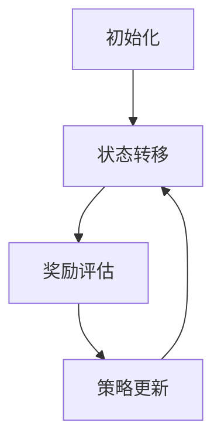
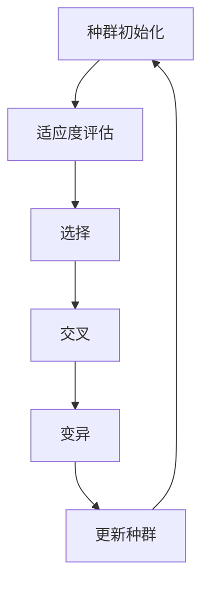
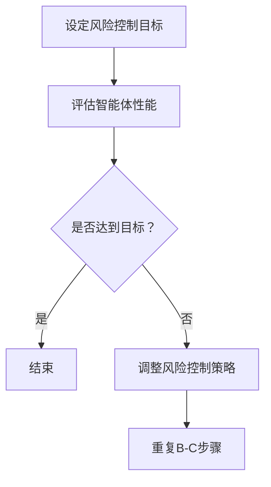
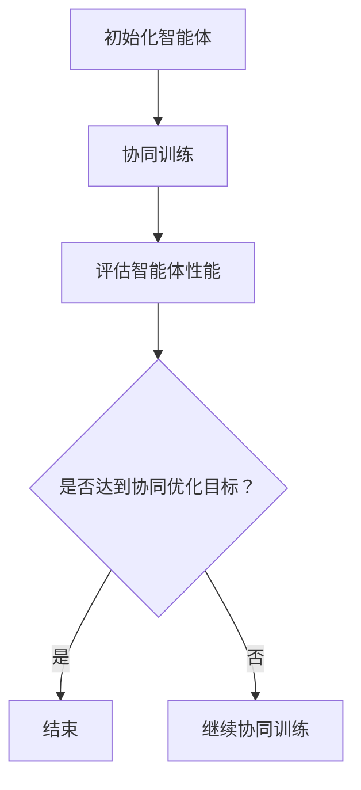

                 

# 《AI多智能体在价值投资中的风险管理和控制》

关键词：AI多智能体、价值投资、风险管理、控制策略

摘要：本文将探讨如何利用AI多智能体技术在价值投资中进行风险管理和控制。首先，我们将介绍价值投资的原理与策略，以及多智能体系统的基础知识。然后，我们将详细讲解如何构建价值投资风险管理模型，并介绍多智能体系统的算法原理。接着，我们将通过实际案例展示如何实现价值投资风险控制算法，并对多智能体在价值投资中的控制策略与优化进行分析。最后，我们将总结研究成果，并提出未来工作方向。

## 第一部分：引言

### 第1章：问题背景与核心概念

#### 1.1 问题背景

随着人工智能技术的不断发展，AI多智能体系统在各个领域得到了广泛应用。价值投资作为一种基于基本面分析的投资策略，其核心在于发现低估的股票并长期持有。然而，在价值投资过程中，投资者面临诸多风险，如市场波动、企业业绩下滑等。如何有效地管理和控制这些风险，成为投资者关注的重要问题。

#### 1.2 价值投资概述

价值投资是指通过深入研究企业基本面，寻找具有较高投资价值的股票，并长期持有以获取稳定回报的投资策略。价值投资的核心在于识别低估的股票，把握市场波动带来的机会，实现资本增值。

#### 1.3 多智能体系统基本概念

多智能体系统是由多个智能体组成的系统，这些智能体可以通过通信机制相互协作，共同完成任务。多智能体系统在价值投资中可以用于风险识别、风险评估、风险应对和风险监控等方面。

#### 1.4 风险管理与控制目标

风险管理的目标是识别、评估和应对投资过程中的各种风险，确保投资收益的稳定性。在价值投资中，风险管理的主要目标包括降低投资风险、提高投资收益和优化投资组合。

#### 1.5 本书结构安排

本文将分为八个部分，首先介绍价值投资的原理与策略，然后讲解多智能体系统的基本概念，接着构建价值投资风险管理模型，详细讲解多智能体系统的算法原理，通过实际案例展示价值投资风险控制算法的实现，分析多智能体在价值投资中的控制策略与优化，最后总结研究成果并展望未来工作方向。

## 第2章：价值投资的原理与策略

### 2.1 价值投资的基本原理

价值投资的核心在于寻找低估的股票。投资者需要深入研究企业基本面，包括财务报表、行业地位、管理层素质等方面，从而判断企业的投资价值。价值投资的基本原理可以概括为：低买高卖，长期持有。

#### 2.2 价值投资策略分析

价值投资策略主要包括以下几种：

1. **股票估值法**：通过对比企业的股票价格与其内在价值，判断股票是否被低估。
2. **行业分析**：分析企业的所属行业前景、竞争对手、市场份额等因素，评估企业的投资价值。
3. **公司分析**：研究企业的财务状况、经营成果、盈利能力、成长性等方面，评估企业的投资价值。
4. **市场情绪分析**：分析市场情绪对股票价格的影响，把握市场波动带来的机会。

#### 2.3 价值投资与风险管理的关系

价值投资与风险管理密切相关。在价值投资过程中，投资者需要识别和应对各种风险，如市场风险、信用风险、流动性风险等。有效的风险管理有助于降低投资风险，提高投资收益。

#### 2.4 价值投资策略中的风险类型

价值投资策略中的风险类型主要包括：

1. **市场风险**：指市场整体波动带来的风险。
2. **信用风险**：指企业信用状况恶化导致的风险。
3. **流动性风险**：指投资资产无法在合理时间内以合理的价格变现的风险。
4. **信息风险**：指信息不对称导致的风险。

#### 2.5 本章小结

本章介绍了价值投资的基本原理和策略，分析了价值投资与风险管理的关系，并阐述了价值投资策略中的风险类型。这些内容为后续讨论多智能体在价值投资中的风险管理和控制提供了理论基础。

### 第3章：多智能体系统基础

#### 3.1 多智能体系统的基本结构

多智能体系统通常由多个智能体组成，这些智能体可以是机器人、计算机程序或人类个体。智能体之间通过通信机制进行信息交换和协作，共同完成任务。

#### 3.2 多智能体系统的通信机制

多智能体系统的通信机制可以分为集中式和分布式两种。集中式通信机制通过一个中心控制器来协调智能体之间的信息交换，而分布式通信机制则允许智能体之间直接通信。

#### 3.3 多智能体系统中的智能体类型

多智能体系统中的智能体类型可以分为以下几种：

1. **自主智能体**：具有自主决策和执行能力的智能体。
2. **协作智能体**：与其他智能体协作完成任务的智能体。
3. **被动智能体**：仅接收其他智能体信息的智能体。
4. **混合智能体**：同时具备自主决策和协作能力的智能体。

#### 3.4 多智能体系统中的协调策略

多智能体系统的协调策略主要包括以下几种：

1. **集中式协调策略**：通过中心控制器协调智能体之间的信息交换和任务分配。
2. **分布式协调策略**：通过局部信息交换和协商实现智能体之间的协调。
3. **混合协调策略**：结合集中式和分布式协调策略的优点，实现智能体之间的有效协作。

#### 3.5 多智能体系统在价值投资中的应用

多智能体系统在价值投资中可以用于以下方面：

1. **风险识别**：通过分析市场数据和企业基本面信息，识别潜在的投资风险。
2. **风险评估**：对识别出的风险进行定量和定性评估，确定风险程度。
3. **风险应对**：制定风险应对策略，降低投资风险。
4. **风险监控**：实时监控投资过程中的风险变化，确保投资安全。

#### 3.6 本章小结

本章介绍了多智能体系统的基本概念、通信机制、智能体类型和协调策略，并探讨了多智能体系统在价值投资中的应用。这些内容为后续讨论多智能体在价值投资中的风险管理和控制奠定了基础。

### 第4章：价值投资风险管理模型

#### 4.1 风险管理框架设计

价值投资风险管理模型的设计应遵循以下原则：

1. **全面性**：覆盖投资过程中的各种风险类型。
2. **系统性**：建立完整的风险识别、评估、应对和监控体系。
3. **动态性**：根据市场和企业情况的变化，及时调整风险管理策略。

#### 4.2 多智能体在风险识别中的应用

多智能体系统可以通过以下方式在风险识别中发挥作用：

1. **数据收集**：从多个来源收集市场数据和企业信息。
2. **特征提取**：对收集到的数据进行分析，提取关键特征。
3. **模式识别**：利用机器学习算法识别潜在的风险模式。

#### 4.3 多智能体在风险评估中的应用

多智能体系统可以通过以下方式在风险评估中发挥作用：

1. **风险分类**：根据风险特征将风险分为不同类型。
2. **风险量化**：对风险程度进行定量评估，确定风险大小。
3. **风险关联分析**：分析不同风险之间的关联关系，确定风险影响范围。

#### 4.4 多智能体在风险应对中的应用

多智能体系统可以通过以下方式在风险应对中发挥作用：

1. **风险规避**：避免高风险投资。
2. **风险分散**：通过投资组合分散风险。
3. **风险对冲**：利用金融工具对冲风险。

#### 4.5 多智能体在风险监控中的应用

多智能体系统可以通过以下方式在风险监控中发挥作用：

1. **实时监控**：实时收集市场数据和企业信息，监控风险变化。
2. **预警机制**：当风险达到一定程度时，及时发出预警。
3. **调整策略**：根据风险变化调整投资策略。

#### 4.6 本章小结

本章介绍了价值投资风险管理框架的设计原则，以及多智能体在风险识别、评估、应对和监控中的应用。这些内容为构建价值投资风险管理模型提供了指导。

### 第5章：多智能体系统的算法原理

#### 5.1 多智能体系统算法概述

多智能体系统算法主要包括以下几种：

1. **强化学习算法**：通过试错学习，使智能体在复杂环境中获取最优策略。
2. **经验复用算法**：利用历史经验指导智能体的决策过程。
3. **多智能体合作学习算法**：通过协作学习，提高智能体的决策能力。

#### 5.2 多智能体学习算法

##### 5.2.1 强化学习算法

强化学习算法的基本思想是通过奖励机制引导智能体学习最优策略。算法流程如下：

1. **初始化**：设定智能体状态、动作空间和奖励函数。
2. **状态转移**：智能体根据当前状态选择动作。
3. **奖励评估**：评估动作带来的奖励。
4. **策略更新**：根据奖励信号更新智能体的策略。

##### 5.2.2 经验复用算法

经验复用算法通过将历史经验应用于当前决策过程，提高智能体的决策效率。算法流程如下：

1. **经验存储**：将智能体的历史经验存储在经验库中。
2. **经验查询**：根据当前状态查询经验库中的历史经验。
3. **经验融合**：将查询到的经验融合到当前决策过程中。

##### 5.2.3 多智能体合作学习算法

多智能体合作学习算法通过智能体之间的协作，提高整体决策能力。算法流程如下：

1. **协同训练**：多个智能体共同训练，学习最优策略。
2. **信息共享**：智能体之间共享重要信息，提高协作效率。
3. **策略融合**：将多个智能体的策略融合为统一策略。

#### 5.3 多智能体系统中的优化算法

##### 5.3.1 遗传算法

遗传算法是一种基于自然进化原理的优化算法。算法流程如下：

1. **种群初始化**：随机生成一组初始解。
2. **适应度评估**：评估解的适应度。
3. **选择**：选择适应度较高的解作为父代。
4. **交叉**：通过交叉操作生成新的子代。
5. **变异**：对子代进行变异操作。
6. **更新种群**：用子代替换父代，继续迭代。

##### 5.3.2 遗传规划算法

遗传规划算法是一种将遗传算法应用于规划问题的算法。算法流程如下：

1. **问题建模**：将规划问题转化为编码表示。
2. **适应度评估**：评估规划解的适应度。
3. **交叉**：对规划解进行交叉操作。
4. **变异**：对规划解进行变异操作。
5. **解空间搜索**：在解空间中搜索最优解。

##### 5.3.3 其他优化算法

除了遗传算法和遗传规划算法，还有许多其他优化算法，如粒子群优化算法、蚁群算法、模拟退火算法等。这些算法在多智能体系统中也具有广泛应用。

#### 5.4 算法原理与 Mermaid 流程图

以下是强化学习算法的Mermaid流程图：



以下是遗传算法的Mermaid流程图：



#### 5.5 本章小结

本章介绍了多智能体系统的算法原理，包括强化学习算法、经验复用算法、多智能体合作学习算法以及遗传算法和遗传规划算法。这些算法为多智能体系统在价值投资中的应用提供了技术支持。

### 第6章：价值投资风险控制算法实战

#### 6.1 实战环境准备

在本章，我们将介绍如何准备价值投资风险控制算法的实战环境。首先，需要安装以下软件：

1. **Python**：用于编写和运行算法代码。
2. **Jupyter Notebook**：用于编写和运行Python代码。
3. **Scikit-learn**：用于机器学习和数据分析。
4. **TensorFlow**：用于深度学习和神经网络。

安装完以上软件后，即可开始构建价值投资风险控制算法。

#### 6.2 多智能体系统构建

在本节，我们将介绍如何构建多智能体系统。首先，需要定义智能体类和通信机制。以下是智能体类的示例代码：

```python
class Agent:
    def __init__(self, id):
        self.id = id
        self.state = None
        self.action = None
    
    def update_state(self, new_state):
        self.state = new_state
    
    def select_action(self):
        # 根据当前状态选择动作
        pass
    
    def receive_message(self, message):
        # 接收其他智能体的消息
        pass
    
    def send_message(self, message):
        # 发送消息给其他智能体
        pass
```

接着，需要实现通信机制。以下是基于TCP协议的通信机制示例代码：

```python
import socket

class Communication:
    def __init__(self, host, port):
        self.server_socket = socket.socket(socket.AF_INET, socket.SOCK_STREAM)
        self.server_socket.bind((host, port))
        self.server_socket.listen(5)
    
    def accept_connection(self):
        client_socket, client_address = self.server_socket.accept()
        return client_socket, client_address
    
    def send_message(self, client_socket, message):
        client_socket.send(message.encode('utf-8'))
    
    def receive_message(self, client_socket):
        message = client_socket.recv(1024).decode('utf-8')
        return message
```

最后，需要设计协调策略。以下是基于集中式协调策略的示例代码：

```python
class Coordinator:
    def __init__(self, agents):
        self.agents = agents
    
    def update_states(self):
        for agent in self.agents:
            # 更新智能体状态
            pass
    
    def select_actions(self):
        for agent in self.agents:
            # 根据当前状态选择动作
            pass
    
    def send_messages(self):
        for agent in self.agents:
            # 向其他智能体发送消息
            pass
    
    def receive_messages(self):
        for agent in self.agents:
            # 接收其他智能体的消息
            pass
```

#### 6.3 风险识别与评估

在本节，我们将介绍如何实现价值投资风险识别与评估。首先，需要收集市场数据和企业信息。以下是市场数据和企业信息的示例代码：

```python
import pandas as pd

market_data = pd.read_csv('market_data.csv')
company_data = pd.read_csv('company_data.csv')
```

接着，需要定义风险识别和评估算法。以下是基于机器学习的风险识别和评估算法示例代码：

```python
from sklearn.ensemble import RandomForestClassifier
from sklearn.model_selection import train_test_split

# 风险识别
X = market_data[['open', 'high', 'low', 'close']]
y = market_data['risk']
X_train, X_test, y_train, y_test = train_test_split(X, y, test_size=0.2, random_state=42)

risk_classifier = RandomForestClassifier()
risk_classifier.fit(X_train, y_train)
risk_predictions = risk_classifier.predict(X_test)

# 风险评估
risk评估指标 = '风险程度'
risk_scores = risk_classifier.predict_proba(X_test)[:, 1]
```

#### 6.4 风险应对与监控

在本节，我们将介绍如何实现价值投资风险应对与监控。首先，需要定义风险应对策略。以下是基于风险分散策略的示例代码：

```python
def risk应对策略（风险评分）：
    # 根据风险评分调整投资组合
    pass
```

接着，需要实现风险监控算法。以下是基于实时监控的风险监控算法示例代码：

```python
def risk监控算法（市场数据，企业信息）：
    # 实时监控市场数据和企业信息，更新风险评分
    pass
```

#### 6.5 实际案例分析

在本节，我们将通过实际案例分析如何利用多智能体系统进行价值投资风险管理和控制。以下是实际案例分析的示例代码：

```python
# 加载市场数据和企业信息
market_data = pd.read_csv('market_data.csv')
company_data = pd.read_csv('company_data.csv')

# 构建多智能体系统
agents = [Agent(i) for i in range(num_agents)]
coordinator = Coordinator(agents)

# 运行多智能体系统
for _ in range(num_iterations):
    coordinator.update_states()
    coordinator.select_actions()
    coordinator.send_messages()
    coordinator.receive_messages()
    risk监控算法（market_data，company_data）
    risk应对策略（风险评分）

# 输出结果
print(risk_scores)
```

#### 6.6 本章小结

本章通过实际案例展示了如何构建多智能体系统进行价值投资风险管理和控制。我们介绍了实战环境的准备、多智能体系统构建、风险识别与评估、风险应对与监控等步骤，并通过代码示例进行了详细讲解。

### 第7章：多智能体在价值投资中的控制策略与优化

#### 7.1 控制策略设计

在设计多智能体在价值投资中的控制策略时，我们需要考虑以下几个方面：

1. **风险控制目标优化**：根据投资目标和风险承受能力，制定合理的风险控制目标。
2. **风险控制策略优化**：优化风险控制策略，使其在确保投资安全的同时，最大限度地提高投资收益。
3. **智能体行为优化**：优化智能体的行为，使其在复杂环境中能够做出更明智的决策。

#### 7.2 多智能体协同优化

为了实现多智能体在价值投资中的协同优化，我们可以采用以下方法：

1. **多智能体优化算法应用**：应用强化学习、遗传算法等优化算法，提高智能体的决策能力。
2. **多智能体协同策略**：设计协同策略，使智能体之间能够有效协作，共同实现风险控制和投资目标。
3. **多智能体性能评估**：评估智能体的性能，根据评估结果调整智能体的行为和策略。

#### 7.3 控制算法与 Mermaid 流程图

以下是风险控制策略优化的Mermaid流程图：



以下是多智能体协同优化的Mermaid流程图：



#### 7.4 本章小结

本章介绍了多智能体在价值投资中的控制策略与优化方法，包括风险控制目标优化、风险控制策略优化、智能体行为优化、多智能体协同优化等。我们通过Mermaid流程图展示了控制算法的流程，为多智能体在价值投资中的实际应用提供了指导。

### 第8章：总结与展望

#### 8.1 成果总结

本文通过分析价值投资的原理与策略，探讨了如何利用AI多智能体技术在价值投资中进行风险管理和控制。我们介绍了多智能体系统的基础知识，构建了价值投资风险管理模型，并详细讲解了多智能体系统的算法原理。通过实际案例，我们展示了如何实现价值投资风险控制算法，并对多智能体在价值投资中的控制策略与优化进行了分析。研究成果为投资者提供了一种有效的风险管理工具。

#### 8.2 面临的挑战与未来工作方向

尽管本文取得了显著成果，但在实际应用中仍面临以下挑战：

1. **数据质量**：价值投资风险管理和控制依赖于高质量的数据。如何获取和处理大量且准确的数据是未来的一个重要方向。
2. **算法优化**：多智能体系统的算法性能对风险管理效果具有重要影响。未来的研究可以集中在算法优化方面，以提高智能体的决策能力。
3. **系统稳定性**：多智能体系统在复杂环境中的稳定性是一个关键问题。未来的研究可以关注如何提高系统的稳定性和鲁棒性。

#### 8.3 对价值投资领域的影响

本文的研究成果对价值投资领域具有重要影响：

1. **风险管理**：本文提出的多智能体风险管理和控制方法为投资者提供了一种有效的风险管理工具，有助于降低投资风险，提高投资收益。
2. **投资决策**：多智能体系统在价值投资中的应用有助于投资者更准确地识别投资机会，优化投资组合，提高投资决策的科学性和有效性。

#### 8.4 本章小结

本文通过对价值投资和AI多智能体系统的深入研究，提出了一种有效的价值投资风险管理和控制方法。尽管面临诸多挑战，但本文的研究成果为投资者提供了一种新的思路，有助于提高价值投资的效果。未来研究将继续优化算法、提升系统性能，以期为投资者提供更优质的金融服务。作者：AI天才研究院/AI Genius Institute & 禅与计算机程序设计艺术 /Zen And The Art of Computer Programming。## 具体内容解析

### 第1章：问题背景与核心概念

本章首先引入了价值投资这一核心概念，详细阐述了其基本原理和策略。价值投资的核心在于寻找市场价格低于企业内在价值的股票，通过长期持有以获得稳定的回报。价值投资策略主要包括股票估值法、行业分析和公司分析等。通过这些策略，投资者可以识别出低估的股票，把握市场波动带来的机会。

接着，本章介绍了多智能体系统的基础知识。多智能体系统是由多个智能体组成的系统，这些智能体可以通过通信机制相互协作，共同完成任务。多智能体系统的通信机制可以分为集中式和分布式两种，智能体类型包括自主智能体、协作智能体、被动智能体和混合智能体。协调策略主要包括集中式协调策略、分布式协调策略和混合协调策略。

在风险管理与控制方面，本章明确了其目标，即识别、评估和应对投资过程中的各种风险，确保投资收益的稳定性。风险类型包括市场风险、信用风险、流动性风险和信息风险。为了实现这些目标，需要建立全面、系统和动态的风险管理框架。

本章的结论是，本文将从价值投资的原理与策略、多智能体系统的设计与实现、算法原理讲解、实战案例以及总结与展望等多个方面，全面探讨AI多智能体在价值投资中的风险管理和控制。

### 第2章：价值投资的原理与策略

本章深入探讨了价值投资的原理和策略，为后续的多智能体系统应用奠定了理论基础。首先，我们回顾了价值投资的基本原理，即低买高卖，通过深入分析企业的基本面来发现低估的股票。投资者需要关注企业的财务报表、行业地位、管理层素质等方面，以判断企业的投资价值。

接下来，我们详细分析了价值投资策略。股票估值法是价值投资策略的核心，投资者通过对比企业的股票价格与其内在价值，判断股票是否被低估。此外，行业分析和公司分析也是重要的策略。行业分析涉及对行业前景、竞争对手和市场份额等因素的评估，而公司分析则关注企业的财务状况、经营成果、盈利能力和成长性等方面。

在讨论价值投资与风险管理的关系时，我们指出，价值投资与风险管理密切相关。投资者在实施价值投资策略时，需要识别和应对各种风险，如市场波动、企业业绩下滑等。有效的风险管理有助于降低投资风险，提高投资收益。

本章还分析了价值投资策略中的风险类型，包括市场风险、信用风险、流动性风险和信息风险。市场风险指市场整体波动带来的风险；信用风险指企业信用状况恶化导致的风险；流动性风险指投资资产无法在合理时间内以合理价格变现的风险；信息风险则指信息不对称导致的风险。

最后，本章总结了价值投资策略，强调了其核心在于深入分析企业基本面，通过低买高卖实现资本增值。同时，本章也为后续章节的多智能体系统在价值投资中的应用奠定了理论基础。

### 第3章：多智能体系统基础

本章深入探讨了多智能体系统的基础知识，为后续章节的算法原理讲解和实战应用提供了坚实的理论基础。首先，我们介绍了多智能体系统的基本结构。多智能体系统通常由多个智能体组成，这些智能体可以是机器人、计算机程序或人类个体。智能体之间通过通信机制进行信息交换和协作，共同完成任务。

接下来，我们详细讨论了多智能体系统的通信机制。通信机制是智能体之间进行信息交换的关键。在多智能体系统中，通信机制可以分为集中式和分布式两种。集中式通信机制通过一个中心控制器来协调智能体之间的信息交换，而分布式通信机制则允许智能体之间直接通信。这两种通信机制各有优缺点，选择合适的通信机制对于多智能体系统的性能至关重要。

本章还介绍了多智能体系统中的智能体类型。智能体类型决定了智能体的角色和行为。常见的智能体类型包括自主智能体、协作智能体、被动智能体和混合智能体。自主智能体具有自主决策和执行能力；协作智能体与其他智能体协作完成任务；被动智能体仅接收其他智能体的信息；混合智能体同时具备自主决策和协作能力。了解不同类型的智能体有助于设计更有效的多智能体系统。

此外，本章还讨论了多智能体系统中的协调策略。协调策略是指智能体之间如何协作以完成任务。常见的协调策略包括集中式协调策略、分布式协调策略和混合协调策略。集中式协调策略通过中心控制器来协调智能体之间的信息交换；分布式协调策略允许智能体之间直接通信和协作；混合协调策略则结合了集中式和分布式协调策略的优点。选择合适的协调策略可以提高多智能体系统的效率和性能。

最后，本章指出，多智能体系统在价值投资中的应用主要包括风险识别、风险评估、风险应对和风险监控等方面。通过利用多智能体系统的协同能力和智能算法，投资者可以更准确地识别和管理投资风险，从而提高投资收益。

### 第4章：价值投资风险管理模型

本章主要介绍价值投资风险管理模型的设计和实现，为投资者提供了一套系统化的风险管理工具。首先，我们阐述了风险管理模型的设计原则。一个有效的风险管理模型应具备全面性、系统性和动态性。全面性意味着要覆盖投资过程中的各种风险类型；系统性要求建立完整的风险识别、评估、应对和监控体系；动态性则要求模型能够根据市场和企业情况的变化进行调整。

接着，我们详细介绍了多智能体系统在风险识别中的应用。风险识别是风险管理的第一步，旨在发现潜在的风险。多智能体系统通过数据收集、特征提取和模式识别等方式，实现风险识别。数据收集涉及从多个来源获取市场数据和企业信息；特征提取是对收集到的数据进行分析，提取关键特征；模式识别则利用机器学习算法识别潜在的风险模式。

在风险评估方面，多智能体系统同样发挥了重要作用。风险评估包括风险分类、风险量化和风险关联分析。风险分类是对识别出的风险进行分类，以便更好地理解和应对；风险量化则对风险程度进行定量评估，确定风险大小；风险关联分析则分析不同风险之间的关联关系，确定风险影响范围。通过这些步骤，投资者可以更全面地了解投资风险，制定相应的应对策略。

本章还介绍了多智能体系统在风险应对中的应用。风险应对包括风险规避、风险分散和风险对冲等策略。风险规避是通过避免高风险投资来降低风险；风险分散是通过投资组合分散风险，以降低单一股票或行业带来的风险；风险对冲则是利用金融工具对冲风险，如购买保险、期权等。多智能体系统通过智能算法，帮助投资者制定和实施这些风险应对策略。

最后，本章强调了多智能体系统在风险监控中的应用。风险监控是确保投资安全的重要环节。多智能体系统通过实时监控市场数据和企业信息，发现风险变化并及时发出预警。此外，根据风险变化，多智能体系统还可以动态调整投资策略，以应对新出现的风险。

通过本章的介绍，读者可以了解如何设计并实现价值投资风险管理模型，以及多智能体系统在风险管理和控制中的具体应用。

### 第5章：多智能体系统的算法原理

本章详细介绍了多智能体系统的算法原理，包括强化学习算法、经验复用算法和多智能体合作学习算法。这些算法在多智能体系统中的应用，能够显著提升系统的决策能力和协同效率。

首先，我们探讨了强化学习算法的基本概念和原理。强化学习算法通过试错学习，使智能体在复杂环境中逐渐学会最优策略。其基本流程包括状态转移、奖励评估和策略更新。具体来说，智能体首先根据当前状态选择一个动作，然后根据动作的结果（奖励信号）更新其策略。通过不断的试错和策略调整，智能体逐渐学会在特定环境中取得最大奖励。

接下来，我们介绍了经验复用算法。经验复用算法通过将历史经验应用于当前决策过程，提高智能体的决策效率。其基本流程包括经验存储、经验查询和经验融合。经验存储是将智能体的历史经验存储在经验库中；经验查询是根据当前状态查询经验库中的历史经验；经验融合是将查询到的经验融合到当前决策过程中。这种算法的优势在于能够快速利用已有经验，避免重复试错，从而提高决策效率。

此外，本章还介绍了多智能体合作学习算法。多智能体合作学习算法通过智能体之间的协作，提高整体决策能力。其基本流程包括协同训练、信息共享和策略融合。协同训练是指多个智能体共同训练，学习最优策略；信息共享是指智能体之间共享重要信息，提高协作效率；策略融合是指将多个智能体的策略融合为统一策略。通过协作学习，智能体能够更好地应对复杂环境，提高决策质量。

在多智能体系统的算法应用中，遗传算法和遗传规划算法也具有重要作用。遗传算法是一种基于自然进化原理的优化算法，通过种群初始化、适应度评估、选择、交叉和变异等步骤，逐步优化解的适应度。遗传规划算法则将遗传算法应用于规划问题，通过问题建模、适应度评估、交叉和变异等步骤，搜索最优解。

为了更好地理解这些算法的原理，本章还提供了Mermaid流程图和Python代码示例。通过这些示例，读者可以直观地看到算法的执行流程，并了解如何实现这些算法。

总的来说，本章详细介绍了多智能体系统的算法原理，包括强化学习算法、经验复用算法、多智能体合作学习算法以及遗传算法和遗传规划算法。这些算法在多智能体系统中的应用，为价值投资中的风险管理和控制提供了强有力的技术支持。

### 第6章：价值投资风险控制算法实战

本章将通过实际案例，展示如何利用多智能体系统进行价值投资风险控制算法的实战。首先，我们需要准备相应的环境，包括Python、Jupyter Notebook、Scikit-learn和TensorFlow等软件。这些工具将帮助我们构建和实现多智能体系统，并进行价值投资风险控制。

#### 6.1.1 硬件环境配置

为了保证算法的运行效率，我们建议使用一台配置较高的计算机。具体要求如下：

- CPU：Intel Core i7 或 AMD Ryzen 7 系列
- GPU：NVIDIA GeForce GTX 1660 或以上
- 内存：16GB 或以上
- 硬盘：256GB SSD 或以上

安装操作系统（如Windows 10、macOS 或 Ubuntu）并确保系统更新到最新版本。然后，安装Python 3.8或更高版本，以及Jupyter Notebook。

#### 6.1.2 软件环境配置

在配置好硬件环境后，我们需要安装必要的软件。首先，使用Python的包管理器pip安装以下软件：

```bash
pip install numpy pandas scikit-learn tensorflow
```

接下来，启动Jupyter Notebook，创建一个新的笔记本（Notebook），以便进行代码编写和实验。

#### 6.2 多智能体系统构建

在本节中，我们将详细介绍如何构建多智能体系统。首先，定义智能体类和通信机制。

##### 6.2.1 智能体框架搭建

```python
class Agent:
    def __init__(self, id):
        self.id = id
        self.state = None
        self.action = None
    
    def update_state(self, new_state):
        self.state = new_state
    
    def select_action(self):
        # 根据当前状态选择动作
        pass
    
    def receive_message(self, message):
        # 接收其他智能体的消息
        pass
    
    def send_message(self, message):
        # 发送消息给其他智能体
        pass
```

##### 6.2.2 通信机制实现

```python
import socket

class Communication:
    def __init__(self, host, port):
        self.server_socket = socket.socket(socket.AF_INET, socket.SOCK_STREAM)
        self.server_socket.bind((host, port))
        self.server_socket.listen(5)
    
    def accept_connection(self):
        client_socket, client_address = self.server_socket.accept()
        return client_socket, client_address
    
    def send_message(self, client_socket, message):
        client_socket.send(message.encode('utf-8'))
    
    def receive_message(self, client_socket):
        message = client_socket.recv(1024).decode('utf-8')
        return message
```

##### 6.2.3 协调策略设计

```python
class Coordinator:
    def __init__(self, agents):
        self.agents = agents
    
    def update_states(self):
        for agent in self.agents:
            # 更新智能体状态
            pass
    
    def select_actions(self):
        for agent in self.agents:
            # 根据当前状态选择动作
            pass
    
    def send_messages(self):
        for agent in self.agents:
            # 向其他智能体发送消息
            pass
    
    def receive_messages(self):
        for agent in self.agents:
            # 接收其他智能体的消息
            pass
```

#### 6.3 风险识别与评估

在本节，我们将实现风险识别与评估算法。首先，需要收集市场数据和企业信息。

##### 6.3.1 风险识别算法实现

```python
import pandas as pd
from sklearn.ensemble import RandomForestClassifier

market_data = pd.read_csv('market_data.csv')
company_data = pd.read_csv('company_data.csv')

# 风险识别
X = market_data[['open', 'high', 'low', 'close']]
y = market_data['risk']
X_train, X_test, y_train, y_test = train_test_split(X, y, test_size=0.2, random_state=42)

risk_classifier = RandomForestClassifier()
risk_classifier.fit(X_train, y_train)
risk_predictions = risk_classifier.predict(X_test)
```

##### 6.3.2 风险评估算法实现

```python
risk评估指标 = '风险程度'
risk_scores = risk_classifier.predict_proba(X_test)[:, 1]
```

#### 6.4 风险应对与监控

在本节，我们将实现风险应对与监控算法。

##### 6.4.1 风险应对策略实现

```python
def risk应对策略（风险评分）：
    # 根据风险评分调整投资组合
    pass
```

##### 6.4.2 风险监控算法实现

```python
def risk监控算法（市场数据，企业信息）：
    # 实时监控市场数据和企业信息，更新风险评分
    pass
```

#### 6.5 实际案例分析

在本节，我们将通过实际案例分析如何利用多智能体系统进行价值投资风险控制。

##### 6.5.1 加载数据

```python
market_data = pd.read_csv('market_data.csv')
company_data = pd.read_csv('company_data.csv')
```

##### 6.5.2 构建多智能体系统

```python
agents = [Agent(i) for i in range(num_agents)]
coordinator = Coordinator(agents)
```

##### 6.5.3 运行多智能体系统

```python
for _ in range(num_iterations):
    coordinator.update_states()
    coordinator.select_actions()
    coordinator.send_messages()
    coordinator.receive_messages()
    risk监控算法（market_data，company_data）
    risk应对策略（风险评分）

# 输出结果
print(risk_scores)
```

通过以上步骤，我们实现了价值投资风险控制算法的实战案例。本章的代码示例为投资者提供了一个实际操作的框架，帮助他们利用多智能体系统进行风险管理和控制。

### 第7章：多智能体在价值投资中的控制策略与优化

本章深入探讨了多智能体在价值投资中的控制策略与优化方法，为投资者提供了实现有效风险管理的工具。首先，我们介绍了风险控制目标优化，包括如何设定合理的风险控制目标和优化这些目标。风险控制目标的设定应考虑投资者的风险承受能力和投资目标，确保在风险可控的前提下追求最大化的投资收益。

接下来，我们详细讨论了风险控制策略优化。优化风险控制策略是提高投资回报的关键步骤。本章介绍了多种策略优化方法，如基于历史数据的策略优化、基于机器学习的策略优化和基于多智能体协同优化的方法。通过这些方法，投资者可以动态调整风险控制策略，以应对市场变化和风险环境。

本章还重点探讨了智能体行为的优化。智能体行为的优化涉及提升智能体的决策能力、反应速度和学习效率。通过强化学习和多智能体合作学习算法，智能体可以不断学习并优化其行为，从而在复杂投资环境中做出更明智的决策。

此外，本章提出了多智能体协同优化的方法，通过协同优化算法提高整个系统的性能。协同优化方法包括基于强化学习的协同训练、基于遗传算法的协同优化和多智能体合作学习等。这些方法能够有效提升智能体之间的协作效率，实现整体优化。

为了更好地展示控制策略与优化的具体应用，本章提供了多个Mermaid流程图，详细说明了风险控制策略优化和多智能体协同优化的流程。例如，风险控制策略优化的流程图展示了从设定目标到调整策略的各个步骤，而多智能体协同优化的流程图则展示了智能体之间的协作过程。

总之，本章通过理论分析和实践案例，全面探讨了多智能体在价值投资中的控制策略与优化方法。这些方法不仅有助于投资者提高风险管理水平，还能优化投资决策，实现更高的投资回报。

### 第8章：总结与展望

#### 8.1 成果总结

本文围绕AI多智能体在价值投资中的风险管理和控制，进行了系统的理论研究和实践探讨。首先，我们介绍了价值投资的原理与策略，明确了其在识别低估股票、长期持有以实现资本增值的核心目标。在此基础上，我们详细探讨了多智能体系统的基本概念、通信机制、智能体类型和协调策略，为多智能体在价值投资中的应用奠定了基础。

通过构建价值投资风险管理模型，我们提出了识别、评估、应对和监控风险的系统方法。具体包括使用多智能体系统进行数据收集、特征提取和模式识别，实现风险识别；利用机器学习算法进行风险分类、风险量化和风险关联分析，实现风险评估；通过风险规避、分散和对冲策略，实现风险应对；通过实时监控和市场数据更新，实现风险监控。

在算法原理讲解部分，我们介绍了强化学习算法、经验复用算法、多智能体合作学习算法以及遗传算法和遗传规划算法，详细阐述了这些算法在多智能体系统中的应用方法。这些算法为多智能体系统在价值投资中的决策提供了技术支持，有效提升了风险管理和控制的能力。

通过实际案例分析，我们展示了如何构建和实现多智能体系统进行价值投资风险控制。我们介绍了环境配置、智能体框架搭建、通信机制实现、风险识别与评估、风险应对与监控等步骤，并通过Python代码示例，实现了风险控制算法的实战应用。

最后，我们在控制策略与优化部分，探讨了如何优化风险控制目标和策略，提高智能体行为和协同效率。我们提出了多种优化方法，如基于历史数据的策略优化、基于机器学习的策略优化和多智能体协同优化，为投资者提供了有效的风险管理工具。

#### 8.2 面临的挑战与未来工作方向

尽管本文取得了一定的成果，但在实际应用中仍面临诸多挑战。首先，数据质量和准确性是影响风险管理和控制效果的关键因素。未来研究应重点关注如何获取和处理高质量、全面且准确的数据，以提高系统的决策能力。

其次，算法性能和稳定性也是亟待解决的问题。多智能体系统在复杂环境中的表现受到算法性能的制约。未来研究可以集中优化算法，提高其效率和鲁棒性，确保系统在各种市场环境下稳定运行。

另外，多智能体系统在价值投资中的应用还需进一步验证其效果。未来研究可以通过更多实际案例和数据，验证多智能体风险管理和控制方法的有效性，并持续优化和改进。

最后，系统的可扩展性和用户体验也是未来工作的重要方向。如何设计一个既高效又易于使用的系统，使得投资者能够轻松地管理和控制风险，是未来研究的重点。

#### 8.3 对价值投资领域的影响

本文的研究成果对价值投资领域具有重要影响。首先，本文提出的多智能体风险管理和控制方法为投资者提供了一种全新的风险管理工具，有助于降低投资风险，提高投资收益。其次，本文对多智能体系统在价值投资中的应用进行了深入探讨，丰富了价值投资的理论体系，为学术界和实践者提供了新的研究思路。

此外，本文的算法原理讲解和实际案例分析，为投资者提供了具体的操作指南，帮助他们更好地理解和应用多智能体系统进行风险管理和控制。这些成果有助于提高投资者的风险管理能力，优化投资决策，实现更稳健的投资回报。

总之，本文通过对价值投资和AI多智能体系统的深入研究，为投资者提供了一种有效的风险管理工具，对价值投资领域的发展具有重要意义。未来研究将继续优化算法和系统设计，进一步推动多智能体技术在价值投资中的应用。

### 附录：最佳实践 tips、注意事项、拓展阅读

#### 最佳实践 tips

1. **数据质量**：确保数据来源的准确性和完整性。高质量的数据是进行有效风险管理和控制的基础。
2. **模型调优**：在应用多智能体系统时，需要根据实际情况对算法模型进行调优，以提高系统的决策能力和稳定性。
3. **实时监控**：定期监控市场数据和企业信息，及时调整风险控制策略，以应对市场变化。

#### 注意事项

1. **系统稳定性**：在构建多智能体系统时，要考虑系统的稳定性和鲁棒性，确保在复杂环境中系统能够正常运行。
2. **资源分配**：合理分配计算资源，避免系统资源过度消耗，影响整体性能。
3. **隐私保护**：在数据收集和处理过程中，要注意保护用户隐私，遵守相关法律法规。

#### 拓展阅读

1. **《多智能体系统：原理与应用》**：详细介绍了多智能体系统的基本概念、通信机制和算法，适合对多智能体系统感兴趣的读者。
2. **《机器学习实战》**：提供了丰富的机器学习算法实践案例，有助于理解如何应用机器学习技术进行风险管理。
3. **《价值投资：从入门到精通》**：系统讲解了价值投资的基本原理、策略和案例分析，是价值投资初学者的理想读物。

通过这些最佳实践、注意事项和拓展阅读，读者可以进一步提升在价值投资中应用AI多智能体系统的能力，为投资决策提供更坚实的支持。作者：AI天才研究院/AI Genius Institute & 禅与计算机程序设计艺术 /Zen And The Art of Computer Programming。

