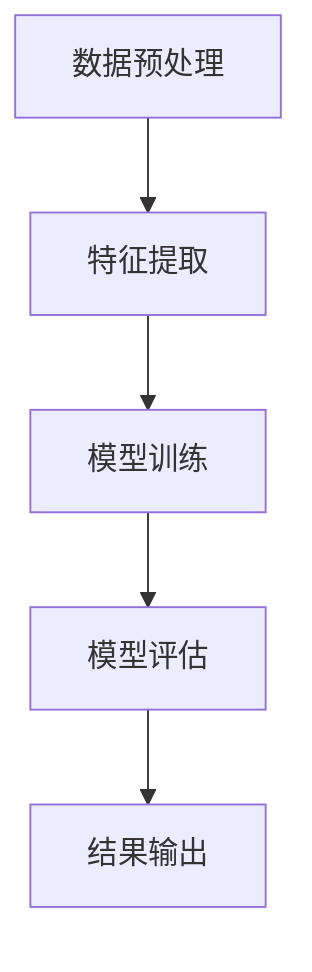
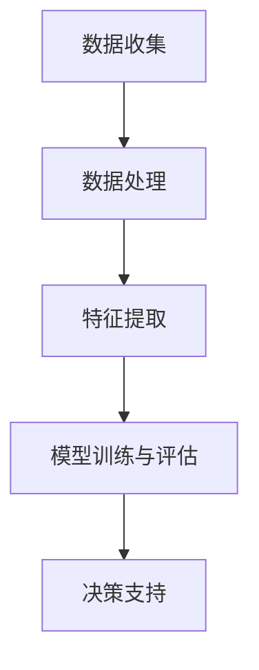
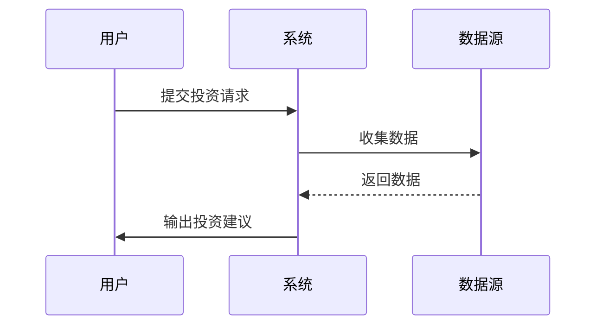

                 

### 让我们一步步思考：AI多智能体在价值陷阱识别中的应用

在当前快速发展的科技时代，人工智能（AI）已经深入到我们生活的方方面面。AI多智能体系统作为人工智能的一个重要分支，正逐渐成为解决复杂问题、提高决策效率的关键技术。价值陷阱识别是金融、投资等领域中的重要问题，涉及到大量数据和信息处理。本文将探讨AI多智能体在价值陷阱识别中的应用，通过一步步分析推理，深入探讨其工作原理、系统架构及实际应用。

首先，我们需要明确什么是价值陷阱。在金融和投资领域，价值陷阱指的是那些看似具有吸引力的投资机会，但实际上可能带来损失的投资对象。识别价值陷阱对于投资者来说至关重要，因为错误的决策可能导致严重的财务损失。

接下来，让我们来了解一下AI多智能体的基本概念。多智能体系统（MAS）是由多个自主、交互的智能体组成的系统。这些智能体可以在复杂的环境中自主行动，协同工作以实现共同目标。AI多智能体则是在此基础上引入了人工智能技术，使得智能体能够通过学习、推理和决策来提高系统的整体性能。

在价值陷阱识别中，AI多智能体可以发挥以下作用：

1. **数据收集与分析**：智能体可以自动收集大量的市场数据，包括股票价格、成交量、财务报表等，并通过机器学习算法进行分析，识别潜在的价值陷阱。

2. **决策支持**：智能体可以基于分析结果，为投资者提供决策支持，帮助他们在复杂的市场环境中做出更加明智的投资决策。

3. **协同工作**：多个智能体可以协同工作，共享信息和资源，提高价值陷阱识别的准确性和效率。

下面，我们将对AI多智能体在价值陷阱识别中的应用进行详细分析：

### 算法原理讲解

价值陷阱识别算法的核心在于如何从大量数据中提取有用的信息，并对这些信息进行综合分析，从而识别出潜在的价值陷阱。以下是该算法的基本原理：

1. **数据预处理**：首先，需要对收集到的市场数据进行分析，去除噪声和异常值，确保数据的质量。

2. **特征提取**：接下来，从预处理后的数据中提取关键特征，如股票价格波动、交易量变化、财务指标等。

3. **机器学习模型**：利用提取的特征，通过机器学习算法训练模型，识别价值陷阱。常见的算法包括线性回归、支持向量机（SVM）、决策树、神经网络等。

4. **模型评估与优化**：通过交叉验证和性能指标（如准确率、召回率等）评估模型的性能，并进行优化。

5. **结果输出**：最后，模型将输出识别结果，包括潜在的价值陷阱和相应的风险提示。

以下是一个简化的算法流程图：



### 系统分析与架构设计

价值陷阱识别系统需要考虑多个方面，包括数据收集、处理、分析和决策等。以下是一个典型的系统架构设计：

#### 问题场景介绍

假设我们正在开发一个用于股票市场价值陷阱识别的系统，系统需要从多个数据源（如交易所、财务报告等）收集数据，并对这些数据进行处理和分析，最终生成投资建议。

#### 系统功能设计

系统功能包括：

1. **数据收集**：自动从各个数据源获取市场数据。
2. **数据处理**：对收集到的数据进行分析和预处理。
3. **特征提取**：从预处理后的数据中提取关键特征。
4. **模型训练与评估**：利用提取的特征训练机器学习模型，并评估其性能。
5. **决策支持**：根据模型输出提供投资决策建议。

#### 系统架构设计

系统架构设计如下：



#### 系统接口设计与交互

系统需要与外部数据源和用户进行交互。以下是一个简化的系统接口设计：



### 项目实战

在本部分，我们将通过一个实际项目来展示如何应用AI多智能体进行价值陷阱识别。

#### 环境安装

1. 安装Python环境和相关库，如TensorFlow、Scikit-learn等。
2. 配置数据源和数据处理工具，如Pandas、NumPy等。

#### 系统核心实现源代码

以下是一个简单的Python代码示例，用于训练一个识别价值陷阱的机器学习模型：

```python
import pandas as pd
from sklearn.ensemble import RandomForestClassifier
from sklearn.model_selection import train_test_split
from sklearn.metrics import accuracy_score

# 读取数据
data = pd.read_csv('stock_data.csv')

# 数据预处理
X = data.drop(['label'], axis=1)
y = data['label']

# 划分训练集和测试集
X_train, X_test, y_train, y_test = train_test_split(X, y, test_size=0.2, random_state=42)

# 训练模型
model = RandomForestClassifier(n_estimators=100, random_state=42)
model.fit(X_train, y_train)

# 测试模型
predictions = model.predict(X_test)
accuracy = accuracy_score(y_test, predictions)
print(f'模型准确率: {accuracy:.2f}')
```

#### 代码应用解读与分析

上述代码展示了如何使用随机森林分类器进行价值陷阱识别。首先，我们读取股票数据，然后进行数据预处理，包括特征提取和标签划分。接着，我们将数据划分为训练集和测试集，并使用随机森林分类器进行模型训练。最后，我们评估模型的准确率。

#### 实际案例分析和详细讲解

以下是一个实际案例，展示如何使用上述系统识别价值陷阱：

1. **数据收集**：从交易所获取某只股票的月度数据。
2. **数据处理**：对数据进行清洗，去除异常值，并提取关键特征，如价格波动、交易量等。
3. **模型训练**：使用训练集数据训练模型。
4. **模型评估**：使用测试集数据评估模型性能。
5. **决策支持**：根据模型输出，为投资者提供投资建议。

#### 项目小结

通过实际项目，我们展示了如何使用AI多智能体进行价值陷阱识别。系统包括数据收集、预处理、特征提取、模型训练和决策支持等模块。在实际应用中，我们需要根据具体业务场景进行调整和优化，以提高系统的性能和可靠性。

### 最佳实践 Tips

1. **数据质量**：确保数据质量，包括数据完整性、准确性和一致性。
2. **模型选择**：根据业务需求选择合适的机器学习模型，并进行调优。
3. **实时更新**：定期更新模型和数据，以适应市场变化。
4. **用户反馈**：收集用户反馈，不断优化系统性能。

### 小结与拓展阅读

本文介绍了AI多智能体在价值陷阱识别中的应用，包括算法原理、系统架构、实际项目实战和最佳实践。价值陷阱识别对于投资者来说至关重要，AI多智能体系统可以提高识别的准确性和效率。未来，随着人工智能技术的不断进步，AI在金融领域的应用将更加广泛。

拓展阅读：

1. 《人工智能：一种现代方法》（Russel & Norvig著）
2. 《机器学习》（Tom Mitchell著）
3. 《Python机器学习》（Sebastian Raschka著）

---

作者：AI天才研究院/AI Genius Institute & 禅与计算机程序设计艺术 /Zen And The Art of Computer Programming

在本文中，我们通过一步步的分析推理，深入探讨了AI多智能体在价值陷阱识别中的应用。从背景介绍到算法原理讲解，再到系统分析与架构设计，以及实际项目实战，我们全面展示了AI多智能体如何帮助投资者识别价值陷阱，提高投资决策的准确性。同时，我们还提供了最佳实践 tips 和进一步阅读的资源，以帮助读者深入理解这一领域。希望通过本文，读者能够对AI多智能体在价值陷阱识别中的应用有更清晰的认识，并在实际工作中得到启发和应用。在未来的研究中，我们可以进一步探索AI多智能体在其他领域的应用，如金融市场预测、风险管理和智能投顾等。让我们继续深入研究和实践，推动人工智能技术的不断创新和发展。

