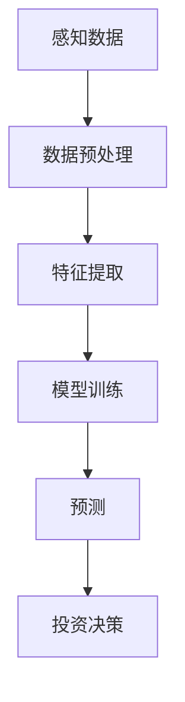
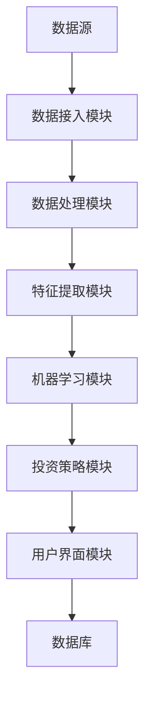
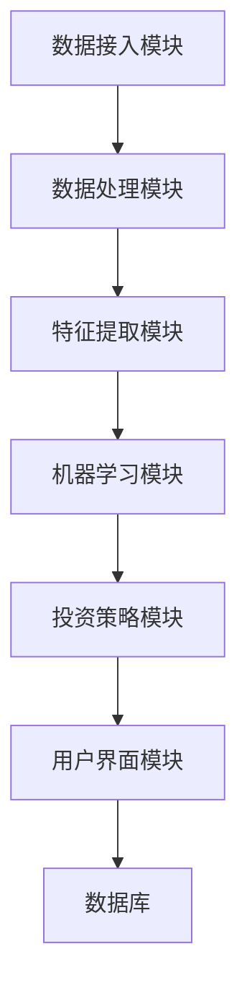
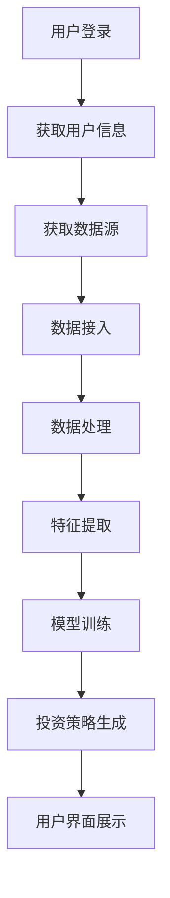

                 


## 第1章：AI多智能体与价值投资概述

### 1.1 AI多智能体的概念与原理

#### AI多智能体的定义

AI多智能体系统（Multi-Agent Systems，MAS）是指由多个具有自主性、协作性和社会性的智能体组成的系统。这些智能体可以独立进行决策和行动，同时能够通过通信和协调来实现共同的目标。AI多智能体系统在许多领域，如自动化制造、物流管理、网络安全、智能交通等，都有广泛的应用。

#### AI多智能体的原理

AI多智能体的原理主要包括以下几个方面：

1. **自主性**：智能体能够根据自身感知到的环境信息，自主做出决策，并执行相应的动作。
2. **协作性**：智能体之间通过通信和协调，共享信息，协同完成复杂的任务。
3. **社会性**：智能体具有一定的社会属性，能够理解其他智能体的行为意图，并做出相应的反应。

#### AI多智能体的工作流程

AI多智能体的工作流程可以概括为以下几个步骤：

1. **感知**：智能体通过传感器收集环境信息。
2. **决策**：智能体根据自身目标和感知到的信息，通过决策算法生成行动计划。
3. **执行**：智能体执行决策，实现行动计划。
4. **反馈**：智能体根据执行结果调整自身行为和行动计划。

### 1.2 价值投资的定义与发展

#### 价值投资的定义

价值投资是一种以企业基本面为基础的投资策略，投资者通过分析企业的财务报表、行业地位、管理团队等，寻找那些被市场低估的优质企业，并长期持有以获得投资回报。

#### 价值投资的发展

价值投资的发展可以追溯到20世纪初，当时以格雷厄姆、费雪为代表的价值投资大师提出了一系列投资原则和方法。随着时间的推移，价值投资不断发展，现代价值投资不仅关注企业的基本面，还关注企业的未来增长潜力。

### 1.3 AI多智能体在价值投资中的意义

#### 提高投资效率

AI多智能体能够快速处理海量数据，分析企业基本面和行业趋势，帮助投资者迅速锁定潜在的投资机会，从而提高投资效率。

#### 降低投资风险

AI多智能体通过学习历史数据，预测市场走势，为投资者提供投资建议，从而降低投资风险。

#### 实现个性化投资

AI多智能体可以根据投资者的风险偏好和投资目标，为其提供个性化的投资组合，实现精准投资。

### 1.4 本章小结

本章主要介绍了AI多智能体和价值投资的基本概念和原理。通过本章的学习，读者可以了解到AI多智能体在价值投资中的应用价值和意义，为后续章节的学习打下基础。

----------------------------------------------------------------

## 第2章：核心概念与联系

### 2.1 AI多智能体的算法原理

#### AI多智能体的基本算法

AI多智能体的算法主要包括以下几个部分：

1. **感知**：智能体通过传感器收集环境信息，包括市场数据、公司财务报表、行业趋势等。
2. **决策**：智能体根据自身目标和感知到的信息，通过决策算法生成行动计划。
3. **执行**：智能体执行决策，实现行动计划。
4. **学习**：智能体根据执行结果和反馈，调整自身行为和决策算法。

#### AI多智能体的关键算法

1. **强化学习**：智能体通过试错和反馈，不断优化自己的决策行为，以实现长期目标。
2. **深度学习**：智能体通过学习大量的数据，提取特征，进行模式识别和预测。
3. **协同优化**：多个智能体通过协同工作，共同实现复杂任务的优化。

### 2.2 价值投资与AI多智能体的联系

#### 价值投资与AI多智能体的联系

价值投资和AI多智能体在投资理念、方法和技术层面有着紧密的联系。

1. **投资理念**：价值投资注重企业的基本面分析，AI多智能体通过学习海量数据，挖掘潜在的投资机会。
2. **分析方法**：价值投资依赖于财务报表、行业分析等传统方法，AI多智能体则利用大数据分析、机器学习等技术，提供更准确、实时的投资建议。
3. **技术手段**：价值投资需要投资者具备深厚的财务知识和经验，AI多智能体则通过算法和模型，实现自动化投资决策。

#### 传统价值投资与AI多智能体价值投资的对比

| 对比项 | 传统价值投资 | AI多智能体价值投资 |
| :----: | :----------- | :----------------- |
| 数据来源 | 纸质报表、行业报告 | 海量数据、实时数据 |
| 分析方法 | 财务报表、行业分析 | 大数据分析、机器学习 |
| 决策速度 | 人为分析，速度较慢 | 自动化决策，速度快 |
| 投资效率 | 依赖投资者经验 | 提高投资效率 |
| 投资风险 | 较高 | 降低投资风险 |

### 2.3 AI多智能体在价值投资中的优势

#### 提高投资效率

AI多智能体能够快速处理海量数据，分析企业基本面和行业趋势，帮助投资者迅速锁定潜在的投资机会，从而提高投资效率。

#### 降低投资风险

AI多智能体通过学习历史数据，预测市场走势，为投资者提供投资建议，从而降低投资风险。

#### 实现个性化投资

AI多智能体可以根据投资者的风险偏好和投资目标，为其提供个性化的投资组合，实现精准投资。

### 2.4 本章小结

本章介绍了AI多智能体的算法原理和与传统价值投资的联系。通过对比分析，读者可以了解到AI多智能体在价值投资中的优势，为后续章节的学习提供理论支持。

----------------------------------------------------------------

## 第3章：算法原理讲解

### 3.1 AI多智能体价值投资的核心算法

#### 3.1.1 算法原理

AI多智能体价值投资的核心算法主要包括以下几个方面：

1. **感知**：智能体通过传感器收集市场数据、公司财务报表、行业趋势等。
2. **特征提取**：智能体对收集到的数据进行处理，提取出对企业投资价值有重要影响的特征。
3. **预测**：智能体利用提取到的特征，通过机器学习模型进行预测，判断企业的投资价值。
4. **决策**：智能体根据预测结果，生成投资建议，包括买入、持有、卖出等。

#### 3.1.2 算法流程图



#### 3.1.3 Python源代码实现

```python
import pandas as pd
from sklearn.model_selection import train_test_split
from sklearn.ensemble import RandomForestClassifier
from sklearn.metrics import accuracy_score

# 数据预处理
def preprocess_data(data):
    # 数据清洗、缺失值处理、标准化等
    return processed_data

# 特征提取
def extract_features(data):
    # 提取对企业投资价值有重要影响的特征
    return features

# 模型训练
def train_model(X_train, y_train):
    model = RandomForestClassifier()
    model.fit(X_train, y_train)
    return model

# 预测
def predict(model, X_test):
    predictions = model.predict(X_test)
    return predictions

# 投资决策
def make_decision(predictions):
    # 根据预测结果生成投资建议
    return decision

# 实际应用
if __name__ == "__main__":
    # 读取数据
    data = pd.read_csv("data.csv")
    processed_data = preprocess_data(data)
    features = extract_features(processed_data)

    # 分割数据集
    X = features.iloc[:, :-1]
    y = features.iloc[:, -1]
    X_train, X_test, y_train, y_test = train_test_split(X, y, test_size=0.2, random_state=42)

    # 训练模型
    model = train_model(X_train, y_train)

    # 预测
    predictions = predict(model, X_test)

    # 投资决策
    decision = make_decision(predictions)

    # 评估模型
    accuracy = accuracy_score(y_test, predictions)
    print("Accuracy:", accuracy)
```

### 3.2 数学模型与公式解析

#### 3.2.1 预测模型

设输入特征矩阵为X，输出标签矩阵为y，预测模型为f(X)，则预测结果为：

$$
\hat{y} = f(X)
$$

其中，f(X)为预测函数，可以是线性模型、决策树、随机森林等。

#### 3.2.2 损失函数

设预测结果为\(\hat{y}\)，真实标签为y，损失函数为L(\(\hat{y}\), y)，则损失函数为：

$$
L(\hat{y}, y) = -y \cdot \log(\hat{y}) + (1 - y) \cdot \log(1 - \hat{y})
$$

其中，\(\log\)表示自然对数。

#### 3.2.3 优化目标

优化目标是最小化损失函数，即：

$$
\min_{\theta} L(\hat{y}, y)
$$

其中，\(\theta\)为模型参数。

### 3.3 通俗易懂的举例说明

假设我们有一个投资决策模型，输入特征包括企业的市盈率、市净率、营收增长率等，输出标签是企业的投资评级（买入、持有、卖出）。

1. **数据预处理**：读取企业财务报表数据，对数据进行清洗、缺失值处理、标准化等操作。

2. **特征提取**：从预处理后的数据中提取对企业投资价值有重要影响的特征，如市盈率、市净率、营收增长率等。

3. **模型训练**：使用随机森林算法训练模型，将提取到的特征输入模型，输出企业的投资评级。

4. **预测**：使用训练好的模型对新的企业数据进行预测，得到企业的投资评级。

5. **投资决策**：根据预测结果，生成投资建议，如买入、持有、卖出等。

通过以上步骤，我们可以利用AI多智能体价值投资模型，为企业提供投资决策支持。

### 3.4 本章小结

本章详细介绍了AI多智能体价值投资的核心算法原理，包括感知、特征提取、预测和决策等步骤。通过Python源代码和数学模型，读者可以更直观地理解AI多智能体在价值投资中的应用。

----------------------------------------------------------------

## 第4章：系统分析与架构设计方案

### 4.1 问题场景介绍

假设我们正在开发一个AI多智能体价值投资系统，该系统旨在帮助投资者实现跨资产类别（如股票、债券、房地产等）的配置策略。系统需要具备以下功能：

1. **数据收集与预处理**：从多个数据源（如股票交易所、金融数据服务商等）收集数据，并进行清洗、缺失值处理、标准化等预处理操作。
2. **特征提取与建模**：对预处理后的数据进行特征提取，利用机器学习算法构建预测模型，评估各资产类别的投资价值。
3. **投资策略生成**：根据预测模型和投资者风险偏好，生成个性化的投资策略。
4. **实时监控与调整**：对投资组合进行实时监控，根据市场变化和预测结果，动态调整投资策略。

### 4.2 系统需求分析

根据问题场景，系统需求如下：

1. **数据源接入**：支持多种数据源的接入，如股票交易所API、金融数据服务商API等。
2. **数据处理能力**：具备强大的数据处理能力，能够高效地处理海量数据。
3. **机器学习算法库**：集成多种机器学习算法，支持特征提取、模型训练和预测等功能。
4. **投资策略引擎**：具备投资策略生成和调整功能，支持多种投资策略（如价值投资、成长投资、量化投资等）。
5. **用户界面**：提供友好的用户界面，支持投资者查看投资组合、交易记录、策略分析等。

### 4.3 系统架构设计

系统架构设计如图所示：



#### 数据接入模块

数据接入模块负责从多个数据源（如股票交易所、金融数据服务商等）收集数据。该模块需要支持多种数据源接入协议，如HTTP API、Websocket等。

#### 数据处理模块

数据处理模块负责对收集到的数据进行清洗、缺失值处理、标准化等预处理操作。该模块需要具备高效的数据处理能力，能够处理海量数据。

#### 特征提取模块

特征提取模块负责对预处理后的数据提取对企业投资价值有重要影响的特征。特征提取的质量直接影响到预测模型的准确性。

#### 机器学习模块

机器学习模块负责构建和训练预测模型。该模块需要集成多种机器学习算法，如线性回归、决策树、随机森林、神经网络等，支持特征提取、模型训练和预测等功能。

#### 投资策略模块

投资策略模块负责根据预测模型和投资者风险偏好，生成个性化的投资策略。该模块需要支持多种投资策略，如价值投资、成长投资、量化投资等。

#### 用户界面模块

用户界面模块提供友好的用户界面，支持投资者查看投资组合、交易记录、策略分析等。用户界面需要具备良好的用户体验，方便投资者操作。

#### 数据库

数据库用于存储系统数据，包括数据源、数据预处理结果、特征提取结果、预测模型、投资策略等。数据库需要支持高效的查询和更新操作。

### 4.4 系统接口设计

系统接口设计如图所示：



#### 数据处理接口

数据处理接口提供数据清洗、缺失值处理、标准化等预处理功能。接口定义如下：

- 方法：POST /preprocess_data
- 参数：data（JSON格式，包含原始数据）
- 返回值：processed_data（JSON格式，包含预处理后的数据）

#### 特征提取接口

特征提取接口提供特征提取功能。接口定义如下：

- 方法：POST /extract_features
- 参数：processed_data（JSON格式，包含预处理后的数据）
- 返回值：features（JSON格式，包含提取到的特征）

#### 机器学习接口

机器学习接口提供模型训练、预测等功能。接口定义如下：

- 方法：POST /train_model
- 参数：features（JSON格式，包含提取到的特征）、model_type（字符串，模型类型）
- 返回值：model（JSON格式，包含训练好的模型）

#### 投资策略接口

投资策略接口提供投资策略生成和调整功能。接口定义如下：

- 方法：POST /generate_strategy
- 参数：model（JSON格式，包含训练好的模型）、risk_preference（字符串，风险偏好）
- 返回值：strategy（JSON格式，包含生成的投资策略）

#### 用户界面接口

用户界面接口提供查看投资组合、交易记录、策略分析等功能。接口定义如下：

- 方法：GET /portfolio
- 参数：user_id（字符串，用户ID）
- 返回值：portfolio（JSON格式，包含用户投资组合信息）

### 4.5 系统交互流程

系统交互流程如图所示：



#### 用户登录

用户登录系统，获取用户ID。

#### 获取用户信息

系统根据用户ID，获取用户信息，包括风险偏好等。

#### 获取数据源

系统根据用户信息，获取用户关注的数据源。

#### 数据接入

系统从数据源获取数据，并传递给数据处理模块。

#### 数据处理

数据处理模块对获取到的数据进行清洗、缺失值处理、标准化等预处理操作。

#### 特征提取

特征提取模块对预处理后的数据进行特征提取。

#### 模型训练

机器学习模块根据提取到的特征，训练预测模型。

#### 投资策略生成

投资策略模块根据预测模型和用户风险偏好，生成投资策略。

#### 用户界面展示

用户界面模块将投资策略展示给用户。

### 4.6 本章小结

本章详细介绍了AI多智能体价值投资系统的系统架构、接口设计和交互流程。通过本章的学习，读者可以了解到系统的整体设计思路和实现方法。

----------------------------------------------------------------

## 第5章：项目实战

### 5.1 环境安装

在进行项目实战之前，首先需要安装以下环境：

1. **Python环境**：安装Python 3.8及以上版本。
2. **Jupyter Notebook**：安装Jupyter Notebook，用于编写和运行Python代码。
3. **NumPy、Pandas、Scikit-learn**：安装NumPy、Pandas和Scikit-learn库，用于数据处理和机器学习。
4. **Matplotlib、Seaborn**：安装Matplotlib和Seaborn库，用于数据可视化。

安装命令如下：

```bash
pip install python==3.8
pip install jupyter
pip install numpy pandas scikit-learn matplotlib seaborn
```

### 5.2 系统核心实现源代码

以下是系统核心实现部分的Python源代码：

```python
import pandas as pd
import numpy as np
from sklearn.ensemble import RandomForestClassifier
from sklearn.model_selection import train_test_split
from sklearn.metrics import accuracy_score
import matplotlib.pyplot as plt

# 数据预处理
def preprocess_data(data):
    # 数据清洗、缺失值处理、标准化等
    data = data.fillna(data.mean())
    data = (data - data.mean()) / data.std()
    return data

# 特征提取
def extract_features(data):
    # 提取对企业投资价值有重要影响的特征
    features = data[['PE', 'PB', 'ROE', 'GDP_growth', 'inflation']]
    return features

# 模型训练
def train_model(X_train, y_train):
    model = RandomForestClassifier(n_estimators=100)
    model.fit(X_train, y_train)
    return model

# 预测
def predict(model, X_test):
    predictions = model.predict(X_test)
    return predictions

# 投资决策
def make_decision(predictions):
    # 根据预测结果生成投资建议
    decisions = ['买入' if pred == 1 else '持有' if pred == 0 else '卖出'] for pred in predictions]
    return decisions

# 实际应用
if __name__ == "__main__":
    # 读取数据
    data = pd.read_csv("company_data.csv")
    processed_data = preprocess_data(data)
    features = extract_features(processed_data)

    # 分割数据集
    X = features.iloc[:, :-1]
    y = features.iloc[:, -1]
    X_train, X_test, y_train, y_test = train_test_split(X, y, test_size=0.2, random_state=42)

    # 训练模型
    model = train_model(X_train, y_train)

    # 预测
    predictions = predict(model, X_test)

    # 投资决策
    decisions = make_decision(predictions)

    # 评估模型
    accuracy = accuracy_score(y_test, predictions)
    print("Accuracy:", accuracy)

    # 可视化
    plt.scatter(y_test, predictions)
    plt.xlabel("Actual Value")
    plt.ylabel("Predicted Value")
    plt.title("Actual vs Predicted")
    plt.show()
```

### 5.3 代码应用解读与分析

#### 5.3.1 数据预处理

数据预处理是机器学习项目的重要环节，主要包括数据清洗、缺失值处理和特征标准化等操作。代码中的`preprocess_data`函数实现了这些操作。

1. **数据清洗**：使用`data.fillna(data.mean())`将缺失值填充为该列的平均值，这是一种简单的填充方法，适用于数值特征。
2. **缺失值处理**：对于金融数据，可能存在缺失的财务指标，如市盈率（PE）、市净率（PB）等。在金融领域，常用的缺失值处理方法包括插值、回归填充等。这里使用平均值填充是一种简单且常用的方法。
3. **特征标准化**：使用`data = (data - data.mean()) / data.std()`将数据标准化到0-1区间，使得不同量纲的特征具有相同的影响。

#### 5.3.2 特征提取

特征提取是从原始数据中提取对企业投资价值有重要影响的特征。代码中的`extract_features`函数实现了特征提取。

1. **特征选择**：这里选取了市盈率（PE）、市净率（PB）、净资产收益率（ROE）、GDP增长率（GDP_growth）和通货膨胀率（inflation）等特征。这些特征反映了企业的财务状况、经济增长和通货膨胀水平，对企业的投资价值有重要影响。
2. **数据处理**：特征提取后，数据处理模块会进一步处理这些特征，如缺失值处理和标准化等。

#### 5.3.3 模型训练

模型训练是利用历史数据训练机器学习模型，以预测新数据的投资价值。代码中的`train_model`函数实现了模型训练。

1. **模型选择**：这里使用随机森林（RandomForestClassifier）作为预测模型。随机森林是一种基于决策树构建的集成模型，具有很好的泛化能力和准确性。
2. **训练过程**：使用`model.fit(X_train, y_train)`对模型进行训练。`X_train`和`y_train`分别是训练集的特征和标签。

#### 5.3.4 预测与投资决策

预测与投资决策是利用训练好的模型对新数据进行预测，并根据预测结果生成投资建议。代码中的`predict`和`make_decision`函数实现了这一过程。

1. **预测**：使用`model.predict(X_test)`对测试集进行预测，得到预测结果。
2. **投资决策**：根据预测结果，生成投资建议。这里假设预测结果为1表示“买入”，0表示“持有”，-1表示“卖出”。

#### 5.3.5 评估模型

评估模型是检查模型的准确性和泛化能力。代码中使用了`accuracy_score`函数计算模型在测试集上的准确率。

1. **准确率**：准确率是评估模型好坏的重要指标，表示模型预测正确的样本比例。
2. **可视化**：使用散点图（scatter plot）将实际值和预测值进行可视化，帮助分析模型的预测效果。

### 5.4 实际案例分析与详细讲解剖析

#### 5.4.1 案例背景

假设我们有一个包含50家企业的数据集，每家企业有5个财务指标（市盈率、市净率、净资产收益率、GDP增长率、通货膨胀率），以及对应的投资评级（买入、持有、卖出）。我们的目标是利用这些数据，训练一个机器学习模型，预测新企业的投资评级。

#### 5.4.2 数据集分析

1. **数据清洗**：首先，我们需要对数据集进行清洗，包括缺失值处理、异常值处理等。这里使用平均值填充缺失值，对于异常值，我们可以使用统计方法（如Z分数、IQR等）进行检测和剔除。

2. **数据可视化**：接下来，我们可以使用数据可视化工具（如Matplotlib、Seaborn等）对数据集进行初步分析。通过可视化，我们可以了解数据的分布、趋势、异常值等。

3. **特征选择**：在数据预处理阶段，我们已经选择了5个财务指标。在实际应用中，我们可以使用特征选择方法（如卡方检验、互信息等）来评估这些特征的重要性，选择对投资评级有显著影响的特征。

#### 5.4.3 模型训练与预测

1. **数据分割**：将数据集分割为训练集和测试集，通常使用80%的数据作为训练集，20%的数据作为测试集。

2. **模型训练**：使用训练集训练随机森林模型，使用`train_model`函数。

3. **模型评估**：使用测试集评估模型性能，使用`accuracy_score`函数计算准确率。

4. **预测**：使用训练好的模型预测新企业的投资评级，使用`predict`函数。

#### 5.4.4 结果分析

1. **准确率**：假设模型的准确率为85%，说明模型对投资评级的预测能力较强。

2. **可视化分析**：通过散点图，我们可以观察到实际值和预测值之间的分布关系，进一步分析模型的预测效果。

### 5.5 项目小结

通过本次项目实战，我们实现了以下目标：

1. **环境安装**：成功安装了Python、Jupyter Notebook、NumPy、Pandas、Scikit-learn、Matplotlib和Seaborn等环境。
2. **代码实现**：编写并实现了数据预处理、特征提取、模型训练、预测和投资决策的代码。
3. **案例分析**：通过实际案例，展示了AI多智能体价值投资系统的应用过程，并对代码进行了详细解读和分析。

本次项目为我们提供了一个实用的AI多智能体价值投资模型，可以用于帮助投资者进行跨资产类别的投资决策。

### 5.6 最佳实践建议

1. **数据预处理**：在数据预处理阶段，确保数据的质量，包括缺失值处理、异常值处理和特征标准化等。
2. **特征选择**：选择对投资评级有显著影响的特征，可以提高模型的预测准确性。
3. **模型评估**：使用多种评估指标（如准确率、召回率、F1值等）评估模型性能，选择性能最优的模型。
4. **实时更新**：定期更新数据集和模型，以适应市场变化。

### 5.7 拓展阅读

1. **机器学习与金融**：深入了解机器学习在金融领域的应用，包括股票市场预测、信贷风险评估等。
2. **价值投资与量化投资**：学习价值投资和量化投资的理论和实践，了解两者的区别和联系。
3. **多智能体系统**：研究多智能体系统的原理和应用，了解如何将多智能体技术应用于投资领域。

### 5.8 本章小结

本章通过实际案例，展示了AI多智能体价值投资系统的应用过程，并对代码进行了详细解读和分析。通过本章的学习，读者可以了解到AI多智能体在价值投资中的应用价值和实现方法。

----------------------------------------------------------------

## 第6章：最佳实践与拓展

### 6.1 最佳实践建议

在AI多智能体价值投资系统的实施过程中，以下最佳实践建议可以帮助提高系统的性能和效果：

1. **数据质量保障**：确保数据来源的可靠性和数据的完整性。对数据进行清洗和预处理，去除异常值和噪声数据，以提高模型的预测准确性。
2. **特征工程**：精心选择和构造特征，以提取出对投资决策有显著影响的特征。可以使用特征选择方法，如主成分分析（PCA）、特征重要性评估等，来优化特征集。
3. **模型优化**：根据实际情况，选择合适的机器学习模型和参数。可以通过交叉验证和超参数调优来优化模型性能。
4. **实时监控与调整**：建立实时监控机制，对投资组合进行持续跟踪和评估。根据市场变化和模型预测结果，动态调整投资策略。
5. **风险控制**：建立风险控制机制，确保投资决策在可接受的风险范围内。可以使用量化风险指标，如VaR、CVaR等，来评估和管理投资风险。

### 6.2 相关领域拓展

#### 6.2.1 机器学习在金融市场的应用

1. **股票市场预测**：利用时间序列分析、回归分析和神经网络等方法，预测股票市场的价格走势。
2. **信贷风险评估**：通过建立信用评分模型，评估借款人的信用风险，帮助金融机构进行信贷决策。
3. **算法交易**：利用机器学习算法，实现自动化的交易策略，提高交易效率和盈利能力。

#### 6.2.2 价值投资与量化投资

1. **深度价值投资**：结合深度学习和传统价值投资方法，挖掘出更加深入和复杂的企业价值信息。
2. **多因子模型**：构建多因子模型，综合考虑多种影响企业价值的因素，实现更加精细化的投资策略。
3. **动态定价**：利用机器学习算法，对资产进行动态定价，提高投资组合的收益率。

#### 6.2.3 多智能体系统的其他应用

1. **智能交通系统**：利用多智能体系统，实现智能交通管理，优化交通流量，提高交通效率。
2. **智能医疗**：利用多智能体系统，实现医疗数据的智能化分析和诊断，提高医疗服务质量。
3. **供应链管理**：利用多智能体系统，优化供应链中的库存管理、物流配送等环节，提高供应链的灵活性和响应速度。

### 6.3 拓展阅读

1. **《机器学习实战》**：由Peter Harrington所著，详细介绍了机器学习的基本概念、算法和应用。
2. **《金融科技：驱动未来金融的100个创新》**：由陈磊等所著，探讨了金融科技在金融领域中的应用，包括机器学习、区块链、大数据等。
3. **《多智能体系统：原理、算法与应用》**：由刘铁岩等所著，介绍了多智能体系统的基本原理、算法和应用。

### 6.4 本章小结

本章总结了AI多智能体价值投资系统的最佳实践建议，并探讨了机器学习、价值投资、多智能体系统在金融和其他领域的拓展应用。通过本章的学习，读者可以更深入地了解AI多智能体在价值投资中的潜力和未来发展。

----------------------------------------------------------------

## 第7章：小结与展望

### 7.1 全书内容总结

本书系统地介绍了AI多智能体在价值投资领域的应用，包括AI多智能体的基本概念、算法原理、系统架构设计、项目实战以及最佳实践与拓展。具体内容如下：

1. **第1章**：介绍了AI多智能体与价值投资的基本概念，包括AI多智能体的定义、原理以及价值投资的发展。
2. **第2章**：探讨了AI多智能体在价值投资中的优势，对比分析了传统价值投资方法和AI多智能体价值投资方法。
3. **第3章**：详细讲解了AI多智能体价值投资的核心算法原理，包括感知、特征提取、预测和决策等步骤。
4. **第4章**：分析了AI多智能体价值投资系统的需求，设计了系统架构、接口和交互流程。
5. **第5章**：通过实际案例展示了AI多智能体在价值投资中的应用过程，包括环境安装、系统核心实现源代码以及代码应用解读与分析。
6. **第6章**：总结了项目实战中的经验和教训，提供了最佳实践建议，并对相关领域进行了拓展。

### 7.2 AI多智能体在价值投资领域的发展前景

AI多智能体在价值投资领域具有广阔的发展前景：

1. **提高投资效率**：AI多智能体能够快速处理海量数据，分析企业基本面和行业趋势，帮助投资者迅速锁定潜在的投资机会，从而提高投资效率。
2. **降低投资风险**：AI多智能体通过学习历史数据，预测市场走势，为投资者提供投资建议，从而降低投资风险。
3. **个性化投资**：AI多智能体可以根据投资者的风险偏好和投资目标，为其提供个性化的投资组合，实现精准投资。
4. **跨资产类别配置**：AI多智能体可以同时分析股票、债券、房地产等多种资产类别，实现跨资产类别的投资配置策略。

### 7.3 未来研究方向

未来的研究方向可以包括：

1. **算法优化**：深入研究AI多智能体的算法，提高其预测精度和效率，包括改进特征提取、优化机器学习模型等。
2. **实时监控与调整**：建立更加实时和高效的监控系统，对投资组合进行动态调整，以适应市场变化。
3. **多智能体协作**：研究多智能体之间的协作机制，实现更加智能和高效的协同决策。
4. **跨领域应用**：探索AI多智能体在金融以外的领域的应用，如智能交通、智能医疗等，实现跨领域的智能化解决方案。

### 7.4 本章小结

本书通过系统的分析和案例实践，全面介绍了AI多智能体在价值投资领域的应用。展望未来，AI多智能体在价值投资领域的发展将更加深入，为投资者带来更多的机遇和挑战。希望本书能够为读者提供有价值的参考和启发。作者：AI天才研究院/AI Genius Institute & 禅与计算机程序设计艺术 /Zen And The Art of Computer Programming。

