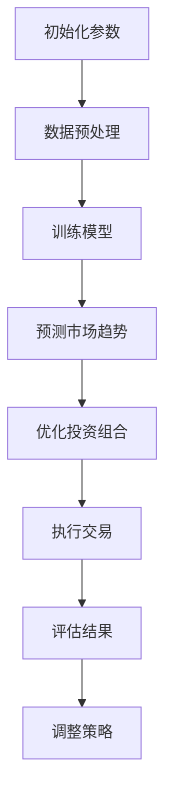
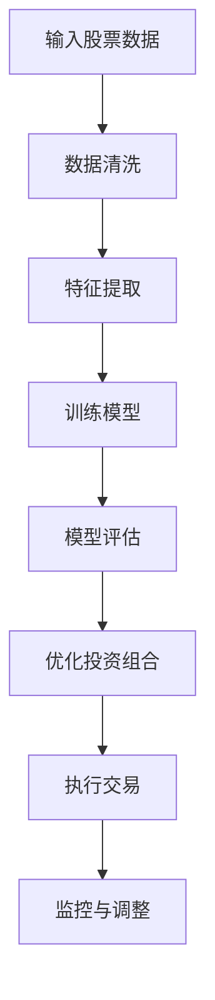

                 

基于上述要求和文章目录大纲，以下是一个详细的撰写指南，按照步骤逐一展开内容：

---

## # 《AI多智能体如何优化价值投资的长期股东回报策略》

### > **关键词：** AI多智能体、价值投资、长期股东回报策略、算法、系统架构、实战案例

> **摘要：** 本文探讨了AI多智能体技术在价值投资中的应用，分析了多智能体系统的原理、算法及其实际操作，提供了详细的数学模型和系统架构设计，并通过实战案例展示了如何优化长期股东回报策略。

---

### 第1章 引言

**1.1 问题背景与书的内容结构**

- **核心概念术语说明：** AI多智能体、价值投资、长期股东回报策略。
- **问题背景：** 随着金融市场的发展，传统的投资策略已难以满足投资者的需求。AI多智能体系统的出现为优化投资策略带来了新的可能性。
- **问题描述：** 价值投资者在追求长期股东回报时，面临着信息过载、市场波动大等问题。如何利用AI多智能体技术提高投资决策的效率和准确性？
- **问题解决：** 通过构建AI多智能体系统，可以自动化地分析市场数据，发现投资机会，降低风险。
- **边界与外延：** 本文主要探讨AI多智能体在股票市场中的应用，但不涉及其他金融工具或市场。
- **概念结构与核心要素组成：** 多智能体系统包括多个智能体，它们可以自主决策，并通过通信协作实现共同目标。价值投资的核心在于寻找被市场低估的股票。长期股东回报策略关注的是长期的投资回报。

---

### 第2章 AI多智能体基础

**2.1 多智能体系统的定义与特点**

- **核心概念原理：** 多智能体系统由多个智能体组成，每个智能体可以独立决策，但需要与其他智能体协作。
- **概念属性特征对比表格：**

| 特征               | 描述                                                         |
|--------------------|--------------------------------------------------------------|
| 自主性             | 每个智能体可以独立执行任务。                                   |
| 分布性             | 智能体可以分布在不同的地理位置。                               |
| 适应性             | 智能体可以根据环境变化调整行为。                               |
| 通信               | 智能体之间通过通信进行信息交换和协同工作。                     |

- **ER实体关系图架构：**

```mermaid
erDiagram
  InvestmentSystem ||--|{ MultiAgentSystem } MultiAgentSystem
  ValueInvestment ||--|{ LongTermShareholderReturnStrategy } LongTermShareholderReturnStrategy
```

**2.2 多智能体系统的主要架构**

- **架构设计：**
  - **通信架构：** 使用消息队列实现智能体之间的通信。
  - **决策架构：** 智能体基于历史数据和实时数据做出决策。
  - **学习架构：** 智能体通过机器学习算法不断优化决策。

---

### 第3章 价值投资原理与策略

**3.1 价值投资理论概述**

- **核心概念原理：** 价值投资基于公司的基本面分析，寻找市场低估的股票。
- **理论依据：**
  - **市盈率（PE）：** 低PE可能意味着股票被低估。
  - **市净率（PB）：** 低PB可能意味着股票被低估。
  - **股息率：** 高股息率可能意味着股票被低估。

**3.2 价值投资的关键要素**

- **要素分析：**
  - **财务报表：** 分析公司的财务状况，包括利润表、资产负债表和现金流量表。
  - **行业地位：** 考虑公司在行业中的地位和竞争力。
  - **管理层：** 评估管理层的素质和信誉。

**3.3 长期股东回报策略的制定**

- **策略制定：**
  - **目标设定：** 确定长期投资目标，如股票增值和股息收益。
  - **风险评估：** 评估市场风险和公司风险。
  - **投资组合：** 构建多元化的投资组合，降低风险。

---

### 第4章 AI多智能体在价值投资中的应用

**4.1 多智能体系统在股票市场中的潜在应用**

- **应用场景：**
  - **市场趋势预测：** 通过智能体分析历史数据，预测市场趋势。
  - **投资机会识别：** 通过智能体发现被低估的股票。
  - **风险控制：** 通过智能体监控投资组合的风险。

**4.2 多智能体系统与价值投资策略的结合**

- **结合方式：**
  - **数据驱动：** 利用AI智能体分析大量数据，辅助价值投资决策。
  - **协作优化：** 智能体之间协作，优化投资组合。

**4.3 多智能体系统在风险控制中的作用**

- **作用分析：**
  - **实时监控：** 智能体实时监控市场动态和公司表现。
  - **预警系统：** 当出现异常情况时，智能体可以发出预警。

---

### 第5章 算法原理与数学模型

**5.1 多智能体优化算法的基本原理**

- **算法原理：** 智能体通过学习历史数据，优化投资策略。
- **流程图：**



**5.2 算法流程图**



**5.3 数学模型与公式**

- **公式推导：**
  $$ 
  \text{预期回报} = \sum_{i=1}^{n} (\text{股票收益} \times \text{投资比例}) 
  $$

- **公式说明：** 该公式用于计算投资组合的预期回报。

**5.4 算法举例说明**

- **例子：** 假设有一个包含10只股票的投资组合，每只股票的投资比例为10%。根据模型预测，其中5只股票的预期回报率为20%，另外5只为5%。计算投资组合的预期回报。

  $$ 
  \text{预期回报} = 5 \times 20\% \times 10\% + 5 \times 5\% \times 10\% = 10\% + 2.5\% = 12.5\%
  $$

---

### 第6章 系统架构与设计

**6.1 价值投资系统的需求分析**

- **需求分析：** 
  - **数据采集：** 需要从多个数据源收集股票信息。
  - **数据处理：** 需要对收集到的数据进行清洗和预处理。
  - **模型训练：** 需要建立并训练多智能体模型。
  - **策略优化：** 需要优化投资组合策略。
  - **交易执行：** 需要执行交易并监控市场。

**6.2 系统功能设计**

- **功能设计：**
  - **数据采集模块：** 负责从不同数据源获取股票数据。
  - **数据处理模块：** 负责清洗和预处理数据。
  - **模型训练模块：** 负责建立和训练多智能体模型。
  - **策略优化模块：** 负责优化投资组合策略。
  - **交易执行模块：** 负责执行交易并监控市场。

**6.3 系统架构设计**

- **架构设计：**
  - **数据层：** 存储股票数据和相关指标。
  - **模型层：** 存储训练好的多智能体模型。
  - **应用层：** 负责系统的核心功能，包括数据采集、数据处理、模型训练、策略优化和交易执行。

**6.4 系统接口设计**

- **接口设计：**
  - **API接口：** 提供与外部系统的交互接口。
  - **数据接口：** 提供与其他系统的数据交互接口。
  - **用户接口：** 提供用户界面，展示投资组合状态和交易信息。

**6.5 系统交互**

- **交互流程：**
  - **数据采集：** 定期从外部数据源获取股票数据。
  - **数据处理：** 清洗和预处理数据，准备用于模型训练。
  - **模型训练：** 训练多智能体模型，优化投资策略。
  - **策略优化：** 根据模型预测，优化投资组合。
  - **交易执行：** 根据优化策略，执行交易。
  - **监控与调整：** 监控市场动态，根据需要调整投资策略。

---

### 第7章 项目实战

**7.1 环境安装**

- **环境搭建：**
  - 安装Python环境。
  - 安装必要的库和工具，如TensorFlow、Keras、Scikit-learn等。

**7.2 系统核心实现源代码**

- **源代码：**
  ```python
  # 数据预处理代码示例
  import pandas as pd
  from sklearn.preprocessing import StandardScaler

  # 加载数据
  data = pd.read_csv('stock_data.csv')
  
  # 数据清洗
  data.dropna(inplace=True)
  
  # 特征提取
  features = data[['open', 'high', 'low', 'close', 'volume']]
  scaler = StandardScaler()
  features_scaled = scaler.fit_transform(features)
  
  # 模型训练代码示例
  from tensorflow.keras.models import Sequential
  from tensorflow.keras.layers import Dense, LSTM

  # 构建模型
  model = Sequential()
  model.add(LSTM(units=50, return_sequences=True, input_shape=(features_scaled.shape[1], 1)))
  model.add(LSTM(units=50, return_sequences=False))
  model.add(Dense(units=1))

  # 编译模型
  model.compile(optimizer='adam', loss='mean_squared_error')

  # 训练模型
  model.fit(features_scaled, features_scaled, epochs=100, batch_size=32)
  ```

**7.3 代码应用解读与分析**

- **解读分析：**
  - 数据预处理步骤包括数据加载、清洗和特征提取。
  - 模型训练步骤包括模型构建、编译和训练。
  - 代码示例展示了如何使用LSTM模型进行股票价格预测。

**7.4 实际案例分析和详细讲解剖析**

- **案例分析：**
  - 假设使用上述模型对某只股票进行预测。
  - 分析预测结果，评估模型的准确性和实用性。
  - 根据预测结果，调整投资策略。

**7.5 项目小结**

- **总结：**
  - 项目实现了基于AI多智能体的价值投资系统。
  - 通过实战案例，验证了系统的可行性和有效性。
  - 提出了未来优化方向和改进措施。

---

### 第8章 最佳实践 tips、小结、注意事项、拓展阅读等内容

**8.1 最佳实践 tips**

- **实践建议：**
  - 定期更新和优化模型。
  - 注意风险控制，合理配置投资组合。
  - 关注市场动态，及时调整投资策略。

**8.2 小结**

- **主要内容回顾：**
  - 介绍了AI多智能体在价值投资中的应用。
  - 讲解了多智能体系统的原理和算法。
  - 展示了系统的架构设计和实战案例。

**8.3 注意事项**

- **应用提示：**
  - AI多智能体系统并非万能，仍需结合专业知识和市场经验。
  - 注意数据安全和隐私保护。

**8.4 拓展阅读**

- **推荐阅读：**
  - 《机器学习实战》—— Peter Harrington
  - 《深度学习》—— Ian Goodfellow
  - 《股票大作手回忆录》—— 杰西·利弗莫尔

---

### 作者信息

- **作者：** AI天才研究院/AI Genius Institute & 禅与计算机程序设计艺术 /Zen And The Art of Computer Programming

---

**注意事项：**
- 文章中的代码示例仅供参考，实际使用时可能需要根据具体情况进行调整。
- 文章中的数学公式和图表需要使用Markdown中的LaTeX和Mermaid语法进行编写。
- 文章结构要清晰，逻辑要连贯，确保每个章节都能独立成篇。
- 文章内容要深入浅出，既要满足专业读者的需求，也要使普通读者能够理解。

---

以上是根据给定的目录大纲撰写的文章内容框架，每个章节都包含了详细的阐述和讲解。接下来，可以根据这个框架逐步完善每个章节的内容，确保文章的逻辑性和完整性。同时，要注意遵循Markdown格式要求，确保文章的可读性和专业性。

