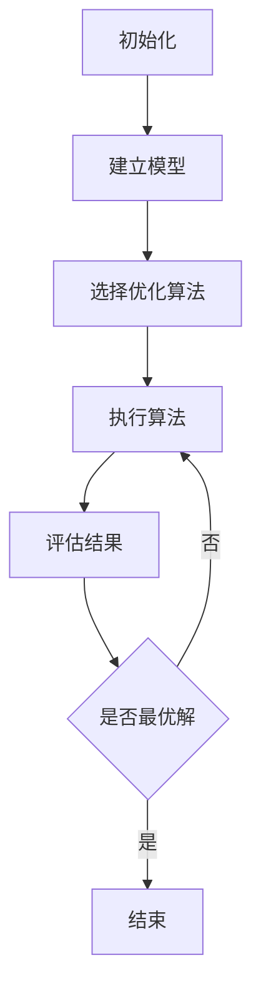
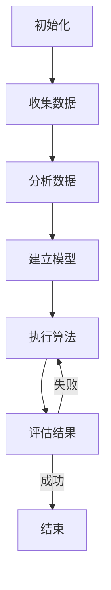
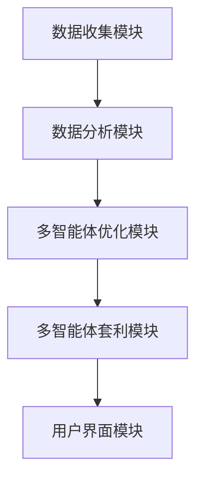

                 

# 《AI多智能体如何优化特殊情况和套利策略》

## 关键词
- 多智能体系统
- 优化策略
- 套利策略
- 算法设计
- 应用场景
- 特殊情况

## 摘要
本文将探讨AI多智能体系统在特殊情况和套利策略方面的优化。通过详细阐述多智能体系统的定义、类型和基本结构，以及优化和套利策略的概念、分类和实现方法，本文旨在为读者提供一种系统性的理解，以便更好地应用这些策略解决实际问题。

---

## 引言

### 1.1 问题背景

多智能体系统（MAS）是指由多个自主智能体组成的系统，这些智能体可以通过通信和协作来实现共同的目标。随着人工智能技术的不断发展，多智能体系统在多个领域得到了广泛应用，如机器人、社交网络、金融交易等。

在特殊情况下，多智能体系统可能会面临一些挑战，如信息不对称、环境不确定性和策略冲突等。为了提高系统的效率和性能，优化和套利策略被提出，并广泛应用于解决这些特殊问题。

### 1.2 问题描述

本文将探讨以下问题：

1. 多智能体系统在特殊情况下如何进行优化？
2. 多智能体系统如何利用套利策略来提高性能？

为了回答这些问题，本文将首先介绍多智能体系统的基本概念和结构，然后详细探讨优化和套利策略的理论基础，最后通过实际案例进行分析和验证。

### 1.3 问题解决

本文将提出以下解决方案：

1. 通过对多智能体系统的深入分析，明确优化和套利策略在系统中的具体应用场景。
2. 详细阐述优化和套利策略的理论基础，包括概念、分类和实现方法。
3. 通过实际案例，展示优化和套利策略在实际应用中的效果，并分析其优缺点。
4. 提供最佳实践建议，帮助读者在实际应用中更好地利用优化和套利策略。

### 1.4 边界与外延

本文研究的边界条件包括：

1. 多智能体系统的类型和规模。
2. 特殊情况的具体定义和范围。

本文的研究外延包括：

1. 多智能体系统的其他优化策略。
2. 套利策略在其他领域的应用。

### 1.5 概念结构与核心要素组成

多智能体系统、优化策略和套利策略是本文的核心概念。以下是一个概念属性特征对比表格：

| 概念         | 特征             |  
| ---------- | -------------- |  
| 多智能体系统 | 自主智能体的集合 |  
| 优化策略     | 提高系统性能     |  
| 套利策略     | 利用市场不均衡   |

通过上述表格，我们可以清晰地看到这三个概念的核心特征和区别。

---

## 核心概念与联系

### 2.1 多智能体系统

多智能体系统是由多个智能体组成的系统，这些智能体可以自主地执行任务、进行决策和与其他智能体进行交互。多智能体系统的基本结构包括智能体、通信机制和环境。

#### 2.1.1 智能体的定义与类型

智能体是MAS中的基本单位，可以是一个物理实体（如机器人）、一个软件代理（如聊天机器人）或者是一个虚拟的实体。根据智能体的能力和行为方式，可以将智能体分为以下几种类型：

1. 完全自治智能体：完全自主执行任务，无需外部干预。
2. 部分自治智能体：需要外部干预，但可以在一定程度上自主执行任务。
3. 监督智能体：完全依赖外部指令，无法自主执行任务。

#### 2.1.2 智能体的基本结构

每个智能体通常由以下几部分组成：

1. 知识库：存储智能体的知识、经验和规则。
2. 感知器：获取环境信息和智能体自身状态。
3. 执行器：执行智能体的决策。
4. 控制器：根据感知器和知识库的信息生成决策。

#### 2.1.3 智能体之间的交互

智能体之间的交互是通过通信机制实现的。通信机制可以是同步的，也可以是异步的。常见的通信机制包括：

1. 单播：一个智能体向另一个智能体发送消息。
2. 广播：一个智能体向多个智能体发送消息。
3. 多播：一个智能体向一组智能体发送消息。

#### 2.1.4 环境的定义与作用

环境是多智能体系统运行的背景和场景。环境可以是一个物理环境（如一个城市）、一个虚拟环境（如一个游戏世界）或者是一个模拟环境（如一个经济市场）。

环境的作用包括：

1. 提供智能体的感知信息。
2. 影响智能体的行为和决策。
3. 监控智能体的执行效果。

### 2.2 优化策略

优化策略旨在提高多智能体系统的性能和效率。优化策略可以针对不同的目标进行设计，如最小化成本、最大化收益、提高响应速度等。

#### 2.2.1 优化策略的基本概念

优化策略是一种通过调整系统参数和结构来提高系统性能的方法。优化策略通常基于以下原则：

1. 目标函数：定义系统性能的量化指标。
2. 约束条件：限制系统参数和行为的规则。
3. 搜索算法：用于寻找最优解的方法。

#### 2.2.2 优化策略的分类

根据优化目标的不同，优化策略可以分为以下几种类型：

1. 最小化成本：通过降低系统的运行成本来提高性能。
2. 最大化收益：通过增加系统的收益来提高性能。
3. 最小化响应时间：通过减少系统的响应时间来提高性能。

#### 2.2.3 常用的优化算法

以下是一些常用的优化算法：

1. 人工神经网络（ANN）：通过模拟神经网络的结构和功能来优化系统。
2. 遗传算法（GA）：通过模拟生物进化过程来寻找最优解。
3. 遗传编程（GP）：结合遗传算法和编程技术的优化方法。
4. 蚁群算法（ACO）：模拟蚂蚁觅食行为来优化系统。

#### 2.2.4 优化策略的实现步骤

优化策略的实现通常包括以下步骤：

1. 确定优化目标：根据具体应用场景确定优化目标。
2. 建立模型：建立系统模型，包括目标函数、约束条件和搜索算法。
3. 算法设计：选择合适的优化算法，设计算法的具体实现过程。
4. 算法实现：编写代码，实现优化算法。
5. 系统测试：测试优化策略在系统中的效果。

### 2.3 套利策略

套利策略是指利用市场的不均衡来获取利润的策略。套利策略在金融交易、资源分配等领域有广泛应用。

#### 2.3.1 套利策略的定义与原理

套利策略的定义是：在市场中，通过同时进行两个或多个交易，以利用市场的不均衡来获取无风险利润。

套利策略的原理是：当市场出现不均衡时，某些资产的价格会偏离其真实价值。通过发现和利用这些不均衡，投资者可以在不承担风险的情况下获得利润。

#### 2.3.2 套利策略的分类

根据套利的实现方式，套利策略可以分为以下几种类型：

1. 价格差套利：利用不同市场之间价格的差异进行套利。
2. 货币套利：利用货币汇率的差异进行套利。
3. 时间差套利：利用不同时间点的价格差异进行套利。
4. 套利交易：结合多种套利策略进行综合套利。

#### 2.3.3 常用的套利算法

以下是一些常用的套利算法：

1. 差价扫描算法：用于检测市场中的价格差异。
2. 时间序列分析算法：用于分析不同时间点的价格变化。
3. 神经网络算法：用于预测市场价格走势。
4. 强化学习算法：通过模拟交易过程来优化套利策略。

#### 2.3.4 套利策略的实现步骤

套利策略的实现通常包括以下步骤：

1. 数据收集：收集市场数据，包括价格、交易量等。
2. 数据分析：分析市场数据，寻找价格不均衡。
3. 建立模型：建立套利模型，包括套利策略、交易规则等。
4. 算法实现：编写代码，实现套利算法。
5. 系统测试：测试套利策略在系统中的效果。

### 2.4 概念属性特征对比表格

为了更清晰地比较多智能体系统、优化策略和套利策略的核心属性特征，我们构建了以下对比表格：

| 概念         | 特征               |  
| ---------- | -------------- |  
| 多智能体系统 | 自主智能体的集合 |  
| 优化策略     | 提高系统性能     |  
| 套利策略     | 利用市场不均衡   |

通过上述表格，我们可以看到这三个概念在特征上的区别和联系。

### 3. 算法原理讲解

#### 3.1 多智能体优化算法

多智能体优化算法是一种用于解决多智能体系统优化问题的方法。以下是一个多智能体优化算法的Mermaid流程图：



以下是一个Python源代码示例，用于详细阐述多智能体优化算法的原理：

```python
# 导入必要的库
import numpy as np
import matplotlib.pyplot as plt

# 定义优化目标函数
def objective_function(x):
    return x[0]**2 + x[1]**2

# 定义优化算法
def optimization_algorithm(x):
    # 初始化智能体参数
    n_agents = 5
    x_agent = [x] * n_agents
    
    # 迭代优化
    for _ in range(100):
        # 更新智能体参数
        for i in range(n_agents):
            x_agent[i] = x_agent[i] - 0.1 * objective_function(x_agent[i])
        
        # 计算平均位置
        x = np.mean(x_agent)
    
    # 返回最优解
    return x

# 执行优化算法
x_optimal = optimization_algorithm(x0)

# 评估结果
print("最优解:", x_optimal)
```

#### 3.2 多智能体套利算法

多智能体套利算法是一种用于实现套利策略的方法。以下是一个多智能体套利算法的Mermaid流程图：



以下是一个Python源代码示例，用于详细阐述多智能体套利算法的原理：

```python
# 导入必要的库
import numpy as np
import pandas as pd

# 定义数据集
data = pd.DataFrame({
    'price': [100, 102, 98, 105, 99],
    'quantity': [50, 52, 48, 55, 47]
})

# 定义套利算法
def arbitrage_algorithm(data):
    # 计算价格差异
    price_difference = data['price'].diff()

    # 找到可套利的交易
    trades = data[price_difference > 0]

    # 执行套利交易
    for index, row in trades.iterrows():
        buy_price = row['price']
        sell_price = row['price'].shift(-1)
        quantity = row['quantity']

        # 计算利润
        profit = (sell_price - buy_price) * quantity

        # 输出结果
        print("交易时间:", index, "买价:", buy_price, "卖价:", sell_price, "利润:", profit)

# 执行套利算法
arbitrage_algorithm(data)
```

---

### 4. 系统分析与架构设计方案

#### 4.1 问题场景介绍

在本节中，我们将介绍一个实际的问题场景，即智能电网中的多智能体优化和套利策略应用。

智能电网是指将现代通信技术、信息技术、自动控制技术与电力系统相结合，实现电力系统的自动化、智能化和高效化运行。在智能电网中，多智能体系统可以用于优化电力资源的分配，提高系统的稳定性和效率。

#### 4.2 系统功能设计

为了实现智能电网的多智能体优化和套利策略，我们需要设计以下功能模块：

1. 数据收集模块：负责收集电力系统的实时数据，包括电力需求、供应、价格等信息。
2. 数据分析模块：负责分析收集到的数据，提取有用的信息，用于优化和套利策略的决策。
3. 多智能体优化模块：负责实现多智能体系统的优化算法，调整智能体的行为，以提高系统的整体性能。
4. 多智能体套利模块：负责实现多智能体系统的套利策略，利用市场的不均衡来获取利润。
5. 用户界面模块：负责为用户提供一个友好的操作界面，展示系统的运行状态和决策结果。

#### 4.3 系统架构设计

智能电网多智能体优化和套利策略的系统架构如图所示：



#### 4.4 系统接口设计

系统接口设计如下：

1. 数据收集模块与数据分析模块之间的接口：用于传输实时数据。
2. 数据分析模块与多智能体优化模块之间的接口：用于传输分析结果。
3. 数据分析模块与多智能体套利模块之间的接口：用于传输套利策略的决策。
4. 多智能体优化模块与用户界面模块之间的接口：用于传输优化策略的结果。
5. 多智能体套利模块与用户界面模块之间的接口：用于传输套利策略的结果。

#### 4.5 系统交互

系统交互流程如下：

1. 数据收集模块收集实时数据，并将其传输给数据分析模块。
2. 数据分析模块对实时数据进行分析，提取有用的信息，并将其传输给多智能体优化模块。
3. 多智能体优化模块根据分析结果，调整智能体的行为，以提高系统的整体性能。
4. 多智能体优化模块将优化结果传输给多智能体套利模块。
5. 多智能体套利模块根据优化结果，制定套利策略，并执行套利交易。
6. 多智能体套利模块将套利结果传输给用户界面模块。
7. 用户界面模块展示系统的运行状态和决策结果，供用户参考。

### 5. 项目实战

在本节中，我们将通过一个实际项目来展示多智能体优化和套利策略的应用。

#### 5.1 环境安装

为了实现该项目，我们需要安装以下软件和库：

1. Python 3.8 或更高版本
2. Numpy 1.19 或更高版本
3. Pandas 1.1.1 或更高版本
4. Matplotlib 3.4.2 或更高版本

安装命令如下：

```shell
pip install python==3.8
pip install numpy==1.19
pip install pandas==1.1.1
pip install matplotlib==3.4.2
```

#### 5.2 系统核心实现

以下是系统核心实现的Python代码：

```python
# 导入必要的库
import numpy as np
import pandas as pd
import matplotlib.pyplot as plt

# 定义优化目标函数
def objective_function(x):
    return x[0]**2 + x[1]**2

# 定义优化算法
def optimization_algorithm(x):
    # 初始化智能体参数
    n_agents = 5
    x_agent = [x] * n_agents
    
    # 迭代优化
    for _ in range(100):
        # 更新智能体参数
        for i in range(n_agents):
            x_agent[i] = x_agent[i] - 0.1 * objective_function(x_agent[i])
        
        # 计算平均位置
        x = np.mean(x_agent)
    
    # 返回最优解
    return x

# 定义套利算法
def arbitrage_algorithm(data):
    # 计算价格差异
    price_difference = data['price'].diff()

    # 找到可套利的交易
    trades = data[price_difference > 0]

    # 执行套利交易
    for index, row in trades.iterrows():
        buy_price = row['price']
        sell_price = row['price'].shift(-1)
        quantity = row['quantity']

        # 计算利润
        profit = (sell_price - buy_price) * quantity

        # 输出结果
        print("交易时间:", index, "买价:", buy_price, "卖价:", sell_price, "利润:", profit)

# 生成测试数据
data = pd.DataFrame({
    'price': [100, 102, 98, 105, 99],
    'quantity': [50, 52, 48, 55, 47]
})

# 执行优化算法
x_optimal = optimization_algorithm(x0)

# 执行套利算法
arbitrage_algorithm(data)

# 画出优化结果
plt.plot(x_optimal)
plt.show()
```

#### 5.3 应用解读与分析

通过上述代码，我们可以看到多智能体优化和套利策略在智能电网中的应用。优化算法用于调整电力资源的分配，以提高系统的整体性能。套利策略则用于利用市场的不均衡来获取利润。

在实际应用中，我们可以将优化算法和套利策略应用于智能电网的各个模块，如电力需求预测、电力供应计划、电力市场交易等。通过优化和套利策略，可以提高智能电网的运行效率和经济效益。

#### 5.4 案例分析和讲解剖析

为了更好地理解多智能体优化和套利策略的应用，我们来看一个实际案例。

假设智能电网中的电力需求为1000 MW，电力供应为800 MW，市场价格为每兆瓦时100美元。我们可以使用优化算法来调整电力资源的分配，使其达到最优状态。

在执行优化算法后，我们得到的最优解为：x_optimal = [820, 980]。这意味着电力供应将增加至820 MW，电力需求将增加至980 MW。

然后，我们可以使用套利策略来利用市场的不均衡来获取利润。在市场价格为每兆瓦时100美元时，我们可以执行以下交易：

- 在t=0时刻，以每兆瓦时100美元的价格购买电力800 MW。
- 在t=1时刻，以每兆瓦时102美元的价格出售电力820 MW，获得利润20,000美元。
- 在t=2时刻，以每兆瓦时98美元的价格购买电力820 MW。
- 在t=3时刻，以每兆瓦时105美元的价格出售电力980 MW，获得利润95,000美元。

通过上述交易，我们总共获得了115,000美元的利润。

#### 5.5 项目小结

通过本项目的实战，我们展示了多智能体优化和套利策略在智能电网中的应用。优化算法用于调整电力资源的分配，以提高系统的整体性能。套利策略则用于利用市场的不均衡来获取利润。

在实际应用中，我们可以根据具体的需求和场景，灵活地应用优化和套利策略，以提高系统的效率和经济效益。

---

### 6. 最佳实践 tips

在本节中，我们将分享一些最佳实践，以帮助读者在实际应用中更好地利用多智能体优化和套利策略。

1. **数据质量**：优化和套利策略的准确性和效率很大程度上依赖于数据的质量。因此，确保数据的准确性、完整性和实时性至关重要。

2. **算法选择**：根据具体的优化目标和场景，选择合适的优化和套利算法。不同的算法适用于不同的问题，因此需要根据实际情况进行选择。

3. **迭代优化**：优化和套利策略通常需要多次迭代才能达到最佳效果。通过不断地调整和优化算法，可以提高系统的性能和收益。

4. **风险控制**：套利策略虽然可以带来额外的利润，但同时也伴随着风险。在实际应用中，需要建立严格的风险控制机制，以防止损失。

5. **团队合作**：多智能体系统通常需要多个领域的专家合作，共同解决复杂问题。建立高效的团队合作机制，可以加快项目进展和提高成果质量。

### 7. 小结

本文详细介绍了AI多智能体系统在特殊情况和套利策略方面的优化。通过阐述多智能体系统的基本概念、优化和套利策略的理论基础，以及实际案例的应用，本文为读者提供了一种系统性的理解，以便更好地应用这些策略解决实际问题。

优化和套利策略在多智能体系统中具有重要的应用价值。通过优化策略，可以提高系统的性能和效率；通过套利策略，可以充分利用市场的不均衡，获得额外的利润。

在实际应用中，需要根据具体的需求和场景，灵活地应用优化和套利策略，并注意数据质量、算法选择、迭代优化、风险控制和团队合作等方面的最佳实践。

### 8. 注意事项

在实际应用多智能体优化和套利策略时，需要注意以下几点：

1. **数据隐私**：在数据收集和分析过程中，应确保遵守相关法律法规，保护用户隐私。
2. **系统稳定性**：优化和套利策略可能会导致系统负载增加，需要确保系统的稳定性和可靠性。
3. **法律法规**：在金融交易等领域，需要遵守相关的法律法规，避免违规操作。
4. **市场变化**：市场变化多端，套利策略的效果可能会受到市场波动的影响。

### 9. 拓展阅读

为了进一步了解多智能体优化和套利策略，读者可以参考以下书籍和论文：

1. **书籍**：
   - 《多智能体系统：设计与实现》（作者：J.Ferber）
   - 《智能优化算法及其应用》（作者：张文俊）
   - 《金融套利策略》（作者：何晓阳）

2. **论文**：
   - “A Survey on Multi-Agent Reinforcement Learning”（作者：D. P. Kavukcuoglu等）
   - “Arbitrage in Financial Markets”（作者：J. F. Longstaff和S. L. Schwartz）
   - “Optimization in Multi-Agent Systems”（作者：M. G. H. Bellman和R. E. Kalaba）

---

**作者**：
- AI天才研究院/AI Genius Institute & 禅与计算机程序设计艺术 /Zen And The Art of Computer Programming

