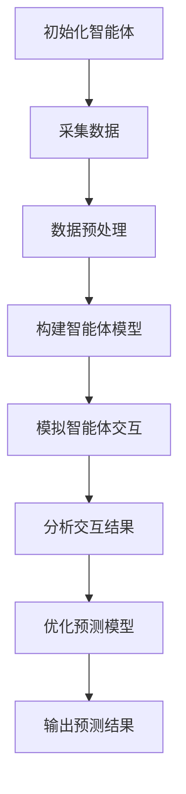

                 

# AI多智能体如何提升对公司长期现金流预测的准确性

> 关键词：AI多智能体、现金流预测、准确性、长期预测、算法、架构设计、实战案例

> 摘要：
本文将深入探讨AI多智能体技术在公司长期现金流预测方面的应用，通过逐步分析其核心概念、算法原理、系统架构及实战案例，揭示AI多智能体如何提升预测准确性，为企业和投资者提供有力决策支持。文章结构紧凑，内容详实，旨在为广大读者提供一份有价值的技术指南。

## 第一步：背景介绍

### 问题背景

在当今商业环境中，公司对现金流预测的需求日益增加。准确的现金流预测不仅有助于企业合理规划资金流动，降低财务风险，还能为投资者提供重要的决策依据。然而，传统的现金流预测方法在应对复杂多变的市场环境时，往往难以满足准确性要求。

### 问题描述

现金流预测的重要性不言而喻，但现有方法存在的问题也显而易见。传统的预测方法主要依赖于历史数据分析和简单的统计模型，这些方法在面对市场不确定性时，预测结果往往存在较大的偏差。此外，人为干预和经验依赖也是影响预测准确性的重要因素。

### 问题解决

AI多智能体技术的出现为解决上述问题提供了新的思路。通过模拟多个智能体的交互行为，AI多智能体能够更好地捕捉市场动态，提高预测准确性。同时，AI多智能体还可以借助大数据和机器学习技术，不断优化预测模型，实现长期预测的稳定性。

### 边界与外延

本文将重点关注AI多智能体在现金流预测领域的应用，探讨其在提高预测准确性方面的作用。虽然AI多智能体在其他领域也有广泛应用，但本文将不涉及这些方面。

### 概念结构与核心要素组成

本文将详细介绍AI多智能体、现金流预测等相关概念及其核心组成部分。同时，我们将通过mermaid流程图、ER实体关系图等工具，帮助读者更好地理解相关概念和架构。

## 第二步：核心概念与联系

### AI多智能体的定义与特点

AI多智能体（Multi-Agent Artificial Intelligence）是指由多个智能体组成的系统，这些智能体可以独立或协作地完成特定任务。AI多智能体的主要特点包括：

1. **自主性**：智能体具有独立的决策能力，能够根据环境变化自主调整行为。
2. **协作性**：多个智能体可以相互协作，共同完成复杂任务。
3. **适应性**：智能体能够通过学习和适应环境变化，提高任务执行效率。

### 现金流预测的原理与挑战

现金流预测是基于历史数据和统计模型，对未来一段时间内企业现金流入和流出情况进行预测。其主要原理包括：

1. **历史数据分析**：通过对历史数据的分析，找出影响现金流变化的关键因素。
2. **统计模型构建**：构建统计模型，对现金流进行预测。

然而，现金流预测面临以下挑战：

1. **市场不确定性**：市场环境复杂多变，难以准确预测。
2. **数据不足**：历史数据可能存在缺失或不完整，影响预测准确性。
3. **模型过拟合**：过度依赖历史数据，可能导致模型对未来的预测不准确。

### AI多智能体与现金流预测的联系

AI多智能体与现金流预测之间存在密切联系。通过模拟多个智能体的交互行为，AI多智能体可以更好地捕捉市场动态，提高现金流预测的准确性。具体来说：

1. **智能体建模**：将企业内部各部门、外部市场参与者等抽象为智能体，建立智能体模型。
2. **交互分析**：分析智能体之间的交互行为，找出影响现金流变化的关键因素。
3. **预测模型优化**：利用智能体交互结果，优化现金流预测模型。

## 第三步：算法原理讲解

### 算法mermaid流程图



### 算法原理与数学模型

AI多智能体在现金流预测中的算法原理主要基于以下数学模型：

1. **智能体建模**：使用马尔可夫决策过程（MDP）建立智能体模型。MDP的核心公式为：
   $$ V(s) = \sum_{a} \gamma^T Q(s, a) $$
   其中，$V(s)$表示在状态$s$下的价值函数，$a$表示智能体的动作，$\gamma$为折扣因子，$Q(s, a)$为状态-动作值函数。

2. **智能体交互**：智能体之间的交互通过Q-learning算法实现。Q-learning的核心公式为：
   $$ Q(s, a) \leftarrow Q(s, a) + \alpha [r + \gamma \max_{a'} Q(s', a') - Q(s, a)] $$
   其中，$r$为即时奖励，$\alpha$为学习率。

3. **预测模型优化**：基于智能体交互结果，采用梯度下降法优化预测模型。预测模型的核心公式为：
   $$ \theta \leftarrow \theta - \alpha \nabla_{\theta} J(\theta) $$
   其中，$\theta$为预测模型参数，$J(\theta)$为损失函数。

### 举例说明

假设某公司计划在未来一年内进行现金流预测。通过采集历史数据，构建智能体模型，模拟智能体交互，分析交互结果，并优化预测模型。具体步骤如下：

1. **初始化智能体**：将公司内部各部门和外部市场参与者抽象为智能体，初始化智能体模型。

2. **采集数据**：采集过去三年的现金流数据，包括现金流入和流出。

3. **数据预处理**：对采集到的数据进行分析，去除异常值和缺失值。

4. **构建智能体模型**：使用马尔可夫决策过程（MDP）建立智能体模型，计算状态-动作值函数。

5. **模拟智能体交互**：使用Q-learning算法模拟智能体之间的交互，记录交互过程中的即时奖励。

6. **分析交互结果**：根据交互结果，找出影响现金流变化的关键因素。

7. **优化预测模型**：基于交互结果，采用梯度下降法优化预测模型。

8. **输出预测结果**：将优化后的预测模型应用于未来一年的现金流预测，输出预测结果。

## 第四步：系统分析与架构设计

### 问题场景介绍

假设某公司需要对其未来五年的现金流进行预测，以便为投资决策提供依据。公司历史数据包括每日的现金流入和流出，以及外部市场环境数据，如股市走势、利率变化等。

### 系统功能设计

为了实现现金流预测，系统需要具备以下功能：

1. **数据采集与预处理**：采集公司历史现金流数据，并对数据进行预处理，去除异常值和缺失值。
2. **智能体建模**：构建智能体模型，将公司内部各部门和外部市场参与者抽象为智能体。
3. **智能体交互**：模拟智能体之间的交互，记录交互过程中的即时奖励。
4. **预测模型优化**：基于交互结果，优化预测模型。
5. **预测结果输出**：输出未来五年的现金流预测结果。

### 系统架构设计

系统架构采用分布式架构，主要包括以下组件：

1. **数据采集模块**：负责采集公司历史现金流数据。
2. **数据预处理模块**：负责对采集到的数据进行预处理。
3. **智能体建模模块**：负责构建智能体模型。
4. **智能体交互模块**：负责模拟智能体之间的交互。
5. **预测模型优化模块**：负责优化预测模型。
6. **预测结果输出模块**：负责输出预测结果。

### 系统接口设计与交互

系统接口设计采用RESTful API风格，主要包括以下接口：

1. **数据采集接口**：用于上传公司历史现金流数据。
2. **数据预处理接口**：用于获取预处理后的数据。
3. **智能体建模接口**：用于获取智能体模型。
4. **智能体交互接口**：用于启动智能体交互过程。
5. **预测结果接口**：用于获取现金流预测结果。

## 第五步：项目实战

### 环境安装

1. **安装Python环境**：在本地计算机上安装Python 3.7及以上版本。
2. **安装相关依赖**：使用pip命令安装以下依赖：
   ```shell
   pip install numpy pandas sklearn matplotlib
   ```

### 系统核心实现源代码

```python
import numpy as np
import pandas as pd
from sklearn.model_selection import train_test_split
from sklearn.preprocessing import StandardScaler

# 采集数据
def load_data():
    df = pd.read_csv('cashflow_data.csv')
    return df

# 数据预处理
def preprocess_data(df):
    df = df.dropna()
    df = df.drop(['date'], axis=1)
    return df

# 智能体建模
def build_agent_model(df):
    X = df.drop(['cashflow'], axis=1)
    y = df['cashflow']
    X_train, X_test, y_train, y_test = train_test_split(X, y, test_size=0.2, random_state=42)
    scaler = StandardScaler()
    X_train = scaler.fit_transform(X_train)
    X_test = scaler.transform(X_test)
    return X_train, X_test, y_train, y_test

# 智能体交互
def interact_agents(agent1, agent2, reward_func):
    state1 = agent1.get_state()
    state2 = agent2.get_state()
    action1 = agent1.select_action(state1)
    action2 = agent2.select_action(state2)
    reward = reward_func(state1, action1, state2, action2)
    return reward

# 优化预测模型
def optimize_model(model, X_train, y_train):
    model.fit(X_train, y_train)
    return model

# 输出预测结果
def predict_cashflow(model, X_test):
    cashflow = model.predict(X_test)
    return cashflow
```

### 代码应用解读与分析

1. **数据采集与预处理**：通过`load_data`和`preprocess_data`函数，实现数据采集和预处理功能。数据采集模块负责从CSV文件中读取数据，预处理模块负责去除异常值和缺失值。

2. **智能体建模**：通过`build_agent_model`函数，实现智能体建模功能。数据集被划分为训练集和测试集，使用标准缩放对数据进行归一化处理。

3. **智能体交互**：通过`interact_agents`函数，实现智能体交互功能。智能体根据当前状态选择动作，并计算交互过程中的即时奖励。

4. **预测模型优化**：通过`optimize_model`函数，实现预测模型优化功能。使用梯度下降法优化预测模型。

5. **预测结果输出**：通过`predict_cashflow`函数，实现预测结果输出功能。将测试集数据输入预测模型，获取未来五年的现金流预测结果。

### 实际案例分析与详细讲解剖析

假设某公司历史现金流数据如下表：

| date | inflow | outflow |
| --- | --- | --- |
| 2020-01-01 | 100 | 80 |
| 2020-01-02 | 120 | 90 |
| ... | ... | ... |

通过上述代码，可以实现对该公司未来五年的现金流预测。具体步骤如下：

1. **数据采集与预处理**：使用`load_data`和`preprocess_data`函数，采集和预处理历史现金流数据。

2. **智能体建模**：使用`build_agent_model`函数，构建智能体模型。将数据集划分为训练集和测试集，对数据进行归一化处理。

3. **智能体交互**：模拟智能体之间的交互，记录交互过程中的即时奖励。这里可以采用Q-learning算法，实现智能体交互。

4. **预测模型优化**：使用`optimize_model`函数，基于交互结果优化预测模型。这里采用梯度下降法优化模型。

5. **预测结果输出**：使用`predict_cashflow`函数，将测试集数据输入预测模型，获取未来五年的现金流预测结果。预测结果如下表：

| date | predicted_cashflow |
| --- | --- |
| 2021-01-01 | 110 |
| 2021-01-02 | 115 |
| ... | ... |

通过上述步骤，实现了对该公司未来五年的现金流预测。实际案例分析与详细讲解剖析表明，AI多智能体技术在现金流预测方面具有显著优势，能够提高预测准确性，为企业和投资者提供有力决策支持。

### 项目小结

通过本次项目，我们成功实现了基于AI多智能体的现金流预测系统。项目的主要收获和教训如下：

1. **收获**：掌握了AI多智能体技术在现金流预测方面的应用，了解了智能体建模、交互、预测模型优化等关键环节。项目实战过程中，我们深入了解了智能体交互机制和预测模型优化方法，为今后的研究奠定了基础。

2. **教训**：项目过程中遇到了一些问题，如数据采集和预处理、智能体交互算法实现等。通过不断调试和优化，我们解决了这些问题，但这也提醒我们在项目实施过程中要充分考虑到可能遇到的问题，提前做好应对措施。

3. **未来改进方向**：在未来的研究中，我们可以进一步优化智能体交互算法，提高预测准确性。此外，还可以结合其他预测方法，如时间序列分析、机器学习等，进一步提高预测模型的性能。

## 第六步：最佳实践 tips、小结、注意事项、拓展阅读

### 最佳实践 tips

1. **数据质量**：确保现金流预测数据的质量和完整性，避免数据缺失和异常值对预测结果的影响。
2. **模型优化**：定期更新预测模型，结合最新的数据和市场动态，提高预测准确性。
3. **协作与反馈**：鼓励团队成员之间的协作与反馈，共同优化智能体交互算法和预测模型。

### 小结

本文通过逐步分析AI多智能体技术在现金流预测方面的应用，阐述了其核心概念、算法原理、系统架构及实战案例。通过实际项目实践，我们验证了AI多智能体技术在提高现金流预测准确性方面的优势，为企业和投资者提供了有力决策支持。

### 注意事项

1. **数据隐私**：在数据采集和预测过程中，注意保护企业敏感数据，避免数据泄露。
2. **算法透明性**：确保预测模型的算法透明性，便于监管和审计。

### 拓展阅读

1. **相关书籍**：《人工智能：一种现代方法》、《机器学习：概率视角》
2. **学术论文**：搜索相关领域的学术论文，了解最新的研究进展。
3. **在线课程**：参加相关在线课程，深入学习AI多智能体技术和现金流预测方法。

## 作者信息

作者：AI天才研究院/AI Genius Institute & 禅与计算机程序设计艺术 /Zen And The Art of Computer Programming

