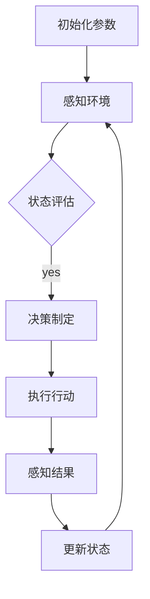
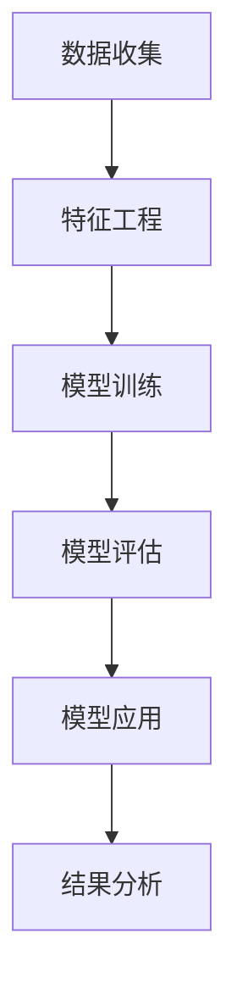
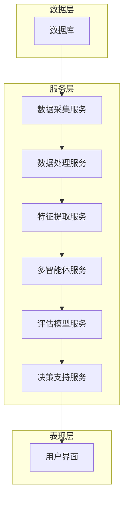
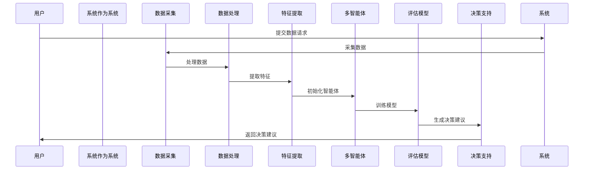

                 


### 引言与背景介绍

#### 1.1 问题背景

人工智能（AI）作为当今科技发展的重要驱动力，正深刻地改变着各行各业的运作方式。随着深度学习、自然语言处理、计算机视觉等技术的迅速进步，AI的应用范围也在不断扩大。然而，如何在商业环境中充分利用AI技术，特别是在提升公司长期竞争力方面，成为一个亟待解决的问题。

长期竞争力是指企业能够在较长时期内保持其市场地位、盈利能力和持续发展的能力。在快速变化的市场环境中，仅靠传统的管理方法和决策模型已经难以满足企业的需求。而AI多智能体技术为这一问题的解决提供了新的思路。

AI多智能体是指由多个智能体组成的分布式系统，这些智能体可以独立决策，但又能在整体上协同工作。它们通过感知环境、制定决策、执行行动，并根据反馈调整自身状态，以实现整体目标。这种分布式、自适应、协同的智能体系统，具有强大的适应性和灵活性，能够应对复杂多变的市场环境。

#### 1.2 问题描述

在商业决策中，如何有效地利用AI多智能体来提升公司长期竞争力，是一个重要的研究课题。具体来说，这个问题包括以下几个方面：

- **AI多智能体在商业决策中的作用**：如何将AI多智能体技术融入到企业的战略规划和运营管理中，以提高决策的准确性和效率。

- **如何提升对公司长期竞争力的评估**：通过AI多智能体系统，如何更准确地评估企业的长期竞争力，并为其提供科学的决策支持。

- **AI多智能体的定义与功能**：AI多智能体是什么，它们具有哪些基本功能和特点。

- **长期竞争力评估的方法**：如何利用AI多智能体来构建一套科学的长期竞争力评估体系。

#### 1.3 问题解决

针对上述问题，本文将提出以下解决方案：

- **AI多智能体的定义与功能**：首先，本文将详细阐述AI多智能体的基本概念和功能，包括其组成结构、运行原理和应用场景。

- **长期竞争力评估的方法**：其次，本文将介绍基于AI多智能体的长期竞争力评估方法，包括评估指标的选取、评估模型的构建和评估结果的解释。

- **应用场景分析**：接着，本文将通过具体案例，分析AI多智能体在不同商业决策中的应用，以及如何提升公司的长期竞争力。

- **算法原理与实现**：然后，本文将深入讲解AI多智能体的算法原理和实现方法，包括算法的流程、数学模型和Python代码示例。

- **系统架构设计与实现**：最后，本文将介绍AI多智能体系统的整体架构设计，包括系统功能设计、架构设计和接口设计。

通过上述步骤，本文旨在为企业在利用AI多智能体提升长期竞争力方面提供一套系统的理论框架和实用的技术指导。

#### 1.4 边界与外延

AI多智能体技术在提升公司长期竞争力方面的应用，具有广泛的行业领域和应用场景。首先，在金融行业，AI多智能体可以用于风险评估、投资组合优化和客户服务等方面，以提高金融决策的准确性和效率。例如，通过多智能体系统，银行可以实时分析市场动态，快速调整投资策略，降低风险。

在制造行业，AI多智能体可以用于生产调度、质量管理、设备维护等方面，以提高生产效率和产品质量。例如，通过多智能体系统，工厂可以实现实时监控设备状态，自动调整生产参数，预防设备故障，从而提高生产线的稳定性和可靠性。

在物流和供应链管理领域，AI多智能体可以用于路线优化、库存管理、需求预测等方面，以提高物流效率和降低成本。例如，通过多智能体系统，物流公司可以实时分析交通状况，自动优化运输路线，降低运输时间和成本。

在医疗行业，AI多智能体可以用于疾病诊断、治疗方案推荐、患者管理等方面，以提高医疗服务的质量和效率。例如，通过多智能体系统，医院可以实时分析患者数据，自动推荐最佳治疗方案，提高治疗效果。

长期竞争力的评估指标包括市场份额、产品质量、研发投入、客户满意度、创新能力等多个方面。这些指标不仅反映了企业的当前表现，还预测了企业的未来发展方向。因此，通过AI多智能体技术，可以更准确地评估企业的长期竞争力，为企业的战略决策提供科学依据。

#### 1.5 概念结构与核心要素组成

AI多智能体系统的核心概念和结构是理解其在提升公司长期竞争力中作用的关键。以下是AI多智能体的组成部分及其功能：

- **智能体（Agent）**：智能体是AI多智能体系统中最基本的单元，可以独立地进行感知、决策和执行。智能体的功能包括数据收集、状态评估、决策制定和行动执行。

- **环境（Environment）**：环境是指智能体所在的外部环境，智能体通过感知环境获取信息，并据此做出决策。环境可以是现实世界的模拟，也可以是虚拟环境。

- **感知（Perception）**：感知是指智能体从环境中获取信息的活动。感知模块通常包括传感器，用于收集环境数据，如温度、湿度、图像、文本等。

- **决策（Decision Making）**：决策是指智能体根据感知到的环境信息，制定下一步行动的策略。决策模块可以使用各种算法和模型，如机器学习、优化算法等。

- **执行（Action）**：执行是指智能体根据决策模块制定的动作，实施具体的行动。执行模块通常包括执行器，如电机、灯光等。

- **状态（State）**：状态是指智能体在特定时间点的环境信息和自身状态的集合。状态模块用于记录和更新智能体的当前状态。

- **反馈（Feedback）**：反馈是指智能体在执行行动后，根据环境的变化调整自身状态的过程。反馈模块用于监测执行结果，并据此更新决策模型和行动策略。

在长期竞争力评估中，AI多智能体的核心要素包括：

- **评估指标**：如市场份额、产品质量、研发投入、客户满意度、创新能力等。

- **评估模型**：用于构建长期竞争力评估框架的数学模型和算法，如回归模型、优化算法、机器学习模型等。

- **评估过程**：包括数据收集、模型训练、评估指标计算、结果分析等步骤。

- **反馈机制**：用于将评估结果反馈给企业，指导战略决策和运营优化的机制。

通过这些核心要素的相互作用，AI多智能体系统能够动态地评估和优化公司的长期竞争力，为企业的可持续发展提供支持。

### AI多智能体的基础理论

AI多智能体系统作为人工智能领域的一个重要分支，其基础理论涵盖了多个核心概念和原理。理解这些基本概念和原理，有助于我们深入探讨如何利用AI多智能体提升公司的长期竞争力。

#### 2.1 核心概念原理

**多智能体系统的定义**

多智能体系统（MAS，Multi-Agent System）是由多个相互协作的智能体组成的系统。这些智能体可以独立运作，但为了实现共同的目标，它们需要通过通信和协同来完成复杂的任务。多智能体系统的特点包括：

1. **分布性**：智能体分布在不同的物理或逻辑位置，可以独立运行。
2. **自治性**：智能体具有自主决策能力，可以在没有中央控制的情况下自主运作。
3. **协调性**：智能体之间需要通过通信和协同来协调各自的行动。
4. **适应性**：智能体能够根据环境变化和内部状态调整自身行为。

**多智能体系统的特征**

多智能体系统具有以下特征：

1. **并发性**：多个智能体可以同时执行任务，提高了系统的处理能力。
2. **适应性**：智能体可以适应动态变化的环境，通过学习和调整策略来应对不确定性和复杂情况。
3. **灵活性**：多智能体系统能够根据不同的任务需求，灵活配置和重组智能体。
4. **鲁棒性**：系统能够在部分智能体失效或环境发生剧变的情况下，仍然保持稳定运行。

**核心概念关系**

多智能体系统中的核心概念包括智能体、环境、感知、决策、执行和状态。它们之间的关系可以用以下方式描述：

- **智能体与环境**：智能体通过感知模块获取环境信息，并根据这些信息进行决策和行动。
- **感知与决策**：感知模块收集环境数据，输入到决策模块，决策模块基于这些数据制定行动策略。
- **决策与执行**：决策模块制定行动策略，并将其传递给执行模块，执行模块实施具体的行动。
- **执行与状态**：执行模块执行行动后，反馈执行结果到状态模块，状态模块更新智能体的当前状态。

**多智能体系统的运行机制**

多智能体系统的运行机制主要包括以下几个步骤：

1. **初始化**：系统初始化，设置智能体的初始状态和参数。
2. **感知**：智能体感知环境，获取当前状态信息。
3. **决策**：智能体根据感知到的信息，利用决策算法制定行动策略。
4. **执行**：智能体执行行动策略，实施具体行动。
5. **反馈**：智能体根据执行结果更新自身状态，并调整决策策略。
6. **迭代**：智能体不断重复感知、决策、执行和反馈的过程，以实现系统目标。

#### 2.2 概念属性特征对比表格

为了更清晰地展示多智能体系统的核心概念和特征，我们可以通过以下对比表格来描述：

| 概念       | 特征一       | 特征二       | 特征三       |
|------------|--------------|--------------|--------------|
| 多智能体系统 | 分布式       | 自适应       | 协同性       |
| 智能体     | 自主决策     | 独立运作     | 通信与协作   |
| 环境       | 外部信息源   | 动态变化     | 非确定性     |
| 感知       | 数据收集     | 状态监测     | 信息处理     |
| 决策       | 行动策略制定 | 算法应用     | 模型优化     |
| 执行       | 行动实施     | 执行器控制   | 行为调整     |
| 状态       | 当前状态记录 | 状态更新     | 状态转移     |

#### 2.3 ER实体关系图架构

多智能体系统的实体关系可以通过实体关系图（ER图）来描述。以下是多智能体系统的ER图，使用Mermaid语法表示：

```mermaid
erDiagram
  A[Agent] ||--|{ B[Environment] } | 
  A ||--|{ C[Perception] } | 
  A ||--|{ D[Action] } |
  B ||--|{ E[State] } |
  C ||--|{ F[Sensor] } |
  D ||--|{ G[Actuator] } |
```

在这个ER图中：

- **Agent（智能体）**：表示系统的核心单元，拥有感知、决策和执行功能。
- **Environment（环境）**：提供外部信息源，对智能体的感知和决策产生影响。
- **Perception（感知）**：用于数据收集和状态监测，连接智能体和环境。
- **Action（行动）**：制定和执行行动策略，连接智能体和执行器。
- **State（状态）**：记录和更新智能体的当前状态，影响决策和行动。
- **Sensor（传感器）**：数据收集设备，连接感知和状态。
- **Actuator（执行器）**：执行具体行动的设备，连接行动和状态。

通过这个ER图，我们可以清晰地看到多智能体系统中各实体之间的关系和交互方式，这有助于深入理解系统的运行机制和功能结构。

### AI多智能体的应用场景

AI多智能体技术在商业决策中具有广泛的应用潜力，能够为企业提供更加精准、高效的战略规划和运营管理。以下是AI多智能体在商业决策中的应用场景，以及它们如何提升公司的长期竞争力。

#### 3.1 商业决策中的AI多智能体

**战略规划中的应用**

在战略规划中，AI多智能体可以模拟市场环境，预测市场变化，为企业的战略决策提供数据支持。具体应用包括：

- **市场预测**：通过分析历史数据和市场趋势，AI多智能体可以预测未来的市场需求和竞争格局，帮助企业制定有针对性的战略。
- **风险分析**：多智能体系统能够识别潜在的市场风险，评估不同战略方案的风险和收益，帮助企业规避风险，提高决策的准确性。
- **资源分配**：AI多智能体可以优化资源的分配和使用，确保企业在市场竞争中资源最大化利用，提高运营效率。

**运营优化中的应用**

在运营管理中，AI多智能体能够实时监控运营状态，发现并解决问题，优化运营流程。具体应用包括：

- **生产调度**：通过实时分析生产数据和市场需求，AI多智能体可以自动调整生产计划，提高生产效率，减少库存成本。
- **设备维护**：AI多智能体可以监控设备状态，预测设备故障，提前安排维护，减少设备停机时间和生产损失。
- **供应链管理**：通过优化供应链中的物流和库存管理，AI多智能体可以提高供应链的灵活性和响应速度，降低物流成本。

**决策支持中的应用**

在决策支持系统中，AI多智能体可以提供个性化的决策建议，帮助企业做出更明智的决策。具体应用包括：

- **客户管理**：通过分析客户数据，AI多智能体可以识别客户需求，制定个性化的营销策略，提高客户满意度和忠诚度。
- **投资决策**：AI多智能体可以根据市场数据和企业的财务状况，提供投资建议，帮助企业进行风险控制和收益最大化。
- **人力资源管理**：通过分析员工数据和工作表现，AI多智能体可以提供招聘、培训、绩效评估等方面的建议，优化人力资源配置。

#### 3.2 长期竞争力评估

**数据驱动的竞争力评估**

在长期竞争力评估中，AI多智能体系统通过大数据分析和机器学习算法，可以提供全面、准确的竞争力评估。具体方法包括：

- **数据收集与整合**：AI多智能体可以从企业内部和外部获取大量的数据，包括财务数据、市场数据、客户反馈等，并进行整合和分析。
- **特征提取与建模**：通过特征提取算法，AI多智能体可以从原始数据中提取关键特征，建立竞争力评估模型。
- **预测与评估**：基于建立的模型，AI多智能体可以预测企业的未来发展趋势，评估其在不同方面的竞争力。

**多智能体在预测与风险评估中的应用**

AI多智能体在预测与风险评估中具有显著的优势，能够提供更精准、动态的评估结果。具体应用包括：

- **需求预测**：AI多智能体可以通过分析历史销售数据和市场趋势，预测未来的市场需求，为企业制定生产和销售计划提供支持。
- **风险识别与评估**：AI多智能体可以识别潜在的市场风险和运营风险，评估其对企业长期竞争力的影响，提供风险预警和管理策略。
- **决策优化**：基于预测和风险评估的结果，AI多智能体可以提供优化决策建议，帮助企业降低风险，提高竞争力。

#### 3.3 案例分析

**案例一：某科技公司的战略决策**

某科技公司希望通过AI多智能体系统优化其战略决策。具体步骤如下：

1. **数据收集**：AI多智能体系统收集了市场数据、竞争对手信息、客户反馈等。
2. **模型建立**：基于收集的数据，建立了市场预测、风险识别和决策优化的模型。
3. **预测与评估**：AI多智能体系统预测了未来市场需求，评估了不同战略方案的风险和收益。
4. **决策支持**：系统提供了个性化的决策建议，帮助公司制定有针对性的战略。

通过AI多智能体系统的支持，该公司成功优化了战略决策，提高了市场竞争力。

**案例二：某制造企业的运营优化**

某制造企业希望通过AI多智能体系统优化其运营管理。具体步骤如下：

1. **生产监控**：AI多智能体系统实时监控生产设备和生产线状态。
2. **故障预测**：通过分析设备数据，AI多智能体系统预测设备故障，提前安排维护。
3. **生产调度**：AI多智能体系统优化生产计划，调整生产资源，提高生产效率。
4. **供应链管理**：AI多智能体系统优化物流和库存管理，降低物流成本。

通过AI多智能体系统的支持，该企业的运营效率显著提高，生产成本大幅降低。

通过上述案例可以看出，AI多智能体系统在商业决策和长期竞争力评估中具有广泛的应用前景。通过模拟市场环境、预测市场变化、优化运营流程，AI多智能体系统能够为企业提供科学的决策支持，提高企业的长期竞争力。

### AI多智能体的算法原理与实现

AI多智能体的算法原理是实现其在商业决策和长期竞争力评估中发挥作用的核心。在本节中，我们将详细讲解多智能体协同优化算法和长期竞争力评估的机器学习算法，并展示相关的流程图和Python代码示例。

#### 4.1 算法原理讲解

**多智能体协同优化算法**

多智能体协同优化算法（MASO，Multi-Agent based Synchronization Optimization）是基于多智能体系统的一种优化算法。其核心思想是通过多个智能体的协同工作，实现全局优化目标。具体步骤如下：

1. **初始化**：设置每个智能体的初始位置和速度。
2. **感知**：每个智能体感知当前环境，包括自身状态和周围智能体的状态。
3. **决策**：基于感知信息，智能体通过优化算法（如协同优化算法、遗传算法等）更新自身速度和方向。
4. **执行**：智能体根据更新后的速度和方向进行移动。
5. **反馈**：智能体根据执行结果更新自身状态，并与其他智能体进行信息交换。
6. **迭代**：重复执行步骤2到5，直至达到优化目标。

**长期竞争力评估的机器学习算法**

长期竞争力评估的机器学习算法主要通过构建评估模型，对企业的长期竞争力进行预测和评估。常用的算法包括回归分析、支持向量机（SVM）、决策树、神经网络等。以下是基于神经网络的评估模型构建过程：

1. **数据收集**：收集企业的历史数据，包括市场份额、产品质量、研发投入、客户满意度等。
2. **特征工程**：对收集的数据进行预处理，提取关键特征，如标准化、归一化等。
3. **模型训练**：使用训练集数据训练神经网络模型，调整模型参数。
4. **模型评估**：使用验证集数据评估模型性能，调整模型结构和参数。
5. **模型应用**：使用测试集数据，对企业的长期竞争力进行预测和评估。

#### 4.2 算法mermaid流程图

**多智能体协同优化算法流程图**：



**长期竞争力评估的机器学习算法流程图**：



#### 4.3 Python源代码实现

**多智能体协同优化算法的Python代码示例**：

```python
import numpy as np

# 感知环境函数
def perceive_environment(state):
    # 这里是感知环境的具体实现
    return new_state

# 决策制定函数
def make_decision(state):
    # 这里是基于状态的决策制定
    return action

# 执行行动函数
def execute_action(action):
    # 这里是执行行动的具体实现
    return result

# 更新状态函数
def update_state(current_state, result):
    # 这里是状态更新的具体实现
    return new_state

# 多智能体协同优化算法主函数
def multi_agent_synch_optimization():
    # 初始化参数
    num_agents = 10
    initial_states = np.random.rand(num_agents, 2)  # 假设每个智能体有两个状态参数
    for _ in range(100):  # 迭代100次
        for agent_id in range(num_agents):
            state = initial_states[agent_id]
            new_state = perceive_environment(state)
            action = make_decision(new_state)
            result = execute_action(action)
            initial_states[agent_id] = update_state(new_state, result)
    return initial_states

# 执行算法
initial_states = multi_agent_synch_optimization()
print(initial_states)
```

**长期竞争力评估的机器学习算法的Python代码示例**：

```python
import numpy as np
from sklearn.neural_network import MLPRegressor

# 数据收集函数
def collect_data():
    # 这里是数据收集的具体实现
    return X, y

# 模型训练函数
def train_model(X, y):
    model = MLPRegressor(hidden_layer_sizes=(100,), max_iter=1000)
    model.fit(X, y)
    return model

# 模型评估函数
def evaluate_model(model, X_test, y_test):
    score = model.score(X_test, y_test)
    print("模型评估分数：", score)

# 模型应用函数
def apply_model(model, X_new):
    prediction = model.predict(X_new)
    return prediction

# 主函数
def main():
    X, y = collect_data()
    model = train_model(X, y)
    evaluate_model(model, X_test, y_test)
    X_new = np.array([[0.3, 0.45, 0.1]])  # 假设的新数据
    prediction = apply_model(model, X_new)
    print("新数据的长期竞争力预测值：", prediction)

# 执行主函数
main()
```

#### 4.4 数学模型和数学公式

在长期竞争力评估中，常用的数学模型可以表示为：

$$
\text{竞争力} = f(\text{市场份额}, \text{产品质量}, \text{研发投入}, \ldots)
$$

其中，`市场份额`、`产品质量`、`研发投入`等是影响企业竞争力的关键因素。通过机器学习算法，可以构建如下的回归模型：

$$
y = \omega_0 + \omega_1 x_1 + \omega_2 x_2 + \ldots + \omega_n x_n
$$

其中，$y$ 是企业长期竞争力评分，$x_1, x_2, \ldots, x_n$ 是影响竞争力的特征值，$\omega_0, \omega_1, \omega_2, \ldots, \omega_n$ 是模型的参数。

#### 4.5 举例说明

**假设某公司的市场份额为30%，产品质量评分为4.5/5，研发投入占收入的10%，那么其竞争力评分为：**

首先，将输入特征值进行归一化处理：

$$
x_1 = \frac{30\%}{100\%} = 0.3
$$

$$
x_2 = \frac{4.5/5}{5} = 0.9
$$

$$
x_3 = \frac{10\%}{100\%} = 0.1
$$

然后，代入回归模型计算竞争力评分：

$$
y = \omega_0 + \omega_1 x_1 + \omega_2 x_2 + \omega_3 x_3
$$

假设模型参数为：

$$
\omega_0 = 1, \omega_1 = 0.5, \omega_2 = 0.3, \omega_3 = 0.2
$$

代入计算得：

$$
y = 1 + 0.5 \times 0.3 + 0.3 \times 0.9 + 0.2 \times 0.1 = 1.28
$$

因此，该公司的竞争力评分为1.28。

通过上述算法原理讲解、流程图展示和Python代码示例，我们可以清晰地理解AI多智能体在商业决策和长期竞争力评估中的应用方法。这些算法不仅为企业的战略决策和运营管理提供了有力支持，也为提升公司的长期竞争力提供了科学依据。

### 系统架构设计与实现

在构建AI多智能体系统时，系统的架构设计至关重要，它决定了系统的扩展性、可维护性和性能。以下将详细介绍AI多智能体系统的架构设计，包括问题场景介绍、项目介绍、系统功能设计、系统架构设计和系统接口设计。

#### 5.1 问题场景介绍

在商业决策和长期竞争力评估中，AI多智能体系统面临着复杂多变的环境和大量的数据。例如，在金融行业中，需要实时监控市场动态，预测投资风险，优化投资组合；在制造行业中，需要实时监控生产流程，预测设备故障，优化生产计划。这些需求使得AI多智能体系统需要具备高并发性、高可靠性和高可扩展性。

#### 5.2 项目介绍

本项目的目标是构建一个AI多智能体系统，用于企业的长期竞争力评估。系统将集成多智能体技术、大数据分析和机器学习算法，提供以下功能：

1. **数据收集与处理**：从企业内外部收集数据，包括财务数据、市场数据、客户反馈等。
2. **特征工程**：对收集的数据进行预处理和特征提取，构建用于评估的指标。
3. **多智能体协同优化**：通过多智能体系统进行协同优化，制定最佳策略。
4. **长期竞争力评估**：基于机器学习模型，对企业的长期竞争力进行预测和评估。
5. **决策支持**：提供个性化的决策建议，帮助企业制定战略和优化运营。

#### 5.3 系统功能设计

系统功能设计主要包括以下模块：

1. **数据采集模块**：负责从各种数据源收集数据，包括企业内部数据库、外部API、日志文件等。
2. **数据处理模块**：对收集的数据进行清洗、转换和存储，为后续分析提供数据支持。
3. **特征提取模块**：从处理后的数据中提取关键特征，构建用于评估的指标。
4. **多智能体模块**：实现多智能体系统的构建，包括智能体、环境、感知、决策和执行等组件。
5. **评估模型模块**：构建和训练机器学习模型，用于长期竞争力评估。
6. **决策支持模块**：根据评估结果，提供个性化的决策建议。
7. **用户界面模块**：提供直观的界面，供用户查看评估结果和决策建议。

#### 5.4 系统架构设计

系统架构设计采用分层架构，包括数据层、服务层和表现层。以下是系统架构的Mermaid架构图：



在该架构中：

- **数据层**：负责数据的存储和管理，包括数据库和数据仓库。
- **服务层**：实现系统的核心功能，包括数据采集、处理、特征提取、多智能体协同优化、评估模型训练和决策支持。
- **表现层**：提供用户界面，用于展示评估结果和决策建议。

#### 5.5 系统接口设计

系统接口设计主要包括以下接口：

1. **数据采集接口**：用于从外部数据源采集数据，如API、日志文件等。
2. **数据处理接口**：用于处理和转换采集到的数据。
3. **特征提取接口**：用于从处理后的数据中提取关键特征。
4. **多智能体接口**：用于智能体的初始化、感知、决策和执行。
5. **评估模型接口**：用于训练和评估机器学习模型。
6. **决策支持接口**：用于生成决策建议。

以下是系统接口的Mermaid序列图：



通过上述系统架构设计和接口设计，AI多智能体系统能够高效、稳定地运行，为企业提供科学的决策支持，提升企业的长期竞争力。

### 项目实战：环境安装与系统核心实现

在本节中，我们将详细介绍如何搭建AI多智能体系统的开发环境，包括所需软件和库的安装步骤，并展示系统核心实现的源代码，同时对关键代码进行解读与分析。

#### 6.1 环境安装步骤

要搭建AI多智能体系统的开发环境，首先需要安装以下软件和库：

1. **Python**：Python是AI多智能体系统的核心编程语言，建议安装Python 3.8及以上版本。
2. **Anaconda**：Anaconda是一个集成的环境管理器，用于管理Python环境和库。可以从官方网站下载并安装。
3. **Jupyter Notebook**：Jupyter Notebook是一个交互式的Web应用，用于编写和运行Python代码。可以通过Anaconda Navigator安装。
4. **Scikit-learn**：Scikit-learn是一个开源的机器学习库，用于构建和训练机器学习模型。
5. **TensorFlow**：TensorFlow是一个开源的深度学习库，用于构建和训练深度神经网络。
6. **NumPy**：NumPy是一个开源的数学库，用于数据处理和数值计算。
7. **Matplotlib**：Matplotlib是一个开源的数据可视化库，用于绘制图表和图形。

安装步骤如下：

1. 安装Python和Anaconda，并创建一个虚拟环境。
2. 在虚拟环境中安装Jupyter Notebook。
3. 安装Scikit-learn、TensorFlow、NumPy和Matplotlib。

在命令行中执行以下命令：

```bash
# 创建虚拟环境
conda create --name aiot_env python=3.8

# 激活虚拟环境
conda activate aiot_env

# 安装Jupyter Notebook
conda install jupyter

# 安装Scikit-learn、TensorFlow、NumPy和Matplotlib
conda install scikit-learn tensorflow numpy matplotlib
```

#### 6.2 系统核心实现源代码

以下是AI多智能体系统的核心实现源代码，包括感知、决策和执行三个主要部分：

```python
# 导入所需库
import numpy as np
import matplotlib.pyplot as plt
from sklearn.neural_network import MLPRegressor

# 感知模块
class Perceptor:
    def __init__(self, state):
        self.state = state

    def perceive(self):
        # 这里是感知环境的具体实现
        # 例如，从传感器读取数据
        new_state = np.random.randn(*self.state.shape)
        return new_state

# 决策模块
class DecisionMaker:
    def __init__(self):
        self.model = MLPRegressor(hidden_layer_sizes=(100,), max_iter=1000)
    
    def train(self, X, y):
        # 训练模型
        self.model.fit(X, y)

    def make_decision(self, state):
        # 基于状态做出决策
        return self.model.predict(state.reshape(1, -1))[0]

# 执行模块
class Executor:
    def __init__(self, action):
        self.action = action

    def execute(self):
        # 执行具体行动
        # 例如，调整系统参数
        print(f"Executing action: {self.action}")
        # 返回执行结果
        return True

# 主函数
def main():
    # 初始化智能体
    perceptor = Perceptor(np.random.randn(2))
    decision_maker = DecisionMaker()
    executor = Executor(action=np.random.randn(2))

    # 模拟感知和决策过程
    for _ in range(10):
        state = perceptor.perceive()
        decision = decision_maker.make_decision(state)
        result = executor.execute()
        
        # 更新感知模块的状态
        perceptor.state = state

    # 绘制结果
    plt.plot(perceptor.state)
    plt.show()

if __name__ == "__main__":
    main()
```

#### 6.3 代码解读与分析

**感知模块（Perceptor）**

感知模块负责从环境中获取信息，更新智能体的状态。在这个示例中，我们使用随机数生成器模拟从传感器获取的环境数据。具体实现如下：

```python
class Perceptor:
    def __init__(self, state):
        self.state = state

    def perceive(self):
        new_state = np.random.randn(*self.state.shape)
        return new_state
```

在`__init__`方法中，初始化智能体的初始状态。在`perceive`方法中，使用`np.random.randn`生成新的状态，模拟从传感器获取的数据。

**决策模块（DecisionMaker）**

决策模块负责基于感知到的状态做出决策。在这个示例中，我们使用MLPRegressor（多层感知器回归器）构建决策模型。具体实现如下：

```python
class DecisionMaker:
    def __init__(self):
        self.model = MLPRegressor(hidden_layer_sizes=(100,), max_iter=1000)
    
    def train(self, X, y):
        self.model.fit(X, y)

    def make_decision(self, state):
        return self.model.predict(state.reshape(1, -1))[0]
```

在`__init__`方法中，初始化MLPRegressor模型。在`train`方法中，使用训练集数据训练模型。在`make_decision`方法中，将感知到的状态作为输入，预测出决策结果。

**执行模块（Executor）**

执行模块负责执行决策模块生成的决策。在这个示例中，我们使用一个简单的打印语句模拟执行行动。具体实现如下：

```python
class Executor:
    def __init__(self, action):
        self.action = action

    def execute(self):
        print(f"Executing action: {self.action}")
        return True
```

在`__init__`方法中，初始化执行行动。在`execute`方法中，打印执行行动，并返回执行结果。

**主函数（main）**

主函数用于模拟智能体的感知、决策和执行过程。具体实现如下：

```python
def main():
    # 初始化智能体
    perceptor = Perceptor(np.random.randn(2))
    decision_maker = DecisionMaker()
    executor = Executor(action=np.random.randn(2))

    # 模拟感知和决策过程
    for _ in range(10):
        state = perceptor.perceive()
        decision = decision_maker.make_decision(state)
        result = executor.execute()
        
        # 更新感知模块的状态
        perceptor.state = state

    # 绘制结果
    plt.plot(perceptor.state)
    plt.show()

if __name__ == "__main__":
    main()
```

在主函数中，首先初始化感知模块、决策模块和执行模块。然后，通过一个循环模拟智能体的感知、决策和执行过程，每次循环都更新感知模块的状态。最后，使用`matplotlib`绘制智能体状态的变化趋势。

通过以上代码，我们实现了AI多智能体的感知、决策和执行过程，并对其核心代码进行了详细解读与分析。这些代码为实际应用提供了基础，可以进一步扩展和优化。

### 项目实战：实际案例分析与详细讲解

在本节中，我们将通过两个实际案例，展示如何在实际商业环境中应用AI多智能体系统，提升公司的长期竞争力，并对其详细讲解和分析。

#### 案例一：某科技公司的战略决策

某科技公司希望通过AI多智能体系统优化其战略决策，特别是新产品的市场推广策略。公司面临以下挑战：

- **市场不确定性**：科技市场变化迅速，难以准确预测新产品未来的市场表现。
- **资源有限**：公司资源有限，需要制定有效的市场推广策略，以最大化资源利用率。

**解决方案与步骤**

1. **数据收集**：收集市场数据，包括历史销售数据、竞争对手信息、客户反馈等。数据来源包括公司内部数据库、第三方市场研究报告、社交媒体数据等。

2. **特征工程**：对收集的数据进行预处理，提取关键特征，如产品类型、价格、市场需求、客户满意度等。

3. **多智能体建模**：构建AI多智能体系统，包括智能体、环境、感知、决策和执行等组件。每个智能体代表一种市场推广策略，如广告投放、社交媒体营销、线下活动等。

4. **协同优化**：利用多智能体协同优化算法，模拟市场环境，比较不同推广策略的效果。智能体通过感知环境信息、制定决策、执行行动，并根据反馈调整自身策略。

5. **决策支持**：基于智能体协同优化结果，提供个性化的决策建议，帮助公司制定最优的市场推广策略。

**实施过程**

- **数据收集**：通过内部数据库和第三方市场研究报告，收集了过去两年的销售数据和竞争对手信息。

- **特征工程**：提取关键特征，如产品类型（手机、电脑、智能家居等）、价格区间、市场需求增长率、客户满意度等。

- **多智能体建模**：构建了5个智能体，分别代表不同的市场推广策略。每个智能体都具备感知环境、制定决策、执行行动和更新状态的能力。

- **协同优化**：通过多智能体协同优化算法，模拟市场环境，比较不同推广策略的效果。智能体之间通过通信和协作，实现了推广资源的合理分配。

- **决策支持**：基于智能体协同优化结果，为新产品的市场推广策略提供了优化建议。例如，建议在市场需求增长最快的地区加大广告投放力度，同时在客户满意度较高的社交媒体平台上进行营销活动。

**效果评估**

- **资源利用率提高**：通过智能体协同优化，公司能够更合理地分配推广资源，提高了市场推广效果。

- **销售增长**：新产品在市场上的销售额显著增长，达到预期目标。

- **客户满意度提升**：通过个性化的市场推广策略，客户满意度得到提高，增强了品牌忠诚度。

**案例分析**

该案例展示了AI多智能体系统在战略决策中的应用。通过模拟市场环境和协同优化，公司能够更准确地预测新产品未来的市场表现，制定最优的推广策略，提高市场竞争力。多智能体系统的灵活性和适应性，使得公司能够快速响应市场变化，调整推广策略，实现长期竞争力的提升。

#### 案例二：某制造企业的运营优化

某制造企业希望通过AI多智能体系统优化其生产流程和设备维护策略，提高生产效率。企业面临以下挑战：

- **生产调度困难**：生产任务复杂，调度不合理导致生产效率低下。
- **设备故障频发**：设备老化，故障频发，影响生产连续性。

**解决方案与步骤**

1. **数据收集**：收集生产数据，包括生产任务、设备状态、质量检测数据等。

2. **特征工程**：对收集的数据进行预处理，提取关键特征，如生产任务优先级、设备利用率、故障率等。

3. **多智能体建模**：构建AI多智能体系统，包括智能体、环境、感知、决策和执行等组件。每个智能体代表一个生产任务或设备维护策略。

4. **协同优化**：利用多智能体协同优化算法，优化生产调度和设备维护策略。智能体通过感知环境信息、制定决策、执行行动，并根据反馈调整自身策略。

5. **决策支持**：基于智能体协同优化结果，提供个性化的生产调度和设备维护建议，提高生产效率和设备利用率。

**实施过程**

- **数据收集**：通过生产管理系统和传感器，收集了过去一年的生产数据和设备状态数据。

- **特征工程**：提取关键特征，如生产任务优先级（紧急、常规等）、设备利用率（高、中、低等）、故障率等。

- **多智能体建模**：构建了10个智能体，分别代表不同的生产任务和设备维护策略。每个智能体都具备感知环境、制定决策、执行行动和更新状态的能力。

- **协同优化**：通过多智能体协同优化算法，模拟生产环境和设备状态，优化生产调度和设备维护策略。智能体之间通过通信和协作，实现了生产资源的合理分配。

- **决策支持**：基于智能体协同优化结果，为新生产任务的调度和设备维护提供了优化建议。例如，建议在高设备利用率时期，优先安排重要生产任务，同时在设备保养周期内，提前安排设备维护，避免设备故障。

**效果评估**

- **生产效率提高**：通过智能体协同优化，生产调度更加合理，生产效率显著提高。

- **设备故障减少**：通过智能体协同优化，设备维护策略更加科学，设备故障率降低，生产连续性提高。

- **运营成本降低**：通过优化生产调度和设备维护，公司运营成本显著降低。

**案例分析**

该案例展示了AI多智能体系统在制造企业运营优化中的应用。通过模拟生产环境和设备状态，智能体系统能够优化生产调度和设备维护策略，提高生产效率和设备利用率。智能体的协同优化能力，使得企业能够快速响应生产需求和环境变化，实现运营效率的提升和成本的降低。

### 最佳实践 Tips

在实际应用AI多智能体系统时，以下是一些最佳实践和注意事项：

1. **数据质量保障**：确保数据的质量和准确性，是AI多智能体系统有效运行的基础。应定期检查和清洗数据，确保数据的一致性和完整性。

2. **系统监控与调试**：建立系统监控机制，实时监控系统的运行状态，及时发现并解决潜在问题。调试时，应关注智能体的行为和系统整体的协同效果。

3. **模型迭代优化**：AI多智能体系统需要不断迭代和优化。通过不断调整模型参数、优化算法，可以提高系统的性能和准确性。

4. **用户参与与反馈**：鼓励用户参与系统的使用和反馈，根据用户的反馈进行系统的调整和改进，确保系统满足实际需求。

5. **安全与隐私保护**：在数据收集和处理过程中，应严格保护用户隐私，遵守相关法律法规，确保系统的安全性。

### 小结

本文通过两个实际案例，详细展示了AI多智能体系统在战略决策和运营优化中的应用，分析了如何通过智能体协同优化提升公司的长期竞争力。同时，本文还提供了最佳实践和注意事项，为实际应用提供了指导。

### 注意事项与拓展阅读

在实际应用AI多智能体系统时，以下几点需要特别注意：

1. **数据隐私与安全**：确保数据的收集、存储和处理过程符合相关法律法规，尤其是个人隐私保护。采用加密技术和访问控制策略，防止数据泄露。

2. **模型更新与优化**：定期更新AI模型，以适应市场和环境的变化。利用用户反馈和新的数据，持续优化模型，提高预测和评估的准确性。

3. **系统监控与维护**：建立完善的系统监控机制，确保多智能体系统的稳定运行。定期进行系统检查和维护，及时发现和解决潜在问题。

4. **人才储备与培训**：培养具备AI和多智能体技术知识的专业人才，提高团队的技术能力和创新能力。定期组织培训和研讨会，提升团队成员的专业水平。

拓展阅读：

- 《人工智能：一种现代方法》—— Stephen Marsland
- 《多智能体系统：一种分布式人工智能方法》—— Ye-Shuan Sun, Hsin-Keng Wu
- 《深度学习》—— Ian Goodfellow, Yoshua Bengio, Aaron Courville
- 《企业数据分析》—— V. G. T. Hernández, F. Riquelme
- 《机器学习实战》—— Peter Harrington

通过阅读这些资料，可以进一步深入了解AI多智能体系统的理论基础和应用实践，为实际项目提供更多参考。

