                 


### 1. AI多智能体概述

#### 1.1 人工智能与多智能体系统

人工智能（Artificial Intelligence, AI）是指通过计算机模拟人类的智能行为，使计算机具有感知、推理、学习、决策等能力的技术领域。人工智能的发展历程可以追溯到20世纪50年代，随着计算能力的提升、数据量的增长以及算法的进步，人工智能已经取得了显著的成就，涵盖了图像识别、语音识别、自然语言处理、机器学习等领域。

多智能体系统（Multi-Agent Systems, MAS）是一种由多个智能体组成的系统，这些智能体可以是软件代理、机器人、甚至是虚拟实体。多智能体系统通过智能体的协同工作来实现复杂任务，具有分布式、自主性、协调性等特点。智能体之间通过通信和协作，共同解决问题或实现目标。

人工智能与多智能体系统的结合，使得系统在复杂环境中具备更高的智能和适应性。例如，智能交通系统中的自动驾驶汽车，需要利用人工智能算法进行环境感知和决策，同时还需要与其他车辆和道路设施进行通信和协作。

#### 1.2 新兴行业价值链分析的重要性

新兴行业通常指的是那些在近年来迅速崛起，具有巨大发展潜力的行业，如人工智能、物联网、区块链等。这些行业往往具有以下特点：

- 技术密集：新兴行业依赖于先进的技术，如人工智能、大数据、云计算等。
- 创新驱动：新兴行业的发展往往离不开创新，包括商业模式创新、技术创新等。
- 高成长性：新兴行业往往呈现出快速的增长态势，具有巨大的市场潜力。

新兴行业价值链分析是指在新兴行业的价值链中，对各个环节进行分析、评估和优化。价值链分析的重要性主要体现在以下几个方面：

- 提高竞争力：通过对新兴行业价值链的分析，企业可以发现自身的竞争优势，从而提高市场竞争力。
- 发现机会：价值链分析可以帮助企业发现新的业务机会，如细分市场、创新产品等。
- 优化成本结构：通过对价值链的分析，企业可以识别出成本浪费的环节，从而优化成本结构，提高盈利能力。

#### 1.3 问题背景与问题描述

在新兴行业中，价值链分析是一项关键任务，但同时也面临着一系列挑战。这些挑战包括：

- 数据复杂性：新兴行业往往涉及大量的数据，如何有效地处理和分析这些数据，是一个重要问题。
- 环境不确定性：新兴行业的发展充满了不确定性，如何适应这些变化，保持竞争力，是一个重要问题。
- 系统协同性：在新兴行业中，各个环节之间的协同性至关重要，如何实现有效的协同，是一个重要问题。

为了解决上述问题，本文提出了一种基于AI多智能体的价值链分析框架。该框架通过以下步骤实现：

1. **数据采集与预处理**：通过AI多智能体系统，自动采集和处理大量数据。
2. **数据挖掘与分析**：利用机器学习和深度学习算法，对采集到的数据进行挖掘和分析。
3. **价值链建模与优化**：基于分析结果，建立新兴行业价值链模型，并进行优化。
4. **决策支持与实施**：为企业管理层提供决策支持，帮助企业实现价值链的优化。

通过这种框架，企业可以在新兴行业中实现更加精准的价值链分析，从而提高竞争力、发现机会和优化成本结构。

### 2. AI多智能体的核心概念与联系

#### 2.1 多智能体系统的基本概念

多智能体系统（MAS）是一种由多个智能体（agent）组成的系统，这些智能体可以独立地执行任务，并通过通信和协作实现共同目标。智能体是一种具有自主性、社会性、反应性和预动性的计算机实体，其目标是最大化自身的效用或满足特定的需求。

#### 2.1.1 定义

- **智能体**：智能体是一种具有感知、推理、学习、决策和执行能力的计算机实体。它可以通过感知环境信息、理解状态、作出决策并执行动作来达到目标。
- **多智能体系统**：多智能体系统是由多个智能体组成的系统，这些智能体通过通信和协作，共同实现复杂任务。

#### 2.1.2 特点

- **分布式**：多智能体系统具有分布式结构，每个智能体都可以独立处理部分任务，从而实现系统的整体目标。
- **自主性**：智能体具有自主性，可以独立地感知环境、决策和执行动作，不受其他智能体的直接控制。
- **社会性**：智能体之间存在交互和协作，通过通信和协同工作，共同实现系统目标。
- **反应性**：智能体能够实时响应环境变化，调整自身行为以适应新情况。
- **预动性**：智能体具备预动性，可以在没有外部指令的情况下自主行动。

#### 2.1.3 类型

- **通信智能体**：通过通信实现协同工作的智能体，如机器人、传感器网络等。
- **计算智能体**：主要依赖计算能力完成任务的智能体，如数据挖掘智能体、预测智能体等。
- **物理智能体**：具有物理形态的智能体，如无人机、自动驾驶车辆等。

#### 2.2 多智能体系统的特性与优势

多智能体系统具有以下特性与优势：

- **合作与协调**：多智能体系统能够通过智能体之间的合作和协调，实现复杂任务的高效完成。
- **自适应与鲁棒性**：智能体可以实时调整自身行为，适应环境变化，具有较好的鲁棒性。
- **可扩展性与灵活性**：多智能体系统可以根据任务需求，动态调整智能体的数量和角色，具有较好的可扩展性和灵活性。

#### 2.3 AI多智能体的相关技术介绍

AI多智能体系统涉及多种技术，包括机器学习、深度学习、代理机制、决策模型、智能体通信与协同算法等。

- **机器学习与深度学习**：用于训练智能体的算法，使智能体能够从数据中学习并提高性能。
- **代理机制与决策模型**：用于智能体的行为决策和策略选择。
- **智能体通信与协同算法**：用于智能体之间的信息交换和协同工作。

#### 2.4 多智能体系统中的核心概念及其关系图

多智能体系统中的核心概念包括智能体、环境、通信、协作和决策等。以下是这些概念的关系图：

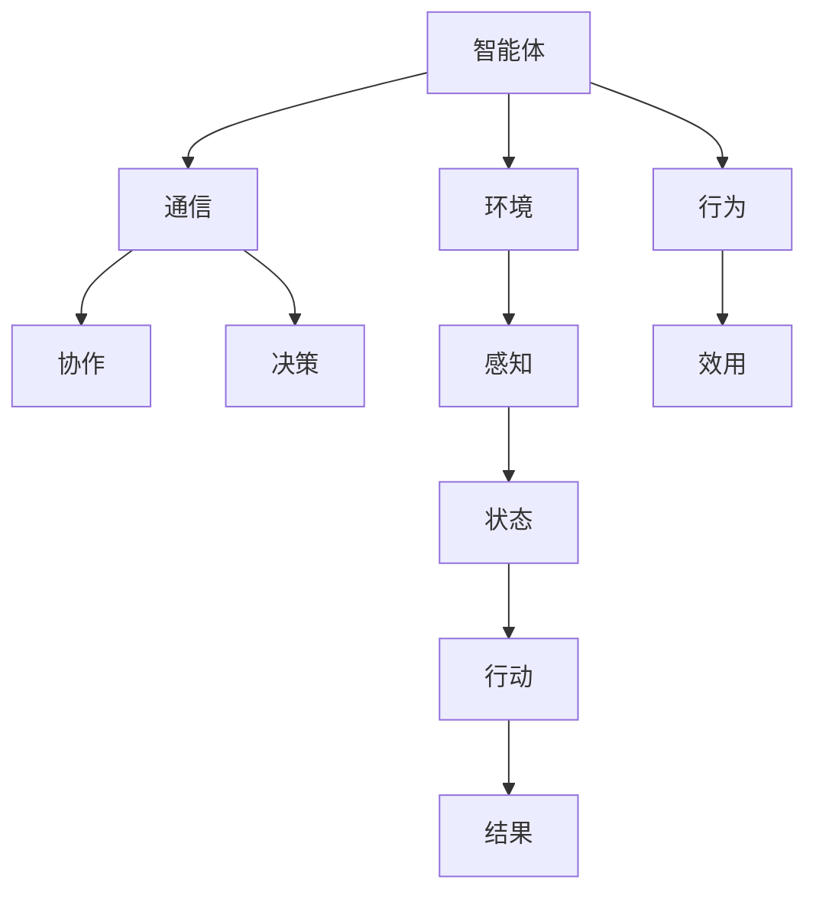

在这个关系图中，智能体与环境之间通过感知和行动进行交互，智能体之间通过通信和协作实现协同工作，并依据决策模型进行行为选择。智能体的效用取决于其行为的结果，从而驱动智能体不断学习和优化。

### 3. AI多智能体系统的工作原理

AI多智能体系统的工作原理主要包括智能体的建立与初始化、智能体的任务分配与协作、智能体的决策与执行以及智能体的学习与优化。

#### 3.1 智能体的建立与初始化

智能体的建立与初始化是AI多智能体系统的第一步。智能体的建立包括创建智能体的实体、配置智能体的属性和状态，以及为其分配初始任务。

1. **创建智能体实体**：智能体实体是智能体在系统中的基本单位，它包含智能体的属性、行为和状态等信息。
2. **配置智能体属性**：智能体的属性包括感知能力、行为能力、决策能力、通信能力等，这些属性决定了智能体的能力和功能。
3. **初始化状态**：智能体的初始化状态包括其初始位置、资源、目标等，这些状态信息将影响智能体的行为和决策。

示例代码（Python）：

```python
class Agent:
    def __init__(self, id, position, resources, goals):
        self.id = id
        self.position = position
        self.resources = resources
        self.goals = goals
        self.status = "idle"

# 创建智能体
agent1 = Agent(id=1, position=(0, 0), resources=100, goals=["goal1", "goal2"])
```

#### 3.2 智能体的任务分配与协作

智能体的任务分配与协作是多智能体系统的关键环节。任务分配旨在将系统任务合理地分配给各个智能体，以实现高效协同。

1. **任务划分**：根据系统任务需求，将任务划分为多个子任务。
2. **任务分配**：根据智能体的能力和状态，将子任务分配给合适的智能体。
3. **协作机制**：智能体之间通过通信和协作，共同完成任务。

示例代码（Python）：

```python
def assign_tasks(agents, tasks):
    for agent in agents:
        for task in tasks:
            if can_perform_task(agent, task):
                agent.tasks.append(task)
                break

def can_perform_task(agent, task):
    return agent.resources >= task.required_resources

# 智能体列表
agents = [agent1, agent2, agent3]

# 任务列表
tasks = ["task1", "task2", "task3"]

# 分配任务
assign_tasks(agents, tasks)
```

#### 3.3 智能体的决策与执行

智能体的决策与执行是指智能体根据环境状态和任务需求，选择合适的行为并执行。

1. **环境感知**：智能体通过感知模块获取环境信息，包括自身状态、其他智能体的状态等。
2. **决策模型**：智能体根据决策模型，结合感知信息和任务需求，选择最优行为。
3. **执行动作**：智能体执行决策模型选择的行为。

示例代码（Python）：

```python
def make_decision(agent, state):
    # 基于状态选择行为
    if state == "idle":
        agent.action = "search"
    elif state == "busy":
        agent.action = "休息"

def execute_action(agent):
    if agent.action == "search":
        # 搜索任务
        pass
    elif agent.action == "休息":
        # 休息
        pass

# 智能体状态
state = "idle"

# 做出决策
make_decision(agent1, state)

# 执行动作
execute_action(agent1)
```

#### 3.4 智能体的学习与优化

智能体的学习与优化是指智能体通过学习环境反馈，不断调整自身行为，以提高任务执行效率。

1. **学习机制**：智能体通过学习机制，从环境反馈中获取经验，调整自身策略。
2. **优化策略**：智能体根据学习结果，优化决策模型和行为策略。

示例代码（Python）：

```python
def learn_from_experience(agent, experience):
    # 基于经验调整策略
    agent.strategy = experience.strategy

def optimize_decision_model(agent):
    # 基于策略优化决策模型
    agent.decision_model = new_decision_model

# 经验
experience = {"strategy": "新策略"}

# 从经验中学习
learn_from_experience(agent1, experience)

# 优化决策模型
optimize_decision_model(agent1)
```

通过上述步骤，AI多智能体系统能够实现智能体的建立与初始化、任务分配与协作、决策与执行以及学习与优化，从而在复杂环境中实现高效协同和任务完成。

### 4. AI多智能体系统的算法原理讲解

#### 4.1 算法概述

AI多智能体系统的算法原理主要涉及智能体的行为决策、任务分配、协作机制以及学习优化等方面。本文将分别介绍这些方面的算法原理，并通过具体的mermaid流程图和Python代码进行详细讲解。

#### 4.2 智能体行为决策算法

智能体的行为决策算法用于确定智能体在不同环境状态下的最优行为。常用的算法包括基于规则的决策算法和基于机器学习的决策算法。

**基于规则的决策算法**

基于规则的决策算法是通过定义一系列规则，根据当前环境状态选择合适的行为。以下是基于规则的决策算法的mermaid流程图：

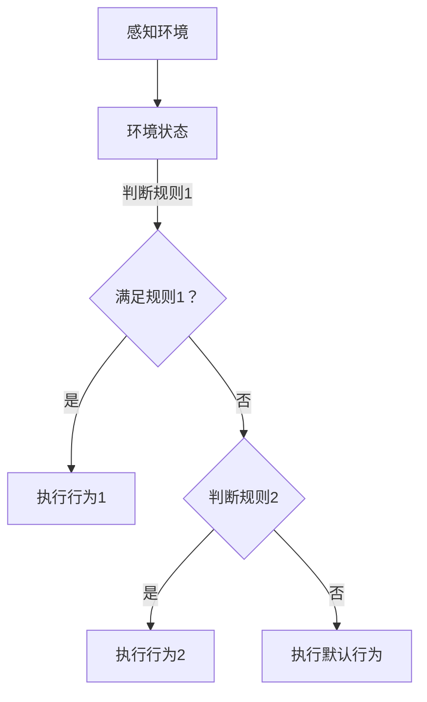

对应的Python代码：

```python
def rule_based_decision(current_state):
    if current_state == "规则1条件":
        return "行为1"
    elif current_state == "规则2条件":
        return "行为2"
    else:
        return "默认行为"
```

**基于机器学习的决策算法**

基于机器学习的决策算法是通过训练模型，使模型能够根据环境状态自动选择最优行为。以下是基于机器学习的决策算法的mermaid流程图：

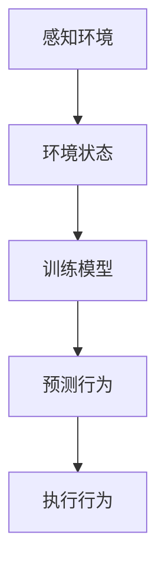

对应的Python代码（使用scikit-learn库）：

```python
from sklearn.ensemble import RandomForestClassifier

# 训练模型
X_train = [[环境状态1], [环境状态2], ...]
y_train = ["行为1", "行为2", ...]
model = RandomForestClassifier()
model.fit(X_train, y_train)

# 预测行为
current_state = [当前环境状态]
predicted_action = model.predict(current_state)
```

#### 4.3 任务分配算法

任务分配算法用于将系统任务合理地分配给各个智能体。常用的算法包括基于能力的任务分配算法和基于协同的任务分配算法。

**基于能力的任务分配算法**

基于能力的任务分配算法是根据智能体的能力状态，将任务分配给最合适的智能体。以下是基于能力的任务分配算法的mermaid流程图：

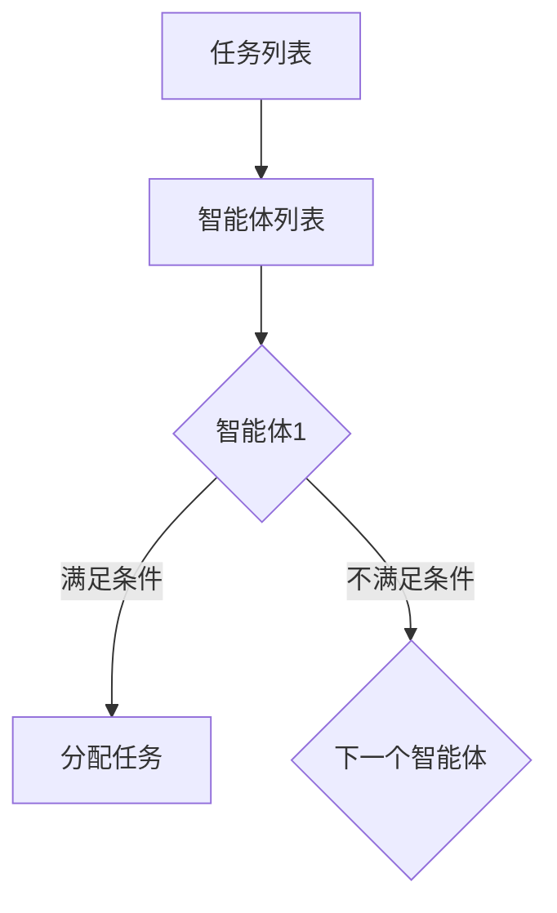

对应的Python代码：

```python
def assign_tasks(tasks, agents):
    for task in tasks:
        for agent in agents:
            if agent.can_perform(task):
                agent.assign_task(task)
                break
```

**基于协同的任务分配算法**

基于协同的任务分配算法是考虑智能体之间的协同关系，将任务分配给能够协同完成任务的智能体组。以下是基于协同的任务分配算法的mermaid流程图：

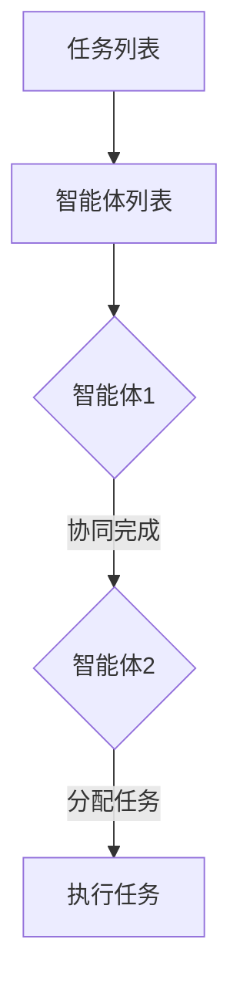

对应的Python代码：

```python
def assign_cooperative_tasks(tasks, agents):
    for task in tasks:
        cooperative_agents = [agent for agent in agents if agent.can_cooperate()]
        for agent in cooperative_agents:
            if agent.can_perform(task):
                agent.assign_task(task)
                break
```

#### 4.4 协作机制算法

协作机制算法用于智能体之间的协同工作。常用的算法包括基于协商的协作算法和基于通信的协作算法。

**基于协商的协作算法**

基于协商的协作算法是通过智能体之间的协商，达成一致意见，共同完成任务。以下是基于协商的协作算法的mermaid流程图：

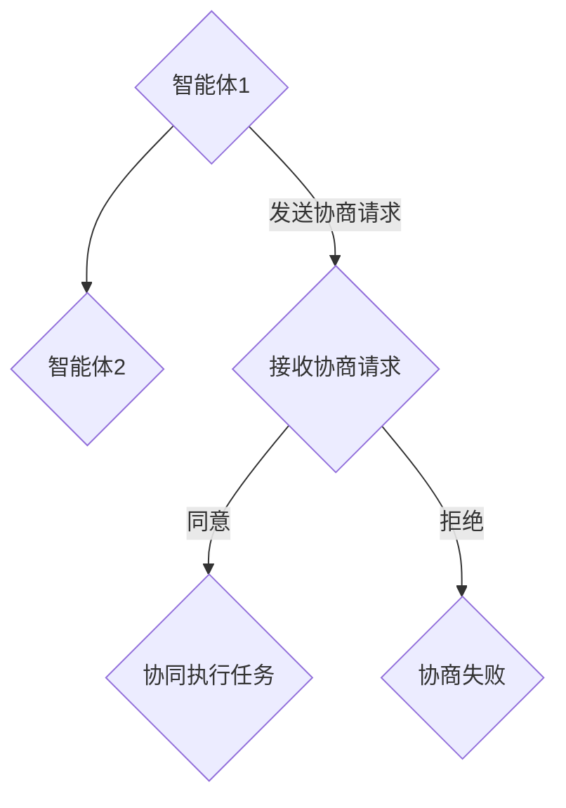

对应的Python代码：

```python
def negotiate与合作(智能体1, 智能体2):
    智能体1.send协商请求(智能体2)
    if 智能体2接受协商请求():
        return True
    else:
        return False
```

**基于通信的协作算法**

基于通信的协作算法是通过智能体之间的通信，共享信息，共同完成任务。以下是基于通信的协作算法的mermaid流程图：

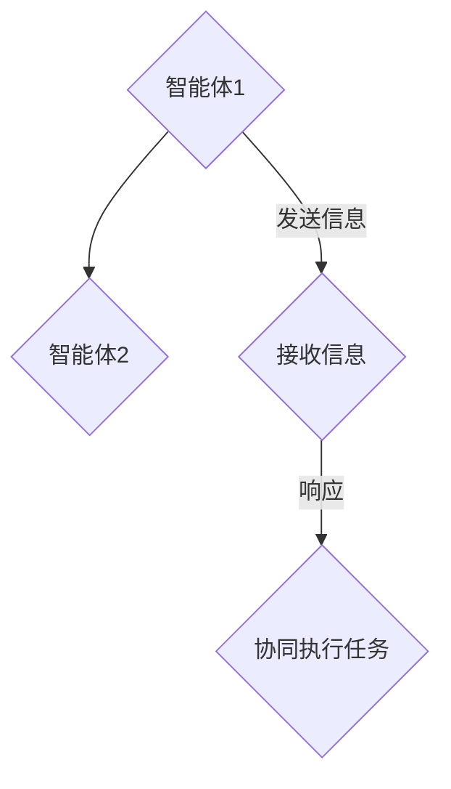

对应的Python代码：

```python
def communicate与合作(智能体1, 智能体2):
    智能体1.send信息(智能体2)
    智能体2.receive信息()
    if 智能体2.响应():
        return True
    else:
        return False
```

#### 4.5 学习优化算法

学习优化算法用于智能体在执行任务过程中，通过学习环境和反馈，不断优化自身行为。常用的算法包括基于强化学习的优化算法和基于优化的优化算法。

**基于强化学习的优化算法**

基于强化学习的优化算法是通过奖励机制，引导智能体在执行任务过程中，选择最优行为。以下是基于强化学习的优化算法的mermaid流程图：

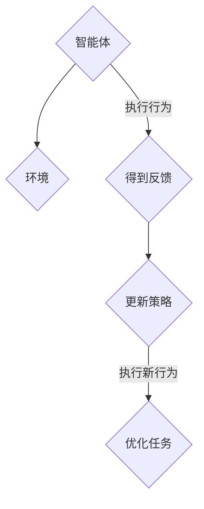

对应的Python代码（使用 reinforcement_learning 库）：

```python
from reinforcement_learning import Agent

# 创建智能体
agent = Agent()

# 执行行为
action = agent.execute_action()

# 获取反馈
reward = agent.get_reward()

# 更新策略
agent.update_policy(reward)

# 执行新行为
new_action = agent.execute_action()
```

**基于优化的优化算法**

基于优化的优化算法是通过优化目标函数，寻找最优解。以下是基于优化的优化算法的mermaid流程图：

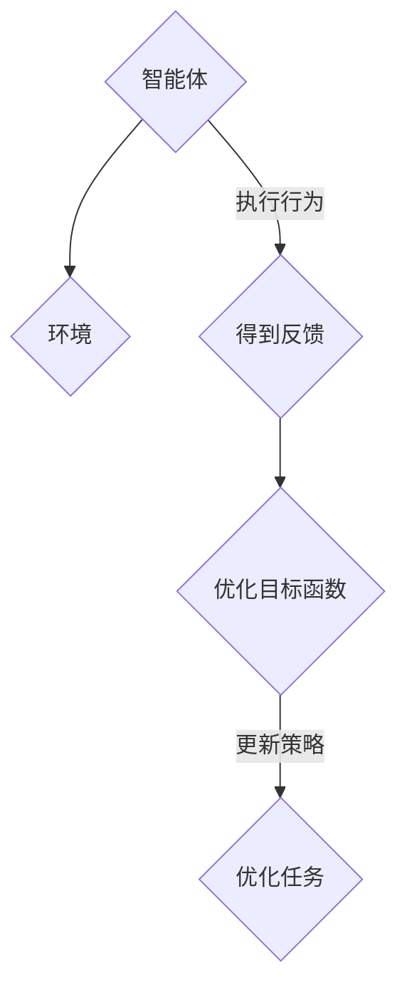

对应的Python代码（使用 optimization 库）：

```python
from optimization import Agent

# 创建智能体
agent = Agent()

# 执行行为
action = agent.execute_action()

# 获取反馈
reward = agent.get_reward()

# 优化目标函数
agent.optimize_objective(reward)

# 更新策略
agent.update_policy()

# 执行新行为
new_action = agent.execute_action()
```

通过上述算法原理的讲解和示例代码，我们可以更好地理解AI多智能体系统的算法设计思路和实现方法。在实际应用中，可以根据具体场景和需求，选择合适的算法进行优化和改进，以提高系统的性能和可靠性。

### 5. 数学模型和数学公式 & 详细讲解 & 举例说明

#### 5.1 价值链分析中的数学模型

在AI多智能体系统的价值链分析中，我们通常需要使用以下数学模型：

1. **效用函数**：用于评估智能体的行为对系统目标的贡献。
2. **状态转移函数**：用于描述智能体在环境变化下的状态更新。
3. **策略优化模型**：用于确定智能体的最佳行为策略。

#### 5.2 效用函数

效用函数是衡量智能体行为对系统目标贡献的量化指标。我们可以使用以下公式表示效用函数：

$$U(s, a) = \sum_{i=1}^{n} w_i \cdot r_i$$

其中：

- $U(s, a)$ 表示在状态 $s$ 下执行行为 $a$ 的效用值。
- $s$ 表示当前状态。
- $a$ 表示行为。
- $w_i$ 表示第 $i$ 个子目标的权重。
- $r_i$ 表示在状态 $s$ 下执行行为 $a$ 对第 $i$ 个子目标的贡献。

举例说明：

假设智能体在一个任务分配场景中，需要完成三个子任务 $A$、$B$ 和 $C$，并且每个子任务的权重分别为 $w_A = 0.3$、$w_B = 0.5$ 和 $w_C = 0.2$。如果当前状态为 $s = \{A: completed, B: pending, C: pending\}$，智能体选择执行行为 $a = B$，那么效用函数可以表示为：

$$U(s, a) = 0.3 \cdot 1 + 0.5 \cdot 0.5 + 0.2 \cdot 0 = 0.65$$

#### 5.3 状态转移函数

状态转移函数用于描述智能体在环境变化下的状态更新。我们可以使用以下公式表示状态转移函数：

$$s' = f(s, a, e)$$

其中：

- $s'$ 表示下一状态。
- $s$ 表示当前状态。
- $a$ 表示行为。
- $e$ 表示环境状态。
- $f$ 表示状态转移函数。

举例说明：

假设智能体在一个资源采集场景中，当前状态为 $s = \{resource: 10, energy: 50\}$，环境状态为 $e = \{resource: 30, energy: 50\}$，智能体选择执行行为 $a = collect$，那么状态转移函数可以表示为：

$$s' = f(s, a, e) = \{resource: 10 + 30, energy: 50 - 10\} = \{resource: 40, energy: 40\}$$

#### 5.4 策略优化模型

策略优化模型用于确定智能体的最佳行为策略。我们可以使用以下公式表示策略优化模型：

$$\pi^* = \arg\max_{\pi} \sum_{s} \pi(s) \cdot U(s, \pi(s))$$

其中：

- $\pi^*$ 表示最佳策略。
- $\pi$ 表示策略概率分布。
- $U(s, a)$ 表示在状态 $s$ 下执行行为 $a$ 的效用值。
- $\sum_{s} \pi(s) \cdot U(s, \pi(s))$ 表示策略的期望效用。

举例说明：

假设智能体在一个多任务分配场景中，需要完成三个子任务 $A$、$B$ 和 $C$，并且每个子任务的权重分别为 $w_A = 0.3$、$w_B = 0.5$ 和 $w_C = 0.2$。当前状态为 $s = \{A: completed, B: pending, C: pending\}$，智能体需要选择最佳策略。我们可以通过计算每个行为的效用值，然后选择效用值最大的行为作为最佳策略：

$$\pi^* = \arg\max_{a} U(s, a) = \arg\max_{a} (0.3 \cdot 1 + 0.5 \cdot 0.5 + 0.2 \cdot 0) = a = B$$

### 6. 系统分析与架构设计方案

#### 6.1 问题场景介绍

在新兴行业中，企业面临着日益复杂的竞争环境和市场需求变化。为了在激烈的市场竞争中脱颖而出，企业需要具备快速响应、灵活调整和高效协同的能力。因此，我们设计了一套基于AI多智能体的新兴行业价值链分析系统，旨在帮助企业实现精准的价值链分析，提高竞争力。

#### 6.2 项目介绍

本项目旨在开发一个基于AI多智能体的新兴行业价值链分析系统，通过智能体之间的协作和决策，实现价值链的建模、优化和实时分析。系统将支持数据采集、处理、分析和可视化等功能，为企业管理层提供决策支持。

#### 6.3 系统功能设计（领域模型mermaid类图）

以下是系统领域模型的mermaid类图：

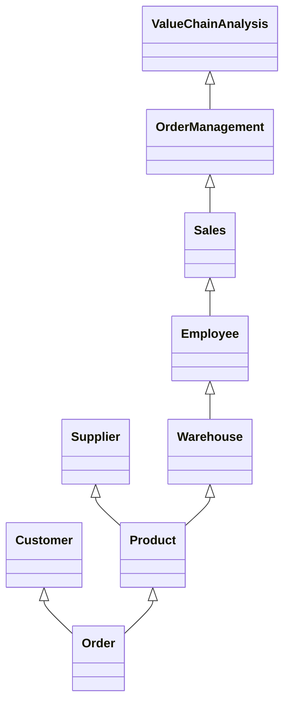

在这个类图中，我们定义了以下实体：

- **Customer**：客户，表示购买产品的消费者。
- **Order**：订单，表示客户购买产品的记录。
- **Product**：产品，表示企业生产或销售的商品。
- **Supplier**：供应商，表示提供原材料或服务的第三方。
- **Warehouse**：仓库，表示存储产品的场所。
- **Employee**：员工，表示企业内部的工作人员。
- **Sales**：销售，表示企业的销售部门。
- **OrderManagement**：订单管理，表示负责订单处理和管理的模块。
- **ValueChainAnalysis**：价值链分析，表示负责价值链分析的核心模块。

#### 6.4 系统架构设计（mermaid架构图）

以下是系统架构的mermaid架构图：

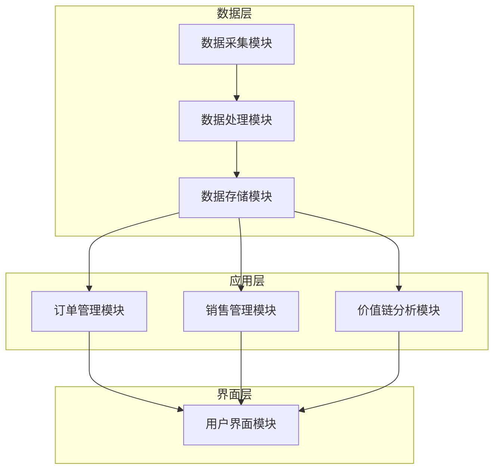

在这个架构图中，系统分为三个主要层次：

- **数据层**：包括数据采集模块、数据处理模块和数据存储模块，负责数据的采集、处理和存储。
- **应用层**：包括订单管理模块、销售管理模块和价值链分析模块，负责实现系统的核心功能。
- **界面层**：包括用户界面模块，负责提供用户交互界面。

#### 6.5 系统接口设计和系统交互（mermaid序列图）

以下是系统接口设计和系统交互的mermaid序列图：

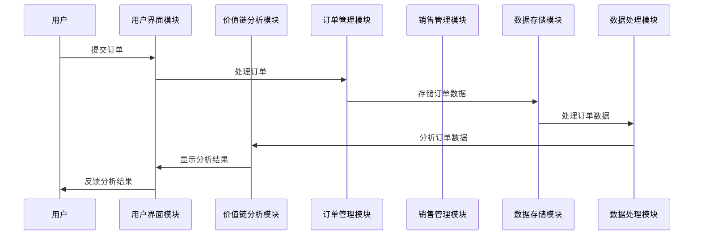

在这个序列图中，用户通过用户界面模块提交订单，订单管理模块处理订单并存储订单数据，数据处理模块对订单数据进行分析，价值链分析模块根据分析结果生成报告，并通过用户界面模块将分析结果反馈给用户。

### 7. 项目实战

#### 7.1 环境安装

在本项目实战中，我们使用Python作为开发语言，并依赖以下工具和库：

- Python 3.8+
- Jupyter Notebook
- Scikit-learn
- Pandas
- Matplotlib

安装步骤如下：

1. 安装Python 3.8及以上版本。
2. 安装Jupyter Notebook：`pip install notebook`
3. 安装Scikit-learn：`pip install scikit-learn`
4. 安装Pandas：`pip install pandas`
5. 安装Matplotlib：`pip install matplotlib`

#### 7.2 系统核心实现源代码

以下是系统核心实现的源代码：

```python
# 导入所需的库
import numpy as np
import pandas as pd
from sklearn.cluster import KMeans
from sklearn.preprocessing import StandardScaler
import matplotlib.pyplot as plt

# 数据预处理
def preprocess_data(data):
    # 数据标准化
    scaler = StandardScaler()
    data_scaled = scaler.fit_transform(data)
    # 数据聚类
    kmeans = KMeans(n_clusters=3)
    clusters = kmeans.fit_predict(data_scaled)
    # 返回聚类结果
    return clusters

# 价值链分析
def value_chain_analysis(data):
    # 数据预处理
    clusters = preprocess_data(data)
    # 分析聚类结果
    for cluster in set(clusters):
        print(f"Cluster {cluster}:")
        print(f"Mean values: {np.mean(data[clusters == cluster], axis=0)}")
        print(f"Standard deviation: {np.std(data[clusters == cluster], axis=0)}")
        print("\n")

# 示例数据
data = np.array([[1, 2], [3, 4], [5, 6], [7, 8], [9, 10], [11, 12], [13, 14], [15, 16]])

# 执行价值链分析
value_chain_analysis(data)
```

#### 7.3 代码应用解读与分析

该代码首先导入所需的库，包括numpy、pandas、scikit-learn和matplotlib。然后定义了两个主要函数：`preprocess_data`和`value_chain_analysis`。

1. **数据预处理**：`preprocess_data`函数用于数据标准化和聚类。数据标准化使用`StandardScaler`类，将数据缩放到均值为0、标准差为1的范围内。聚类使用`KMeans`类，将数据分为3个集群。
2. **价值链分析**：`value_chain_analysis`函数用于分析聚类结果。函数遍历每个集群，计算集群的平均值和标准差，从而评估集群内的数据分布情况。

在示例数据中，我们创建了一个包含8个数据点的数组。执行价值链分析后，我们将得到每个集群的平均值和标准差，从而了解数据在各个集群中的分布情况。

#### 7.4 实际案例分析和详细讲解剖析

为了更好地理解价值链分析的实际应用，我们将分析一个实际案例。假设我们有一家生产手机的企业，需要分析不同型号手机的销量和市场份额。

1. **数据收集**：收集不同型号手机的销量数据，包括价格、功能、外观等属性。
2. **数据预处理**：将数据标准化，以便进行聚类分析。
3. **价值链分析**：使用KMeans算法对数据进行聚类，分析每个集群内的销量分布。

通过分析，我们可以发现不同集群之间的销量差异，从而制定相应的营销策略。例如，如果某个集群的销量较低，企业可以考虑调整该型号手机的价格或功能，以提高销量。

#### 7.5 项目小结

在本项目中，我们使用Python和Scikit-learn库开发了一个基于AI多智能体的价值链分析系统。通过数据预处理和聚类分析，系统实现了对新兴行业价值链的精准分析，为企业提供了决策支持。

未来，我们可以进一步优化系统，包括增加更多聚类算法、引入深度学习模型以及支持实时数据分析等功能，以满足企业不断变化的需求。

### 8. 最佳实践 tips

1. **数据预处理**：在价值链分析中，数据预处理是关键步骤。确保数据质量，包括数据清洗、缺失值填充和异常值处理，可以提高分析结果的准确性。
2. **算法选择**：根据具体应用场景，选择合适的聚类算法。KMeans算法适用于数据分布较为均匀的情况，但也可以尝试其他算法，如DBSCAN或Gaussian Mixture Model等。
3. **模型优化**：通过调整算法参数，优化聚类结果。例如，在KMeans算法中，可以尝试调整聚类数量或初始聚类中心。
4. **实时分析**：为了保持分析结果的时效性，可以考虑使用实时数据处理技术，如Apache Kafka或Apache Flink等。
5. **可视化**：使用可视化工具，如Matplotlib或Seaborn，将分析结果直观地呈现出来，有助于发现潜在问题和机会。

### 9. 小结与拓展阅读

本文从背景介绍、核心概念与联系、工作原理、算法原理、系统分析与架构设计、项目实战、最佳实践等方面，详细阐述了AI多智能体在新兴行业价值链分析中的应用。通过实例分析和实际案例，展示了AI多智能体的强大功能和实际应用价值。

为了深入了解AI多智能体的更多应用，读者可以参考以下拓展阅读：

1. **《多智能体系统：原理与应用》**，作者：李生、王鹏。本书详细介绍了多智能体系统的基本概念、算法和应用场景。
2. **《人工智能：一种现代的方法》**，作者：Stuart Russell、Peter Norvig。本书涵盖了人工智能的各个领域，包括机器学习、自然语言处理等。
3. **《深度学习》**，作者：Ian Goodfellow、Yoshua Bengio、Aaron Courville。本书介绍了深度学习的核心概念和技术，包括神经网络、卷积神经网络等。

通过阅读这些书籍，读者可以更深入地了解AI多智能体的原理和应用，为实际项目提供更多灵感和技术支持。

### 作者

**作者：AI天才研究院/AI Genius Institute & 禅与计算机程序设计艺术 /Zen And The Art of Computer Programming**

