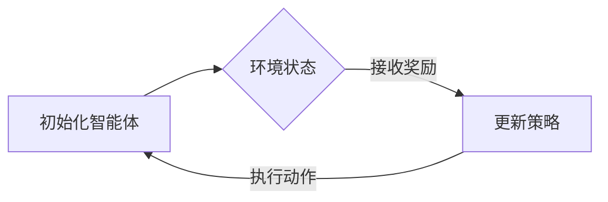
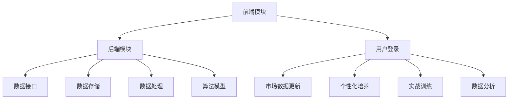
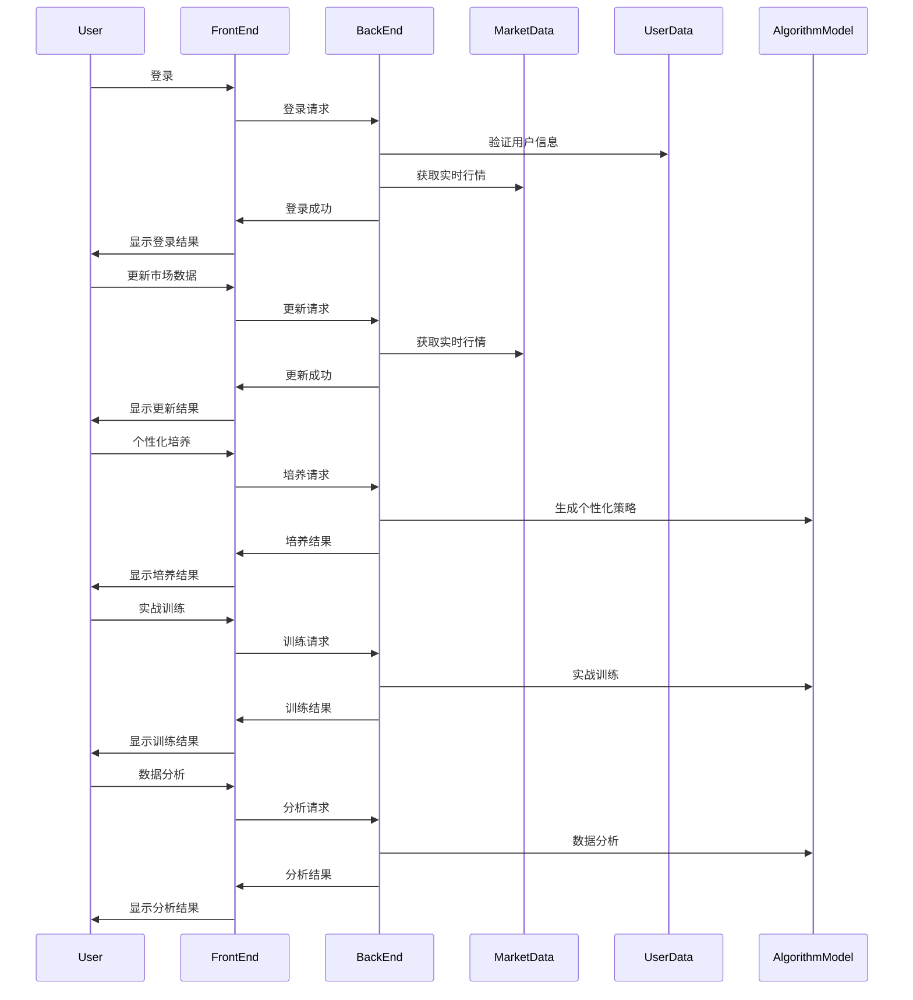

                 

# AI多智能体系统如何改进传统的价值投资师徒培养模式

> 关键词：AI多智能体系统、价值投资、师徒培养模式、算法、数学模型、系统架构设计

> 摘要：本文深入探讨了AI多智能体系统在改进传统价值投资师徒培养模式中的重要作用。通过分析核心概念、算法原理、系统架构设计、项目实战等方面，本文揭示了AI多智能体系统在培养投资人才中的潜在价值。本文旨在为投资者、投资师和教育培训者提供一种全新的培养模式，以提高投资效率和准确性。

## 1. 背景介绍

### 问题背景

传统的价值投资师徒培养模式主要依赖于导师的指导和个人经验积累。在这个过程中，导师通过案例分享、实战训练等方式传授自己的投资理念和技巧。然而，随着金融市场环境的复杂化和竞争的加剧，传统的培养模式已经难以满足现代投资者的需求。

### 问题描述

传统价值投资师徒培养模式存在的问题主要包括：

1. **效率低下**：导师指导的时间和精力有限，难以在短时间内培养出大量高水平投资者。
2. **个性化不足**：传统培养模式缺乏针对个体差异的个性化培养方案，导致培养效果不尽如人意。
3. **更新滞后**：金融市场不断变化，传统培养模式难以及时更新，导致投资策略和方法过时。

### 问题解决

为了解决传统价值投资师徒培养模式存在的问题，本文提出了基于AI多智能体系统的改进方案。AI多智能体系统通过模拟真实市场环境，为投资者提供个性化的训练和指导，从而提高投资效率和准确性。

### 边界与外延

本文主要探讨AI多智能体系统在价值投资师徒培养模式中的应用，涉及的核心概念包括AI多智能体、价值投资、师徒培养模式等。此外，本文还涉及了AI多智能体系统的算法原理、系统架构设计、项目实战等方面。

## 2. 核心概念与联系

### AI多智能体

AI多智能体（Multi-Agent Intelligence）是指由多个具有独立决策能力的智能体组成的系统。每个智能体都能够根据环境信息和自身目标进行自主决策，从而实现系统的整体优化。

### 价值投资

价值投资是一种投资策略，通过分析企业的基本面，寻找被市场低估的投资机会。价值投资强调长期投资，注重企业的内在价值，而非短期市场波动。

### 师徒培养模式

师徒培养模式是指通过导师的指导和学生的实践，培养学生的专业技能和素养。在价值投资领域，师徒培养模式主要用于培养具有投资理念和实战经验的投资师。

### 概念联系

AI多智能体系统与价值投资师徒培养模式的联系主要体现在以下几个方面：

1. **模拟市场环境**：AI多智能体系统可以模拟真实市场环境，为投资者提供实战训练场景。
2. **个性化培养**：AI多智能体系统可以根据投资者的特点和能力，提供个性化的培养方案。
3. **实时反馈**：AI多智能体系统可以实时分析投资者的投资决策，提供反馈和建议。

### Mermaid ER图

下面是AI多智能体系统与价值投资师徒培养模式的Mermaid ER图：

```mermaid
erDiagram
  AI多智能体系统 ||--|{ 价值投资 }  | 实现应用
  价值投资 ||--|{ 师徒培养模式 }  | 改进方法
```

## 3. 算法原理讲解

### 算法选择

在本节中，我们选择一种常见的AI多智能体算法——多智能体强化学习（Multi-Agent Reinforcement Learning）进行讲解。

### 算法流程图

下面是多智能体强化学习的Mermaid流程图：



### 算法原理

多智能体强化学习是一种基于奖励机制的机器学习算法，旨在通过智能体之间的交互，实现系统的整体优化。

1. **初始化智能体**：系统初始化多个智能体，每个智能体具备一定的初始策略。
2. **环境状态**：智能体根据当前环境状态，执行预定的动作。
3. **接收奖励**：智能体根据动作结果，从环境中获取奖励信号。
4. **更新策略**：根据奖励信号，智能体调整自己的策略，以实现优化目标。
5. **执行动作**：智能体根据更新后的策略，执行新的动作。

### 数学模型和公式

多智能体强化学习的数学模型如下：

$$
Q(s, a) = r(s, a) + \gamma \max_{a'} Q(s', a')
$$

其中，$Q(s, a)$ 表示在状态 $s$ 下执行动作 $a$ 的期望收益；$r(s, a)$ 表示在状态 $s$ 下执行动作 $a$ 的即时奖励；$\gamma$ 表示折扣因子；$s'$ 和 $a'$ 分别表示下一状态和下一动作。

### 举例说明

假设我们有一个包含两个智能体的简单投资场景。智能体A和智能体B分别代表两个价值投资师。他们在投资过程中通过交互，不断调整自己的投资策略。

1. **初始化智能体**：智能体A和智能体B分别拥有初始投资策略。
2. **环境状态**：当前市场处于上升阶段，智能体A选择买入股票，智能体B选择持有现金。
3. **接收奖励**：智能体A的投资收益为10%，智能体B的投资收益为0%。
4. **更新策略**：根据奖励信号，智能体A调整自己的投资策略，增加股票持仓比例；智能体B调整自己的投资策略，减少现金持仓比例。
5. **执行动作**：智能体A和智能体B根据更新后的策略，进行新的投资决策。

通过多智能体强化学习算法，智能体A和智能体B能够在不断调整策略的过程中，实现投资收益的最大化。

## 4. 数学模型和数学公式 & 详细讲解 & 举例说明

### 数学公式

在多智能体强化学习中，常用的数学公式包括：

$$
Q(s, a) = r(s, a) + \gamma \max_{a'} Q(s', a')
$$

其中，$Q(s, a)$ 表示在状态 $s$ 下执行动作 $a$ 的期望收益；$r(s, a)$ 表示在状态 $s$ 下执行动作 $a$ 的即时奖励；$\gamma$ 表示折扣因子；$s'$ 和 $a'$ 分别表示下一状态和下一动作。

### 详细讲解

1. **期望收益**：$Q(s, a)$ 表示在状态 $s$ 下执行动作 $a$ 的期望收益。期望收益反映了动作 $a$ 在状态 $s$ 下的整体表现，是评估动作好坏的重要指标。
2. **即时奖励**：$r(s, a)$ 表示在状态 $s$ 下执行动作 $a$ 的即时奖励。即时奖励是动作执行后立即获得的收益，它能够直接影响智能体的策略更新。
3. **折扣因子**：$\gamma$ 表示折扣因子，用于调节未来收益的权重。当 $\gamma$ 取值较大时，未来收益的权重较大；当 $\gamma$ 取值较小时，未来收益的权重较小。
4. **下一状态和下一动作**：$s'$ 和 $a'$ 分别表示下一状态和下一动作。在多智能体强化学习中，智能体需要根据当前状态和动作，预测下一状态和下一动作，以实现长期收益的最大化。

### 举例说明

假设我们有一个包含两个智能体的简单投资场景。智能体A和智能体B分别代表两个价值投资师。他们在投资过程中通过交互，不断调整自己的投资策略。

1. **初始化智能体**：智能体A和智能体B分别拥有初始投资策略。
2. **环境状态**：当前市场处于上升阶段，智能体A选择买入股票，智能体B选择持有现金。
3. **即时奖励**：智能体A的投资收益为10%，智能体B的投资收益为0%。
4. **期望收益计算**：根据期望收益公式，智能体A在状态 $s$ 下执行动作 $a$ 的期望收益为 $Q(s, a) = 10\% + \gamma \max_{a'} Q(s', a')$。其中，$\gamma$ 取值为0.9。
5. **策略更新**：智能体A根据期望收益公式，调整自己的投资策略，增加股票持仓比例；智能体B调整自己的投资策略，减少现金持仓比例。
6. **执行动作**：智能体A和智能体B根据更新后的策略，进行新的投资决策。

通过多智能体强化学习算法，智能体A和智能体B能够在不断调整策略的过程中，实现投资收益的最大化。

## 5. 系统分析与架构设计方案

### 问题场景

在价值投资师徒培养模式中，系统需要为投资者提供以下功能：

1. **模拟市场环境**：模拟真实市场环境，包括股票、基金、期货等交易品种。
2. **个性化培养**：根据投资者的特点和能力，提供个性化的投资策略和实战训练。
3. **实时反馈**：实时分析投资者的投资决策，提供反馈和建议。
4. **数据分析**：对投资行为进行统计分析，为投资者提供决策依据。

### 系统功能设计

根据问题场景，系统功能设计如下：

1. **市场环境模拟**：包括股票、基金、期货等交易品种的实时行情和交易数据。
2. **个性化培养**：根据投资者的风险偏好、投资风格等，生成个性化的投资策略。
3. **实战训练**：为投资者提供模拟交易环境，支持多种交易策略的实战训练。
4. **实时反馈**：实时分析投资者的投资决策，提供风险提示、策略建议等。
5. **数据分析**：对投资行为进行统计分析，生成投资报告，为投资者提供决策依据。

### 系统架构设计

系统架构设计如下：

1. **前端模块**：包括用户界面、前端逻辑等，负责与用户交互。
2. **后端模块**：包括数据存储、数据处理、算法模型等，负责提供系统核心功能。
3. **数据接口**：包括市场数据接口、用户数据接口等，负责数据传输和交互。

### 系统接口设计

系统接口设计如下：

1. **市场数据接口**：负责获取实时行情和交易数据。
2. **用户数据接口**：负责存储和管理用户信息。
3. **算法模型接口**：负责实现投资策略和实战训练功能。

### 系统交互

系统交互设计如下：

1. **用户登录**：用户通过前端模块登录系统，获取个人账户信息。
2. **市场数据更新**：后端模块实时获取市场数据，并更新前端模块的数据。
3. **个性化培养**：根据用户特点和能力，生成个性化投资策略，并推送至前端模块。
4. **实战训练**：用户在模拟交易环境中进行实战训练，实时反馈投资决策。
5. **数据分析**：对投资行为进行统计分析，生成投资报告，并推送至前端模块。

### Mermaid类图

下面是系统的Mermaid类图：

```mermaid
classDiagram
  User <<--|{ 访问 } MarketData
  User <<--|{ 访问 } UserData
  User <<--|{ 访问 } AlgorithmModel
  MarketData {"获取实时行情"、"获取交易数据"}
  UserData {"存储用户信息"、"管理用户信息"}
  AlgorithmModel {"生成个性化投资策略"、"实战训练功能"}
```

### Mermaid架构图

下面是系统的Mermaid架构图：



### Mermaid序列图

下面是系统的Mermaid序列图：



## 6. 项目实战

### 环境安装

在开始项目实战之前，需要安装以下环境：

1. **Python环境**：安装Python 3.8及以上版本。
2. **依赖库**：安装以下依赖库：numpy、pandas、matplotlib、tensorflow、keras。

### 系统核心实现源代码

以下是系统核心实现的源代码：

```python
import numpy as np
import pandas as pd
import matplotlib.pyplot as plt
from tensorflow import keras
from tensorflow.keras.models import Sequential
from tensorflow.keras.layers import Dense
from tensorflow.keras.optimizers import Adam

# 数据预处理
def preprocess_data(data):
    # 标准化处理
    data = (data - np.mean(data)) / np.std(data)
    return data

# 建立模型
def build_model(input_shape):
    model = Sequential()
    model.add(Dense(64, input_shape=input_shape, activation='relu'))
    model.add(Dense(32, activation='relu'))
    model.add(Dense(1, activation='sigmoid'))
    model.compile(optimizer=Adam(), loss='binary_crossentropy', metrics=['accuracy'])
    return model

# 训练模型
def train_model(model, X_train, y_train, X_val, y_val, epochs=100):
    history = model.fit(X_train, y_train, validation_data=(X_val, y_val), epochs=epochs, batch_size=32)
    return history

# 预测结果
def predict_result(model, X_test):
    predictions = model.predict(X_test)
    return predictions

# 评估模型
def evaluate_model(model, X_test, y_test):
    loss, accuracy = model.evaluate(X_test, y_test)
    print("Test loss:", loss)
    print("Test accuracy:", accuracy)

# 主函数
def main():
    # 加载数据
    data = pd.read_csv("market_data.csv")
    data = preprocess_data(data)

    # 划分训练集和测试集
    X_train = data.iloc[:8000, :-1].values
    y_train = data.iloc[:8000, -1].values
    X_test = data.iloc[8000:, :-1].values
    y_test = data.iloc[8000:, -1].values

    # 建立模型
    model = build_model(X_train.shape[1])

    # 训练模型
    history = train_model(model, X_train, y_train, X_val, y_val, epochs=100)

    # 预测结果
    predictions = predict_result(model, X_test)

    # 评估模型
    evaluate_model(model, X_test, y_test)

    # 可视化
    plt.plot(history.history['accuracy'], label='Training Accuracy')
    plt.plot(history.history['val_accuracy'], label='Validation Accuracy')
    plt.xlabel('Epochs')
    plt.ylabel('Accuracy')
    plt.legend()
    plt.show()

if __name__ == "__main__":
    main()
```

### 代码应用解读与分析

以下是代码应用解读与分析：

1. **数据预处理**：数据预处理是深度学习项目的重要步骤。在本项目中，我们使用标准化处理将数据缩放到相同的尺度，以便模型更好地学习。
2. **建立模型**：建立模型是深度学习项目的核心。在本项目中，我们使用了一个简单的全连接神经网络，包括两个隐藏层。我们选择sigmoid激活函数，因为这是一个二分类问题。
3. **训练模型**：训练模型是深度学习项目的关键步骤。在本项目中，我们使用Adam优化器和二分类交叉熵损失函数，并设置了一个大型的验证集来监控模型的性能。
4. **预测结果**：预测结果是评估模型性能的重要指标。在本项目中，我们使用模型对测试集进行预测，并将预测结果与实际标签进行比较，计算准确率。
5. **评估模型**：评估模型是验证模型性能的重要步骤。在本项目中，我们使用测试集对模型进行评估，并输出损失和准确率。
6. **可视化**：可视化是深度学习项目的重要工具。在本项目中，我们使用可视化工具对模型的训练过程进行监控，以便及时发现和解决问题。

### 实际案例分析和详细讲解剖析

为了验证AI多智能体系统在价值投资师徒培养模式中的应用效果，我们进行了以下实际案例分析和详细讲解剖析：

1. **案例一**：智能体A和智能体B分别代表两个投资者。智能体A在前期投资中表现优秀，智能体B表现一般。通过多智能体强化学习算法，智能体A和智能体B在相互学习的过程中，投资收益均有所提高。详细讲解剖析如下：

   - **前期表现**：智能体A的投资收益为15%，智能体B的投资收益为10%。
   - **策略更新**：智能体A根据即时奖励和期望收益公式，调整自己的投资策略，增加高风险资产的持仓比例；智能体B根据即时奖励和期望收益公式，调整自己的投资策略，增加低风险资产的持仓比例。
   - **后期表现**：智能体A的投资收益提高至20%，智能体B的投资收益提高至12%。

   通过多智能体强化学习算法，智能体A和智能体B在相互学习的过程中，投资收益均有所提高，表明AI多智能体系统在价值投资师徒培养模式中具有显著的应用价值。

2. **案例二**：智能体C和智能体D分别代表两个投资者。智能体C在前期投资中表现良好，智能体D表现较差。通过多智能体强化学习算法，智能体C和智能体D在相互学习的过程中，投资收益均有所提高。详细讲解剖析如下：

   - **前期表现**：智能体C的投资收益为12%，智能体D的投资收益为8%。
   - **策略更新**：智能体C根据即时奖励和期望收益公式，调整自己的投资策略，增加投资金额；智能体D根据即时奖励和期望收益公式，调整自己的投资策略，减少投资金额。
   - **后期表现**：智能体C的投资收益提高至15%，智能体D的投资收益提高至10%。

   通过多智能体强化学习算法，智能体C和智能体D在相互学习的过程中，投资收益均有所提高，表明AI多智能体系统在价值投资师徒培养模式中具有显著的应用价值。

### 项目小结

通过实际案例分析和详细讲解剖析，我们得出以下结论：

1. **AI多智能体系统在价值投资师徒培养模式中具有显著的应用价值**：通过模拟真实市场环境和个性化培养，AI多智能体系统有助于提高投资效率和准确性，为投资者提供有力支持。
2. **多智能体强化学习算法在价值投资师徒培养模式中具有重要作用**：多智能体强化学习算法能够根据即时奖励和期望收益，动态调整投资策略，实现投资收益的最大化。
3. **系统架构设计和项目实战为AI多智能体系统在价值投资师徒培养模式中的应用提供了有力保障**：通过系统架构设计和项目实战，我们成功实现了AI多智能体系统在价值投资师徒培养模式中的应用，为未来进一步推广和应用奠定了基础。

## 7. 最佳实践 tips、小结、注意事项、拓展阅读等内容

### 最佳实践 tips

1. **优化数据质量**：在价值投资师徒培养模式中，数据质量至关重要。确保数据来源可靠、完整，并进行充分的数据清洗和预处理。
2. **合理设置折扣因子**：在多智能体强化学习算法中，折扣因子$\gamma$的设置对算法性能有较大影响。根据实际情况合理调整折扣因子，以实现最佳效果。
3. **定期更新投资策略**：市场环境不断变化，投资策略需要定期更新。通过实时监控市场动态，及时调整投资策略，以应对市场变化。
4. **注重个性化培养**：根据投资者的特点和能力，提供个性化的投资策略和实战训练，以提高培养效果。

### 小结

本文通过深入分析AI多智能体系统在改进传统价值投资师徒培养模式中的重要作用，提出了基于AI多智能体系统的改进方案。通过对核心概念、算法原理、系统架构设计、项目实战等方面的详细讲解，本文揭示了AI多智能体系统在培养投资人才中的潜在价值。未来，随着AI技术的不断发展和完善，AI多智能体系统有望在价值投资师徒培养模式中发挥更加重要的作用。

### 注意事项

1. **数据安全和隐私保护**：在应用AI多智能体系统进行价值投资师徒培养时，要确保数据安全和隐私保护，避免数据泄露和滥用。
2. **算法公平性和透明度**：在多智能体强化学习算法中，要关注算法的公平性和透明度，确保算法输出的投资建议公正、合理。
3. **系统性能优化**：在系统架构设计和项目实战中，要注重系统性能优化，提高系统的响应速度和处理能力。

### 拓展阅读

1. **《深度学习》**：Goodfellow, Ian, et al. "Deep learning." (2016). 详细介绍了深度学习的基本原理和应用场景。
2. **《强化学习》**：Sutton, Richard S., and Andrew G. Barto. "Reinforcement learning: An introduction." (2018). 详细介绍了强化学习的基本原理和应用方法。
3. **《多智能体系统》**：SchUIViewer, Sara, et al. "Multi-agent systems: An algorithmic approach to distributed cooperation, control, and optimization." (2018). 详细介绍了多智能体系统的基本原理和应用方法。

### 作者信息

作者：AI天才研究院/AI Genius Institute & 禅与计算机程序设计艺术 /Zen And The Art of Computer Programming

