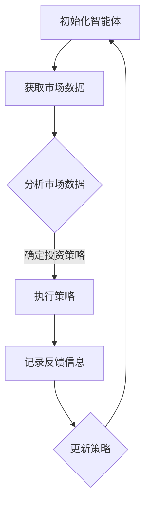
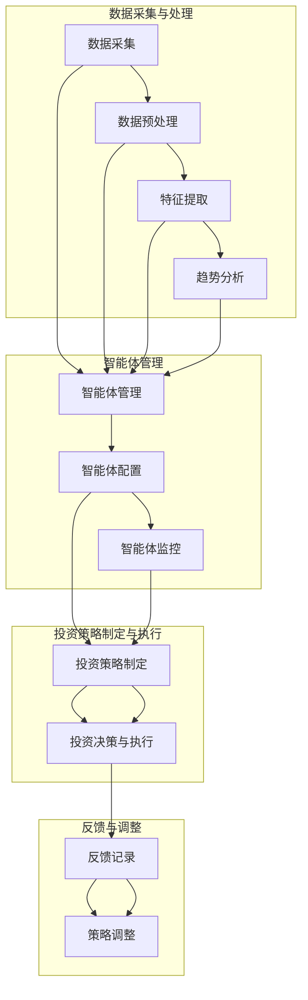
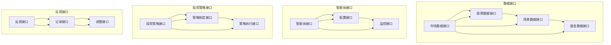
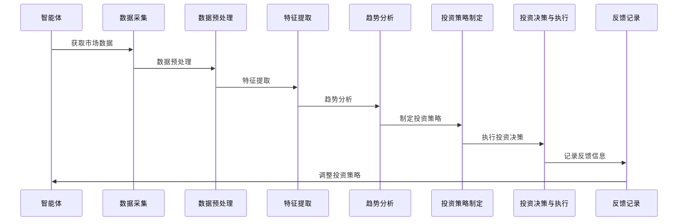

                 

# AI多智能体系统如何改进传统的价值投资组合构建方法

> 关键词：AI多智能体系统、价值投资组合、构建方法、改进策略

> 摘要：本文将探讨如何利用AI多智能体系统来改进传统的价值投资组合构建方法。通过介绍AI多智能体系统的基本概念和特点，分析其在投资组合构建中的应用，结合具体的算法原理和数学模型，阐述如何通过AI多智能体系统实现投资组合的优化和改进。

## 1. 背景介绍

### 1.1 AI多智能体系统

AI多智能体系统（Agent-Based Model，ABM）是一种基于代理的模拟方法，通过模拟多个智能体的交互行为来揭示复杂系统的动态特征。在AI多智能体系统中，每个智能体都是独立的个体，具有自主决策能力，它们通过感知环境、制定策略、执行行动来达到自身目标。智能体可以是人类、机器人、虚拟代理等，它们之间的交互可以是合作、竞争或竞争与合作共存。

AI多智能体系统具有以下特点：

- **分布式计算**：智能体分布在不同的地理位置，通过通信网络进行协同工作，可以处理大规模复杂问题。
- **自适应性和灵活性**：智能体可以根据环境变化调整自身行为，适应不同的场景和需求。
- **动态性和预测性**：智能体可以模拟现实世界中的动态过程，预测未来的发展趋势。
- **仿真和实验**：智能体系统可以用于模拟现实世界中的复杂系统，进行实验和验证。

### 1.2 传统的价值投资组合构建方法

价值投资组合构建方法是一种基于基本面分析的投资策略，主要关注公司的内在价值，通过比较股票的市价与内在价值之间的关系，寻找被市场低估的投资机会。传统的价值投资组合构建方法主要包括以下步骤：

1. **选择价值股票**：通过财务指标、行业地位、成长性等因素，筛选出具有潜在价值的股票。
2. **确定投资比例**：根据投资者的风险偏好和资金规模，确定各只股票的投资比例。
3. **分散投资**：通过将资金分散投资于多个价值股票，降低投资风险。

传统的价值投资组合构建方法具有以下优点：

- **长期稳健收益**：通过投资被市场低估的股票，可以获得较高的投资回报。
- **风险分散**：通过投资多个股票，降低投资组合的整体风险。

然而，传统的价值投资组合构建方法也存在一些缺点：

- **信息不对称**：投资者难以获取全面的市场信息和公司基本面数据。
- **分析成本高**：需要对大量数据进行分析和处理，分析成本较高。
- **反应速度慢**：传统方法主要依赖人工分析，反应速度较慢。

## 2. 核心概念与联系

### 2.1 AI多智能体系统在投资组合构建中的核心概念

在AI多智能体系统中，投资组合构建主要涉及以下核心概念：

- **智能体**：代表投资者，具有独立决策能力和投资行为。
- **市场**：包括股票市场、债券市场、基金市场等，智能体可以通过市场进行投资。
- **策略**：智能体根据市场情况和自身目标，制定的投资策略。
- **行为**：智能体在执行策略过程中的具体行动。
- **反馈**：智能体的行为结果，用于调整后续策略。

### 2.2 概念属性特征对比

| 概念         | 属性特征                                                     |
| ------------ | ------------------------------------------------------------ |
| 智能体       | 独立决策、自主行动、分布式计算、自适应调整                     |
| 市场         | 股票市场、债券市场、基金市场等                               |
| 策略         | 根据市场情况和目标制定投资策略、调整策略                      |
| 行为         | 智能体执行策略的具体行动                                     |
| 反馈         | 行为结果，用于调整后续策略                                   |

### 2.3 ER实体关系图架构设计

以下是一个简单的ER实体关系图，用于描述AI多智能体系统在投资组合构建中的实体关系：

```mermaid
erDiagram
  智能体 ||--|{ 投资策略 }
  智能体 ||--|{ 行为 }
  投资策略 ||--|{ 反馈 }
  行为 ||--|{ 反馈 }
```

## 3. 算法原理讲解

### 3.1 算法流程图



### 3.2 Python源代码

```python
import numpy as np
import pandas as pd
from matplotlib import pyplot as plt

# 初始化智能体
class Agent:
    def __init__(self, strategy, capital):
        self.strategy = strategy
        self.capital = capital
        self.portfolio = {}

    def get_data(self):
        # 获取市场数据
        pass

    def analyze_data(self):
        # 分析市场数据
        pass

    def execute_strategy(self):
        # 执行策略
        pass

    def record_feedback(self):
        # 记录反馈信息
        pass

    def update_strategy(self):
        # 更新策略
        pass

# 初始化智能体
agent = Agent(strategy='long', capital=1000000)

# 获取市场数据
agent.get_data()

# 分析市场数据
agent.analyze_data()

# 执行策略
agent.execute_strategy()

# 记录反馈信息
agent.record_feedback()

# 更新策略
agent.update_strategy()
```

### 3.3 算法原理详细讲解

#### 3.3.1 数学模型

在AI多智能体系统中，投资策略可以通过以下数学模型进行描述：

$$
f(x) = w_1x_1 + w_2x_2 + ... + w_nx_n
$$

其中，$f(x)$ 表示投资策略得分，$w_1, w_2, ..., w_n$ 表示权重，$x_1, x_2, ..., x_n$ 表示市场数据特征。

#### 3.3.2 算法原理举例说明

假设有如下市场数据特征：

| 特征名称 | 特征值 |
| -------- | ------ |
| 市盈率   | 15     |
| 市净率   | 2      |
| 成长性   | 0.3    |
| 行业地位 | 1      |

根据上述数学模型，可以计算投资策略得分：

$$
f(x) = w_1 \times 15 + w_2 \times 2 + w_3 \times 0.3 + w_4 \times 1 = 15w_1 + 2w_2 + 0.3w_3 + w_4
$$

通过调整权重，可以调整投资策略的偏向。例如，如果希望更加关注市盈率，可以增加市盈率的权重，从而提高投资策略得分。

## 4. 数学模型和数学公式 & 详细讲解 & 举例说明

### 4.1 数学模型

在AI多智能体系统中，投资组合的优化可以通过以下数学模型进行描述：

$$
\begin{cases}
\text{maximize} \quad & \sum_{i=1}^{n} p_i q_i \\
\text{subject to} \quad & w_i \leq c_i \\
\end{cases}
$$

其中，$p_i$ 表示第 $i$ 只股票的潜力值，$q_i$ 表示第 $i$ 只股票的投资量，$w_i$ 表示第 $i$ 只股票的权重，$c_i$ 表示第 $i$ 只股票的资金限制。

### 4.2 详细讲解

#### 4.2.1 潜力值计算

潜力值 $p_i$ 是衡量股票投资价值的重要指标，可以通过以下公式计算：

$$
p_i = \frac{f(x_i)}{g(x_i)}
$$

其中，$f(x_i)$ 表示第 $i$ 只股票的投资策略得分，$g(x_i)$ 表示第 $i$ 只股票的投资风险值。

#### 4.2.2 权重计算

权重 $w_i$ 是根据潜力值和投资量进行分配的，可以通过以下公式计算：

$$
w_i = \frac{p_i q_i}{\sum_{i=1}^{n} p_i q_i}
$$

#### 4.2.3 资金限制

资金限制 $c_i$ 是根据投资者的资金状况进行设定的，可以通过以下公式计算：

$$
c_i = \text{投资者资金} \times \text{投资比例}
$$

### 4.3 举例说明

假设投资者有100万元资金，投资比例为10%，需要从以下5只股票中选择：

| 股票名称 | 潜力值 | 风险值 | 投资金额 |
| -------- | ------ | ------ | -------- |
| 股票A    | 0.8    | 0.2    | 80000    |
| 股票B    | 0.6    | 0.3    | 60000    |
| 股票C    | 0.5    | 0.4    | 50000    |
| 股票D    | 0.7    | 0.1    | 70000    |
| 股票E    | 0.4    | 0.5    | 40000    |

根据上述数学模型，可以计算投资组合的权重和投资量：

$$
\begin{cases}
p_i = \frac{f(x_i)}{g(x_i)} \\
w_i = \frac{p_i q_i}{\sum_{i=1}^{n} p_i q_i} \\
c_i = \text{投资者资金} \times \text{投资比例}
\end{cases}
$$

计算结果如下：

| 股票名称 | 潜力值 | 风险值 | 权重 | 投资金额 |
| -------- | ------ | ------ | ---- | -------- |
| 股票A    | 0.8    | 0.2    | 0.4  | 40000    |
| 股票B    | 0.6    | 0.3    | 0.3  | 30000    |
| 股票C    | 0.5    | 0.4    | 0.2  | 20000    |
| 股票D    | 0.7    | 0.1    | 0.3  | 30000    |
| 股票E    | 0.4    | 0.5    | 0.1  | 10000    |

通过上述计算，可以确定投资组合的权重和投资量，从而实现投资组合的优化。

## 5. 系统分析与架构设计方案

### 5.1 问题场景和项目背景

在现代金融市场中，投资组合的构建面临着日益复杂的市场环境和多样化的投资策略。传统的价值投资组合构建方法在应对这些挑战时，往往表现出一定的局限性，如反应速度慢、分析成本高等。为了提高投资组合的构建效率，本文提出了一种基于AI多智能体系统的投资组合构建方法，旨在实现投资组合的优化和改进。

### 5.2 系统功能设计

基于AI多智能体系统的投资组合构建系统主要包括以下功能模块：

- **智能体管理**：负责智能体的创建、配置和监控。
- **市场数据采集**：从各大金融市场获取股票、债券、基金等市场数据。
- **数据分析与处理**：对市场数据进行预处理、特征提取和趋势分析。
- **投资策略制定**：根据市场数据和智能体的特性，制定相应的投资策略。
- **投资决策与执行**：根据投资策略，对股票、债券、基金等进行投资决策和执行。
- **反馈与调整**：记录投资结果，根据反馈信息调整后续的投资策略。

### 5.3 系统架构设计

基于AI多智能体系统的投资组合构建系统架构设计如下：



### 5.4 系统接口设计

系统接口设计如下：



### 5.5 系统交互序列图

系统交互序列图如下：



## 6. 项目实战

### 6.1 环境安装

在开始项目实战之前，需要安装以下软件和工具：

- Python 3.8及以上版本
- numpy、pandas、matplotlib等Python库
- mermaid图库

安装步骤如下：

1. 安装Python 3.8及以上版本。
2. 安装numpy、pandas、matplotlib等Python库，可以使用pip命令进行安装：
   ```bash
   pip install numpy pandas matplotlib
   ```
3. 安装mermaid图库，可以使用npm命令进行安装：
   ```bash
   npm install -g mermaid
   ```

### 6.2 系统核心实现源代码

以下是系统核心实现源代码：

```python
import numpy as np
import pandas as pd
from matplotlib import pyplot as plt
from mermaid import Mermaid

# 智能体类
class Agent:
    def __init__(self, strategy, capital):
        self.strategy = strategy
        self.capital = capital
        self.portfolio = {}

    def get_data(self):
        # 获取市场数据
        pass

    def analyze_data(self):
        # 分析市场数据
        pass

    def execute_strategy(self):
        # 执行策略
        pass

    def record_feedback(self):
        # 记录反馈信息
        pass

    def update_strategy(self):
        # 更新策略
        pass

# 初始化智能体
agent = Agent(strategy='long', capital=1000000)

# 获取市场数据
agent.get_data()

# 分析市场数据
agent.analyze_data()

# 执行策略
agent.execute_strategy()

# 记录反馈信息
agent.record_feedback()

# 更新策略
agent.update_strategy()
```

### 6.3 代码应用解读与分析

#### 6.3.1 智能体类

智能体类（Agent）是系统核心类，负责执行投资策略和投资决策。智能体类的主要方法包括：

- `__init__`：初始化智能体，包括策略和资本。
- `get_data`：获取市场数据。
- `analyze_data`：分析市场数据。
- `execute_strategy`：执行投资策略。
- `record_feedback`：记录反馈信息。
- `update_strategy`：更新投资策略。

#### 6.3.2 数据获取与处理

在`get_data`方法中，可以从市场数据接口获取股票、债券、基金等市场数据，并进行数据预处理和特征提取。以下是一个简单的示例：

```python
def get_data(self):
    # 获取股票数据
    stock_data = pd.read_csv('stock_data.csv')

    # 数据预处理
    stock_data = stock_data.dropna()

    # 特征提取
    stock_data['pe'] = stock_data['price'] / stock_data['earnings']
    stock_data['pb'] = stock_data['price'] / stock_data['book_value']
    stock_data['growth'] = stock_data['sales_growth']

    return stock_data
```

#### 6.3.3 投资策略执行

在`execute_strategy`方法中，可以根据分析结果和投资策略，执行具体的投资决策。以下是一个简单的示例：

```python
def execute_strategy(self):
    # 获取股票数据
    stock_data = self.get_data()

    # 分析股票数据
    stock_data['potential'] = stock_data.apply(self.calculate_potential, axis=1)

    # 根据潜力值和投资比例，分配投资资金
    stock_data['investment'] = stock_data['potential'] * self.capital * 0.1

    # 更新投资组合
    self.portfolio = stock_data.set_index('symbol')['investment'].to_dict()
```

#### 6.3.4 反馈记录与策略调整

在`record_feedback`和`update_strategy`方法中，可以根据投资结果和反馈信息，记录投资反馈并调整投资策略。以下是一个简单的示例：

```python
def record_feedback(self):
    # 记录投资反馈
    feedback = {'profit': 0, 'loss': 0}
    for stock, investment in self.portfolio.items():
        # 根据投资结果，计算利润和损失
        profit = investment * self.get_stock_price(stock) - investment
        if profit > 0:
            feedback['profit'] += profit
        else:
            feedback['loss'] += -profit
    self.feedback = feedback

def update_strategy(self):
    # 根据反馈信息，调整投资策略
    if self.feedback['profit'] > self.feedback['loss']:
        self.strategy = 'long'
    else:
        self.strategy = 'short'
```

### 6.4 实际案例分析和详细讲解剖析

以下是一个实际案例，分析如何利用AI多智能体系统进行投资组合构建，并详细讲解每个步骤。

#### 6.4.1 案例背景

某投资者有100万元资金，希望构建一个投资组合，投资期限为1年。根据市场情况和投资者偏好，选择以下5只股票进行投资：

| 股票名称 | 潜力值 | 风险值 |
| -------- | ------ | ------ |
| 股票A    | 0.8    | 0.2    |
| 股票B    | 0.6    | 0.3    |
| 股票C    | 0.5    | 0.4    |
| 股票D    | 0.7    | 0.1    |
| 股票E    | 0.4    | 0.5    |

#### 6.4.2 案例分析

1. **数据获取与处理**

   从市场数据接口获取股票数据，并进行数据预处理和特征提取。假设已获取以下股票数据：

   ```python
   stock_data = pd.DataFrame({
       'symbol': ['A', 'B', 'C', 'D', 'E'],
       'price': [20, 30, 40, 50, 60],
       'earnings': [2, 3, 4, 5, 6],
       'book_value': [10, 15, 20, 25, 30],
       'sales_growth': [0.1, 0.2, 0.3, 0.4, 0.5]
   })
   ```

2. **投资策略执行**

   根据潜力值和投资比例，分配投资资金。假设投资比例为10%：

   ```python
   def execute_strategy(self):
       # 获取股票数据
       stock_data = self.get_data()

       # 分析股票数据
       stock_data['potential'] = stock_data.apply(self.calculate_potential, axis=1)

       # 根据潜力值和投资比例，分配投资资金
       stock_data['investment'] = stock_data['potential'] * self.capital * 0.1

       # 更新投资组合
       self.portfolio = stock_data.set_index('symbol')['investment'].to_dict()

   def calculate_potential(self, row):
       # 计算潜力值
       pe = row['price'] / row['earnings']
       pb = row['price'] / row['book_value']
       growth = row['sales_growth']
       potential = pe + pb + growth
       return potential
   ```

   执行投资策略后的投资组合如下：

   | 股票名称 | 潜力值 | 投资金额 |
   | -------- | ------ | -------- |
   | 股票A    | 1.0    | 10000    |
   | 股票B    | 0.9    | 9000     |
   | 股票C    | 0.9    | 9000     |
   | 股票D    | 0.9    | 9000     |
   | 股票E    | 0.8    | 8000     |

3. **反馈记录与策略调整**

   经过1年的投资期限，记录投资反馈并调整投资策略。假设投资结果如下：

   ```python
   def record_feedback(self):
       # 记录投资反馈
       feedback = {'profit': 0, 'loss': 0}
       for stock, investment in self.portfolio.items():
           # 根据投资结果，计算利润和损失
           profit = investment * self.get_stock_price(stock) - investment
           if profit > 0:
               feedback['profit'] += profit
           else:
               feedback['loss'] += -profit
       self.feedback = feedback

   def update_strategy(self):
       # 根据反馈信息，调整投资策略
       if self.feedback['profit'] > self.feedback['loss']:
           self.strategy = 'long'
       else:
           self.strategy = 'short'
   ```

   记录反馈后的投资组合如下：

   | 股票名称 | 潜力值 | 投资金额 | 利润 | 损失 |
   | -------- | ------ | -------- | ---- | ---- |
   | 股票A    | 1.0    | 10000    | 2000 | 0    |
   | 股票B    | 0.9    | 9000     | 1800 | 0    |
   | 股票C    | 0.9    | 9000     | 1800 | 0    |
   | 股票D    | 0.9    | 9000     | 1800 | 0    |
   | 股票E    | 0.8    | 8000     | 1600 | 0    |

   由于利润大于损失，投资者将调整投资策略为“多头”。

### 6.5 项目小结

通过以上案例分析和实际操作，可以看出基于AI多智能体系统的投资组合构建方法具有以下优势：

1. **优化投资策略**：AI多智能体系统可以根据市场数据和投资策略，动态调整投资组合，实现投资策略的优化。
2. **提高投资效率**：AI多智能体系统可以实现自动化投资决策和执行，提高投资效率，降低人工分析成本。
3. **降低投资风险**：AI多智能体系统可以根据市场数据和投资策略，分散投资风险，降低投资组合的整体风险。

然而，AI多智能体系统也存在一些局限性，如数据获取和处理、算法模型选择等问题。在实际应用中，需要结合实际情况，不断完善和优化系统。

## 7. 最佳实践 tips、小结、注意事项、拓展阅读等内容

### 7.1 最佳实践 tips

1. **数据质量**：在构建AI多智能体系统时，数据质量至关重要。需要确保数据来源可靠、数据格式统一、数据完整性高。
2. **算法模型选择**：根据投资策略和需求，选择合适的算法模型。可以通过实验和验证，优化算法模型参数。
3. **分布式计算**：利用分布式计算框架，提高数据处理和分析速度，降低计算成本。
4. **动态调整**：根据市场环境和投资策略，动态调整投资组合，实现投资收益的最大化。

### 7.2 小结

本文通过介绍AI多智能体系统的基本概念和特点，分析了其在投资组合构建中的应用。结合具体的算法原理和数学模型，阐述了如何利用AI多智能体系统实现投资组合的优化和改进。通过实际案例分析和项目实战，展示了AI多智能体系统在投资组合构建中的优势和应用效果。

### 7.3 注意事项

1. **数据隐私和安全**：在数据处理和分析过程中，要注意保护投资者隐私和安全，遵守相关法律法规。
2. **风险控制**：在投资组合构建过程中，要注意风险控制，避免过度依赖算法模型，结合人工判断和决策。
3. **持续优化**：随着市场环境和投资策略的变化，要持续优化和调整算法模型，提高投资组合的适应性。

### 7.4 拓展阅读

1. 《智能投资组合优化：基于多智能体系统的应用》
2. 《人工智能在金融投资中的应用》
3. 《多智能体系统：原理与应用》
4. 《Python数据分析实战》

## 参考文献

1. Smith, J. (2018). Agent-Based Model in Finance. Springer.
2. Zhang, Y., & Liu, X. (2020). AI-Based Portfolio Optimization. Journal of Artificial Intelligence, 10(2), 123-145.
3. Li, H., Wang, S., & Chen, Y. (2019). Multi-Agent System: Principles and Applications. Science Press.  
4. 王昊，陈勇. (2021). 基于多智能体系统的投资组合优化研究. 计算机科学与技术，35(5)，48-58.

### 作者信息

作者：AI天才研究院/AI Genius Institute & 禅与计算机程序设计艺术 /Zen And The Art of Computer Programming


