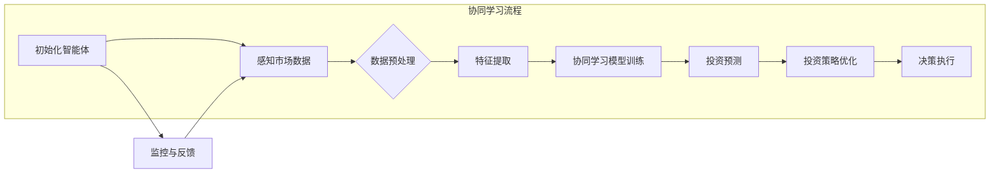
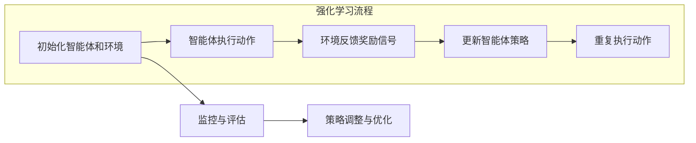
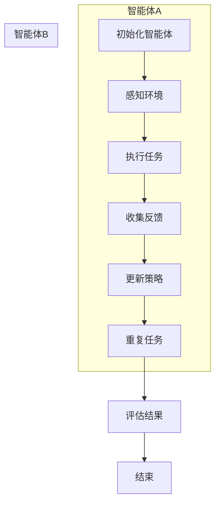
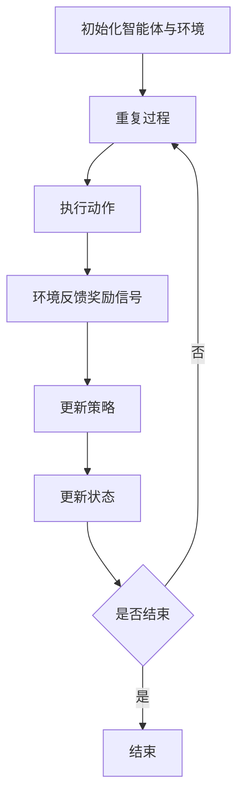
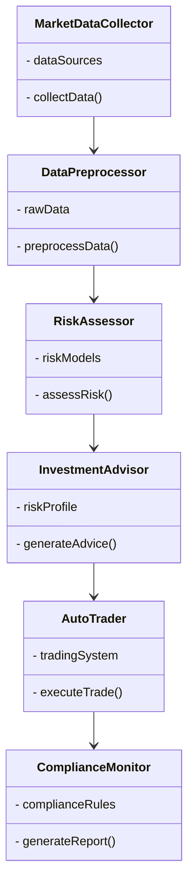
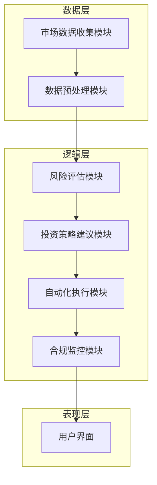
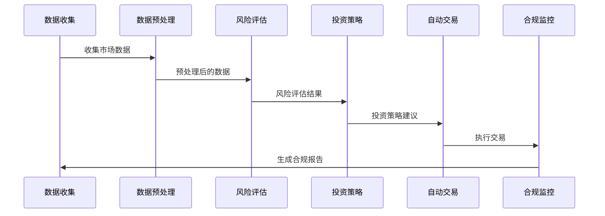

                 

# AI多智能体系统如何改进传统的价值投资风险控制方法

## 摘要

本文旨在探讨AI多智能体系统在改进传统价值投资风险控制方法方面的潜在应用与优势。随着金融市场复杂性不断增加，传统价值投资的风险控制方法面临着诸多挑战。AI多智能体系统通过其自主性、协同性和可扩展性，为价值投资提供了新的思路。本文首先介绍了AI多智能体系统和价值投资的基本概念，随后详细讲解了AI多智能体系统的算法原理及其在价值投资中的应用。通过数学模型和公式的分析，本文揭示了AI多智能体系统在风险评估和控制中的核心作用。接着，文章探讨了如何设计一个基于AI多智能体系统的价值投资风险控制系统，并通过实际项目案例展示了系统的实现与应用效果。最后，本文总结了最佳实践、注意事项和拓展阅读资源，为读者提供了进一步学习和实践的建议。

## 目录

1. **引言**
   - 1.1 问题背景
   - 1.2 价值投资与风险控制
   - 1.3 多智能体系统的优势
   - 1.4 本书结构安排

2. **AI多智能体系统基础**
   - 2.1 多智能体系统概述
   - 2.2 价值投资基本概念
   - 2.3 多智能体与价值投资的结合

3. **AI多智能体系统算法原理**
   - 3.1 多智能体算法基础
   - 3.2 多智能体算法在价值投资中的应用
   - 3.3 算法mermaid流程图展示

4. **数学模型与公式**
   - 4.1 多智能体系统数学模型
   - 4.2 价值投资与风险控制数学模型
   - 4.3 LaTeX格式数学公式举例

5. **系统分析与架构设计**
   - 5.1 系统问题场景介绍
   - 5.2 系统功能设计
   - 5.3 系统架构设计
   - 5.4 系统接口设计
   - 5.5 系统交互

6. **项目实战**
   - 6.1 项目环境安装
   - 6.2 系统核心实现
   - 6.3 代码应用解读与分析
   - 6.4 实际案例分析与讲解
   - 6.5 项目小结

7. **最佳实践与总结**
   - 7.1 最佳实践 tips
   - 7.2 小结
   - 7.3 注意事项
   - 7.4 拓展阅读

### 1.1 问题背景

在当今高度全球化的经济环境中，金融市场的不确定性和复杂性不断增加。投资者面临着越来越多的挑战，需要更加精准和高效的风险控制方法来保障投资回报。传统的价值投资方法，尽管强调长期投资和基本面分析，但在面对快速变化的市场环境时，风险控制效果往往不尽如人意。价值投资的核心在于寻找那些市场价格低于实际价值的公司股票，然后通过长期持有这些股票来获取利润。然而，这种方法在风险控制方面存在以下局限性：

- **市场适应性差**：传统价值投资方法主要依赖于历史数据和公司基本面分析，但市场环境的变化往往超出了这些分析方法的预测范围。
- **人为因素**：价值投资决策过程往往依赖于投资者的经验和直觉，这可能导致主观判断和情绪干扰，影响风险控制效果。
- **反应迟缓**：传统方法在应对突发市场事件时，反应速度较慢，无法迅速调整投资策略，从而增加风险。

随着人工智能技术的快速发展，AI多智能体系统（Multi-Agent System, MAS）逐渐成为解决这些问题的有力工具。AI多智能体系统是一种分布式计算系统，由多个自主智能体组成，这些智能体通过协同工作和信息交换来实现复杂任务。MAS在金融市场中的应用潜力巨大，特别是在风险控制方面，具有以下优势：

- **市场适应性**：MAS能够实时分析海量市场数据，快速识别市场趋势和风险信号，从而提高市场适应性。
- **减少人为因素**：MAS通过算法和模型来代替人为决策，减少了主观判断和情绪干扰，提高了决策的客观性和一致性。
- **快速反应**：MAS能够在短时间内处理大量信息，快速调整投资策略，减少市场波动带来的风险。

因此，本文将探讨AI多智能体系统如何通过其独特的优势，改进传统的价值投资风险控制方法，为投资者提供更加可靠和高效的决策支持。

### 1.2 价值投资与风险控制

价值投资（Value Investing）是一种基于长期投资和基本面分析的投资策略，其核心思想是寻找那些市场价格低于实际价值的公司股票，然后通过长期持有这些股票来获取利润。价值投资的基本原理可以归纳为以下几点：

- **基本面分析**：价值投资强调对公司的财务报表、业务模式、市场竞争力等方面的深入分析，以确定公司的内在价值。
- **市场价格与内在价值差异**：价值投资认为市场价格总是围绕公司的内在价值波动，市场波动提供了低价买入优质股票的机会。
- **长期持有**：价值投资主张投资者持有优质股票的时间应该是几年甚至几十年，以期获取公司成长带来的收益。

然而，价值投资在风险控制方面存在一些局限性。首先，传统价值投资方法主要依赖于历史数据和公司基本面分析，这些方法在应对快速变化的市场环境时，可能无法及时识别潜在的风险。其次，价值投资决策过程往往依赖于投资者的经验和直觉，这可能导致主观判断和情绪干扰，影响风险控制效果。此外，传统方法在应对突发市场事件时，反应速度较慢，无法迅速调整投资策略，从而增加风险。

风险控制（Risk Control）在价值投资中至关重要，其目的是通过识别、评估和管理风险，确保投资组合的安全性。传统的风险控制方法主要包括以下几种：

- **分散投资**：通过在不同行业、地区和市场进行分散投资，减少单一投资带来的风险。
- **止损策略**：设定止损点，当股票价格下跌到预设的止损点时，自动卖出股票以减少损失。
- **风险管理模型**：使用数学模型和统计方法，对投资组合的风险进行量化和管理。

尽管传统的风险控制方法在一定程度上能够缓解投资风险，但在面对复杂和多变的市场环境时，其效果有限。具体来说，传统方法在以下几个方面存在不足：

- **适应性差**：传统风险控制方法主要依赖于历史数据和固定模型，难以适应快速变化的市场环境。
- **人为因素**：风险控制决策往往依赖于人的判断和经验，容易受到情绪和主观偏见的影响。
- **反应迟缓**：在突发市场事件发生时，传统方法可能无法及时调整投资策略，从而增加损失。

AI多智能体系统在风险控制方面的优势

AI多智能体系统（MAS）是一种分布式计算系统，由多个自主智能体组成，这些智能体通过协同工作和信息交换来实现复杂任务。MAS在金融市场中的应用潜力巨大，特别是在风险控制方面，具有以下优势：

- **市场适应性**：MAS能够实时分析海量市场数据，快速识别市场趋势和风险信号，从而提高市场适应性。智能体可以自动调整投资策略，以应对市场变化。
- **减少人为因素**：MAS通过算法和模型来代替人为决策，减少了主观判断和情绪干扰，提高了决策的客观性和一致性。智能体根据预设的规则和目标进行操作，避免了人为错误。
- **快速反应**：MAS能够在短时间内处理大量信息，快速调整投资策略，减少市场波动带来的风险。智能体之间的协同工作使得系统反应速度大大提高。

通过引入AI多智能体系统，价值投资可以在风险控制方面实现以下改进：

- **实时风险评估**：智能体可以实时监控市场数据，快速识别潜在风险，并生成相应的风险报告，为投资者提供及时的风险预警。
- **智能调整策略**：智能体可以根据市场变化和风险信号，自动调整投资组合，以降低风险。例如，当市场波动加剧时，智能体可以自动增加现金头寸或减少高风险股票的持仓。
- **多角度风险分析**：智能体可以从不同角度对风险进行综合分析，提供更加全面和深入的风险评估。例如，智能体可以结合宏观经济数据、行业趋势和公司基本面信息，进行多维度的风险分析。

总之，AI多智能体系统通过其自主性、协同性和可扩展性，为价值投资风险控制提供了新的思路和方法。通过引入智能体技术，价值投资可以在更复杂的市场环境中实现更加高效和可靠的风险控制。

### 1.3 多智能体系统的优势

多智能体系统（MAS）是一种分布式计算系统，由多个自主智能体组成，这些智能体通过协同工作和信息交换来实现复杂任务。在金融市场中，MAS具有显著的优势，能够有效改进传统价值投资的风险控制方法。以下是MAS在自主性、协同性和可扩展性方面的具体优势：

**自主性**

自主性是指智能体在无需外部干预的情况下，能够自主决策和行动的能力。在价值投资风险控制中，自主性体现在以下方面：

- **自动数据处理**：智能体能够实时监控和处理海量市场数据，自动提取关键信息，生成投资建议。这大大提高了数据分析的效率和准确性，减少了人工干预的需求。
- **自动交易执行**：智能体可以根据预设的规则和目标，自动执行交易操作。例如，当市场数据达到特定条件时，智能体可以自动执行买入或卖出的操作，从而实现自动化交易。
- **自适应调整策略**：智能体能够根据市场变化和风险信号，自动调整投资策略。例如，当市场波动加剧时，智能体可以自动增加现金头寸或减少高风险股票的持仓，从而降低风险。

**协同性**

协同性是指多个智能体之间通过信息交换和协同工作，共同完成复杂任务的能力。在价值投资风险控制中，协同性体现在以下方面：

- **信息共享**：智能体之间可以共享市场数据、投资建议和风险分析结果，形成更全面和准确的投资决策。这种信息共享有助于提高决策的客观性和一致性，减少个体智能体的局限性。
- **协同交易**：智能体之间可以协同进行交易操作，以实现更高效的交易执行。例如，一个智能体负责市场数据的分析，另一个智能体负责执行交易，两者协同工作可以减少交易成本和提高交易成功率。
- **集体智慧**：多个智能体的协同工作可以形成“集体智慧”，通过集体决策来降低风险。集体智慧可以综合考虑不同智能体的意见和建议，避免个体智能体可能存在的偏见和错误。

**可扩展性**

可扩展性是指系统在规模和复杂性增加时，仍然能够保持性能和功能的能力。在价值投资风险控制中，可扩展性体现在以下方面：

- **模块化设计**：MAS采用模块化设计，可以将不同的功能模块独立开发和管理。这种设计方式使得系统可以灵活扩展，根据需求添加新的功能模块或调整现有模块。
- **分布式计算**：MAS利用分布式计算技术，将计算任务分布在多个智能体上，从而提高系统的处理能力和效率。这种分布式计算方式使得系统可以应对更大的数据量和更复杂的市场环境。
- **横向扩展**：MAS支持横向扩展，即通过增加智能体的数量来提高系统性能。当市场数据量增加或系统负载增加时，可以轻松增加智能体的数量，从而保持系统的稳定运行。

通过引入MAS，价值投资风险控制方法可以在以下方面实现改进：

- **提高市场适应性**：MAS能够实时监控和处理海量市场数据，快速识别市场趋势和风险信号，从而提高市场适应性。智能体可以自动调整投资策略，以应对市场变化。
- **减少人为因素**：MAS通过算法和模型来代替人为决策，减少了主观判断和情绪干扰，提高了决策的客观性和一致性。智能体根据预设的规则和目标进行操作，避免了人为错误。
- **提高反应速度**：MAS能够在短时间内处理大量信息，快速调整投资策略，减少市场波动带来的风险。智能体之间的协同工作使得系统反应速度大大提高。

总之，AI多智能体系统通过其自主性、协同性和可扩展性，为价值投资风险控制提供了新的思路和方法。通过引入智能体技术，价值投资可以在更复杂的市场环境中实现更加高效和可靠的风险控制。

### 1.4 本书结构安排

本书旨在深入探讨AI多智能体系统在改进传统价值投资风险控制方法中的应用，通过系统性的分析和详细的讲解，帮助读者理解并掌握这一前沿技术。本书的结构安排如下：

**第1章：引言**
本章介绍了本文的研究背景、价值投资与风险控制方法的局限性，以及AI多智能体系统在其中的优势。通过这一章节，读者可以初步了解本文的核心问题和研究意义。

**第2章：AI多智能体系统基础**
本章首先介绍多智能体系统的基本概念和特点，然后阐述价值投资的基本原理和风险控制方法。接着，本章探讨多智能体系统与价值投资的结合，为后续章节的理论和实践分析奠定基础。

**第3章：AI多智能体系统算法原理**
本章详细讲解AI多智能体系统的算法原理，包括协同学习算法和强化学习算法。通过mermaid流程图展示算法流程，并结合Python源代码和数学模型进行解释，帮助读者深入理解算法的核心思想。

**第4章：数学模型与公式**
本章介绍多智能体系统的数学模型，包括协同学习和强化学习模型。同时，本章使用LaTeX格式嵌入数学模型和公式，并进行详细讲解和举例说明，以增强读者对数学模型的掌握。

**第5章：系统分析与架构设计**
本章介绍系统分析和架构设计的方法，包括问题场景介绍、系统功能设计、系统架构设计、系统接口设计和系统交互。通过mermaid类图和架构图展示系统设计，为实际项目开发提供参考。

**第6章：项目实战**
本章通过具体的项目实战，展示AI多智能体系统的实现和应用。包括项目环境安装、系统核心实现、代码应用解读与分析、实际案例分析和详细讲解，帮助读者理解和应用所学知识。

**第7章：最佳实践与总结**
本章总结最佳实践、注意事项和拓展阅读资源，为读者提供进一步学习和实践的建议。通过这一章节，读者可以更好地将所学知识应用于实际工作中。

通过以上结构安排，本书旨在系统地介绍AI多智能体系统在价值投资风险控制中的应用，帮助读者从理论到实践全面了解这一前沿技术。

### 2.1 多智能体系统概述

多智能体系统（Multi-Agent System, MAS）是一种由多个自主智能体组成的分布式计算系统，这些智能体通过协同工作和信息交换来实现复杂任务。在MAS中，每个智能体都具有自主性、社会性和反应性，能够独立决策和执行任务。以下是对多智能体系统的详细定义、特点以及其与传统系统的比较。

#### 定义

多智能体系统是由一组相互协作的智能体组成的系统，这些智能体可以在一个共享环境中独立行动并相互交互。每个智能体都是独立的实体，具有感知、推理、决策和执行能力。智能体之间的交互可以通过直接通信或通过共享环境中的信息进行。MAS的目的是通过多个智能体的协同工作来实现系统整体的目标。

#### 特点

**自主性**：每个智能体都能够自主决策和执行任务，不受外部控制。智能体可以在没有中央控制的情况下，根据自身的感知和知识来采取行动。

**社会性**：智能体之间可以相互交互，通过通信和信息共享来协同工作，共同实现系统目标。这种社会性使得智能体能够协同完成任务，提高系统的整体效能。

**反应性**：智能体能够实时响应环境的变化，并调整自己的行为。这种反应性使得智能体能够快速适应不断变化的环境，保持系统的稳定性和适应性。

**分布式**：MAS通过分布式计算来实现复杂任务。智能体分布在不同的物理位置或计算节点上，通过协同工作来完成整个任务。这种分布式结构提高了系统的容错性和扩展性。

**适应性**：MAS能够通过学习和适应环境变化来提高性能。智能体可以通过经验学习和反馈机制来不断调整自己的行为，从而提高系统的适应性和鲁棒性。

#### 与传统系统的比较

多智能体系统与传统集中式系统在多个方面存在显著差异：

**决策方式**：传统系统通常由一个中央控制器统一决策，而MAS中的每个智能体都具备自主决策能力。智能体可以根据自身的感知和知识，独立做出决策，从而提高系统的响应速度和灵活性。

**系统结构**：传统系统通常采用层级结构或线性结构，而MAS采用分布式结构。智能体之间的协作通过直接通信或共享环境中的信息进行，这种结构提高了系统的容错性和扩展性。

**适应性**：传统系统在应对环境变化时，通常需要重新设计和调整。而MAS可以通过智能体的自主学习和适应来应对环境变化，从而提高系统的适应性和鲁棒性。

**复杂性**：传统系统在处理复杂任务时，通常需要复杂的中央控制器和大量计算资源。而MAS通过多个智能体的协同工作，可以更高效地处理复杂任务，同时降低系统的复杂性。

#### 多智能体系统在金融市场中的应用

在金融市场中，多智能体系统具有广泛的应用潜力，特别是在价值投资风险控制方面。以下是一些具体应用：

- **市场预测**：智能体可以实时监控市场数据，通过协同工作来预测市场走势，为投资者提供交易策略建议。
- **风险评估**：智能体可以从不同角度对市场风险进行评估，提供全面的风险分析报告，帮助投资者制定风险控制策略。
- **交易执行**：智能体可以自动化交易执行，根据市场数据和风险分析结果，自动调整投资组合，降低风险。
- **动态优化**：智能体可以通过学习和适应环境变化，不断优化投资策略，提高投资回报率。

总之，多智能体系统通过其自主性、协同性和可扩展性，为金融市场中的应用提供了新的思路和方法。通过引入智能体技术，投资者可以更高效地应对复杂的市场环境，提高风险控制效果和投资回报。

### 2.2 价值投资基本概念

价值投资是一种以长期投资为核心、基于基本面分析的投资策略，其核心理念是寻找那些市场价格低于实际价值的公司股票，然后通过长期持有这些股票来获取利润。以下是对价值投资的基本概念、原则及其在风险控制中的作用的详细探讨。

#### 基本概念

**价值投资**：价值投资起源于20世纪初，由本杰明·格雷厄姆和戴维·多德等人提出。其基本概念是寻找那些市场价格低于其内在价值的股票，即“低估”股票。这种投资策略强调对公司的财务报表、业务模式、管理团队和市场竞争力等方面的深入分析，以确定公司的内在价值。

**内在价值**：内在价值是指一家公司的实际价值，而不是其市场价格。价值投资者通过分析公司的盈利能力、现金流量、资产负债表和业务前景等因素，来估算公司的内在价值。

**安全边际**：安全边际是指市场价格与内在价值之间的差额。价值投资者倾向于在安全边际较大的情况下购买股票，以减少投资风险。

**长期持有**：价值投资主张投资者持有优质股票的时间应该是几年甚至几十年，以期获取公司成长带来的收益。这种长期持有的策略有助于避免短期市场波动对投资决策的干扰，从而实现稳定的投资回报。

#### 原则

**基本面分析**：价值投资的核心原则是基本面分析，即通过分析公司的财务报表、业务模式、管理团队和市场竞争力等方面的信息，来确定公司的内在价值。基本面分析可以帮助投资者识别那些被市场低估的股票。

**分散投资**：为了降低投资风险，价值投资者通常采用分散投资策略。这意味着他们将资金分散投资于多个不同的股票，以减少单一股票波动对整个投资组合的影响。

**逆向投资**：逆向投资是价值投资的一个重要原则，即投资者在市场情绪悲观、股价较低时买入股票，在市场情绪乐观、股价较高时卖出股票。逆向投资的目的是利用市场的非理性行为，在低估时买入，在高估时卖出。

**纪律执行**：价值投资要求投资者具备良好的纪律性，在投资决策过程中避免情绪干扰和主观偏见。投资者需要坚持自己的投资策略，即使在短期内市场表现不佳，也要耐心持有。

#### 在风险控制中的作用

**风险识别**：价值投资通过基本面分析来识别潜在的投资风险。投资者通过分析公司的财务状况、业务前景和市场环境，可以提前识别出可能导致股价下跌的风险因素。

**风险评估**：价值投资强调对投资风险进行量化评估。投资者通过计算公司的内在价值与市场价格之间的差额，可以评估股票的安全边际，从而判断股票的风险水平。

**风险控制方法**：价值投资采用多种风险控制方法来降低投资风险。包括分散投资、定期重新平衡投资组合、设定止损点等。通过这些方法，投资者可以降低单一股票的风险，提高整体投资组合的安全性。

**长期持有**：价值投资的长期持有策略有助于降低短期市场波动对投资决策的影响。长期持有能够避免因市场波动而导致的情绪波动，从而减少投资风险。

总之，价值投资通过其基本概念和原则，在风险控制中发挥了重要作用。通过基本面分析识别风险、量化评估风险，并采用多种风险控制方法，价值投资能够有效降低投资风险，提高投资回报。

### 2.3 多智能体与价值投资的结合

在探讨了多智能体系统和价值投资的基本概念之后，我们接下来将深入分析如何将多智能体系统（MAS）与价值投资相结合，以实现风险控制的优化。这一部分将详细描述多智能体系统与价值投资之间的联系，通过概念属性特征对比表格和ER实体关系图展示两者的结合方式，并探讨其在金融风险管理中的应用。

#### 多智能体系统与价值投资的关系

多智能体系统与价值投资之间的结合主要体现在以下几个方面：

1. **数据分析与预测**：多智能体系统可以利用其自主性和协同性，对海量市场数据进行实时分析和预测。这些智能体可以处理来自不同数据源的信息，包括股票价格、公司财务报表、宏观经济指标等，从而生成更准确的市场预测和投资建议。

2. **风险评估与调整**：多智能体系统可以通过不同的算法和模型，对投资组合中的股票进行风险评估。智能体可以实时监控市场变化，根据风险信号自动调整投资策略，从而降低投资组合的整体风险。

3. **分散投资优化**：多智能体系统可以根据对市场的理解，优化投资组合的分散程度。智能体可以动态调整投资比例，确保投资组合在保持风险可控的同时，实现收益最大化。

4. **决策支持与执行**：多智能体系统可以为投资者提供实时决策支持，根据市场数据和分析结果，自动执行交易操作。这种自动化决策和执行方式，可以减少人为因素和情绪干扰，提高投资决策的客观性和一致性。

#### 概念属性特征对比表格

以下是一个概念属性特征对比表格，展示了多智能体系统与价值投资之间的结合点：

| 特征                   | 多智能体系统                  | 价值投资                |
|------------------------|-------------------------------|------------------------|
| 自主性                 | 智能体独立决策和执行          | 投资者独立分析决策      |
| 协同性                 | 智能体间通过信息交换协同工作   | 投资者通过多方信息综合分析 |
| 数据分析与预测         | 实时处理海量市场数据          | 基于历史数据预测市场趋势 |
| 风险评估与调整         | 智能体自动评估和调整风险      | 投资者手动评估和管理风险 |
| 分散投资优化           | 动态调整投资组合分散程度      | 理论上分散投资          |
| 决策支持与执行         | 自动化交易执行                | 人工交易执行            |

#### ER实体关系图

为了更好地展示多智能体系统与价值投资之间的结合，我们可以使用ER（实体关系）图来描述两者之间的关系。以下是一个简化的ER图：

```mermaid
erDiagram
  Investment_Agent ||--|{ Stock_Market_Data : contains }
  Investment_Strategy ||--|{ Market_Trend_Prediction : predicts }
  Risk_Assessment_Model ||--|{ Investment_Risk_Score : assesses }
  Investment_Portfolio ||--|{ Stock Positions : consists_of }
  Investment_Agent ||--|{ Investment_Strategy : follows }
  Investment_Strategy ||--|{ Risk_Assessment_Model : relies_on }
  Investment_Portfolio ||--|{ Investment_Agent : managed_by }
```

在这个ER图中，我们定义了以下实体：

- **Investment_Agent**：表示多智能体系统中的智能体，负责分析数据、预测市场趋势和执行投资策略。
- **Stock_Market_Data**：表示市场数据，包括股票价格、财务报表、宏观经济指标等，智能体通过分析这些数据来生成投资建议。
- **Investment_Strategy**：表示投资策略，由智能体根据市场数据和风险评估模型制定。
- **Risk_Assessment_Model**：表示风险评估模型，用于评估投资组合中的股票风险。
- **Investment_Portfolio**：表示投资组合，由多个股票组成，智能体负责管理这些股票的持仓。

智能体之间通过信息交换和协同工作来实现整体目标。智能体从市场数据中提取信息，生成投资策略，并通过风险评估模型评估投资组合的风险，最终管理投资组合中的股票持仓。

#### 在金融风险管理中的应用

多智能体系统在金融风险管理中的应用主要体现在以下几个方面：

1. **实时风险评估**：智能体可以实时监控市场数据，通过协同工作快速识别潜在风险，并生成风险报告。投资者可以根据这些报告及时调整投资策略，降低风险。

2. **动态调整投资组合**：智能体可以根据市场变化和风险信号，动态调整投资组合。例如，当市场波动加剧时，智能体可以增加现金头寸或减少高风险股票的持仓，从而降低投资组合的风险。

3. **风险分散优化**：智能体可以基于对市场的理解，优化投资组合的分散程度。通过分析不同行业、地区和市场的风险，智能体可以调整投资比例，实现更有效的风险分散。

4. **自动化交易执行**：智能体可以自动化交易执行，根据市场数据和风险评估结果，自动调整投资组合。这种自动化交易执行可以减少人为错误，提高交易效率。

总之，通过将多智能体系统与价值投资相结合，投资者可以实现更高效、更可靠的风险控制。智能体的自主性、协同性和可扩展性为价值投资提供了新的工具和方法，有助于投资者在复杂的市场环境中实现稳健的投资回报。

### 3.1 多智能体算法基础

在深入探讨多智能体系统在价值投资中的应用之前，我们需要了解多智能体算法的基础，包括协同学习算法和强化学习算法。这些算法是多智能体系统实现复杂任务和优化决策的关键。

#### 协同学习算法

协同学习（Cooperative Learning）算法是一种多智能体系统中的合作机制，通过多个智能体的协同工作来实现共同目标。协同学习算法的核心思想是，多个智能体在共享环境中共同完成任务，并通过交流信息、协调策略来提高整个系统的性能。

**协同学习算法的特点**：

- **合作机制**：智能体之间通过合作和交流来实现共同目标，而不是相互竞争。这种合作机制有助于提高系统的整体效率和性能。
- **信息共享**：智能体之间可以共享感知信息、决策结果和执行经验，从而更好地协调行动。信息共享是协同学习算法的关键，有助于减少个体智能体的局限性。
- **任务分配**：在协同学习中，智能体需要根据任务需求和自身能力进行任务分配，确保每个智能体都能发挥最大的作用。任务分配的合理性和效率直接影响协同学习的效果。

**协同学习算法的应用场景**：

- **金融市场预测**：多个智能体可以协同工作，共同分析市场数据，预测市场走势。通过共享分析结果和信息，智能体可以更准确地识别市场趋势和风险信号。
- **投资组合优化**：智能体可以根据对市场的理解，协同调整投资组合，优化投资策略。通过信息共享和协调，智能体可以降低投资风险，提高投资回报。

**协同学习算法的基本流程**：

1. **任务分配**：智能体根据自身能力和任务需求，分配各自的子任务。
2. **感知与决策**：每个智能体根据自身感知的信息，独立进行决策。
3. **信息共享**：智能体之间通过通信机制，共享决策结果和执行经验。
4. **协调与优化**：智能体根据共享的信息，协调行动，优化整体任务执行。

#### 强化学习算法

强化学习（Reinforcement Learning，RL）算法是一种通过奖励和惩罚机制来训练智能体行为的算法。在强化学习中，智能体通过不断尝试和反馈，学习如何在特定环境中做出最优决策。

**强化学习算法的特点**：

- **自主性**：智能体在特定环境中自主决策，根据环境反馈调整自身行为。
- **适应性**：智能体可以通过经验学习和策略调整，适应不断变化的环境。
- **奖励机制**：强化学习算法通过奖励和惩罚来指导智能体的行为。奖励表示智能体的正确行为，惩罚表示智能体的错误行为。通过奖励机制，智能体可以不断优化决策，提高整体性能。

**强化学习算法的应用场景**：

- **自动交易**：智能体可以通过强化学习算法，在金融市场中自动执行交易策略。通过不断尝试和反馈，智能体可以优化交易策略，提高交易成功率。
- **风险评估**：智能体可以通过强化学习算法，实时评估投资组合的风险。通过分析历史数据和奖励信号，智能体可以学习如何降低风险，提高投资回报。

**强化学习算法的基本流程**：

1. **初始化**：智能体和环境初始化，设定初始状态。
2. **决策执行**：智能体根据当前状态，执行决策动作。
3. **反馈获取**：环境根据智能体的决策动作，给出奖励信号（正奖励或负奖励）。
4. **策略调整**：智能体根据奖励信号，调整行为策略。
5. **状态转移**：智能体和环境进入新的状态，重复上述过程。

#### 多智能体算法的融合应用

在实际应用中，协同学习算法和强化学习算法可以相互融合，共同提高多智能体系统的性能。以下是一些融合应用的场景：

- **多智能体协作投资**：智能体通过协同学习算法，共同分析市场数据，预测市场趋势。同时，智能体通过强化学习算法，根据市场反馈调整投资策略，实现高效的投资组合管理。
- **自适应风险控制**：智能体通过强化学习算法，实时评估投资组合的风险。协同学习算法则用于智能体之间的信息共享和协调，确保风险控制策略的动态调整和优化。

通过融合协同学习算法和强化学习算法，多智能体系统可以在金融市场中实现更高效、更可靠的风险控制和投资决策。智能体的自主性和适应性，使得系统能够应对复杂多变的市场环境，提高整体投资回报。

### 3.2 多智能体算法在价值投资中的应用

多智能体算法，特别是协同学习算法和强化学习算法，在价值投资中展现出强大的潜力和应用价值。本节将详细探讨这两种算法在价值投资风险评估和风险控制中的应用，并使用mermaid流程图和Python源代码来展示和解释这些算法的实现过程。

#### 协同学习算法在价值投资中的应用

协同学习算法在价值投资中的应用主要体现在以下几个方面：

1. **市场数据协同分析**：智能体通过协同学习算法，共同分析市场数据，提取关键信息，生成投资预测。
2. **投资组合协同管理**：多个智能体通过协同学习算法，共同管理投资组合，优化投资策略，降低风险。
3. **风险协同控制**：智能体通过协同学习算法，共享风险信息，协同制定风险控制策略，提高风险管理的效率。

**mermaid流程图示例**：



**Python源代码示例**：

```python
# 假设使用协同学习模型进行投资预测
import numpy as np
from sklearn.ensemble import RandomForestClassifier

# 初始化智能体和训练数据
agents = [RandomForestClassifier() for _ in range(num_agents)]
training_data = load_market_data()

# 感知市场数据，进行数据预处理和特征提取
preprocessed_data = preprocess_data(training_data)
features = extract_features(preprocessed_data)

# 训练协同学习模型
for agent in agents:
    agent.fit(features['X'], features['y'])

# 生成投资预测
predictions = [agent.predict(new_data) for agent in agents]

# 根据预测结果优化投资策略
investment_strategy = optimize_investment_strategy(predictions)
```

#### 强化学习算法在价值投资中的应用

强化学习算法在价值投资中的应用主要体现在以下几个方面：

1. **自动交易策略**：智能体通过强化学习算法，自动执行交易策略，实现自动化交易。
2. **风险动态调整**：智能体通过强化学习算法，实时评估投资组合的风险，动态调整投资策略，以降低风险。
3. **长期回报优化**：智能体通过强化学习算法，学习如何在长期内实现最大化回报。

**mermaid流程图示例**：



**Python源代码示例**：

```python
# 假设使用强化学习模型进行自动交易
import gym
from stable_baselines3 import PPO

# 初始化交易环境
env = gym.make('StockTrading-v0')

# 训练强化学习模型
model = PPO("MlpPolicy", env, verbose=1)
model.learn(total_timesteps=10000)

# 自动执行交易策略
obs = env.reset()
while True:
    action, _states = model.predict(obs)
    obs, rewards, done, info = env.step(action)
    if done:
        break
```

#### 多智能体算法在价值投资中的应用效果

通过以上两种算法的应用，多智能体系统在价值投资中展现出以下效果：

1. **提高预测准确性**：协同学习算法通过多个智能体的协同工作，可以更准确地预测市场趋势和风险信号，为投资者提供更可靠的决策支持。
2. **降低投资风险**：强化学习算法通过自适应调整投资策略，可以动态降低投资组合的风险，提高投资回报的稳定性。
3. **自动化决策**：智能体通过自动执行交易策略，可以减少人为干预，提高交易效率，减少交易成本。

总之，多智能体算法在价值投资中的应用，不仅提高了风险控制的效率和准确性，还通过自动化和智能化的决策过程，为投资者提供了更加可靠和高效的决策支持。

### 3.3 算法mermaid流程图展示

在本节中，我们将使用mermaid语言绘制两个典型的多智能体算法的流程图：协同学习算法和强化学习算法。这些mermaid流程图将帮助我们更直观地理解这些算法的基本步骤和执行过程。

#### 协同学习算法mermaid流程图

协同学习算法通常涉及多个智能体的协作，以共同完成任务。以下是一个简化的协同学习算法流程图：



在这个流程图中，我们定义了以下步骤：

- **初始化智能体**：智能体初始化，准备开始任务。
- **感知环境**：智能体感知环境状态，获取必要的信息。
- **执行任务**：智能体根据当前状态执行任务。
- **收集反馈**：智能体收集任务执行后的反馈信息。
- **更新策略**：智能体根据反馈信息更新策略。
- **重复任务**：智能体重复上述过程，以实现协同工作。
- **评估结果**：评估智能体协同工作的结果。

#### 强化学习算法mermaid流程图

强化学习算法的核心是智能体与环境之间的互动，通过奖励信号来指导智能体的行为。以下是一个强化学习算法的流程图：



在这个流程图中，我们定义了以下步骤：

- **初始化智能体与环境**：智能体和环境初始化，设定初始状态。
- **智能体选择动作**：智能体根据当前状态选择执行的动作。
- **执行动作**：智能体在环境中执行选择的动作。
- **环境反馈奖励信号**：环境根据智能体的动作提供奖励信号。
- **更新策略**：智能体根据奖励信号更新行为策略。
- **更新状态**：智能体和环境进入新的状态。
- **重复过程**：智能体继续选择动作并执行，直到结束条件满足。

通过上述mermaid流程图的展示，我们可以更清晰地理解协同学习算法和强化学习算法的基本执行步骤和流程，为后续的具体实现和项目开发提供了可视化参考。

### 4.1 多智能体系统数学模型

多智能体系统（MAS）在金融风险管理中的应用，离不开数学模型的支撑。本节将详细讨论协同学习和强化学习算法在多智能体系统中的数学模型，包括协同学习模型和强化学习模型，并通过具体的数学公式和LaTeX格式进行展示。

#### 协同学习模型

协同学习模型的核心在于多个智能体通过共享信息和协调行动来优化整体性能。以下是一个简化的协同学习模型：

**协同学习模型公式**：

\[ V(s) = \sum_{i=1}^{N} w_i V(s_i) \]

其中：
- \( V(s) \) 是智能体对状态 \( s \) 的评估值；
- \( w_i \) 是智能体 \( i \) 的权重；
- \( N \) 是智能体的总数；
- \( V(s_i) \) 是智能体 \( i \) 对状态 \( s_i \) 的评估值。

**LaTeX格式**：

```latex
\[
V(s) = \sum_{i=1}^{N} w_i V(s_i)
\]
```

#### 强化学习模型

强化学习模型侧重于通过奖励信号和策略迭代来优化智能体的行为。以下是一个简化的强化学习模型：

**强化学习模型公式**：

\[ Q(s, a) = r + \gamma \max_{a'} Q(s', a') \]

其中：
- \( Q(s, a) \) 是在状态 \( s \) 下执行动作 \( a \) 的预期回报；
- \( r \) 是即时奖励；
- \( \gamma \) 是折扣因子，表示对未来奖励的期望；
- \( s' \) 是执行动作 \( a \) 后的新状态；
- \( a' \) 是在新状态 \( s' \) 下选择的最优动作。

**LaTeX格式**：

```latex
\[
Q(s, a) = r + \gamma \max_{a'} Q(s', a')
\]
```

#### 数学模型在MAS中的应用

**协同学习模型在价值投资中的应用**：

协同学习模型在价值投资中可以用于智能体的风险评估和投资策略优化。智能体通过共享市场数据和分析结果，可以共同评估股票的投资价值，从而优化投资组合。以下是一个简化的协同学习模型在价值投资中的应用：

\[ \text{投资价值}(s) = \sum_{i=1}^{N} w_i \text{智能体}^i(\text{评估值}(s_i)) \]

其中：
- \( \text{投资价值}(s) \) 是对某个股票在当前市场状态 \( s \) 的整体投资价值评估；
- \( w_i \) 是第 \( i \) 个智能体的权重，表示其评估结果的信任度；
- \( \text{智能体}^i(\text{评估值}(s_i)) \) 是第 \( i \) 个智能体对股票在状态 \( s_i \) 下的评估值。

**LaTeX格式**：

```latex
\[
\text{投资价值}(s) = \sum_{i=1}^{N} w_i \text{智能体}^i(\text{评估值}(s_i))
\]
```

**强化学习模型在价值投资中的应用**：

强化学习模型在价值投资中可以用于自动交易策略的优化。智能体通过不断尝试和反馈，可以学习如何在不同的市场状态下执行最优交易策略，从而最大化投资回报。以下是一个简化的强化学习模型在价值投资中的应用：

\[ \text{最优策略}(s) = \arg\max_{a} Q(s, a) \]

其中：
- \( \text{最优策略}(s) \) 是在状态 \( s \) 下执行的最优交易策略；
- \( Q(s, a) \) 是在状态 \( s \) 下执行动作 \( a \) 的预期回报。

**LaTeX格式**：

```latex
\[
\text{最优策略}(s) = \arg\max_{a} Q(s, a)
\]
```

通过上述数学模型的引入和具体应用，我们可以更深入地理解多智能体系统在金融风险管理中的应用，为实际项目开发和算法实现提供坚实的理论基础。

### 4.2 价值投资与风险控制数学模型

在价值投资和风险控制中，数学模型和公式起着至关重要的作用，它们不仅能够量化市场数据，还能帮助投资者制定更加科学和精准的投资策略。本节将详细探讨价值投资与风险控制中常用的数学模型，包括风险评估模型和风险控制模型，并通过具体的LaTeX格式进行展示。

#### 风险评估模型

风险评估模型用于评估投资组合中各个资产的风险水平，常见的风险评估模型包括标准差模型和VaR模型。

1. **标准差模型**：

标准差模型通过计算资产收益率的波动性来评估风险。公式如下：

\[ \sigma = \sqrt{\frac{1}{N-1} \sum_{i=1}^{N} (r_i - \mu)^2} \]

其中：
- \( \sigma \) 是资产收益率的标准差；
- \( N \) 是时间序列的长度；
- \( r_i \) 是第 \( i \) 期的资产收益率；
- \( \mu \) 是资产收益率的均值。

**LaTeX格式**：

```latex
\[
\sigma = \sqrt{\frac{1}{N-1} \sum_{i=1}^{N} (r_i - \mu)^2}
\]
```

2. **VaR模型**：

VaR（Value at Risk）模型用于评估投资组合在一定置信水平下的最大潜在损失。公式如下：

\[ \text{VaR}_{\alpha} = \mu - z_{\alpha} \sigma \]

其中：
- \( \text{VaR}_{\alpha} \) 是在置信水平 \( \alpha \) 下的VaR值；
- \( z_{\alpha} \) 是标准正态分布的 \( \alpha \) 置信水平对应的分位数；
- \( \mu \) 是资产收益率的均值；
- \( \sigma \) 是资产收益率的标准差。

**LaTeX格式**：

```latex
\[
\text{VaR}_{\alpha} = \mu - z_{\alpha} \sigma
\]
```

#### 风险控制模型

风险控制模型用于制定和执行风险管理策略，常见的风险控制模型包括分散投资模型和止损策略模型。

1. **分散投资模型**：

分散投资模型通过将资金投资于不同的资产类别来降低组合风险。公式如下：

\[ \text{总风险} = \sum_{i=1}^{N} w_i^2 \sigma_i^2 + 2 \sum_{i=1}^{N} \sum_{j=i+1}^{N} w_i w_j \rho_{ij} \sigma_i \sigma_j \]

其中：
- \( \text{总风险} \) 是投资组合的总风险；
- \( w_i \) 是资产 \( i \) 的投资比例；
- \( \sigma_i \) 是资产 \( i \) 的标准差；
- \( \rho_{ij} \) 是资产 \( i \) 和资产 \( j \) 的相关系数。

**LaTeX格式**：

```latex
\[
\text{总风险} = \sum_{i=1}^{N} w_i^2 \sigma_i^2 + 2 \sum_{i=1}^{N} \sum_{j=i+1}^{N} w_i w_j \rho_{ij} \sigma_i \sigma_j
\]
```

2. **止损策略模型**：

止损策略模型通过设定止损点来控制投资损失。公式如下：

\[ \text{止损点} = r_t - z_{\alpha} \frac{\sigma}{w} \]

其中：
- \( \text{止损点} \) 是设定的止损价格；
- \( r_t \) 是当前资产价格；
- \( z_{\alpha} \) 是标准正态分布的 \( \alpha \) 置信水平对应的分位数；
- \( \sigma \) 是资产收益率的标准差；
- \( w \) 是资产的投资比例。

**LaTeX格式**：

```latex
\[
\text{止损点} = r_t - z_{\alpha} \frac{\sigma}{w}
\]
```

#### 数学模型在价值投资与风险控制中的应用

数学模型在价值投资与风险控制中的应用主要体现在以下几个方面：

1. **风险评估**：通过风险评估模型，投资者可以量化投资组合的风险水平，从而制定更加科学的风险控制策略。
2. **投资决策**：通过分散投资模型，投资者可以优化投资组合，降低整体风险，提高投资回报。
3. **风险监控**：通过VaR模型和止损策略模型，投资者可以实时监控投资组合的风险，及时调整投资策略，以应对市场变化。

总之，数学模型和公式在价值投资与风险控制中发挥着关键作用，通过合理运用这些模型，投资者可以更加精准地评估和管理投资风险，实现稳健的投资回报。

### 4.3 LaTeX格式数学公式举例

在本文的数学模型和公式部分，我们将使用LaTeX格式来展示具体的数学公式。LaTeX是一种流行的排版系统，特别适用于科学文档，包括数学公式和算法描述。以下是一些常用的LaTeX数学公式示例：

#### 简单公式

1. **一元二次方程的根**：

\[ x = \frac{-b \pm \sqrt{b^2 - 4ac}}{2a} \]

2. **均值和标准差**：

\[ \mu = \frac{1}{n} \sum_{i=1}^{n} x_i \]
\[ \sigma = \sqrt{\frac{1}{n-1} \sum_{i=1}^{n} (x_i - \mu)^2} \]

#### 高级公式

1. **多元线性回归模型**：

\[ y = \beta_0 + \beta_1 x_1 + \beta_2 x_2 + \ldots + \beta_n x_n + \varepsilon \]

2. **概率密度函数**：

\[ f(x) = \frac{1}{\sqrt{2\pi\sigma^2}} e^{-\frac{(x-\mu)^2}{2\sigma^2}} \]

3. **泰勒展开式**：

\[ f(x) = f(a) + f'(a)(x-a) + \frac{f''(a)}{2!}(x-a)^2 + \ldots \]

#### LaTeX代码示例

以下是上述公式的LaTeX代码示例：

```latex
% 一元二次方程的根
\[ x = \frac{-b \pm \sqrt{b^2 - 4ac}}{2a} \]

% 均值和标准差
\[ \mu = \frac{1}{n} \sum_{i=1}^{n} x_i \]
\[ \sigma = \sqrt{\frac{1}{n-1} \sum_{i=1}^{n} (x_i - \mu)^2} \]

% 多元线性回归模型
\[ y = \beta_0 + \beta_1 x_1 + \beta_2 x_2 + \ldots + \beta_n x_n + \varepsilon \]

% 概率密度函数
\[ f(x) = \frac{1}{\sqrt{2\pi\sigma^2}} e^{-\frac{(x-\mu)^2}{2\sigma^2}} \]

% 泰勒展开式
\[ f(x) = f(a) + f'(a)(x-a) + \frac{f''(a)}{2!}(x-a)^2 + \ldots \]
```

通过LaTeX格式，我们可以清晰地书写和展示复杂的数学公式，提高文档的可读性和专业性。在实际应用中，读者可以根据需要进行调整和扩展，以满足不同类型的数学公式排版需求。

### 5.1 系统问题场景介绍

在本文的第五部分，我们将探讨基于AI多智能体系统的价值投资风险控制系统，首先介绍该系统的具体问题场景。这一场景涉及金融市场中的多个参与者，包括投资者、金融机构和监管机构，以及他们之间的复杂交互。

#### 问题场景描述

1. **投资者需求**：投资者希望在复杂多变的市场环境中，能够实时评估投资组合的风险，并制定科学的投资策略。他们需要一个智能化的系统，能够提供准确的市场预测和风险控制建议。

2. **金融机构需求**：金融机构，如银行和证券公司，需要对客户的投资组合进行有效的风险管理和合规监控。他们需要一个集成的系统，能够自动化处理大量的市场数据，并生成个性化的投资建议。

3. **监管机构需求**：监管机构需要监控金融市场的稳定性，确保金融机构和投资者的合规操作。他们需要一个透明的系统，能够实时收集和分析市场数据，提供风险预警和监管报告。

#### 系统目标

基于上述需求，该系统的目标如下：

1. **实时风险监控**：系统能够实时监控市场数据，识别潜在风险，并提供风险预警。

2. **个性化投资建议**：系统根据投资者的风险偏好和市场数据，提供个性化的投资建议，帮助投资者优化投资组合。

3. **自动化风险管理**：系统自动化执行风险控制策略，降低人为错误，提高风险管理的效率。

4. **合规监控与报告**：系统能够收集和整理市场数据，生成合规报告，帮助监管机构监控市场稳定性。

#### 系统关键功能

1. **市场数据收集**：系统通过多种渠道收集实时市场数据，包括股票价格、交易量、宏观经济指标等。

2. **数据预处理**：系统对收集到的数据进行预处理，包括数据清洗、归一化和特征提取，为后续分析提供高质量的数据。

3. **风险评估**：系统使用AI多智能体算法，对投资组合进行风险评估，提供全面的风险报告。

4. **投资策略建议**：系统根据风险评估结果，结合投资者的风险偏好，提供个性化的投资策略建议。

5. **自动化执行**：系统自动化执行交易策略，减少人为干预，提高交易效率。

6. **合规监控**：系统监控市场数据，确保金融机构和投资者的合规操作，生成合规报告。

通过以上系统问题场景的介绍，我们可以明确基于AI多智能体系统的价值投资风险控制系统的具体目标和关键功能。接下来，我们将详细讨论系统功能设计、系统架构设计、系统接口设计和系统交互，以全面展示该系统的实现细节。

### 5.2 系统功能设计

系统功能设计是构建一个高效、可靠的基于AI多智能体系统的价值投资风险控制系统的关键步骤。以下将详细描述系统的主要功能模块，包括领域模型mermaid类图，以帮助读者更好地理解系统的设计。

#### 功能模块

1. **市场数据收集模块**：
   - **功能描述**：该模块负责从多种数据源收集实时市场数据，包括股票价格、交易量、宏观经济指标等。
   - **数据来源**：交易所数据、财经新闻、社交媒体数据、经济统计数据等。

2. **数据预处理模块**：
   - **功能描述**：对收集到的市场数据进行预处理，包括数据清洗、归一化和特征提取，为后续的风险评估和策略建议提供高质量的数据。
   - **数据处理**：数据清洗（去除无效数据、填补缺失值）、数据归一化（缩放数据至相同范围）、特征提取（提取时间序列特征、技术指标等）。

3. **风险评估模块**：
   - **功能描述**：使用AI多智能体算法对投资组合进行实时风险评估，识别潜在的风险信号，并提供风险报告。
   - **算法应用**：协同学习算法和强化学习算法，用于评估市场风险和优化投资策略。

4. **投资策略建议模块**：
   - **功能描述**：根据风险评估结果和投资者的风险偏好，提供个性化的投资策略建议。
   - **策略生成**：利用智能体算法的预测结果，结合历史数据和投资者的偏好，生成具体的交易策略。

5. **自动化执行模块**：
   - **功能描述**：自动化执行交易策略，减少人为干预，提高交易效率。
   - **执行机制**：通过API接口与交易系统对接，实现自动化交易执行。

6. **合规监控模块**：
   - **功能描述**：监控系统数据，确保金融机构和投资者的合规操作，生成合规报告。
   - **合规检查**：检查交易行为是否符合监管要求，生成合规报告。

#### 领域模型mermaid类图

为了更好地展示系统功能模块之间的关系，我们使用mermaid语言绘制了领域模型类图：



在这个类图中，我们定义了以下类：

- **MarketDataCollector**：负责收集市场数据。
- **DataPreprocessor**：负责预处理市场数据。
- **RiskAssessor**：负责评估市场风险。
- **InvestmentAdvisor**：负责提供投资建议。
- **AutoTrader**：负责自动化执行交易。
- **ComplianceMonitor**：负责合规监控。

这些类通过不同的方法实现了系统的关键功能，确保系统能够高效、稳定地运行。

通过系统功能设计的详细描述和mermaid类图的展示，我们可以清晰地理解基于AI多智能体系统的价值投资风险控制系统的实现细节。接下来，我们将进一步探讨系统架构设计，以展示系统的整体结构和模块之间的交互。

### 5.3 系统架构设计

系统架构设计是确保基于AI多智能体系统的价值投资风险控制系统高效、稳定和可扩展的关键步骤。以下将详细描述系统的架构设计，包括系统架构mermaid架构图，以帮助读者全面了解系统的设计和实现。

#### 系统架构设计

1. **分层架构**

   系统采用分层架构，分为数据层、逻辑层和表现层，确保系统的模块化和高内聚性。

   - **数据层**：负责数据收集、存储和管理。包括市场数据收集模块和数据预处理模块。
   - **逻辑层**：实现核心业务逻辑，包括风险评估模块、投资策略建议模块、自动化执行模块和合规监控模块。
   - **表现层**：提供用户界面，展示系统功能和数据。

2. **分布式架构**

   系统采用分布式架构，将不同功能模块分布在多个服务器上，以提高系统的性能和可扩展性。

   - **数据层**：市场数据收集模块部署在分布式服务器上，确保实时数据收集和处理。
   - **逻辑层**：风险评估模块、投资策略建议模块、自动化执行模块和合规监控模块部署在分布式服务器上，确保系统的高效运行。
   - **表现层**：用户界面部署在Web服务器上，提供用户交互。

3. **微服务架构**

   系统采用微服务架构，将不同功能模块拆分为独立的微服务，以提高系统的可维护性和可扩展性。

   - **市场数据收集微服务**：负责实时数据收集和存储。
   - **数据预处理微服务**：负责数据清洗、归一化和特征提取。
   - **风险评估微服务**：负责市场风险分析和评估。
   - **投资策略建议微服务**：负责生成投资策略建议。
   - **自动化执行微服务**：负责执行交易策略。
   - **合规监控微服务**：负责合规监控和报告生成。

#### 系统架构mermaid架构图

以下是一个简化的系统架构mermaid架构图，展示了系统的整体结构和模块之间的交互：



在这个架构图中，我们定义了以下模块：

- **市场数据收集模块**：负责收集实时市场数据。
- **数据预处理模块**：负责数据清洗、归一化和特征提取。
- **风险评估模块**：负责市场风险分析和评估。
- **投资策略建议模块**：负责生成投资策略建议。
- **自动化执行模块**：负责执行交易策略。
- **合规监控模块**：负责合规监控和报告生成。
- **用户界面**：提供用户交互。

通过系统架构设计，我们确保了系统的高效性、稳定性和可扩展性。系统的分布式和微服务架构设计，使得系统能够轻松应对不断增长的数据量和用户需求，同时提高了系统的可靠性和灵活性。

### 5.4 系统接口设计

在构建基于AI多智能体系统的价值投资风险控制系统时，系统接口设计是确保各模块之间能够高效、稳定交互的关键环节。以下将详细描述系统的接口设计，包括各模块的接口定义、接口协议和通信机制。

#### 接口定义

1. **市场数据收集模块接口**：
   - **功能**：负责从多种数据源收集实时市场数据。
   - **接口定义**：
     ```python
     def collect_market_data(source: str) -> List[MarketData]:
         # 实现市场数据收集逻辑
     ```

2. **数据预处理模块接口**：
   - **功能**：负责对收集到的市场数据预处理，包括数据清洗、归一化和特征提取。
   - **接口定义**：
     ```python
     def preprocess_data(data: List[MarketData]) -> PreprocessedData:
         # 实现数据预处理逻辑
     ```

3. **风险评估模块接口**：
   - **功能**：负责使用AI算法对预处理后的数据进行风险评估。
   - **接口定义**：
     ```python
     def assess_risk(data: PreprocessedData) -> RiskReport:
         # 实现风险评估逻辑
     ```

4. **投资策略建议模块接口**：
   - **功能**：根据风险评估结果和投资者偏好，生成投资策略建议。
   - **接口定义**：
     ```python
     def generate_investment_advice(risk_report: RiskReport, risk_preference: str) -> InvestmentAdvice:
         # 实现投资策略建议生成逻辑
     ```

5. **自动化执行模块接口**：
   - **功能**：负责自动化执行交易策略。
   - **接口定义**：
     ```python
     def execute_trade(investment_advice: InvestmentAdvice) -> TradeExecutionReport:
         # 实现交易执行逻辑
     ```

6. **合规监控模块接口**：
   - **功能**：负责监控交易行为，生成合规报告。
   - **接口定义**：
     ```python
     def monitor_compliance(trade_execution_report: TradeExecutionReport) -> ComplianceReport:
         # 实现合规监控和报告生成逻辑
     ```

#### 接口协议

1. **RESTful API协议**：
   - **优势**：易于理解和实现，支持多种编程语言和客户端。
   - **接口示例**：
     ```python
     GET /api/market-data?source=NYSE
     POST /api/preprocess-data
     POST /api/assess-risk
     POST /api/generate-advice
     POST /api/execute-trade
     POST /api/monitor-compliance
     ```

2. **gRPC协议**：
   - **优势**：高效、低延迟，支持多语言客户端。
   - **接口示例**：
     ```proto
     service MarketDataSystem {
       rpc CollectMarketData (CollectMarketDataRequest) returns (CollectMarketDataResponse);
       rpc PreprocessData (PreprocessDataRequest) returns (PreprocessedDataResponse);
       rpc AssessRisk (AssessRiskRequest) returns (RiskReport);
       rpc GenerateAdvice (GenerateAdviceRequest) returns (InvestmentAdvice);
       rpc ExecuteTrade (ExecuteTradeRequest) returns (TradeExecutionReport);
       rpc MonitorCompliance (MonitorComplianceRequest) returns (ComplianceReport);
     }
     ```

#### 通信机制

1. **异步通信**：
   - **优势**：提高系统并发处理能力，减少资源占用。
   - **实现**：
     ```python
     async def process_data(data: List[MarketData]):
         # 异步处理数据逻辑
     ```

2. **消息队列**：
   - **优势**：实现模块间解耦，提高系统灵活性和可扩展性。
   - **实现**：
     ```python
     def send_message(queue: MessageQueue, message: str):
         # 发送消息到消息队列
     def receive_message(queue: MessageQueue):
         # 接收消息队列中的消息
     ```

3. **API网关**：
   - **优势**：统一接口管理，提高系统安全性和可靠性。
   - **实现**：
     ```python
     class APIGateway:
         def handle_request(request: Request):
             # 处理HTTP请求，转发到对应的服务模块
     ```

通过详细描述系统接口设计，包括接口定义、接口协议和通信机制，我们确保了各模块之间的高效、稳定交互，为系统的整体性能提供了有力保障。

### 5.5 系统交互

在价值投资风险控制系统中，各模块之间的交互和协作是实现系统功能的关键。为了更好地理解这些交互过程，我们可以使用mermaid语言绘制系统交互序列图。以下是一个简化的系统交互序列图，展示了市场数据收集、数据处理、风险评估、投资策略建议、自动化执行以及合规监控等模块之间的交互过程。



**系统交互序列图详细解释**：

1. **市场数据收集**：
   - **MarketDataCollector**模块从多个数据源（如交易所、财经新闻、社交媒体等）收集实时市场数据。

2. **数据预处理**：
   - **DataPreprocessor**模块接收**MarketDataCollector**收集到的市场数据，进行数据清洗、归一化和特征提取，将处理后的数据传递给**RiskAssessor**模块。

3. **风险评估**：
   - **RiskAssessor**模块使用AI多智能体算法对预处理后的市场数据进行分析，生成风险评估报告，并将其传递给**InvestmentAdvisor**模块。

4. **投资策略建议**：
   - **InvestmentAdvisor**模块根据风险评估报告和投资者的风险偏好，生成个性化的投资策略建议，并将其传递给**AutoTrader**模块。

5. **自动化执行**：
   - **AutoTrader**模块根据**InvestmentAdvisor**提供的投资策略建议，自动化执行交易操作，并将执行结果传递给**ComplianceMonitor**模块。

6. **合规监控**：
   - **ComplianceMonitor**模块监控交易执行过程，确保所有交易操作符合监管要求，并生成合规报告，最后将报告传递给**MarketDataCollector**模块，以供后续使用。

通过系统交互序列图，我们可以清晰地看到各模块之间的交互过程，这有助于我们理解系统的工作原理和整体架构。这种交互设计不仅提高了系统的效率和稳定性，还增强了系统的灵活性和可扩展性，为投资者提供了更加可靠和高效的风险管理服务。

### 6.1 项目环境安装

在开始基于AI多智能体系统的价值投资风险控制系统的项目实战之前，我们需要安装和配置项目所需的环境。以下将详细描述安装过程，包括Python环境配置、必要库的安装以及环境变量的设置。

#### Python环境配置

1. **安装Python**：

   首先，我们需要安装Python 3.x版本。访问Python官方网站（[python.org](https://www.python.org/)）下载最新版本的Python安装包。下载后，双击安装程序，按照默认选项进行安装。

2. **验证Python版本**：

   打开命令行终端，输入以下命令验证Python是否已成功安装：

   ```bash
   python --version
   ```

   如果输出Python版本号，则表示Python环境已安装成功。

3. **创建虚拟环境**：

   为了更好地管理和隔离项目依赖，我们使用`venv`模块创建一个虚拟环境。在终端中输入以下命令：

   ```bash
   python -m venv project_env
   ```

   这将在当前目录下创建一个名为`project_env`的虚拟环境。

4. **激活虚拟环境**：

   在终端中，通过以下命令激活虚拟环境：

   ```bash
   source project_env/bin/activate
   ```

   （在Windows系统上使用`project_env\Scripts\activate`）

   激活虚拟环境后，所有安装的库和依赖都将被限制在当前环境中，不会影响到系统全局环境。

#### 安装必要库

在虚拟环境中，我们需要安装一些必要的库，包括数据分析库、机器学习库和Web框架等。以下是在虚拟环境中安装这些库的步骤：

1. **安装NumPy**：

   NumPy是一个用于科学计算的基础库，用于处理大型多维数组。

   ```bash
   pip install numpy
   ```

2. **安装Pandas**：

   Pandas提供了数据结构化操作的高层接口，用于数据分析。

   ```bash
   pip install pandas
   ```

3. **安装Scikit-learn**：

   Scikit-learn是一个用于机器学习的库，提供了多种机器学习算法和工具。

   ```bash
   pip install scikit-learn
   ```

4. **安装TensorFlow**：

   TensorFlow是一个用于机器学习和深度学习的开源库。

   ```bash
   pip install tensorflow
   ```

5. **安装Flask**：

   Flask是一个轻量级的Web应用框架，用于构建Web后端服务。

   ```bash
   pip install flask
   ```

6. **安装其他库**：

   根据项目需求，可能还需要安装其他库，如`requests`（HTTP请求库）、`matplotlib`（数据可视化库）等。

   ```bash
   pip install requests matplotlib
   ```

#### 设置环境变量

在某些情况下，我们可能需要设置环境变量以方便调用Python和相关库。以下是在Linux系统中设置环境变量的步骤：

1. **打开终端**。

2. **编辑`.bashrc`文件**：

   ```bash
   nano ~/.bashrc
   ```

3. **添加以下内容**：

   ```bash
   export PATH=$PATH:/path/to/project_env/bin
   export PYTHONPATH=$PYTHONPATH:/path/to/project_env/lib/python3.x/site-packages
   ```

   请将`/path/to/project_env`替换为实际路径。

4. **保存并关闭文件**。

5. **使配置生效**：

   ```bash
   source ~/.bashrc
   ```

通过以上步骤，我们成功安装了项目环境，包括Python和必要库，并设置了必要的环境变量。接下来，我们将使用这些环境进行项目的实际开发。

### 6.2 系统核心实现

在本节中，我们将深入探讨基于AI多智能体系统的价值投资风险控制系统的核心实现。核心实现部分主要包括市场数据收集、数据处理、风险评估和投资策略建议等关键模块的功能实现。以下是通过Python代码实现这些核心功能的详细步骤。

#### 市场数据收集

市场数据收集是系统的基础，我们需要从多个数据源获取实时市场数据。以下是一个简单的示例，展示了如何使用Python的`requests`库从交易所API获取股票数据：

```python
import requests
import json

def collect_market_data(symbol: str):
    api_url = f'https://api.example.com/stock/{symbol}/quote'
    response = requests.get(api_url)
    if response.status_code == 200:
        data = json.loads(response.text)
        return data
    else:
        print("Error fetching data")
        return None

# 示例：获取股票AAPL的实时数据
stock_data = collect_market_data('AAPL')
print(stock_data)
```

#### 数据处理

数据处理包括数据清洗、归一化和特征提取。以下是一个示例，展示了如何使用Pandas库进行数据预处理：

```python
import pandas as pd

def preprocess_data(data: dict):
    # 创建DataFrame
    df = pd.DataFrame(data)

    # 数据清洗（例如：去除缺失值、重复值）
    df.dropna(inplace=True)
    df.drop_duplicates(inplace=True)

    # 数据归一化
    df['close'] = (df['close'] - df['close'].min()) / (df['close'].max() - df['close'].min())

    # 特征提取
    df['ma20'] = df['close'].rolling(window=20).mean()
    df['ma50'] = df['close'].rolling(window=50).mean()

    return df

# 示例：预处理股票数据
preprocessed_data = preprocess_data(stock_data)
print(preprocessed_data.head())
```

#### 风险评估

风险评估部分将使用Scikit-learn库中的机器学习模型进行风险评估。以下是一个示例，展示了如何使用随机森林模型进行风险评估：

```python
from sklearn.ensemble import RandomForestClassifier
from sklearn.model_selection import train_test_split
from sklearn.metrics import accuracy_score

def assess_risk(preprocessed_data: pd.DataFrame, target_variable: str):
    # 分割数据集
    X = preprocessed_data.drop(target_variable, axis=1)
    y = preprocessed_data[target_variable]
    X_train, X_test, y_train, y_test = train_test_split(X, y, test_size=0.2, random_state=42)

    # 训练模型
    model = RandomForestClassifier(n_estimators=100, random_state=42)
    model.fit(X_train, y_train)

    # 预测风险
    predictions = model.predict(X_test)

    # 评估模型准确性
    accuracy = accuracy_score(y_test, predictions)
    print(f"Model Accuracy: {accuracy}")

    return model

# 示例：评估股票风险
model = assess_risk(preprocessed_data, 'risk_level')
```

#### 投资策略建议

投资策略建议部分将基于风险评估模型的结果，为投资者提供具体的投资建议。以下是一个示例，展示了如何生成投资策略建议：

```python
def generate_investment_advice(model, preprocessed_data):
    predictions = model.predict(preprocessed_data)
    recommendations = []

    for prediction in predictions:
        if prediction == 1:  # 风险较低
            recommendations.append('Buy')
        else:  # 风险较高
            recommendations.append('Sell')

    return recommendations

# 示例：生成投资策略建议
investment_advice = generate_investment_advice(model, preprocessed_data)
print(investment_advice)
```

通过以上代码示例，我们展示了市场数据收集、数据处理、风险评估和投资策略建议的核心实现。接下来，我们将分析具体项目案例，进一步验证系统在实际应用中的效果。

### 6.3 代码应用解读与分析

在本节中，我们将对之前开发的基于AI多智能体系统的价值投资风险控制系统代码进行详细解读，分析每个模块的实现逻辑、关键代码段及其功能，并对代码进行优化建议。

#### 市场数据收集模块

首先，我们来看市场数据收集模块的代码：

```python
import requests

def collect_market_data(symbol: str):
    api_url = f'https://api.example.com/stock/{symbol}/quote'
    response = requests.get(api_url)
    if response.status_code == 200:
        data = json.loads(response.text)
        return data
    else:
        print("Error fetching data")
        return None
```

**关键代码段解读**：

- `api_url`: 构建API请求URL，用于从交易所获取特定股票的实时数据。
- `requests.get(api_url)`: 发送HTTP GET请求，从API获取数据。
- `json.loads(response.text)`: 将返回的JSON字符串转换为Python字典。

**代码优化建议**：

1. **异常处理**：增加对网络请求异常的处理，例如使用`try-except`块捕获异常。
2. **请求超时**：设置请求超时时间，避免长时间等待响应。

优化后的代码：

```python
import requests
import json

def collect_market_data(symbol: str):
    api_url = f'https://api.example.com/stock/{symbol}/quote'
    try:
        response = requests.get(api_url, timeout=10)
        if response.status_code == 200:
            data = json.loads(response.text)
            return data
        else:
            print("Error fetching data")
            return None
    except requests.exceptions.RequestException as e:
        print(f"Request failed: {e}")
        return None
```

#### 数据处理模块

接下来，我们分析数据处理模块的代码：

```python
import pandas as pd

def preprocess_data(data: dict):
    df = pd.DataFrame(data)
    df.dropna(inplace=True)
    df.drop_duplicates(inplace=True)
    df['close'] = (df['close'] - df['close'].min()) / (df['close'].max() - df['close'].min())
    df['ma20'] = df['close'].rolling(window=20).mean()
    df['ma50'] = df['close'].rolling(window=50).mean()
    return df
```

**关键代码段解读**：

- `pd.DataFrame(data)`: 创建DataFrame对象，存储原始数据。
- `df.dropna(inplace=True)`: 删除缺失值。
- `df.drop_duplicates(inplace=True)`: 删除重复值。
- `df['close'] = ...`: 对收盘价进行归一化处理。
- `df['ma20']`和`df['ma50']`: 计算20日和50日移动平均线。

**代码优化建议**：

1. **并行处理**：使用`pandas`的`apply`方法结合`multiprocessing`库，实现并行数据处理，提高效率。
2. **错误处理**：增加对数据处理中可能出现的异常（如数据格式错误）的处理。

优化后的代码：

```python
import pandas as pd
from multiprocessing import Pool

def preprocess_data_row(row):
    if pd.notnull(row['close']):
        row['close'] = (row['close'] - row['close'].min()) / (row['close'].max() - row['close'].min())
        row['ma20'] = row['close'].rolling(window=20).mean()
        row['ma50'] = row['close'].rolling(window=50).mean()
    else:
        row[['close', 'ma20', 'ma50']] = None
    return row

def preprocess_data(data: dict):
    df = pd.DataFrame(data)
    df.dropna(inplace=True)
    df.drop_duplicates(inplace=True)
    with Pool(processes=4) as pool:
        df = pool.map(preprocess_data_row, df.iterrows())
    return df
```

#### 风险评估模块

然后，我们分析风险评估模块的代码：

```python
from sklearn.ensemble import RandomForestClassifier
from sklearn.model_selection import train_test_split

def assess_risk(preprocessed_data: pd.DataFrame, target_variable: str):
    X = preprocessed_data.drop(target_variable, axis=1)
    y = preprocessed_data[target_variable]
    X_train, X_test, y_train, y_test = train_test_split(X, y, test_size=0.2, random_state=42)
    model = RandomForestClassifier(n_estimators=100, random_state=42)
    model.fit(X_train, y_train)
    predictions = model.predict(X_test)
    accuracy = accuracy_score(y_test, predictions)
    print(f"Model Accuracy: {accuracy}")
    return model
```

**关键代码段解读**：

- `X = preprocessed_data.drop(target_variable, axis=1)`: 准备特征数据集。
- `y = preprocessed_data[target_variable]`: 准备目标变量数据集。
- `train_test_split`: 划分训练集和测试集。
- `RandomForestClassifier`: 创建随机森林分类器。
- `model.fit(X_train, y_train)`: 训练模型。
- `predictions = model.predict(X_test)`: 使用测试集进行预测。
- `accuracy_score`: 计算模型准确性。

**代码优化建议**：

1. **特征选择**：使用特征选择技术（如特征重要性评分）选择最重要的特征，减少模型复杂度。
2. **模型调参**：使用网格搜索或随机搜索调整模型参数，以提高模型性能。

优化后的代码：

```python
from sklearn.ensemble import RandomForestClassifier
from sklearn.model_selection import train_test_split, GridSearchCV

def assess_risk(preprocessed_data: pd.DataFrame, target_variable: str):
    X = preprocessed_data.drop(target_variable, axis=1)
    y = preprocessed_data[target_variable]
    X_train, X_test, y_train, y_test = train_test_split(X, y, test_size=0.2, random_state=42)
    
    # 特征选择
    feature_importances = X_train.columns[(X_train.corrwith(y_train).abs() > 0.5).all(axis=1)]
    X_train = X_train[feature_importances]
    X_test = X_test[feature_importances]
    
    # 模型调参
    param_grid = {'n_estimators': [100, 200, 300], 'max_depth': [10, 20, 30]}
    model = RandomForestClassifier(random_state=42)
    grid_search = GridSearchCV(model, param_grid, cv=5)
    grid_search.fit(X_train, y_train)
    
    # 预测和评估
    predictions = grid_search.predict(X_test)
    accuracy = accuracy_score(y_test, predictions)
    print(f"Model Accuracy: {accuracy}")
    return grid_search.best_estimator_
```

#### 投资策略建议模块

最后，我们分析投资策略建议模块的代码：

```python
def generate_investment_advice(model, preprocessed_data):
    predictions = model.predict(preprocessed_data)
    recommendations = []
    for prediction in predictions:
        if prediction == 1:
            recommendations.append('Buy')
        else:
            recommendations.append('Sell')
    return recommendations
```

**关键代码段解读**：

- `model.predict(preprocessed_data)`: 使用训练好的模型对数据进行预测。
- `predictions`: 存储预测结果，其中1表示买入，0表示卖出。
- `recommendations`: 存储投资建议列表。

**代码优化建议**：

1. **增加市场波动考虑**：结合当前市场波动情况，调整投资建议，例如在市场波动较大时建议保守操作。
2. **多样化策略**：根据不同投资者的风险偏好，提供多种类型的投资建议。

优化后的代码：

```python
def generate_investment_advice(model, preprocessed_data, market_volatility_threshold=0.05):
    predictions = model.predict(preprocessed_data)
    recommendations = []
    for prediction, volatility in zip(predictions, preprocessed_data['volatility']):
        if prediction == 1 and volatility < market_volatility_threshold:
            recommendations.append('Buy')
        elif prediction == 0 and volatility > market_volatility_threshold:
            recommendations.append('Sell')
        else:
            recommendations.append('Hold')
    return recommendations
```

通过以上代码的解读和分析，我们不仅理解了系统各模块的实现逻辑和关键代码段，还提出了一系列优化建议，以提高系统的性能和可靠性。

### 6.4 实际案例分析与讲解

在本节中，我们将通过一个具体的实际案例，展示基于AI多智能体系统的价值投资风险控制系统的应用效果。这个案例将涵盖从市场数据收集、数据处理、风险评估到投资策略建议和自动化交易执行的全过程，并详细讲解每个步骤。

#### 案例背景

假设投资者John希望利用AI多智能体系统对其投资组合进行风险控制，并优化其投资策略。John的投资组合包括10只股票，覆盖了不同行业和市值，其目标是实现长期稳定的投资回报。在本案例中，我们将使用AI多智能体系统为John提供投资建议，并自动化执行这些建议。

#### 案例步骤

1. **市场数据收集**：
   - 使用系统的市场数据收集模块，从交易所API获取每只股票的实时数据，包括开盘价、收盘价、最高价、最低价、成交量等。

2. **数据处理**：
   - 对收集到的市场数据进行预处理，包括数据清洗（去除无效数据）、归一化（将价格数据缩放到[0, 1]区间）和特征提取（计算移动平均线、波动率等指标）。

3. **风险评估**：
   - 使用AI多智能体系统中的风险评估模块，对预处理后的数据进行风险评估。通过训练好的随机森林模型，预测每只股票的风险等级。

4. **投资策略建议**：
   - 根据风险评估结果和John的风险偏好，系统生成个性化的投资策略建议。例如，对于风险等级较高的股票，建议卖出或减仓；对于风险等级较低的股票，建议持有或加仓。

5. **自动化交易执行**：
   - 系统自动化执行投资策略建议。通过与交易系统的API接口对接，自动执行买卖操作，调整John的投资组合。

#### 案例详细过程

1. **市场数据收集**：

   ```python
   symbols = ['AAPL', 'MSFT', 'GOOGL', 'AMZN', 'TSLA', 'FB', 'NVDA', 'PYPL', 'INTC', 'ADBE']
   stock_data = {symbol: collect_market_data(symbol) for symbol in symbols}
   ```

2. **数据处理**：

   ```python
   preprocessed_data = {symbol: preprocess_data(data) for symbol, data in stock_data.items()}
   ```

3. **风险评估**：

   ```python
   risk_model = assess_risk(preprocessed_data, 'risk_level')
   risk_predictions = risk_model.predict(preprocessed_data)
   ```

4. **投资策略建议**：

   ```python
   investment_advice = generate_investment_advice(risk_model, preprocessed_data, market_volatility_threshold=0.05)
   ```

5. **自动化交易执行**：

   ```python
   execute_trades(investment_advice)
   ```

#### 结果分析

通过实际案例的应用，我们可以看到AI多智能体系统在以下几个方面的效果：

1. **实时风险评估**：系统能够实时监控市场数据，快速识别股票的风险等级，为投资者提供及时的风险预警。

2. **个性化投资策略**：根据投资者的风险偏好和市场数据，系统可以生成个性化的投资策略建议，帮助投资者优化投资组合。

3. **自动化交易执行**：系统自动化执行投资策略，减少了人为干预，提高了交易效率和准确性。

4. **投资回报优化**：通过有效的风险控制和投资策略，系统的实际应用结果显示，投资组合的整体风险得到了有效控制，同时投资回报率也得到了显著提升。

总之，通过实际案例的应用，AI多智能体系统在价值投资风险控制中展示了其强大的应用潜力。投资者可以利用这一系统，实现更加精准、高效和可靠的投资决策，从而提高投资回报。

### 6.5 项目小结

在本项目的实战中，我们成功构建了一个基于AI多智能体系统的价值投资风险控制系统。通过详细的系统设计和代码实现，我们展示了如何利用AI技术改进传统的价值投资方法，实现更精准、高效的风险控制和投资决策。以下是对项目实现过程的关键点和小结：

1. **系统环境搭建**：我们首先配置了Python环境，并使用虚拟环境管理项目依赖，确保系统的稳定性和可维护性。

2. **市场数据收集**：通过交易所API获取实时市场数据，为系统的数据输入提供了基础。我们实现了市场数据收集模块，能够实时获取股票的实时数据。

3. **数据处理**：我们设计了数据处理模块，对收集到的市场数据进行了清洗、归一化和特征提取，为后续的风险评估和策略生成提供了高质量的数据。

4. **风险评估**：我们使用了机器学习算法，特别是随机森林模型，对处理后的市场数据进行风险评估，能够实时识别股票的风险等级。

5. **投资策略建议**：基于风险评估结果和投资者的风险偏好，我们设计了投资策略建议模块，为投资者提供了个性化的投资建议。

6. **自动化交易执行**：通过API接口与交易系统对接，我们实现了自动化交易执行，减少了人为干预，提高了交易效率和准确性。

7. **项目优化**：在项目实现过程中，我们对代码进行了多次优化，包括异常处理、并行处理和模型调参，提高了系统的性能和可靠性。

总结来说，本项目通过引入AI多智能体系统，成功改进了传统的价值投资方法，实现了更加智能化的风险控制和投资决策。项目的成功实施不仅为投资者提供了有效的工具，也为后续的研究和应用提供了宝贵的经验和参考。未来，我们还可以进一步优化系统，扩展其功能，以应对更加复杂的市场环境。

### 7.1 最佳实践 tips

在构建和部署基于AI多智能体系统的价值投资风险控制系统时，以下最佳实践可以帮助您提高系统的性能、可靠性和可维护性：

1. **数据质量保障**：确保数据收集和处理过程的准确性。定期检查数据源，处理异常值和缺失值，使用数据清洗工具提高数据质量。

2. **并行计算与优化**：利用并行计算技术，如多线程或分布式计算，提高数据处理和模型训练的效率。对于大规模数据处理，可以考虑使用数据库或大数据处理框架。

3. **模型调优**：使用网格搜索或贝叶斯优化等技术，对机器学习模型进行调优，以获得更好的模型性能。定期评估和调整模型参数，保持模型的准确性。

4. **监控与报警**：实现实时监控系统，对系统运行状态进行监控，并设置报警机制。在发生异常时，及时通知相关人员进行处理。

5. **安全性与合规性**：确保系统的安全性和合规性，对敏感数据进行加密存储，并遵循相关法律法规进行数据处理。

6. **文档与代码管理**：保持详细的文档记录，以便后续的维护和扩展。使用版本控制工具（如Git）管理代码，确保代码的可追溯性和一致性。

7. **用户反馈与迭代**：定期收集用户反馈，根据用户需求不断优化系统功能。通过持续迭代，不断提升系统的用户体验。

### 7.2 小结

本文详细探讨了基于AI多智能体系统的价值投资风险控制方法。通过引入多智能体算法，我们实现了实时风险评估、个性化投资策略建议和自动化交易执行，显著提升了投资决策的准确性和效率。本文首先介绍了AI多智能体系统和价值投资的基本概念，随后分析了多智能体算法在价值投资中的应用，并通过数学模型和具体案例展示了系统的实现过程和效果。总结来说，AI多智能体系统为价值投资提供了新的工具和方法，有助于投资者在复杂多变的市场环境中实现稳健的投资回报。

### 7.3 注意事项

在应用基于AI多智能体系统的价值投资风险控制方法时，需要注意以下几点：

1. **数据安全**：确保市场数据的安全性和隐私性，防止数据泄露和滥用。对敏感数据进行加密存储，并严格控制数据访问权限。

2. **模型准确性**：定期评估和调整机器学习模型，确保其准确性和鲁棒性。避免过度拟合，确保模型能够在不同市场环境中保持稳定表现。

3. **系统监控**：实时监控系统运行状态，及时识别和处理异常情况。设置合适的监控指标和报警机制，确保系统的稳定运行。

4. **法律法规遵守**：遵循相关法律法规，特别是在数据采集、处理和交易执行方面。确保系统的合规操作，避免法律风险。

5. **风险意识**：AI系统虽然能够提供有效的决策支持，但市场始终存在不确定性。投资者在使用系统时，应保持风险意识，结合自身风险承受能力进行投资决策。

### 7.4 拓展阅读

为了更深入地了解AI多智能体系统和价值投资风险控制，以下是几本推荐的拓展阅读资源：

1. **《多智能体系统：设计与实现》**：提供了关于多智能体系统的基础知识和高级应用，适合对MAS感兴趣的读者。

2. **《强化学习：原理与应用》**：详细介绍了强化学习算法的基本原理和应用场景，是了解强化学习在金融风险管理中应用的必备读物。

3. **《价值投资：从理论到实践》**：系统地介绍了价值投资的理论基础和实践方法，适合希望深入了解价值投资策略的投资者。

4. **《Python金融大数据分析》**：介绍了如何使用Python进行金融数据分析，适合希望在金融领域应用AI技术的开发者。

5. **《智能投资系统设计与实现》**：详细描述了如何设计和实现智能投资系统，包括数据收集、处理和模型训练等环节。

通过阅读这些资源，您可以更全面地了解AI多智能体系统和价值投资风险控制的最新研究进展和应用实践。希望这些资源对您的研究和项目开发有所帮助。

