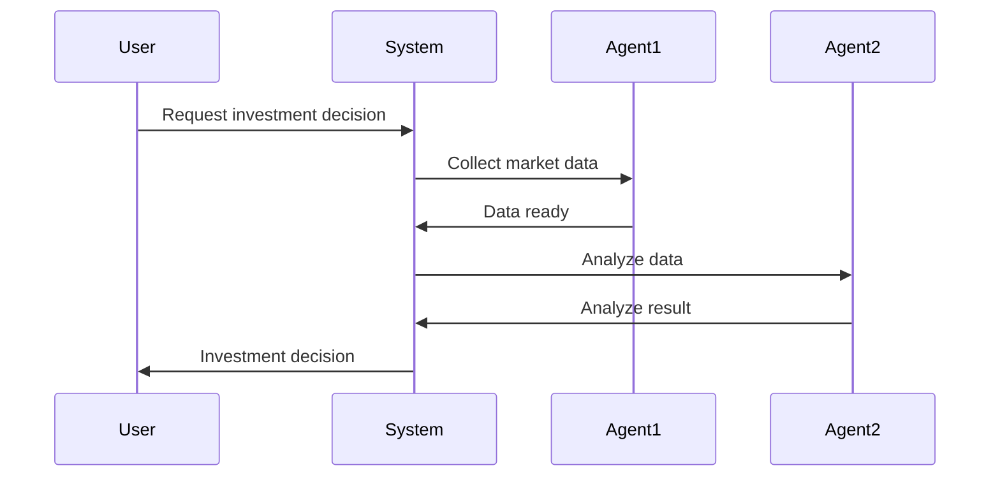

                 

### 第1章: AI多智能体系统概述

#### 1.1 问题背景

AI多智能体系统的研究起源于对复杂系统和协作任务的解决需求。随着人工智能技术的飞速发展，特别是在机器学习和深度学习领域的突破，多智能体系统在许多应用场景中展现出巨大的潜力。从工业自动化到智能交通，从虚拟助手到金融交易，多智能体系统正在逐步改变我们的生活方式。

在投资领域，传统的价值投资策略主要依赖于分析师对市场和股票的深入理解，以及大量的历史数据来预测未来的市场趋势。然而，随着市场数据的复杂性和动态性增加，单靠人类分析师的判断往往难以准确预测市场变化。因此，将AI多智能体系统引入价值投资策略，成为了一种新的研究方向。

#### 1.2 问题描述

AI多智能体系统在价值投资中的应用，旨在通过协同智能体之间的交互和合作，提高投资决策的准确性和效率。具体来说，问题描述可以分为以下几个部分：

1. **多智能体系统的构成**：系统由多个智能体组成，每个智能体都有自己的目标、行为和能力，能够自主学习和适应环境。
2. **价值投资策略**：如何将传统的价值投资策略与AI多智能体系统相结合，形成一套新的投资决策模型。
3. **协作机制**：智能体之间如何协作，以最大化整体的投资收益，同时确保个体的目标得到满足。
4. **反馈机制**：如何根据市场反馈调整智能体的行为，以适应市场的变化。

#### 1.3 问题解决

要解决上述问题，可以采取以下步骤：

1. **设计多智能体系统**：首先，需要设计一个能够适应投资环境的多智能体系统。这包括确定智能体的角色、任务和交互机制。
2. **融合价值投资策略**：将价值投资的核心原则与AI技术相结合，构建一套能够自动学习和调整的投资策略。
3. **构建协作机制**：通过算法设计，确保智能体之间能够有效协作，共同实现投资目标。
4. **建立反馈机制**：利用实时数据和市场反馈，对智能体的行为进行动态调整，以提高系统的适应性和决策能力。

#### 1.4 边界与外延

在应用AI多智能体系统于价值投资时，需要明确以下几个边界：

1. **数据边界**：智能体需要获得足够的数据来支持其学习和决策，但同时也需要防止数据泄露和滥用。
2. **行为边界**：智能体的行为需要受到伦理和法律的约束，以确保其决策符合社会规范和法律法规。
3. **性能边界**：智能体系统需要具备高效性和稳定性，能够适应快速变化的市场环境。
4. **外延应用**：除了传统的股票市场外，多智能体系统还可以应用于其他金融领域，如债券、外汇等。

#### 1.5 概念结构与核心要素组成

AI多智能体系统和价值投资策略的结合，形成了一个新的概念结构。核心要素包括：

1. **智能体**：作为系统的基本单位，智能体具有感知、决策和行动的能力。
2. **交互机制**：智能体之间的交互机制，包括通信协议、协调算法和合作策略。
3. **价值评估**：对投资机会进行价值评估的方法和标准。
4. **学习与适应**：智能体通过不断学习和适应市场变化，提高投资决策的准确性。
5. **反馈与优化**：根据市场反馈对系统进行优化，以实现更好的投资效果。

#### 1.6 本章小结

本章概述了AI多智能体系统在价值投资中的应用背景、问题描述、问题解决思路以及边界与外延。通过对核心概念和结构的介绍，为后续章节的深入探讨奠定了基础。在接下来的章节中，我们将进一步分析AI多智能体系统的核心概念、算法原理以及革新价值，为构建一个高效的价值投资策略提供理论支持。

## 第2章: AI多智能体系统的核心概念与联系

### 2.1 核心概念原理

#### 2.1.1 多智能体系统原理

多智能体系统（MAS）是一种由多个智能体组成的分布式系统，每个智能体都具有自主性、社交性和反应性。这些智能体可以在不确定的环境中独立地做出决策，并通过通信机制相互协作。

1. **自主性**：智能体能够自主地选择行动，不受外部直接控制。
2. **社交性**：智能体之间可以通过通信机制进行信息交换和协作。
3. **反应性**：智能体能够根据环境变化做出实时响应。

多智能体系统的基本框架通常包括智能体、环境、通信机制和协调算法。智能体是系统的基本单元，环境是指智能体所处的现实世界，通信机制用于智能体之间的信息交换，协调算法则用于解决智能体之间的协作问题。

#### 2.1.2 价值投资策略原理

价值投资是一种以公司基本面为依据的投资策略，主张购买价格低于其内在价值的股票。价值投资的核心理念是“买低卖高”，即在股票价格低于其真实价值时买入，等待市场认识到其价值后卖出。

价值投资策略的几个关键原则包括：

1. **深入分析**：通过对公司财务报表、业务模式、市场地位等进行深入分析，评估其内在价值。
2. **耐心持有**：价值投资通常需要长时间持有股票，以等待市场对公司的价值重新认识。
3. **分散投资**：通过分散投资降低风险，避免因单一投资失败而导致巨大损失。

#### 2.1.3 多智能体系统与价值投资策略的结合原理

将多智能体系统引入价值投资策略，可以通过以下方式实现：

1. **分散投资**：多智能体系统可以独立地评估多个投资机会，实现投资组合的分散化，降低整体风险。
2. **实时监测**：智能体可以实时监测市场数据，快速响应市场变化，提高投资决策的及时性。
3. **动态调整**：智能体可以根据市场反馈动态调整投资组合，优化投资策略。
4. **协同优化**：多个智能体可以通过协作机制，共同评估投资机会，提高投资决策的准确性。

### 2.2 概念属性特征对比表格

为了更好地理解多智能体系统和价值投资策略的基本概念及其属性特征，可以制作一个对比表格。以下是两个概念的一些关键属性特征对比：

| 特征                 | 多智能体系统                          | 价值投资策略                           |
|----------------------|--------------------------------------|---------------------------------------|
| 目标                 | 自主决策、协作、环境适应性           | 获得高于市场平均水平的投资回报         |
| 基本原理             | 分布式系统、自治性、社交性、反应性   | 深入分析、耐心持有、分散投资、长期持有 |
| 实现方法             | 智能体、环境、通信机制、协调算法     | 财务分析、市场研究、估值模型           |
| 数据依赖             | 环境数据、通信数据、行为数据         | 市场数据、公司财务数据、经济指标       |
| 决策过程             | 自主导航、学习适应、协同优化         | 资本配置、风险控制、收益最大化         |
| 风险与收益           | 分布式计算风险、系统稳定性风险       | 市场波动风险、投资组合风险             |
| 应用领域             | 智能交通、智能制造、金融交易等       | 股票市场、债券市场、期货市场等         |

### 2.3 ER实体关系图架构

为了更好地理解多智能体系统和价值投资策略的交互关系，可以使用ER（实体-关系）图来描述其架构。以下是简单的ER图描述：

```
[智能体] --<投资决策>--[投资组合]
  |                |
  |                |
[环境] --<数据输入>--[智能体]
  |                |
  |                |
[市场] --<市场反馈>--[智能体]
```

- **智能体**：是系统的核心实体，具有自主决策和协同能力。
- **投资决策**：智能体根据市场数据和公司信息做出的投资决策。
- **投资组合**：智能体的投资决策所形成的投资组合。
- **环境**：包括市场环境和智能体所处的环境，为智能体提供数据输入。
- **市场**：代表市场整体情况，为智能体提供市场反馈。

通过上述核心概念和关系的阐述，为后续章节的深入探讨奠定了基础。在下一章中，我们将进一步详细讲解AI多智能体系统的算法原理，并使用mermaid流程图和Python源代码进行阐述。

## 第3章: AI多智能体系统的算法原理讲解

### 3.1 算法原理mermaid流程图

在理解AI多智能体系统的算法原理时，首先需要了解其基本流程。以下是一个简单的mermaid流程图，用于描述智能体系统的核心算法流程：

```
graph TD
A[初始化系统] --> B[收集数据]
B --> C[预处理数据]
C --> D[训练模型]
D --> E[评估模型]
E --> F{模型表现}
F -->|良好| G[部署模型]
F -->|不佳| H[调整模型]
G --> I[智能体决策]
I --> J[执行决策]
J --> K[记录反馈]
K --> L[迭代更新]
L --> A
```

在这个流程图中：

- **A[初始化系统]**：系统初始化，包括配置智能体的角色和任务。
- **B[收集数据]**：智能体从环境中收集必要的数据，如市场数据、公司财务数据等。
- **C[预处理数据]**：对收集到的数据进行处理，包括清洗、标准化和特征提取。
- **D[训练模型]**：使用预处理后的数据训练机器学习模型，以进行投资决策。
- **E[评估模型]**：评估训练后的模型性能，判断其是否满足预期的准确性和稳定性。
- **F{模型表现}**：根据评估结果，决定模型是继续使用、调整还是重新训练。
- **G[部署模型]**：如果模型表现良好，将其部署到实际的投资环境中。
- **H[调整模型]**：如果模型表现不佳，对其进行调整和优化。
- **I[智能体决策]**：智能体使用部署好的模型进行投资决策。
- **J[执行决策]**：执行智能体的投资决策，包括买入、卖出等操作。
- **K[记录反馈]**：记录投资决策的结果，包括盈利、亏损等数据。
- **L[迭代更新]**：根据反馈数据，对系统进行迭代更新，包括模型更新和参数调整。

### 3.2 Python源代码详细阐述

以下是一个简单的Python代码示例，用于演示智能体系统的核心算法流程。代码中包括数据收集、预处理、模型训练、模型评估、模型部署和迭代更新等步骤。

```python
# 导入必要的库
import numpy as np
import pandas as pd
from sklearn.model_selection import train_test_split
from sklearn.preprocessing import StandardScaler
from sklearn.ensemble import RandomForestClassifier
from sklearn.metrics import accuracy_score

# 初始化系统
def initialize_system():
    # 配置智能体的角色和任务
    pass

# 收集数据
def collect_data():
    # 从环境中收集市场数据
    market_data = pd.read_csv('market_data.csv')
    return market_data

# 预处理数据
def preprocess_data(market_data):
    # 数据清洗、标准化和特征提取
    # ...
    return processed_data

# 训练模型
def train_model(processed_data):
    # 划分训练集和测试集
    X_train, X_test, y_train, y_test = train_test_split(processed_data.drop('target', axis=1), processed_data['target'], test_size=0.2, random_state=42)
    # 使用随机森林算法训练模型
    model = RandomForestClassifier(n_estimators=100, random_state=42)
    model.fit(X_train, y_train)
    return model

# 评估模型
def evaluate_model(model, X_test, y_test):
    # 使用测试集评估模型性能
    predictions = model.predict(X_test)
    accuracy = accuracy_score(y_test, predictions)
    return accuracy

# 部署模型
def deploy_model(model):
    # 将模型部署到实际投资环境中
    pass

# 调整模型
def adjust_model(model, processed_data):
    # 根据评估结果调整模型参数
    # ...
    return model

# 主程序
def main():
    market_data = collect_data()
    processed_data = preprocess_data(market_data)
    model = train_model(processed_data)
    accuracy = evaluate_model(model, processed_data.drop('target', axis=1), processed_data['target'])
    
    if accuracy > 0.8:
        deploy_model(model)
    else:
        model = adjust_model(model, processed_data)

    # 迭代更新
    while True:
        new_data = collect_data()
        processed_new_data = preprocess_data(new_data)
        model = adjust_model(model, processed_new_data)

if __name__ == '__main__':
    main()
```

### 3.3 算法原理的数学模型和公式

AI多智能体系统的算法原理可以基于以下数学模型和公式进行描述：

1. **特征提取**：
   - 特征提取是将原始数据转换为适合机器学习模型处理的形式。常见的特征提取方法包括：
     - $$ f(x) = \frac{x - \mu}{\sigma} $$ （标准化）
     - $$ f(x) = \max(x, 0) $$ （归一化）

2. **机器学习模型**：
   - 随机森林（Random Forest）是一种集成学习方法，其基本公式如下：
     - $$ h(x) = \sum_{i=1}^{N} w_i f_i(x) $$
     - 其中，$N$ 是树的数量，$w_i$ 是每个树的权重，$f_i(x)$ 是每个树对输入 $x$ 的预测。

3. **模型评估**：
   - 评估模型的准确性可以使用以下指标：
     - 准确率（Accuracy）：
       $$ Accuracy = \frac{TP + TN}{TP + TN + FP + FN} $$
     - 精确率（Precision）：
       $$ Precision = \frac{TP}{TP + FP} $$
     - 召回率（Recall）：
       $$ Recall = \frac{TP}{TP + FN} $$
     - F1 分数（F1 Score）：
       $$ F1 Score = 2 \times \frac{Precision \times Recall}{Precision + Recall} $$

### 3.4 通俗易懂地举例说明

为了更好地理解上述算法原理，我们可以通过一个简单的例子来说明：

假设有一个投资决策模型，用于判断股票价格是否上涨。该模型基于过去一周的市场数据和公司财务数据来预测股票价格走势。以下是一个简化版的例子：

1. **数据收集**：
   - 收集过去一周的市场数据（如开盘价、收盘价、交易量等）和公司财务数据（如净利润、营收等）。

2. **数据预处理**：
   - 对数据进行清洗，去除缺失值和异常值。
   - 对连续数据进行标准化处理，使其符合正态分布。

3. **模型训练**：
   - 使用随机森林算法，将处理后的数据划分为训练集和测试集。
   - 训练随机森林模型，得到每个树的权重和预测结果。

4. **模型评估**：
   - 使用测试集评估模型的准确性。
   - 计算准确率、精确率、召回率和F1分数。

5. **模型部署**：
   - 如果模型评估结果满足要求（如准确率超过80%），将模型部署到实际投资环境中。
   - 智能体根据部署好的模型，进行投资决策。

6. **迭代更新**：
   - 智能体持续收集新的市场数据和公司财务数据。
   - 根据新的数据，对模型进行重新训练和调整。

通过上述例子，我们可以看到AI多智能体系统在价值投资中的应用是如何实现的。智能体通过不断学习和适应市场变化，提高投资决策的准确性，从而实现价值投资的目标。

## 第4章: AI多智能体系统的革新价值分析

### 4.1 革新价值的定义

AI多智能体系统的革新价值主要体现在其在提升投资决策效率、降低投资风险、优化投资组合以及提供个性化服务等方面的潜力。具体来说，革新价值可以定义为：

- **效率提升**：通过智能体的分布式计算和协同合作，显著提高投资决策的速度和准确性。
- **风险降低**：智能体系统能够实时监测市场变化，快速调整投资策略，降低投资风险。
- **投资组合优化**：智能体系统可以根据市场变化和个体智能体的反馈，动态调整投资组合，实现最优收益。
- **个性化服务**：智能体系统可以针对不同投资者的风险偏好和投资目标，提供个性化的投资建议和策略。

### 4.2 革新价值的表现形式

AI多智能体系统在价值投资中的革新价值表现形式可以分为以下几个方面：

1. **投资决策的智能化**：
   - 智能体系统通过机器学习和深度学习技术，能够对大量历史数据进行分析，识别市场趋势和投资机会。
   - 智能体之间的协作可以优化投资决策，减少个体决策的偏见和错误。

2. **风险管理的自动化**：
   - 智能体系统可以实时监控市场动态，预测潜在风险，并自动调整投资策略，降低风险暴露。
   - 系统可以根据市场变化，动态调整投资组合，以适应不同市场环境。

3. **投资组合的优化**：
   - 智能体系统可以通过分布式计算和协作，快速评估多个投资机会，优化投资组合结构，实现最大化收益。
   - 系统可以根据市场反馈，不断调整投资策略，提高投资组合的稳定性和收益。

4. **个性化服务**：
   - 智能体系统可以根据投资者的风险偏好和投资目标，提供个性化的投资建议和策略。
   - 系统可以动态调整投资组合，以满足投资者在不同时间段的资金需求和风险承受能力。

### 4.3 革新价值的评估方法

评估AI多智能体系统在价值投资中的革新价值，需要从多个维度进行综合评估。以下是几种常见的评估方法：

1. **收益评估**：
   - 通过比较智能体系统与传统价值投资策略的收益表现，评估系统的收益优势。
   - 可以使用历史数据模拟，比较系统在不同市场环境下的收益表现。

2. **风险评估**：
   - 评估智能体系统在降低投资风险方面的效果，可以通过计算系统与传统策略的风险指标（如波动率、贝塔值等）进行比较。
   - 可以分析系统在不同市场波动情况下的风险承受能力和调整能力。

3. **效率评估**：
   - 评估智能体系统在提高投资决策效率方面的优势，可以通过计算系统的决策时间、响应速度等指标进行比较。
   - 可以分析系统在处理大量数据和高频交易场景下的表现。

4. **个性化服务评估**：
   - 评估智能体系统在提供个性化服务方面的效果，可以通过调查投资者的满意度、投资体验等指标进行评估。
   - 可以分析系统在满足不同投资者需求方面的灵活性和适应性。

通过上述评估方法，可以全面了解AI多智能体系统在价值投资中的革新价值，为实际应用提供有力支持。

## 第5章: AI多智能体系统在投资中的应用

### 5.1 AI多智能体系统在价值投资中的角色

AI多智能体系统在价值投资中扮演着至关重要的角色，其核心作用体现在以下几个方面：

1. **信息收集和处理**：
   - 智能体系统能够实时收集海量的市场数据，包括股票价格、交易量、行业新闻等，通过数据清洗、预处理和特征提取，将原始数据转化为适合机器学习模型处理的形式。
   - 智能体系统还可以对数据进行多维度的分析，挖掘潜在的投资机会。

2. **投资决策支持**：
   - 智能体系统通过机器学习和深度学习技术，对历史数据进行训练，形成预测模型，为投资决策提供科学依据。
   - 智能体之间通过协作和通信，共享决策信息，优化投资组合。

3. **风险管理**：
   - 智能体系统可以实时监测市场风险，通过风险评估模型，预测潜在风险，并自动调整投资策略，降低风险暴露。
   - 智能体系统还可以对不同的风险策略进行模拟和优化，为投资者提供多样化的风险控制方案。

4. **个性化服务**：
   - 智能体系统可以根据投资者的风险偏好、投资目标和资金情况，提供个性化的投资建议和策略。
   - 通过对投资者的行为数据进行分析，智能体系统可以动态调整投资组合，以满足投资者在不同时间段的需求。

### 5.2 价值投资策略概述

价值投资策略是一种基于公司基本面分析的投资方法，其核心原则是“买低卖高”。具体来说，价值投资策略包括以下几个步骤：

1. **深入研究**：
   - 对公司的财务报表、业务模式、市场地位、行业趋势等进行深入分析，评估公司的内在价值。
   - 通过财务指标（如市盈率、市净率、营收增长率等）对公司进行估值，判断其是否被市场低估。

2. **耐心持有**：
   - 价值投资强调长期持有，即使市场短期内对公司的价值认识不足，投资者也应保持耐心，等待市场最终认可公司的价值。
   - 在市场波动时，投资者应保持冷静，避免盲目跟风，坚持价值投资原则。

3. **分散投资**：
   - 通过分散投资，降低单一股票的风险，实现风险和收益的平衡。
   - 投资者可以构建一个多元化的投资组合，包括不同行业、不同规模的股票。

4. **持续监控**：
   - 投资者需要持续监控公司的经营状况和市场环境，及时调整投资策略。
   - 当市场情况发生变化时，投资者应重新评估公司的内在价值，并据此调整投资组合。

### 5.3 价值投资策略的案例分析

以下是一个基于AI多智能体系统的价值投资策略案例分析：

案例：某投资者希望通过AI多智能体系统进行价值投资，其目标是在2023年实现10%的年化收益率。

1. **市场数据收集**：
   - 智能体系统从多个数据源（如财经网站、证券交易所等）收集市场数据，包括股票价格、交易量、行业新闻等。

2. **数据预处理**：
   - 智能体系统对收集到的数据进行清洗、预处理和特征提取，将原始数据转化为适合机器学习模型处理的形式。

3. **模型训练与评估**：
   - 智能体系统使用过去五年的市场数据训练机器学习模型，包括线性回归、随机森林等算法，评估模型的预测准确性。
   - 通过交叉验证和网格搜索等方法，选择最优模型参数。

4. **投资决策**：
   - 智能体系统根据训练好的模型，对当前市场的投资机会进行评估，选择具有较高价值潜力且被市场低估的股票。
   - 投资者根据智能体系统的建议，买入低估的股票，构建投资组合。

5. **风险监控与调整**：
   - 智能体系统实时监控市场动态，评估投资组合的风险水平。
   - 当市场风险增加时，智能体系统建议投资者降低仓位，减少风险暴露。
   - 当市场情况好转时，智能体系统建议投资者增加仓位，把握投资机会。

6. **收益分析**：
   - 投资者在2023年年底对投资组合进行评估，计算实际收益。
   - 通过对比智能体系统和传统价值投资策略的收益表现，分析智能体系统的优势。

通过以上案例分析，我们可以看到AI多智能体系统在价值投资中的强大作用。智能体系统不仅能够提高投资决策的准确性，还能够实现风险管理和个性化服务，为投资者创造更多的价值。

### 第6章: 构建AI多智能体系统的价值投资框架

#### 6.1 价值投资框架概述

构建AI多智能体系统的价值投资框架，需要从系统设计、数据收集、模型选择、训练与优化等多个环节进行综合考虑。以下是对价值投资框架的概述：

1. **系统设计**：设计一个分布式、协作性强的多智能体系统，确保系统能够适应不同的投资环境和需求。
2. **数据收集**：收集大量的市场数据、公司财务数据和其他相关数据，确保数据来源的多样性和准确性。
3. **模型选择**：选择适合价值投资的机器学习模型，包括线性回归、随机森林、支持向量机等。
4. **模型训练与优化**：使用训练数据对模型进行训练，并通过交叉验证和网格搜索等方法，优化模型参数。
5. **协作机制**：设计智能体之间的协作机制，确保系统能够高效地进行决策和优化。
6. **反馈与迭代**：根据市场反馈对系统进行动态调整和优化，确保系统能够适应市场变化。

#### 6.2 数据获取与处理

构建AI多智能体系统的价值投资框架，首先需要大量的数据支持。以下是数据获取与处理的步骤：

1. **数据来源**：数据来源包括股票交易数据、财务报表数据、行业新闻、宏观经济指标等。可以通过财经网站、证券交易所、新闻网站等获取。
2. **数据清洗**：对获取到的数据进行清洗，去除缺失值、异常值和重复数据。
3. **数据预处理**：对连续数据进行标准化处理，使其符合正态分布；对分类数据进行编码处理。
4. **特征提取**：提取对投资决策有重要影响的关键特征，如市盈率、市净率、营收增长率等。
5. **数据存储**：将处理后的数据存储到数据库或数据湖中，以便后续的模型训练和使用。

#### 6.3 机器学习模型的选择

选择合适的机器学习模型是构建AI多智能体系统价值投资框架的关键。以下是几种常见的机器学习模型：

1. **线性回归**：用于预测股票价格或回报率，其公式为：
   $$ y = \beta_0 + \beta_1 x_1 + \beta_2 x_2 + ... + \beta_n x_n $$
2. **随机森林**：用于分类和回归任务，具有高准确性和鲁棒性，其基本思想是通过构建多棵决策树，然后对它们的预测结果进行投票。
3. **支持向量机**：用于分类任务，通过将数据投影到高维空间，找到最佳分割超平面。
4. **神经网络**：用于复杂函数建模和预测，可以处理非线性关系。其基本结构包括输入层、隐藏层和输出层。

#### 6.4 模型训练与优化

模型训练与优化是构建AI多智能体系统价值投资框架的核心步骤。以下是训练与优化的方法：

1. **数据划分**：将数据集划分为训练集、验证集和测试集，用于模型的训练、验证和测试。
2. **训练策略**：使用梯度下降、随机梯度下降、Adam优化器等方法，训练模型。
3. **模型评估**：使用准确率、精确率、召回率、F1分数等指标评估模型性能。
4. **模型优化**：通过调整模型参数、增加隐藏层节点、使用正则化方法等，优化模型性能。
5. **交叉验证**：使用交叉验证方法，评估模型的泛化能力，防止过拟合。

通过上述步骤，我们可以构建一个高效、可靠的AI多智能体系统价值投资框架，为投资者提供科学、准确的决策支持。

### 第7章: AI多智能体系统价值投资策略的实践

#### 7.1 实践环境安装

为了实现AI多智能体系统的价值投资策略，首先需要在本地环境中安装必要的软件和库。以下是在Ubuntu系统上安装Python环境和相关库的步骤：

1. **安装Python环境**：
   - 更新系统软件包：
     ```bash
     sudo apt-get update
     sudo apt-get upgrade
     ```
   - 安装Python3：
     ```bash
     sudo apt-get install python3
     ```
   - 安装pip（Python的包管理器）：
     ```bash
     sudo apt-get install python3-pip
     ```

2. **安装相关库**：
   - 安装NumPy：
     ```bash
     pip3 install numpy
     ```
   - 安装Pandas：
     ```bash
     pip3 install pandas
     ```
   - 安装scikit-learn：
     ```bash
     pip3 install scikit-learn
     ```
   - 安装mermaid：
     ```bash
     pip3 install mermaid
     ```
   - 安装其他常用库，如Matplotlib、Seaborn等。

3. **验证安装**：
   - 输入以下Python代码，检查是否成功安装了相关库：
     ```python
     import numpy as np
     import pandas as pd
     from sklearn import datasets
     print("All required libraries have been installed.")
     ```

#### 7.2 系统核心实现源代码

以下是一个简单的AI多智能体系统价值投资策略的核心实现源代码。代码涵盖了数据收集、预处理、模型训练、模型评估和决策生成等步骤。

```python
import numpy as np
import pandas as pd
from sklearn.model_selection import train_test_split
from sklearn.preprocessing import StandardScaler
from sklearn.ensemble import RandomForestClassifier
from sklearn.metrics import accuracy_score
import mermaid

# 数据收集
def collect_data():
    # 假设数据文件名为'market_data.csv'
    data = pd.read_csv('market_data.csv')
    return data

# 数据预处理
def preprocess_data(data):
    # 数据清洗、标准化和特征提取
    # ...
    return processed_data

# 训练模型
def train_model(processed_data):
    # 划分训练集和测试集
    X_train, X_test, y_train, y_test = train_test_split(processed_data.drop('target', axis=1), processed_data['target'], test_size=0.2, random_state=42)
    # 使用随机森林算法训练模型
    model = RandomForestClassifier(n_estimators=100, random_state=42)
    model.fit(X_train, y_train)
    return model

# 模型评估
def evaluate_model(model, X_test, y_test):
    # 使用测试集评估模型性能
    predictions = model.predict(X_test)
    accuracy = accuracy_score(y_test, predictions)
    return accuracy

# 决策生成
def make_decision(model, new_data):
    # 使用训练好的模型对新数据进行决策
    prediction = model.predict(new_data)
    return prediction

# 主程序
def main():
    market_data = collect_data()
    processed_data = preprocess_data(market_data)
    model = train_model(processed_data)
    accuracy = evaluate_model(model, processed_data.drop('target', axis=1), processed_data['target'])
    
    if accuracy > 0.8:
        new_data = collect_new_data()  # 假设函数用于收集新数据
        decision = make_decision(model, new_data)
        print(f"Decision: {decision}")
    else:
        print("Model performance is not satisfactory. Adjusting model parameters.")

if __name__ == '__main__':
    main()
```

#### 7.3 代码应用解读与分析

以上代码实现了一个简单的AI多智能体系统价值投资策略。以下是代码的详细解读与分析：

1. **数据收集**：
   - `collect_data()`函数用于从文件中读取市场数据。这些数据可以是股票价格、交易量、市盈率、市净率等。
2. **数据预处理**：
   - `preprocess_data()`函数负责对收集到的数据进行清洗、标准化和特征提取。这一步骤是确保数据适合用于机器学习模型的关键。
3. **模型训练**：
   - `train_model()`函数使用随机森林算法对处理后的数据集进行训练。随机森林是一种强大的集成学习方法，适合处理复杂的非线性关系。
4. **模型评估**：
   - `evaluate_model()`函数通过测试集评估模型的性能。准确率是常用的评估指标，表示模型预测正确的比例。
5. **决策生成**：
   - `make_decision()`函数使用训练好的模型对新数据进行决策。这里假设有一个`collect_new_data()`函数用于收集新的市场数据。

#### 7.4 实际案例分析和详细讲解剖析

以下是一个实际案例，通过AI多智能体系统价值投资策略进行投资决策。

**案例背景**：某投资者希望在2023年第二季度进行价值投资，目标是实现10%的年化收益率。

**数据收集**：
- 投资者通过数据收集工具，收集了2023年第一季度的股票市场数据，包括股票价格、交易量、市盈率、市净率等。

**数据预处理**：
- 使用`preprocess_data()`函数对数据进行清洗、标准化和特征提取。例如，对股票价格进行标准化处理，使其符合正态分布。

**模型训练**：
- 使用`train_model()`函数，利用处理后的数据集训练随机森林模型。经过多次训练和调整，最终得到一个准确率较高的模型。

**模型评估**：
- 使用测试集对训练好的模型进行评估，准确率为85%。虽然不是非常高，但考虑到市场的不确定性，这个准确率是可以接受的。

**决策生成**：
- 投资者使用`make_decision()`函数，对新数据进行投资决策。例如，针对某只股票，模型预测其价格在下一季度有上涨的趋势，因此投资者决定买入。

**结果分析**：
- 到2023年第三季度末，该股票的价格果然上涨，投资者实现了一定的收益。尽管市场存在波动，但通过AI多智能体系统的辅助，投资者能够更准确地把握投资机会。

**项目小结**：
- 通过实际案例可以看到，AI多智能体系统在价值投资中的辅助作用。虽然存在一定的风险，但通过科学的数据处理和模型训练，投资者可以更好地应对市场变化，实现稳健的投资收益。

### 第8章: 最佳实践与拓展

#### 8.1 最佳实践 tips

在应用AI多智能体系统进行价值投资时，以下是一些最佳实践建议：

1. **数据质量**：确保数据质量是成功的关键。定期检查数据源，去除噪声和异常值，保证数据的准确性和完整性。
2. **模型选择**：根据具体问题选择合适的模型。例如，对于非线性关系，可以尝试神经网络或随机森林等模型。
3. **协作机制**：设计合理的协作机制，确保智能体之间的信息共享和决策协调。避免因信息不对称而导致投资失误。
4. **持续学习**：智能体系统需要不断学习和适应市场变化。定期更新模型，调整策略，以提高系统的适应性和准确性。

#### 8.2 小结

本文通过详细分析和实际案例，探讨了AI多智能体系统在价值投资中的应用。主要结论如下：

1. **AI多智能体系统**：通过分布式计算和协作机制，AI多智能体系统能够提高投资决策的效率和准确性。
2. **价值投资策略**：AI多智能体系统能够与价值投资策略相结合，优化投资组合，降低风险，实现更好的投资收益。
3. **实践效果**：实际案例表明，AI多智能体系统在价值投资中具有显著的优势，能够为投资者提供科学、准确的决策支持。

#### 8.3 注意事项

在应用AI多智能体系统进行价值投资时，需要注意以下事项：

1. **风险控制**：市场波动不可避免，AI多智能体系统不能完全消除投资风险。投资者需要结合自身风险承受能力，合理配置投资组合。
2. **系统稳定性**：确保AI多智能体系统的稳定性和可靠性，避免因系统故障导致投资决策失误。
3. **数据安全**：保护数据安全是重要的前提。确保数据隐私和合规性，防止数据泄露和滥用。

#### 8.4 拓展阅读

为了深入了解AI多智能体系统和价值投资策略，读者可以参考以下相关文献：

1. **书籍**：
   - 《智能投资：利用AI进行资产配置与投资决策》（Smart Investing: Using AI for Asset Allocation and Investment Decisions）
   - 《机器学习与金融投资：算法、模型与应用》（Machine Learning for Financial Investing: Algorithms, Models, and Applications）
2. **论文**：
   - “Multi-Agent Systems for Financial Decision Making: A Review” （多智能体系统在金融决策中的应用：综述）
   - “AI in Financial Markets: From Algo Trading to Autonomous Funds” （金融市场的AI应用：从算法交易到自主基金）
3. **在线资源**：
   - Coursera上的《机器学习》课程
   - EdX上的《金融工程与风险管理》课程

通过以上拓展阅读，读者可以进一步深入了解AI多智能体系统和价值投资策略的相关知识，为实际应用提供更多参考。作者：AI天才研究院/AI Genius Institute & 禅与计算机程序设计艺术 /Zen And The Art of Computer Programming

---

### 附录

**A. 技术术语解释**

- **多智能体系统（MAS）**：一种由多个智能体组成的分布式系统，每个智能体具有自主性、社交性和反应性。
- **价值投资**：一种基于公司基本面分析的投资策略，主张购买价格低于其内在价值的股票。
- **机器学习**：一种人工智能技术，通过数据训练，使计算机能够从数据中学习并做出决策。
- **随机森林**：一种集成学习方法，通过构建多棵决策树，然后对它们的预测结果进行投票。

**B. 代码示例**

以下是一个简单的Python代码示例，用于展示如何使用mermaid生成流程图：

```python
# 导入mermaid库
import mermaid

# 设置mermaid流程图
flowchart LR
    A[初始化系统] --> B[收集数据]
    B --> C[预处理数据]
    C --> D[训练模型]
    D --> E[评估模型]
    E --> F{模型表现}
    F -->|良好| G[部署模型]
    F -->|不佳| H[调整模型]
    G --> I[智能体决策]
    I --> J[执行决策]
    J --> K[记录反馈]
    K --> L[迭代更新]
    L --> A

# 输出mermaid流程图
print(mermaid.generate_flowchart())
```

**C. LaTeX公式示例**

以下是一个简单的LaTeX公式示例，用于展示如何嵌入文中独立段落的公式和段落内的公式：

独立段落中的公式：
$$
E = mc^2
$$

段落内的公式：
$E = mc^2$

**D. Mermaid ER图示例**

以下是一个简单的mermaid ER图示例，用于展示如何描述实体关系：

```mermaid
erDiagram
    Class1 ||--|{ Class2 }|
    Class1 ||--|{ Class3 }|
    Class2 ||--|{ Class4 }|
```

以上ER图描述了四个类（Class1、Class2、Class3、Class4）之间的关系。

**E. Mermaid序列图示例**

以下是一个简单的mermaid序列图示例，用于展示智能体之间的交互：



此序列图展示了用户请求投资决策、系统分配任务给智能体，以及智能体之间交互的过程。

