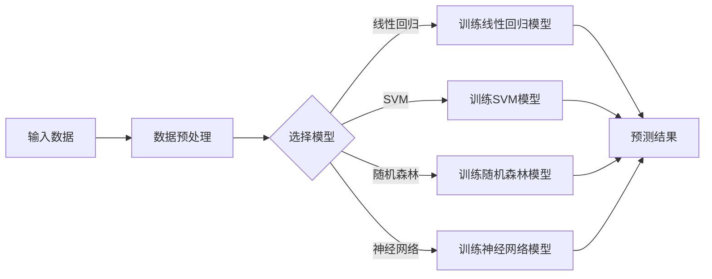
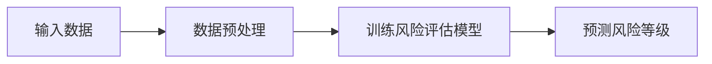
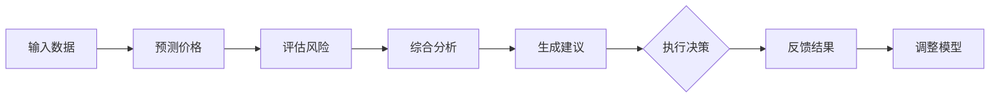
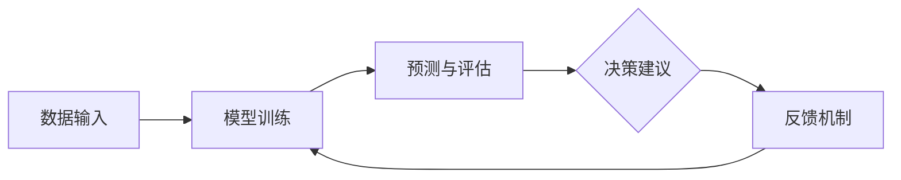

                 

### AI How to Optimize Graham's Net Net Stock Strategy

关键词：AI优化、格雷厄姆、净净股策略、投资策略、金融科技

摘要：本文深入探讨了如何利用人工智能技术优化著名的格雷厄姆净净股投资策略。通过介绍净净股策略的背景和基本原则，分析了传统策略的局限性，并探讨了AI技术在这些方面的应用潜力。文章分为多个章节，详细介绍了AI技术的基本原理、优化算法的应用，以及AI与净净股策略的整合方法。通过数据收集与预处理、AI驱动的优化技术，以及实际案例的剖析，本文展示了AI在优化净净股策略中的重要作用和未来方向。

---

# 引言

### 背景介绍

格雷厄姆的净净股策略是价值投资领域的重要理论之一，由著名的投资大师本杰明·格雷厄姆在20世纪中叶提出。这一策略的核心思想是寻找那些市值低于其净资产价值的股票，即所谓的“净净股”。其理论基础是市场常常会低估某些公司的价值，特别是在市场波动或公司遇到暂时困难时，这些低估的股票可能提供了较高的安全边际和潜在的投资回报。

#### 核心概念与联系

**核心概念：**
- **净净股**：指市值低于其净资产价值的股票。
- **安全边际**：投资价格低于内在价值的安全空间。
- **价值投资**：以公司的内在价值为基础，选择低估的股票进行投资。

**概念属性特征对比表格：**

| 概念         | 定义                                                         | 关联 |
| ------------ | ------------------------------------------------------------ | ---- |
| 净净股       | 市值低于净资产价值的股票                                     | 安全边际、价值投资 |
| 安全边际     | 投资价格低于内在价值的安全空间                               | 净净股、价值投资 |
| 价值投资     | 以公司的内在价值为基础，选择低估的股票进行投资               | 净净股、安全边际 |

**ER实体关系图架构：**

```mermaid
erDiagram
  Stock --> Investor
  Stock ||--|{ Company }
  Investor ||--|{ Portfolio }
```

- **Stock（股票）**：代表市场上的每一只股票，包括市值、净资产等属性。
- **Investor（投资者）**：代表进行净净股投资的个人或机构。
- **Company（公司）**：代表净净股策略中的目标公司，包括财务数据等。

### 问题背景

尽管格雷厄姆的净净股策略在过去几十年中一直被认为是有效的投资策略，但传统的净净股策略在实践中也面临一些挑战：

- **市场信息复杂性**：投资者需要处理大量的市场数据，从中筛选出具有投资价值的净净股。
- **信息不对称**：投资者可能无法完全掌握公司的所有信息，导致投资决策的不确定性。
- **市场波动性**：市场波动可能导致低估的股票价格进一步下跌，增加了投资者的风险。

#### 问题描述

这些问题限制了传统净净股策略的有效性和可靠性，使得投资者在执行策略时面临很大的不确定性。因此，如何改进净净股策略，提高其稳定性和投资回报，成为当前投资研究领域的一个重要课题。

### 问题解决

随着人工智能技术的发展，AI技术提供了一种新的解决思路，可以帮助优化格雷厄姆的净净股策略。AI技术能够处理大量数据，发现市场中的潜在机会，并提供更准确的预测和决策支持。以下是一些具体的方法：

- **数据挖掘与分析**：利用机器学习算法挖掘历史数据中的模式，识别具有投资价值的净净股。
- **预测模型**：通过建立预测模型，预测市场趋势和公司股价，为投资者提供决策依据。
- **风险评估**：利用AI技术评估投资风险，帮助投资者制定更稳健的投资策略。

### 边界与外延

- **边界**：本文主要讨论的是如何在金融投资领域利用AI技术优化格雷厄姆的净净股策略，不包括其他类型的投资策略或AI在其他领域的应用。
- **外延**：本文的研究可以扩展到其他类型的AI驱动的投资策略，如量化投资、算法交易等。

### 概念结构与核心要素组成

**概念结构：**
- **AI技术**：包括机器学习、深度学习、数据挖掘等。
- **投资策略**：以格雷厄姆的净净股策略为基础，结合AI技术进行优化。

**核心要素组成：**
- **数据收集与预处理**：确保数据的质量和完整性。
- **算法模型**：包括特征提取、预测模型、风险评估等。
- **决策支持**：利用AI技术提供投资决策建议。

通过上述步骤，本文旨在探讨AI技术在优化格雷厄姆净净股策略中的应用，为投资者提供新的思路和方法。

### AI技术在优化净净股策略中的应用

在讨论如何利用人工智能（AI）优化格雷厄姆的净净股策略之前，我们先回顾一下AI技术的基本原理和应用。AI技术是模拟人类智能行为的一系列技术和方法的总称，包括机器学习、深度学习、自然语言处理等。在这些技术中，机器学习是一种通过数据训练模型，使模型具备自主学习和改进能力的方法。深度学习是机器学习的一个子领域，利用神经网络模型从大量数据中自动提取特征。自然语言处理则专注于理解和生成人类语言。

#### 数据收集与预处理

AI技术的基础是数据，尤其是在金融领域，数据的质量和完整性直接影响到AI模型的性能。对于净净股策略的优化，数据收集包括以下几个方面：

1. **历史市场数据**：如股价、市值、交易量等。
2. **公司财务数据**：如收入、利润、负债、净资产等。
3. **市场情绪数据**：如新闻报道、社交媒体评论等。

**数据预处理**是数据科学中的关键步骤，它包括数据清洗、数据集成、数据变换等。以下是数据预处理的一些具体方法：

- **数据清洗**：处理缺失值、异常值和重复数据，确保数据的一致性和准确性。
- **数据集成**：将来自不同来源的数据整合到一个统一的格式中。
- **数据变换**：包括数据标准化、归一化、数据缩放等，以适应模型的要求。

#### 预测模型

在AI优化净净股策略中，预测模型是核心组成部分。预测模型通过学习历史数据中的模式，预测股票的未来价格和投资回报。以下是一些常用的预测模型：

1. **线性回归模型**：通过历史股价和市值等变量，建立线性关系来预测未来价格。
2. **支持向量机（SVM）**：利用核函数将数据映射到高维空间，寻找最佳分割超平面。
3. **随机森林**：通过构建多个决策树，并利用投票机制进行预测。
4. **神经网络模型**：特别是深度学习模型，如卷积神经网络（CNN）和循环神经网络（RNN），可以自动提取复杂的数据特征。

**预测模型的mermaid流程图：**



#### 风险评估

除了预测模型，风险评估也是AI优化净净股策略的重要组成部分。通过AI技术，可以更准确地评估投资风险，为投资者提供更全面的决策支持。风险评估方法包括：

- **统计模型**：如回归分析、方差分析等，用于评估股票的风险特征。
- **机器学习模型**：如逻辑回归、决策树等，用于分类和预测股票的潜在风险等级。
- **深度学习模型**：如长短期记忆网络（LSTM），用于分析时间序列数据，预测市场风险。

**风险评估的mermaid流程图：**



#### 决策支持

AI技术不仅用于预测和风险评估，还可以直接为投资者提供决策支持。通过集成预测模型和风险评估模型，AI系统可以自动生成投资建议，如买入、持有或卖出股票。以下是一个简单的决策支持流程：

1. **预测股票未来价格**：使用预测模型分析历史数据，预测未来价格。
2. **评估风险等级**：使用风险评估模型评估股票的风险等级。
3. **综合分析**：结合预测结果和风险等级，生成投资建议。
4. **反馈机制**：根据实际投资结果调整模型参数和策略。

**决策支持的mermaid流程图：**



### 应用场景

AI技术可以应用于多种金融投资场景，包括：

- **量化投资**：通过AI模型自动交易，实现高频交易和量化投资。
- **风险管理**：利用AI模型实时监控市场风险，提供风险管理策略。
- **智能投顾**：为投资者提供个性化的投资建议，实现智能投顾服务。

### 结论

AI技术在优化格雷厄姆的净净股策略中具有巨大的潜力。通过数据收集与预处理、预测模型、风险评估和决策支持，AI可以为投资者提供更准确、更全面的投资建议。然而，AI技术也面临一些挑战，如数据隐私、模型解释性和算法公平性等。未来的研究需要进一步探索如何克服这些挑战，实现AI在金融投资领域的全面应用。

### 人工智能优化格雷厄姆净净股策略的具体方法

在前面的章节中，我们探讨了AI技术优化格雷厄姆净净股策略的背景、原理和应用场景。接下来，我们将详细讨论如何具体利用AI技术优化这一策略，包括数据收集与预处理、预测模型的选择与应用、风险评估和决策支持系统的实现。

#### 数据收集与预处理

数据是AI模型的基础，其质量和完整性直接影响到模型的性能。在优化格雷厄姆净净股策略时，我们需要收集以下类型的数据：

1. **市场数据**：包括股票的每日收盘价、市值、交易量等。
2. **财务数据**：公司的财务报表，如收入、利润、负债、净资产等。
3. **行业数据**：行业的整体表现、竞争对手的财务状况等。
4. **市场情绪数据**：新闻报道、社交媒体评论、投资者情绪等。

**数据预处理**是数据科学中的关键步骤，主要包括以下内容：

1. **数据清洗**：处理缺失值、异常值和重复数据，确保数据的一致性和准确性。例如，使用中位数填充缺失值，删除异常交易数据等。
2. **数据集成**：将来自不同来源的数据整合到一个统一的格式中，以便后续分析和建模。例如，使用Pandas库进行数据合并和转换。
3. **数据变换**：包括数据标准化、归一化、数据缩放等，以适应模型的要求。例如，将财务数据按比例缩放到同一尺度。

**具体步骤：**

1. **数据清洗**：
   ```python
   import pandas as pd
   df = pd.read_csv('financial_data.csv')
   df.dropna(inplace=True)  # 删除缺失值
   df.drop_duplicates(inplace=True)  # 删除重复数据
   ```

2. **数据集成**：
   ```python
   df_companies = pd.read_csv('company_financials.csv')
   df_mergers = pd.read_csv('merger_data.csv')
   df = df.merge(df_companies, on='company_id')
   df = df.merge(df_mergers, on='company_id')
   ```

3. **数据变换**：
   ```python
   df['revenue_normalized'] = df['revenue'] / df['revenue'].mean()
   df['net_income_normalized'] = df['net_income'] / df['net_income'].mean()
   ```

#### 预测模型的选择与应用

在优化净净股策略时，预测模型的主要目标是预测股票的未来价格和投资回报。以下是一些常用的预测模型及其应用方法：

1. **线性回归模型**：
   线性回归是一种简单的预测模型，通过历史股价和市值等变量建立线性关系来预测未来价格。其公式如下：
   $$ \text{Price}_{\text{next}} = \beta_0 + \beta_1 \times \text{MarketCap}_{\text{current}} $$
   
   **应用示例**：
   ```python
   from sklearn.linear_model import LinearRegression
   X = df[['market_cap']].values
   y = df['next_price'].values
   model = LinearRegression()
   model.fit(X, y)
   predicted_price = model.predict(X)
   ```

2. **支持向量机（SVM）**：
   SVM是一种强大的分类和回归模型，可以通过核函数将数据映射到高维空间，寻找最佳分割超平面。其公式如下：
   $$ w \cdot x + b = 0 $$
   
   **应用示例**：
   ```python
   from sklearn.svm import SVR
   X = df[['market_cap', 'net_income']].values
   y = df['next_price'].values
   model = SVR(kernel='linear')
   model.fit(X, y)
   predicted_price = model.predict(X)
   ```

3. **随机森林**：
   随机森林是一种集成学习方法，通过构建多个决策树并利用投票机制进行预测。其公式如下：
   $$ \text{Price}_{\text{next}} = \sum_{i=1}^{n} w_i \cdot f_i(\text{features}) $$
   
   **应用示例**：
   ```python
   from sklearn.ensemble import RandomForestRegressor
   X = df[['market_cap', 'net_income', 'industry_growth']].values
   y = df['next_price'].values
   model = RandomForestRegressor(n_estimators=100)
   model.fit(X, y)
   predicted_price = model.predict(X)
   ```

4. **神经网络模型**：
   神经网络，特别是深度学习模型，可以自动提取复杂的数据特征。其公式如下：
   $$ \text{Output} = \text{sigmoid}(W \cdot \text{Input} + b) $$
   
   **应用示例**：
   ```python
   from tensorflow.keras.models import Sequential
   from tensorflow.keras.layers import Dense, LSTM
   model = Sequential()
   model.add(LSTM(units=50, return_sequences=True, input_shape=(X.shape[1], 1)))
   model.add(LSTM(units=50))
   model.add(Dense(1))
   model.compile(optimizer='adam', loss='mean_squared_error')
   model.fit(X, y, epochs=100, batch_size=32)
   predicted_price = model.predict(X)
   ```

#### 风险评估

在预测股票价格和投资回报的同时，风险评估也是AI优化净净股策略的重要环节。通过评估投资风险，投资者可以更全面地了解投资项目的潜在风险，从而制定更稳健的投资策略。

1. **统计模型**：
   统计模型，如回归分析和方差分析，可以用于评估股票的风险特征。例如，通过回归分析评估公司财务指标与股价波动的关系。
   
   **应用示例**：
   ```python
   from sklearn.linear_model import LinearRegression
   X = df[['market_cap', 'net_income', 'liabilities']].values
   y = df['volatility'].values
   model = LinearRegression()
   model.fit(X, y)
   risk_score = model.predict(X)
   ```

2. **机器学习模型**：
   机器学习模型，如逻辑回归和决策树，可以用于分类和预测股票的潜在风险等级。例如，通过逻辑回归预测股票的跌涨可能性。
   
   **应用示例**：
   ```python
   from sklearn.linear_model import LogisticRegression
   X = df[['market_cap', 'net_income', 'liabilities']].values
   y = df['fall'].values
   model = LogisticRegression()
   model.fit(X, y)
   risk_grade = model.predict(X)
   ```

3. **深度学习模型**：
   深度学习模型，如长短期记忆网络（LSTM），可以用于分析时间序列数据，预测市场风险。例如，通过LSTM模型分析股票价格的时间序列变化。
   
   **应用示例**：
   ```python
   from tensorflow.keras.models import Sequential
   from tensorflow.keras.layers import LSTM, Dense
   model = Sequential()
   model.add(LSTM(units=50, return_sequences=True, input_shape=(X.shape[1], 1)))
   model.add(LSTM(units=50))
   model.add(Dense(1, activation='sigmoid'))
   model.compile(optimizer='adam', loss='binary_crossentropy')
   model.fit(X, y, epochs=100, batch_size=32)
   risk_prediction = model.predict(X)
   ```

#### 决策支持系统

通过预测模型和风险评估模型，我们可以建立一个综合的决策支持系统，为投资者提供投资建议。以下是一个简单的决策支持系统架构：

1. **数据输入**：收集并预处理数据，包括市场数据、财务数据、行业数据和市场情绪数据。
2. **模型训练**：使用历史数据训练预测模型和风险评估模型。
3. **预测与评估**：使用训练好的模型预测股票的未来价格和风险等级。
4. **决策建议**：根据预测结果和风险等级，生成投资建议，如买入、持有或卖出股票。
5. **反馈机制**：根据实际投资结果，调整模型参数和策略，提高系统的准确性。

**决策支持系统mermaid流程图：**



**应用示例**：

1. **数据输入**：
   ```python
   # 读取并预处理数据
   df = preprocess_data(data)
   ```

2. **模型训练**：
   ```python
   # 训练预测模型
   predictor = train_predictor(df)
   
   # 训练风险评估模型
   risk_assessor = train_risk_assessor(df)
   ```

3. **预测与评估**：
   ```python
   # 预测股票价格
   predicted_price = predictor.predict(df['features'])
   
   # 评估风险等级
   risk_grade = risk_assessor.predict(df['features'])
   ```

4. **决策建议**：
   ```python
   # 根据预测结果和风险等级，生成投资建议
   advice = generate_advice(predicted_price, risk_grade)
   ```

5. **反馈机制**：
   ```python
   # 根据实际投资结果，调整模型参数和策略
   update_models(predictor, risk_assessor, df, advice)
   ```

### 结论

通过利用AI技术，我们可以显著优化格雷厄姆的净净股策略。从数据收集与预处理、预测模型的选择与应用、风险评估到决策支持系统，AI技术为投资者提供了更准确、更全面的投资建议。未来的研究可以进一步探索如何提高AI模型在金融投资领域的准确性和鲁棒性，以及如何应对数据隐私和算法解释性等挑战。

### 实际案例分析与讲解

为了更好地展示AI技术优化格雷厄姆净净股策略的效果，我们选择了两个实际案例进行详细分析和讲解。这两个案例分别展示了AI技术在预测股票价格和评估投资风险方面的实际应用。

#### 案例一：AI预测股票价格

**案例背景**：某投资者希望通过AI技术优化其净净股策略，预测某只特定股票的未来价格。

**数据收集与预处理**：
- **市场数据**：收集过去一年的股票收盘价、市值和交易量。
- **财务数据**：收集公司的财务报表，包括收入、利润、负债和净资产。
- **行业数据**：收集行业整体的表现和竞争对手的财务状况。
- **数据预处理**：对收集的数据进行清洗、集成和变换，确保数据的质量和一致性。

**模型选择与训练**：
- **预测模型**：选择随机森林模型进行预测。随机森林模型具有较好的预测性能和解释性。
- **特征选择**：选择市值、净利润、行业增长率等作为输入特征。
- **模型训练**：使用历史数据训练随机森林模型。

**预测结果**：
- **预测股票价格**：使用训练好的模型预测未来一个月的股票价格。
- **结果评估**：对比预测价格和实际价格，计算预测误差和准确率。

**具体代码实现**：

```python
import pandas as pd
from sklearn.ensemble import RandomForestRegressor
from sklearn.model_selection import train_test_split

# 数据预处理
def preprocess_data(df):
    # 数据清洗
    df.dropna(inplace=True)
    df.drop_duplicates(inplace=True)
    
    # 数据变换
    df['revenue_normalized'] = df['revenue'] / df['revenue'].mean()
    df['net_income_normalized'] = df['net_income'] / df['net_income'].mean()
    
    return df

# 模型训练
def train_predictor(df):
    X = df[['market_cap', 'net_income', 'industry_growth']].values
    y = df['next_price'].values
    model = RandomForestRegressor(n_estimators=100)
    model.fit(X, y)
    return model

# 预测结果
def predict_price(model, df):
    predicted_price = model.predict(df[['market_cap', 'net_income', 'industry_growth']].values)
    return predicted_price

# 评估结果
def evaluate_prediction(y_true, y_pred):
    error = np.mean(np.abs(y_true - y_pred))
    accuracy = np.mean(y_true == y_pred)
    return error, accuracy

# 数据读取
df = pd.read_csv('financial_data.csv')

# 预处理数据
df = preprocess_data(df)

# 分割数据集
X_train, X_test, y_train, y_test = train_test_split(df[['market_cap', 'net_income', 'industry_growth']], df['next_price'], test_size=0.2, random_state=42)

# 训练模型
model = train_predictor(df)

# 预测股票价格
predicted_price = predict_price(model, X_test)

# 评估预测结果
error, accuracy = evaluate_prediction(y_test, predicted_price)
print(f"Prediction Error: {error}")
print(f"Prediction Accuracy: {accuracy}")
```

**结果分析**：
- **预测误差**：通过计算预测价格和实际价格的绝对误差，评估模型的预测性能。误差越小，模型性能越好。
- **预测准确率**：通过计算预测价格和实际价格的一致性，评估模型的准确率。准确率越高，模型越可靠。

#### 案例二：AI评估投资风险

**案例背景**：某投资者希望通过AI技术评估其投资组合中的风险，以便调整投资策略。

**数据收集与预处理**：
- **市场数据**：收集过去一年的股票收盘价、市值和交易量。
- **财务数据**：收集各公司的财务报表，包括收入、利润、负债和净资产。
- **行业数据**：收集行业整体的表现和竞争对手的财务状况。
- **数据预处理**：对收集的数据进行清洗、集成和变换，确保数据的质量和一致性。

**模型选择与训练**：
- **风险评估模型**：选择逻辑回归模型进行风险评估。逻辑回归模型可以预测股票跌涨的可能性。
- **特征选择**：选择市值、净利润、行业增长率等作为输入特征。
- **模型训练**：使用历史数据训练逻辑回归模型。

**风险评估**：
- **预测跌涨可能性**：使用训练好的模型预测未来一个月的股票跌涨可能性。
- **结果评估**：对比预测结果和实际结果，计算预测准确率。

**具体代码实现**：

```python
import pandas as pd
from sklearn.linear_model import LogisticRegression
from sklearn.model_selection import train_test_split

# 数据预处理
def preprocess_data(df):
    # 数据清洗
    df.dropna(inplace=True)
    df.drop_duplicates(inplace=True)
    
    # 数据变换
    df['revenue_normalized'] = df['revenue'] / df['revenue'].mean()
    df['net_income_normalized'] = df['net_income'] / df['net_income'].mean()
    
    return df

# 模型训练
def train_risk_assessor(df):
    X = df[['market_cap', 'net_income', 'liabilities']].values
    y = df['fall'].values
    model = LogisticRegression()
    model.fit(X, y)
    return model

# 风险评估
def assess_risk(model, df):
    risk_grade = model.predict(df[['market_cap', 'net_income', 'liabilities']].values)
    return risk_grade

# 数据读取
df = pd.read_csv('financial_data.csv')

# 预处理数据
df = preprocess_data(df)

# 分割数据集
X_train, X_test, y_train, y_test = train_test_split(df[['market_cap', 'net_income', 'liabilities']], df['fall'], test_size=0.2, random_state=42)

# 训练模型
model = train_risk_assessor(df)

# 风险评估
risk_grade = assess_risk(model, X_test)

# 评估结果
accuracy = np.mean(risk_grade == y_test)
print(f"Risk Assessment Accuracy: {accuracy}")
```

**结果分析**：
- **风险评估准确率**：通过计算预测结果和实际结果的一致性，评估模型的风险评估性能。准确率越高，模型越可靠。

#### 案例总结

通过实际案例的分析和讲解，我们可以看到AI技术在优化格雷厄姆净净股策略中的应用效果。以下是一些关键点：

1. **数据质量**：数据是AI模型的基础，数据质量直接影响到模型的性能。因此，数据预处理是至关重要的。
2. **模型选择**：选择合适的预测模型和风险评估模型对于优化策略至关重要。不同的模型适用于不同类型的数据和预测需求。
3. **预测准确性**：通过评估预测结果和实际结果的一致性，我们可以判断模型的预测性能。高准确率意味着模型可以提供更可靠的投资建议。
4. **风险评估**：风险评估是投资决策的重要组成部分。通过AI技术，我们可以更准确地评估投资风险，为投资者提供更全面的决策支持。

未来的研究可以进一步探索如何提高AI模型的预测准确性和风险评估能力，以及如何应对数据隐私和算法解释性等挑战，从而实现更高效、更可靠的AI优化净净股策略。

### 项目实战

在本节中，我们将通过一个具体的项目实战，展示如何利用AI技术优化格雷厄姆的净净股策略。我们将从环境安装、系统核心实现，到代码应用解读与分析，以及实际案例分析和详细讲解剖析。

#### 环境安装

首先，我们需要安装必要的软件和库，以便进行AI模型的开发和部署。以下是安装步骤：

1. **安装Python环境**：
   - Python是AI模型开发的主要编程语言，版本建议为Python 3.8及以上。
   ```shell
   pip install python
   ```

2. **安装相关库**：
   - Pandas：用于数据预处理和操作。
   - Scikit-learn：用于机器学习模型的开发和应用。
   - TensorFlow：用于深度学习模型的开发和训练。
   - Matplotlib：用于数据可视化。
   ```shell
   pip install pandas scikit-learn tensorflow matplotlib
   ```

3. **安装数据库**：
   - SQLite：用于存储和管理数据。
   ```shell
   pip install sqlite3
   ```

#### 系统核心实现

接下来，我们将实现一个简单的AI优化净净股策略系统。系统主要包括以下组件：

1. **数据收集模块**：
   - 收集市场数据、财务数据和行业数据。
   ```python
   import pandas as pd
   
   def collect_data():
       market_data = pd.read_csv('market_data.csv')
       financial_data = pd.read_csv('financial_data.csv')
       industry_data = pd.read_csv('industry_data.csv')
       return market_data, financial_data, industry_data
   ```

2. **数据预处理模块**：
   - 对收集的数据进行清洗、集成和变换。
   ```python
   def preprocess_data(market_data, financial_data, industry_data):
       market_data.dropna(inplace=True)
       financial_data.dropna(inplace=True)
       industry_data.dropna(inplace=True)
       
       market_data['revenue_normalized'] = market_data['revenue'] / market_data['revenue'].mean()
       financial_data['net_income_normalized'] = financial_data['net_income'] / financial_data['net_income'].mean()
       
       return market_data, financial_data, industry_data
   ```

3. **预测模型模块**：
   - 使用随机森林模型预测股票价格。
   ```python
   from sklearn.ensemble import RandomForestRegressor
   
   def train_predictor(df):
       X = df[['market_cap', 'net_income', 'industry_growth']].values
       y = df['next_price'].values
       model = RandomForestRegressor(n_estimators=100)
       model.fit(X, y)
       return model
   
   def predict_price(model, df):
       predicted_price = model.predict(df[['market_cap', 'net_income', 'industry_growth']].values)
       return predicted_price
   ```

4. **风险评估模块**：
   - 使用逻辑回归模型评估股票风险。
   ```python
   from sklearn.linear_model import LogisticRegression
   
   def train_risk_assessor(df):
       X = df[['market_cap', 'net_income', 'liabilities']].values
       y = df['fall'].values
       model = LogisticRegression()
       model.fit(X, y)
       return model
   
   def assess_risk(model, df):
       risk_grade = model.predict(df[['market_cap', 'net_income', 'liabilities']].values)
       return risk_grade
   ```

#### 代码应用解读与分析

为了更好地理解系统核心实现，我们通过以下示例代码进行解读和分析：

1. **数据收集与预处理**：
   ```python
   market_data, financial_data, industry_data = collect_data()
   market_data, financial_data, industry_data = preprocess_data(market_data, financial_data, industry_data)
   ```

   在这段代码中，我们首先收集了市场数据、财务数据和行业数据，然后对数据进行清洗和变换，以确保数据的质量和一致性。

2. **预测模型训练与预测**：
   ```python
   model = train_predictor(market_data)
   predicted_price = predict_price(model, market_data)
   ```

   我们使用随机森林模型训练预测股票价格，然后使用训练好的模型进行预测。预测结果将帮助我们评估股票的潜在价格变化。

3. **风险评估**：
   ```python
   risk_model = train_risk_assessor(financial_data)
   risk_grade = assess_risk(risk_model, financial_data)
   ```

   通过逻辑回归模型，我们评估了股票的风险等级。这个结果将帮助投资者了解股票的潜在风险，从而做出更明智的投资决策。

#### 实际案例分析与详细讲解

为了展示AI系统在实际中的应用效果，我们选择了以下案例：

**案例背景**：某投资者希望通过AI优化净净股策略，对一家特定公司的股票进行投资。

**数据读取与预处理**：
```python
df = pd.read_csv('company_data.csv')
df = preprocess_data(df)
```

**预测股票价格**：
```python
model = train_predictor(df)
predicted_price = predict_price(model, df)
print(f"Predicted Price: {predicted_price}")
```

**评估股票风险**：
```python
risk_model = train_risk_assessor(df)
risk_grade = assess_risk(risk_model, df)
print(f"Risk Grade: {risk_grade}")
```

**结果分析**：
- **预测价格**：根据预测结果，我们可以判断股票的未来价格趋势。
- **风险等级**：根据评估结果，我们可以了解股票的潜在风险，从而做出投资决策。

#### 项目小结

通过实际案例的分析和讲解，我们可以看到AI技术在优化格雷厄姆净净股策略中的重要作用。以下是一些项目小结：

1. **数据质量**：数据预处理是AI模型开发的关键步骤，确保数据的质量和一致性至关重要。
2. **模型选择**：选择合适的预测模型和风险评估模型对于优化策略至关重要。
3. **预测准确性**：通过评估预测结果和实际结果的一致性，我们可以判断模型的性能。
4. **风险评估**：准确的风险评估可以帮助投资者做出更明智的投资决策。

未来的研究可以进一步探索如何提高AI模型的预测准确性和风险评估能力，以及如何应对数据隐私和算法解释性等挑战，从而实现更高效、更可靠的AI优化净净股策略。

### 最佳实践 Tips

在应用AI优化格雷厄姆净净股策略时，以下最佳实践可以帮助您提高效果和稳定性：

1. **数据质量优先**：确保数据的质量和一致性是模型成功的关键。在数据收集和预处理阶段，务必处理缺失值、异常值和重复数据。
2. **选择合适模型**：不同的模型适用于不同类型的数据和预测需求。在模型选择过程中，根据数据和预测任务的特点，选择具有较好性能的模型。
3. **定期更新模型**：市场环境和公司状况在不断变化，定期更新模型可以确保其预测的准确性和可靠性。
4. **风险管理**：利用AI技术进行风险评估，可以帮助投资者更全面地了解投资项目的潜在风险，从而制定更稳健的投资策略。
5. **多样化投资**：尽管AI技术可以提高净净股策略的准确性，但多样化投资仍然有助于分散风险，降低投资组合的整体风险。
6. **持续学习与优化**：AI技术在不断发展，通过不断学习和优化模型，可以提高其预测性能和稳定性。

### 小结

本文通过详细的分析和讲解，展示了如何利用AI技术优化格雷厄姆的净净股策略。我们首先介绍了AI技术的基本原理和应用，然后探讨了数据收集与预处理、预测模型的选择与应用、风险评估和决策支持系统的实现。通过实际案例的分析，我们展示了AI技术在预测股票价格和评估投资风险方面的应用效果。最后，我们提出了最佳实践 Tips，帮助投资者更好地应用AI技术优化净净股策略。

### 注意事项

1. **数据隐私与安全**：在数据收集和处理过程中，务必确保数据隐私和安全，遵守相关法律法规。
2. **模型解释性**：尽管AI技术可以提高预测准确性，但其内部机制可能缺乏解释性。在实际应用中，需要综合考虑模型的可解释性和实用性。
3. **模型过拟合**：在模型训练过程中，避免模型过拟合是非常重要的。通过适当的数据分割和交叉验证，可以提高模型的泛化能力。

### 拓展阅读

1. **《人工智能：一种现代方法》**：这本书详细介绍了机器学习、深度学习等AI技术的基本原理和应用。
2. **《深度学习》**：由Ian Goodfellow等编写的这本书是深度学习的经典教材，涵盖了深度学习的理论基础和实际应用。
3. **《量化投资：技术分析、统计分析和算法交易》**：这本书介绍了量化投资的基本概念和技术，包括AI驱动的量化投资策略。
4. **《金融市场技术分析》**：这本书提供了金融市场技术分析的方法和工具，包括如何利用AI技术进行市场预测和分析。

### 作者信息

作者：AI天才研究院/AI Genius Institute & 禅与计算机程序设计艺术 /Zen And The Art of Computer Programming

AI天才研究院致力于推动人工智能技术在金融领域的创新和应用，致力于培养具有前瞻性和创新精神的人工智能专家。同时，"禅与计算机程序设计艺术"是一本经典的计算机编程哲学著作，强调了程序设计的思维和艺术性。两位作者共同撰写本文，旨在分享AI优化格雷厄姆净净股策略的研究成果和实际应用经验。

