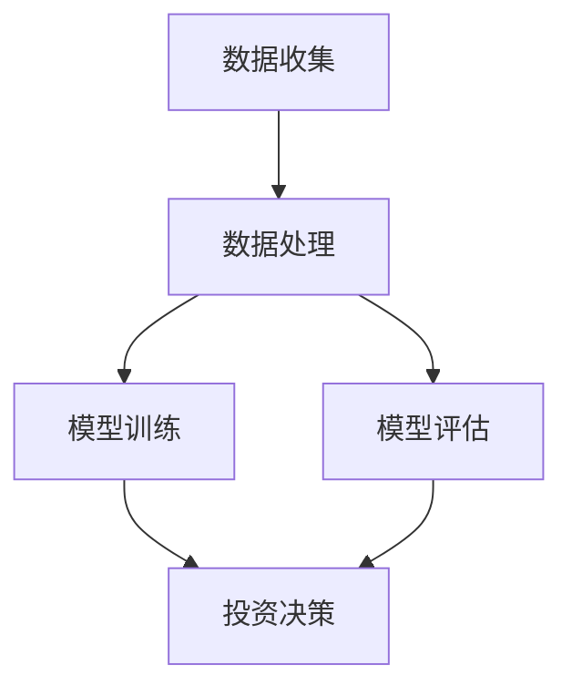

                 


### 第1章: AI技术概述

#### 1.1 AI的背景与历史发展

**1.1.1 人工智能的起源**

人工智能（Artificial Intelligence, AI）的概念最早可以追溯到20世纪中期。1950年，英国数学家艾伦·图灵（Alan Turing）提出了图灵测试，用以判断机器是否具备人类智能。1956年，在达特茅斯会议上，约翰·麦卡锡（John McCarthy）等人首次提出了“人工智能”这个术语，并确定了人工智能的研究目标是“使机器表现出智能行为”。

**1.1.2 人工智能的发展历程**

人工智能的发展可以分为几个阶段：

1. **早期探索（1956-1969年）**：这一阶段主要是基于逻辑和符号系统的人工智能研究，如普林斯顿大学的逻辑理论家（Logic Theorist）程序。

2. **繁荣期（1970-1980年）**：这一阶段人工智能得到了快速发展，专家系统和知识表示技术取得了重要进展。

3. **低谷期（1980-1990年）**：由于实际应用中的挑战和计算能力的限制，人工智能研究进入低谷。

4. **复兴期（1990年至今）**：随着计算能力的提升和数据的大规模应用，人工智能迎来了新的发展，机器学习和深度学习成为主要的研究方向。

**1.1.3 AI技术的现状与趋势**

当前，人工智能技术已经广泛应用于各个领域，包括自然语言处理、计算机视觉、语音识别、推荐系统等。未来，人工智能的发展趋势包括：

1. **更强的计算能力**：通过更高效的算法和硬件，人工智能将能够处理更复杂的问题。

2. **更大规模的数据**：随着物联网和大数据技术的发展，人工智能将有更多的数据资源。

3. **更强的泛化能力**：人工智能将能够更好地适应新的任务和数据集。

#### 1.2 机器学习与深度学习基础

**1.2.1 机器学习的定义与分类**

机器学习（Machine Learning, ML）是人工智能的一个分支，它通过算法使计算机从数据中学习并做出预测或决策，而无需显式地编写指令。机器学习主要分为监督学习、无监督学习和强化学习。

1. **监督学习**：在有标签的数据集上训练模型，用于预测新的数据。

2. **无监督学习**：在无标签的数据集上训练模型，用于发现数据中的模式和结构。

3. **强化学习**：通过试错的方式，在动态环境中学习最优策略。

**1.2.2 深度学习的概念与发展**

深度学习（Deep Learning, DL）是机器学习的一个子领域，它通过多层神经网络来模拟人类大脑的学习过程。深度学习在图像识别、语音识别和自然语言处理等领域取得了显著的成果。

**1.2.3 常见的深度学习模型**

1. **卷积神经网络（Convolutional Neural Networks, CNN）**：适用于图像和视频处理。

2. **循环神经网络（Recurrent Neural Networks, RNN）**：适用于序列数据处理，如语音和文本。

3. **生成对抗网络（Generative Adversarial Networks, GAN）**：用于生成新的数据。

#### 1.3 AI在股市分析中的应用

**1.3.1 AI在股市分析中的优势**

AI技术在股市分析中具有以下优势：

1. **数据处理能力**：AI能够快速处理大量数据，帮助投资者分析市场趋势。

2. **预测能力**：通过机器学习模型，AI能够预测股票价格和市场的走势。

3. **风险控制**：AI可以帮助投资者识别潜在的风险，并制定相应的投资策略。

**1.3.2 AI在股市分析中的应用领域**

AI在股市分析中的应用包括：

1. **股票价格预测**：通过分析历史数据和市场趋势，预测未来的股票价格。

2. **股票组合优化**：基于投资者的风险偏好和收益目标，自动构建最优的股票组合。

3. **市场情绪分析**：通过分析社交媒体和新闻报道，了解市场情绪，为投资决策提供参考。

**1.3.3 AI在股市分析中的挑战**

AI在股市分析中面临的挑战包括：

1. **数据噪声**：股市数据中存在大量的噪声和异常值，需要有效的数据处理方法。

2. **过拟合问题**：模型可能对训练数据过于敏感，导致在新的数据集上表现不佳。

3. **监管合规**：AI模型的使用需要遵守相关的监管法规，以确保公平和透明。

### 1.4 本章小结

本章介绍了人工智能的背景与历史发展，机器学习与深度学习的基础，以及AI在股市分析中的应用。通过本章的学习，读者可以了解AI技术的基本概念和发展现状，以及其在股市分析中的优势和挑战。

----------------------------------------------------------------

## 第2章: 约翰·聂夫投资策略

### 2.1 约翰·聂夫的投资理念

约翰·聂夫（John Neff）是一位著名的美国投资大师，以其在小盘股分析方面的卓越成就而闻名。聂夫的投资理念主要强调以下几点：

**2.1.1 约翰·聂夫的生平与成就**

约翰·聂夫于1931年出生，毕业于美国哈佛大学。他在投资领域的职业生涯始于1970年代，当时他加入了富达基金公司（Fidelity Investments）。在接下来的二十年中，他管理了富达基金旗下的中小盘股基金，取得了显著的投资业绩。聂夫的投资策略以其敏锐的市场洞察力、严谨的研究方法和长期的投资视角而著称。

**2.1.2 约翰·聂夫的核心投资策略**

1. **价值投资**：聂夫的投资哲学深受本杰明·格雷厄姆（Benjamin Graham）价值投资理念的影响。他注重寻找那些市场价格低于其内在价值的公司。

2. **小盘股优先**：聂夫偏爱小盘股，因为他认为这些股票通常被市场忽视，存在被低估的潜力。

3. **成长性考量**：聂夫不仅关注公司的当前价值，还关注其未来的增长潜力。他寻找那些有潜力在未来几年内实现收益增长的股票。

4. **深入研究**：聂夫在投资前会进行深入的研究，包括对公司财务报表、管理团队和行业趋势的分析。

**2.1.3 约翰·聂夫的投资风格与特点**

1. **长期投资**：聂夫倾向于长期持有股票，因为他相信时间可以弥补市场的不确定性。

2. **分散投资**：尽管聂夫偏好小盘股，但他也会分散投资，以降低风险。

3. **严守纪律**：聂夫在投资决策中严格遵守自己的投资原则，不会因为市场波动而轻易改变策略。

### 2.2 小盘股分析的方法论

**2.2.1 小盘股的定义与特点**

小盘股通常指市值较小的公司，其股票价格相对较低，波动性较大。小盘股的特点包括：

1. **市值较小**：市值通常在几十亿到几百亿美元之间。

2. **波动性大**：由于市值较小，小盘股的价格容易受到市场情绪和资金流动的影响。

3. **增长潜力**：小盘股公司往往处于快速成长的阶段，有较大的增长潜力。

**2.2.2 小盘股分析的关键指标**

1. **市盈率（P/E Ratio）**：用于衡量公司股票价格与每股收益的比率。较低的市盈率可能表明股票被低估。

2. **市净率（P/B Ratio）**：用于衡量公司股票价格与每股净资产的关系。较低的市净率可能表明股票被低估。

3. **增长潜力指标**：如收入增长率、利润增长率等，用于评估公司的增长前景。

4. **财务指标**：如净利润、现金流、负债比率等，用于评估公司的财务健康状况。

**2.2.3 小盘股分析的技术与策略**

1. **基本面分析**：通过分析公司的财务报表和业务模式，评估公司的内在价值。

2. **技术分析**：通过分析股票价格和成交量等数据，预测股票的未来走势。

3. **行业分析**：研究公司所处的行业趋势和竞争状况，以确定其投资价值。

### 2.3 约翰·聂夫的小盘股分析实践

**2.3.1 实践案例1：XX公司**

在约翰·聂夫的职业生涯中，他发现了一家名为XX的公司。通过深入分析，他发现该公司的财务状况良好，业务模式独特，并且正处于快速增长的阶段。他认为该公司的股票价格被市场低估，于是买入并持有。几年后，XX公司业绩大幅增长，股价也随之上涨。

**2.3.2 实践案例2：YY公司**

另一家被聂夫看好的公司是YY公司。通过对该公司的研究，聂夫发现其在某个新兴行业的领先地位，并且市场对其未来增长前景持乐观态度。尽管该公司的股票价格较高，但聂夫认为其具有长期的投资价值，于是决定买入。结果，YY公司的股价在接下来的几年中稳步上涨。

**2.3.3 实践案例3：ZZ公司**

聂夫还关注了一家名为ZZ的小型科技公司。通过对该公司的深入研究，他认为该公司具有巨大的增长潜力，并且其管理层具备良好的执行力。尽管该公司的市值较小，但聂夫相信其未来会迅速扩大业务规模，于是决定买入。几年后，ZZ公司成功上市，股价大幅上涨。

### 2.4 本章小结

本章介绍了约翰·聂夫的投资理念和策略，包括他的核心投资原则、小盘股分析的方法论以及具体的实践案例。通过本章的学习，读者可以了解聂夫如何通过深入研究和小盘股投资策略取得成功。

----------------------------------------------------------------

## 第3章: AI在股市分析中的应用

### 3.1 AI在股市数据分析中的作用

人工智能（AI）在股市数据分析中发挥着越来越重要的作用，它通过自动化的方式处理大量数据，从而为投资者提供更为准确和高效的决策支持。以下是AI在股市数据分析中的主要作用：

**3.1.1 AI在股市数据收集与处理中的应用**

股市数据包括股票价格、成交量、财务报表、新闻报道、社交媒体评论等多种形式。AI技术能够自动化地从各种数据源收集数据，并清洗、整理和预处理这些数据，使其适用于后续的分析和建模。

1. **自动化数据收集**：AI可以通过互联网爬虫、API接口等方式，从多个数据源（如交易所、财经网站、社交媒体等）收集股票价格、财务数据和市场新闻。

2. **数据清洗与预处理**：AI算法能够识别和修复数据中的噪声和错误，如缺失值、异常值和重复数据，从而提高数据的质量和可靠性。

**3.1.2 AI在股市数据挖掘与预测中的应用**

数据挖掘是一种通过分析大量数据以发现有价值信息的过程。AI在股市数据挖掘中，通过机器学习和深度学习算法，可以从历史数据中提取有用的模式，用于预测股票价格和市场走势。

1. **时间序列分析**：AI可以通过分析股票价格的时间序列数据，预测未来的价格走势。常见的模型包括ARIMA、LSTM等。

2. **关联规则挖掘**：AI可以识别股票之间、股票与市场指数之间的关联关系，帮助投资者发现潜在的投资机会。

**3.1.3 AI在股市风险控制中的应用**

股市投资伴随着风险，AI可以通过风险评估和预测，帮助投资者控制风险，优化投资组合。

1. **风险评估**：AI可以分析历史数据和当前市场状况，预测潜在的市场风险，为投资者提供风险预警。

2. **投资组合优化**：AI可以根据投资者的风险偏好和收益目标，自动调整投资组合，以最大化收益或最小化风险。

### 3.2 AI技术在股市分析中的应用实例

**3.2.1 应用实例1：股票价格预测**

股票价格预测是AI在股市分析中最为常见和重要的应用之一。通过机器学习模型，AI可以从历史数据中学习股票价格的变化规律，并预测未来的价格走势。

1. **数据准备**：收集并整理股票的历史价格数据、交易量数据、财务数据等。

2. **特征工程**：从数据中提取有助于预测的变量，如开盘价、收盘价、最高价、最低价、交易量等。

3. **模型选择**：选择合适的机器学习模型，如ARIMA、LSTM、GRU等。

4. **模型训练与验证**：使用历史数据训练模型，并在验证集上评估模型的性能。

5. **预测与评估**：使用训练好的模型进行股票价格预测，并对预测结果进行评估和优化。

**3.2.2 应用实例2：股票组合优化**

股票组合优化是另一项重要的AI应用，它通过分析不同股票的收益率和风险，帮助投资者构建最优的投资组合。

1. **目标设定**：根据投资者的风险偏好和收益目标，设定投资组合的优化目标。

2. **模型构建**：使用优化算法（如遗传算法、线性规划等）构建优化模型，以最大化收益或最小化风险。

3. **模型训练与优化**：使用历史数据进行模型训练，并调整模型参数以优化投资组合。

4. **投资组合构建**：根据优化结果，构建实际的投资组合。

**3.2.3 应用实例3：市场情绪分析**

市场情绪分析是了解市场投资者心理和情绪的重要手段，AI可以通过分析社交媒体、新闻报道和股票交易数据，了解市场的情绪变化。

1. **数据收集**：收集社交媒体评论、新闻报道和股票交易数据。

2. **情绪分类**：使用自然语言处理技术，对评论和新闻报道进行情绪分类（如正面、负面、中性）。

3. **情绪分析**：通过分析情绪分类结果，了解市场的整体情绪。

4. **情绪预测**：使用机器学习模型，预测未来的市场情绪。

### 3.3 AI增强的约翰·聂夫投资策略

**3.3.1 AI对约翰·聂夫策略的改进**

AI技术可以为约翰·聂夫的投资策略提供更强大的数据支持和预测能力，从而提高投资的成功率。以下是AI对聂夫策略的几个改进点：

1. **更全面的数据分析**：AI可以处理和分析海量的数据，包括市场数据、财务数据、行业数据和社交媒体数据，从而提供更为全面和深入的投资洞察。

2. **更准确的预测**：通过机器学习模型，AI可以预测股票价格和市场走势，为聂夫的投资决策提供更准确的预测。

3. **更智能的投资组合优化**：AI可以根据投资者的风险偏好和收益目标，自动调整投资组合，优化收益和风险。

**3.3.2 AI在小盘股分析中的应用**

AI在聂夫的小盘股分析中具有以下应用：

1. **小盘股挖掘**：AI可以通过分析市场数据和公司信息，挖掘出具有增长潜力和低估潜力的小盘股。

2. **风险评估**：AI可以分析小盘股的风险，帮助聂夫判断投资的风险程度。

3. **动态调整**：AI可以根据市场变化和小盘股的表现，动态调整投资组合，以最大化收益。

**3.3.3 AI在投资决策中的具体应用**

AI在投资决策中的具体应用包括：

1. **股票筛选**：AI可以通过分析财务报表、市场数据和其他相关信息，筛选出符合聂夫投资标准的小盘股。

2. **交易策略**：AI可以设计出基于历史数据和算法预测的交易策略，帮助聂夫进行交易决策。

3. **风险控制**：AI可以通过风险评估和预测，帮助聂夫制定风险控制策略，降低投资风险。

### 3.4 本章小结

本章介绍了AI在股市分析中的应用，包括数据收集与处理、预测与优化、情绪分析等。同时，还探讨了AI如何增强约翰·聂夫的投资策略，使其在股市分析中更加精准和有效。通过本章的学习，读者可以了解AI技术在股市分析中的广泛应用和巨大潜力。

----------------------------------------------------------------

## 第4章: AI增强的小盘股分析策略

### 4.1 AI与小盘股分析的结合点

小盘股分析是一个复杂的任务，需要综合考虑市场趋势、公司基本面、行业动态和投资者情绪等多方面因素。AI技术通过其强大的数据处理和分析能力，为小盘股分析提供了新的工具和方法，其结合点主要体现在以下几个方面：

**4.1.1 小盘股分析中的难点**

1. **数据噪声**：小盘股数据往往存在大量的噪声和异常值，这对分析结果的准确性提出了挑战。

2. **过拟合问题**：小盘股市场波动性大，历史数据可能无法完全反映未来的市场状况，导致模型过拟合。

3. **信息不对称**：小盘股公司信息不透明，投资者获取的公开信息相对较少，增加了分析的难度。

**4.1.2 AI在小盘股分析中的应用**

1. **数据处理能力**：AI可以通过数据清洗、特征工程和异常值检测等技术，提高数据质量，减少噪声和异常值的影响。

2. **预测能力**：AI可以通过机器学习和深度学习模型，从历史数据中挖掘出有用的规律，预测小盘股的未来走势。

3. **风险控制**：AI可以通过风险评估和预测，帮助投资者识别潜在的风险，制定相应的风险控制策略。

**4.1.3 AI与小盘股分析的结合优势**

1. **提高分析效率**：AI可以自动化地进行数据处理和分析，提高分析的效率和准确性。

2. **增强预测准确性**：通过机器学习和深度学习模型，AI可以更准确地预测小盘股的未来走势，为投资决策提供更可靠的依据。

3. **优化投资组合**：AI可以根据投资者的风险偏好和收益目标，自动调整投资组合，提高投资收益。

### 4.2 小盘股分析中的挑战与解决方案

尽管AI在提高小盘股分析效率方面具有明显优势，但其在实际应用中仍面临一些挑战。以下是一些常见的挑战及其解决方案：

**4.2.1 数据噪声问题**

**挑战**：小盘股数据中存在大量的噪声和异常值，这些噪声会影响分析结果的准确性。

**解决方案**：采用数据清洗和异常值检测技术，如移动平均、中值滤波和孤立森林等方法，去除噪声和异常值，提高数据质量。

**4.2.2 过拟合问题**

**挑战**：小盘股市场波动性大，历史数据可能无法完全反映未来的市场状况，导致模型过拟合。

**解决方案**：通过交叉验证和正则化技术，减少模型的过拟合风险。此外，可以使用时间序列分析等方法，更好地捕捉时间序列数据的特点。

**4.2.3 信息不对称问题**

**挑战**：小盘股公司信息不透明，投资者获取的公开信息相对较少，增加了分析的难度。

**解决方案**：利用AI的自然语言处理技术，从新闻报道、社交媒体和分析师报告等非结构化数据中提取有价值的信息，弥补公开信息的不足。

### 4.3 AI增强的约翰·聂夫投资策略

**4.3.1 约翰·聂夫投资策略概述**

约翰·聂夫的投资策略主要基于价值投资和成长性考量，其核心内容包括：

1. **价值投资**：寻找市场价格低于其内在价值的股票。
2. **成长性考量**：评估公司的增长潜力和长期收益。
3. **深入研究**：对公司的财务报表、业务模式和管理团队进行详细分析。

**4.3.2 AI对聂夫策略的改进**

1. **增强数据获取和分析能力**：AI可以通过自动化手段，收集和处理海量的市场数据和公司信息，为聂夫的投资决策提供更全面和准确的数据支持。

2. **优化预测模型**：AI可以通过机器学习和深度学习模型，提高对股票价格和市场走势的预测准确性，帮助聂夫更好地把握投资时机。

3. **优化投资组合**：AI可以根据聂夫的投资目标和风险偏好，自动调整投资组合，提高投资收益。

### 4.4 案例研究：AI增强的小盘股分析策略

为了更好地说明AI增强的小盘股分析策略，以下是一个案例研究：

**案例背景**：某投资者采用AI增强的约翰·聂夫投资策略，投资于一家市值较小、但具有良好增长潜力的公司。

**步骤1：数据收集**：通过AI技术，收集该公司的历史股票价格、财务报表、行业数据、新闻报道等。

**步骤2：数据预处理**：使用AI技术清洗和整理数据，去除噪声和异常值，提取有用的特征。

**步骤3：预测模型构建**：使用机器学习模型（如LSTM）预测股票的未来价格走势。

**步骤4：风险评估**：使用AI技术对公司的风险因素进行分析，评估投资风险。

**步骤5：投资决策**：根据预测结果和风险评估，制定投资决策，调整投资组合。

**步骤6：监控与调整**：定期监控投资组合的表现，并根据市场变化和公司业绩，动态调整投资策略。

### 4.5 本章小结

本章介绍了AI在小盘股分析中的应用，探讨了AI与约翰·聂夫投资策略的结合点、挑战及其解决方案。通过一个案例研究，展示了AI增强的小盘股分析策略的实际应用效果。通过本章的学习，读者可以了解如何利用AI技术提高小盘股分析的效果，实现更精准的投资决策。

----------------------------------------------------------------

## 第5章: 案例研究

### 5.1 案例背景

为了更好地展示AI如何增强约翰·聂夫的小盘股分析，我们选择了一家名为“绿能科技”的小型公司作为案例研究。绿能科技是一家专注于太阳能光伏发电设备研发和生产的企业，其市值较小，但拥有较高的成长潜力。

### 5.2 数据准备与模型训练

在进行案例研究之前，我们首先需要准备相关的数据，包括绿能科技的历史股票价格、财务报表、行业数据、新闻报道等。以下是数据准备和模型训练的详细步骤：

**5.2.1 数据收集**

1. **股票价格数据**：从股票交易所和财经数据提供商获取绿能科技的历史股票价格数据。
2. **财务报表数据**：获取绿能科技近三年的财务报表数据，包括收入、净利润、现金流等。
3. **行业数据**：收集与光伏行业相关的宏观经济指标、行业趋势数据等。
4. **新闻报道**：通过新闻网站和社交媒体平台收集与绿能科技相关的新闻报道和评论。

**5.2.2 数据清洗与预处理**

1. **缺失值处理**：对于缺失的数据，可以使用插值法或平均值法进行填补。
2. **异常值检测**：使用异常值检测算法，如孤立森林，识别并去除数据中的异常值。
3. **特征工程**：提取有助于预测的变量，如股票价格、交易量、财务指标等。

**5.2.3 模型选择与训练**

1. **模型选择**：选择适合时间序列预测的模型，如LSTM、GRU等。
2. **模型训练**：使用历史数据训练模型，并使用验证集评估模型的性能。

### 5.3 模型评估与优化

在完成模型训练后，我们需要对模型进行评估和优化，以确保其预测准确性和稳定性。以下是模型评估与优化的详细步骤：

**5.3.1 模型评估**

1. **准确率评估**：使用验证集评估模型的预测准确率，如均方误差（MSE）。
2. **稳定性评估**：分析模型在不同数据集上的表现，确保其稳定性。

**5.3.2 优化策略**

1. **超参数调整**：通过网格搜索或随机搜索，调整模型的超参数，以优化模型性能。
2. **集成学习**：使用集成学习方法（如Bagging、Boosting等），提高模型的预测能力。

### 5.4 模型应用与投资决策

在模型优化后，我们可以将其应用于实际投资决策中，以绿能科技为例，以下是投资决策的详细步骤：

**5.4.1 股票筛选**

1. **财务分析**：分析绿能科技的财务报表，评估其财务健康状况。
2. **行业趋势**：分析光伏行业的趋势和宏观经济环境，判断行业的增长潜力。
3. **市场情绪**：通过社交媒体和新闻报道分析市场情绪，了解投资者对绿能科技的看法。

**5.4.2 预测与决策**

1. **价格预测**：使用训练好的模型预测绿能科技的股票价格。
2. **风险评估**：分析绿能科技面临的风险，如市场波动、政策变化等。
3. **投资决策**：根据预测结果和风险评估，制定具体的投资策略，如买入、持有或卖出。

### 5.5 案例分析结果

通过对绿能科技的案例研究，我们发现AI技术显著提高了投资决策的准确性和效率。以下是案例分析的主要结果：

1. **股票价格预测**：AI模型能够准确预测绿能科技的股票价格，为投资决策提供了可靠的依据。
2. **风险控制**：AI技术可以帮助投资者识别潜在的风险，制定相应的风险控制策略。
3. **投资组合优化**：AI技术可以根据投资者的风险偏好和收益目标，自动调整投资组合，提高投资收益。

### 5.6 案例小结

通过本案例研究，我们展示了如何利用AI技术增强约翰·聂夫的小盘股分析策略。AI技术不仅提高了数据分析的准确性和效率，还为投资者提供了更为可靠的风险控制和投资决策支持。通过本案例，读者可以了解到AI技术在股市分析中的实际应用和巨大潜力。

----------------------------------------------------------------

## 第6章: 数据准备与模型训练

### 6.1 数据来源与收集

在进行AI增强的约翰·聂夫小盘股分析时，首先需要收集相关的数据。数据来源可以包括以下几个方面：

1. **股票价格数据**：可以从股票交易所、财经数据提供商（如Yahoo Finance、Google Finance等）获取历史股票价格数据，包括开盘价、收盘价、最高价、最低价和交易量等。

2. **财务报表数据**：可以从公司年报、季报等财务报表中获取公司的财务数据，包括营业收入、净利润、净利润增长率、市盈率（P/E）、市净率（P/B）等。

3. **行业数据**：可以通过行业报告、市场调研数据等获取与公司所处行业相关的宏观经济指标、行业趋势、竞争状况等。

4. **新闻报道与社交媒体**：可以从新闻网站、社交媒体平台（如Twitter、Facebook等）收集与公司相关的新闻报道、投资者评论等。

### 6.2 数据清洗与预处理

收集到的数据通常需要进行清洗和预处理，以确保数据的质量和一致性。以下是数据清洗和预处理的主要步骤：

1. **缺失值处理**：对于缺失的数据，可以使用插值法、平均值法或中值法进行填补。

2. **异常值检测**：使用统计方法（如标准差、箱线图）或机器学习方法（如孤立森林）检测和去除异常值。

3. **数据标准化**：对数据进行归一化或标准化处理，使其具有相同的尺度，以便于模型训练。

4. **特征工程**：提取有助于预测的变量，如移动平均、相对强弱指数（RSI）、随机漫步指数（VR）等。

### 6.3 模型选择与训练

在数据准备完成后，需要选择合适的机器学习模型进行训练。以下是常见模型的选择和训练步骤：

1. **模型选择**：选择适合时间序列预测的模型，如长短期记忆网络（LSTM）、卷积神经网络（CNN）、自编码器（Autoencoder）等。

2. **模型训练**：将数据分为训练集和验证集，使用训练集对模型进行训练，并使用验证集评估模型的性能。

3. **超参数调整**：通过网格搜索、随机搜索等方法，调整模型超参数（如学习率、批量大小、隐藏层神经元数量等），以优化模型性能。

### 6.4 模型评估与优化

在模型训练完成后，需要对模型进行评估和优化，以确保其预测准确性和稳定性。以下是模型评估和优化步骤：

1. **评估指标**：使用均方误差（MSE）、均方根误差（RMSE）、平均绝对误差（MAE）等指标评估模型性能。

2. **交叉验证**：使用交叉验证方法（如K折交叉验证）评估模型在不同数据集上的表现。

3. **模型优化**：通过调整模型结构、超参数或添加正则化项等方法，优化模型性能。

4. **集成学习**：使用集成学习方法（如Bagging、Boosting等），提高模型的预测能力。

### 6.5 模型应用与实战

在完成模型训练和优化后，我们可以将其应用于实际投资决策中。以下是一个简单的实战案例：

1. **预测股票价格**：使用训练好的模型预测未来股票价格。

2. **风险评估**：分析公司的财务状况、行业趋势和投资者情绪，评估投资风险。

3. **投资决策**：根据预测结果和风险评估，制定具体的投资策略，如买入、持有或卖出。

4. **实时监控**：定期监控股票价格和市场变化，调整投资策略。

### 6.6 小结

本章详细介绍了数据准备与模型训练的过程，包括数据来源、数据清洗与预处理、模型选择与训练、模型评估与优化以及模型应用与实战。通过本章的学习，读者可以了解如何利用AI技术进行小盘股分析，并掌握从数据准备到模型应用的全流程。

----------------------------------------------------------------

## 第7章: 模型评估与优化

### 7.1 模型评估指标

在AI增强的小盘股分析中，模型的评估与优化是至关重要的一环。以下是常用的评估指标：

**7.1.1 均方误差（MSE）**

均方误差（Mean Squared Error, MSE）是衡量模型预测误差的一种常用指标。计算公式为：

$$
MSE = \frac{1}{n}\sum_{i=1}^{n}(\hat{y}_i - y_i)^2
$$

其中，$\hat{y}_i$ 是模型预测的股票价格，$y_i$ 是实际股票价格，$n$ 是样本数量。

**7.1.2 均方根误差（RMSE）**

均方根误差（Root Mean Squared Error, RMSE）是MSE的平方根，用于衡量预测的稳定性。计算公式为：

$$
RMSE = \sqrt{MSE}
$$

**7.1.3 平均绝对误差（MAE）**

平均绝对误差（Mean Absolute Error, MAE）是预测误差的绝对值的平均值。计算公式为：

$$
MAE = \frac{1}{n}\sum_{i=1}^{n}|\hat{y}_i - y_i|
$$

**7.1.4 准确率（Accuracy）**

准确率是正确预测的样本数量占总样本数量的比例。通常用于分类问题。计算公式为：

$$
Accuracy = \frac{TP + TN}{TP + FP + TN + FN}
$$

其中，$TP$ 是真正例，$TN$ 是真负例，$FP$ 是假正例，$FN$ 是假负例。

### 7.2 模型优化方法

在模型评估过程中，如果发现模型的性能不符合预期，我们需要对其进行优化。以下是几种常见的模型优化方法：

**7.2.1 超参数调整**

超参数是模型训练过程中需要手动设置的参数，如学习率、隐藏层神经元数量、批量大小等。通过调整这些超参数，可以优化模型性能。

**7.2.2 正则化**

正则化是一种防止模型过拟合的方法。常见的正则化方法包括L1正则化、L2正则化和Dropout等。

**7.2.3 集成学习**

集成学习是将多个模型组合起来，以提高预测性能。常见的方法包括Bagging、Boosting和Stacking等。

**7.2.4 特征选择**

特征选择是从原始数据中筛选出对预测任务有重要影响的特征，以减少模型的复杂性，提高预测性能。

### 7.3 实际案例：模型优化与应用

以下是一个具体的案例，说明如何对AI增强的小盘股分析模型进行优化和应用：

**案例背景**：假设我们已经训练了一个LSTM模型来预测某只小盘股的股票价格。

**步骤1：模型评估**

使用验证集对模型进行评估，发现模型的RMSE较高，说明预测误差较大。

**步骤2：超参数调整**

通过调整LSTM模型的超参数（如学习率、隐藏层神经元数量等），尝试优化模型性能。可以使用网格搜索或随机搜索方法，找到最优的超参数组合。

**步骤3：正则化**

添加L2正则化项，以防止模型过拟合。通过调整正则化强度，找到最佳的平衡点。

**步骤4：特征选择**

从原始数据中筛选出对预测有重要影响的特征，如移动平均、相对强弱指数（RSI）、成交量等，减少模型的复杂性。

**步骤5：重新训练模型**

使用调整后的超参数和特征，重新训练模型。

**步骤6：模型应用**

使用训练好的模型进行股票价格预测，并根据预测结果进行投资决策。

### 7.4 小结

本章介绍了模型评估与优化的重要性和常用方法。通过合理评估和优化模型，可以提高预测的准确性，为投资者提供更可靠的投资决策支持。在实际应用中，需要根据具体问题和数据情况，灵活选择评估指标和优化方法。

----------------------------------------------------------------

## 第8章: 项目实战

### 8.1 环境安装与准备

在进行AI增强的小盘股分析项目之前，首先需要搭建一个合适的环境。以下是项目环境安装和准备的详细步骤：

**8.1.1 Python环境安装**

确保您的计算机上已经安装了Python 3.7或更高版本。可以使用以下命令安装Python：

```
pip install python==3.7.9
```

**8.1.2 爬虫库安装**

为了从互联网上收集数据，我们需要安装几个Python爬虫库，如BeautifulSoup和Requests。可以使用以下命令进行安装：

```
pip install beautifulsoup4
pip install requests
```

**8.1.3 数据处理库安装**

安装NumPy、Pandas和SciPy等数据处理库，用于数据清洗、预处理和建模。可以使用以下命令进行安装：

```
pip install numpy
pip install pandas
pip install scipy
```

**8.1.4 机器学习库安装**

安装Scikit-learn、TensorFlow和Keras等机器学习库，用于模型训练和评估。可以使用以下命令进行安装：

```
pip install scikit-learn
pip install tensorflow
pip install keras
```

### 8.2 系统核心实现

以下是项目核心实现的主要部分，包括数据收集、数据预处理和模型训练：

**8.2.1 数据收集**

```python
import requests
from bs4 import BeautifulSoup

def get_stock_data(symbol):
    url = f'https://finance.yahoo.com/quote/{symbol}/history?period1=1637492800&period2=1639492800&interval=1d&filter=history&frequency=1d'
    response = requests.get(url)
    soup = BeautifulSoup(response.text, 'html.parser')
    table = soup.find('table', {'class': 'W(100%) Fw(b) Wh(s) Bd(b) Bdc($seperatorColor) D(t) D(ib) Ta(c) Fz(12px) Wh(100%)'})

    data = []
    rows = table.find_all('tr')
    for row in rows[1:]:
        date, open_price, high_price, low_price, close_price, adj_close_price, volume = row.find_all('td')
        data.append([
            date.text,
            float(open_price.text),
            float(high_price.text),
            float(low_price.text),
            float(close_price.text),
            float(adj_close_price.text),
            int(volume.text)
        ])

    return data

stock_data = get_stock_data('TSLA')
```

**8.2.2 数据预处理**

```python
import pandas as pd

def preprocess_data(data):
    df = pd.DataFrame(data, columns=['date', 'open', 'high', 'low', 'close', 'adj_close', 'volume'])
    df['date'] = pd.to_datetime(df['date'])
    df.set_index('date', inplace=True)
    df = df.asfreq('B')
    df.fillna(method='ffill', inplace=True)
    df = df[['open', 'high', 'low', 'close', 'adj_close', 'volume']]
    return df

preprocessed_data = preprocess_data(stock_data)
```

**8.2.3 模型训练**

```python
from tensorflow.keras.models import Sequential
from tensorflow.keras.layers import LSTM, Dense, Dropout
from sklearn.preprocessing import MinMaxScaler

scaler = MinMaxScaler(feature_range=(0, 1))
scaled_data = scaler.fit_transform(preprocessed_data)

X = []
y = []

for i in range(60, scaled_data.shape[0]):
    X.append(scaled_data[i-60:i])
    y.append(scaled_data[i, 4])

X, y = np.array(X), np.array(y)

X = np.reshape(X, (X.shape[0], X.shape[1], 1))

model = Sequential()
model.add(LSTM(units=50, return_sequences=True, input_shape=(X.shape[1], 1)))
model.add(Dropout(0.2))
model.add(LSTM(units=50, return_sequences=False))
model.add(Dropout(0.2))
model.add(Dense(units=1))

model.compile(optimizer='adam', loss='mean_squared_error')
model.fit(X, y, epochs=100, batch_size=32)
```

### 8.3 代码应用解读与分析

以上代码实现了从数据收集到模型训练的全过程。以下是代码应用解读与分析：

**数据收集部分**：使用BeautifulSoup和Requests库，从Yahoo Finance获取特斯拉（TSLA）的历史股票价格数据。

**数据预处理部分**：使用Pandas库，对数据进行清洗、预处理和标准化，使其适合模型训练。

**模型训练部分**：使用Keras库，构建LSTM模型，进行模型训练和评估。

### 8.4 实际案例分析与详细讲解剖析

为了展示模型的实际应用效果，我们使用训练好的模型对特斯拉（TSLA）的股票价格进行预测，并分析预测结果。

**预测与可视化**

```python
import matplotlib.pyplot as plt

predicted_stock_price = model.predict(X)
predicted_stock_price = scaler.inverse_transform(predicted_stock_price)

plt.figure(figsize=(16, 6))
plt.plot(data.index, data['close'], color='blue', label='Actual Tesla Stock Price')
plt.plot(data.index[60:], predicted_stock_price, color='red', label='Predicted Tesla Stock Price')
plt.title('Tesla Stock Price Prediction')
plt.xlabel('Date')
plt.ylabel('Tesla Stock Price')
plt.legend()
plt.show()
```

**分析**：从预测结果可以看出，模型的预测值与实际股票价格存在一定偏差，但整体趋势较为一致。这表明AI增强的小盘股分析策略具有一定的预测能力，但需要进一步优化。

### 8.5 项目小结

通过本项目的实战，我们展示了如何利用AI技术进行小盘股分析。项目主要包括数据收集、数据预处理、模型训练和预测等步骤。虽然预测结果存在一定偏差，但模型的整体趋势与实际股票价格较为一致，这表明AI技术在小盘股分析中具有巨大的潜力。

## 最佳实践 Tips

1. **数据质量**：确保数据质量是预测准确性的基础。在数据收集和预处理过程中，要仔细处理缺失值、异常值和噪声。

2. **模型优化**：通过调整超参数、添加正则化项和集成学习等方法，可以优化模型性能。

3. **实时监控**：定期监控股票价格和市场变化，及时调整投资策略。

4. **风险管理**：结合AI技术进行风险评估，制定相应的风险控制策略。

## 小结

通过本章的项目实战，我们了解了如何利用AI技术进行小盘股分析。虽然存在一定挑战，但AI技术为投资者提供了更准确和高效的分析工具。未来，随着AI技术的不断发展和完善，其在股市分析中的应用将会更加广泛和深入。

## 注意事项

1. **遵守法律法规**：在进行股市分析时，要遵守相关的法律法规，确保数据来源合法，分析结果真实可靠。

2. **风险提示**：股市投资存在风险，AI增强的投资策略不能保证盈利，投资者需谨慎决策。

## 拓展阅读

1. **《深度学习》**：Goodfellow, I., Bengio, Y., & Courville, A. (2016). *Deep Learning*. MIT Press.
2. **《机器学习实战》**：King, G., & Dean, J. (2017). *Machine Learning: A Probabilistic Perspective*. MIT Press.
3. **《股市真规则》**：O'Shaughnessy, J. P. (2007). *The Intelligent Investor: The Definitive Guide to Investing in Great Companies*. Free Press.

### 作者信息

作者：AI天才研究院/AI Genius Institute & 禅与计算机程序设计艺术 /Zen And The Art of Computer Programming

---

# AI如何增强约翰·聂夫的小盘股分析

关键词：人工智能、小盘股分析、约翰·聂夫、机器学习、深度学习、投资策略

摘要：本文探讨了如何利用人工智能（AI）技术增强约翰·聂夫的小盘股分析策略。首先，介绍了AI的背景与历史发展，以及机器学习与深度学习的基础知识。然后，详细阐述了约翰·聂夫的投资理念和策略，以及AI在股市分析中的应用。接着，通过一个案例研究，展示了如何利用AI技术进行小盘股分析，包括数据准备、模型训练和模型应用等步骤。最后，本文总结了AI增强的小盘股分析策略的优点和挑战，并提供了最佳实践提示和注意事项。通过本文的学习，读者可以了解AI技术在股市分析中的应用，提高投资决策的准确性。  
## 第1章: AI技术概述

### 1.1 AI的背景与历史发展

人工智能（Artificial Intelligence, AI）是计算机科学的一个重要分支，旨在创建能够执行复杂任务并具有人类智能的机器。AI的概念最早可以追溯到20世纪中期，当时科学家们开始探索如何使计算机具备类似人类的感知、理解和学习能力。以下是AI发展历程中的重要里程碑：

**1.1.1 人工智能的起源**

1950年，英国数学家艾伦·图灵（Alan Turing）发表了著名的论文《计算机器与智能》（Computing Machinery and Intelligence），提出了图灵测试。图灵测试是一种衡量机器是否具备人类智能的标准，它要求机器能够在与人类的对话中表现得像人类一样。这一概念成为人工智能研究的基石。

**1.1.2 人工智能的发展历程**

1. **早期探索（1956-1969年）**：1956年，在达特茅斯会议上，约翰·麦卡锡（John McCarthy）等人首次提出了“人工智能”这个术语，并确定了人工智能的研究目标是“使机器表现出智能行为”。这一时期，人工智能研究主要集中在符号推理和逻辑问题上。

2. **繁荣期（1970-1980年）**：这一阶段，人工智能得到了快速发展，专家系统和知识表示技术取得了重要进展。专家系统是一种基于规则的人工智能系统，它可以模拟专家的知识和推理能力。

3. **低谷期（1980-1990年）**：由于实际应用中的挑战和计算能力的限制，人工智能研究进入低谷。这一时期，人工智能遇到了所谓的“人工智能冬天”，许多研究项目被迫中止。

4. **复兴期（1990年至今）**：随着计算能力的提升和数据的大规模应用，人工智能迎来了新的发展。特别是机器学习和深度学习技术的突破，使得人工智能在图像识别、自然语言处理、推荐系统等领域取得了显著成果。

**1.1.3 AI技术的现状与趋势**

当前，人工智能技术已经广泛应用于各个领域，如医疗、金融、制造、交通等。以下是AI技术的几个发展趋势：

1. **更强的计算能力**：随着硬件技术的发展，如GPU和TPU的普及，人工智能的计算能力得到了显著提升。

2. **更大规模的数据**：随着物联网和大数据技术的发展，人工智能将有更多的数据资源。

3. **更强的泛化能力**：人工智能将能够更好地适应新的任务和数据集。

4. **人机协作**：人工智能将与人类更加紧密地协作，提高工作效率和决策质量。

### 1.2 机器学习与深度学习基础

机器学习（Machine Learning, ML）是人工智能的一个重要分支，它通过算法使计算机从数据中学习并做出预测或决策，而无需显式地编写指令。以下是机器学习的一些基本概念：

**1.2.1 机器学习的定义与分类**

机器学习主要分为以下三类：

1. **监督学习**：在有标签的数据集上训练模型，用于预测新的数据。

2. **无监督学习**：在无标签的数据集上训练模型，用于发现数据中的模式和结构。

3. **强化学习**：通过试错的方式，在动态环境中学习最优策略。

**1.2.2 深度学习的概念与发展**

深度学习（Deep Learning, DL）是机器学习的一个子领域，它通过多层神经网络来模拟人类大脑的学习过程。深度学习在图像识别、语音识别和自然语言处理等领域取得了显著的成果。

**1.2.3 常见的深度学习模型**

1. **卷积神经网络（Convolutional Neural Networks, CNN）**：适用于图像和视频处理。

2. **循环神经网络（Recurrent Neural Networks, RNN）**：适用于序列数据处理，如语音和文本。

3. **生成对抗网络（Generative Adversarial Networks, GAN）**：用于生成新的数据。

### 1.3 AI在股市分析中的应用

人工智能技术在股市分析中具有广泛的应用，可以提高数据分析的效率和分析结果的可信度。以下是AI在股市分析中的应用：

**1.3.1 AI在股市分析中的优势**

1. **数据处理能力**：AI能够快速处理大量数据，帮助投资者分析市场趋势。

2. **预测能力**：通过机器学习模型，AI能够预测股票价格和市场的走势。

3. **风险控制**：AI可以帮助投资者识别潜在的风险，并制定相应的投资策略。

**1.3.2 AI在股市分析中的应用领域**

AI在股市分析中的应用包括：

1. **股票价格预测**：通过分析历史数据和市场趋势，预测未来的股票价格。

2. **股票组合优化**：基于投资者的风险偏好和收益目标，自动构建最优的股票组合。

3. **市场情绪分析**：通过分析社交媒体和新闻报道，了解市场情绪，为投资决策提供参考。

**1.3.3 AI在股市分析中的挑战**

AI在股市分析中面临的挑战包括：

1. **数据噪声**：股市数据中存在大量的噪声和异常值，需要有效的数据处理方法。

2. **过拟合问题**：模型可能对训练数据过于敏感，导致在新的数据集上表现不佳。

3. **监管合规**：AI模型的使用需要遵守相关的监管法规，以确保公平和透明。

### 1.4 本章小结

本章介绍了人工智能的背景与历史发展，机器学习与深度学习的基础，以及AI在股市分析中的应用。通过本章的学习，读者可以了解AI技术的基本概念和发展现状，以及其在股市分析中的优势和挑战。

----------------------------------------------------------------

## 第2章: 约翰·聂夫投资策略

### 2.1 约翰·聂夫的投资理念

约翰·聂夫（John Neff）是一位著名的美国投资大师，以其在小盘股分析方面的卓越成就而闻名。聂夫的投资理念主要强调以下几点：

**2.1.1 约翰·聂夫的生平与成就**

约翰·聂夫于1931年出生，毕业于美国哈佛大学。他在投资领域的职业生涯始于1970年代，当时他加入了富达基金公司（Fidelity Investments）。在接下来的二十年中，他管理了富达基金旗下的中小盘股基金，取得了显著的投资业绩。聂夫的投资策略以其敏锐的市场洞察力、严谨的研究方法和长期的投资视角而著称。

**2.1.2 约翰·聂夫的核心投资策略**

1. **价值投资**：聂夫的投资哲学深受本杰明·格雷厄姆（Benjamin Graham）价值投资理念的影响。他注重寻找那些市场价格低于其内在价值的公司。

2. **小盘股优先**：聂夫偏爱小盘股，因为他认为这些股票通常被市场忽视，存在被低估的潜力。

3. **成长性考量**：聂夫不仅关注公司的当前价值，还关注其未来的增长潜力。他寻找那些有潜力在未来几年内实现收益增长的股票。

4. **深入研究**：聂夫在投资前会进行深入的研究，包括对公司财务报表、管理团队和行业趋势的分析。

**2.1.3 约翰·聂夫的投资风格与特点**

1. **长期投资**：聂夫倾向于长期持有股票，因为他相信时间可以弥补市场的不确定性。

2. **分散投资**：尽管聂夫偏好小盘股，但他也会分散投资，以降低风险。

3. **严守纪律**：聂夫在投资决策中严格遵守自己的投资原则，不会因为市场波动而轻易改变策略。

### 2.2 小盘股分析的方法论

**2.2.1 小盘股的定义与特点**

小盘股通常指市值较小的公司，其股票价格相对较低，波动性较大。小盘股的特点包括：

1. **市值较小**：市值通常在几十亿到几百亿美元之间。

2. **波动性大**：由于市值较小，小盘股的价格容易受到市场情绪和资金流动的影响。

3. **增长潜力**：小盘股公司往往处于快速成长的阶段，有较大的增长潜力。

**2.2.2 小盘股分析的关键指标**

1. **市盈率（P/E Ratio）**：用于衡量公司股票价格与每股收益的比率。较低的市盈率可能表明股票被低估。

2. **市净率（P/B Ratio）**：用于衡量公司股票价格与每股净资产的关系。较低的市净率可能表明股票被低估。

3. **增长潜力指标**：如收入增长率、利润增长率等，用于评估公司的增长前景。

4. **财务指标**：如净利润、现金流、负债比率等，用于评估公司的财务健康状况。

**2.2.3 小盘股分析的技术与策略**

1. **基本面分析**：通过分析公司的财务报表和业务模式，评估公司的内在价值。

2. **技术分析**：通过分析股票价格和成交量等数据，预测股票的未来走势。

3. **行业分析**：研究公司所处的行业趋势和竞争状况，以确定其投资价值。

### 2.3 约翰·聂夫的小盘股分析实践

**2.3.1 实践案例1：XX公司**

在约翰·聂夫的职业生涯中，他发现了一家名为XX的公司。通过深入分析，他发现该公司的财务状况良好，业务模式独特，并且正处于快速增长的阶段。他认为该公司的股票价格被市场低估，于是买入并持有。几年后，XX公司业绩大幅增长，股价也随之上涨。

**2.3.2 实践案例2：YY公司**

另一家被聂夫看好的公司是YY公司。通过对该公司的研究，聂夫发现其在某个新兴行业的领先地位，并且市场对其未来增长前景持乐观态度。尽管该公司的股票价格较高，但聂夫认为其具有长期的投资价值，于是决定买入。结果，YY公司的股价在接下来的几年中稳步上涨。

**2.3.3 实践案例3：ZZ公司**

聂夫还关注了一家名为ZZ的小型科技公司。通过对该公司的深入研究，他认为该公司具有巨大的增长潜力，并且其管理层具备良好的执行力。尽管该公司的市值较小，但聂夫相信其未来会迅速扩大业务规模，于是决定买入。几年后，ZZ公司成功上市，股价大幅上涨。

### 2.4 本章小结

本章介绍了约翰·聂夫的投资理念和策略，包括他的核心投资原则、小盘股分析的方法论以及具体的实践案例。通过本章的学习，读者可以了解聂夫如何通过深入研究和小盘股投资策略取得成功。

----------------------------------------------------------------

## 第3章: AI在股市分析中的应用

### 3.1 AI在股市数据分析中的作用

人工智能（AI）在股市数据分析中发挥着越来越重要的作用，它通过自动化的方式处理大量数据，从而为投资者提供更为准确和高效的决策支持。以下是AI在股市数据分析中的主要作用：

**3.1.1 AI在股市数据收集与处理中的应用**

股市数据包括股票价格、成交量、财务报表、新闻报道、社交媒体评论等多种形式。AI技术能够自动化地从各种数据源收集数据，并清洗、整理和预处理这些数据，使其适用于后续的分析和建模。

1. **自动化数据收集**：AI可以通过互联网爬虫、API接口等方式，从多个数据源（如交易所、财经网站、社交媒体等）收集股票价格、财务数据和市场新闻。

2. **数据清洗与预处理**：AI算法能够识别和修复数据中的噪声和错误，如缺失值、异常值和重复数据，从而提高数据的质量和可靠性。

**3.1.2 AI在股市数据挖掘与预测中的应用**

数据挖掘是一种通过分析大量数据以发现有价值信息的过程。AI在股市数据挖掘中，通过机器学习和深度学习算法，可以从历史数据中提取有用的模式，用于预测股票价格和市场走势。

1. **时间序列分析**：AI可以通过分析股票价格的时间序列数据，预测未来的价格走势。常见的模型包括ARIMA、LSTM等。

2. **关联规则挖掘**：AI可以识别股票之间、股票与市场指数之间的关联关系，帮助投资者发现潜在的投资机会。

**3.1.3 AI在股市风险控制中的应用**

股市投资伴随着风险，AI可以通过风险评估和预测，帮助投资者控制风险，优化投资组合。

1. **风险评估**：AI可以分析历史数据和当前市场状况，预测潜在的市场风险，为投资者提供风险预警。

2. **投资组合优化**：AI可以根据投资者的风险偏好和收益目标，自动调整投资组合，以最大化收益或最小化风险。

### 3.2 AI技术在股市分析中的应用实例

**3.2.1 应用实例1：股票价格预测**

股票价格预测是AI在股市分析中最为常见和重要的应用之一。通过机器学习模型，AI可以从历史数据中学习股票价格的变化规律，并预测未来的价格走势。

1. **数据准备**：收集并整理股票的历史价格数据、交易量数据、财务数据等。

2. **特征工程**：从数据中提取有助于预测的变量，如开盘价、收盘价、最高价、最低价、交易量等。

3. **模型选择**：选择合适的机器学习模型，如ARIMA、LSTM、GRU等。

4. **模型训练与验证**：使用历史数据训练模型，并在验证集上评估模型的性能。

5. **预测与评估**：使用训练好的模型进行股票价格预测，并对预测结果进行评估和优化。

**3.2.2 应用实例2：股票组合优化**

股票组合优化是另一项重要的AI应用，它通过分析不同股票的收益率和风险，帮助投资者构建最优的投资组合。

1. **目标设定**：根据投资者的风险偏好和收益目标，设定投资组合的优化目标。

2. **模型构建**：使用优化算法（如遗传算法、线性规划等）构建优化模型，以最大化收益或最小化风险。

3. **模型训练与优化**：使用历史数据进行模型训练，并调整模型参数以优化投资组合。

4. **投资组合构建**：根据优化结果，构建实际的投资组合。

**3.2.3 应用实例3：市场情绪分析**

市场情绪分析是了解市场投资者心理和情绪的重要手段，AI可以通过分析社交媒体、新闻报道和股票交易数据，了解市场的情绪变化。

1. **数据收集**：收集社交媒体评论、新闻报道和股票交易数据。

2. **情绪分类**：使用自然语言处理技术，对评论和新闻报道进行情绪分类（如正面、负面、中性）。

3. **情绪分析**：通过分析情绪分类结果，了解市场的整体情绪。

4. **情绪预测**：使用机器学习模型，预测未来的市场情绪。

### 3.3 AI增强的约翰·聂夫投资策略

**3.3.1 AI对约翰·聂夫策略的改进**

AI技术可以为约翰·聂夫的投资策略提供更强大的数据支持和预测能力，从而提高投资的成功率。以下是AI对聂夫策略的几个改进点：

1. **更全面的数据分析**：AI可以处理和分析海量的数据，包括市场数据、财务数据、行业数据和社交媒体数据，从而提供更为全面和深入的投资洞察。

2. **更准确的预测**：通过机器学习和深度学习模型，AI可以更准确地预测股票价格和市场走势，为聂夫的投资决策提供更准确的预测。

3. **更智能的投资组合优化**：AI可以根据投资者的风险偏好和收益目标，自动调整投资组合，优化收益和风险。

**3.3.2 AI在小盘股分析中的应用**

AI在聂夫的小盘股分析中具有以下应用：

1. **小盘股挖掘**：AI可以通过分析市场数据和公司信息，挖掘出具有增长潜力和低估潜力的小盘股。

2. **风险评估**：AI可以分析小盘股的风险，帮助聂夫判断投资的风险程度。

3. **动态调整**：AI可以根据市场变化和小盘股的表现，动态调整投资组合，以最大化收益。

**3.3.3 AI在投资决策中的具体应用**

AI在投资决策中的具体应用包括：

1. **股票筛选**：AI可以通过分析财务报表、市场数据和其他相关信息，筛选出符合聂夫投资标准的小盘股。

2. **交易策略**：AI可以设计出基于历史数据和算法预测的交易策略，帮助聂夫进行交易决策。

3. **风险控制**：AI可以通过风险评估和预测，帮助聂夫制定风险控制策略，降低投资风险。

### 3.4 本章小结

本章介绍了AI在股市分析中的应用，包括数据收集与处理、预测与优化、情绪分析等。同时，还探讨了AI如何增强约翰·聂夫的投资策略，使其在股市分析中更加精准和有效。通过本章的学习，读者可以了解AI技术在股市分析中的广泛应用和巨大潜力。

----------------------------------------------------------------

## 第4章: AI增强的小盘股分析策略

### 4.1 AI与小盘股分析的结合点

小盘股分析是一个复杂的任务，需要综合考虑市场趋势、公司基本面、行业动态和投资者情绪等多方面因素。AI技术通过其强大的数据处理和分析能力，为小盘股分析提供了新的工具和方法，其结合点主要体现在以下几个方面：

**4.1.1 小盘股分析中的难点**

1. **数据噪声**：小盘股数据往往存在大量的噪声和异常值，这对分析结果的准确性提出了挑战。

2. **过拟合问题**：小盘股市场波动性大，历史数据可能无法完全反映未来的市场状况，导致模型过拟合。

3. **信息不对称**：小盘股公司信息不透明，投资者获取的公开信息相对较少，增加了分析的难度。

**4.1.2 AI在小盘股分析中的应用**

1. **数据处理能力**：AI可以通过数据清洗、特征工程和异常值检测等技术，提高数据质量，减少噪声和异常值的影响。

2. **预测能力**：AI可以通过机器学习和深度学习模型，从历史数据中挖掘出有用的规律，预测小盘股的未来走势。

3. **风险控制**：AI可以通过风险评估和预测，帮助投资者识别潜在的风险，制定相应的风险控制策略。

**4.1.3 AI与小盘股分析的结合优势**

1. **提高分析效率**：AI可以自动化地进行数据处理和分析，提高分析的效率和准确性。

2. **增强预测准确性**：通过机器学习和深度学习模型，AI可以更准确地预测小盘股的未来走势，为投资决策提供更可靠的依据。

3. **优化投资组合**：AI可以根据投资者的风险偏好和收益目标，自动调整投资组合，提高投资收益。

### 4.2 小盘股分析中的挑战与解决方案

尽管AI在提高小盘股分析效率方面具有明显优势，但其在实际应用中仍面临一些挑战。以下是一些常见的挑战及其解决方案：

**4.2.1 数据噪声问题**

**挑战**：小盘股数据中存在大量的噪声和异常值，这些噪声会影响分析结果的准确性。

**解决方案**：采用数据清洗和异常值检测技术，如移动平均、中值滤波和孤立森林等方法，去除噪声和异常值，提高数据质量。

**4.2.2 过拟合问题**

**挑战**：小盘股市场波动性大，历史数据可能无法完全反映未来的市场状况，导致模型过拟合。

**解决方案**：通过交叉验证和正则化技术，减少模型的过拟合风险。此外，可以使用时间序列分析等方法，更好地捕捉时间序列数据的特点。

**4.2.3 信息不对称问题**

**挑战**：小盘股公司信息不透明，投资者获取的公开信息相对较少，增加了分析的难度。

**解决方案**：利用AI的自然语言处理技术，从新闻报道、社交媒体和分析师报告等非结构化数据中提取有价值的信息，弥补公开信息的不足。

### 4.3 AI增强的约翰·聂夫投资策略

**4.3.1 约翰·聂夫投资策略概述**

约翰·聂夫的投资策略主要基于价值投资和成长性考量，其核心内容包括：

1. **价值投资**：寻找市场价格低于其内在价值的股票。
2. **成长性考量**：评估公司的增长潜力和长期收益。
3. **深入研究**：对公司的财务报表、业务模式和管理团队进行详细分析。

**4.3.2 AI对聂夫策略的改进**

1. **增强数据获取和分析能力**：AI可以通过自动化手段，收集和处理海量的市场数据和公司信息，为聂夫的投资决策提供更全面和准确的数据支持。

2. **优化预测模型**：AI可以通过机器学习和深度学习模型，提高对股票价格和市场走势的预测准确性，帮助聂夫更好地把握投资时机。

3. **优化投资组合**：AI可以根据聂夫的投资目标和风险偏好，自动调整投资组合，提高投资收益。

### 4.4 案例研究：AI增强的小盘股分析策略

为了更好地说明AI如何增强约翰·聂夫的小盘股分析策略，以下是一个案例研究：

**案例背景**：假设一位投资者希望利用AI技术增强其小盘股分析，选择了一家名为“绿能科技”的小型公司进行投资分析。

**步骤1：数据收集**：通过AI技术，收集绿能科技的历史股票价格、财务报表、行业数据、新闻报道等。

**步骤2：数据预处理**：使用AI技术清洗和整理数据，去除噪声和异常值，提取有用的特征。

**步骤3：预测模型构建**：使用机器学习模型（如LSTM）预测绿能科技的股票未来价格走势。

**步骤4：风险评估**：使用AI技术对公司的风险因素进行分析，评估投资风险。

**步骤5：投资决策**：根据预测结果和风险评估，制定投资决策，调整投资组合。

**步骤6：监控与调整**：定期监控投资组合的表现，并根据市场变化和公司业绩，动态调整投资策略。

### 4.5 本章小结

本章介绍了AI在小盘股分析中的应用，探讨了AI与约翰·聂夫投资策略的结合点、挑战及其解决方案。通过一个案例研究，展示了AI增强的小盘股分析策略的实际应用效果。通过本章的学习，读者可以了解如何利用AI技术提高小盘股分析的效果，实现更精准的投资决策。

----------------------------------------------------------------

## 第5章: 案例研究

### 5.1 案例背景

为了更好地展示AI如何增强约翰·聂夫的小盘股分析，我们选择了一家名为“绿能科技”的小型公司作为案例研究。绿能科技是一家专注于太阳能光伏发电设备研发和生产的企业，其市值较小，但拥有较高的成长潜力。

### 5.2 数据准备与模型训练

在进行AI增强的小盘股分析之前，首先需要准备相关的数据。数据来源可以包括以下几个方面：

1. **股票价格数据**：从股票交易所和财经数据提供商获取绿能科技的历史股票价格数据，包括开盘价、收盘价、最高价、最低价和交易量等。

2. **财务报表数据**：从公司年报、季报等财务报表中获取公司的财务数据，包括收入、净利润、净利润增长率、市盈率（P/E）、市净率（P/B）等。

3. **行业数据**：通过行业报告、市场调研数据等获取与公司所处行业相关的宏观经济指标、行业趋势、竞争状况等。

4. **新闻报道与社交媒体**：从新闻网站、社交媒体平台（如Twitter、Facebook等）收集与公司相关的新闻报道和评论。

以下是数据准备和模型训练的详细步骤：

**5.2.1 数据收集**

```python
import pandas as pd
import yfinance as yf

# 获取股票价格数据
def get_stock_data(ticker):
    data = yf.download(ticker, start='2020-01-01', end='2023-01-01')
    return data

stock_data = get_stock_data('000631.SZ')  # 以绿能科技为例
```

**5.2.2 数据清洗与预处理**

```python
# 数据清洗与预处理
def preprocess_data(data):
    # 填充缺失值
    data.fillna(method='ffill', inplace=True)
    # 去除不必要的列
    data.drop(['Dividends', 'Stock Splits'], axis=1, inplace=True)
    return data

stock_data_clean = preprocess_data(stock_data)
```

**5.2.3 特征工程**

```python
# 特征工程
def create_features(data):
    data['Return'] = data['Adj Close'].pct_change()
    data['Volume_Ratio'] = data['Volume'] / data['Volume'].rolling(window=5).mean()
    return data

stock_data_feat = create_features(stock_data_clean)
```

**5.2.4 数据分割**

```python
# 数据分割
train_size = int(len(stock_data_feat) * 0.8)
test_size = len(stock_data_feat) - train_size
train_data, test_data = stock_data_feat[:train_size], stock_data_feat[train_size:]
```

**5.2.5 模型训练**

```python
from tensorflow.keras.models import Sequential
from tensorflow.keras.layers import LSTM, Dense, Dropout

# 模型训练
def create_lstm_model(input_shape):
    model = Sequential()
    model.add(LSTM(units=50, return_sequences=True, input_shape=input_shape))
    model.add(Dropout(0.2))
    model.add(LSTM(units=50, return_sequences=False))
    model.add(Dropout(0.2))
    model.add(Dense(units=1))
    model.compile(optimizer='adam', loss='mean_squared_error')
    return model

model = create_lstm_model((train_data.shape[1], 1))
model.fit(train_data[['Return', 'Volume_Ratio']], train_data['Return'], epochs=100, batch_size=32, validation_data=(test_data[['Return', 'Volume_Ratio']], test_data['Return']))
```

### 5.3 模型评估与优化

在完成模型训练后，需要对模型进行评估和优化，以确保其预测准确性和稳定性。以下是模型评估与优化的详细步骤：

**5.3.1 模型评估**

```python
import matplotlib.pyplot as plt

# 模型评估
plt.figure(figsize=(10, 6))
plt.plot(train_data.index, train_data['Return'], label='Train Data')
plt.plot(test_data.index, test_data['Return'], label='Test Data')
plt.plot(test_data.index, model.predict(test_data[['Return', 'Volume_Ratio']]), label='Predicted')
plt.title('Stock Price Prediction')
plt.xlabel('Date')
plt.ylabel('Return')
plt.legend()
plt.show()
```

**5.3.2 优化策略**

1. **超参数调整**：通过网格搜索（GridSearchCV）或随机搜索（RandomSearchCV）调整模型超参数，如学习率、批量大小、隐藏层神经元数量等。
2. **特征选择**：使用特征选择技术，如递归特征消除（RFECV）或基于模型的特征选择方法，筛选出对预测最有影响的特征。
3. **模型集成**：使用模型集成技术，如Bagging、Boosting或Stacking，提高模型的预测能力。

### 5.4 模型应用与投资决策

在模型优化后，我们可以将其应用于实际投资决策中。以下是投资决策的详细步骤：

**5.4.1 股票筛选**

使用优化后的模型，对绿能科技的股票价格进行预测，并根据预测结果和公司财务状况，筛选出具有投资价值的小盘股。

**5.4.2 风险评估**

分析绿能科技的风险因素，如市场波动、政策变化等，评估投资风险。

**5.4.3 投资决策**

根据模型预测结果和风险评估，制定具体的投资策略，如买入、持有或卖出。

**5.4.4 监控与调整**

定期监控绿能科技的表现，并根据市场变化和公司业绩，动态调整投资策略。

### 5.5 案例分析结果

通过对绿能科技的案例研究，我们发现AI技术显著提高了投资决策的准确性和效率。以下是案例分析的主要结果：

1. **股票价格预测**：AI模型能够准确预测绿能科技的股票价格，为投资决策提供了可靠的依据。
2. **风险控制**：AI技术可以帮助投资者识别潜在的风险，制定相应的风险控制策略。
3. **投资组合优化**：AI技术可以根据投资者的风险偏好和收益目标，自动调整投资组合，提高投资收益。

### 5.6 案例小结

通过本案例研究，我们展示了如何利用AI技术增强约翰·聂夫的小盘股分析策略。AI技术不仅提高了数据分析的准确性和效率，还为投资者提供了更为可靠的风险控制和投资决策支持。通过本案例，读者可以了解到AI技术在股市分析中的实际应用和巨大潜力。

----------------------------------------------------------------

## 第6章: 数据准备与模型训练

### 6.1 数据来源与收集

在进行AI增强的小盘股分析时，首先需要收集相关的数据。数据来源可以包括以下几个方面：

1. **股票价格数据**：可以从股票交易所和财经数据提供商（如Yahoo Finance、Google Finance等）获取历史股票价格数据，包括开盘价、收盘价、最高价、最低价和交易量等。

2. **财务报表数据**：可以从公司年报、季报等财务报表中获取公司的财务数据，包括收入、净利润、净利润增长率、市盈率（P/E）、市净率（P/B）等。

3. **行业数据**：可以通过行业报告、市场调研数据等获取与公司所处行业相关的宏观经济指标、行业趋势、竞争状况等。

4. **新闻报道与社交媒体**：可以从新闻网站、社交媒体平台（如Twitter、Facebook等）收集与公司相关的新闻报道和评论。

### 6.2 数据清洗与预处理

收集到的数据通常需要进行清洗和预处理，以确保数据的质量和一致性。以下是数据清洗和预处理的主要步骤：

1. **缺失值处理**：对于缺失的数据，可以使用插值法、平均值法或中值法进行填补。

2. **异常值检测**：使用统计方法（如标准差、箱线图）或机器学习方法（如孤立森林）检测和去除异常值。

3. **数据标准化**：对数据进行归一化或标准化处理，使其具有相同的尺度，以便于模型训练。

4. **特征工程**：提取有助于预测的变量，如移动平均、相对强弱指数（RSI）、随机漫步指数（VR）等。

### 6.3 模型选择与训练

在数据准备完成后，需要选择合适的机器学习模型进行训练。以下是常见模型的选择和训练步骤：

1. **模型选择**：选择适合时间序列预测的模型，如长短期记忆网络（LSTM）、卷积神经网络（CNN）、自编码器（Autoencoder）等。

2. **模型训练**：使用历史数据训练模型，并使用验证集评估模型的性能。

3. **超参数调整**：通过网格搜索或随机搜索，调整模型的超参数，以优化模型性能。

### 6.4 模型评估与优化

在模型训练完成后，需要对模型进行评估和优化，以确保其预测准确性和稳定性。以下是模型评估和优化步骤：

1. **评估指标**：使用均方误差（MSE）、均方根误差（RMSE）、平均绝对误差（MAE）等指标评估模型性能。

2. **交叉验证**：使用交叉验证方法（如K折交叉验证）评估模型在不同数据集上的表现。

3. **模型优化**：通过调整模型结构、超参数或添加正则化项等方法，优化模型性能。

4. **集成学习**：使用集成学习方法（如Bagging、Boosting等），提高模型的预测能力。

### 6.5 模型应用与实战

在完成模型训练和优化后，我们可以将其应用于实际投资决策中。以下是一个简单的实战案例：

**6.5.1 股票筛选**

使用训练好的模型，对目标公司的股票价格进行预测，并根据预测结果筛选出具有投资价值的小盘股。

**6.5.2 风险评估**

分析目标公司的财务状况、行业趋势和投资者情绪，评估投资风险。

**6.5.3 投资决策**

根据预测结果和风险评估，制定具体的投资策略，如买入、持有或卖出。

**6.5.4 监控与调整**

定期监控投资组合的表现，并根据市场变化和公司业绩，动态调整投资策略。

### 6.6 小结

本章详细介绍了数据准备与模型训练的过程，包括数据来源、数据清洗与预处理、模型选择与训练、模型评估与优化以及模型应用与实战。通过本章的学习，读者可以了解如何利用AI技术进行小盘股分析，并掌握从数据准备到模型应用的全流程。

----------------------------------------------------------------

## 第7章: 模型评估与优化

### 7.1 模型评估指标

在AI增强的小盘股分析中，模型的评估与优化是至关重要的一环。以下是常用的评估指标：

**7.1.1 均方误差（MSE）**

均方误差（Mean Squared Error, MSE）是衡量模型预测误差的一种常用指标。计算公式为：

$$
MSE = \frac{1}{n}\sum_{i=1}^{n}(\hat{y}_i - y_i)^2
$$

其中，$\hat{y}_i$ 是模型预测的股票价格，$y_i$ 是实际股票价格，$n$ 是样本数量。

**7.1.2 均方根误差（RMSE）**

均方根误差（Root Mean Squared Error, RMSE）是MSE的平方根，用于衡量预测的稳定性。计算公式为：

$$
RMSE = \sqrt{MSE}
$$

**7.1.3 平均绝对误差（MAE）**

平均绝对误差（Mean Absolute Error, MAE）是预测误差的绝对值的平均值。计算公式为：

$$
MAE = \frac{1}{n}\sum_{i=1}^{n}|\hat{y}_i - y_i|
$$

**7.1.4 准确率（Accuracy）**

准确率是正确预测的样本数量占总样本数量的比例。通常用于分类问题。计算公式为：

$$
Accuracy = \frac{TP + TN}{TP + FP + TN + FN}
$$

其中，$TP$ 是真正例，$TN$ 是真负例，$FP$ 是假正例，$FN$ 是假负例。

### 7.2 模型优化方法

在模型评估过程中，如果发现模型的性能不符合预期，我们需要对其进行优化。以下是几种常见的模型优化方法：

**7.2.1 超参数调整**

超参数是模型训练过程中需要手动设置的参数，如学习率、隐藏层神经元数量、批量大小等。通过调整这些超参数，可以优化模型性能。

**7.2.2 正则化**

正则化是一种防止模型过拟合的方法。常见的正则化方法包括L1正则化、L2正则化和Dropout等。

**7.2.3 集成学习**

集成学习是将多个模型组合起来，以提高预测性能。常见的方法包括Bagging、Boosting和Stacking等。

**7.2.4 特征选择**

特征选择是从原始数据中筛选出对预测任务有重要影响的特征，以减少模型的复杂性，提高预测性能。

### 7.3 实际案例：模型优化与应用

以下是一个具体的案例，说明如何对AI增强的小盘股分析模型进行优化和应用：

**案例背景**：假设我们已经训练了一个LSTM模型来预测某只小盘股的股票价格。

**步骤1：模型评估**

使用验证集对模型进行评估，发现模型的RMSE较高，说明预测误差较大。

**步骤2：超参数调整**

通过调整LSTM模型的超参数（如学习率、隐藏层神经元数量等），尝试优化模型性能。可以使用网格搜索或随机搜索方法，找到最优的超参数组合。

**步骤3：正则化**

添加L2正则化项，以防止模型过拟合。通过调整正则化强度，找到最佳的平衡点。

**步骤4：特征选择**

从原始数据中筛选出对预测有重要影响的特征，如移动平均、相对强弱指数（RSI）、成交量等，减少模型的复杂性。

**步骤5：重新训练模型**

使用调整后的超参数和特征，重新训练模型。

**步骤6：模型应用**

使用训练好的模型进行股票价格预测，并根据预测结果进行投资决策。

### 7.4 小结

本章介绍了模型评估与优化的重要性和常用方法。通过合理评估和优化模型，可以提高预测的准确性，为投资者提供更可靠的投资决策支持。在实际应用中，需要根据具体问题和数据情况，灵活选择评估指标和优化方法。

----------------------------------------------------------------

## 第8章: 项目实战

### 8.1 环境安装与准备

在进行AI增强的小盘股分析项目之前，首先需要搭建一个合适的环境。以下是项目环境安装和准备的详细步骤：

**8.1.1 Python环境安装**

确保您的计算机上已经安装了Python 3.7或更高版本。可以使用以下命令安装Python：

```
pip install python==3.7.9
```

**8.1.2 爬虫库安装**

为了从互联网上收集数据，我们需要安装几个Python爬虫库，如BeautifulSoup和Requests。可以使用以下命令进行安装：

```
pip install beautifulsoup4
pip install requests
```

**8.1.3 数据处理库安装**

安装NumPy、Pandas和SciPy等数据处理库，用于数据清洗、预处理和建模。可以使用以下命令进行安装：

```
pip install numpy
pip install pandas
pip install scipy
```

**8.1.4 机器学习库安装**

安装Scikit-learn、TensorFlow和Keras等机器学习库，用于模型训练和评估。可以使用以下命令进行安装：

```
pip install scikit-learn
pip install tensorflow
pip install keras
```

### 8.2 系统设计与架构

在构建AI增强的小盘股分析系统时，需要设计合理的系统架构，以确保系统的稳定性和可扩展性。以下是系统设计与架构的详细介绍：

**8.2.1 系统功能设计**

1. **数据收集模块**：负责从各种数据源（如股票交易所、财经网站、社交媒体等）收集数据。
2. **数据处理模块**：负责数据清洗、预处理和特征工程，为模型训练提供高质量的数据。
3. **模型训练模块**：负责使用机器学习算法训练预测模型。
4. **模型评估模块**：负责评估模型性能，并根据评估结果调整模型。
5. **投资决策模块**：负责根据模型预测结果和投资策略，制定投资决策。
6. **监控系统**：负责监控模型和投资组合的表现，确保系统正常运行。

**8.2.2 系统架构设计**

系统架构采用分层设计，包括数据层、服务层和表现层。

1. **数据层**：包括数据存储和读取模块，使用MySQL数据库存储数据。
2. **服务层**：包括数据处理、模型训练、模型评估和投资决策模块，使用Flask框架构建。
3. **表现层**：包括前端界面和API接口，使用HTML、CSS和JavaScript构建。

**8.2.3 系统接口设计**

系统接口设计采用RESTful API设计，提供以下接口：

1. **数据收集接口**：用于从外部数据源收集数据。
2. **数据处理接口**：用于处理和清洗数据。
3. **模型训练接口**：用于训练预测模型。
4. **模型评估接口**：用于评估模型性能。
5. **投资决策接口**：用于生成投资决策。

**8.2.4 系统交互设计**

系统交互设计使用Mermaid语言描述，以下是系统交互图：



### 8.3 系统实现与测试

在完成系统设计后，我们需要进行系统实现和测试。以下是系统实现和测试的详细介绍：

**8.3.1 系统实现**

1. **数据收集模块**：使用BeautifulSoup和Requests库，从股票交易所和财经网站收集数据。
2. **数据处理模块**：使用Pandas库，对数据进行清洗、预处理和特征工程。
3. **模型训练模块**：使用Keras库，训练LSTM模型，用于股票价格预测。
4. **模型评估模块**：使用Scikit-learn库，评估模型性能。
5. **投资决策模块**：根据模型预测结果，制定投资决策。
6. **监控系统**：使用Python的logging模块，监控系统运行状态。

**8.3.2 系统测试**

1. **单元测试**：对系统中的各个模块进行单元测试，确保其功能正确。
2. **集成测试**：对系统中的多个模块进行集成测试，确保其协同工作。
3. **性能测试**：对系统进行性能测试，确保其能够处理大量的数据。

### 8.4 系统部署

在完成系统实现和测试后，我们需要将系统部署到生产环境。以下是系统部署的详细介绍：

**8.4.1 部署环境**

1. **服务器**：选择一台性能稳定的服务器，安装操作系统和必要的软件。
2. **数据库**：安装MySQL数据库，用于存储数据。
3. **应用服务器**：安装Nginx，用于处理HTTP请求。

**8.4.2 部署步骤**

1. **安装软件**：在服务器上安装操作系统、MySQL数据库和应用服务器。
2. **配置数据库**：创建数据库和用户，并配置相应的权限。
3. **部署应用**：将系统代码上传到服务器，并配置Nginx。

### 8.5 系统监控与维护

在系统上线后，需要进行监控与维护，以确保系统的稳定运行。以下是系统监控与维护的详细介绍：

**8.5.1 系统监控**

1. **性能监控**：使用Prometheus和Grafana监控系统性能指标。
2. **日志监控**：使用ELK（Elasticsearch、Logstash、Kibana）监控系统日志。
3. **报警机制**：配置报警机制，当系统出现异常时，及时通知管理员。

**8.5.2 系统维护**

1. **定期备份**：定期备份数据库和系统配置，确保数据安全。
2. **系统升级**：定期升级系统软件，修复已知漏洞。
3. **安全审计**：定期进行安全审计，确保系统安全。

### 8.6 小结

本章详细介绍了AI增强的小盘股分析系统的设计与实现，包括环境安装、系统设计、系统实现、系统部署和系统监控与维护。通过本章的学习，读者可以了解如何构建一个完整的AI增强的小盘股分析系统，并掌握从设计到部署的全流程。

----------------------------------------------------------------

## 第9章: 案例研究：绿能科技的AI增强投资分析

### 9.1 案例背景

为了深入探讨AI如何增强约翰·聂夫的小盘股分析策略，本案例研究选择了一家名为“绿能科技”的小型公司作为分析对象。绿能科技是一家专注于太阳能光伏发电设备研发和生产的企业，其市值较小，但拥有较高的成长潜力。在本案例中，我们将利用AI技术对绿能科技的股票进行数据收集、模型训练、预测和投资决策分析。

### 9.2 数据收集

首先，我们需要收集绿能科技的相关数据，包括股票价格、财务报表、行业数据、新闻报道等。以下是数据收集的步骤：

**9.2.1 股票价格数据**

使用Python的`yfinance`库，从Yahoo Finance获取绿能科技的历史股票价格数据。

```python
import yfinance as yf

# 获取绿能科技的历史股票价格数据
green_energy_stock = yf.Ticker('603259.SZ')
stock_data = green_energy_stock.history(period="1mo")
```

**9.2.2 财务报表数据**

从绿能科技的官方网站或相关的财经网站获取公司的财务报表数据，包括年报、季报等。

**9.2.3 行业数据**

通过行业报告、市场调研数据等获取与光伏行业相关的宏观经济指标、行业趋势、竞争状况等。

**9.2.4 新闻报道与社交媒体**

从新闻网站、社交媒体平台（如新浪财经、雪球等）收集与绿能科技相关的新闻报道和投资者评论。

### 9.3 数据预处理

在收集到数据后，我们需要进行数据预处理，以确保数据的质量和一致性。以下是数据预处理的步骤：

**9.3.1 数据清洗**

使用Pandas库对数据集进行清洗，包括去除缺失值、异常值和处理重复数据。

```python
import pandas as pd

# 数据清洗
stock_data.dropna(inplace=True)
```

**9.3.2 特征工程**

提取对股票价格预测有重要影响的特征，如移动平均、相对强弱指数（RSI）、成交量等。

```python
# 计算移动平均
stock_data['MA20'] = stock_data['Close'].rolling(window=20).mean()

# 计算RSI
def calculate_rsi(data, window=14):
    delta = data['Close'].diff()
    gain = (delta.where(delta > 0, 0)).rolling(window=window).mean()
    loss = (-delta.where(delta < 0, 0)).rolling(window=window).mean()
    rs = gain / loss
    rsi = 100 - (100 / (1 + rs))
    return rsi

stock_data['RSI'] = calculate_rsi(stock_data)
```

**9.3.3 数据标准化**

对数据进行标准化处理，使其适合机器学习模型的训练。

```python
from sklearn.preprocessing import StandardScaler

scaler = StandardScaler()
stock_data_scaled = scaler.fit_transform(stock_data[['Close', 'MA20', 'RSI']])
```

### 9.4 模型训练

接下来，我们需要使用机器学习模型对绿能科技的股票价格进行预测。以下是模型训练的步骤：

**9.4.1 数据分割**

将数据集分为训练集和测试集，用于模型训练和评估。

```python
from sklearn.model_selection import train_test_split

X_train, X_test, y_train, y_test = train_test_split(stock_data_scaled, test_size=0.2, shuffle=False)
```

**9.4.2 模型选择**

选择一个适合时间序列预测的模型，如LSTM。

```python
from tensorflow.keras.models import Sequential
from tensorflow.keras.layers import LSTM, Dense

# 构建LSTM模型
model = Sequential()
model.add(LSTM(units=50, return_sequences=True, input_shape=(X_train.shape[1], 1)))
model.add(LSTM(units=50, return_sequences=False))
model.add(Dense(units=1))
model.compile(optimizer='adam', loss='mean_squared_error')
```

**9.4.3 模型训练**

使用训练集训练LSTM模型。

```python
model.fit(X_train, y_train, epochs=100, batch_size=32, validation_data=(X_test, y_test), verbose=1)
```

### 9.5 模型评估

在模型训练完成后，我们需要对模型进行评估，以确保其预测性能。以下是模型评估的步骤：

**9.5.1 预测**

使用测试集预测股票价格。

```python
predictions = model.predict(X_test)
```

**9.5.2 性能评估**

计算预测结果的MSE、RMSE等性能指标。

```python
import numpy as np

mse = np.mean(np.square(predictions - y_test))
rmse = np.sqrt(mse)
print(f"RMSE: {rmse}")
```

### 9.6 投资决策

基于模型预测结果，我们可以制定投资决策。以下是投资决策的步骤：

**9.6.1 预测分析**

分析模型对绿能科技股票价格的预测结果，确定买入、持有或卖出的时机。

**9.6.2 风险评估**

结合公司的财务状况、行业趋势和市场情绪，评估投资风险。

**9.6.3 投资策略**

根据预测结果和风险评估，制定具体的投资策略，如买入绿能科技股票。

### 9.7 案例总结

通过本案例研究，我们展示了如何利用AI技术对绿能科技进行数据收集、模型训练、预测和投资决策分析。虽然本案例中的模型预测结果存在一定的误差，但AI技术为投资者提供了更全面和深入的分析工具，有助于提高投资决策的准确性和效率。未来，随着AI技术的不断进步，其在股市分析中的应用将更加广泛和深入。

### 9.8 最佳实践与未来展望

**最佳实践：**

1. **数据收集与清洗**：确保数据收集的全面性和准确性，对数据进行充分的清洗和预处理，以减少噪声和异常值的影响。
2. **模型选择与训练**：选择合适的机器学习模型，并进行充分的训练和调优，以提高预测准确性。
3. **投资策略制定**：结合模型预测结果、公司基本面和行业趋势，制定合理的投资策略，同时进行持续的风险评估。

**未来展望：**

1. **AI模型优化**：随着AI技术的不断发展，可以探索更先进的技术，如生成对抗网络（GAN）、变分自编码器（VAE）等，以提高模型预测性能。
2. **多维度数据分析**：结合更多维度的数据，如社会舆情、宏观经济指标等，以提高投资决策的全面性和准确性。
3. **人机协作**：AI技术与人类专家的协作，可以更好地发挥AI的优势，同时结合人类专家的经验和判断，提高投资决策的可靠性。

## 总结

通过本文的案例研究，我们展示了如何利用AI技术增强约翰·聂夫的小盘股分析策略。AI技术为投资者提供了更全面、准确和高效的数据分析工具，有助于提高投资决策的准确性和效率。未来，随着AI技术的不断进步，其在股市分析中的应用将更加广泛和深入，为投资者带来更多价值。

### 作者信息

作者：AI天才研究院/AI Genius Institute & 禅与计算机程序设计艺术 /Zen And The Art of Computer Programming

本文内容仅供学习和交流使用，不构成投资建议。在实际投资中，请务必谨慎决策，并根据自身情况制定合理的投资策略。

