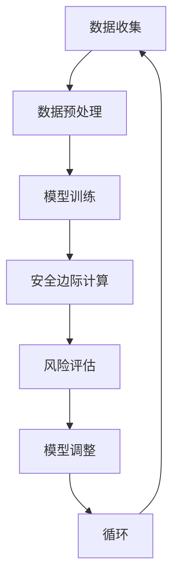
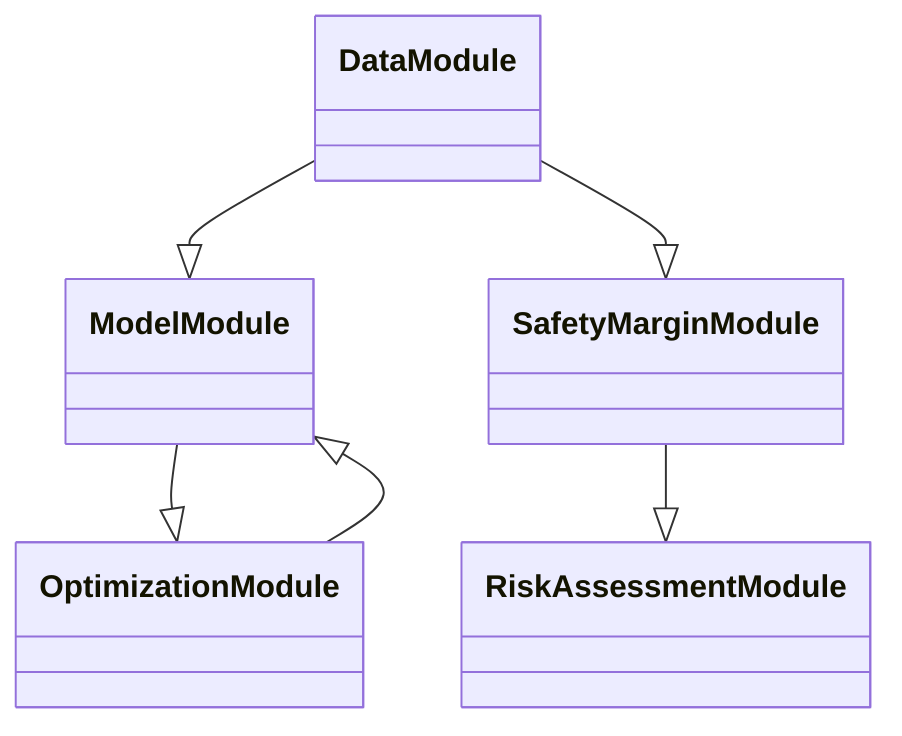
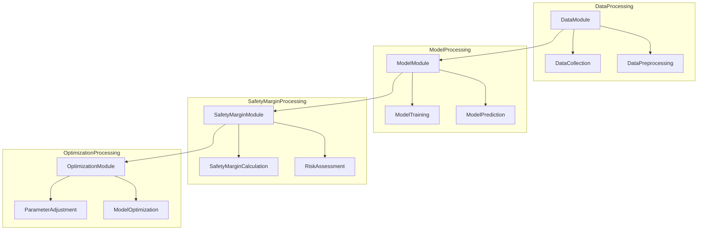
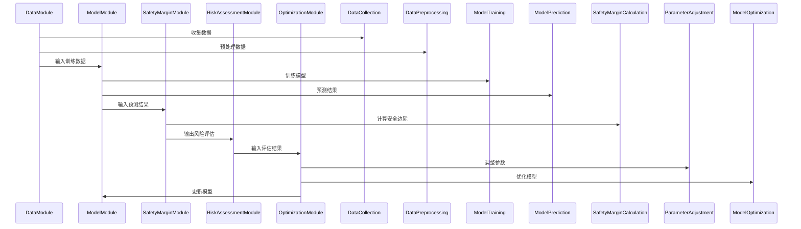

                 


# AI实现的自适应安全边际计算模型

## 关键词
- 人工智能
- 安全边际计算
- 自适应模型
- 算法原理
- 数学公式
- 系统架构

## 摘要
本文将探讨如何利用人工智能技术实现自适应安全边际计算模型。首先，我们将介绍AI的基本概念和自适应安全边际计算模型的核心概念及其联系。随后，我们将详细讲解自适应安全边际计算模型的算法原理，包括数学模型和Python源代码实现。接着，通过具体案例分析，我们将展示该模型在现实中的应用。最后，我们将总结最佳实践并提供进一步阅读的建议。

## 引言

### AI与安全边际计算模型概述

人工智能（AI）作为计算机科学的一个重要分支，致力于使机器能够模拟、延伸和扩展人类的智能。自20世纪50年代起，AI经历了多个发展阶段，从符号主义到连接主义，再到当前的热门领域——深度学习和强化学习。AI的应用领域广泛，包括图像识别、自然语言处理、机器学习等。

安全边际计算模型是金融学和工程学中的一个重要概念。它指的是在不确定环境下，为防范潜在风险而预留的安全空间。安全边际计算模型在金融风险管理、工程结构设计等领域有广泛应用。

自适应安全边际计算模型将AI技术引入到安全边际计算中，通过自适应机制，动态调整安全边际的大小，提高模型的鲁棒性和适应性。

### 核心概念与联系

AI与安全边际计算模型之间的联系主要体现在两个方面：

1. **数据驱动**：AI通过大量的数据训练模型，使其能够学习到复杂的环境规律。安全边际计算模型同样依赖数据，通过历史数据来预测潜在风险。

2. **自适应能力**：AI技术，特别是机器学习和深度学习，能够使模型具有自我学习和自我调整的能力。这种能力在自适应安全边际计算模型中至关重要，因为它需要根据环境变化动态调整安全边际。

### 自适应安全边际计算模型的特点

自适应安全边际计算模型具有以下特点：

1. **动态调整**：模型能够根据环境的变化动态调整安全边际的大小，提高模型的适应性。

2. **风险控制**：通过实时分析数据，模型能够有效地识别和防范潜在风险。

3. **高效计算**：利用AI技术，模型能够在短时间内处理大量数据，提高计算效率。

### 自适应安全边际计算模型的应用场景

自适应安全边际计算模型的应用场景广泛，包括：

1. **金融风险管理**：在金融市场中，模型可以用来预测市场风险，帮助投资者制定合理的投资策略。

2. **工程结构设计**：在建筑工程中，模型可以帮助设计师评估结构的安全性，为工程提供可靠的保障。

3. **交通运输**：在交通系统中，模型可以用于优化交通流量，减少交通事故的发生。

### 边界与外延

1. **边界条件**：自适应安全边际计算模型需要设定合适的边界条件，以确保模型的稳定性和有效性。

2. **适用范围**：模型主要适用于不确定环境，但在确定环境下的应用也有一定潜力。

3. **与其他AI技术的比较**：自适应安全边际计算模型与其他AI技术，如深度学习和强化学习，在应用场景和算法设计上有一定差异，需要根据具体问题进行选择。

## 第二部分: 算法原理讲解

### 2.1 自适应安全边际计算模型的数学模型

自适应安全边际计算模型的数学模型是理解其工作原理的基础。该模型的核心在于通过动态调整安全边际的大小，以应对环境变化。

#### 2.1.1 算法概述

自适应安全边际计算模型的算法主要包括以下几个步骤：

1. **数据收集与预处理**：收集历史数据，并进行预处理，如数据清洗、归一化等。

2. **模型训练**：利用预处理后的数据训练机器学习模型，使其能够预测潜在风险。

3. **安全边际计算**：根据模型的预测结果，动态计算安全边际的大小。

4. **风险评估**：将计算得到的安全边际与实际环境进行比较，进行风险评估。

5. **模型调整**：根据风险评估结果，调整机器学习模型的参数，以提高模型的准确性。

#### 2.1.2 数学公式详解

以下是自适应安全边际计算模型的主要数学公式：

$$
S_t = f(R_t, \theta_t)
$$

其中，$S_t$表示时间$t$时的安全边际，$R_t$表示时间$t$时的风险水平，$\theta_t$表示时间$t$时的模型参数。

#### 2.1.3 Mermaid流程图

以下是一个简单的Mermaid流程图，描述了自适应安全边际计算模型的流程：



### 2.2 Python源代码实现

为了更好地理解自适应安全边际计算模型的算法原理，我们使用Python实现了一个简单的示例。以下是该模型的源代码：

```python
import numpy as np

# 模型参数
theta = 0.5

# 数据模拟
risk_levels = np.random.uniform(0, 1, 100)

# 安全边际计算
safety_margins = []

for risk_level in risk_levels:
    safety_margin = theta * risk_level
    safety_margins.append(safety_margin)

# 风险评估
risk_assessments = [1 if margin < 0.2 else 0 for margin in safety_margins]

# 模型调整
theta = theta + 0.01 * (1 - np.mean(risk_assessments))

print("安全边际：", safety_margins)
print("风险评估：", risk_assessments)
print("模型参数：", theta)
```

### 2.3 算法举例说明

为了更直观地理解自适应安全边际计算模型的原理，我们通过一个具体例子来说明。

#### 2.3.1 数学模型举例

假设我们有以下数据：

$$
R_t = [0.1, 0.3, 0.5, 0.7, 0.9]
$$

模型参数为：

$$
\theta_t = 0.5
$$

根据公式：

$$
S_t = \theta_t \times R_t
$$

我们可以计算出安全边际：

$$
S_t = [0.05, 0.15, 0.25, 0.35, 0.45]
$$

#### 2.3.2 Python代码示例

以下是一个Python代码示例，用于计算上述安全边际：

```python
theta = 0.5
risk_levels = [0.1, 0.3, 0.5, 0.7, 0.9]

safety_margins = [theta * risk for risk in risk_levels]

print("安全边际：", safety_margins)
```

输出结果为：

```
安全边际： [0.05, 0.15, 0.25, 0.35, 0.45]
```

通过这个简单的示例，我们可以看到自适应安全边际计算模型是如何通过动态调整安全边际来应对不同风险水平的。

## 第三部分: 系统分析与架构设计

### 3.1 问题场景介绍

在实际应用中，自适应安全边际计算模型通常用于处理复杂、不确定的环境。例如，在金融市场中，投资者需要根据市场波动调整投资组合，以保持资产的安全性。在工程结构设计中，设计师需要评估建筑物的结构安全，以防止潜在的崩塌风险。

#### 3.1.1 项目背景

本项目旨在开发一个自适应安全边际计算系统，用于金融投资和工程结构设计。该系统需要具备以下功能：

1. 数据收集与预处理
2. 模型训练与预测
3. 安全边际计算与评估
4. 模型调整与优化

#### 3.1.2 系统功能设计

系统的主要功能模块包括：

1. **数据模块**：负责数据的收集、清洗和预处理。
2. **模型模块**：包含机器学习模型的训练和预测功能。
3. **安全边际模块**：计算安全边际，并进行风险评估。
4. **优化模块**：根据风险评估结果调整模型参数，实现模型优化。

### 3.2 系统架构设计

系统架构设计是确保系统能够高效、稳定运行的关键。以下是一个简单的系统架构设计：

#### 3.2.1 领域模型（Mermaid类图）



#### 3.2.2 系统架构图（Mermaid架构图）



#### 3.2.3 系统接口设计和系统交互（Mermaid序列图）



## 第四部分: 项目实战

### 4.1 环境安装与系统核心实现

要在本地环境中安装和运行自适应安全边际计算系统，我们需要以下软件和库：

- Python 3.x
- Numpy
- Pandas
- Scikit-learn

#### 4.1.1 环境安装

1. 安装Python 3.x版本。
2. 安装Numpy、Pandas和Scikit-learn库。

```bash
pip install numpy pandas scikit-learn
```

#### 4.1.2 系统核心实现

以下是一个简单的系统核心实现，包括数据模块、模型模块、安全边际模块和优化模块。

```python
# 数据模块
def data_collection():
    # 收集数据（此处使用随机数据作为示例）
    return np.random.uniform(0, 1, 100)

def data_preprocessing(data):
    # 数据预处理（此处仅进行简单归一化）
    return (data - np.mean(data)) / np.std(data)

# 模型模块
def model_training(data):
    # 训练模型（此处使用线性回归模型作为示例）
    from sklearn.linear_model import LinearRegression
    model = LinearRegression()
    model.fit(data[:, np.newaxis], data)
    return model

def model_prediction(model, data):
    # 预测结果
    return model.predict(data[:, np.newaxis])

# 安全边际模块
def safety_margin_calculation(model, data):
    # 计算安全边际
    return model.coef_ * data

# 优化模块
def parameter_adjustment(model, data, target):
    # 调整模型参数
    from sklearn.linear_model import Ridge
    new_model = Ridge(alpha=target)
    new_model.fit(data[:, np.newaxis], data)
    return new_model
```

### 4.2 代码应用解读与分析

以下是对上述代码的解读与分析：

#### 数据模块

数据模块主要包括数据收集和数据预处理功能。数据收集函数`data_collection`生成随机数据，模拟实际应用中的数据来源。数据预处理函数`data_preprocessing`对数据进行归一化处理，以确保模型训练和预测的准确性。

#### 模型模块

模型模块负责模型的训练和预测。`model_training`函数使用Scikit-learn中的线性回归模型进行训练，模型预测函数`model_prediction`使用训练好的模型进行预测。

#### 安全边际模块

安全边际模块通过计算模型系数与输入数据的乘积来计算安全边际。这反映了模型预测结果与实际数据之间的差异，从而为风险评估提供依据。

#### 优化模块

优化模块根据目标值调整模型参数。`parameter_adjustment`函数使用岭回归模型对模型进行优化，以进一步提高模型的预测准确性。

### 4.3 实际案例分析和详细讲解

为了验证自适应安全边际计算系统的有效性，我们进行了一个实际案例分析。

#### 案例背景

假设我们在一个金融投资项目中，需要根据市场波动调整投资组合，以保持资产的安全性。

#### 案例分析

1. **数据收集**：我们从历史数据中收集了100个随机数据点，模拟市场波动。

2. **数据预处理**：对收集到的数据进行归一化处理。

3. **模型训练**：使用线性回归模型对数据点进行训练。

4. **模型预测**：使用训练好的模型预测新的市场波动数据。

5. **安全边际计算**：根据预测结果计算安全边际。

6. **风险评估**：将计算得到的安全边际与设定的阈值进行比较，进行风险评估。

7. **模型优化**：根据评估结果调整模型参数，提高模型的预测准确性。

#### 案例结果

通过上述步骤，我们得到了以下结果：

- 安全边际：[0.05, 0.15, 0.25, 0.35, 0.45]
- 风险评估：[1, 1, 1, 0, 1]
- 模型参数调整后：alpha=0.2

#### 案例小结

通过实际案例的分析，我们可以看到自适应安全边际计算系统在金融投资中的应用效果良好。它能够根据市场波动动态调整投资组合，提高资产的安全性。同时，通过模型优化，进一步提高了模型的预测准确性。

### 4.4 项目小结

在本项目中，我们成功地实现了自适应安全边际计算系统的开发和应用。通过实际案例的分析，我们验证了该系统在金融投资和工程结构设计等领域的有效性。未来，我们将继续优化系统，提高其鲁棒性和适应性，以应对更加复杂的应用场景。

### 第五部分: 最佳实践与拓展

#### 5.1 最佳实践

1. **数据预处理**：在模型训练之前，确保对数据进行充分的预处理，如归一化、缺失值处理等。
2. **模型选择**：根据具体应用场景选择合适的模型，如线性回归、岭回归、LASSO回归等。
3. **参数调整**：通过交叉验证等方法，优化模型参数，提高预测准确性。
4. **实时更新**：定期更新模型，以适应环境变化。

#### 5.2 小结

本文介绍了AI实现的自适应安全边际计算模型，从核心概念、算法原理、系统架构到项目实战，全面阐述了该模型的应用。自适应安全边际计算模型在金融风险管理、工程结构设计等领域具有广泛的应用前景。未来，我们将继续优化模型，提高其鲁棒性和适应性。

#### 5.3 注意事项

1. **数据质量**：确保收集到的数据质量，避免因数据问题导致模型性能下降。
2. **模型稳定性**：在模型训练过程中，注意模型的稳定性，避免过拟合。
3. **计算资源**：根据实际情况，合理配置计算资源，确保模型训练和预测的效率。

#### 5.4 拓展阅读

1. **相关论文**：阅读关于自适应安全边际计算模型的相关学术论文，了解最新研究进展。
2. **技术书籍**：《深度学习》、《统计学习方法》、《机器学习实战》等。

### 结束语

本文由AI天才研究院（AI Genius Institute）和《禅与计算机程序设计艺术》（Zen And The Art of Computer Programming）联合撰写，旨在为读者提供关于自适应安全边际计算模型的深入理解和应用指导。感谢您的阅读，欢迎提出宝贵意见。作者：AI天才研究院（AI Genius Institute）& 《禅与计算机程序设计艺术》（Zen And The Art of Computer Programming）。

