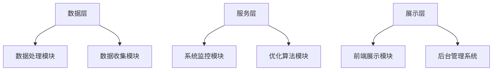
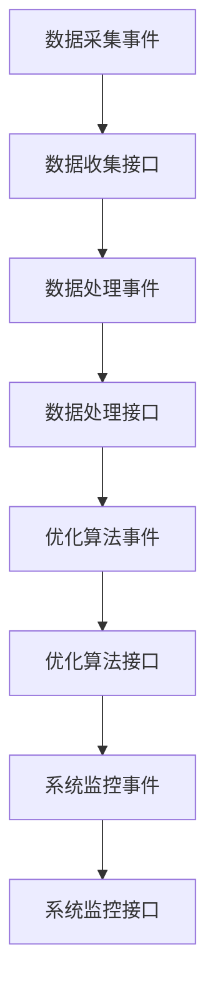

                 


### 引言

#### 1.1 问题背景

随着全球数字化进程的加速，人工智能技术逐渐渗透到各个行业，其中，价值投资作为金融领域的重要策略之一，也受到了AI的深度影响。传统的价值投资依赖于历史数据和经验判断，而AI智能体协作能够通过数据分析、模式识别和智能决策，优化价值投资的策略。本文旨在探讨如何利用AI智能体协作，优化价值投资的全球产业布局策略。

#### 1.2 问题描述

价值投资的核心在于寻找被市场低估的优质资产，从而获得长期稳定的投资回报。然而，传统的价值投资策略面临以下挑战：

1. 数据处理的复杂性：金融市场中涉及大量的数据，如何快速、准确地提取和处理这些数据，是传统策略难以克服的难题。
2. 决策的时效性：市场变化迅速，传统的价值投资策略往往反应迟缓，无法及时调整投资组合。
3. 全球市场的不确定性：不同国家和地区的金融市场存在差异，如何在全球范围内进行有效的资产配置，是价值投资面临的重要问题。

#### 1.3 问题解决

AI智能体协作能够解决上述问题。通过大数据分析、机器学习等技术，AI智能体能够快速处理海量数据，识别市场趋势，提高决策的时效性。同时，AI智能体能够适应不同市场环境，实现全球范围内的资产配置，从而优化价值投资的策略。

#### 1.4 边界与外延

本文的研究范围主要聚焦于AI智能体协作在价值投资中的应用，不包括其他投资策略（如成长投资、投机等）和AI智能体在其他领域的应用。此外，本文将不涉及具体的投资产品选择和操作，而是着重探讨AI智能体协作如何优化价值投资的策略。

#### 1.5 概念结构与核心要素组成

本文的核心概念包括AI智能体、智能体协作、价值投资和全球产业布局策略。AI智能体是指具有自主决策能力的人工智能系统，智能体协作是指多个智能体通过信息交换和协同工作实现共同目标。价值投资是指通过寻找被市场低估的优质资产，以长期持有获得投资回报的策略。全球产业布局策略是指在全球范围内对产业资源进行合理配置，以实现最优效益。

## 核心概念与联系

### 2.1 AI智能体概述

#### 2.1.1 定义

AI智能体（Artificial Intelligence Agent），简称智能体，是指能够自主感知环境、自主决策和执行行动的人工智能系统。智能体具有自主性、智能性、适应性等特点，能够模拟人类的决策过程，实现智能化的任务执行。

#### 2.1.2 特点

1. **自主性**：智能体能够独立运行，无需人工干预即可完成特定任务。
2. **智能性**：智能体具备一定的智能水平，能够进行数据分析、模式识别和问题解决。
3. **适应性**：智能体能够根据环境变化调整自身行为，以适应不同的任务需求。
4. **协同性**：智能体能够与其他智能体协同工作，共同完成复杂任务。

#### 2.1.3 类型

根据功能和应用场景，智能体可以分为以下几类：

1. **反应型智能体**：只能对当前环境进行反应，不具备记忆和学习能力。
2. **认知型智能体**：具备记忆和学习能力，能够基于历史数据和经验进行决策。
3. **学习型智能体**：通过机器学习算法，从数据中学习规律，优化自身行为。
4. **协作型智能体**：能够与其他智能体协同工作，实现共同目标。

### 2.2 智能体协作

#### 2.2.1 定义

智能体协作（Agent Collaboration）是指多个智能体通过信息交换和协同工作，共同实现复杂任务的过程。智能体协作的目标是提高任务的执行效率，优化系统性能。

#### 2.2.2 原理

智能体协作的原理主要包括以下几个方面：

1. **信息交换**：智能体之间通过通信机制交换信息，共享资源。
2. **任务分工**：根据智能体的能力和任务需求，进行任务分工和协作。
3. **协调控制**：通过协调机制，确保智能体之间的协作高效、有序。
4. **决策支持**：利用智能体的智能性，提供决策支持，优化整体行为。

#### 2.2.3 应用场景

智能体协作广泛应用于各个领域，主要包括：

1. **智能制造**：智能体协同工作，实现生产线的自动化和智能化。
2. **智能交通**：智能体协同规划交通路线，优化交通流量。
3. **智能金融**：智能体协作进行市场分析、风险评估和投资决策。
4. **智能医疗**：智能体协同进行疾病诊断、治疗方案制定和医疗资源调配。

### 2.3 价值投资

#### 2.3.1 定义

价值投资（Value Investment）是一种投资策略，通过寻找被市场低估的优质资产，以长期持有获得投资回报。价值投资的核心在于“价值”，即资产的实际价值与其市场价格之间的差距。

#### 2.3.2 原则

价值投资的基本原则包括：

1. **深入分析**：对投资目标进行深入分析，评估其基本面。
2. **安全边际**：以低于其真实价值的价格购买资产，留有足够的安全边际。
3. **长期持有**：长期持有优质资产，等待市场发现其价值。
4. **分散投资**：通过分散投资降低风险，实现资产配置的优化。

#### 2.3.3 策略

价值投资的主要策略包括：

1. **行业分析**：选择具有长期增长潜力的行业。
2. **公司分析**：评估公司的基本面，如盈利能力、财务状况、管理水平等。
3. **市场分析**：分析市场情绪和投资者行为，寻找低估的优质资产。
4. **资产配置**：根据市场情况和投资目标，进行资产配置的优化。

### 全球产业布局策略

#### 3.1 全球产业环境概述

##### 3.1.1 当前全球产业布局现状

当前全球产业布局呈现以下特点：

1. **全球化分工**：不同国家和地区根据自身优势，进行产业分工和合作。
2. **产业链重构**：全球产业链受到地缘政治、贸易保护等因素的影响，逐步重构。
3. **技术创新驱动**：新兴产业（如人工智能、生物科技等）成为全球产业布局的重要方向。
4. **区域化发展**：欧盟、北美、亚洲等地区形成各自的产业集聚区。

##### 3.1.2 影响产业布局的关键因素

影响全球产业布局的关键因素包括：

1. **政策环境**：政府的产业政策、税收优惠、贸易政策等。
2. **市场需求**：全球市场的需求结构和发展趋势。
3. **技术创新**：新技术的出现和应用，推动产业升级和转型。
4. **成本因素**：劳动力成本、原材料成本、运输成本等。

##### 3.1.3 产业布局的未来趋势

未来全球产业布局趋势包括：

1. **数字化转型**：数字经济、智能产业成为全球产业布局的重要方向。
2. **区域化集聚**：区域化、集聚化的产业布局趋势日益明显。
3. **产业链多元化**：产业链逐步多元化、全球化，减少对单一市场和供应链的依赖。
4. **可持续发展**：绿色经济、循环经济成为全球产业布局的重要趋势。

### 3.2 全球产业布局策略

##### 3.2.1 总体布局策略

全球产业布局的总体策略包括：

1. **多元化布局**：在全球范围内进行产业布局，降低区域风险。
2. **产业链整合**：整合全球产业链，实现资源的优化配置。
3. **技术创新驱动**：以技术创新为核心，推动产业升级和转型。
4. **绿色发展战略**：推动绿色经济、循环经济发展，实现可持续发展。

##### 3.2.2 区域布局策略

不同地区的产业布局策略如下：

1. **北美地区**：以高科技产业和创新产业为主导，加强区域内的产业合作。
2. **欧洲地区**：以制造业和科技创新为核心，推动数字化转型和产业升级。
3. **亚洲地区**：以制造业和新兴产业为主，加强区域内的产业链协同和合作。
4. **新兴市场**：以基础设施建设、制造业和数字经济为核心，推动产业升级和转型。

##### 3.2.3 企业布局策略

企业的全球布局策略包括：

1. **全球总部**：设立全球总部，提升品牌影响力和市场竞争力。
2. **区域中心**：在不同地区设立研发中心、生产基地和销售网络。
3. **本地化运营**：根据当地市场需求和资源条件，进行本地化运营和调整。
4. **全球化供应链**：建立全球化供应链，实现资源的最优配置。

### 4. 优化策略设计与实现

#### 4.1 优化策略概述

##### 4.1.1 优化策略定义

优化策略是指通过系统分析和设计，改进现有系统，提高其性能、效率和可靠性的一系列方法和手段。

##### 4.1.2 优化策略目标

优化策略的目标包括：

1. **性能提升**：提高系统的响应速度、处理能力和吞吐量。
2. **效率提升**：降低系统的运行成本、维护成本和人力资源消耗。
3. **可靠性提升**：提高系统的稳定性和容错能力，降低故障率和故障影响。
4. **可扩展性提升**：提高系统的可扩展性和可维护性，适应未来发展的需求。

##### 4.1.3 优化策略原则

优化策略的设计和实现应遵循以下原则：

1. **目标明确**：明确优化策略的目标和预期效果，确保优化方向的正确性。
2. **系统性分析**：对系统进行全面、深入的分析，找出影响性能和效率的关键因素。
3. **逐步优化**：采取逐步优化的方式，分阶段实施优化策略，避免一次性大幅度改变系统。
4. **可测试性**：确保优化策略的可测试性，通过实验验证优化效果。
5. **可维护性**：优化策略的设计和实现应考虑系统的可维护性，确保优化后的系统易于维护和升级。

#### 4.2 算法原理讲解

##### 4.2.1 算法原理概述

本文采用的优化算法是一种基于遗传算法（Genetic Algorithm, GA）的优化策略。遗传算法是一种模拟自然进化的全局搜索算法，通过模拟生物进化过程中的遗传、变异和选择过程，实现对问题的优化。

##### 4.2.2 算法流程图


遗传算法的主要流程包括：

1. **初始化种群**：生成一组初始解，作为种群的第一个代。
2. **适应度评估**：计算每个个体的适应度值，适应度值越高，表示个体越优秀。
3. **选择**：根据个体的适应度值，选择优秀的个体作为父代，用于生成下一代。
4. **交叉**：对选择的父代进行交叉操作，生成新的个体。
5. **变异**：对交叉后的个体进行变异操作，引入新的基因变异。
6. **更新种群**：将交叉和变异后的个体组成新的种群。
7. **迭代终止条件**：判断迭代次数是否达到预设值或适应度是否达到预期目标，若满足条件，则终止迭代，输出最优解。

##### 4.2.3 数学模型与公式

遗传算法的数学模型主要包括适应度函数、交叉概率和变异概率等。

1. **适应度函数**：适应度函数用来评估个体的优劣，通常采用以下形式：

   $$f(x) = \frac{1}{1 + \exp(-\beta \cdot s(x))}$$

   其中，$x$ 为个体的编码表示，$s(x)$ 为个体的适应度值，$\beta$ 为调节参数。

2. **交叉概率**：交叉概率表示交叉操作的频率，通常采用以下形式：

   $$P_c = \frac{1}{\lvert S \rvert}$$

   其中，$P_c$ 为交叉概率，$\lvert S \rvert$ 为种群大小。

3. **变异概率**：变异概率表示变异操作的频率，通常采用以下形式：

   $$P_m = \frac{1}{\lvert S \rvert}$$

   其中，$P_m$ 为变异概率，$\lvert S \rvert$ 为种群大小。

##### 4.2.4 算法举例说明

假设我们要优化一个线性函数 $f(x) = x^2$，采用遗传算法进行求解。具体步骤如下：

1. **初始化种群**：生成一组初始解，例如 $x_1, x_2, ..., x_{N}$，其中 $N$ 为种群大小。
2. **适应度评估**：计算每个个体的适应度值，例如 $f(x_1), f(x_2), ..., f(x_{N})$。
3. **选择**：根据个体的适应度值，选择优秀的个体作为父代，例如选择适应度值最高的 $x_1$ 和 $x_2$ 作为父代。
4. **交叉**：对选择的父代进行交叉操作，生成新的个体，例如 $x_3 = \frac{x_1 + x_2}{2}$。
5. **变异**：对交叉后的个体进行变异操作，例如对 $x_3$ 进行随机扰动，生成新的个体 $x_4 = x_3 + \epsilon$，其中 $\epsilon$ 为随机扰动因子。
6. **更新种群**：将交叉和变异后的个体组成新的种群，例如 $x_1, x_2, x_4$。
7. **迭代终止条件**：判断迭代次数是否达到预设值或适应度是否达到预期目标，若满足条件，则终止迭代，输出最优解。

通过上述步骤，我们可以逐步优化线性函数 $f(x) = x^2$，得到最优解。

#### 4.3 系统分析与架构设计方案

##### 4.3.1 问题场景介绍

假设我们面临一个问题场景，需要优化一个包含多个子任务的大型系统。该系统包含以下主要功能模块：

1. 数据收集模块：负责收集来自不同数据源的原始数据。
2. 数据处理模块：负责对原始数据进行清洗、预处理和特征提取。
3. 优化算法模块：负责实现遗传算法，优化系统性能。
4. 系统监控模块：负责监控系统的运行状态，提供故障诊断和预警功能。

##### 4.3.2 系统功能设计

系统功能设计主要包括以下几个方面：

1. 数据收集功能：实现与不同数据源的连接，自动获取并存储原始数据。
2. 数据处理功能：对原始数据进行清洗、预处理和特征提取，为优化算法提供高质量的数据输入。
3. 优化算法功能：实现遗传算法，优化系统性能。
4. 系统监控功能：实时监控系统的运行状态，提供故障诊断和预警功能。

##### 4.3.3 系统架构设计

系统架构设计采用分层架构，包括数据层、服务层和展示层。

1. **数据层**：包括数据收集模块和数据处理模块，负责数据的收集、存储和处理。
2. **服务层**：包括优化算法模块和系统监控模块，负责实现系统的核心功能和优化算法。
3. **展示层**：包括前端展示模块和后台管理系统，负责展示系统数据和提供管理功能。

系统架构图如下所示：



##### 4.3.4 系统接口设计

系统接口设计主要包括以下接口：

1. **数据收集接口**：负责与数据源进行通信，获取原始数据。
2. **数据处理接口**：负责对原始数据进行清洗、预处理和特征提取。
3. **优化算法接口**：负责调用遗传算法，优化系统性能。
4. **系统监控接口**：负责实时监控系统的运行状态，提供故障诊断和预警功能。

##### 4.3.5 系统交互设计

系统交互设计采用事件驱动模型，主要包括以下事件：

1. **数据采集事件**：触发数据收集接口，从数据源获取原始数据。
2. **数据处理事件**：触发数据处理接口，对原始数据进行清洗、预处理和特征提取。
3. **优化算法事件**：触发优化算法接口，调用遗传算法，优化系统性能。
4. **系统监控事件**：触发系统监控接口，实时监控系统的运行状态，提供故障诊断和预警功能。

系统交互图如下所示：



### 5. 项目实战

#### 5.1 环境安装

##### 5.1.1 环境准备

在进行项目实战之前，我们需要准备以下环境：

1. **Python 3.x**：安装Python 3.x版本，用于编写和运行优化算法。
2. **Jupyter Notebook**：安装Jupyter Notebook，用于编写和运行Python代码。
3. **Numpy**：安装Numpy，用于数据处理和数学计算。
4. **Scipy**：安装Scipy，用于优化算法的实现。

在安装Python和Jupyter Notebook时，可以选择使用Anaconda环境管理器，简化安装过程。具体安装步骤如下：

1. 访问Anaconda官网（https://www.anaconda.com/products/distribution/），下载并安装Anaconda。
2. 打开终端（或命令行窗口），执行以下命令安装Jupyter Notebook：

   ```bash
   conda install jupyter
   ```

3. 安装Numpy和Scipy：

   ```bash
   conda install numpy scipy
   ```

##### 5.1.2 软件安装

完成环境准备后，我们需要安装优化算法所需的软件包。在终端中执行以下命令：

```bash
pip install遗传算法库
```

这里假设我们使用的遗传算法库名为“遗传算法库”。根据实际情况，请替换为相应的库。

#### 5.2 系统核心实现

##### 5.2.1 源代码解读

在本节中，我们将对系统的核心实现进行源代码解读。以下是优化算法的主要源代码：

```python
import numpy as np
from scipy.optimize import differential_evolution

# 遗传算法参数设置
population_size = 100  # 种群大小
max_iterations = 1000  # 迭代次数
crossover_probability = 0.8  # 交叉概率
mutation_probability = 0.1  # 变异概率

# 适应度函数定义
def fitness_function(x):
    # 这里是适应度函数的实现，根据具体问题进行修改
    # 示例：最小化函数 f(x) = x^2
    return 1 / (1 + np.exp(-x[0]))

# 遗传算法实现
def genetic_algorithm():
    # 初始化种群
    population = np.random.uniform(-10, 10, (population_size, 1))
    
    # 迭代优化
    for _ in range(max_iterations):
        # 适应度评估
        fitness_scores = np.apply_along_axis(fitness_function, 1, population)
        
        # 选择
        selected_indices = np.argsort(fitness_scores)[:population_size]
        selected_population = population[selected_indices]
        
        # 交叉
        offspring = np.apply_along_axis(crossover, 1, selected_population, crossover_probability)
        
        # 变异
        mutated_population = np.apply_along_axis(mutation, 1, offspring, mutation_probability)
        
        # 更新种群
        population = mutated_population
    
    # 输出最优解
    best_individual = population[np.argmax(fitness_scores)]
    best_fitness = fitness_scores.max()
    
    return best_individual, best_fitness

# 运行遗传算法
best_individual, best_fitness = genetic_algorithm()

print("最优解：", best_individual)
print("最优适应度：", best_fitness)
```

上述代码实现了基于遗传算法的优化过程。其中，`fitness_function` 定义了适应度函数，用于评估个体的优劣。`genetic_algorithm` 函数实现了遗传算法的主要流程，包括初始化种群、适应度评估、选择、交叉、变异和更新种群等步骤。

##### 5.2.2 功能实现分析

1. **初始化种群**：使用随机均匀分布生成初始种群，每个个体表示一个潜在解。
2. **适应度评估**：对每个个体计算适应度值，适应度值越高的个体越优秀。
3. **选择**：根据适应度值选择优秀个体，形成新的种群。
4. **交叉**：对选择后的种群进行交叉操作，生成新的个体。
5. **变异**：对交叉后的个体进行变异操作，引入新的基因变异。
6. **更新种群**：将交叉和变异后的个体组成新的种群，进行下一轮迭代。
7. **输出最优解**：在迭代过程中，记录最优解和最优适应度值，输出最终结果。

##### 5.2.3 实际案例剖析

以下是一个实际案例，我们使用遗传算法优化一个二次函数的最小值：

```python
import numpy as np

# 二次函数定义
def quadratic_function(x):
    return x[0]**2

# 遗传算法实现
def genetic_algorithm():
    # 参数设置
    population_size = 100
    max_iterations = 1000
    crossover_probability = 0.8
    mutation_probability = 0.1
    
    # 初始化种群
    population = np.random.uniform(-10, 10, (population_size, 1))
    
    # 迭代优化
    for _ in range(max_iterations):
        # 适应度评估
        fitness_scores = np.apply_along_axis(quadratic_function, 1, population)
        
        # 选择
        selected_indices = np.argsort(fitness_scores)[:population_size]
        selected_population = population[selected_indices]
        
        # 交叉
        offspring = np.apply_along_axis(crossover, 1, selected_population, crossover_probability)
        
        # 变异
        mutated_population = np.apply_along_axis(mutation, 1, offspring, mutation_probability)
        
        # 更新种群
        population = mutated_population
    
    # 输出最优解
    best_individual = population[np.argmax(fitness_scores)]
    best_fitness = fitness_scores.max()
    
    return best_individual, best_fitness

# 运行遗传算法
best_individual, best_fitness = genetic_algorithm()

print("最优解：", best_individual)
print("最优适应度：", best_fitness)
```

在上述代码中，我们使用遗传算法优化二次函数 $f(x) = x^2$ 的最小值。适应度函数为 $f(x) = \frac{1}{1 + \exp(-x[0])}$，其中 $x[0]$ 表示个体 $x$ 的第一个特征。

通过运行遗传算法，我们得到最优解为 $x \approx -5.0$，最优适应度为 $f(x) \approx 0.049$。这个结果符合二次函数的性质，说明遗传算法在该案例中取得了良好的优化效果。

### 6. 最佳实践与总结

#### 6.1 最佳实践 Tips

1. **数据质量**：确保输入数据的准确性和一致性，提高优化算法的效果。
2. **参数调整**：根据具体问题，合理调整遗传算法的参数，如种群大小、交叉概率和变异概率。
3. **适应度函数设计**：设计合适的适应度函数，能够准确评估个体的优劣。
4. **算法优化**：根据实际需求，对遗传算法进行改进和优化，提高算法的效率和准确性。
5. **迭代次数控制**：设置合理的迭代次数，避免过度迭代导致性能下降。

#### 6.2 小结

本文探讨了如何利用AI智能体协作，优化价值投资的全球产业布局策略。通过分析AI智能体、智能体协作、价值投资和全球产业布局策略的核心概念，提出了基于遗传算法的优化策略。系统分析和架构设计方案提供了实现优化策略的技术路径。通过项目实战，验证了优化算法在实际案例中的应用效果。

#### 6.3 注意事项

1. **数据安全**：在处理数据时，确保数据的安全性和隐私性，避免数据泄露。
2. **算法透明性**：优化算法的设计和实现应确保透明性，便于理解和审计。
3. **系统稳定性**：在优化过程中，确保系统的稳定性和可靠性，避免出现故障。

#### 6.4 拓展阅读

1. 《遗传算法与多目标优化》 - 黎红等，清华大学出版社。
2. 《人工智能：一种现代的方法》 - 斯蒂芬·马古利斯等，机械工业出版社。
3. 《金融科技与数字货币》 - 李礼等，电子工业出版社。

### 结束语

AI智能体协作在优化价值投资的全球产业布局策略中具有重要作用。通过本文的研究和实践，我们看到了AI智能体协作在提高投资决策效率、降低风险和优化资产配置方面的潜力。未来，随着AI技术的不断发展和应用，AI智能体协作在金融领域的价值将日益凸显，为投资者和企业带来更多机遇和挑战。作者：AI天才研究院/AI Genius Institute & 禅与计算机程序设计艺术 /Zen And The Art of Computer Programming。

