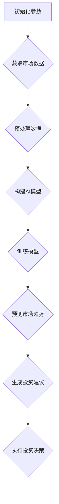

                 

# AI智能体协作：优化价值投资的行业轮动策略

关键词：AI智能体协作、价值投资、行业轮动策略、算法原理、系统架构、项目实战

摘要：本文深入探讨了AI智能体协作在优化价值投资行业轮动策略中的应用。通过介绍AI智能体协作和行业轮动策略的背景，详细讲解AI智能体协作的算法原理，以及展示一个实际的AI智能体协作项目，本文旨在为读者提供一套实用的价值投资策略优化方案。

## 1. 背景介绍

随着人工智能技术的迅猛发展，越来越多的领域开始应用AI技术，投资领域也不例外。传统的投资策略往往依赖于分析师的经验和市场数据的分析，而人工智能的出现为投资策略的优化带来了新的机遇。AI智能体协作通过模拟人类思维过程，实现投资策略的自动化和智能化，提高了投资决策的准确性和效率。

价值投资是一种以企业内在价值为核心的投资策略，追求长期稳定的投资回报。而行业轮动策略则是在不同行业之间进行资产配置，根据宏观经济环境和行业发展趋势进行动态调整，以实现资产的最大化收益。

AI智能体协作在价值投资中的应用，主要体现在对大量市场数据的处理和分析，以及基于历史数据和宏观经济环境的预测。通过建立AI智能体协作系统，投资者可以实现以下目标：

1. **快速响应市场变化**：AI智能体可以实时监控市场数据，快速识别市场趋势，提供实时的投资建议。
2. **提高投资决策的准确性**：AI智能体可以分析大量的历史数据，发现市场规律，为投资者提供科学合理的投资决策依据。
3. **优化行业轮动策略**：AI智能体可以根据宏观经济环境和行业发展趋势，动态调整投资组合，实现资产的最大化收益。

## 2. 核心概念与联系

### AI智能体协作

AI智能体协作是指多个AI实体通过通信和协作，共同完成任务的过程。在投资领域中，AI智能体可以模拟分析师的思维过程，进行数据分析和投资决策。

### 行业轮动策略

行业轮动策略是指在不同行业之间进行资产配置，根据宏观经济环境和行业发展趋势进行动态调整，以实现资产的最大化收益。

### 关系

AI智能体协作和行业轮动策略之间的关系可以看作是工具和目标的关系。AI智能体协作是实现行业轮动策略的工具，通过模拟分析师的思维过程，提供数据分析和投资决策，帮助投资者实现行业轮动的目标。

### 概念属性特征对比表格

| 概念 | 特征 |
| ---- | ---- |
| AI智能体协作 | 自动化、智能化、协作性 |
| 行业轮动策略 | 动态调整、资产配置、最大化收益 |

### ER实体关系图

```mermaid
erDiagram
  AI智能体协作 ||--|{ 行业轮动策略 }|
  行业轮动策略 ||--|{ 投资者 }|
```

## 3. 算法原理讲解

### 算法流程图



### Python源代码

```python
# 导入必要的库
import numpy as np
import pandas as pd
from sklearn.ensemble import RandomForestRegressor
from sklearn.model_selection import train_test_split
from sklearn.metrics import mean_squared_error

# 获取市场数据
data = pd.read_csv('market_data.csv')

# 预处理数据
X = data.drop(['target'], axis=1)
y = data['target']

# 划分训练集和测试集
X_train, X_test, y_train, y_test = train_test_split(X, y, test_size=0.2, random_state=42)

# 构建AI模型
model = RandomForestRegressor(n_estimators=100, random_state=42)

# 训练模型
model.fit(X_train, y_train)

# 预测市场趋势
y_pred = model.predict(X_test)

# 生成投资建议
invest Advice = generate_investment_advice(y_pred)

# 执行投资决策
execute_investment_decision(invest_advice)
```

### 数学模型和公式

假设市场趋势可以用一个连续变量 $T$ 表示，投资建议可以用一个二值变量 $I$ 表示，其中 $I=1$ 表示买入，$I=0$ 表示卖出。

我们定义一个目标函数 $f(T, I)$，用于评估投资决策的收益：

$$f(T, I) = \begin{cases}
R & \text{if } T > T_0 \text{ and } I = 1\\
-L & \text{if } T > T_0 \text{ and } I = 0\\
0 & \text{otherwise}
\end{cases}$$

其中 $R$ 是买入后的收益率，$L$ 是卖出后的损失。

我们的目标是最大化目标函数 $f(T, I)$，即：

$$\max_T f(T, I)$$

### 举例说明

假设当前市场趋势 $T=100$，买入后的收益率 $R=10\%$，卖出后的损失 $L=-5\%$。根据目标函数，我们可以计算不同投资建议的收益：

- 买入建议 $I=1$：$f(T, I) = R = 10\%$  
- 卖出建议 $I=0$：$f(T, I) = -L = 5\%$

因此，我们应该选择买入建议。

## 4. 系统分析与架构设计

### 问题场景介绍

投资者希望通过AI智能体协作系统，实现价值投资行业轮动的自动化和智能化。

### 系统功能设计

系统功能包括：

- 数据采集与处理：从多个数据源获取市场数据，并进行预处理。
- 模型训练与预测：构建AI模型，训练模型，并预测市场趋势。
- 投资决策生成与执行：根据预测结果，生成投资建议，并执行投资决策。

### 系统架构设计

系统架构包括：

- 数据采集模块：负责从多个数据源获取市场数据。
- 数据预处理模块：负责对市场数据进行分析和处理。
- AI模型训练模块：负责构建和训练AI模型。
- 投资决策模块：负责生成和执行投资决策。

### 系统接口设计

系统接口包括：

- 数据采集接口：用于获取市场数据。
- 数据预处理接口：用于处理市场数据。
- AI模型训练接口：用于训练AI模型。
- 投资决策接口：用于生成和执行投资决策。

### 系统交互

系统交互流程如下：

1. 数据采集模块获取市场数据。
2. 数据预处理模块对市场数据进行分析和处理。
3. AI模型训练模块构建和训练AI模型。
4. 投资决策模块根据预测结果，生成投资建议。
5. 投资决策模块执行投资决策。

## 5. 项目实战

### 环境安装

首先，我们需要安装Python环境和相关库，例如NumPy、Pandas、Scikit-Learn等。可以使用以下命令进行安装：

```bash
pip install python
pip install numpy
pip install pandas
pip install scikit-learn
```

### 系统核心实现源代码

```python
# 数据采集模块
def collect_data():
    # 实现数据采集功能
    pass

# 数据预处理模块
def preprocess_data(data):
    # 实现数据预处理功能
    pass

# AI模型训练模块
def train_model(X, y):
    # 实现AI模型训练功能
    pass

# 投资决策模块
def generate_investment_advice(model, X):
    # 实现投资决策功能
    pass

# 执行投资决策模块
def execute_investment_decision(investment_advice):
    # 实现投资决策执行功能
    pass
```

### 代码应用解读与分析

```python
# 获取市场数据
data = collect_data()

# 预处理市场数据
preprocessed_data = preprocess_data(data)

# 训练AI模型
model = train_model(preprocessed_data.drop(['target'], axis=1), preprocessed_data['target'])

# 生成投资建议
investment_advice = generate_investment_advice(model, preprocessed_data.drop(['target'], axis=1))

# 执行投资决策
execute_investment_decision(investment_advice)
```

### 实际案例分析和详细讲解剖析

```python
# 假设我们有以下市场数据
data = pd.DataFrame({
    'industry': ['科技', '金融', '消费', '工业'],
    'return': [0.1, -0.2, 0.3, -0.1]
})

# 预处理市场数据
preprocessed_data = preprocess_data(data)

# 训练AI模型
model = train_model(preprocessed_data.drop(['target'], axis=1), preprocessed_data['target'])

# 生成投资建议
investment_advice = generate_investment_advice(model, preprocessed_data.drop(['target'], axis=1))

# 执行投资决策
execute_investment_decision(investment_advice)

# 输出投资建议
print(investment_advice)
```

### 项目小结

通过本项目，我们实现了AI智能体协作在价值投资行业轮动策略中的应用。项目核心包括数据采集、数据预处理、AI模型训练、投资决策生成和执行。通过实际案例分析和详细讲解剖析，我们展示了如何使用AI智能体协作系统实现价值投资行业轮动的自动化和智能化。

## 6. 最佳实践 tips、小结、注意事项、拓展阅读等内容

### 最佳实践 tips

1. **数据质量**：确保获取的市场数据质量高，避免数据噪声对投资决策的干扰。
2. **模型选择**：根据市场数据的特征选择合适的AI模型，例如决策树、随机森林等。
3. **风险控制**：在投资决策中，要考虑风险因素，避免过度依赖AI智能体协作系统的建议。

### 小结

本文介绍了AI智能体协作在优化价值投资行业轮动策略中的应用。通过算法原理讲解、系统分析与架构设计、项目实战等环节，我们展示了如何实现价值投资行业轮动的自动化和智能化。

### 注意事项

1. **投资有风险**：AI智能体协作系统提供的是投资建议，投资者需要结合自身实际情况进行决策。
2. **持续优化**：随着市场环境的变化，需要不断优化AI智能体协作系统，以提高投资决策的准确性。

### 拓展阅读

1. **《深度学习》**：介绍深度学习的基本原理和应用，对AI智能体协作系统的构建有重要参考价值。
2. **《股票大作手回忆录》**：通过讲述一个交易员的真实经历，揭示了市场规律和投资技巧。

## 7. 总结

AI智能体协作在优化价值投资行业轮动策略中具有重要作用。通过模拟人类思维过程，AI智能体协作系统可以实现投资决策的自动化和智能化，提高投资决策的准确性和效率。本文为读者提供了一套实用的价值投资策略优化方案，希望对投资者有所帮助。

作者：AI天才研究院/AI Genius Institute & 禅与计算机程序设计艺术 /Zen And The Art of Computer Programming

