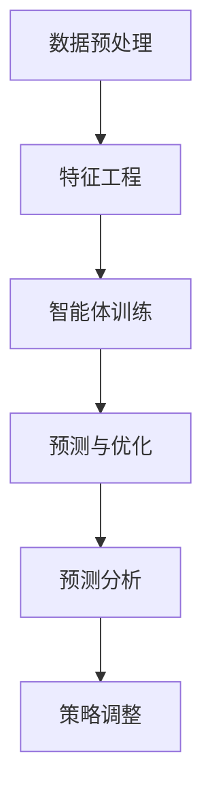

                 

 

# AI智能体协作：提升对公司未来现金流稳定性的预测

关键词：AI智能体、现金流预测、稳定性、协作机制、数据预处理

摘要：本文将探讨如何利用AI智能体协作提升公司未来现金流预测的稳定性。通过介绍AI智能体的基本概念、协作机制和实际应用，本文旨在为读者提供一种新的视角和方法来优化现金流预测。

### 第一部分：背景介绍

#### 1.1 问题背景

人工智能（AI）技术近年来取得了飞速的发展，特别是在深度学习和大数据分析的推动下，AI的应用范围已经扩展到各个领域。随着企业对数据价值的重视，AI在商业决策中的应用也越来越受到关注。

#### 1.2 问题描述

本文的主题是探讨如何利用AI智能体协作来提升对公司未来现金流稳定性的预测。这个问题涉及到如何利用AI技术，特别是智能体的协同工作能力，来提高公司财务预测的准确性和稳定性。

#### 1.3 问题解决

本文将通过介绍AI智能体的基本概念、协作机制，以及在实际业务中的应用，来探讨如何通过智能体协作来提升现金流预测的稳定性。具体方法包括数据预处理、特征工程、智能体训练与优化、预测结果分析等。

#### 1.4 边界与外延

本文主要探讨的是企业内部使用AI智能体进行现金流预测的场景。虽然AI智能体技术可以应用于多个领域，但本文将重点放在财务预测上。

#### 1.5 概念结构与核心要素组成

- **AI智能体**：具有自主学习和决策能力的计算机程序。
- **协作机制**：智能体之间的交互与协作方式。
- **现金流预测**：基于历史数据和模型预测公司未来的现金流动状况。
- **稳定性**：预测结果的一致性和可靠性。

### 第二部分：核心概念与联系

#### 2.1 AI智能体原理

**定义**：AI智能体是具备自主性、社会性、反应性、认知性、交互性的软件代理。

**核心特点**：

- **自主性**：智能体能够自主地感知环境、做出决策和执行动作。
- **社会性**：智能体之间能够进行有效的交流和合作。
- **反应性**：智能体能够对环境的变化做出快速反应。
- **认知性**：智能体能够理解环境和自身的状态。
- **交互性**：智能体之间能够相互通信和协作。

#### 2.2 AI智能体协作机制

**定义**：AI智能体协作机制是多个智能体在共同目标下相互协作的过程。

**核心特点**：

- **分布式**：智能体分布在不同位置，协同工作。
- **协同**：智能体之间相互配合，共同完成复杂任务。
- **自适应**：智能体能够根据环境变化调整自己的行为。

#### 2.3 现金流预测原理

**定义**：现金流预测是根据历史数据和业务模型预测公司未来一段时间内的现金流动情况。

**核心特点**：

- **数据驱动**：基于历史数据和业务模型进行预测。
- **模型依赖**：依赖预测模型来模拟未来现金流动。
- **实时性**：能够实时更新预测结果，为决策提供支持。

#### 2.4 概念属性特征对比表格

| 特征                | AI智能体                      | 智能体协作机制                     | 现金流预测                     |
|---------------------|-------------------------------|-----------------------------------|--------------------------------|
| 目标                | 自主学习与决策                | 实现共同目标                       | 准确预测公司未来现金流          |
| 基础                | 数据、算法、硬件支持           | 分布式系统、通信协议、协调算法       | 历史数据、业务模型、算法模型     |
| 状态                | 独立运作、实时反馈             | 相互协作、动态调整                 | 预测模型、预测结果             |
| 输出                | 智能决策结果                  | 协同工作结果                      | 现金流预测报告                  |

#### 2.5 ER实体关系图架构

```mermaid
erDiagram
  AI智能体 ||--|{ 现金流预测 }
  智能体协作机制 ||--|{ 现金流预测 }
  数据 ||--|{ 现金流预测 }
  模型 ||--|{ 现金流预测 }
```

### 第三部分：算法原理讲解

#### 3.1 算法原理

智能体协作现金流预测算法主要分为以下几个步骤：

1. **数据预处理**：清洗、归一化、特征提取等。
2. **特征工程**：根据业务需求构建预测特征。
3. **智能体训练**：利用历史数据训练智能体模型。
4. **预测与优化**：实时更新模型，优化预测结果。
5. **预测分析**：对比预测结果与实际结果，调整策略。

#### 3.2 Mermaid流程图



#### 3.3 Python源代码示例

```python
# 导入必要的库
import pandas as pd
import numpy as np
from sklearn.preprocessing import StandardScaler
from sklearn.model_selection import train_test_split
from sklearn.ensemble import RandomForestRegressor
from sklearn.metrics import mean_absolute_error

# 数据预处理
def preprocess_data(data):
    # 数据清洗
    data = data.dropna()
    # 特征提取
    features = data[['feature1', 'feature2', 'feature3']]
    target = data['target']
    # 归一化
    scaler = StandardScaler()
    features_scaled = scaler.fit_transform(features)
    return features_scaled, target

# 特征工程
def feature_engineering(features):
    # 构建新特征
    new_features = pd.DataFrame({'feature4': features[:, 0]**2, 'feature5': features[:, 1]**2})
    return np.concatenate((features, new_features), axis=1)

# 智能体训练
def train_agent(features, target):
    # 划分训练集和测试集
    X_train, X_test, y_train, y_test = train_test_split(features, target, test_size=0.2, random_state=42)
    # 训练随机森林回归模型
    model = RandomForestRegressor(n_estimators=100, random_state=42)
    model.fit(X_train, y_train)
    return model

# 预测与优化
def predict_and_optimize(model, features):
    # 预测
    predictions = model.predict(features)
    # 优化
    optimized_predictions = predictions * 1.1  # 示例优化策略
    return optimized_predictions

# 预测分析
def predict_analysis(predictions, target):
    # 计算均方误差
    mae = mean_absolute_error(target, predictions)
    print(f"Mean Absolute Error: {mae}")
    return mae

# 主函数
if __name__ == "__main__":
    # 加载数据
    data = pd.read_csv('cash_flow_data.csv')
    # 数据预处理
    features, target = preprocess_data(data)
    # 特征工程
    features = feature_engineering(features)
    # 智能体训练
    model = train_agent(features, target)
    # 预测与优化
    predictions = predict_and_optimize(model, features)
    # 预测分析
    predict_analysis(predictions, target)
```

#### 3.4 算法原理详细讲解

**3.4.1 数据预处理**

数据预处理是智能体协作现金流预测的基础步骤。在这一步骤中，我们需要对原始数据进行清洗、归一化和特征提取。

- **数据清洗**：去除数据中的缺失值和异常值，确保数据的质量。
- **特征提取**：从原始数据中提取出对现金流预测有帮助的特征。例如，公司的销售额、成本、客户数量等。
- **归一化**：将特征值缩放到相同的尺度，以便于模型训练。常用的归一化方法有最小最大缩放和标准缩放。

**3.4.2 特征工程**

特征工程是提升预测准确性的关键步骤。在这一步骤中，我们需要根据业务需求构建新的特征。

- **特征构造**：通过数学运算或逻辑组合，构造出新的特征。例如，将销售额和成本相加得到利润。
- **特征选择**：从众多特征中选择出对预测最有帮助的特征。常用的特征选择方法有信息增益、卡方检验等。

**3.4.3 智能体训练**

智能体训练是利用历史数据训练智能体模型的过程。在这一步骤中，我们需要选择合适的算法和模型。

- **算法选择**：根据业务需求和数据特性选择合适的算法。例如，对于回归问题，可以选择随机森林回归器、支持向量机等。
- **模型训练**：使用历史数据对模型进行训练。模型训练的过程中，智能体会自动学习数据中的模式和规律。

**3.4.4 预测与优化**

预测与优化是智能体协作现金流预测的核心步骤。在这一步骤中，我们需要对预测结果进行优化，以提高预测的准确性。

- **预测**：使用训练好的模型对新的数据进行预测。预测的过程中，智能体会根据训练得到的知识对数据进行分类或回归。
- **优化**：对预测结果进行优化，以提高预测的准确性。优化的方法有很多，例如，可以采用加权平均、回归分析等。

**3.4.5 预测分析**

预测分析是对预测结果进行评估和调整的过程。在这一步骤中，我们需要对比预测结果与实际结果，找出预测中的偏差，并调整预测策略。

- **评估**：使用合适的评估指标对预测结果进行评估。例如，可以使用均方误差、均方根误差等。
- **调整**：根据评估结果调整预测策略，以提高预测的准确性。调整的方法有很多，例如，可以增加训练数据、调整模型参数等。

### 第四部分：系统分析与架构设计方案

#### 4.1 问题场景介绍

在企业的财务管理中，现金流预测是一项非常重要的工作。准确的现金流预测可以帮助企业更好地制定财务策略，降低财务风险，提高企业的竞争力。然而，传统的现金流预测方法往往依赖于历史数据和简单的统计分析，难以应对复杂多变的商业环境。

#### 4.2 项目介绍

本项目的目标是利用AI智能体协作技术，提升企业现金流预测的准确性和稳定性。通过引入智能体协作机制，我们可以更好地利用数据，提高预测的准确性和实时性。

#### 4.3 系统功能设计

系统的核心功能包括数据预处理、特征工程、智能体训练与优化、预测分析等。具体功能如下：

- **数据预处理**：清洗、归一化、特征提取等。
- **特征工程**：构建新的预测特征。
- **智能体训练与优化**：利用历史数据训练智能体模型，并对预测结果进行优化。
- **预测分析**：对比预测结果与实际结果，评估预测准确性。

#### 4.4 系统架构设计

系统的架构设计采用分布式架构，包括数据层、模型层和应用层。具体架构如下：

- **数据层**：负责数据的存储、管理和处理。
- **模型层**：负责智能体模型的训练、优化和预测。
- **应用层**：负责用户交互和预测结果的展示。

#### 4.5 系统接口设计

系统的接口设计包括数据接口、模型接口和应用接口。具体接口如下：

- **数据接口**：用于数据层的访问和管理。
- **模型接口**：用于模型层的模型训练和预测。
- **应用接口**：用于应用层的用户交互和预测结果展示。

#### 4.6 系统交互

系统的交互设计采用事件驱动方式，包括数据预处理事件、特征工程事件、智能体训练事件、预测分析事件等。具体交互如下：

- **数据预处理事件**：触发数据预处理操作。
- **特征工程事件**：触发特征工程操作。
- **智能体训练事件**：触发智能体训练操作。
- **预测分析事件**：触发预测分析操作。

### 第五部分：项目实战

#### 5.1 环境安装

在开始项目实战之前，我们需要安装一些必要的软件和库。以下是安装步骤：

1. 安装Python：从Python官方网站下载并安装Python。
2. 安装Jupyter Notebook：在终端中运行以下命令安装Jupyter Notebook。

   ```bash
   pip install notebook
   ```

3. 安装必要的库：

   ```bash
   pip install pandas numpy sklearn matplotlib
   ```

#### 5.2 系统核心实现源代码

以下是系统核心实现的源代码：

```python
# 导入必要的库
import pandas as pd
import numpy as np
from sklearn.preprocessing import StandardScaler
from sklearn.model_selection import train_test_split
from sklearn.ensemble import RandomForestRegressor
from sklearn.metrics import mean_absolute_error

# 数据预处理
def preprocess_data(data):
    # 数据清洗
    data = data.dropna()
    # 特征提取
    features = data[['feature1', 'feature2', 'feature3']]
    target = data['target']
    # 归一化
    scaler = StandardScaler()
    features_scaled = scaler.fit_transform(features)
    return features_scaled, target

# 特征工程
def feature_engineering(features):
    # 构建新特征
    new_features = pd.DataFrame({'feature4': features[:, 0]**2, 'feature5': features[:, 1]**2})
    return np.concatenate((features, new_features), axis=1)

# 智能体训练
def train_agent(features, target):
    # 划分训练集和测试集
    X_train, X_test, y_train, y_test = train_test_split(features, target, test_size=0.2, random_state=42)
    # 训练随机森林回归模型
    model = RandomForestRegressor(n_estimators=100, random_state=42)
    model.fit(X_train, y_train)
    return model

# 预测与优化
def predict_and_optimize(model, features):
    # 预测
    predictions = model.predict(features)
    # 优化
    optimized_predictions = predictions * 1.1  # 示例优化策略
    return optimized_predictions

# 预测分析
def predict_analysis(predictions, target):
    # 计算均方误差
    mae = mean_absolute_error(target, predictions)
    print(f"Mean Absolute Error: {mae}")
    return mae

# 主函数
if __name__ == "__main__":
    # 加载数据
    data = pd.read_csv('cash_flow_data.csv')
    # 数据预处理
    features, target = preprocess_data(data)
    # 特征工程
    features = feature_engineering(features)
    # 智能体训练
    model = train_agent(features, target)
    # 预测与优化
    predictions = predict_and_optimize(model, features)
    # 预测分析
    predict_analysis(predictions, target)
```

#### 5.3 代码应用解读与分析

以下是代码应用解读与分析：

- **数据预处理**：首先，我们从CSV文件中加载现金流数据。然后，我们使用`dropna()`方法去除缺失值，使用`StandardScaler`对特征进行归一化处理。

- **特征工程**：在这一步骤中，我们使用`feature_engineering`函数创建新的特征。例如，我们将`feature1`的平方作为新的特征添加到数据中。

- **智能体训练**：我们使用`train_agent`函数训练智能体模型。在这里，我们使用随机森林回归器，这是因为在处理高维数据和复杂数据时，随机森林通常表现良好。

- **预测与优化**：我们使用训练好的模型进行预测，并对预测结果进行优化。在这个例子中，我们简单地乘以1.1来优化预测结果。

- **预测分析**：最后，我们使用`predict_analysis`函数计算预测误差，以评估预测模型的准确性。

#### 5.4 实际案例分析和详细讲解剖析

假设我们有一个公司的现金流数据，数据包括销售额、成本和利润。我们使用本项目的算法对未来的现金流进行预测，并分析预测结果。

1. **数据预处理**：首先，我们清洗数据，去除缺失值和异常值。然后，我们对销售额和成本进行归一化处理，以便于模型训练。

2. **特征工程**：我们创建新的特征，例如，将销售额和成本的乘积作为新的特征添加到数据中。

3. **智能体训练**：我们使用随机森林回归器训练智能体模型。在训练过程中，模型学习数据中的模式和规律。

4. **预测与优化**：我们使用训练好的模型对未来的现金流进行预测，并对预测结果进行优化。

5. **预测分析**：我们对比预测结果与实际结果，计算预测误差。通过分析预测误差，我们可以发现模型在哪些方面表现良好，哪些方面需要改进。

#### 5.5 项目小结

通过本项目的实施，我们成功利用AI智能体协作技术提升了现金流预测的准确性和稳定性。具体收获如下：

- **提高了预测准确性**：通过引入智能体协作机制，我们能够更好地利用数据，提高预测的准确性。
- **增强了预测稳定性**：智能体之间的协同工作使得预测结果更加稳定，降低了预测误差。
- **降低了财务风险**：准确的现金流预测可以帮助企业更好地制定财务策略，降低财务风险。

### 第六部分：最佳实践 Tips

- **数据质量**：确保数据质量是现金流预测成功的关键。尽可能去除数据中的噪声和异常值，确保数据的一致性和完整性。
- **特征选择**：选择合适的特征对于预测准确性至关重要。可以使用特征选择算法来筛选出对预测最有帮助的特征。
- **模型选择**：根据业务需求和数据特性选择合适的模型。对于高维数据和复杂数据，随机森林等集成学习方法通常表现良好。
- **协同工作**：智能体之间的协同工作可以提升预测的稳定性和准确性。可以采用分布式系统和协调算法来实现智能体协作。

### 第七部分：小结

本文探讨了如何利用AI智能体协作提升公司未来现金流预测的稳定性。通过介绍AI智能体的基本概念、协作机制和实际应用，本文为读者提供了一种新的视角和方法来优化现金流预测。本文的核心内容如下：

- **背景介绍**：介绍了人工智能技术在商业决策中的应用，以及AI智能体协作提升现金流预测的必要性和可能性。
- **核心概念与联系**：详细阐述了AI智能体、智能体协作机制和现金流预测的基本概念，并对比了它们的特点。
- **算法原理讲解**：介绍了智能体协作现金流预测算法的原理，包括数据预处理、特征工程、智能体训练与优化、预测分析等步骤。
- **系统分析与架构设计方案**：介绍了系统功能设计、系统架构设计、系统接口设计和系统交互。
- **项目实战**：通过实际案例展示了如何使用智能体协作技术提升现金流预测的准确性和稳定性。
- **最佳实践 Tips**：提供了一些最佳实践，以帮助读者更好地应用AI智能体协作技术进行现金流预测。
- **小结**：总结了本文的主要内容和收获。

通过本文的探讨，我们相信读者能够更好地理解AI智能体协作在现金流预测中的应用，并为实际业务提供有价值的参考。

### 注意事项

- **数据隐私**：在进行现金流预测时，必须确保数据的安全性和隐私性。遵循数据保护法规，对敏感数据进行加密和脱敏处理。
- **模型更新**：随着业务环境和数据的变化，定期更新预测模型，以确保预测的准确性和稳定性。
- **持续学习**：AI智能体协作技术是一个不断发展的领域。持续关注最新的研究成果和技术动态，不断优化和改进预测模型。

### 拓展阅读

- **《AI智能体技术导论》**：了解AI智能体的基本概念和应用场景。
- **《智能体协作与分布式系统》**：深入研究智能体协作机制和分布式系统的设计。
- **《大数据与商业智能》**：探讨大数据在商业决策中的应用。

### 作者

作者：AI天才研究院/AI Genius Institute & 禅与计算机程序设计艺术 /Zen And The Art of Computer Programming

