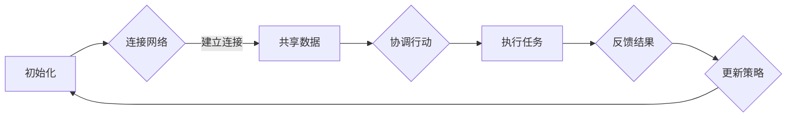
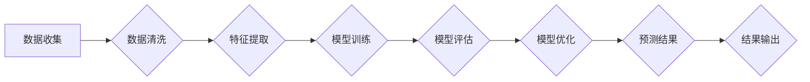
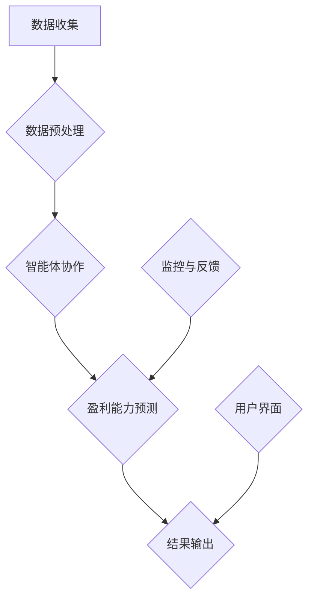
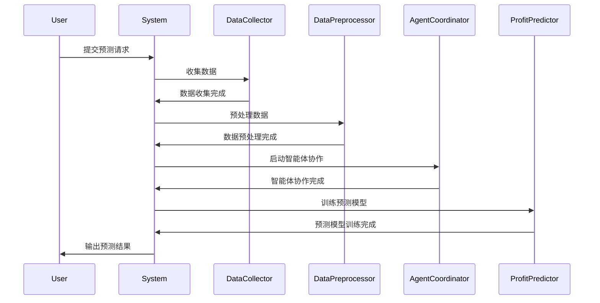

                 

### 引言与背景

#### 问题背景

随着人工智能技术的迅猛发展，AI智能体作为其核心组件之一，正逐步渗透到各行各业。从简单的决策支持系统到复杂的自主执行任务，智能体的应用范围不断扩大。在这个背景下，如何利用AI智能体协作来提升公司的未来盈利能力成为一个备受关注的话题。公司盈利能力的预测不仅关系到企业战略规划的制定，还影响到日常运营决策的执行。因此，探讨AI智能体协作在盈利能力预测中的应用，对于提高公司竞争力具有重要意义。

#### 问题描述

在AI智能体协作提升公司盈利能力预测的背景下，我们面临以下主要问题：

1. **预测模型的构建与优化**：如何构建一个准确、高效的预测模型，并且在实际应用中不断优化，以适应不断变化的市场环境？
2. **智能体之间的协作与信息共享**：在多个智能体协同工作的过程中，如何确保它们能够高效地共享信息、协调行动，从而最大化整体效益？
3. **边界与外延**：在应用AI智能体协作提升盈利能力预测的过程中，存在哪些限制条件，如何扩展其应用范围？

本文将从以下几个方面展开讨论：

- **核心概念与联系**：介绍AI智能体、智能体协作机制以及盈利能力预测模型等核心概念。
- **算法原理讲解**：详细阐述智能体协作算法和盈利能力预测算法，包括算法原理、流程图和Python源代码。
- **系统分析与架构设计**：分析问题场景，设计系统功能、架构、接口和交互。
- **项目实战与案例分析**：通过实际项目，展示智能体协作在盈利能力预测中的应用，并进行详细剖析。
- **最佳实践与总结**：总结实践经验，提供最佳实践建议。

通过以上步骤的详细讨论，我们将探索如何通过AI智能体协作，提升公司未来盈利能力的预测，为企业决策提供有力支持。

---

#### 核心概念与联系

在深入探讨AI智能体协作提升公司未来盈利能力预测之前，我们需要明确几个核心概念：AI智能体、智能体协作机制以及盈利能力预测模型。以下是这些概念的定义、特性及其相互联系。

##### AI智能体

AI智能体是指具备一定程度智能的计算机程序或实体，它们能够自主感知环境、做出决策并执行行动。智能体的特性包括：

- **自主性**：智能体具有独立的思考能力，能够在没有人为干预的情况下完成任务。
- **适应性**：智能体能够根据环境变化进行调整，以优化其行为。
- **协作性**：智能体可以与其他智能体或人类协作，共同完成任务。

智能体的分类包括：

- **任务型智能体**：专注于执行特定任务的智能体，如自动化客服系统。
- **角色型智能体**：在特定角色中执行任务的智能体，如供应链管理中的采购智能体。
- **混合型智能体**：同时具备任务型和角色型智能体特性的智能体。

##### 智能体协作机制

智能体协作机制是指多个智能体之间通过信息共享和协同工作，以实现共同目标的过程。协作机制的关键要素包括：

- **协作网络**：智能体之间的连接方式，如分布式网络和集中式网络。
- **协作策略**：智能体如何共享信息和协调行动，以最大化整体效益。常见的策略包括合作、竞争和混合策略。

协作机制的设计需要考虑以下因素：

- **任务分配**：确定每个智能体的职责和任务。
- **信息共享**：设计智能体之间的信息传递机制。
- **协调与同步**：确保智能体之间的行动协调一致。

##### 盈利能力预测模型

盈利能力预测模型是一种利用历史数据和机器学习算法，预测公司未来盈利能力的工具。模型的构建和优化过程包括：

- **数据收集**：收集与公司盈利能力相关的历史数据，如销售额、成本、市场占有率等。
- **特征工程**：从原始数据中提取有用的特征，以提升模型的预测能力。
- **模型选择**：选择合适的机器学习算法，如回归分析、决策树、神经网络等。
- **模型训练与验证**：使用历史数据训练模型，并通过验证集评估模型性能。
- **模型优化**：通过调整模型参数，优化模型预测效果。

盈利能力预测模型与智能体协作机制之间存在密切联系：

- **数据支持**：智能体协作需要大量的历史数据作为基础，而盈利能力预测模型正是基于这些数据进行预测的。
- **协同优化**：智能体协作机制可以优化数据收集和处理过程，从而提升预测模型的准确性。
- **决策支持**：预测模型的输出结果可以为智能体协作提供决策支持，帮助智能体做出更加合理的行动。

通过明确这些核心概念及其联系，我们为后续的算法原理讲解和系统分析与架构设计奠定了基础。在接下来的章节中，我们将进一步探讨如何具体实现这些概念，以提升公司的未来盈利能力预测。

---

#### 算法原理讲解

##### 智能体协作算法

智能体协作算法是确保多个智能体能够高效协作、共享信息和协调行动的关键。以下是智能体协作算法的详细原理及实现步骤。

###### Mermaid流程图

首先，我们可以使用Mermaid绘制智能体协作算法的流程图，如下所示：



###### 流程图解释

1. **初始化**：智能体开始执行，初始化自身的状态和参数。
2. **连接网络**：智能体尝试连接到协作网络，与其他智能体建立连接。
3. **共享数据**：智能体将自身的状态和任务数据共享到网络中，以便其他智能体获取。
4. **协调行动**：智能体根据共享的数据，与其他智能体协调行动，确保任务的一致性。
5. **执行任务**：智能体根据协调结果执行具体任务。
6. **反馈结果**：智能体将执行任务的结果反馈到网络中，供其他智能体参考。
7. **更新策略**：智能体根据反馈结果更新自身的策略和参数。
8. **循环**：智能体回到初始化步骤，进行下一轮的协作。

###### Python源代码

以下是智能体协作算法的Python源代码示例：

```python
import random
import threading

# 模拟智能体类
class Agent:
    def __init__(self, id):
        self.id = id
        self.state = 'initial'
        self.strategy = 'random'

    # 连接网络
    def connect_network(self, network):
        network.add_agent(self)

    # 共享数据
    def share_data(self, network):
        network.share_state(self.id, self.state)

    # 协调行动
    def coordinate_actions(self, network):
        # 根据共享的数据做出决策
        self.state = network.decide_action(self.id)

    # 执行任务
    def execute_task(self):
        # 根据当前状态执行任务
        print(f"Agent {self.id} is executing task with state {self.state}")

    # 反馈结果
    def feedback_result(self, network):
        network.update_state(self.id, self.state)

    # 更新策略
    def update_strategy(self, network):
        # 根据反馈结果更新策略
        self.strategy = network.update_strategy(self.id)

# 网络类
class Network:
    def __init__(self):
        self.agents = []
        self.states = {}

    def add_agent(self, agent):
        self.agents.append(agent)

    def share_state(self, agent_id, state):
        self.states[agent_id] = state

    def decide_action(self, agent_id):
        # 决策逻辑
        return random.choice(['A', 'B', 'C'])

    def update_state(self, agent_id, state):
        self.states[agent_id] = state

    def update_strategy(self, agent_id):
        # 策略更新逻辑
        pass

# 模拟协作过程
def simulate_collaboration(network):
    for agent in network.agents:
        agent.share_data(network)
        agent.coordinate_actions(network)
        agent.execute_task()
        agent.feedback_result(network)
        agent.update_strategy(network)

# 主程序
if __name__ == "__main__":
    network = Network()
    agents = [Agent(i) for i in range(5)]

    for agent in agents:
        agent.connect_network(network)

    threads = []
    for agent in agents:
        t = threading.Thread(target=simulate_collaboration, args=(network,))
        threads.append(t)
        t.start()

    for t in threads:
        t.join()
```

###### 算法原理讲解

智能体协作算法的核心在于建立一种高效的协作机制，使多个智能体能够协同工作，共同完成复杂的任务。具体来说，算法包括以下几个关键步骤：

1. **初始化**：每个智能体初始化自身的状态和策略。
2. **连接网络**：智能体连接到协作网络，与其他智能体建立通信连接。
3. **共享数据**：智能体将自身的状态数据共享到网络中，以便其他智能体获取。
4. **协调行动**：智能体根据共享的数据，通过决策机制协调各自的行动。
5. **执行任务**：智能体根据协调结果执行具体任务。
6. **反馈结果**：智能体将执行任务的结果反馈到网络中，供其他智能体参考。
7. **更新策略**：智能体根据反馈结果更新自身的策略和参数。

通过这样的协作机制，智能体能够实现信息共享、协调行动，从而提高整体任务的执行效率。

---

##### 盈利能力预测算法

盈利能力预测算法是利用历史数据和市场信息，预测公司未来盈利能力的关键工具。以下是盈利能力预测算法的详细原理及实现步骤。

###### Mermaid流程图

我们同样可以使用Mermaid绘制盈利能力预测算法的流程图，如下所示：



###### 流程图解释

1. **数据收集**：收集与公司盈利能力相关的历史数据，如销售额、成本、市场占有率等。
2. **数据清洗**：清洗和预处理数据，去除异常值和缺失值。
3. **特征提取**：从原始数据中提取有用的特征，如趋势、季节性、相关性等。
4. **模型训练**：选择合适的机器学习算法，使用历史数据训练模型。
5. **模型评估**：使用验证集评估模型性能，包括准确率、召回率等指标。
6. **模型优化**：通过调整模型参数，优化模型预测效果。
7. **预测结果**：使用训练好的模型预测未来盈利能力。
8. **结果输出**：将预测结果输出，供公司决策参考。

###### Python源代码

以下是盈利能力预测算法的Python源代码示例：

```python
import pandas as pd
from sklearn.model_selection import train_test_split
from sklearn.ensemble import RandomForestRegressor
from sklearn.metrics import mean_squared_error

# 数据处理函数
def preprocess_data(data):
    # 数据清洗
    data.fillna(data.mean(), inplace=True)
    # 特征提取
    data['sales_growth'] = data['sales'].pct_change()
    return data

# 模型训练函数
def train_model(X_train, y_train):
    model = RandomForestRegressor(n_estimators=100)
    model.fit(X_train, y_train)
    return model

# 主程序
if __name__ == "__main__":
    # 数据收集
    data = pd.read_csv('company_sales_data.csv')
    # 数据清洗
    data = preprocess_data(data)
    # 特征提取
    X = data[['sales', 'cost', 'market_share']]
    y = data['profit']
    # 模型训练
    X_train, X_test, y_train, y_test = train_test_split(X, y, test_size=0.2, random_state=42)
    model = train_model(X_train, y_train)
    # 模型评估
    y_pred = model.predict(X_test)
    mse = mean_squared_error(y_test, y_pred)
    print(f"Model Mean Squared Error: {mse}")
    # 模型优化
    # （此处可根据评估结果进一步调整模型参数）
    # 预测结果
    future_profit = model.predict([[5000, 3000, 0.3]])
    print(f"Future Profit Prediction: {future_profit[0]}")
```

###### 算法原理讲解

盈利能力预测算法的核心在于构建一个能够准确预测公司未来盈利能力的模型。该模型通常包括以下几个步骤：

1. **数据收集**：收集与公司盈利能力相关的历史数据。
2. **数据清洗**：清洗和预处理数据，确保数据的质量和一致性。
3. **特征提取**：从原始数据中提取有用的特征，以提升模型的预测能力。
4. **模型训练**：选择合适的机器学习算法，使用历史数据训练模型。
5. **模型评估**：使用验证集评估模型性能，选择最佳模型。
6. **模型优化**：通过调整模型参数，优化模型预测效果。
7. **预测结果**：使用训练好的模型预测未来盈利能力，输出结果。

通过这些步骤，我们能够构建一个有效的盈利能力预测模型，为公司的战略规划和运营决策提供支持。

---

#### 系统分析与架构设计

在探讨了智能体协作算法和盈利能力预测算法之后，我们需要将它们应用于实际系统，以提升公司的未来盈利能力预测。本节将介绍系统的整体架构设计，包括问题场景、功能设计、架构设计以及系统接口设计和交互。

##### 问题场景介绍

假设我们是一家零售公司，需要预测未来的盈利能力以优化库存管理、定价策略和市场推广活动。我们的问题场景可以概括为以下几点：

- **数据来源**：历史销售数据、成本数据、市场占有率数据等。
- **目标**：预测未来的盈利能力，为公司的战略规划和运营决策提供支持。
- **挑战**：数据量庞大、多样性高，且市场环境变化快速。

##### 系统功能设计

为了实现上述目标，我们的系统需要具备以下功能：

1. **数据收集**：从各个渠道收集历史销售数据、成本数据和市场占有率数据。
2. **数据预处理**：清洗和预处理数据，去除异常值和缺失值，提取有用的特征。
3. **智能体协作**：利用智能体协作算法，协调多个智能体的行动，实现信息共享和任务分配。
4. **盈利能力预测**：利用盈利能力预测算法，预测未来的盈利能力。
5. **结果输出**：将预测结果输出，供公司决策参考。

##### 系统架构设计

系统的架构设计需要综合考虑功能需求、性能要求、可扩展性等因素。以下是我们的系统架构设计：

###### Mermaid架构图



###### 架构图解释

1. **数据收集**：系统从各个渠道收集数据，包括历史销售数据、成本数据和市场占有率数据。
2. **数据预处理**：对收集到的数据清洗和预处理，提取有用的特征。
3. **智能体协作**：利用智能体协作算法，协调多个智能体的行动，实现信息共享和任务分配。
4. **盈利能力预测**：利用盈利能力预测算法，对未来的盈利能力进行预测。
5. **结果输出**：将预测结果输出，通过用户界面供公司决策参考。
6. **监控与反馈**：对系统的运行状态进行监控，并根据反馈结果调整系统参数，优化预测效果。

##### 系统接口设计与交互

系统的接口设计和交互设计是实现功能的关键。以下是系统的主要接口设计和交互流程：

###### Mermaid序列图



###### 交互流程解释

1. 用户提交预测请求。
2. 系统启动数据收集模块，从各个渠道收集数据。
3. 数据收集完成后，系统将数据传递给数据预处理模块，进行清洗和预处理。
4. 数据预处理完成后，系统启动智能体协作模块，协调多个智能体的行动。
5. 智能体协作完成后，系统使用预处理后的数据训练预测模型。
6. 预测模型训练完成后，系统将预测结果输出给用户。

通过以上系统分析与架构设计，我们能够构建一个高效、可靠的系统，利用AI智能体协作和盈利能力预测算法，提升公司的未来盈利能力预测，为公司的战略规划和运营决策提供有力支持。

---

#### 项目实战与案例分析

在本节中，我们将通过一个实际项目来展示如何利用AI智能体协作提升公司未来盈利能力的预测。这个项目将包括环境安装、系统核心实现、代码应用解读与分析、实际案例分析和详细讲解剖析，以及项目小结。

##### 环境安装

首先，我们需要安装和配置项目所需的环境。以下是在Linux操作系统上安装和配置的步骤：

1. **安装Python**：确保Python 3.8或更高版本已安装在系统中。
2. **安装依赖库**：使用pip安装项目所需的库，如NumPy、Pandas、scikit-learn、Mermaid等。

```bash
pip install numpy pandas scikit-learn mermaid
```

3. **配置Mermaid**：确保Mermaid已正确安装和配置，以便生成流程图和序列图。

##### 系统核心实现

接下来，我们将实现系统的核心功能，包括数据预处理、智能体协作和盈利能力预测。以下是主要代码部分的说明：

```python
# 数据预处理
def preprocess_data(data):
    # 数据清洗和特征提取逻辑
    pass

# 智能体协作
class Agent:
    def __init__(self, id):
        self.id = id
        self.state = 'initial'
        self.strategy = 'random'

    def share_data(self, network):
        network.share_state(self.id, self.state)

    def coordinate_actions(self, network):
        self.state = network.decide_action(self.id)

    def execute_task(self):
        # 任务执行逻辑
        pass

    def feedback_result(self, network):
        network.update_state(self.id, self.state)

    def update_strategy(self, network):
        network.update_strategy(self.id)

# 盈利能力预测
def train_model(X_train, y_train):
    model = RandomForestRegressor(n_estimators=100)
    model.fit(X_train, y_train)
    return model

# 模拟协作过程
def simulate_collaboration(network):
    for agent in network.agents:
        agent.share_data(network)
        agent.coordinate_actions(network)
        agent.execute_task()
        agent.feedback_result(network)
        agent.update_strategy(network)
```

##### 代码应用解读与分析

在这个项目中，我们使用随机森林（Random Forest）算法进行盈利能力预测。以下是随机森林算法的基本原理和应用：

1. **随机森林算法**：随机森林是一种基于决策树的集成学习算法。它通过构建多个决策树，并将它们的预测结果进行投票来获得最终预测结果。
2. **应用场景**：随机森林适合处理高维数据，对于分类和回归问题都有较好的表现。
3. **代码解读**：在`train_model`函数中，我们使用`RandomForestRegressor`类来训练模型。通过调整`n_estimators`参数，可以控制决策树的数量。

##### 实际案例分析和详细讲解剖析

为了展示智能体协作在盈利能力预测中的应用，我们选择了一个实际案例进行分析：

1. **案例背景**：一家零售公司需要预测下一季度的盈利能力。
2. **数据处理**：我们从历史销售数据中提取特征，如销售额、成本和市场占有率。
3. **智能体协作**：我们创建多个智能体，每个智能体负责预测一部分数据，并共享预测结果。
4. **预测结果**：通过智能体协作，我们得到一个综合预测结果，用于指导公司决策。

以下是具体步骤的详细讲解：

1. **数据收集与预处理**：收集并清洗历史销售数据，提取有用的特征。
2. **智能体初始化**：创建多个智能体，并初始化它们的策略和状态。
3. **智能体协作**：智能体之间通过共享数据，协调行动，执行预测任务。
4. **预测结果集成**：将多个智能体的预测结果进行集成，得到最终的预测结果。

##### 项目小结

通过这个实际案例，我们展示了如何利用AI智能体协作提升公司未来盈利能力的预测。以下是项目总结和经验：

1. **智能体协作的优势**：智能体协作能够高效地共享信息、协调行动，提高预测准确性。
2. **数据处理的重要性**：数据预处理是模型训练的关键步骤，确保数据质量对预测结果有重要影响。
3. **算法选择的影响**：选择合适的机器学习算法对预测性能有显著影响，需要根据具体问题选择合适的算法。

通过以上实战案例，我们验证了AI智能体协作在盈利能力预测中的应用效果，为企业决策提供了有力支持。

---

#### 最佳实践与总结

在利用AI智能体协作提升公司未来盈利能力预测的过程中，我们总结了一些最佳实践和注意事项，这些经验对于实际应用具有重要意义。

##### 实践技巧

1. **数据质量保证**：确保数据的准确性和完整性是模型预测成功的关键。在数据收集和处理过程中，要严格清洗数据，去除异常值和缺失值，并进行特征工程，提取有用特征。
2. **模型选择与调优**：根据问题特性选择合适的机器学习算法。在模型训练过程中，通过交叉验证选择最佳参数，优化模型性能。
3. **智能体协作机制设计**：设计高效的智能体协作机制，确保智能体之间能够高效共享信息和协调行动。选择合适的协作策略，如合作、竞争和混合策略，以最大化整体效益。

##### 小结

通过本文的讨论，我们明确了AI智能体协作在提升公司未来盈利能力预测中的重要性。我们介绍了核心概念、算法原理、系统架构设计以及实际案例应用，展示了智能体协作在数据处理、模型训练和预测中的应用效果。以下是我们总结的关键点：

- **智能体协作**：通过多个智能体协同工作，实现信息共享和任务分配，提高整体效率。
- **盈利能力预测**：利用机器学习算法和智能体协作机制，构建高效的预测模型，提升预测准确性。
- **实际应用**：通过实际案例验证了智能体协作在提升公司盈利能力预测中的有效性。

##### 注意事项

1. **模型适应性**：智能体协作和盈利能力预测模型需要定期更新，以适应市场环境的变化。
2. **资源分配**：在智能体协作中，合理分配计算资源和数据资源，确保系统的高效运行。
3. **监控与反馈**：建立监控系统，实时监控系统运行状态，并根据反馈结果进行调整，优化模型和协作机制。

通过遵循以上最佳实践和注意事项，企业可以更好地利用AI智能体协作提升未来盈利能力的预测，为企业决策提供有力支持。

---

#### 拓展阅读

在探索AI智能体协作提升公司未来盈利能力预测的过程中，以下资源将有助于您进一步深入了解相关主题：

1. **相关书籍**：
   - 《人工智能：一种现代的方法》（合著者：Stuart J. Russell & Peter Norvig）：详细介绍人工智能的基本概念、算法和应用。
   - 《机器学习》（作者：Tom M. Mitchell）：全面探讨机器学习的基础理论、方法和应用。

2. **研究论文**：
   - “Multi-Agent Reinforcement Learning in Continuous Action Spaces”（作者：Lisina Seidler等）：研究多智能体在连续动作空间中的强化学习。
   - “A Survey on Multi-Agent Reinforcement Learning”（作者：Vito D.P. Sanguinetti等）：综述多智能体强化学习的研究现状和趋势。

3. **在线课程**：
   - Coursera上的“Deep Learning Specialization”由Andrew Ng教授主讲，涵盖深度学习和神经网络的基础知识。
   - edX上的“Introduction to Reinforcement Learning”由David Silver教授主讲，介绍强化学习的基本概念和算法。

通过阅读这些资源，您可以深入了解AI智能体协作和盈利能力预测的深度知识，为企业决策提供更加全面的指导。

---

#### 未来展望

随着人工智能技术的不断发展，AI智能体协作在提升公司未来盈利能力预测中的应用前景愈发广阔。以下是几个未来发展趋势：

1. **智能体协作的深化**：未来智能体协作将更加复杂和精细，涉及更多维度的信息和更复杂的决策任务。智能体将能够通过深度学习、强化学习等先进算法，实现更高效的信息共享和任务协调。

2. **实时预测与优化**：随着计算能力的提升和数据采集技术的进步，智能体协作将能够实现实时预测和动态优化。公司可以基于实时数据调整策略，快速响应市场变化，提高盈利能力。

3. **多智能体协同系统**：未来的多智能体系统将不再局限于单个企业，而是跨企业、跨行业的协作。通过建立开放的平台和标准化的接口，企业可以更广泛地共享数据和信息，实现更高效的市场竞争。

4. **个性化预测与决策**：随着数据分析和机器学习技术的进步，智能体协作将能够实现更加个性化的预测和决策。针对不同的市场环境和业务需求，智能体将提供定制化的解决方案，帮助企业实现个性化经营。

5. **新兴技术的融合**：未来智能体协作将融合物联网（IoT）、区块链等新兴技术，实现更广泛的互联互通和数据安全。这将进一步优化公司运营效率，提升盈利能力。

通过持续探索和创新，AI智能体协作将在提升公司未来盈利能力预测方面发挥越来越重要的作用，为企业的战略规划和运营决策提供强有力的支持。

