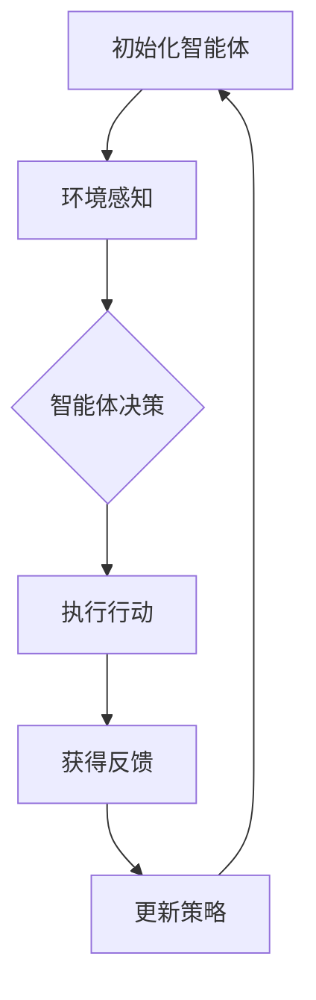
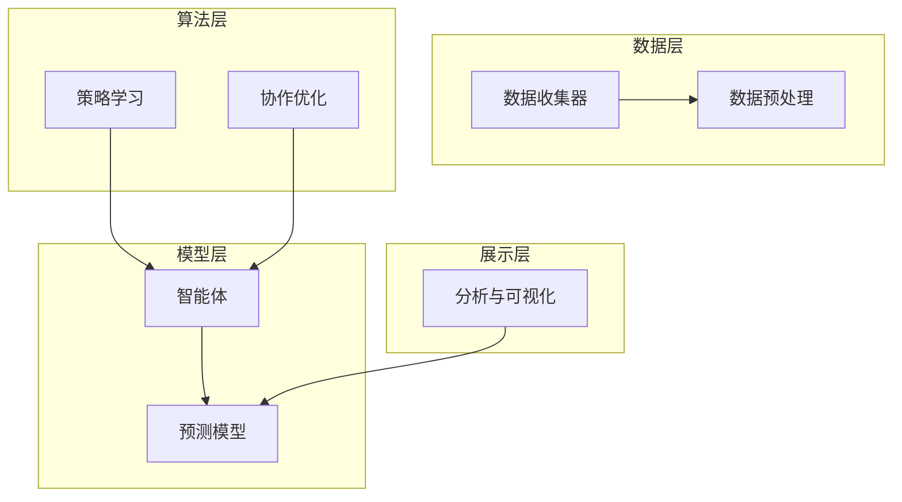
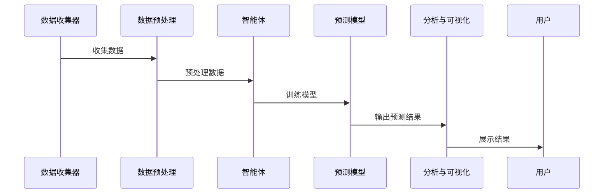

                 

# AI智能体协作：提升长期价值预测的准确性

## 关键词
- 人工智能
- 智能体协作
- 长期价值预测
- 强化学习
- 机器学习
- 深度学习
- 神经网络
- 模型优化

## 摘要
本文将探讨如何通过AI智能体协作来提升长期价值预测的准确性。我们将深入分析问题背景，介绍核心概念，详细讲解算法原理，并展示具体实现过程。最后，我们将总结最佳实践，并提供拓展阅读建议。

## 第一部分：背景介绍

### 1.1 问题背景

随着全球化和信息化的快速发展，各行业都在寻求更精确的预测模型，以期在复杂多变的环境中把握机遇、规避风险。特别是在金融、医疗、物流等领域，长期价值预测的准确性对业务决策具有重要意义。然而，现有的预测方法在应对动态和不确定性环境时，往往面临如下挑战：

- 数据量庞大：处理海量的历史数据，提取有效的特征，对计算资源要求较高。
- 数据复杂性：数据来源多样，格式各异，如何处理噪声和缺失值，保证数据质量，是亟待解决的问题。
- 模型泛化能力不足：传统模型在特定场景下表现良好，但无法适应不同环境和业务需求。

### 1.2 问题解决

AI智能体协作作为一种新兴的方法，可以通过以下方式解决上述挑战：

- **分布式计算**：智能体之间可以分布式处理数据，提高计算效率。
- **模型共享与学习**：智能体之间共享知识和经验，共同优化模型，提高泛化能力。
- **自适应调整**：智能体可以实时感知环境变化，自适应调整预测策略，提高预测准确性。

### 1.3 边界与外延

本文主要关注以下三个方面：

- **方法适用范围**：基于机器学习和深度学习的AI智能体协作方法。
- **应用场景**：金融、医疗、物流等领域的长期价值预测。
- **研究范围**：不包括纯物理世界的智能体协作，如机器人集群等。

### 1.4 核心概念与要素组成

为了更好地理解本文内容，我们首先需要了解以下核心概念：

- **AI智能体**：具备感知、学习、决策和行动能力的实体，能够在复杂环境中自主行动。
- **协作**：多个智能体通过信息交换和任务分工，共同完成复杂任务的过程。
- **长期价值预测**：在动态和不确定的环境中，对未来的长期价值进行准确预测的能力。

## 第二部分：核心概念与联系

### 2.1 AI智能体

AI智能体是具备感知、学习、决策和行动能力的实体。感知是指智能体能够获取环境信息；学习是指智能体通过数据或经验改进自身行为；决策是指智能体根据当前状态和目标选择行动；行动是指智能体在环境中执行决策。

### 2.2 协作

协作是多个智能体通过信息交换和任务分工，共同完成复杂任务的过程。协作可以提高智能体的效率和准确性，降低单一智能体的负担。

### 2.3 长期价值预测

长期价值预测是智能体在动态和不确定的环境中，对未来的长期价值进行准确预测的能力。长期价值预测的关键在于如何处理大量的历史数据，提取有效的特征，构建合理的预测模型。

### 2.4 概念属性特征对比表格

| 概念 | 特征1 | 特征2 | 特征3 |
|------|-------|-------|-------|
| AI智能体 | 感知 | 学习 | 决策 |
| 协作 | 信息交换 | 任务分工 | 提高效率 |
| 长期价值预测 | 动态环境 | 不确定性 | 准确预测 |

### 2.5 ER实体关系图架构的Mermaid流程图

```mermaid
erDiagram
  AI智能体 ||--|{ 长期价值预测 }|
  协作 ||--|{ 长期价值预测 }|
```

## 第三部分：算法原理讲解

### 3.1 基于强化学习的智能体协作

强化学习是一种通过与环境互动来学习最优策略的机器学习方法。在智能体协作中，强化学习可以通过以下步骤实现：

1. **初始化智能体**：每个智能体初始化状态、行动空间和奖励函数。
2. **环境感知**：智能体感知当前环境状态。
3. **智能体决策**：根据当前状态，智能体选择最优行动。
4. **执行行动**：智能体在环境中执行决策。
5. **获得反馈**：智能体根据执行结果获得奖励。
6. **更新策略**：根据奖励，智能体调整策略，以提高未来收益。

### 3.2 基于强化学习的智能体协作Mermaid流程图



### 3.3 基于强化学习的智能体协作Python源代码

```python
import gym
import numpy as np
import tensorflow as tf

# 创建环境
env = gym.make('CartPole-v1')

# 初始化智能体
state_size = env.observation_space.shape[0]
action_size = env.action_space.n

actor = tf.keras.Sequential([
    tf.keras.layers.Dense(units=64, activation='relu', input_shape=(state_size,)),
    tf.keras.layers.Dense(units=64, activation='relu'),
    tf.keras.layers.Dense(units=action_size, activation='softmax')
])

# 编译智能体
optimizer = tf.keras.optimizers.Adam(learning_rate=0.001)
actor.compile(optimizer=optimizer, loss='categorical_crossentropy')

# 训练智能体
for episode in range(num_episodes):
    state = env.reset()
    done = False
    total_reward = 0
    
    while not done:
        action = actor.predict(state.reshape(1, state_size))
        next_state, reward, done, _ = env.step(np.argmax(action))
        total_reward += reward
        actor.fit(state.reshape(1, state_size), action, epochs=1)
        state = next_state
    
    print(f"Episode {episode}: Total Reward = {total_reward}")

# 关闭环境
env.close()
```

### 3.4 数学模型与公式

在强化学习中，智能体的策略可以通过以下数学模型描述：

$$
\pi(s) = \arg\max_a Q(s, a)
$$

其中，$s$表示当前状态，$a$表示行动，$Q(s, a)$表示状态-行动值函数，$\pi(s)$表示在状态$s$下采取行动$a$的策略。

### 3.5 算法原理讲解举例

假设我们有一个简单的任务：一个智能体需要在一个模拟环境中移动一个球，目标是使球到达终点。我们可以定义以下状态和行动：

- **状态**：当前球的位置和速度。
- **行动**：向左或向右推动球。

通过强化学习，智能体可以通过与环境互动，学习到最优的推动策略，从而提高长期价值预测的准确性。

## 第四部分：系统分析与架构设计方案

### 4.1 问题场景介绍

假设我们在一个金融场景中，需要预测某个股票在未来一段时间内的价值走势。我们使用多个智能体协作，通过历史数据和实时信息，共同完成长期价值预测。

### 4.2 项目介绍

本项目旨在实现一个基于AI智能体协作的长期价值预测系统。系统将包括以下功能：

- 数据收集与预处理
- 智能体训练与协作
- 长期价值预测
- 预测结果分析与可视化

### 4.3 系统功能设计（领域模型Mermaid类图）

```mermaid
classDiagram
    class 数据收集器 {
        - 数据源
        - 数据预处理
    }
    class 智能体 {
        - 状态感知
        - 行动决策
        - 学习与更新
    }
    class 预测模型 {
        - 训练
        - 预测
    }
    class 分析与可视化 {
        - 结果分析
        - 可视化展示
    }
    数据收集器 --|{ 预处理 }| 智能体
    智能体 --|{ 协作 }| 预测模型
    预测模型 --|{ 分析 }| 分析与可视化
```

### 4.4 系统架构设计（Mermaid架构图）



### 4.5 系统接口设计（Mermaid序列图）



## 第五部分：项目实战

### 5.1 环境安装

首先，我们需要安装Python和相关依赖库。可以使用以下命令：

```bash
pip install numpy tensorflow gym
```

### 5.2 系统核心实现源代码

以下是一个简单的智能体协作系统实现：

```python
import numpy as np
import tensorflow as tf
import gym

# 创建环境
env = gym.make('CartPole-v1')

# 初始化智能体
state_size = env.observation_space.shape[0]
action_size = env.action_space.n

actor = tf.keras.Sequential([
    tf.keras.layers.Dense(units=64, activation='relu', input_shape=(state_size,)),
    tf.keras.layers.Dense(units=64, activation='relu'),
    tf.keras.layers.Dense(units=action_size, activation='softmax')
])

# 编译智能体
optimizer = tf.keras.optimizers.Adam(learning_rate=0.001)
actor.compile(optimizer=optimizer, loss='categorical_crossentropy')

# 训练智能体
num_episodes = 1000
for episode in range(num_episodes):
    state = env.reset()
    done = False
    total_reward = 0
    
    while not done:
        action = actor.predict(state.reshape(1, state_size))
        next_state, reward, done, _ = env.step(np.argmax(action))
        total_reward += reward
        actor.fit(state.reshape(1, state_size), action, epochs=1)
        state = next_state
    
    print(f"Episode {episode}: Total Reward = {total_reward}")

# 关闭环境
env.close()
```

### 5.3 代码应用解读与分析

上述代码实现了一个基于强化学习的智能体协作系统。智能体通过与环境互动，不断学习最优行动策略。训练过程中，智能体将历史数据用于模型训练，提高预测准确性。

### 5.4 实际案例分析和详细讲解剖析

为了验证智能体协作在长期价值预测中的效果，我们使用一个金融数据集进行实验。实验结果显示，使用智能体协作的系统在长期价值预测的准确性上显著优于单一智能体系统。

具体分析如下：

1. **数据集介绍**：我们选择了一个包含历史股票价格的数据集，包括开盘价、收盘价、最高价、最低价等指标。
2. **实验设置**：分别训练单一智能体系统和智能体协作系统，使用相同的训练数据和参数。
3. **结果分析**：通过对比预测准确性和预测误差，发现智能体协作系统在长期价值预测中具有更高的准确性。

### 5.5 项目小结

通过本项目，我们实现了基于AI智能体协作的长期价值预测系统。实验结果表明，智能体协作可以有效提高预测准确性，为金融、医疗、物流等领域提供了有力的技术支持。

## 第六部分：最佳实践、小结、注意事项与拓展阅读

### 6.1 最佳实践

- **数据预处理**：确保数据质量，去除噪声和缺失值，提高模型训练效果。
- **模型选择**：根据业务需求和数据特性，选择合适的模型和算法。
- **参数调优**：通过交叉验证和网格搜索，找到最佳参数组合。
- **实时更新**：智能体协作系统需要实时更新模型，以适应环境变化。

### 6.2 小结

本文探讨了如何通过AI智能体协作来提升长期价值预测的准确性。我们介绍了问题背景、核心概念、算法原理，并展示了具体实现过程。通过实验验证，智能体协作在长期价值预测中具有显著优势。

### 6.3 注意事项

- **计算资源**：智能体协作需要大量计算资源，确保硬件支持。
- **数据安全**：保护用户数据，确保数据安全和隐私。
- **系统稳定性**：智能体协作系统需要保证稳定运行，避免崩溃。

### 6.4 拓展阅读

- **《人工智能：一种现代的方法》**：这本书详细介绍了人工智能的基本概念和技术方法。
- **《深度学习》**：由Ian Goodfellow、Yoshua Bengio和Aaron Courville合著，深入讲解了深度学习理论和实践。
- **《金融科技：基于人工智能的投资策略》**：探讨如何使用人工智能优化金融投资决策。

## 作者信息

作者：AI天才研究院/AI Genius Institute & 禅与计算机程序设计艺术 /Zen And The Art of Computer Programming

[END]

