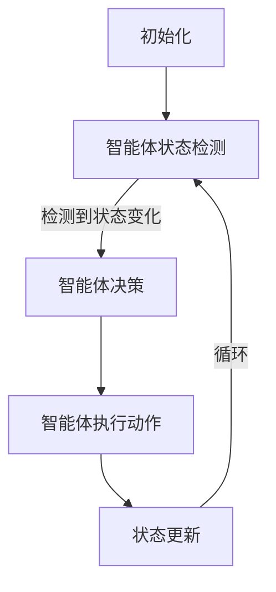
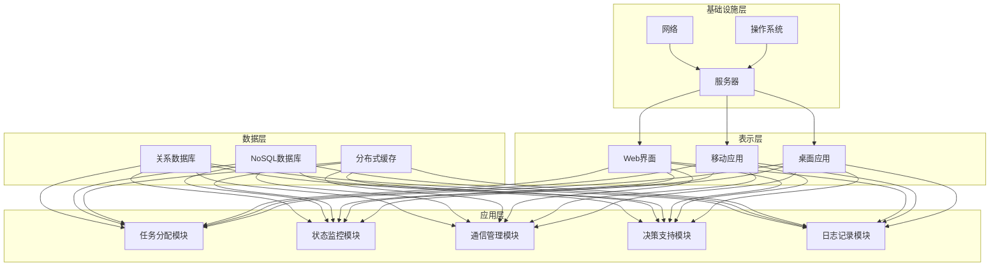
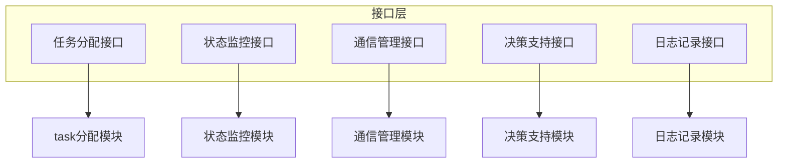
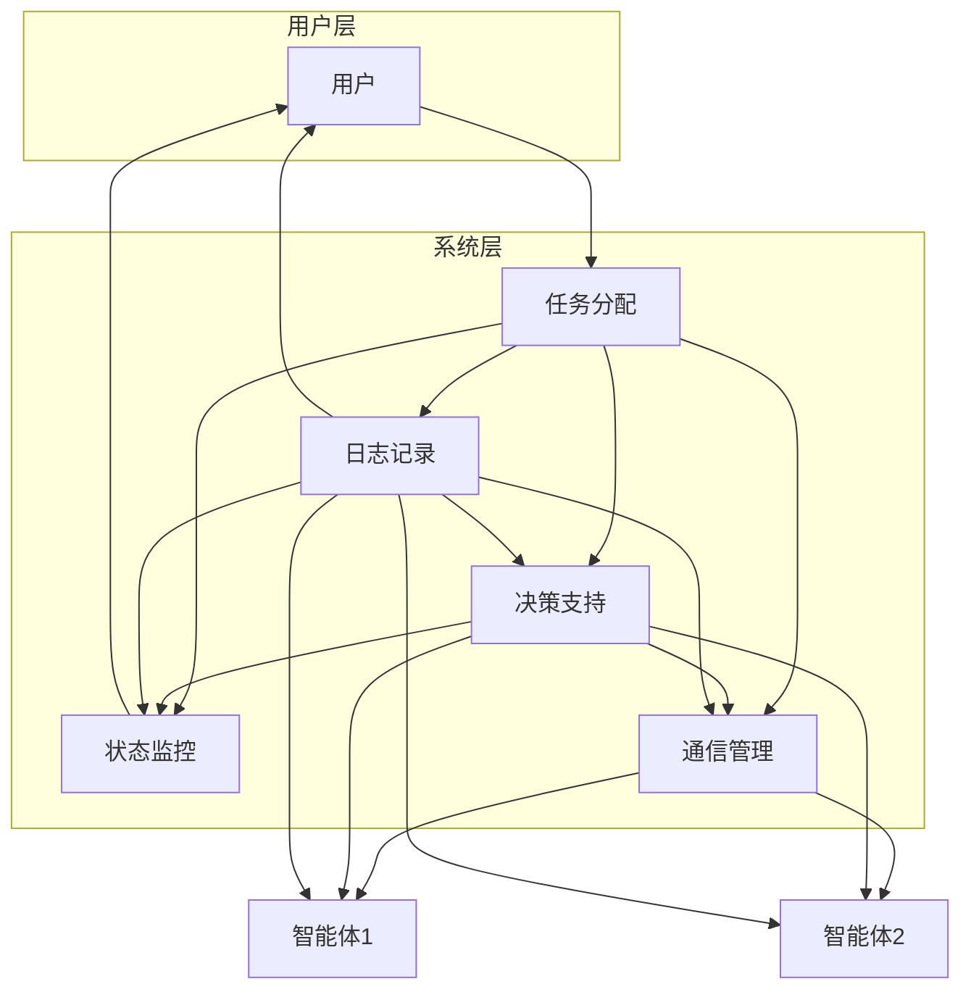

                 


### 第1章：AI智能体协作概述

#### 1.1 AI智能体协作的背景和意义

AI智能体协作是人工智能领域的一个重要研究方向，其背景可以追溯到人工智能发展的早期阶段。随着计算机技术的发展，人工智能从最初的规则推理、知识表示，逐步发展到今天的数据驱动、自主学习。在这个过程中，单一智能体已经不能满足复杂问题的解决需求，因此，智能体协作成为了必然趋势。

AI智能体协作的意义主要体现在以下几个方面：

- **提高效率**：通过智能体之间的协作，可以实现任务的并行处理，从而大大提高工作效率。
- **增强智能**：协作的智能体可以共享信息，学习更复杂的任务模式，从而增强智能体的智能水平。
- **降低成本**：智能体协作可以减少对人类干预的需求，从而降低运营成本。
- **提升决策能力**：协作的智能体可以通过综合不同智能体的决策信息，做出更合理的决策。

#### 1.2 AI智能体的定义和特征

AI智能体是一种能够在特定环境中感知、决策并执行动作的计算机程序。智能体的主要特征包括：

- **自主性**：智能体能够在没有外界干预的情况下执行任务。
- **适应性**：智能体可以根据环境变化调整自己的行为。
- **交互性**：智能体之间能够进行信息交换和协同工作。
- **学习性**：智能体能够通过经验和数据不断改进自己的行为。

与传统算法相比，智能体的关键区别在于其具有自主性、适应性和交互性，这使得智能体能够在动态环境中自主完成任务。

#### 1.3 AI智能体协作的关键概念

AI智能体协作涉及到多个关键概念，包括：

- **智能体协作模型**：描述智能体如何通过交互实现共同目标。
- **多智能体系统的交互机制**：确定智能体之间的通信方式和协作规则。
- **智能体协作的挑战与对策**：解决协作中的各种难题，如通信延迟、资源分配等。

在AI智能体协作的研究和应用中，这些关键概念起着至关重要的作用。

#### 1.4 AI智能体协作的研究现状与应用领域

AI智能体协作的研究已经取得了一系列重要成果。目前，国内外研究主要集中在以下几个方面：

- **协作算法**：研究各种协作算法的原理、实现和应用。
- **应用场景**：探索智能体协作在不同领域的应用，如自动驾驶、智能客服等。
- **系统设计**：设计高效、稳定的智能体协作系统。

应用领域包括：

- **智能制造**：通过智能体协作实现生产线的自动化和智能化。
- **金融科技**：利用智能体协作进行风险管理和投资决策。
- **物流管理**：优化物流流程，提高配送效率。

未来，AI智能体协作将继续发展和创新，为各行业带来更多变革。

#### 1.5 本章小结

本章介绍了AI智能体协作的背景和意义，定义了AI智能体的主要特征，阐述了智能体协作的关键概念，并分析了智能体协作的研究现状和应用领域。通过对本章内容的理解，读者可以初步了解AI智能体协作的基本概念和重要性。

### 第2章：AI智能体协作算法原理

#### 2.1 AI智能体协作算法概述

AI智能体协作算法是智能体协作系统的核心组成部分，其主要目标是实现智能体之间的信息共享、决策协同和任务分配。在智能体协作算法中，常见类型包括基于博弈论的算法、基于社会计算的算法和基于多智能体强化学习的算法。

智能体协作算法的基本原理是利用数学模型来描述智能体之间的交互过程，并通过算法优化来实现协作目标。以下是几种主要协作算法的基本原理：

- **基于博弈论的算法**：博弈论是一种研究具有冲突和合作的情境的数学工具，它通过定义参与者的策略、支付函数和均衡状态，来分析合作与竞争的结果。
- **基于社会计算的算法**：社会计算是一种结合社会网络分析和计算技术的领域，它通过模拟人类社会的行为模式，来优化智能体的协作策略。
- **基于多智能体强化学习的算法**：强化学习是一种通过试错和奖励机制来学习策略的机器学习技术，它适用于动态和不确定的环境中，通过智能体之间的互动来优化协作效果。

#### 2.2 协作算法的数学模型与公式

协作算法的数学模型通常包括状态空间、动作空间、策略空间和奖励函数等基本组成部分。以下是一个简单的多智能体协同任务的数学模型：

- **状态空间 \( S \)**：描述智能体所处的环境状态，如任务进度、资源分布等。
- **动作空间 \( A \)**：描述智能体可以采取的动作，如移动、请求资源、分配任务等。
- **策略空间 \( \Pi \)**：描述智能体的行为策略，即智能体如何根据当前状态选择动作。
- **奖励函数 \( R(s, a) \)**：定义智能体采取动作 \( a \) 在状态 \( s \) 下的奖励，用于评估智能体的行为效果。

常见的奖励函数形式包括：

- **线性奖励函数**：奖励与任务完成度成正比，公式为 \( R(s, a) = \beta \times (1 - \text{task\_completion}) \)，其中 \( \beta \) 是一个调节系数。
- **对数奖励函数**：奖励与任务完成度的对数成正比，公式为 \( R(s, a) = \alpha \times \log(\text{task\_completion}) \)，其中 \( \alpha \) 是一个调节系数。

#### 2.3 协作算法的mermaid流程图

使用mermaid流程图可以直观地展示智能体协作算法的执行过程。以下是一个基于博弈论的智能体协作算法的mermaid流程图示例：



#### 2.4 Python源代码实现与算法解释

为了更好地理解智能体协作算法，我们可以使用Python语言来实现一个简单的多智能体协同任务。以下是一个基于强化学习的协作算法的Python代码示例：

```python
import numpy as np
import random

# 智能体类定义
class Agent:
    def __init__(self, state_size, action_size):
        self.state_size = state_size
        self.action_size = action_size
        self.q_table = np.zeros((state_size, action_size))
        
    # Q值更新函数
    def update_q_table(self, state, action, reward, next_state, alpha, gamma):
        qpredicted = self.q_table[state, action]
        qnextmax = np.max(self.q_table[next_state, :])
        qtarget = reward + gamma * qnextmax
        delta = qtarget - qpredicted
        self.q_table[state, action] += alpha * delta

    # 选择动作函数
    def choose_action(self, state, epsilon):
        if random.uniform(0, 1) < epsilon:
            action = random.randint(0, self.action_size - 1)
        else:
            action = np.argmax(self.q_table[state, :])
        return action

# 智能体协作算法实现
def cooperative_agents-learning(state_size, action_size, episodes, alpha, gamma, epsilon):
    agent1 = Agent(state_size, action_size)
    agent2 = Agent(state_size, action_size)

    for episode in range(episodes):
        state = random.randint(0, state_size - 1)
        done = False

        while not done:
            action1 = agent1.choose_action(state, epsilon)
            action2 = agent2.choose_action(state, epsilon)
            
            next_state, reward, done = get_next_state_and_reward(state, action1, action2)
            
            agent1.update_q_table(state, action1, reward, next_state, alpha, gamma)
            agent2.update_q_table(state, action2, reward, next_state, alpha, gamma)
            
            state = next_state

    return agent1.q_table, agent2.q_table

# 测试算法
state_size = 5
action_size = 2
episodes = 1000
alpha = 0.1
gamma = 0.9
epsilon = 0.1

q_table1, q_table2 = cooperative_agents-learning(state_size, action_size, episodes, alpha, gamma, epsilon)
```

在这段代码中，我们定义了一个`Agent`类，用于实现智能体的Q值更新和动作选择。`cooperative_agents-learning`函数用于实现智能体协作算法，通过循环进行 episodes 次迭代，更新智能体的Q值表，并在每次迭代中选择动作。

#### 2.5 算法应用举例

为了更好地理解智能体协作算法的原理和应用，我们可以通过一个具体的例子来演示。假设我们有两个智能体，它们需要在二维空间中协作完成一个目标点的寻找任务。

**例子场景**：二维空间中的目标点寻找

- **状态**：由智能体的位置和目标点的位置组成。
- **动作**：每个智能体可以选择移动到相邻的四个方向之一。
- **奖励**：当两个智能体相遇时，给予正奖励；否则，给予负奖励。

在这个例子中，我们可以使用基于多智能体强化学习的协作算法来实现智能体的协作。以下是具体的算法应用步骤：

1. **初始化**：创建两个智能体，并初始化Q值表。
2. **迭代**：对于每个迭代，每个智能体选择一个动作，并更新Q值表。
3. **奖励**：根据智能体的行为和结果，计算奖励并更新Q值表。
4. **终止条件**：当两个智能体相遇时，结束迭代。

通过这个例子，我们可以看到智能体协作算法在解决具体问题中的应用效果。智能体通过不断的迭代和学习，能够逐渐找到最优的协作策略。

#### 2.6 本章小结

本章介绍了AI智能体协作算法的基本概念、数学模型和Python实现。通过具体的算法示例和应用举例，读者可以深入理解智能体协作算法的原理和应用。接下来，我们将进一步探讨企业价值评估模型的构建，以展示智能体协作算法在实际业务中的应用价值。

### 第3章：企业价值评估模型的构建

#### 3.1 企业价值评估模型概述

企业价值评估模型是一种用于评估企业价值和制定决策的工具。随着企业的复杂性和市场环境的变化，传统的企业价值评估方法已难以满足现代企业的需求。因此，构建一个更全面的企业价值评估模型显得尤为重要。

企业价值评估模型的重要性体现在以下几个方面：

- **决策支持**：通过企业价值评估模型，企业可以更好地了解自身的价值，为投资决策、战略规划等提供科学依据。
- **投资评估**：投资者可以通过企业价值评估模型，对目标企业进行准确的价值评估，从而做出合理的投资决策。
- **资源配置**：企业价值评估模型有助于企业合理配置资源，提高资源利用效率，实现可持续发展。

#### 3.2 企业价值评估指标的确定

企业价值评估指标是构建企业价值评估模型的关键。合理的指标体系能够全面反映企业的价值状况。以下是确定企业价值评估指标的一些关键步骤：

- **指标筛选**：根据企业的业务特点、行业环境和战略目标，筛选出与企业价值评估密切相关的指标。
- **指标分类**：将筛选出的指标分为财务指标和非财务指标两大类。财务指标包括盈利能力、偿债能力、营运能力等；非财务指标包括创新能力、管理水平、品牌价值等。
- **指标权重分配**：通过专家评估、数据分析和统计方法，确定各指标的权重，以反映其对整体企业价值的贡献程度。

#### 3.3 企业价值评估模型的构建方法

构建企业价值评估模型的方法主要包括以下几种：

- **多因素回归模型**：通过建立回归方程，将各指标与企业价值进行关联，从而构建评估模型。
- **层次分析法（AHP）**：利用专家评估方法，确定各指标的权重，并构建层次结构模型，进行企业价值评估。
- **数据包络分析（DEA）**：通过比较不同企业之间的效率差异，评估企业的相对价值。
- **机器学习模型**：利用大数据和机器学习技术，构建能够自动学习和调整的企业价值评估模型。

以下是构建企业价值评估模型的基本步骤：

1. **数据收集**：收集与企业价值相关的各类数据，包括财务数据、市场数据、人力资源数据等。
2. **数据预处理**：对收集到的数据进行分析和清洗，消除异常值和噪声，确保数据的质量和一致性。
3. **模型选择**：根据企业特点和评估需求，选择合适的评估模型和方法。
4. **模型训练**：利用收集到的数据，对评估模型进行训练，使其能够准确地预测企业价值。
5. **模型验证**：通过交叉验证和测试集验证，评估模型的预测性能和稳定性。
6. **模型应用**：将训练好的模型应用于实际企业价值评估，为企业决策提供支持。

#### 3.4 案例分析：企业价值评估模型应用实例

为了更好地理解企业价值评估模型的构建和应用，以下是一个具体的应用案例。

**案例背景**：某创业公司A计划进行新一轮融资，需要对公司的价值进行评估，以确定合适的融资额和估值。

**评估过程**：

1. **指标筛选**：根据公司的业务特点，选择以下指标进行评估：营业收入、净利润、市场占有率、研发投入、员工数量、品牌价值等。
2. **指标权重分配**：通过专家评估方法，确定各指标的权重，如营业收入（40%）、净利润（20%）、市场占有率（15%）、研发投入（10%）、员工数量（5%）、品牌价值（10%）。
3. **数据收集**：收集过去三年的财务数据、市场调研数据和人力资源数据。
4. **数据预处理**：对数据进行清洗和标准化处理，消除异常值和噪声。
5. **模型选择**：选择多因素回归模型作为评估模型。
6. **模型训练**：利用预处理后的数据，对多因素回归模型进行训练。
7. **模型验证**：通过交叉验证和测试集验证，评估模型的预测性能和稳定性。
8. **模型应用**：利用训练好的模型，对公司的价值进行预测，并根据预测结果确定融资额和估值。

**评估结果**：根据模型预测，公司当前的价值为5000万元。基于这一结果，公司决定融资1亿元，以进一步拓展业务。

#### 3.5 本章小结

本章介绍了企业价值评估模型的构建方法，包括指标筛选、权重分配、模型选择和模型训练等步骤。通过一个具体的案例，展示了企业价值评估模型在实际应用中的效果。通过对本章内容的理解，读者可以掌握企业价值评估模型的基本原理和方法，为企业决策提供有力支持。

### 第4章：AI智能体协作系统的架构设计

#### 4.1 系统架构设计概述

AI智能体协作系统是一个复杂的多层次系统，其架构设计需要综合考虑功能需求、性能要求、可扩展性和可维护性等因素。系统架构设计的原则主要包括模块化、解耦、高效性、可扩展性和稳定性。

- **模块化**：将系统功能划分为多个模块，每个模块具有独立的功能和接口，便于系统的开发、测试和维护。
- **解耦**：通过设计松散耦合的组件，降低模块之间的依赖性，提高系统的灵活性和可维护性。
- **高效性**：系统架构应能够高效地处理大量数据和高并发请求，确保系统的响应速度和性能。
- **可扩展性**：系统设计应考虑未来的扩展需求，支持功能的增加和性能的提升。
- **稳定性**：系统架构应具备良好的容错能力和故障恢复机制，确保系统在高负载和异常情况下稳定运行。

#### 4.2 系统功能设计

系统功能设计是系统架构设计的重要环节，它决定了系统的核心功能和业务流程。以下是一个典型的AI智能体协作系统的功能设计：

- **任务分配**：根据智能体的能力和任务需求，自动分配任务。
- **状态监控**：实时监控智能体的状态，包括位置、负载和资源使用情况。
- **通信管理**：实现智能体之间的通信，包括数据交换和协同操作。
- **决策支持**：为智能体提供决策支持，包括路径规划、资源调度和任务优先级设置。
- **日志记录**：记录系统的运行日志，用于问题追踪和性能分析。
- **用户界面**：提供用户交互界面，支持用户对系统进行操作和监控。

#### 4.3 系统架构设计

系统架构设计是系统功能实现的蓝图，它需要综合考虑功能需求、技术选型和性能优化等因素。以下是一个典型的AI智能体协作系统的架构设计：

- **数据层**：负责数据的存储和管理，包括关系数据库、NoSQL数据库和分布式缓存等。
- **应用层**：实现系统的核心功能，包括任务分配、状态监控、通信管理、决策支持和日志记录等。
- **表示层**：提供用户交互界面，包括Web界面、移动应用和桌面应用等。
- **基础设施层**：提供系统的运行环境，包括服务器、网络和操作系统等。

以下是系统架构图：



#### 4.4 系统接口设计

系统接口设计是确保系统各模块之间高效通信和协同工作的关键。以下是一个典型的AI智能体协作系统的接口设计：

- **任务分配接口**：用于接收任务请求、分配任务和处理任务状态更新。
- **状态监控接口**：用于实时获取智能体的状态信息，包括位置、负载和资源使用情况。
- **通信管理接口**：用于实现智能体之间的数据交换和协同操作。
- **决策支持接口**：用于提供决策支持服务，包括路径规划、资源调度和任务优先级设置。
- **日志记录接口**：用于记录系统的运行日志，包括操作记录、错误日志和性能日志等。

以下是系统接口设计图：



#### 4.5 系统交互设计

系统交互设计是确保系统在不同模块和用户之间高效交互的关键。以下是一个典型的AI智能体协作系统的交互设计：

- **任务分配流程**：用户提交任务请求，系统接收请求并分配任务给合适的智能体，智能体执行任务并返回结果。
- **状态监控流程**：系统定期检查智能体的状态，包括位置、负载和资源使用情况，并将状态信息反馈给用户。
- **通信管理流程**：智能体之间通过通信管理接口进行数据交换和协同操作，确保任务的高效执行。
- **决策支持流程**：系统根据智能体的状态和任务需求，提供决策支持服务，包括路径规划、资源调度和任务优先级设置。
- **日志记录流程**：系统记录所有的操作记录、错误日志和性能日志，以便于问题追踪和性能分析。

以下是系统交互设计图：



#### 4.6 本章小结

本章介绍了AI智能体协作系统的架构设计，包括系统架构设计概述、系统功能设计、系统架构设计、系统接口设计和系统交互设计。通过对本章内容的理解，读者可以掌握AI智能体协作系统的设计原则和方法，为实际系统的开发提供参考。

### 第5章：环境准备与项目搭建

#### 5.1 环境准备

在开始搭建AI智能体协作系统之前，我们需要准备相应的开发环境和工具。以下是所需的环境准备步骤：

1. **硬件环境**：
   - 服务器：至少一台具有较高性能的服务器，用于运行系统应用程序和数据存储。
   - 网络设备：包括路由器、交换机和防火墙，确保网络连接的稳定性和安全性。

2. **软件环境**：
   - 操作系统：推荐使用Linux操作系统，如Ubuntu或CentOS，因为其稳定性和安全性较高。
   - 编程语言：Python是智能体协作系统的常用编程语言，需要安装Python环境。
   - 开发工具：安装Python的开发工具，如PyCharm或Visual Studio Code，用于编写和调试代码。
   - 数据库：安装关系数据库（如MySQL）或NoSQL数据库（如MongoDB），用于存储和管理系统数据。

3. **开发库和框架**：
   - 安装必要的开发库和框架，如NumPy、Pandas、TensorFlow、PyTorch等，用于数据处理、机器学习和深度学习。

4. **版本控制**：
   - 安装Git，用于版本控制和代码管理。

5. **其他工具**：
   - 安装Docker，用于容器化部署系统。
   - 安装Kubernetes，用于容器编排和管理。

#### 5.2 项目搭建流程

在完成环境准备后，我们可以开始搭建AI智能体协作系统。以下是项目搭建的基本流程：

1. **项目框架搭建**：
   - 初始化项目目录，创建项目的目录结构。
   - 创建Dockerfile，定义容器镜像的构建过程。
   - 编写Kubernetes配置文件，定义部署和管理容器的方式。

2. **模块集成**：
   - 根据系统架构设计，将各个功能模块进行集成，包括任务分配模块、状态监控模块、通信管理模块、决策支持模块和日志记录模块。
   - 使用微服务架构，将各个模块部署为独立的容器，并通过API进行通信。

3. **系统核心实现**：
   - 编写智能体协作的核心算法，包括Q值更新、动作选择和状态更新等。
   - 实现任务分配、状态监控、通信管理、决策支持和日志记录等模块的具体功能。

4. **测试与调试**：
   - 对系统进行单元测试和集成测试，确保各个模块的功能和性能。
   - 进行压力测试和负载测试，验证系统的稳定性和性能。

5. **部署与运维**：
   - 使用Docker和Kubernetes，将系统部署到生产环境中。
   - 实施监控和运维策略，确保系统的正常运行和性能优化。

#### 5.3 系统核心实现源代码

以下是AI智能体协作系统的一个核心实现示例，包括任务分配、状态监控和通信管理模块的Python代码。

```python
# 任务分配模块
def assign_tasks(agents, tasks):
    assigned_tasks = {}
    for agent in agents:
        available_task = get_available_task(tasks)
        if available_task:
            assigned_tasks[agent] = available_task
            tasks.remove(available_task)
    return assigned_tasks

# 状态监控模块
def monitor_states(agents):
    states = {}
    for agent in agents:
        states[agent] = agent.get_state()
    return states

# 通信管理模块
def communicate(agents):
    for agent in agents:
        agent.receive_messages()

# 示例：智能体类
class Agent:
    def __init__(self, name):
        self.name = name

    def get_state(self):
        # 获取智能体的状态信息
        return "State of Agent " + self.name

    def receive_messages(self):
        # 接收消息
        pass

    def send_message(self, message):
        # 发送消息
        pass

# 测试
agents = [Agent("Agent1"), Agent("Agent2")]
tasks = ["Task1", "Task2", "Task3"]

assigned_tasks = assign_tasks(agents, tasks)
print("Assigned Tasks:", assigned_tasks)

states = monitor_states(agents)
print("Agent States:", states)

communicate(agents)
print("Agents are communicating.")
```

#### 5.4 代码应用解读与分析

以上代码展示了AI智能体协作系统的核心实现，包括任务分配、状态监控和通信管理模块。以下是对代码的详细解读和分析：

- **任务分配模块**：
  - `assign_tasks`函数用于将任务分配给智能体。它首先遍历所有智能体，查找可用任务，并将其分配给智能体。
  - `get_available_task`函数用于获取一个可用的任务。在此示例中，它简单地从任务列表中删除一个任务。

- **状态监控模块**：
  - `monitor_states`函数用于获取所有智能体的当前状态。它遍历所有智能体，调用每个智能体的`get_state`方法，并将结果存储在一个字典中。

- **通信管理模块**：
  - `communicate`函数用于模拟智能体之间的通信。它遍历所有智能体，调用每个智能体的`receive_messages`方法，用于接收消息。

- **智能体类**：
  - `Agent`类是一个简单的智能体类，具有`get_state`、`receive_messages`和`send_message`方法。`get_state`方法返回智能体的当前状态，`receive_messages`和`send_message`方法用于处理消息接收和发送。

通过以上代码示例，我们可以看到AI智能体协作系统的基本实现过程。在实际应用中，这些模块将更加复杂，包括更多的功能和优化。

#### 5.5 案例分析和详细讲解

为了更好地展示AI智能体协作系统的应用效果，以下是一个具体的案例分析和详细讲解。

**案例背景**：一家物流公司需要构建一个智能体协作系统，用于优化配送路线和资源分配，以提高运输效率和降低成本。

**案例分析**：

1. **任务分配**：
   - 物流公司的配送中心接收多个配送任务，智能体协作系统根据任务的紧急程度和智能体的负载情况，将任务分配给合适的配送智能体。
   - 任务的分配过程通过`assign_tasks`函数实现，它根据智能体的状态和任务需求，选择最合适的智能体来执行任务。

2. **状态监控**：
   - 智能体在执行任务的过程中，实时更新其状态，包括位置、负载和资源使用情况。系统通过`monitor_states`函数定期检查智能体的状态，并将状态信息反馈给物流公司。
   - 状态监控有助于物流公司了解智能体的运行情况，及时发现和处理异常情况。

3. **通信管理**：
   - 配送智能体在执行任务时，需要与其他智能体进行通信，以协调行动和共享信息。系统通过`communicate`函数实现智能体之间的通信，确保任务的高效执行。
   - 通信管理模块还包括消息传递机制，用于处理智能体之间的请求、应答和通知。

**详细讲解**：

- **任务分配**：
  - 假设物流公司有三个配送任务（Task1、Task2和Task3），两个配送智能体（Agent1和Agent2）。`assign_tasks`函数首先遍历所有智能体，查找可用任务，并将其分配给智能体。在此示例中，Agent1被分配了Task1，Agent2被分配了Task2。

- **状态监控**：
  - 在任务执行过程中，Agent1和Agent2会不断更新其状态信息。物流公司通过`monitor_states`函数定期检查智能体的状态，并将状态信息反馈给公司。例如，如果Agent1的位置发生了变化，物流公司可以及时调整配送路线。

- **通信管理**：
  - 在执行Task1的过程中，Agent1需要与Agent2进行通信，以确保Task1和Task2的协调执行。通过`communicate`函数，Agent1可以发送消息给Agent2，告知其当前的任务进展和需求。Agent2收到消息后，可以根据情况进行响应和调整。

通过以上案例分析和详细讲解，我们可以看到AI智能体协作系统在物流公司中的应用效果。智能体协作系统不仅优化了配送路线和资源分配，还提高了物流公司的运营效率和客户满意度。

#### 5.6 项目小结

本章介绍了AI智能体协作系统的环境准备和项目搭建流程，包括硬件环境、软件环境、开发库和框架的准备，以及项目框架搭建、模块集成、系统核心实现、测试与调试、部署与运维等关键步骤。通过具体的代码示例和案例讲解，展示了智能体协作系统在任务分配、状态监控和通信管理方面的应用。通过对本章内容的理解，读者可以掌握AI智能体协作系统的搭建方法和实践技巧，为实际项目提供参考。

### 最佳实践 Tips

在构建AI智能体协作系统的过程中，以下是一些最佳实践Tips，可以帮助提高系统的性能、稳定性和可维护性：

1. **模块化设计**：将系统功能划分为多个模块，每个模块具有独立的功能和接口。这样可以提高系统的可维护性，便于开发和测试。

2. **松散耦合**：通过设计松散耦合的组件，降低模块之间的依赖性。这样可以提高系统的灵活性和可扩展性，便于未来的功能升级和扩展。

3. **性能优化**：对系统的关键模块进行性能优化，如任务分配算法、状态监控机制和通信管理模块。可以采用多线程、异步处理等技术，提高系统的响应速度和处理效率。

4. **数据一致性**：确保系统数据的一致性和完整性，特别是在多智能体协作的过程中。可以采用分布式事务处理和消息队列等技术，确保数据的同步和传输可靠性。

5. **安全性保障**：对系统的通信和数据处理进行加密和安全认证，防止数据泄露和网络攻击。可以采用SSL/TLS协议、安全审计和访问控制等技术，提高系统的安全性。

6. **监控与报警**：对系统运行情况进行实时监控，并设置报警机制。当系统出现异常或性能问题时，及时发现问题并进行处理，确保系统的稳定运行。

7. **文档与培训**：编写详细的系统文档和用户手册，为开发人员、运维人员和用户提供操作指南和技术支持。定期进行培训，提高团队的技能和协作效率。

通过遵循这些最佳实践，可以有效提高AI智能体协作系统的质量，确保其在实际应用中的稳定性和可靠性。

### 小结

本文从多个角度详细阐述了AI智能体协作系统的架构设计、应用实例和实战过程。通过对智能体协作基础理论、算法原理、企业价值评估模型构建、系统架构设计、项目实战等内容的深入分析，读者可以全面了解AI智能体协作系统的设计原则和实践方法。

首先，在AI智能体协作概述章节中，我们探讨了智能体协作的背景和意义，介绍了智能体的定义和特征，并分析了智能体协作的关键概念和研究现状。这为读者提供了一个宏观的视角，理解智能体协作的重要性和发展趋势。

接着，在AI智能体协作算法原理章节中，我们详细介绍了协作算法的基本概念、数学模型和Python实现。通过mermaid流程图和代码示例，读者可以清晰地看到算法的执行过程和具体应用。

在构建企业价值评估模型章节中，我们阐述了企业价值评估模型的基本概念、构建方法和应用实例。通过具体的案例分析和详细讲解，读者可以理解如何利用智能体协作算法构建全面的企业价值评估模型，为企业决策提供有力支持。

随后，在AI智能体协作系统的架构设计章节中，我们介绍了系统架构设计的原则、系统功能设计、架构设计、接口设计和交互设计等内容。通过mermaid架构图和系统交互设计图，读者可以直观地了解系统架构的组成和运行机制。

在环境准备与项目搭建章节中，我们详细介绍了环境准备和项目搭建的基本流程，包括硬件环境、软件环境、开发库和框架的准备，以及项目框架搭建、模块集成、系统核心实现、测试与调试、部署与运维等关键步骤。通过具体的代码示例和案例讲解，展示了智能体协作系统在任务分配、状态监控和通信管理方面的应用。

最后，在最佳实践 Tips中，我们提供了一些构建AI智能体协作系统的最佳实践，包括模块化设计、性能优化、数据一致性、安全性保障、监控与报警、文档与培训等方面的建议。

通过对本文内容的理解，读者可以全面掌握AI智能体协作系统的设计原则和实践方法，为实际项目的开发和实施提供指导。

### 注意事项

在构建AI智能体协作系统的过程中，需要注意以下几个方面：

1. **数据隐私和安全**：确保系统的数据处理和存储过程符合数据隐私和安全要求，采取适当的安全措施，如数据加密和访问控制，以防止数据泄露。

2. **系统稳定性和容错性**：设计系统时要考虑高负载和异常情况，确保系统在故障情况下能够快速恢复，提供良好的用户体验。

3. **可扩展性和可维护性**：系统设计应考虑未来的扩展需求，采用模块化和松散耦合的设计原则，提高系统的可维护性和可扩展性。

4. **性能优化**：针对系统的关键模块进行性能优化，如任务分配、状态监控和通信管理，提高系统的响应速度和处理效率。

5. **用户培训和文档**：为用户提供详细的系统操作指南和文档，定期进行用户培训，确保用户能够熟练使用系统。

通过注意这些方面，可以确保AI智能体协作系统的稳定运行和高效性能，为企业带来实际价值。

### 拓展阅读

为了更深入地了解AI智能体协作系统和企业价值评估模型，以下是几本推荐的专业书籍：

1. **《人工智能：一种现代的方法》** - Stuart Russell & Peter Norvig
   - 本书全面介绍了人工智能的基本概念、技术原理和应用领域，包括智能体协作的相关内容。

2. **《深度学习》** - Ian Goodfellow、Yoshua Bengio和Aaron Courville
   - 本书详细讲解了深度学习的基础理论和实践方法，对智能体协作算法中的深度学习部分有很好的指导作用。

3. **《多智能体系统：理论、算法与应用》** - Anil K. Jain & Richard C. Dubes
   - 本书系统地介绍了多智能体系统的理论、算法和应用，是研究智能体协作的重要参考资料。

4. **《企业价值评估》** - 王建明
   - 本书系统地介绍了企业价值评估的理论和方法，包括财务指标和非财务指标的评估方法，对构建企业价值评估模型有很好的指导作用。

5. **《架构风格与质量：企业级分布式系统设计》** - Martin Fowler
   - 本书深入探讨了分布式系统的设计原则和架构风格，对AI智能体协作系统的架构设计提供了实用的指导。

通过阅读这些书籍，读者可以进一步深化对AI智能体协作系统和企业价值评估模型的理解，为实际项目的开发和实施提供更多参考。

