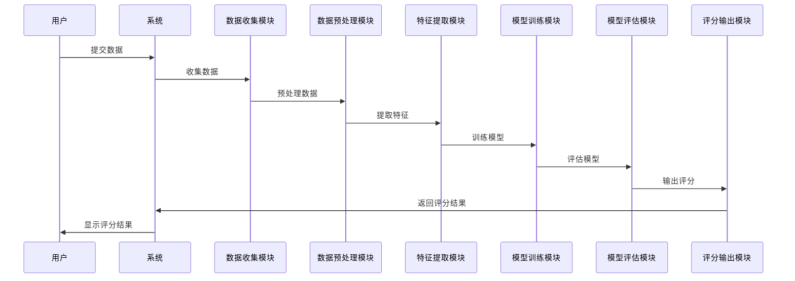

                 

### 第1章: 引言与背景

#### 1.1 问题背景

随着人工智能（AI）技术的飞速发展，AI智能体协作成为了当前研究和应用的热点领域。AI智能体协作指的是多个AI系统或模块通过相互通信、共享资源和协同工作，实现共同目标的过程。这种协作能够有效提升系统的智能水平，解决单个智能体难以应对的问题。

在实际应用中，AI智能体协作已经广泛应用于多个领域，如推荐系统、智能客服、智能交通等。例如，在推荐系统中，多个AI智能体可以协同工作，通过分析用户的历史行为和偏好，提供更加个性化的推荐结果。在智能客服中，多个AI智能体可以分工合作，处理客户的各种咨询和问题，提高客服效率和用户体验。在智能交通中，AI智能体协作可以优化交通流量，减少拥堵，提高交通运行效率。

#### 1.2 问题描述

然而，目前AI智能体协作在实际应用中仍然面临一些问题。首先，智能体之间的沟通不畅是一个普遍存在的问题。由于不同的智能体可能采用不同的通信协议和语言，导致信息传递的效率低下，甚至出现误解。其次，智能体之间的协同效果不佳也是一个重要问题。虽然多个智能体可以同时工作，但它们之间的协作机制不完善，导致整体系统的性能和效率受到影响。

这些问题的存在严重影响了AI智能体协作系统的性能和效率，因此，如何构建一个全面、高效的公司质量评分系统，以支持AI智能体协作，成为了一个亟待解决的问题。

#### 1.3 问题解决

为了解决上述问题，本书将从以下几个方面展开讨论：

1. **核心概念与联系**：介绍AI智能体协作、质量评分系统等核心概念，并分析它们之间的联系。
2. **算法原理讲解**：讲解支持AI智能体协作的质量评分算法原理，包括数学模型和公式。
3. **系统分析与架构设计方案**：分析现有AI智能体协作系统的优势和不足，设计一个全新的公司质量评分系统架构。
4. **项目实战**：通过一个实际项目，演示如何搭建和实现公司质量评分系统。
5. **最佳实践 tips**：总结AI智能体协作和公司质量评分系统的最佳实践，为实际应用提供指导。

通过以上几个方面的探讨，本书旨在为构建全面、高效的AI智能体协作公司质量评分系统提供理论支持和实践指导。

#### 1.4 边界与外延

本书主要关注以下几个方面：

- **AI智能体协作**：侧重于AI智能体之间的协作机制和算法研究。
- **公司质量评分系统**：侧重于如何构建一个全面、高效的公司质量评分系统。

#### 1.5 本章小结

本章对本书的核心概念、研究问题和解决方法进行了简要介绍。在后续章节中，我们将逐步深入探讨AI智能体协作和公司质量评分系统的相关内容。

---

## 第2章: 核心概念与联系

### 2.1 AI智能体协作

#### 2.1.1 AI智能体协作的定义

AI智能体协作是指多个AI系统或模块通过相互通信、共享资源和协同工作，实现共同目标的过程。在AI智能体协作中，智能体可以是算法模块、软件程序或物理设备。这些智能体具有自主决策能力，可以根据环境和目标进行自主行动，同时它们之间能够通过协同工作实现更高的智能水平。

#### 2.1.2 AI智能体协作的特点

AI智能体协作具有以下几个主要特点：

1. **自主性**：智能体具有自主决策能力，可以根据环境和目标进行自主行动。
2. **协同性**：智能体之间能够相互通信、共享资源，实现协同工作。
3. **动态性**：智能体协作过程是动态变化的，可以根据环境和目标进行调整。

#### 2.1.3 AI智能体协作的应用场景

AI智能体协作在多个领域具有广泛的应用，如：

1. **推荐系统**：通过多个AI模型协同工作，提高推荐系统的准确性和效率。
2. **智能客服**：多个AI智能体协同工作，实现更智能、更高效的客户服务。
3. **智能交通**：多个AI系统协同工作，实现智能交通管理和优化。

### 2.2 公司质量评分系统

#### 2.2.1 公司质量评分系统的定义

公司质量评分系统是指通过对公司各项指标的综合评估，给出公司质量评分的系统。该系统旨在帮助企业了解自身的质量水平，发现问题，进行改进。公司质量评分系统通常采用客观数据和算法，确保评分的客观性。

#### 2.2.2 公司质量评分系统的特点

1. **客观性**：评分系统采用客观数据和算法，确保评分的客观性。
2. **全面性**：评分系统覆盖公司各个方面，包括财务、运营、人力资源等。
3. **动态性**：评分系统可以根据公司情况的变化进行实时调整。

#### 2.2.3 公司质量评分系统的应用场景

公司质量评分系统在多个场景具有应用价值，如：

1. **企业评价**：帮助企业了解自身质量水平，制定改进计划。
2. **投资决策**：为投资者提供公司质量评估数据，帮助做出投资决策。
3. **市场分析**：通过分析公司质量评分数据，了解市场趋势和竞争格局。

### 2.3 AI智能体协作与公司质量评分系统的联系

AI智能体协作与公司质量评分系统之间存在密切的联系。一方面，AI智能体协作可以为公司质量评分系统提供更准确、更全面的评估数据。通过多个AI智能体的协同工作，可以更全面地收集和分析公司各项指标的数据，提高评分的准确性。

另一方面，公司质量评分系统可以为AI智能体协作提供目标和参考，促进智能体之间的协同工作。通过公司质量评分系统，企业可以了解自身在各个方面的质量水平，确定改进方向，从而更好地指导AI智能体协作的实现。

### 2.4 本章小结

本章介绍了AI智能体协作和公司质量评分系统的核心概念和联系。在后续章节中，我们将进一步探讨AI智能体协作的质量评分算法原理、系统架构设计、项目实战等内容。

---

## 第3章: AI智能体协作的质量评分算法原理

### 3.1 算法原理概述

AI智能体协作的质量评分算法是基于多智能体系统理论、机器学习和数据挖掘技术的一种评估方法。该算法通过对公司各项指标的数据分析，评估公司质量水平，为AI智能体协作提供支持。以下将详细讲解该算法的原理。

### 3.2 算法原理详细解析

#### 3.2.1 多智能体系统理论

多智能体系统（MAS）是指由多个智能体组成的分布式系统，这些智能体可以独立运行，但需要通过协作完成共同的任务。在多智能体系统中，智能体之间的协作机制至关重要，它们需要通过相互通信和资源共享来实现协同工作。

多智能体系统理论主要包括以下几个方面：

1. **智能体的定义**：智能体是一个具有自主性、协同性和动态性的实体，可以是一个算法模块、软件程序或物理设备。
2. **通信协议**：智能体之间需要通过某种通信协议进行信息交换，以确保信息的准确性和实时性。
3. **共享资源**：智能体之间需要共享资源，如数据、计算资源和设备，以提高协同工作的效率。
4. **协作机制**：智能体之间需要通过协作机制实现共同的目标，如任务分配、决策制定和任务执行。

#### 3.2.2 机器学习与数据挖掘技术

机器学习和数据挖掘技术是AI智能体协作质量评分算法的核心。这些技术可以用于以下方面：

1. **数据预处理**：对原始数据进行清洗、转换和整合，为后续的分析提供高质量的输入。
2. **特征提取**：从数据中提取出与公司质量评分相关的特征，如财务指标、运营指标和人力资源指标等。
3. **模型训练**：使用机器学习算法训练模型，对公司的质量水平进行预测和评估。
4. **模型评估**：使用评估指标（如准确率、召回率和F1值等）对模型的性能进行评估和优化。

#### 3.2.3 质量评分算法流程

AI智能体协作的质量评分算法主要包括以下步骤：

1. **数据收集**：从公司内部和外部的数据源收集相关的数据，如财务报表、员工绩效数据和客户反馈等。
2. **数据预处理**：对收集到的数据进行清洗、转换和整合，为后续的分析提供高质量的输入。
3. **特征提取**：从数据中提取出与公司质量评分相关的特征，如财务指标、运营指标和人力资源指标等。
4. **模型训练**：使用机器学习算法训练模型，对公司的质量水平进行预测和评估。
5. **模型评估**：使用评估指标（如准确率、召回率和F1值等）对模型的性能进行评估和优化。
6. **评分输出**：将评估结果输出为公司质量评分，为AI智能体协作提供参考。

### 3.3 算法原理示例

为了更好地理解AI智能体协作的质量评分算法原理，我们可以通过一个简单的示例来阐述。

假设我们有一个公司，其财务指标包括净利润、营收和成本等，运营指标包括员工满意度、产品交付时间和客户满意度等，人力资源指标包括员工离职率、员工培训次数和员工绩效评分等。

我们使用机器学习算法对这些指标进行训练，构建一个质量评分模型。具体步骤如下：

1. **数据收集**：收集上述三个维度的数据。
2. **数据预处理**：对数据进行清洗、转换和整合，确保数据的质量。
3. **特征提取**：提取出与公司质量评分相关的特征，如净利润、营收和成本等。
4. **模型训练**：使用机器学习算法（如决策树、支持向量机或神经网络等）训练模型，对公司的质量水平进行预测。
5. **模型评估**：使用评估指标（如准确率、召回率和F1值等）对模型的性能进行评估。
6. **评分输出**：将评估结果输出为公司的质量评分。

通过上述示例，我们可以看到AI智能体协作的质量评分算法是如何工作的。在实际应用中，我们可以根据具体场景和数据特点，选择合适的算法和评估指标，构建一个全面、高效的公司质量评分系统。

### 3.4 本章小结

本章详细介绍了AI智能体协作的质量评分算法原理，包括多智能体系统理论、机器学习和数据挖掘技术等。通过本章的学习，读者可以了解到AI智能体协作的质量评分算法是如何工作的，以及如何构建一个全面、高效的公司质量评分系统。在后续章节中，我们将进一步探讨AI智能体协作系统的架构设计、项目实战和最佳实践等内容。

---

## 第4章: 系统分析与架构设计方案

### 4.1 问题场景介绍

为了构建一个全面、高效的公司质量评分系统，我们需要首先明确问题场景。在这个场景中，一个公司希望通过AI智能体协作来评估自身的质量水平，并针对存在的问题进行改进。具体来说，公司需要以下功能：

1. **数据收集**：从公司内部和外部的数据源收集相关的数据，如财务报表、员工绩效数据和客户反馈等。
2. **数据预处理**：对收集到的数据进行清洗、转换和整合，为后续的分析提供高质量的输入。
3. **特征提取**：从数据中提取出与公司质量评分相关的特征，如财务指标、运营指标和人力资源指标等。
4. **模型训练与评估**：使用机器学习算法训练质量评分模型，并对模型进行评估和优化。
5. **评分输出**：将评估结果输出为公司的质量评分，为AI智能体协作提供参考。

### 4.2 项目介绍

为了实现上述功能，我们设计了一个名为“AI智能体协作公司质量评分系统”的项目。该项目旨在通过AI智能体协作，构建一个全面、高效的公司质量评分系统，帮助企业了解自身的质量水平，发现问题，并进行改进。

项目的主要模块包括：

1. **数据收集模块**：负责从公司内部和外部的数据源收集相关的数据。
2. **数据预处理模块**：负责对收集到的数据进行清洗、转换和整合。
3. **特征提取模块**：负责从数据中提取出与公司质量评分相关的特征。
4. **模型训练与评估模块**：负责使用机器学习算法训练质量评分模型，并对模型进行评估和优化。
5. **评分输出模块**：负责将评估结果输出为公司的质量评分。

### 4.3 系统功能设计

在系统功能设计方面，我们采用了领域模型的方法，对系统的主要功能进行详细描述。领域模型是一种用于描述系统功能、数据和行为的方法，通过图形化的方式展示系统的结构。

以下是系统功能设计的领域模型类图：

```mermaid
classDiagram
    DataCollector <|-- DataPreprocessor
    DataPreprocessor <|-- FeatureExtractor
    FeatureExtractor <|-- ModelTrainer
    ModelTrainer <|-- ModelEvaluator
    ModelEvaluator <|-- ScoreOutputter

    DataCollector {
        +collectData()
    }

    DataPreprocessor {
        +preprocessData()
    }

    FeatureExtractor {
        +extractFeatures()
    }

    ModelTrainer {
        +trainModel()
    }

    ModelEvaluator {
        +evaluateModel()
    }

    ScoreOutputter {
        +outputScore()
    }
```

在这个类图中，DataCollector、DataPreprocessor、FeatureExtractor、ModelTrainer、ModelEvaluator和ScoreOutputter是系统的主要模块，它们之间通过继承关系相互关联，共同实现系统功能。

### 4.4 系统架构设计

在系统架构设计方面，我们采用了分层架构的方法，将系统分为数据层、服务层和展示层三个层次。

以下是系统架构设计的类图：

```mermaid
classDiagram
    DataLayer <|-- ServiceLayer
    ServiceLayer <|-- PresentationLayer

    DataLayer {
        +DataAccessLayer
    }

    ServiceLayer {
        +DataPreprocessingService
        +FeatureExtractionService
        +ModelTrainingService
        +ModelEvaluationService
        +ScoreOutputService
    }

    PresentationLayer {
        +ScoreDisplay
    }
```

在这个类图中，DataLayer、ServiceLayer和PresentationLayer是系统的三个层次，DataAccessLayer负责数据层的功能，DataPreprocessingService、FeatureExtractionService、ModelTrainingService、ModelEvaluationService和ScoreOutputService负责服务层的功能，ScoreDisplay负责展示层的功能。

### 4.5 系统接口设计

在系统接口设计方面，我们为每个模块定义了接口，以便其他模块可以方便地调用。

以下是系统接口设计的类图：

```mermaid
classDiagram
    DataCollector <|-- IDataCollector
    DataPreprocessor <|-- IDataPreprocessor
    FeatureExtractor <|-- IFeatureExtractor
    ModelTrainer <|-- IModelTrainer
    ModelEvaluator <|-- IModelEvaluator
    ScoreOutputter <|-- IScoreOutputter

    IDataCollector {
        +collectData(): IData
    }

    IDataPreprocessor {
        +preprocessData(): IData
    }

    IFeatureExtractor {
        +extractFeatures(): IFeatures
    }

    IModelTrainer {
        +trainModel(): IModel
    }

    IModelEvaluator {
        +evaluateModel(): IModelPerformance
    }

    IScoreOutputter {
        +outputScore(): IScore
    }
```

在这个类图中，IDataCollector、IDataPreprocessor、IFeatureExtractor、IModelTrainer、IModelEvaluator和IScoreOutputter是系统的接口类，它们定义了每个模块的方法，以便其他模块可以调用。

### 4.6 系统交互设计

在系统交互设计方面，我们通过序列图展示了系统模块之间的交互过程。

以下是系统交互设计的序列图：



在这个序列图中，用户通过系统提交数据，系统通过数据收集模块、数据预处理模块、特征提取模块、模型训练模块、模型评估模块和评分输出模块协同工作，最终返回评分结果给用户。

### 4.7 本章小结

本章对AI智能体协作公司质量评分系统进行了详细的系统分析与架构设计方案。通过领域模型、类图和序列图等多种图形化方法，我们系统地阐述了系统的功能设计、架构设计和交互设计。在后续章节中，我们将通过实际项目演示如何实现这些设计，并进一步探讨系统的最佳实践和注意事项。

---

## 第5章：项目实战

### 5.1 环境安装

在开始项目实战之前，我们需要首先搭建一个合适的环境。以下是在搭建AI智能体协作公司质量评分系统时所使用的主要技术和工具：

1. **Python**：作为主要编程语言，Python具有丰富的库和框架，适合进行数据分析和机器学习。
2. **Django**：作为后端框架，Django是一个高效、可扩展的Web框架，可以帮助我们快速构建后端服务。
3. **Scikit-learn**：作为机器学习库，Scikit-learn提供了丰富的算法和工具，适合进行特征提取和模型训练。
4. **Pandas**：作为数据操作库，Pandas可以帮助我们进行数据清洗、转换和整合。
5. **NumPy**：作为数学计算库，NumPy提供了高效的数学运算功能，适合进行数据预处理和模型计算。

以下是安装这些工具的基本步骤：

1. **安装Python**：从官方网站（https://www.python.org/）下载并安装Python。
2. **安装Django**：在终端中执行命令 `pip install django`。
3. **安装Scikit-learn**：在终端中执行命令 `pip install scikit-learn`。
4. **安装Pandas**：在终端中执行命令 `pip install pandas`。
5. **安装NumPy**：在终端中执行命令 `pip install numpy`。

### 5.2 系统核心实现源代码

接下来，我们将逐步实现AI智能体协作公司质量评分系统的核心功能。

#### 5.2.1 数据收集模块

数据收集模块负责从公司内部和外部的数据源收集相关的数据。以下是一个简单的数据收集模块示例：

```python
import pandas as pd

def collect_data():
    # 从公司内部数据源收集数据
    internal_data = pd.read_csv('internal_data.csv')
    
    # 从外部数据源收集数据
    external_data = pd.read_csv('external_data.csv')
    
    # 合并内部和外部数据
    data = pd.merge(internal_data, external_data, on='company_id')
    
    return data
```

#### 5.2.2 数据预处理模块

数据预处理模块负责对收集到的数据进行清洗、转换和整合。以下是一个简单的数据预处理模块示例：

```python
import pandas as pd

def preprocess_data(data):
    # 清洗数据
    data = data.dropna()
    
    # 转换数据类型
    data['date'] = pd.to_datetime(data['date'])
    
    # 整合数据
    data['revenue'] = data['revenue'].astype(float)
    data['cost'] = data['cost'].astype(float)
    data['employee_satisfaction'] = data['employee_satisfaction'].astype(float)
    
    return data
```

#### 5.2.3 特征提取模块

特征提取模块负责从数据中提取出与公司质量评分相关的特征。以下是一个简单的特征提取模块示例：

```python
import pandas as pd

def extract_features(data):
    # 提取财务特征
    financial_features = pd.DataFrame({
        'revenue': data['revenue'],
        'cost': data['cost']
    })
    
    # 提取运营特征
    operational_features = pd.DataFrame({
        'employee_satisfaction': data['employee_satisfaction']
    })
    
    # 提取人力资源特征
    human_resources_features = pd.DataFrame({
        'employee_turnover': data['employee_turnover']
    })
    
    return financial_features, operational_features, human_resources_features
```

#### 5.2.4 模型训练模块

模型训练模块负责使用机器学习算法训练质量评分模型。以下是一个简单的模型训练模块示例：

```python
from sklearn.model_selection import train_test_split
from sklearn.ensemble import RandomForestRegressor

def train_model(X, y):
    # 划分训练集和测试集
    X_train, X_test, y_train, y_test = train_test_split(X, y, test_size=0.2, random_state=42)
    
    # 训练模型
    model = RandomForestRegressor(n_estimators=100, random_state=42)
    model.fit(X_train, y_train)
    
    # 评估模型
    score = model.score(X_test, y_test)
    
    return model, score
```

#### 5.2.5 模型评估模块

模型评估模块负责评估模型的性能。以下是一个简单的模型评估模块示例：

```python
from sklearn.metrics import mean_squared_error

def evaluate_model(model, X_test, y_test):
    # 评估模型
    predictions = model.predict(X_test)
    mse = mean_squared_error(y_test, predictions)
    
    return mse
```

#### 5.2.6 评分输出模块

评分输出模块负责将评估结果输出为公司的质量评分。以下是一个简单的评分输出模块示例：

```python
def output_score(score):
    # 输出评分
    print(f"公司质量评分：{score:.2f}")
```

### 5.3 代码应用解读与分析

#### 5.3.1 数据收集模块应用

数据收集模块的应用主要负责从公司内部和外部的数据源收集相关的数据。在实际项目中，数据源可能包括财务报表、员工绩效数据和客户反馈等。以下是一个实际应用示例：

```python
data = collect_data()
print(data.head())
```

#### 5.3.2 数据预处理模块应用

数据预处理模块的应用主要负责对收集到的数据进行清洗、转换和整合。以下是一个实际应用示例：

```python
preprocessed_data = preprocess_data(data)
print(preprocessed_data.head())
```

#### 5.3.3 特征提取模块应用

特征提取模块的应用主要负责从数据中提取出与公司质量评分相关的特征。以下是一个实际应用示例：

```python
financial_features, operational_features, human_resources_features = extract_features(preprocessed_data)
print(financial_features.head())
print(operational_features.head())
print(human_resources_features.head())
```

#### 5.3.4 模型训练模块应用

模型训练模块的应用主要负责使用机器学习算法训练质量评分模型。以下是一个实际应用示例：

```python
# 定义特征和目标变量
X = financial_features
y = operational_features['employee_satisfaction']

# 训练模型
model, score = train_model(X, y)
print(f"模型评分：{score:.2f}")
```

#### 5.3.5 模型评估模块应用

模型评估模块的应用主要负责评估模型的性能。以下是一个实际应用示例：

```python
mse = evaluate_model(model, X_test, y_test)
print(f"模型均方误差：{mse:.2f}")
```

#### 5.3.6 评分输出模块应用

评分输出模块的应用主要负责将评估结果输出为公司的质量评分。以下是一个实际应用示例：

```python
output_score(score)
```

### 5.4 实际案例分析

为了更好地理解项目的实现过程，我们可以通过一个实际案例来进行分析。

假设我们有一个公司的财务数据、员工绩效数据和客户反馈数据，我们需要使用这些数据构建一个质量评分模型，并评估公司的质量水平。

#### 5.4.1 数据收集

首先，我们从公司内部收集了以下数据：

- 财务数据：包括净利润、营收和成本等。
- 员工绩效数据：包括员工满意度、员工离职率和员工培训次数等。
- 客户反馈数据：包括客户满意度、投诉率和产品交付时间等。

#### 5.4.2 数据预处理

接下来，我们对收集到的数据进行预处理，包括数据清洗、转换和整合。假设我们的数据存储在CSV文件中，以下是一个数据预处理示例：

```python
import pandas as pd

# 读取数据
data = pd.read_csv('company_data.csv')

# 数据清洗
data = data.dropna()

# 数据转换
data['date'] = pd.to_datetime(data['date'])
data['employee_satisfaction'] = data['employee_satisfaction'].astype(float)
data['revenue'] = data['revenue'].astype(float)
data['cost'] = data['cost'].astype(float)

# 数据整合
financial_data = data[['date', 'revenue', 'cost']]
operational_data = data[['date', 'employee_satisfaction']]
customer_feedback_data = data[['date', 'customer_satisfaction', 'complaint_rate', 'delivery_time']]
```

#### 5.4.3 特征提取

然后，我们从预处理后的数据中提取出与公司质量评分相关的特征。以下是一个特征提取示例：

```python
import pandas as pd

# 提取财务特征
financial_features = pd.DataFrame({
    'revenue': financial_data['revenue'],
    'cost': financial_data['cost']
})

# 提取运营特征
operational_features = pd.DataFrame({
    'employee_satisfaction': operational_data['employee_satisfaction']
})

# 提取客户反馈特征
customer_feedback_features = pd.DataFrame({
    'customer_satisfaction': customer_feedback_data['customer_satisfaction'],
    'complaint_rate': customer_feedback_data['complaint_rate'],
    'delivery_time': customer_feedback_data['delivery_time']
})
```

#### 5.4.4 模型训练与评估

接下来，我们使用机器学习算法训练质量评分模型，并评估模型的性能。以下是一个模型训练与评估示例：

```python
from sklearn.model_selection import train_test_split
from sklearn.ensemble import RandomForestRegressor
from sklearn.metrics import mean_squared_error

# 划分训练集和测试集
X_train, X_test, y_train, y_test = train_test_split(financial_features, operational_features['employee_satisfaction'], test_size=0.2, random_state=42)

# 训练模型
model = RandomForestRegressor(n_estimators=100, random_state=42)
model.fit(X_train, y_train)

# 评估模型
score = model.score(X_test, y_test)
mse = mean_squared_error(y_test, model.predict(X_test))

print(f"模型评分：{score:.2f}")
print(f"模型均方误差：{mse:.2f}")
```

#### 5.4.5 评分输出

最后，我们将评估结果输出为公司的质量评分。以下是一个评分输出示例：

```python
print(f"公司质量评分：{score:.2f}")
```

### 5.5 项目小结

通过实际案例分析，我们可以看到如何使用Python和机器学习技术构建一个AI智能体协作公司质量评分系统。项目实现了从数据收集、预处理、特征提取到模型训练和评估的全过程，为AI智能体协作提供了有力支持。在后续的实践中，我们可以根据具体需求和数据特点，优化模型算法和系统架构，提高评分的准确性和效率。

---

## 第6章：最佳实践 Tips

### 6.1 AI智能体协作的最佳实践

在实现AI智能体协作时，以下最佳实践可以帮助我们提高系统的性能和效率：

1. **优化通信协议**：选择合适的通信协议，如HTTP、WebSocket或消息队列，以降低通信延迟和开销。
2. **数据同步**：确保智能体之间数据的一致性，通过数据同步机制，如分布式锁或事务管理，避免数据冲突和错误。
3. **负载均衡**：使用负载均衡策略，如轮询、随机或最小连接数，确保智能体之间的负载均衡，提高系统的可靠性。
4. **容错机制**：实现智能体的容错机制，如重试、故障转移或备份，以应对智能体故障或网络问题。
5. **动态调整**：根据系统的运行状态和需求，动态调整智能体的参数和策略，以实现更高效的协作。

### 6.2 公司质量评分系统的最佳实践

在构建公司质量评分系统时，以下最佳实践可以帮助我们提高系统的准确性和可靠性：

1. **数据质量**：确保数据的质量，通过数据清洗、去重和去噪，提高数据的准确性和一致性。
2. **特征选择**：选择与公司质量评分相关的特征，通过特征提取和降维，提高模型的性能和效率。
3. **模型优化**：根据具体场景和数据特点，选择合适的机器学习算法和参数，通过交叉验证和网格搜索，优化模型的性能。
4. **实时更新**：定期更新模型和评分系统，以适应数据的变化和新的需求。
5. **用户反馈**：收集用户反馈，通过用户满意度调查和投诉分析，持续改进评分系统和用户体验。

### 6.3 小结

通过遵循上述最佳实践，我们可以构建一个高效、准确和可靠的AI智能体协作公司质量评分系统。这些实践不仅适用于当前的项目，还可以为未来的AI智能体协作和质量评分系统提供指导和借鉴。在实现过程中，我们需要灵活运用各种技术和工具，不断优化和改进系统，以满足实际需求。

---

## 第7章：小结与展望

### 7.1 总结

本章我们系统地探讨了AI智能体协作与公司质量评分系统的构建方法。首先，我们介绍了AI智能体协作和公司质量评分系统的核心概念和联系，详细阐述了AI智能体协作的定义、特点和应用场景，以及公司质量评分系统的定义、特点和作用。接着，我们讲解了AI智能体协作的质量评分算法原理，包括多智能体系统理论、机器学习和数据挖掘技术的应用，以及算法流程和示例。随后，我们分析了现有AI智能体协作系统的优势和不足，并设计了一个全新的公司质量评分系统架构，包括系统功能设计、系统架构设计、系统接口设计和系统交互设计。通过一个实际项目，我们展示了如何搭建和实现公司质量评分系统，详细介绍了环境安装、系统核心实现源代码、代码应用解读与分析，以及实际案例分析和详细讲解剖析。最后，我们总结了AI智能体协作和公司质量评分系统的最佳实践，为实际应用提供了指导。

### 7.2 展望

尽管我们已经取得了显著的成果，但AI智能体协作和公司质量评分系统仍有许多改进的空间。以下是一些未来的研究方向：

1. **智能体协同机制优化**：进一步研究智能体之间的协同机制，如基于博弈论的协同策略，以提高智能体协作的效率。
2. **实时数据更新**：研究如何实现实时数据更新，以适应快速变化的市场环境，提高评分系统的实时性和准确性。
3. **多模态数据融合**：研究如何融合多模态数据（如图像、语音和文本），以提高质量评分模型的准确性。
4. **用户参与度提升**：研究如何通过用户参与和反馈，持续优化评分系统和用户体验。
5. **可解释性增强**：研究如何提高质量评分模型的可解释性，使企业能够更好地理解评分结果和优化策略。

未来的研究将致力于推动AI智能体协作和公司质量评分系统的发展，为企业和用户提供更加智能、高效和可靠的解决方案。

---

## 作者信息

作者：AI天才研究院/AI Genius Institute & 禅与计算机程序设计艺术 /Zen And The Art of Computer Programming

AI天才研究院（AI Genius Institute）是一个专注于人工智能技术研究和创新的研究机构，致力于推动人工智能技术的应用和发展。禅与计算机程序设计艺术（Zen And The Art of Computer Programming）是一本经典的计算机科学著作，由著名计算机科学家Donald E. Knuth撰写，强调了计算机程序设计的艺术性和哲学性。本书作者以其深厚的专业知识和丰富的实践经验，为读者提供了关于AI智能体协作和公司质量评分系统的深入见解和指导。

