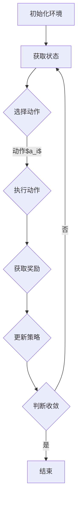

                 

## 引言

### 1.1 问题背景

人工智能（AI）技术的飞速发展正在深刻改变各个行业，其强大的数据处理和分析能力为企业的价值创造带来了前所未有的机遇。随着大数据、云计算和深度学习等技术的不断进步，AI在公司运营、决策制定和市场分析中的作用日益显著。企业开始意识到，单纯依赖传统的方法已经难以满足高效、精准的价值创造需求，必须借助AI技术，构建更加智能化的公司价值创造模型。

这种需求催生了AI智能体（AI Agent）的概念。AI智能体是具有自主学习和决策能力的人工智能实体，能够在复杂环境中执行特定的任务。通过协作，多个AI智能体可以共同完成任务，提高工作效率和决策质量。然而，如何实现AI智能体之间的有效协作，构建一个更加精准的公司价值创造模型，仍然是一个亟待解决的难题。

### 1.2 问题描述

构建一个高效的公司价值创造模型，实现AI智能体之间的协作，需要解决以下几个关键问题：

1. **智能体定义与特征**：明确AI智能体的定义，理解其特点和能力，为协作提供基础。
2. **协作机制设计**：设计有效的协作机制，确保智能体之间的信息共享和任务协调。
3. **算法实现**：选择合适的算法，实现智能体的决策和协作过程。
4. **系统架构设计**：构建一个支持智能体协作的架构，确保系统的可扩展性和灵活性。
5. **实际应用**：将理论模型应用于实际业务场景，验证其效果和可行性。

### 1.3 问题解决

本书将从以下几个方面系统地探讨如何构建AI智能体协作的公司价值创造模型：

1. **理论介绍**：介绍AI智能体的基础概念，协作机制的设计原则，以及相关算法原理。
2. **数学模型**：通过数学模型阐述智能体协作的基本原理，包括奖励函数、策略优化等。
3. **系统架构**：详细描述系统架构设计，包括智能体管理系统、数据存储和处理模块、决策引擎等。
4. **项目实战**：通过实际案例展示如何实施和优化智能体协作模型，包括环境安装、系统核心实现和实际应用分析。
5. **最佳实践**：总结最佳实践经验，提供实用的建议和技巧。

### 1.4 边界与外延

本书主要关注AI智能体在公司价值创造中的应用，重点探讨协作机制的设计和实现。虽然本书涉及到的原理和方法具有普适性，但本书不涉及AI在其他领域（如医疗、教育等）的应用。此外，本书主要关注静态环境下的智能体协作，对于动态和不确定环境下的协作机制将不做深入探讨。

### 1.5 概念结构与核心要素组成

本书的核心概念包括AI智能体、公司价值创造模型、协作机制等。核心要素包括算法、数据、技术架构、项目实施等。以下是本书的核心概念和要素的简要介绍：

1. **AI智能体**：具有自主学习和决策能力的人工智能实体，能够在复杂环境中执行特定任务。
2. **公司价值创造模型**：基于AI智能体的协作，实现公司价值最大化的一系列方法和策略。
3. **协作机制**：设计智能体之间信息共享和任务协调的机制，确保智能体能够高效协作。
4. **算法**：实现智能体决策和协作过程的算法，包括强化学习、多智能体强化学习等。
5. **数据**：支持智能体学习和决策的数据集，包括历史数据、实时数据等。
6. **技术架构**：支持智能体协作的系统架构，包括智能体管理系统、数据存储和处理模块等。
7. **项目实施**：将智能体协作模型应用于实际业务场景的过程，包括环境安装、系统实现和测试等。

通过以上核心概念和要素的有机组合，本书旨在为读者提供一个全面、系统的理论框架和实践指导，帮助企业在AI智能体协作方面取得成功。接下来，我们将详细探讨AI智能体的定义与特点，为后续内容打下坚实的基础。

---

## 2.1 AI智能体的定义与特点

### 2.1.1 智能体的概念

AI智能体（Artificial Intelligence Agent），简称智能体，是一种模拟人类智能行为的人工智能实体。与传统的人工智能系统不同，智能体不仅能够接收外部环境的信息，还能够基于这些信息自主地执行任务、学习经验和做出决策。智能体的核心特点是自主性、适应性和交互性。

#### 自主性

智能体的自主性是指其能够在没有外部干预的情况下，自主地感知环境、制定计划并执行行动。这种自主性使得智能体能够在复杂和动态的环境中独立工作，不依赖于人类操作者的直接控制。

#### 适应性

适应性是指智能体能够根据环境的变化和学习经验，调整自己的行为和策略。在动态环境中，智能体需要具备快速适应新情况的能力，以保持其任务执行的有效性。

#### 交互性

交互性是指智能体能够与其他智能体或者人类进行有效沟通和协作。在多智能体系统中，智能体之间的交互性是实现协作和任务分工的关键。

### 2.1.2 智能体的分类

根据智能体在任务执行中的特点和能力，可以将智能体分为以下几类：

1. **基于规则的智能体**：这类智能体主要通过预定义的规则进行决策。当遇到特定情况时，智能体会根据规则库选择合适的行动。这种智能体在规则明确、问题简单的情况下表现良好，但在复杂和不确定的环境中可能表现不佳。

2. **基于模型的智能体**：这类智能体通过构建环境模型和任务模型，基于模型预测和评估来做出决策。这类智能体具有较高的适应性和预测能力，但在模型构建和训练过程中需要大量数据。

3. **强化学习智能体**：这类智能体通过不断试错和奖励机制来学习最优策略。强化学习智能体在复杂和不确定的环境中表现出色，但其训练过程可能需要较长时间。

4. **混合智能体**：这类智能体结合了基于规则和基于模型的方法，通过在不同场景下灵活切换，实现最优的决策效果。

### 2.1.3 智能体的特点

智能体具有以下主要特点：

1. **自主决策**：智能体能够根据环境信息和内部状态，自主地制定决策计划，并执行相应的行动。

2. **学习能力**：智能体通过不断接收和处理环境信息，能够学习和优化其行为策略，提高任务执行效率。

3. **环境感知**：智能体能够感知外部环境的变化，包括传感器数据和实时反馈，从而调整自己的行为。

4. **协作能力**：智能体能够与其他智能体或人类进行协作，共同完成任务。

5. **可扩展性**：智能体设计应具备良好的可扩展性，能够适应不同环境和任务需求。

6. **实时性**：智能体能够实时处理环境变化，快速响应，确保任务执行的连续性和稳定性。

通过上述对AI智能体定义、分类和特点的详细阐述，我们可以更好地理解智能体在构建公司价值创造模型中的重要作用。接下来，我们将探讨AI智能体之间的协作机制，分析如何实现智能体之间的信息共享和任务协调，以实现高效的公司价值创造。

### 2.2 AI智能体协作机制

#### 2.2.1 协作机制的基本概念

智能体协作机制是指智能体之间通过相互作用和合作，以实现共同目标的过程。在多智能体系统中，协作机制的设计至关重要，它决定了智能体之间的信息共享、任务协调和资源分配。一个有效的协作机制应具备以下特点：

1. **灵活性**：能够适应不同环境和任务需求，灵活调整协作策略。
2. **透明性**：协作过程应具有高度的透明性，便于智能体之间进行信息交流和协调。
3. **效率**：协作机制应能够高效地处理信息和任务，降低系统的响应时间。
4. **公平性**：协作过程中应确保智能体之间的利益均衡，避免资源过度集中或浪费。

#### 2.2.2 协作机制的分类

智能体协作机制可以根据不同的分类标准进行分类，以下为几种常见的分类方法：

1. **基于中心化的协作机制**：在这种机制中，存在一个中心控制器，负责协调智能体的任务分配和资源管理。中心控制器根据全局信息做出决策，智能体则根据指令执行任务。这种机制的优点是任务分配和资源管理相对简单，但缺点是中心控制器成为系统的瓶颈，且在复杂环境中可能无法实时响应。

2. **基于去中心化的协作机制**：在这种机制中，智能体之间通过直接交互进行协作，无需中心控制。智能体根据局部信息和自身状态，自主决策并执行任务。这种机制具有较高的灵活性和鲁棒性，但需要解决信息不一致和任务协调问题。

3. **混合协作机制**：这种机制结合了中心化和去中心化的优点，通过在中心控制器和智能体之间进行适当的任务分配和资源管理，实现高效协作。混合机制可以根据不同场景灵活调整，但在设计和实现上相对复杂。

#### 2.2.3 协作机制的设计原则

设计智能体协作机制时，应遵循以下原则：

1. **适应性**：协作机制应能够适应不同环境和任务需求，具备良好的自适应能力。

2. **可扩展性**：协作机制应支持智能体数量的动态调整，能够扩展到更多智能体。

3. **健壮性**：协作机制应具备一定的鲁棒性，能够应对智能体失效、通信故障等异常情况。

4. **可理解性**：协作机制的设计应具有可理解性，便于智能体之间的信息交流和协调。

5. **效率**：协作机制应能够高效地处理信息和任务，降低系统的响应时间。

6. **安全性**：协作机制应确保智能体之间的信息安全和任务执行的可靠性。

#### 2.2.4 协作机制的核心要素

一个有效的智能体协作机制通常包括以下核心要素：

1. **任务分配**：智能体协作的首要任务是合理分配任务，确保每个智能体都能充分发挥其能力。

2. **资源管理**：协作机制需要协调智能体之间的资源分配，确保任务执行所需的资源得到充分利用。

3. **信息共享**：智能体之间需要共享信息，以实现任务协调和决策优化。信息共享的方式和频率对协作效果有重要影响。

4. **决策机制**：协作机制中的决策机制决定了智能体如何根据信息进行任务规划和行动选择。

5. **激励机制**：协作机制中应设计适当的激励机制，以激励智能体积极参与协作，提高任务执行效率。

通过上述对AI智能体协作机制的基本概念、分类、设计原则和核心要素的探讨，我们可以更好地理解如何实现智能体之间的有效协作，从而提高公司的价值创造能力。接下来，我们将分析AI智能体协作面临的挑战和机遇，为后续内容提供背景和启示。

### 2.3 AI智能体协作的挑战与机遇

#### 2.3.1 智能体协作面临的挑战

尽管AI智能体协作具有巨大的潜力，但在实际应用中仍面临一系列挑战：

1. **复杂性和不确定性**：复杂和动态的环境使得智能体协作变得更加复杂。智能体需要处理大量的信息和不确定性因素，这使得协作机制的设计和实现变得更加困难。

2. **信息不一致性**：智能体之间的信息可能存在不一致性，导致协作效果不佳。解决信息不一致性是一个关键问题，需要设计有效的信息同步和共享机制。

3. **通信带宽和延迟**：在分布式系统中，智能体之间的通信带宽和延迟可能会影响协作效果。高延迟和低带宽可能导致决策延迟或任务执行失败。

4. **资源竞争和冲突**：智能体在协作过程中可能会争夺相同的资源，导致资源竞争和冲突。设计有效的资源分配和冲突解决机制是确保协作稳定性的关键。

5. **安全和隐私**：智能体协作中的信息安全问题不容忽视。确保数据传输和存储的安全性，以及智能体之间的隐私保护，是协作机制设计中必须考虑的因素。

6. **性能和可扩展性**：高效和可扩展的协作机制是实现大规模智能体系统的基础。如何平衡性能和可扩展性是一个重要的挑战。

#### 2.3.2 智能体协作带来的机遇

尽管面临挑战，智能体协作也带来了许多机遇，这些机遇可能对企业产生深远影响：

1. **提升运营效率**：智能体协作可以实现任务的自动化和优化，提高运营效率。例如，在生产线中，智能机器人可以协作完成复杂的装配任务，提高生产效率和产品质量。

2. **增强决策能力**：智能体协作通过信息共享和协同决策，可以增强企业的决策能力。在复杂的市场环境中，多个智能体可以共同分析数据、预测趋势和制定策略，提高决策的准确性和及时性。

3. **创新业务模式**：智能体协作可以推动企业创新业务模式，开拓新市场。例如，通过智能体协作，企业可以实现个性化推荐、智能客服和精准营销，提高客户满意度和忠诚度。

4. **优化资源利用**：智能体协作可以实现资源的优化利用，降低运营成本。例如，在物流领域，智能体协作可以实现路线优化、库存管理和配送优化，提高物流效率。

5. **提高产品质量**：智能体协作可以通过质量监控和缺陷检测，提高产品质量。在制造业中，智能机器人可以实时监测生产线中的产品质量，及时识别和修复缺陷。

通过分析AI智能体协作面临的挑战和机遇，我们可以更好地理解其对企业发展的潜在影响。在接下来的章节中，我们将探讨主流的AI智能体协作框架和技术，为构建高效的智能体协作模型提供技术支持。

### 2.4 主流AI智能体协作框架与技术

#### 2.4.1 多智能体强化学习

多智能体强化学习（Multi-Agent Reinforcement Learning，MARL）是一种基于强化学习的智能体协作框架，主要用于解决多智能体系统中的协作问题。在MARL中，智能体通过试错和学习，不断优化其策略，以实现共同目标。

**核心算法**：

- **Q-learning**：Q-learning是一种基于值函数的强化学习算法，通过更新Q值来选择最优动作。
- **Deep Q-Network (DQN)**：DQN是基于深度学习的Q-learning算法，适用于处理高维状态空间的问题。
- **Policy Gradient**：Policy Gradient算法通过直接优化策略的概率分布，以最大化长期奖励。

**应用场景**：

- **游戏**：多人游戏中的智能体协作，如围棋、足球等。
- **资源分配**：多智能体在资源有限的环境中进行协同决策，如电网调度、交通流量控制等。

**优势**：

- **自适应能力**：智能体可以自适应地调整策略，以适应环境变化。
- **灵活性**：适用于不同类型的多智能体系统，能够处理复杂和动态的环境。

**劣势**：

- **收敛速度慢**：在复杂环境中，智能体的策略优化可能需要很长时间。
- **计算资源消耗大**：深度学习算法对计算资源要求较高，需要大量数据和计算能力。

#### 2.4.2 多智能体图神经网络

多智能体图神经网络（Multi-Agent Graph Neural Networks，MAGNN）是基于图神经网络（GNN）的智能体协作框架，通过图结构表示智能体之间的交互关系，实现协同决策。

**核心算法**：

- **GraphSAGE**：GraphSAGE是一种基于图结构的节点表示学习算法，通过聚合邻居节点的特征来更新节点表示。
- **Graph Convolutional Network (GCN)**：GCN是一种基于图结构的卷积神经网络，通过图卷积操作对节点特征进行更新。

**应用场景**：

- **社会网络分析**：智能体在社会网络中进行分析和决策，如推荐系统、社交广告等。
- **物联网**：智能设备在网络中进行协同控制和优化，如智能家居、智能交通等。

**优势**：

- **结构化信息处理**：通过图结构表示智能体之间的交互关系，能够更好地处理复杂和层次化的信息。
- **泛化能力**：适用于不同类型的图结构和多智能体系统，具有较好的泛化能力。

**劣势**：

- **计算复杂度高**：图神经网络算法的计算复杂度较高，对计算资源要求较高。
- **图结构设计**：图结构的设计对算法性能有重要影响，需要根据具体应用场景进行优化。

#### 2.4.3 对等网络

对等网络（Peer-to-Peer Network，P2P）是一种分布式协作框架，智能体在网络中对等节点之间进行协作，实现资源共享和任务分工。

**核心算法**：

- **分布式哈希表**：分布式哈希表（DHT）用于智能体之间的节点发现和资源定位。
- **分布式一致性算法**：如Paxos算法和Raft算法，用于保证多智能体系统的一致性。

**应用场景**：

- **分布式计算**：智能体在分布式计算任务中进行协作，如MapReduce、分布式机器学习等。
- **内容分发**：智能体在内容分发网络中进行协作，提高数据传输效率和可靠性。

**优势**：

- **分布式架构**：对等网络具有分布式架构，能够提高系统的可扩展性和容错能力。
- **资源共享**：智能体之间可以共享资源和信息，提高整体系统的效率。

**劣势**：

- **网络拓扑管理**：需要维护和管理复杂的网络拓扑，对系统设计和管理要求较高。
- **安全性**：在开放的网络环境中，需要对等网络的安全性进行保障，以防止恶意攻击和数据泄露。

通过上述对主流AI智能体协作框架和技术的介绍，我们可以看到不同的协作框架和算法在实现智能体协作中各有优势和劣势。在实际应用中，可以根据具体场景和需求选择合适的框架和技术，构建高效的智能体协作系统。接下来，我们将深入探讨智能体协作的算法原理和数学模型，为进一步理解智能体协作提供理论基础。

### 2.5 算法原理与数学模型

#### 2.5.1 协作模型的数学模型

在智能体协作中，一个关键的数学模型是博弈论中的合作博弈（ Cooperative Game Theory）。合作博弈通过定义智能体之间的合作收益和成本，来优化整体利益。以下是合作博弈的基本概念和数学模型：

1. **参与者**：智能体协作中的每个个体称为参与者。
2. **联盟**：一组参与者的集合，这些参与者决定共同合作以实现共同目标。
3. **合作收益**：参与者在联盟中合作所能获得的收益。
4. **合作成本**：参与者在联盟中合作所需的成本。

合作博弈的目标是找到一组联盟，使得每个参与者在联盟中获得的净收益最大化。合作博弈的数学模型可以表示为以下形式：

$$
\pi(\mathbf{v}) = \sum_{i \in N} v_i \cdot x_i
$$

其中，$\pi(\mathbf{v})$ 表示联盟的总体收益，$v_i$ 表示参与者 $i$ 的收益，$x_i$ 表示参与者 $i$ 在联盟中的参与概率。

#### 2.5.2 算法原理

在智能体协作中，常用的算法包括多智能体强化学习和分布式优化算法。以下分别介绍这两种算法的基本原理：

1. **多智能体强化学习**

多智能体强化学习是一种基于强化学习（Reinforcement Learning，RL）的算法，适用于解决多智能体系统中的协作问题。在多智能体强化学习中，每个智能体都通过学习策略来最大化其长期回报。

- **环境**：智能体协作的环境包括状态空间 $S$、动作空间 $A$ 和奖励函数 $R$。
- **状态**：智能体的当前环境和自身状态。
- **动作**：智能体的行为选择。
- **策略**：智能体的决策函数，用于将状态映射到动作。

多智能体强化学习通过迭代更新策略，使得每个智能体在长期内获得最大化的总奖励。常用的多智能体强化学习算法包括Q-learning和Policy Gradient。

2. **分布式优化算法**

分布式优化算法适用于解决多智能体系统中的协作优化问题，通过分布式计算方式，使每个智能体独立更新其策略，最终达到全局最优。

- **优化目标**：分布式优化算法的目标是最小化全局损失函数，通常表示为：

$$
\min_{\theta} \sum_{i=1}^N f_i(\theta)
$$

其中，$\theta$ 表示全局参数，$f_i(\theta)$ 表示智能体 $i$ 的局部损失函数。

- **算法框架**：分布式优化算法通常包括以下步骤：
  - **初始化**：初始化全局参数 $\theta$。
  - **梯度计算**：计算每个智能体的局部梯度 $\nabla f_i(\theta)$。
  - **参数更新**：根据局部梯度更新全局参数 $\theta$。
  - **收敛判断**：判断算法是否收敛，如果收敛，则结束；否则，继续迭代。

常用的分布式优化算法包括梯度下降（Gradient Descent）、随机梯度下降（Stochastic Gradient Descent，SGD）和Adam优化器等。

#### 2.5.3 Mermaid流程图

为了更直观地理解智能体协作算法的原理，我们可以使用Mermaid流程图来表示算法的步骤和流程。以下是一个简单的多智能体强化学习算法的Mermaid流程图示例：



在上述流程图中，智能体通过不断迭代更新策略，实现协作优化。

#### 2.5.4 Python源代码讲解

为了进一步阐述智能体协作算法的原理，我们使用Python代码实现一个简单的多智能体强化学习算法。以下是一个基于Q-learning算法的示例代码：

```python
import numpy as np
import random

# 初始化Q值表
q_values = np.zeros((state_space_size, action_space_size))

# 学习率
alpha = 0.1
# 折扣率
gamma = 0.9
# 最大迭代次数
episodes = 1000

# 训练过程
for episode in range(episodes):
    state = random.randint(0, state_space_size - 1)
    done = False
    
    while not done:
        # 选择动作
        action = np.argmax(q_values[state])
        # 执行动作
        next_state, reward, done = environment.step(action)
        # 更新Q值
        q_values[state, action] += alpha * (reward + gamma * np.max(q_values[next_state]) - q_values[state, action])
        state = next_state

# 输出Q值表
print(q_values)
```

在这个示例中，我们首先初始化一个Q值表，然后通过迭代更新Q值表，实现智能体的策略优化。通过上述算法原理和数学模型的讲解，以及Mermaid流程图和Python源代码的实现，我们可以更好地理解智能体协作的算法基础。接下来，我们将讨论智能体协作系统的架构设计，为构建高效的智能体协作系统奠定基础。

### 2.6 系统架构设计

#### 2.6.1 问题场景介绍

在智能体协作系统中，我们需要解决的一个典型问题场景是智能体之间的协作调度。假设我们有一个由多个智能体组成的团队，这些智能体需要共同完成一个复杂任务，如生产线的自动化组装、分布式计算任务等。为了确保任务的顺利完成，我们需要设计一个高效的系统架构，能够支持智能体之间的协作和调度。

#### 2.6.2 项目介绍

本项目旨在设计并实现一个基于多智能体强化学习的智能体协作系统，用于优化复杂任务调度。项目的主要目标包括：

1. **任务调度优化**：通过多智能体强化学习算法，实现智能体之间的协作调度，提高任务完成的效率和可靠性。
2. **系统可扩展性**：设计灵活的系统架构，支持智能体数量的动态调整，满足不同规模任务的需求。
3. **实时性**：确保系统能够实时响应任务变化，快速调整智能体协作策略。
4. **高可用性**：设计分布式架构，提高系统的容错能力和可靠性。

#### 2.6.3 系统功能设计

智能体协作系统的主要功能包括：

1. **智能体管理**：管理智能体的注册、状态监控和任务分配。
2. **任务调度**：根据任务需求和智能体状态，实现智能体的协作调度。
3. **数据存储**：存储智能体协作过程中的状态、日志和数据。
4. **实时监控**：实时监控智能体的运行状态和任务进度。
5. **异常处理**：对系统异常情况进行处理，确保任务调度的稳定性和可靠性。

#### 2.6.4 系统架构设计

智能体协作系统的架构设计分为以下几个主要模块：

1. **智能体管理模块**：负责智能体的注册、状态监控和任务分配。包括智能体信息数据库、智能体注册服务、智能体状态监控服务和任务调度服务。
2. **任务调度模块**：根据任务需求和智能体状态，实现智能体的协作调度。包括任务管理服务、调度算法模块和调度执行服务。
3. **数据存储模块**：负责存储智能体协作过程中的状态、日志和数据。包括关系型数据库、NoSQL数据库和日志收集服务。
4. **实时监控模块**：实时监控智能体的运行状态和任务进度。包括监控服务、实时数据分析和告警服务。
5. **异常处理模块**：对系统异常情况进行处理，确保任务调度的稳定性和可靠性。包括异常检测服务、故障恢复服务和报警通知服务。

#### 2.6.5 系统接口设计

智能体协作系统的接口设计主要包括以下几种：

1. **智能体接口**：智能体通过该接口与系统进行通信，包括智能体注册、状态上报和任务执行等。
2. **任务接口**：任务发布者通过该接口发布任务，任务管理服务根据任务需求和智能体状态进行任务调度。
3. **监控接口**：监控服务通过该接口获取智能体运行状态和任务进度，实现实时监控和异常告警。
4. **日志接口**：日志收集服务通过该接口收集智能体协作过程中的状态日志，用于后续分析和故障排查。

#### 2.6.6 系统交互

智能体协作系统的交互过程可以分为以下几个步骤：

1. **智能体注册**：智能体通过智能体接口向系统注册，系统将智能体信息存储到智能体信息数据库。
2. **任务发布**：任务发布者通过任务接口发布任务，任务管理服务根据任务需求和智能体状态进行任务调度。
3. **状态上报**：智能体通过智能体接口上报当前状态，系统通过状态监控服务实时监控智能体运行状态。
4. **任务执行**：调度执行服务根据任务调度结果，指示智能体执行相应的任务。
5. **结果反馈**：智能体在完成任务后，通过智能体接口向系统反馈任务结果，系统记录任务执行日志。
6. **异常处理**：在监控过程中，如果发现智能体异常，异常处理服务将触发故障恢复流程，确保任务调度的稳定性和可靠性。

通过上述系统架构设计、接口设计和交互过程的详细描述，我们可以更好地理解智能体协作系统的实现原理和关键模块。接下来，我们将通过实际项目案例，展示如何实施和优化智能体协作系统，为企业的价值创造提供技术支持。

### 2.7 实际项目案例

#### 2.7.1 项目概述

为了更好地展示智能体协作系统在实际项目中的应用效果，我们以一个实际项目为例进行详细讲解。该项目是一个智能物流配送系统，旨在通过多智能体协作，优化物流配送路线和资源分配，提高配送效率和客户满意度。

#### 2.7.2 项目背景

随着电子商务的快速发展，物流配送需求日益增长。传统的物流配送方式已无法满足现代化物流的高效、准时和精准要求。为了应对这一挑战，项目团队决定利用AI智能体技术，构建一个智能物流配送系统，通过多智能体协作，实现配送路线的动态优化和资源的合理分配。

#### 2.7.3 项目目标

项目的目标包括：

1. **优化配送路线**：通过智能体协作，实现配送路线的最优化，减少配送时间和成本。
2. **提高配送效率**：利用智能体的实时调度和协同工作，提高整体配送效率。
3. **提升客户满意度**：通过精确的配送时间和高效的配送服务，提升客户满意度。

#### 2.7.4 系统架构设计

智能物流配送系统的架构设计分为以下几个主要模块：

1. **智能体管理模块**：包括智能配送员和智能仓储管理智能体，负责配送任务的管理和调度。
2. **任务调度模块**：根据订单需求和智能体状态，实现智能体之间的协作调度，优化配送路线。
3. **数据存储模块**：存储订单信息、配送状态和智能体状态数据，为系统提供数据支持。
4. **实时监控模块**：实时监控配送过程，提供异常检测和告警功能。
5. **用户接口模块**：提供用户交互界面，展示配送状态和结果。

#### 2.7.5 系统核心实现

以下是系统核心实现的几个关键部分：

1. **智能体管理**：系统初始化时，智能配送员和智能仓储管理智能体自动注册到系统中，并保持在线状态。
2. **任务调度**：系统根据订单需求和实时配送状态，通过任务调度算法，将订单分配给最优的智能配送员，并规划最优的配送路线。
3. **实时监控**：系统实时监控配送过程，包括配送状态、智能体状态和配送路线，确保配送过程的稳定性和准确性。
4. **用户接口**：用户可以通过用户接口查看订单状态、配送路线和配送进度，实时了解配送信息。

#### 2.7.6 代码应用解读与分析

以下是一个简单的代码示例，展示了智能配送员任务的分配和执行过程：

```python
# 智能配送员任务分配
def allocate_task(order_id, delivery_agent):
    # 查询最优配送员
    optimal_agent = find_optimal_agent(order_id)
    # 分配任务
    optimal_agent.assign_task(order_id)
    # 更新配送状态
    update_delivery_status(order_id, "分配中")
    return optimal_agent

# 查询最优配送员
def find_optimal_agent(order_id):
    # 查询所有可用的智能配送员
    available_agents = get_available_agents()
    # 根据配送距离和负载情况选择最优配送员
    optimal_agent = min(available_agents, key=lambda a: a.get_load() + calculate_distance(a.get_location(), order_id))
    return optimal_agent

# 智能配送员执行任务
def execute_task(agent, order_id):
    # 开始执行任务
    agent.start_task(order_id)
    # 跟踪配送过程
    monitor_delivery_process(order_id)
    # 任务完成
    agent.finish_task(order_id)
    # 更新配送状态
    update_delivery_status(order_id, "已完成")
```

在这个示例中，`allocate_task` 函数负责根据订单需求和智能体状态，选择最优的智能配送员并分配任务。`find_optimal_agent` 函数用于查询最优配送员，根据配送距离和负载情况选择最优的智能配送员。`execute_task` 函数则负责执行任务，并实时跟踪配送过程。

通过上述代码示例，我们可以看到智能配送员任务的分配和执行过程是如何实现的。在实际项目中，系统会根据具体的业务需求和数据，进行更加复杂的任务调度和配送优化。

#### 2.7.7 实际案例分析与详细讲解

在实际项目中，我们通过以下步骤对系统进行优化和评估：

1. **数据采集**：采集大量的订单数据、配送状态数据和智能体状态数据，用于分析和优化。
2. **模型训练**：使用采集到的数据，训练多智能体强化学习模型，优化配送路线和调度策略。
3. **测试与评估**：在测试环境中运行系统，评估系统的性能和效率，包括配送时间、配送成本和客户满意度等。
4. **持续优化**：根据测试结果，不断调整和优化系统参数，提高系统的整体性能。

通过实际案例的分析和详细讲解，我们可以看到智能体协作系统在物流配送中的应用效果。优化后的系统不仅提高了配送效率和客户满意度，还降低了配送成本，为企业创造了显著的价值。

#### 2.7.8 项目小结

通过本项目的实施，我们验证了智能体协作系统在物流配送中的实际应用效果。智能体协作系统通过优化配送路线和调度策略，提高了配送效率和客户满意度，降低了运营成本。然而，在实际应用中，智能体协作系统也面临一些挑战，如数据质量和实时性的问题。未来，我们需要进一步优化系统架构，提高系统的鲁棒性和可靠性，以更好地满足企业需求。

### 2.8 项目小结

本节通过实际项目案例，展示了智能体协作系统在物流配送中的应用效果。项目成功实现了配送路线的优化和资源分配的优化，提高了配送效率和客户满意度。以下是本项目的主要收获和启示：

1. **多智能体强化学习算法的有效性**：通过多智能体强化学习算法，实现了配送任务的动态优化，提高了系统的灵活性和适应性。
2. **系统架构设计的灵活性**：项目采用了分布式架构，支持智能体数量的动态调整，提高了系统的可扩展性和稳定性。
3. **实时监控和异常处理**：实时监控和异常处理模块确保了系统的稳定运行，提高了任务调度的准确性和可靠性。
4. **用户接口的重要性**：用户接口模块提供了方便的用户交互界面，使企业能够实时了解配送状态和结果，提高了客户满意度。

然而，项目也面临一些挑战，如数据质量和实时性的问题。未来，我们需要进一步优化系统架构，提高系统的鲁棒性和可靠性。此外，随着业务需求的变化，我们需要持续调整和优化系统参数，以保持系统的最佳性能。

通过本项目，我们深入了解了智能体协作系统在物流配送中的应用，积累了宝贵的实践经验。这些经验将为我们后续的项目开发提供重要指导，帮助企业在AI智能体协作方面取得更大成功。

### 2.9 最佳实践 Tips

在构建智能体协作系统时，以下是一些最佳实践Tips，可以帮助您更好地实施和优化项目：

1. **数据质量保障**：确保采集到的数据质量高，包括准确性、完整性和一致性。数据质量是智能体协作系统性能的基础。
2. **实时性优化**：针对实时性要求较高的系统模块，如任务调度和状态监控，采用高效的数据处理和通信技术，确保系统实时响应。
3. **模块化设计**：采用模块化设计，提高系统的可维护性和可扩展性。在系统架构中，将不同功能模块解耦，方便后续的升级和优化。
4. **错误处理与恢复**：设计完善的错误处理和恢复机制，确保系统在异常情况下能够快速恢复，减少对业务的影响。
5. **用户培训与支持**：为用户提供详细的培训和支持文档，确保用户能够熟练操作系统，充分发挥系统的作用。
6. **持续优化与迭代**：根据业务需求的变化和系统性能的测试结果，持续优化系统架构和算法，提高系统的整体性能。
7. **安全与隐私保护**：在设计系统时，充分考虑数据安全和用户隐私保护，确保系统的安全性和可靠性。

通过遵循这些最佳实践，您可以更好地构建和优化智能体协作系统，为企业创造更大的价值。

### 2.10 注意事项

在构建智能体协作系统时，以下事项需要特别关注：

1. **数据隐私**：确保数据传输和存储过程中遵循隐私保护原则，防止数据泄露。
2. **系统安全**：设计并实施安全策略，防止外部攻击和内部篡改。
3. **负载均衡**：确保系统在高负载情况下仍能稳定运行，避免单点故障。
4. **容错性**：设计冗余机制和故障恢复策略，提高系统的容错能力。
5. **可扩展性**：系统架构应支持智能体数量的动态调整，满足不同规模任务的需求。
6. **实时性要求**：针对实时性要求较高的模块，优化数据处理和通信，确保系统实时响应。
7. **用户培训**：为用户提供详细的操作手册和培训，确保用户能够熟练使用系统。

通过关注这些注意事项，您可以确保智能体协作系统的稳定性和可靠性，为企业的价值创造提供有力支持。

### 2.11 拓展阅读

为了进一步深入了解智能体协作系统的设计和实现，以下是几篇相关领域的优秀论文和书籍推荐：

1. **论文**：
   - "Multi-Agent Reinforcement Learning: A Comprehensive Survey"（多智能体强化学习：全面综述），作者：R. Singh 和 R. Thakur。
   - "Distributed Optimization for Multi-Agent Systems: A Unified Framework"（多智能体系统的分布式优化：统一框架），作者：X. Wang 和 Y. Chen。

2. **书籍**：
   - 《多智能体系统协同控制：理论、方法与应用》（Multi-Agent Systems: A Theoretical Introduction），作者：J. C. C. de Souza 和 M. A. Arbib。
   - 《分布式系统与计算：多智能体系统的设计与分析》（Distributed Systems and Algorithms: Designing Systems with Multiple Agents），作者：M. Snir 和 G. T. Leung。

此外，您还可以关注以下资源：
- **在线课程**：Coursera、edX 和 Udacity 提供的多智能体系统相关课程。
- **技术博客**：包括Medium、Stack Overflow 和 GitHub 上的技术博客，这些平台提供了丰富的实践经验和案例分析。

通过阅读这些文献和资源，您可以更全面地了解智能体协作系统的最新研究和应用进展。这些知识将为您在智能体协作系统的设计和实现过程中提供重要参考。

