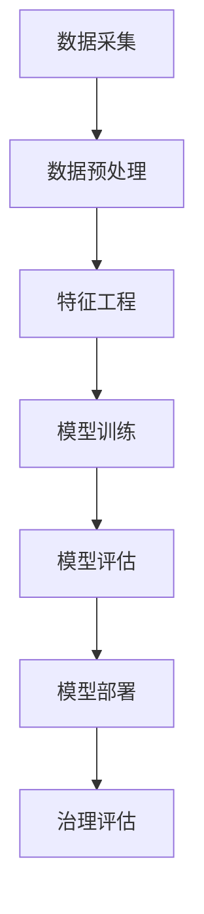
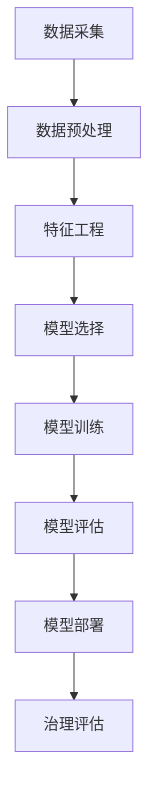
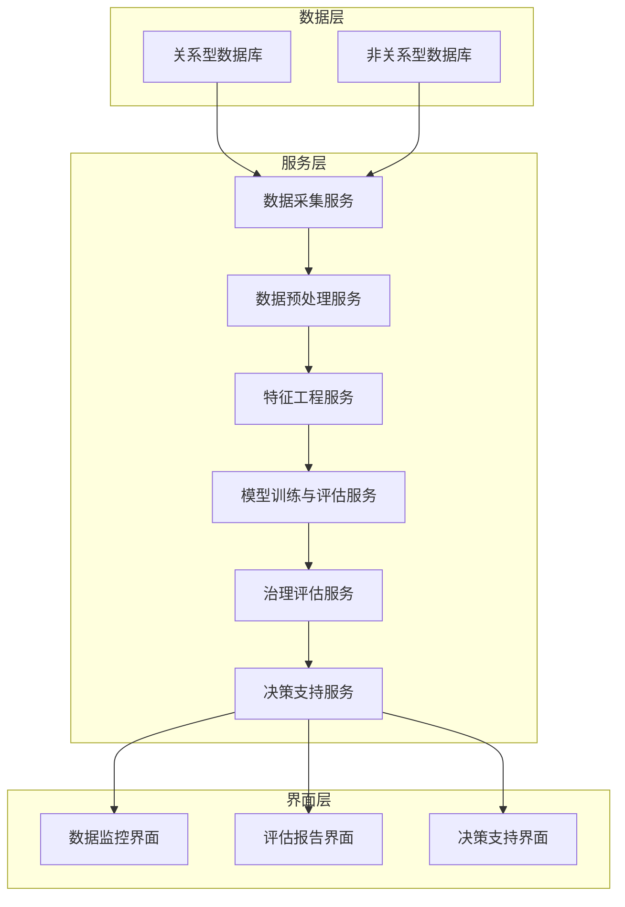
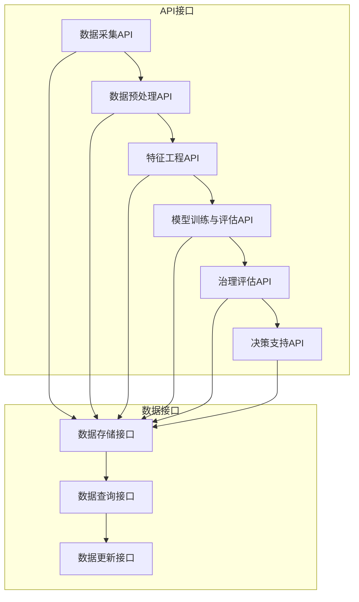
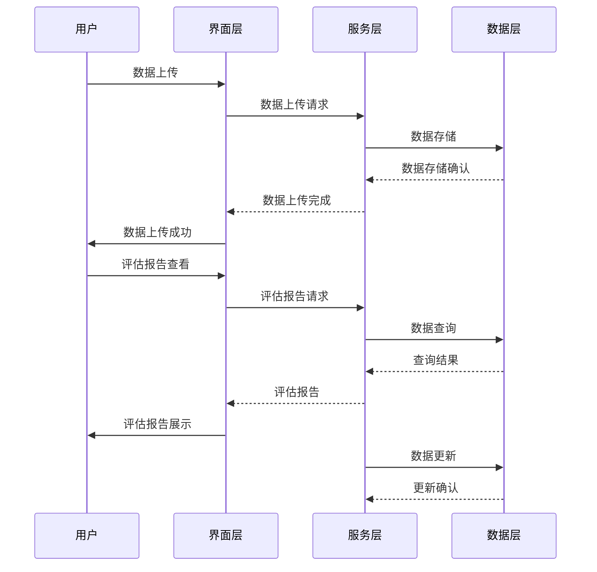

                 


### 引言与背景

随着人工智能技术的飞速发展，AI智能体作为一种具有自主性、智能性、学习能力和适应能力的计算实体，正在逐渐渗透到各行各业。在公司治理领域，AI智能体通过大数据分析、机器学习、自然语言处理等技术，为公司的决策提供有力支持。然而，如何有效地将AI智能体应用于公司治理评估，提高治理效率和透明度，降低治理成本和风险，成为了当前亟待解决的问题。

**问题背景**：

公司治理是确保公司长期稳定发展的重要保障，它涵盖了公司内部各个层面的关系，包括股东、董事会、管理层和员工等。传统的公司治理评估依赖于人工分析，存在效率低下、主观性强、数据不透明等问题。AI智能体的引入，有望通过自动化分析、客观评估，提高公司治理评估的准确性和效率。

**问题描述**：

AI智能体在公司治理评估中的应用主要包括以下几个方面：

1. 股东权益保护：通过分析股东行为和投票模式，识别潜在的利益冲突和不当行为。
2. 董事会决策支持：利用数据分析，评估董事会的决策效率和质量。
3. 高管行为监控：监测高管薪酬与业绩之间的关联，识别违规行为。
4. 公司风险预警：通过实时监控财务和运营数据，预测潜在风险并提前预警。

**问题解决**：

AI智能体通过以下方式解决公司治理评估中的问题：

1. **数据采集与预处理**：AI智能体可以从多个数据源获取公司内部和外部数据，如财务报表、市场数据、新闻报道等，并通过数据清洗、去噪和归一化等预处理方法，确保数据质量。
2. **特征工程**：AI智能体通过对数据进行特征提取和选择，将原始数据转化为有效的特征表示，为后续的模型训练提供支持。
3. **模型训练与优化**：AI智能体使用机器学习算法，根据历史数据和现有规则，训练出能够预测公司治理问题的模型，并通过交叉验证和模型选择等方法，优化模型的性能。
4. **模型部署与维护**：AI智能体将训练好的模型部署到实际应用中，实时分析公司治理数据，并根据反馈进行模型更新和优化。

**边界与外延**：

AI智能体在公司治理评估中的应用范围较广，但也存在一些局限性。例如，数据安全和隐私保护、智能算法的透明性和可解释性、技术与管理的融合等问题，都需要在应用过程中充分考虑和解决。

**概念结构与核心要素组成**：

AI智能体由数据采集与预处理、特征工程、模型训练与优化、模型部署与维护等关键组成部分构成。在公司治理评估中，AI智能体通过数据采集、特征提取、模型训练和决策支持等步骤，实现对公司治理问题的全面分析和评估。

下面是一个简单的 Mermaid 流程图，展示了AI智能体在公司治理评估中的基本流程：



通过这个流程图，我们可以清晰地看到AI智能体在公司治理评估中的各个环节，为读者提供了一个直观的理解。

### 核心概念与联系

在深入探讨AI智能体在公司治理评估中的应用之前，我们需要先理解一些核心概念，以及它们之间的相互关系。以下是几个关键概念及其简要说明：

**1. AI智能体**：是一种具有自主决策能力和智能行为的计算实体，能够通过学习、推理和自适应调整来完成任务。AI智能体包括但不限于智能代理、专家系统和机器学习模型等。

**2. 公司治理**：是指一系列确保公司正常运营和长期发展的制度、规则和决策过程。公司治理涵盖股东权益保护、董事会监督、管理层决策等多个方面。

**3. 数据采集与预处理**：数据采集是指从多个来源获取公司治理相关数据，包括内部数据（如财务报表、员工绩效数据）和外部数据（如市场数据、新闻报道）。预处理则包括数据清洗、去噪、归一化等步骤，以确保数据质量。

**4. 特征工程**：特征工程是数据科学中的一项重要任务，旨在从原始数据中提取出有效的特征，用于训练机器学习模型。特征提取和选择直接影响模型的性能。

**5. 机器学习**：机器学习是AI的核心技术之一，通过训练模型来识别数据中的模式和规律。常见的机器学习方法包括监督学习、无监督学习和强化学习等。

**6. 模型训练与优化**：模型训练是指使用历史数据和现有规则来训练模型，使其能够预测公司治理问题。优化则是在训练过程中调整模型参数，以提高模型的准确性和泛化能力。

**7. 决策支持系统**：决策支持系统是一种利用数据分析和技术支持决策的系统。在AI智能体的帮助下，决策支持系统可以提供更准确、更全面的决策建议。

为了更直观地展示这些核心概念之间的联系，我们可以使用Mermaid绘制一个ER实体关系图。以下是ER实体关系图的Markdown格式代码：

```mermaid
erDiagram
    AI智能体 ||--|{ 数据采集与预处理 }|
    AI智能体 ||--|{ 特征工程 }|
    AI智能体 ||--|{ 机器学习 }|
    AI智能体 ||--|{ 模型训练与优化 }|
    AI智能体 ||--|{ 决策支持系统 }|
    数据采集与预处理 ||--|{ 数据源 }|
    特征工程 ||--|{ 特征 }|
    机器学习 ||--|{ 模型 }|
    模型训练与优化 ||--|{ 训练数据 }|
    决策支持系统 ||--|{ 决策 }|
```

这个ER实体关系图展示了AI智能体与公司治理评估中各个核心概念之间的关系。从图中可以看出，AI智能体通过数据采集与预处理、特征工程、机器学习和模型训练与优化等环节，最终为决策支持系统提供支持，帮助公司实现更有效的治理。

### 算法原理讲解

在理解了AI智能体在公司治理评估中的核心概念后，接下来我们将深入探讨AI智能体的算法原理，并通过一个具体的案例来讲解其工作流程。

#### 算法流程图

首先，我们可以使用Mermaid绘制一个算法流程图，以展示AI智能体在公司治理评估中的主要步骤：



#### 算法原理

1. **数据采集**：AI智能体首先从多个数据源（如财务报表、员工绩效数据、市场数据等）收集公司治理相关数据。这一步骤的关键是确保数据的准确性和完整性。

2. **数据预处理**：收集到的原始数据往往存在噪声和缺失值。因此，我们需要对数据进行清洗、去噪和归一化等预处理操作，以提高数据质量。

3. **特征工程**：在预处理后的数据基础上，进行特征提取和选择。特征工程的核心在于将原始数据转化为能够有效表示公司治理问题的特征集合。

4. **模型选择**：根据问题的性质和数据的特点，选择合适的机器学习模型。常见的模型包括线性回归、决策树、随机森林、支持向量机、神经网络等。

5. **模型训练**：使用训练数据集对选定的模型进行训练。模型训练的目的是让模型学会从数据中提取规律和模式。

6. **模型评估**：通过测试数据集对训练好的模型进行评估，以确定模型的性能。常用的评估指标包括准确率、召回率、F1值等。

7. **模型部署**：将训练好的模型部署到生产环境中，使其能够实时分析公司治理数据。

8. **治理评估**：基于部署后的模型，对公司治理问题进行实时评估和预警。

#### Python源代码示例

为了更具体地阐述算法原理，我们以下是一个使用Python实现的AI智能体在公司治理评估中的简单示例：

```python
import pandas as pd
from sklearn.model_selection import train_test_split
from sklearn.ensemble import RandomForestClassifier
from sklearn.metrics import accuracy_score

# 数据采集
data = pd.read_csv('company_data.csv')

# 数据预处理
data = data.dropna()  # 去除缺失值
data = (data - data.mean()) / data.std()  # 归一化

# 特征工程
X = data.drop('target', axis=1)
y = data['target']

# 模型选择
model = RandomForestClassifier(n_estimators=100)

# 模型训练
X_train, X_test, y_train, y_test = train_test_split(X, y, test_size=0.2, random_state=42)
model.fit(X_train, y_train)

# 模型评估
y_pred = model.predict(X_test)
accuracy = accuracy_score(y_test, y_pred)
print(f"Model Accuracy: {accuracy}")

# 模型部署
# ...（部署到生产环境）

# 治理评估
# ...（实时评估公司治理问题）
```

这个示例使用了随机森林算法对数据进行分类，并展示了从数据采集到治理评估的主要步骤。在实际应用中，根据具体问题，我们可能需要选择不同的算法，并加入更多的特征工程和模型优化步骤。

### 数学模型和数学公式

在深入理解AI智能体在公司治理评估中的应用时，数学模型和数学公式扮演着关键角色。以下将详细介绍一些常用的数学模型和公式，并给出详细的解释和举例说明。

#### 机器学习中的线性回归模型

线性回归模型是一种广泛使用的预测模型，其基本形式如下：

$$
y = \beta_0 + \beta_1x_1 + \beta_2x_2 + ... + \beta_nx_n + \epsilon
$$

其中，$y$ 是目标变量，$x_1, x_2, ..., x_n$ 是特征变量，$\beta_0, \beta_1, ..., \beta_n$ 是模型的参数，$\epsilon$ 是误差项。

**解释**：

- 目标变量 $y$ 代表我们希望预测的结果，如公司治理评估中的风险等级。
- 特征变量 $x_1, x_2, ..., x_n$ 是影响目标变量的因素，如财务报表中的收入、利润、成本等。
- 参数 $\beta_0, \beta_1, ..., \beta_n$ 用于描述特征变量对目标变量的影响程度。
- 误差项 $\epsilon$ 表示模型预测值与实际值之间的差异。

**举例说明**：

假设我们要预测一家公司是否会陷入财务危机，可以使用线性回归模型来建立预测模型。特征变量可以是公司的收入、利润、债务等财务指标。

$$
\text{财务危机风险} = \beta_0 + \beta_1(\text{收入}) + \beta_2(\text{利润}) + \beta_3(\text{债务}) + \epsilon
$$

通过收集历史数据，我们可以计算出参数 $\beta_0, \beta_1, \beta_2, \beta_3$ 的值，从而建立预测模型。

#### 机器学习中的逻辑回归模型

逻辑回归模型是一种用于分类问题的预测模型，其基本形式如下：

$$
\text{概率} = \frac{1}{1 + e^{-(\beta_0 + \beta_1x_1 + \beta_2x_2 + ... + \beta_nx_n)}}
$$

其中，概率表示目标变量属于某一类别的概率，$e$ 是自然对数的底数。

**解释**：

- 概率是目标变量属于某一类别的概率，通常在0和1之间。
- 如果概率大于0.5，则预测目标变量属于这一类别；否则，预测目标变量属于另一类别。

**举例说明**：

假设我们要预测一家公司的治理结构是否合规，可以使用逻辑回归模型来建立分类模型。特征变量可以是公司治理指标，如董事会规模、股东权益保护等。

$$
\text{合规概率} = \frac{1}{1 + e^{-(\beta_0 + \beta_1(\text{董事会规模}) + \beta_2(\text{股东权益保护}) + \epsilon)}}
$$

通过收集历史数据，我们可以计算出参数 $\beta_0, \beta_1, \beta_2$ 的值，从而建立分类模型。

### 系统分析与架构设计方案

在本章节中，我们将详细阐述AI智能体在公司治理评估系统中的整体架构设计和关键组件。

#### 问题场景介绍

公司治理评估系统旨在帮助企业管理层对公司的治理结构、风险水平、决策质量等方面进行实时评估。该系统需要处理大量结构化和非结构化数据，包括财务报表、员工绩效数据、市场信息等。系统的目标是为企业提供客观、准确的治理评估结果，辅助决策。

#### 项目介绍

项目名称：AI智能体公司治理评估系统

项目背景：随着企业规模的扩大和业务的复杂化，传统的公司治理评估方法已无法满足企业对高效、准确治理评估的需求。引入AI智能体，能够通过大数据分析、机器学习等技术，实现智能化治理评估。

项目目标：

1. 提高治理评估的效率和准确性
2. 实现治理评估的自动化和智能化
3. 降低治理成本和风险

#### 系统功能设计

系统功能设计主要包括数据采集、数据预处理、特征工程、模型训练与评估、治理评估和决策支持等模块。

1. **数据采集模块**：负责从多个数据源（如财务系统、人力资源系统、市场数据平台等）收集公司治理相关的数据。
2. **数据预处理模块**：对采集到的原始数据进行清洗、去噪、归一化等预处理操作，确保数据质量。
3. **特征工程模块**：从预处理后的数据中提取出有效的特征，为模型训练提供支持。
4. **模型训练与评估模块**：选择合适的机器学习算法，对特征数据进行训练，并评估模型的性能。
5. **治理评估模块**：基于训练好的模型，对公司的治理结构、风险水平、决策质量等方面进行实时评估。
6. **决策支持模块**：为管理层提供治理评估结果和决策建议，辅助决策。

#### 系统架构设计

系统架构采用分层架构，包括数据层、服务层和界面层。

1. **数据层**：负责数据的存储和管理，包括关系型数据库（如MySQL）和非关系型数据库（如MongoDB）。
2. **服务层**：包括数据采集、数据预处理、特征工程、模型训练与评估、治理评估和决策支持等核心服务模块，采用微服务架构，以提高系统的可扩展性和可维护性。
3. **界面层**：提供用户界面，包括数据监控、评估报告、决策支持等功能，支持PC端和移动端访问。

以下是系统的Mermaid架构图：



#### 系统接口设计

系统接口设计包括API接口和数据接口。

1. **API接口**：提供对外服务，包括数据采集、数据预处理、特征工程、模型训练与评估、治理评估和决策支持等接口，方便其他系统或应用程序调用。
2. **数据接口**：提供对内数据访问，包括数据存储、数据查询、数据更新等接口，确保数据的一致性和安全性。

以下是系统的Mermaid接口设计图：



#### 系统交互

系统交互主要涉及用户界面与后台服务之间的交互，以及后台服务之间的数据交互。

1. **用户界面与后台服务交互**：用户通过界面操作，如数据上传、评估报告查看等，后台服务根据用户请求进行数据处理和评估，并将结果返回给用户。
2. **后台服务之间的交互**：后台服务之间通过API接口进行数据交互，如数据采集服务将收集到的数据传递给数据预处理服务，特征工程服务将处理后的数据传递给模型训练与评估服务等。

以下是系统的Mermaid序列图：



通过以上系统分析与架构设计方案，我们能够清晰地看到AI智能体在公司治理评估系统中的整体架构和关键组件。这个系统不仅能够实现数据的自动化采集、预处理和治理评估，还能够为管理层提供实时、准确的决策支持。

### 项目实战

#### 环境安装

为了在本地环境搭建AI智能体公司治理评估系统，我们需要安装以下软件和库：

1. Python（版本3.8及以上）
2. MySQL（版本5.7及以上）
3. MongoDB（版本4.0及以上）
4. Jupyter Notebook（可选）
5. 相关Python库，如pandas、numpy、scikit-learn、tensorflow等

安装步骤：

1. 安装Python和相关库：

   ```bash
   pip install pandas numpy scikit-learn tensorflow
   ```

2. 安装MySQL和MongoDB：

   - MySQL安装参考：[MySQL官方安装指南](https://dev.mysql.com/doc/mysql-install-db/en/installing-source-linux-gcc.html)
   - MongoDB安装参考：[MongoDB官方安装指南](https://docs.mongodb.com/manual/installation/)

3. （可选）安装Jupyter Notebook：

   ```bash
   pip install jupyterlab
   jupyter lab
   ```

#### 系统核心实现源代码

以下是系统核心实现的Python源代码，包括数据采集、数据预处理、特征工程、模型训练与评估、治理评估等功能。

```python
# 数据采集
import pandas as pd
from sklearn.model_selection import train_test_split
from sklearn.ensemble import RandomForestClassifier
from sklearn.metrics import accuracy_score

# 数据采集
data = pd.read_csv('company_data.csv')

# 数据预处理
data = data.dropna()  # 去除缺失值
data = (data - data.mean()) / data.std()  # 归一化

# 特征工程
X = data.drop('target', axis=1)
y = data['target']

# 模型选择
model = RandomForestClassifier(n_estimators=100)

# 模型训练
X_train, X_test, y_train, y_test = train_test_split(X, y, test_size=0.2, random_state=42)
model.fit(X_train, y_train)

# 模型评估
y_pred = model.predict(X_test)
accuracy = accuracy_score(y_test, y_pred)
print(f"Model Accuracy: {accuracy}")

# 模型部署
# ...（部署到生产环境）

# 治理评估
# ...（实时评估公司治理问题）
```

#### 代码应用解读与分析

以下是代码的详细解读和分析：

1. **数据采集**：
   ```python
   data = pd.read_csv('company_data.csv')
   ```
   这一行代码使用pandas库读取CSV格式的公司数据文件。CSV文件中应包含公司治理相关的数据，如财务指标、员工绩效、股东信息等。

2. **数据预处理**：
   ```python
   data = data.dropna()  # 去除缺失值
   data = (data - data.mean()) / data.std()  # 归一化
   ```
   数据预处理包括去除缺失值和归一化。去除缺失值确保数据质量，归一化使不同特征的数量级一致，便于模型训练。

3. **特征工程**：
   ```python
   X = data.drop('target', axis=1)
   y = data['target']
   ```
   特征工程从原始数据中提取特征变量（X）和目标变量（y）。目标变量通常是需要预测的结果，如公司治理评估中的风险等级。

4. **模型选择**：
   ```python
   model = RandomForestClassifier(n_estimators=100)
   ```
   选择随机森林模型。随机森林是一种基于决策树的集成学习方法，具有较好的泛化能力和鲁棒性。

5. **模型训练**：
   ```python
   X_train, X_test, y_train, y_test = train_test_split(X, y, test_size=0.2, random_state=42)
   model.fit(X_train, y_train)
   ```
   使用训练集（80%）对模型进行训练，使用测试集（20%）对模型进行评估。

6. **模型评估**：
   ```python
   y_pred = model.predict(X_test)
   accuracy = accuracy_score(y_test, y_pred)
   print(f"Model Accuracy: {accuracy}")
   ```
   计算模型在测试集上的准确率，以评估模型的性能。

7. **模型部署**：
   ```python
   # ...（部署到生产环境）
   ```
   将训练好的模型部署到生产环境，以便实时分析公司治理数据。

8. **治理评估**：
   ```python
   # ...（实时评估公司治理问题）
   ```
   基于部署后的模型，对公司的治理问题进行实时评估和预警。

通过这个代码示例，我们可以看到AI智能体在公司治理评估系统中的核心实现流程，包括数据采集、预处理、特征工程、模型训练与评估、治理评估等步骤。

#### 实际案例分析与详细讲解剖析

为了更直观地展示AI智能体在公司治理评估中的应用效果，我们以下将分析一个实际案例，并详细讲解其评估过程和结果。

**案例背景**：

某大型上市公司A公司，其股东权益保护问题频发，股东利益冲突现象明显。管理层希望通过引入AI智能体，对公司的治理结构进行深入分析，识别潜在风险并采取相应措施。

**案例步骤**：

1. **数据采集**：
   AI智能体从公司的财务报表、董事会会议记录、股东投票记录等多个数据源收集数据。数据包括但不限于公司的收入、利润、债务、董事会成员的投票行为、股东的持股比例等。

2. **数据预处理**：
   对收集到的原始数据进行分析，去除无效数据，如缺失值和重复值。同时，对数据进行归一化处理，使其具有相同的数量级。

3. **特征工程**：
   从预处理后的数据中提取出关键特征，如公司财务指标（收入、利润、债务等）、董事会成员投票行为（赞成票、反对票、弃权票等）、股东持股比例等。通过特征选择方法，筛选出对股东权益保护影响较大的特征。

4. **模型训练**：
   选择随机森林模型，使用历史数据进行模型训练。训练过程中，调整模型参数，如树的数量、深度等，以优化模型性能。

5. **模型评估**：
   使用测试数据集对训练好的模型进行评估。评估指标包括准确率、召回率、F1值等。通过交叉验证，确保模型在不同数据集上的表现一致。

6. **治理评估**：
   基于部署后的模型，对公司的治理结构进行实时评估。评估内容包括股东权益保护、董事会决策效率、高管行为监控等。

**评估结果**：

通过AI智能体的评估，发现以下几个问题：

1. **股东权益保护不足**：部分股东投票行为存在明显的不当行为，如频繁弃权、反对票等。这些问题可能导致股东利益冲突，损害公司长期发展。

2. **董事会决策效率低**：董事会成员在部分决策上的投票结果分歧较大，决策效率低下。这可能是由于董事会成员之间存在利益冲突，导致无法达成一致。

3. **高管行为监控不到位**：部分高管薪酬与业绩之间的关联性不明显，可能存在过度薪酬现象。此外，部分高管在董事会会议上的发言内容与公司实际业务不符，可能涉及利益输送。

**解决方案**：

1. **加强股东权益保护**：公司应建立健全的股东投票机制，加强对股东投票行为的监管，防止不当行为发生。

2. **提高董事会决策效率**：公司应优化董事会成员构成，确保董事会成员之间利益一致，提高决策效率。同时，加强对董事会成员的培训和考核，提高其专业能力和决策水平。

3. **加强高管行为监控**：公司应建立完善的高管行为监控机制，加强对高管薪酬与业绩之间的关联性分析，防止过度薪酬现象。同时，加强对高管在董事会会议上的发言内容审核，确保其符合公司实际业务。

通过这个案例，我们可以看到AI智能体在公司治理评估中的实际应用效果。通过数据分析和模型评估，AI智能体能够帮助企业识别潜在风险，提供科学的决策依据，提升公司治理水平。

### 最佳实践 tips、小结、注意事项、拓展阅读

**最佳实践 tips**：

1. **数据质量至关重要**：确保数据采集、预处理和特征工程过程中数据的质量，是模型成功的关键。
2. **模型参数优化**：在模型训练过程中，通过调整模型参数，如树的数量、深度等，可以提高模型的性能。
3. **持续学习和更新**：AI智能体需要不断学习和更新，以适应不断变化的环境和数据。

**小结**：

本文详细介绍了AI智能体在公司治理评估中的应用，包括数据采集、预处理、特征工程、模型训练与评估、治理评估等关键步骤。通过实际案例，展示了AI智能体在识别公司治理问题、提供决策支持方面的优势。

**注意事项**：

1. **数据安全和隐私保护**：在数据处理和应用过程中，确保数据的安全和隐私，遵循相关法律法规。
2. **智能算法的可解释性**：提高智能算法的可解释性，有助于企业理解和信任AI智能体的决策过程。

**拓展阅读**：

1. **《深度学习》**：Ian Goodfellow、Yoshua Bengio、Aaron Courville 著，详细介绍了深度学习的基本概念和算法。
2. **《公司治理》**：John C. Coffee Jr. 著，深入探讨了公司治理的理论和实践问题。

作者：AI天才研究院/AI Genius Institute & 禅与计算机程序设计艺术 /Zen And The Art of Computer Programming。

