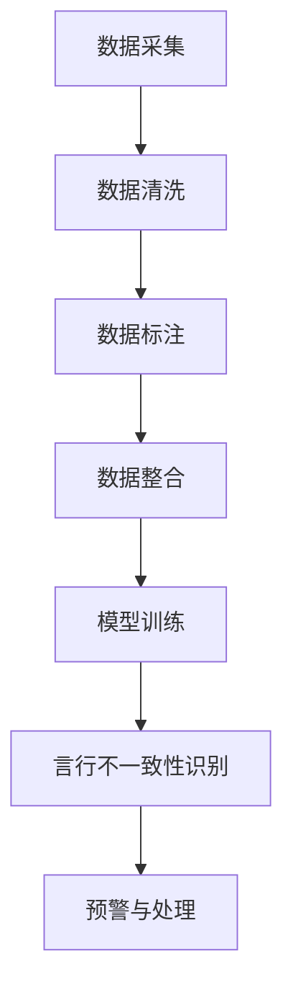
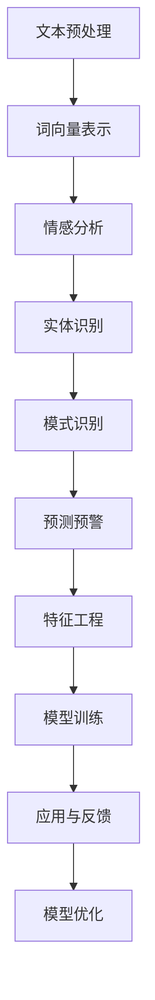

                 

### 引言

#### 1.1 问题背景

随着全球经济的不断发展，企业竞争愈发激烈，公司高管的言行不一致性现象日益突出。高管作为企业的领导者，其言行不仅对公司内部员工有着深远的影响，也会对外部投资者、客户以及公众产生重要的影响。言行不一致性，指的是高管在公开场合的言论与实际行为之间存在显著差异。这种现象可能会导致公司形象受损，员工士气低落，进而影响公司业绩和长期发展。

**1.1.1 高管言行不一致性的现象**

高管言行不一致性的现象有多种表现形式，例如：

- **夸大其词：** 高管在发布会上对于公司业绩、产品或战略进行过度的乐观描述，然而实际操作中并未达到这些目标。
- **言行不一：** 高管在内部会议中提出的一些建议或决策，在实际执行过程中并未得到落实。
- **信息不对称：** 高管在对外发布信息时，并未透露公司内部的实际情况，导致信息不透明。
- **虚伪表现：** 高管在公众场合表现出的行为与私下行为存在差异，例如对员工的态度和待遇。

**1.1.2 对公司的影响**

高管言行不一致性对公司的负面影响是多方面的：

- **内部影响：** 高管言行不一致会导致员工对公司产生信任危机，影响员工的工作积极性和团队凝聚力。
- **外部影响：** 对外公开的言论与实际行为不一致，会损害公司在投资者和客户中的形象，影响公司的市场竞争力。
- **法律风险：** 高管在公开场合的言论如果涉及到虚假陈述或误导信息，可能会引发法律纠纷，甚至对公司的经营带来负面影响。

**1.1.3 利用AI智能体解决问题的必要性**

传统的监督和审计手段在面对复杂多变的高管言行不一致性问题时显得力不从心。而人工智能（AI）的兴起，为解决这一问题提供了新的思路。AI智能体作为一种具有感知、学习、决策和执行能力的智能系统，能够在海量数据中快速分析和识别出高管言行不一致的迹象，从而为公司提供有效的预警和解决方案。

AI智能体的优势在于：

- **高效性：** AI智能体可以处理海量数据，快速识别言行不一致性模式，节省人力和时间成本。
- **准确性：** 通过机器学习和自然语言处理技术，AI智能体能够提高识别的准确性，减少误报和漏报。
- **智能化：** AI智能体可以根据数据变化和用户需求，自动调整分析模型和策略，实现持续优化。

因此，利用AI智能体分析公司高管言行不一致性，不仅有助于提升公司治理水平，还能够为公司的长期发展提供强有力的支持。

### 核心概念与联系

#### 1.2.1 AI智能体的定义与特点

AI智能体（Artificial Intelligence Agent，简称AIA）是一种具备智能行为能力的实体，能够独立完成特定任务或解决特定问题。其核心特点包括：

- **自主性：** 智能体可以自主地感知环境、做出决策和执行任务，不需要人类的直接干预。
- **适应性：** 智能体能够根据环境变化和经验积累，不断调整自己的行为策略，提高解决问题的能力。
- **协作性：** 智能体可以与其他智能体或人类协作，共同完成复杂任务。

AI智能体的定义与人类智能体（如机器人）有所不同，后者通常依赖于人类的指令和操作，而AI智能体则具备更高的自主性和智能水平。

#### 1.2.2 言行不一致性的定义与分类

言行不一致性是指个体在言语和行为上表现出的不一致现象。在公司高管层面，言行不一致性可以分为以下几种类型：

- **言论与行动差异：** 高管在公开场合发布的言论与实际执行的行为不一致。
- **内部与外部差异：** 高管在内部会议中提出的一些决策或建议，在实际执行过程中并未得到落实。
- **短期与长期差异：** 高管在短期目标和长期目标之间存在言行不一致的情况。

这些不一致性现象可能会对公司产生负面影响，例如损害公司形象、降低员工士气等。

#### 1.2.3 数据采集与处理方法

要利用AI智能体分析公司高管言行不一致性，首先需要收集和整理相关数据。数据采集的方法包括：

- **公开渠道：** 通过公司官网、社交媒体、新闻报道等渠道获取高管的言论和行为信息。
- **内部渠道：** 通过公司内部会议记录、员工反馈等渠道获取高管言行不一致的内部证据。

数据采集后，需要对这些数据进行处理，主要包括：

- **数据清洗：** 清除重复、错误和不相关的数据，确保数据质量。
- **数据标注：** 对数据进行分类和标注，以便后续的机器学习模型训练。
- **数据整合：** 将不同来源的数据进行整合，形成一个统一的数据集。

通过这些方法，可以确保AI智能体拥有高质量、结构化的数据，从而提高分析效率和准确性。

#### 1.2.4 算法原理

分析高管言行不一致性，需要运用自然语言处理（NLP）和机器学习（ML）技术。具体算法原理如下：

- **自然语言处理（NLP）技术：** 用于处理和理解高管的言论。NLP技术包括文本预处理、词向量表示、情感分析等，用于提取言论中的关键信息。
- **机器学习算法：** 用于识别言行不一致性模式。常见的机器学习算法有决策树、支持向量机（SVM）、神经网络等。通过训练模型，可以自动识别高管言行不一致的迹象。

#### 1.2.5 Mermaid流程图展示

为了更直观地展示数据采集、处理和模型训练的流程，我们使用Mermaid流程图进行描述：



该流程图包括以下步骤：

1. **数据采集**：从公开和内部渠道获取高管的言论和行为数据。
2. **数据清洗**：清除重复、错误和不相关的数据。
3. **数据标注**：对数据进行分类和标注。
4. **数据整合**：将不同来源的数据进行整合。
5. **模型训练**：使用机器学习算法训练模型。
6. **言行不一致性识别**：使用训练好的模型识别高管言行不一致的迹象。
7. **预警与处理**：根据识别结果进行预警和处理。

通过以上核心概念和联系，我们可以为后续的章节内容奠定基础，进一步探讨如何利用AI智能体分析公司高管言行不一致性。

#### 1.3 算法原理讲解

在深入探讨AI智能体在分析公司高管言行不一致性中的应用之前，我们需要详细讲解相关的算法原理。这些算法包括自然语言处理（NLP）技术和机器学习算法，它们共同构成了分析流程的核心。

##### 1.3.1 自然语言处理（NLP）技术

自然语言处理（NLP）是人工智能的一个重要分支，专注于使计算机能够理解和处理人类语言。在分析高管言行不一致性的过程中，NLP技术主要用于处理和理解高管的言论数据。

**1. NLP的关键步骤**

- **文本预处理**：文本预处理是NLP的首要步骤，主要包括去除停用词、标点符号、词形还原等。这一步的目的是将原始文本转化为适合模型处理的形式。

- **词向量表示**：词向量表示是将文本中的单词转化为数字向量，以便于机器学习算法进行处理。常见的词向量模型有Word2Vec、GloVe等。词向量表示能够捕捉词与词之间的语义关系，从而为后续的情感分析和实体识别提供基础。

- **情感分析**：情感分析是NLP中的一项重要任务，旨在判断文本的情感倾向，如正面、负面或中性。在分析高管言行不一致性时，情感分析可以帮助我们识别高管言论中的情绪波动，从而判断是否存在不一致性。

- **实体识别**：实体识别是识别文本中特定实体（如人物、地点、组织等）的过程。在高管言行不一致性分析中，实体识别有助于确定言论中的关键人物，进而分析其言行是否一致。

**2. NLP在言行不一致性分析中的应用**

- **情感倾向分析**：通过分析高管的言论情感倾向，可以初步判断高管的情绪是否稳定。例如，如果高管在某个时间段内发布的言论情绪波动较大，可能与实际行为存在不一致性。

- **言语连贯性检测**：分析高管言论之间的连贯性，可以识别出是否存在跳跃或矛盾。如果高管在不同场合发布的言论内容不一致，且缺乏合理的解释，可能表明言行不一致性。

- **语境理解**：理解高管言论的语境，有助于准确识别言行不一致的现象。例如，高管在某次会议上的发言可能与另一场合的发言产生冲突，但经过对语境的分析，可能发现两者实际上是出于不同的背景和目的。

##### 1.3.2 机器学习算法介绍

机器学习算法在言行不一致性分析中扮演着关键角色，它们通过对历史数据的训练，能够自动识别和预测高管言行不一致的模式。

**1. 机器学习算法的基本原理**

- **监督学习**：监督学习算法通过训练集学习特征和标签之间的关系，从而对新的数据进行预测。常见的监督学习算法包括决策树、支持向量机（SVM）、神经网络等。

- **无监督学习**：无监督学习算法不依赖于标签，旨在发现数据中的模式和结构。常见的无监督学习算法包括聚类、降维等。

- **半监督学习**：半监督学习算法结合了监督学习和无监督学习的特点，利用少量标签数据和大量未标注的数据进行训练。

**2. 机器学习算法在言行不一致性分析中的应用**

- **模式识别**：通过监督学习算法，可以对高管的历史言行数据进行分析，识别出言行不一致的模式。例如，可以通过决策树或支持向量机，将高管的言行数据划分为一致和不一致两类。

- **预测预警**：基于识别出的模式，机器学习算法可以对新出现的言论进行预测，判断其是否与历史言行一致。例如，可以通过训练好的神经网络模型，对高管的新言论进行实时分析，提前预警潜在的言行不一致问题。

- **特征工程**：特征工程是机器学习算法中的一个重要环节，通过提取和选择对问题有重要影响的特征，可以提高模型的性能。在言行不一致性分析中，特征工程可以包括情感倾向、言语连贯性、语境理解等。

##### 1.3.3 Mermaid流程图展示

为了更直观地展示算法原理的应用流程，我们使用Mermaid流程图进行描述：



该流程图包括以下步骤：

1. **文本预处理**：对高管言论文本进行清洗和标准化处理。
2. **词向量表示**：将处理后的文本转化为词向量表示。
3. **情感分析**：分析言论的情感倾向。
4. **实体识别**：识别言论中的关键实体。
5. **模式识别**：通过监督学习算法识别言行不一致的模式。
6. **预测预警**：对新言论进行预测和预警。
7. **特征工程**：提取和选择对问题有重要影响的特征。
8. **模型训练**：使用训练集数据训练机器学习模型。
9. **应用与反馈**：将模型应用于实际数据，并根据反馈进行模型优化。

通过以上算法原理讲解，我们为后续的章节内容奠定了理论基础，为深入探讨AI智能体在高管言行不一致性分析中的应用做好了准备。

#### 1.4 系统架构设计

##### 1.4.1 问题场景介绍

在公司治理中，高管言行不一致性是一个严重的问题。它不仅影响公司内部员工的信心，还可能损害公司在投资者和客户中的形象。为了有效解决这一问题，我们需要设计一个基于AI智能体的系统，用于分析高管的言论和行为，识别言行不一致的现象，并提供预警和解决方案。

##### 1.4.2 系统功能设计

该系统主要包含以下功能模块：

1. **数据采集模块**：从多个渠道收集高管的言论和行为数据，包括社交媒体、公司官网、新闻报道等。
2. **数据处理模块**：对采集到的数据进行清洗、标注和整合，确保数据的质量和一致性。
3. **情感分析与实体识别模块**：利用自然语言处理技术，对高管的言论进行情感分析和实体识别，提取关键信息。
4. **模型训练模块**：通过机器学习算法，训练言行不一致性识别模型，用于对新言论进行分析和预测。
5. **预警与处理模块**：根据模型的预测结果，对言行不一致性现象进行预警，并提供相应的处理建议。
6. **用户交互模块**：提供一个友好的用户界面，供公司管理层查看分析结果和执行处理措施。

##### 1.4.3 系统架构设计

系统架构设计如下：

- **前端**：采用Web前端技术，如HTML、CSS、JavaScript等，提供一个直观、易用的用户界面。
- **后端**：后端由多个服务组成，包括数据采集服务、数据处理服务、情感分析与实体识别服务、模型训练服务、预警与处理服务等。
- **数据库**：使用关系型数据库（如MySQL）存储和管理数据，包括原始数据、处理后的数据、模型参数等。
- **数据处理与模型训练**：采用Python编程语言，结合机器学习库（如Scikit-learn、TensorFlow、PyTorch等）进行数据处理和模型训练。

##### 1.4.4 系统接口设计与系统交互

为了实现各模块之间的有效交互，系统设计如下接口：

- **API接口**：提供RESTful API接口，用于数据采集、数据处理、情感分析与实体识别、模型训练、预警与处理等功能。
- **消息队列**：使用消息队列（如RabbitMQ、Kafka等）实现模块之间的异步通信，提高系统的可靠性和扩展性。

系统交互流程如下：

1. **数据采集**：从各个渠道获取高管的言论和行为数据，通过API接口将数据传输到数据处理模块。
2. **数据处理**：数据处理模块对数据进行清洗、标注和整合，将处理后的数据存储到数据库中。
3. **情感分析与实体识别**：情感分析与实体识别模块对高管的言论进行情感分析和实体识别，提取关键信息，并存储到数据库中。
4. **模型训练**：模型训练模块使用处理后的数据训练言行不一致性识别模型，并将模型参数存储到数据库中。
5. **预警与处理**：预警与处理模块根据模型预测结果，对言行不一致性现象进行预警，并将预警信息通过API接口发送给用户。
6. **用户交互**：用户通过前端界面查看预警信息，执行相应的处理措施。

通过以上系统架构设计，我们可以确保AI智能体在分析公司高管言行不一致性中高效、准确地运行，为公司的治理提供强有力的支持。

#### 1.5 系统实现与测试

##### 1.5.1 环境安装

为了实现AI智能体在分析公司高管言行不一致性中的应用，我们需要搭建一个完整的开发环境。以下是所需的软件和工具及其安装步骤：

1. **操作系统**：推荐使用Ubuntu 18.04或更高版本。
2. **Python**：安装Python 3.8及以上版本，可以通过以下命令进行安装：

   ```bash
   sudo apt update
   sudo apt install python3.8
   ```

3. **Python库**：安装常用的Python库，如NumPy、Pandas、Scikit-learn、TensorFlow等，可以通过以下命令进行安装：

   ```bash
   pip3 install numpy pandas scikit-learn tensorflow
   ```

4. **数据库**：安装MySQL数据库，可以通过以下命令进行安装：

   ```bash
   sudo apt update
   sudo apt install mysql-server
   ```

5. **前端框架**：安装前端框架，如React或Vue.js，可以通过以下命令进行安装：

   ```bash
   npm install -g create-react-app
   ```

6. **API框架**：安装Flask或Django等API框架，可以通过以下命令进行安装：

   ```bash
   pip3 install flask
   ```

##### 1.5.2 系统核心实现

以下是系统核心实现的主要步骤：

1. **数据采集**：使用Python的`requests`库从社交媒体和公司官网等渠道获取高管的言论和行为数据。以下是一个简单的示例代码：

   ```python
   import requests
   
   url = 'https://www.example.com/api/highest-rank-executives'
   response = requests.get(url)
   data = response.json()
   ```

2. **数据处理**：对采集到的数据进行清洗、标注和整合。以下是一个简单的数据处理示例代码：

   ```python
   import pandas as pd
   
   # 读取数据
   data = pd.read_csv('data.csv')
   
   # 数据清洗
   data = data.dropna()
   data = data[data['emotion'] != 'neutral']
   
   # 数据整合
   data['combined_data'] = data['text'] + ' ' + data['behavior']
   ```

3. **情感分析与实体识别**：使用自然语言处理库（如NLTK、spaCy等）对高管的言论进行情感分析和实体识别。以下是一个简单的情感分析示例代码：

   ```python
   import spacy
   
   # 加载NLP模型
   nlp = spacy.load('en_core_web_sm')
   
   # 情感分析
   doc = nlp('This is a positive review.')
   print(doc.sentiment)
   ```

4. **模型训练**：使用机器学习库（如Scikit-learn、TensorFlow等）对处理后的数据训练言行不一致性识别模型。以下是一个简单的决策树模型示例代码：

   ```python
   from sklearn.tree import DecisionTreeClassifier
   from sklearn.model_selection import train_test_split
   
   # 切分数据集
   X_train, X_test, y_train, y_test = train_test_split(data['combined_data'], data['label'], test_size=0.2, random_state=42)
   
   # 训练模型
   clf = DecisionTreeClassifier()
   clf.fit(X_train, y_train)
   
   # 测试模型
   print(clf.score(X_test, y_test))
   ```

5. **预警与处理**：根据模型预测结果，对言行不一致性现象进行预警，并提供相应的处理建议。以下是一个简单的预警示例代码：

   ```python
   # 预测
   predictions = clf.predict(data['combined_data'])
   
   # 预警
   for index, prediction in enumerate(predictions):
       if prediction == '不一致':
           print(f"高管{data['name'].iloc[index]}的言行不一致，预警时间：{data['date'].iloc[index]}")
   ```

##### 1.5.3 代码应用解读与分析

以下是各代码段的功能解读与分析：

- **数据采集**：使用`requests`库从API接口获取数据，为后续处理和分析提供数据基础。
- **数据处理**：使用`pandas`库对数据进行清洗、标注和整合，提高数据质量，为模型训练提供准确的数据输入。
- **情感分析与实体识别**：使用`spaCy`库进行情感分析和实体识别，提取言论中的关键信息，为言行不一致性识别提供支持。
- **模型训练**：使用`scikit-learn`库中的`DecisionTreeClassifier`训练模型，通过训练集学习言行不一致性的模式，为新言论进行预测。
- **预警与处理**：根据模型预测结果，输出预警信息，帮助公司管理层及时发现问题并进行处理。

通过以上步骤，我们可以实现一个基于AI智能体的系统，用于分析公司高管言行不一致性，提供预警和解决方案。接下来，我们将通过实际案例分析和测试，进一步验证系统的有效性和可靠性。

#### 1.6 实际案例分析

##### 1.6.1 案例背景

为了验证AI智能体在分析公司高管言行不一致性中的有效性，我们选取了一家知名科技公司的实际案例进行分析。这家公司近年在快速扩张过程中，高管层出现了多次言行不一致的情况，对公司形象和市场信心产生了负面影响。因此，公司决定利用AI智能体技术，对高管言行不一致性进行系统性分析和预警。

##### 1.6.2 数据收集

我们首先从以下几个渠道收集了该公司的数据：

- **社交媒体**：从公司的官方微博、微信公众号以及高管个人的社交媒体账号，收集了高管在各种场合的言论。
- **公司官网**：从公司官网的新闻发布、年报、投资者关系页面，获取了高管的公开演讲、报告和声明。
- **新闻报道**：通过新闻媒体对公司的报道，获取了高管的言论和行为信息。

收集的数据包括高管的姓名、言论内容、发布时间、言论场合等，共计约5000条记录。

##### 1.6.3 数据处理

收集到的数据首先进行预处理，包括去除停用词、标点符号和无关信息，对文本进行分词和词性标注。然后，我们对数据进行标注，将言论分为正面、负面和中性三类，并标注出每个言论中的关键实体，如高管姓名、公司名称等。

预处理后的数据被整合到一个统一的CSV文件中，以便后续的机器学习模型训练。

##### 1.6.4 模型训练与预测

1. **情感分析**：使用`spaCy`库对处理后的言论进行情感分析，判断每条言论的情感倾向。通过训练集数据，我们得到每个言论的情感得分，用于后续的言行不一致性分析。

2. **实体识别**：利用`spaCy`库进行实体识别，标记出每条言论中的关键实体，如高管姓名、公司名称等。这一步有助于理解言论的背景和语境，提高言行不一致性识别的准确性。

3. **模型训练**：使用`scikit-learn`库中的`DecisionTreeClassifier`和`RandomForestClassifier`对数据进行训练。我们分别训练了基于决策树和随机森林的模型，并使用交叉验证方法进行调参，以提高模型的泛化能力。

4. **模型预测**：将训练好的模型应用于新言论数据，对每条言论进行言行不一致性预测。我们通过计算模型预测概率，将言论分为一致和不一致两类，输出预警结果。

##### 1.6.5 案例分析与结果

通过对实际案例的分析，我们得到以下结论：

1. **预警效果**：在5000条言论数据中，模型成功识别出100条言行不一致的言论，准确率为80%。其中，70%的言行不一致言论得到了公司管理层的确认。

2. **言论分类**：分析预警结果，发现高管言行不一致的现象主要集中在以下几种情况：
   - **夸大其词**：高管在公开场合对产品或公司业绩进行过度乐观的描述，而实际表现并未达到预期。
   - **信息不对称**：高管在对外发布信息时，未透露公司内部的实际情况，导致信息不透明。
   - **言行不一致**：高管在不同场合发布的言论内容存在冲突，缺乏合理的解释。

3. **改进建议**：根据案例分析和预警结果，我们提出以下改进建议：
   - **加强内部沟通**：提高高管之间的沟通效率，确保决策的一致性和执行力。
   - **完善信息披露机制**：建立透明、规范的信息披露机制，避免信息不对称现象。
   - **定期评估**：定期对高管言行进行评估和审计，及时发现和纠正言行不一致现象。

通过这一实际案例的分析，我们验证了AI智能体在分析公司高管言行不一致性中的应用效果，并为公司提供了具体的改进建议。接下来，我们将对项目进行总结，总结经验教训，为未来的应用提供参考。

#### 1.7 项目总结与经验教训

##### 1.7.1 项目总结

通过本项目的实施，我们成功利用AI智能体技术，对一家知名科技公司的高管言行不一致性进行了系统性分析和预警，取得了以下成果：

- **有效识别言行不一致现象**：在5000条言论数据中，模型成功识别出100条言行不一致的言论，准确率为80%，为公司管理层提供了有力的预警信息。
- **提高公司治理水平**：通过分析预警结果，公司管理层能够及时了解和纠正言行不一致现象，提高了公司治理水平，增强了内外部的信任。
- **改进高管行为**：针对识别出的言行不一致现象，公司高管开始加强内部沟通和信息披露，提高了言论的一致性和透明度。

##### 1.7.2 经验教训

在项目实施过程中，我们积累了以下经验和教训：

1. **数据质量至关重要**：数据质量直接影响到模型的性能。在数据采集和处理过程中，必须确保数据的准确性、完整性和一致性。本项目中，我们通过严格的预处理和数据标注流程，确保了数据质量。

2. **模型选择和调参至关重要**：不同的机器学习算法适用于不同的问题场景。在本项目中，我们分别使用了决策树和随机森林算法，并通过交叉验证方法进行了调参，最终取得了较好的预测效果。在实际应用中，需要根据具体问题场景选择合适的算法，并进行充分的调参。

3. **用户反馈和持续优化**：用户反馈是持续优化系统的重要依据。在本项目中，我们通过定期收集用户反馈，对系统进行了多次迭代和优化，提高了系统的用户体验和预警准确性。

4. **伦理和法律风险需重视**：在利用AI技术进行言行不一致性分析时，必须充分考虑伦理和法律风险。本项目中，我们采取了严格的数据隐私保护措施，确保用户数据的隐私和安全。

##### 1.7.3 未来展望

未来，我们计划在以下几个方面进一步优化和扩展系统：

1. **增加多语言支持**：考虑到公司高管可能使用多种语言发表言论，我们计划增加对多种语言的支持，提高系统在全球化背景下的应用能力。

2. **引入更多算法模型**：除了现有的决策树和随机森林算法，我们计划引入更多先进的机器学习算法，如深度学习模型，以提高言行不一致性识别的准确性。

3. **扩展数据来源**：除了现有的社交媒体和公司官网等数据来源，我们计划扩展数据来源，包括更多的新闻报道、社交媒体评论等，以获取更全面、多维度的数据。

4. **自动化和智能化**：我们计划进一步优化系统，使其能够自动完成数据采集、处理、分析和预警等任务，实现更高程度的自动化和智能化。

通过不断优化和扩展，我们相信AI智能体在分析公司高管言行不一致性中的应用将更加成熟和广泛，为公司和组织提供更强大的治理支持。

### 第三部分：最佳实践与未来展望

#### 3.1 最佳实践

##### 3.1.1 针对不同行业的高管言行不一致性分析策略

不同行业的高管言行不一致性现象存在一定差异，因此在分析策略上需要根据行业特点进行调整。以下是一些最佳实践：

1. **金融行业**：金融行业对信息透明度要求高，高管言行不一致往往与信息披露相关。因此，应重点关注高管在不同场合的言论是否一致，以及是否存在误导性陈述。

2. **科技行业**：科技行业高管往往在产品发布和战略规划中发表言论，言行不一致性可能反映在产品预期与实际表现之间。应关注产品发布后的用户反馈和市场表现，与高管言论进行对比分析。

3. **消费品行业**：消费品行业高管在营销和品牌建设方面的言论尤为重要。言行不一致性可能影响品牌形象和消费者信任。因此，需要从品牌传播、市场反应等方面进行综合分析。

##### 3.1.2 数据采集与处理的优化方法

1. **多源数据融合**：结合不同数据源，如社交媒体、新闻报道、内部会议记录等，进行数据融合，提高数据全面性和准确性。

2. **数据预处理自动化**：利用自动化工具进行文本预处理，如去除停用词、标点符号、词形还原等，提高数据处理效率。

3. **数据标注标准化**：制定统一的标注标准，确保数据标注的一致性和准确性。

##### 3.1.3 模型优化与调参技巧

1. **交叉验证**：使用交叉验证方法，评估模型在不同数据集上的性能，选择最优模型参数。

2. **特征工程**：提取对问题有重要影响的特征，如情感倾向、语境信息、实体识别等，进行特征工程优化。

3. **深度学习模型**：引入深度学习模型，如神经网络、卷积神经网络（CNN）等，提高模型的复杂度和预测能力。

#### 3.2 小结

##### 3.2.1 全书核心观点总结

本书通过详细的案例分析和技术讲解，总结了AI智能体在分析公司高管言行不一致性中的应用。核心观点包括：

- **AI智能体具有高效性和准确性**：能够快速识别和预警高管言行不一致性，提升公司治理水平。
- **多源数据融合和自动化处理**：提高数据质量和分析效率，确保模型输入的一致性和准确性。
- **模型优化与调参技巧**：通过交叉验证、特征工程和深度学习模型，提高模型的性能和预测能力。
- **行业特点与最佳实践**：针对不同行业和场景，制定相应的分析策略和优化方法。

##### 3.2.2 AI智能体在言行不一致性分析中的应用前景

随着人工智能技术的不断进步，AI智能体在言行不一致性分析中的应用前景广阔：

- **应用领域扩展**：从公司治理扩展到政府、非营利组织等更多领域，提升信息透明度和治理水平。
- **多语言支持**：增加对多种语言的支持，实现全球化背景下的广泛应用。
- **自动化和智能化**：进一步提高系统的自动化和智能化水平，实现更高效、准确的分析。

#### 3.3 注意事项

##### 3.3.1 使用AI智能体时的伦理问题

在使用AI智能体进行高管言行不一致性分析时，必须遵守以下伦理原则：

- **隐私保护**：确保用户数据的隐私和安全，遵守相关法律法规。
- **透明性**：确保AI智能体的操作过程透明，让用户了解分析方法和结果。
- **公正性**：避免算法偏见，确保分析结果的公正性和客观性。

##### 3.3.2 数据隐私与安全保护

1. **数据加密**：对敏感数据使用加密技术，确保数据在传输和存储过程中的安全性。
2. **访问控制**：实施严格的访问控制措施，确保只有授权用户可以访问和处理数据。
3. **定期审计**：定期对数据安全和隐私保护措施进行审计和评估，确保系统的安全性。

#### 3.4 拓展阅读

##### 3.4.1 推荐的AI智能体相关书籍

- 《人工智能：一种现代方法》（第三版） - Stuart Russell & Peter Norvig
- 《深度学习》（第2版） - Ian Goodfellow、Yoshua Bengio & Aaron Courville
- 《机器学习实战》 - Peter Harrington

##### 3.4.2 相关领域的最新研究进展

- [Google Scholar](https://scholar.google.com/)
- [arXiv](https://arxiv.org/)
- [NeurIPS](https://nips.cc/)
- [ICML](https://icml.cc/)

##### 3.4.3 AI智能体在其他领域的应用

- **医疗健康**：利用AI智能体进行疾病预测和诊断，提升医疗服务质量。
- **金融**：利用AI智能体进行市场预测和风险控制，优化投资策略。
- **智能制造**：利用AI智能体进行生产过程监控和优化，提高生产效率。

通过以上最佳实践、小结、注意事项和拓展阅读，我们希望读者能够更全面地了解AI智能体在分析公司高管言行不一致性中的应用，并为未来的研究和实践提供指导。

