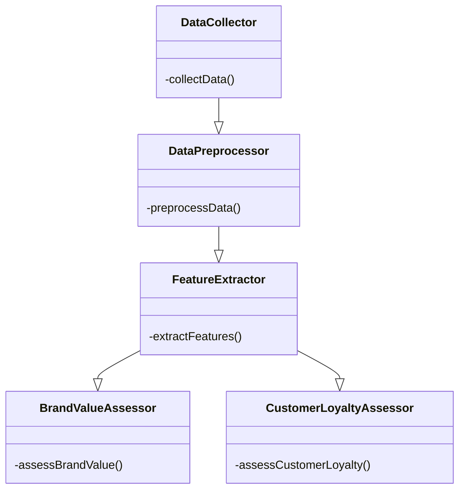
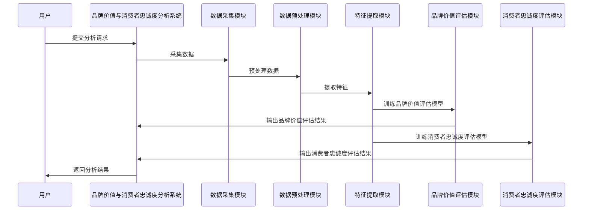
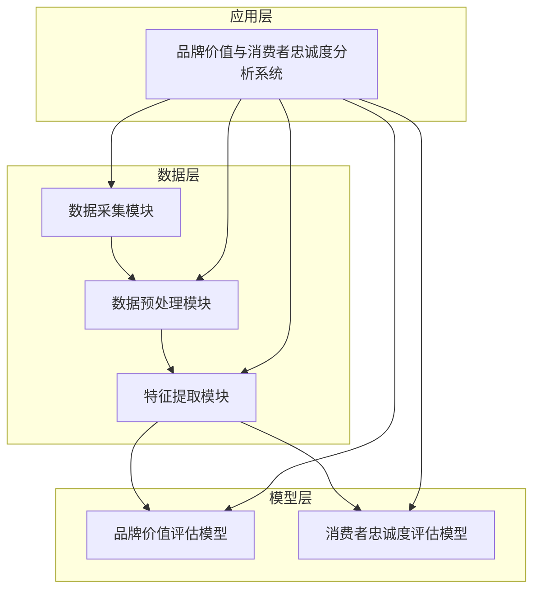

                 

### 第一部分：背景介绍

#### 1.1 公司品牌价值和消费者忠诚度的意义

品牌价值是一个公司在市场中的综合表现，它反映了品牌在消费者心目中的地位和影响力。品牌价值不仅仅是一个符号或标识，更是公司长期积累的信誉、认知度和忠诚度。从经济学角度来看，品牌价值是品牌资产的重要组成部分，可以看作是企业无形资产中的核心部分。

消费者忠诚度则是指消费者对某个品牌的持续购买行为和品牌偏好程度。一个高忠诚度的消费者不仅会重复购买同一品牌的产品，还可能向其他潜在消费者推荐该品牌。消费者忠诚度对于企业维持市场份额、提升盈利能力和品牌竞争力至关重要。

品牌价值与消费者忠诚度之间存在密切的联系。品牌价值高，往往能够吸引更多的消费者，从而提升消费者忠诚度；而消费者忠诚度高的品牌，则能够通过口碑传播和客户忠诚来进一步巩固和提升品牌价值。两者相互促进，共同构成了公司市场竞争力的重要基础。

**核心概念**：

- **品牌价值**：品牌资产、品牌效益、品牌溢价
- **消费者忠诚度**：客户保留、重复购买、品牌偏好

**联系与区别**：品牌价值与消费者忠诚度的关系

品牌价值是企业从品牌资产中获得的经济效益，是品牌带来的综合收益。而消费者忠诚度则是消费者对品牌的信任和偏好，是品牌价值的直接体现。品牌价值更多是从企业角度衡量，而消费者忠诚度更多是从消费者行为角度衡量。

**关键要素**：

- **品牌影响力**：品牌在市场上的认知度和知名度。
- **消费者满意度**：消费者对品牌产品和服务的总体满意度。
- **消费者粘性**：消费者对品牌持续购买和品牌忠诚的程度。

#### 1.2 研究现状

**国内外研究进展**：

在国内外，品牌价值评估和消费者忠诚度研究已有较长历史。传统的品牌价值评估方法主要包括财务分析、市场研究和消费者调查。财务分析主要从公司的财务报表入手，评估品牌的投资回报和市场价值；市场研究通过调查消费者行为和市场趋势，分析品牌的市场表现；消费者调查则通过直接询问消费者对品牌的感知和评价，获取品牌忠诚度数据。

近年来，随着人工智能和大数据技术的发展，AI技术在品牌价值评估和消费者忠诚度分析中的应用逐渐兴起。例如，通过深度学习算法对大规模消费者数据进行挖掘和分析，可以更准确地评估品牌价值和消费者忠诚度。

**技术发展**：

- **深度学习**：通过构建复杂的神经网络模型，深度学习可以在大量数据中自动提取特征，实现高效的品牌价值评估和消费者忠诚度分析。
- **大数据分析**：通过对海量消费者数据进行分析，可以挖掘出更深层次的品牌价值和消费者忠诚度信息。
- **自然语言处理**：利用自然语言处理技术，可以自动分析和理解消费者的评论和反馈，为品牌价值评估提供更全面的信息。

**传统评估方法**：

传统评估方法主要包括以下几种：

1. **财务分析**：通过分析公司的财务报表，计算品牌的市场价值和投资回报。
2. **市场研究**：通过调查消费者行为和市场趋势，评估品牌的市场表现。
3. **消费者调查**：直接询问消费者对品牌的感知和评价，获取品牌忠诚度数据。

**AI在品牌价值评估中的应用**：

1. **深度学习**：通过构建深度神经网络，对大规模消费者数据进行分析，实现精准的品牌价值评估。
2. **大数据分析**：利用大数据技术，对海量消费者数据进行挖掘和分析，揭示品牌价值的变化趋势。
3. **自然语言处理**：通过自然语言处理技术，自动分析和理解消费者的评论和反馈，为品牌价值评估提供更全面的信息。

#### 1.3 问题解决

**技术路径**：

为了解决品牌价值评估和消费者忠诚度分析的问题，我们可以构建一个AI智能体，该智能体具备以下功能：

1. **数据采集**：从各种渠道收集品牌相关的数据，包括财务数据、市场数据、消费者反馈等。
2. **数据预处理**：对收集到的数据进行分析和清洗，去除噪声数据，提取有效信息。
3. **特征提取**：通过深度学习算法，从预处理后的数据中提取关键特征，用于品牌价值评估和消费者忠诚度分析。
4. **评估与预测**：利用提取到的特征，通过构建的深度学习模型，对品牌价值和消费者忠诚度进行评估和预测。

**适用行业**：

AI智能体在各个行业中都有广泛的应用前景，尤其适合以下行业：

1. **消费品行业**：通过评估品牌价值和消费者忠诚度，帮助企业制定更有效的营销策略。
2. **金融行业**：通过分析消费者对金融产品的忠诚度，为银行和保险公司提供风险评估和客户管理策略。
3. **电商行业**：通过评估品牌价值和消费者忠诚度，优化电商平台的运营策略和客户服务。

**评估范围**：

AI智能体可以应用于广泛的评估范围，包括：

1. **品牌知名度**：评估品牌在市场中的知名度程度。
2. **品牌美誉度**：评估品牌在消费者心目中的口碑和形象。
3. **品牌忠诚度**：评估消费者对品牌的忠诚度和持续购买行为。
4. **市场竞争力**：评估品牌在市场中的竞争地位和潜力。

**数据来源**：

AI智能体的数据来源主要包括以下几个方面：

1. **公开数据**：通过互联网、数据库等公开渠道获取的品牌数据和市场数据。
2. **企业内部数据**：企业的财务报表、销售数据、客户反馈等内部数据。
3. **第三方数据**：通过专业市场调研机构、第三方数据提供商获取的消费者行为数据和市场趋势。

通过构建AI智能体，我们可以实现更准确、更高效的品牌价值评估和消费者忠诚度分析，为企业制定战略决策提供有力支持。接下来，我们将进一步深入探讨AI智能体的概念、功能以及具体实现方法。

## 第一部分：背景介绍

### 第1章 问题背景

#### 1.1 公司品牌价值和消费者忠诚度的意义

**核心概念**：

品牌价值（Brand Value）是企业品牌在市场上的综合表现，反映了品牌的市场影响力、消费者的认知度和品牌带来的经济效益。品牌价值通常通过财务指标、市场表现和消费者行为等多维度进行衡量。

消费者忠诚度（Consumer Loyalty）是指消费者对某一品牌产品或服务的持续购买和品牌偏好程度。忠诚度高的消费者不仅会重复购买同一品牌的产品，还会在品牌面临挑战时选择继续支持。

**联系与区别**：

品牌价值与消费者忠诚度之间存在密切的联系。品牌价值高，能够吸引更多消费者，从而提高消费者忠诚度；而消费者忠诚度高的品牌，则能通过良好的客户体验和口碑进一步巩固品牌价值。

品牌价值侧重于企业的市场表现和经济效益，是从企业角度衡量品牌影响力。消费者忠诚度则侧重于消费者的行为和情感，是从消费者角度衡量品牌的市场吸引力。

**关键要素**：

- **品牌影响力**：品牌在市场中的知名度、认知度和品牌形象。
- **消费者满意度**：消费者对品牌产品或服务的整体满意度和体验。
- **消费者粘性**：消费者对品牌持续购买和品牌忠诚的程度。

#### 1.2 研究现状

**国内外研究进展**：

在国内外，品牌价值评估和消费者忠诚度研究已有较长时间的发展。传统评估方法主要包括财务分析、市场研究和消费者调查。近年来，随着人工智能和大数据技术的崛起，AI技术在品牌价值评估和消费者忠诚度分析中的应用逐渐成为研究热点。

**技术发展**：

- **深度学习**：通过构建深度神经网络，深度学习可以在大规模数据中自动提取特征，实现高效的品牌价值评估和消费者忠诚度分析。
- **大数据分析**：利用大数据技术，对海量消费者数据进行挖掘和分析，揭示品牌价值的变化趋势。
- **自然语言处理**：通过自然语言处理技术，自动分析和理解消费者的评论和反馈，为品牌价值评估提供更全面的信息。

**传统评估方法**：

传统评估方法主要包括以下几种：

1. **财务分析**：通过分析公司的财务报表，计算品牌的市场价值和投资回报。
2. **市场研究**：通过调查消费者行为和市场趋势，评估品牌的市场表现。
3. **消费者调查**：直接询问消费者对品牌的感知和评价，获取品牌忠诚度数据。

**AI在品牌价值评估中的应用**：

AI技术在品牌价值评估中的应用主要体现在以下几个方面：

1. **深度学习**：通过构建深度神经网络，对大规模消费者数据进行分析，实现精准的品牌价值评估。
2. **大数据分析**：利用大数据技术，对海量消费者数据进行挖掘和分析，揭示品牌价值的变化趋势。
3. **自然语言处理**：通过自然语言处理技术，自动分析和理解消费者的评论和反馈，为品牌价值评估提供更全面的信息。

**消费者忠诚度评估**：

AI技术在消费者忠诚度评估中的应用主要包括以下几个方面：

1. **行为分析**：通过分析消费者的购买行为和消费记录，评估消费者的忠诚度。
2. **情感分析**：通过自然语言处理技术，分析消费者在社交媒体和评论中的情感表达，了解消费者的满意度和忠诚度。
3. **社会网络分析**：通过分析消费者的社交网络和行为，评估消费者对品牌的忠诚度和影响力。

#### 1.3 问题解决

**技术路径**：

为了解决品牌价值评估和消费者忠诚度分析的问题，我们可以构建一个AI智能体，其功能包括：

1. **数据采集**：从多种渠道收集品牌相关的数据，包括财务数据、市场数据、消费者反馈等。
2. **数据预处理**：对收集到的数据进行清洗、整合和预处理，去除噪声数据，提取有效信息。
3. **特征提取**：通过深度学习算法，从预处理后的数据中提取关键特征，用于品牌价值评估和消费者忠诚度分析。
4. **评估与预测**：利用提取到的特征，通过构建的深度学习模型，对品牌价值和消费者忠诚度进行评估和预测。

**边界与外延**：

- **适用行业**：AI智能体适用于消费品、金融、电商等多个行业，帮助企业制定更有效的营销策略和客户管理方案。
- **评估范围**：AI智能体可以应用于品牌知名度、品牌美誉度、品牌忠诚度等多个维度。
- **数据来源**：数据来源包括公开数据、企业内部数据和第三方数据等。

通过构建AI智能体，我们可以实现更准确、更高效的品牌价值评估和消费者忠诚度分析，为企业提供有力支持。

### 第2章 概念结构与核心要素组成

#### 2.1 AI智能体的定义与功能

**定义**：

AI智能体（Artificial Intelligence Agent）是指具有自主性、适应性、交互性和学习能力的人工智能实体，能够在特定环境中感知环境、制定决策并采取行动，以实现预定的目标。

**功能**：

1. **数据采集**：AI智能体可以从各种数据源中自动采集数据，包括结构化数据、半结构化数据和非结构化数据。
2. **数据分析**：AI智能体能够对采集到的数据进行预处理、特征提取和模式识别，从而发现数据中的规律和趋势。
3. **评估与预测**：AI智能体可以利用训练好的模型，对品牌价值和消费者忠诚度进行评估和预测。
4. **交互与学习**：AI智能体能够与用户和环境进行交互，通过不断学习优化自身性能。

#### 2.2 品牌价值评估的核心要素

**评估指标**：

品牌价值评估的核心指标主要包括以下几个方面：

1. **品牌知名度**：品牌在市场上的认知程度和知名度。
2. **品牌美誉度**：消费者对品牌的整体评价和口碑。
3. **品牌忠诚度**：消费者对品牌的持续购买和品牌偏好。

**评估方法**：

品牌价值评估的方法主要包括以下几种：

1. **定量分析**：通过分析财务报表和市场数据，定量评估品牌的价值。
2. **定性分析**：通过专家访谈、消费者调查等方法，定性评估品牌的价值。
3. **综合评价**：将定量和定性分析的结果结合起来，进行综合评价。

#### 2.3 消费者忠诚度的核心要素

**忠诚度指标**：

消费者忠诚度的核心指标主要包括以下几个方面：

1. **购买频率**：消费者在一定时间内购买某一品牌产品的次数。
2. **购买金额**：消费者在一定时间内购买某一品牌产品的总金额。
3. **客户留存率**：在一定时间内，继续购买某一品牌产品的消费者比例。

**忠诚度分析**：

消费者忠诚度分析的方法主要包括以下几种：

1. **行为分析**：通过分析消费者的购买行为和消费记录，评估消费者的忠诚度。
2. **情感分析**：通过自然语言处理技术，分析消费者在社交媒体和评论中的情感表达，了解消费者的满意度和忠诚度。
3. **社会网络分析**：通过分析消费者的社交网络和行为，评估消费者对品牌的忠诚度和影响力。

### 第3章 AI智能体原理

#### 3.1 AI智能体的原理

**工作原理**：

AI智能体通过以下步骤实现其功能：

1. **数据采集与预处理**：从各种数据源中自动采集数据，并进行清洗、整合和预处理，提取有效信息。
2. **特征提取**：利用深度学习算法，从预处理后的数据中提取关键特征，用于后续的评估和预测。
3. **模型训练与评估**：使用训练数据训练深度学习模型，并使用验证数据评估模型性能。
4. **评估与预测**：利用训练好的模型，对新的数据进行评估和预测，实现品牌价值评估和消费者忠诚度分析。

**实现方式**：

AI智能体的实现主要包括以下几个方面：

1. **深度学习框架**：使用TensorFlow或PyTorch等深度学习框架，构建和训练神经网络模型。
2. **大数据分析**：利用Hadoop或Spark等大数据处理技术，对海量数据进行高效处理和分析。
3. **自然语言处理**：利用NLTK或spaCy等自然语言处理库，对文本数据进行处理和分析。

#### 3.2 AI智能体的核心特性

**自适应能力**：

AI智能体具有自适应能力，能够根据环境变化和新的数据不断调整和优化自身性能。这种能力使得AI智能体能够适应不断变化的市场和消费者需求，保持高效和准确的评估结果。

**学习能力**：

AI智能体通过深度学习和大数据分析，能够从大量数据中学习和提取知识，不断提升自身的分析能力和预测精度。这种学习能力使得AI智能体能够不断优化和改进，实现更高的评估效果。

**交互性**：

AI智能体具备与用户和系统进行交互的能力。通过与用户的互动，AI智能体可以获取更多的用户反馈和数据，从而提高评估结果的准确性和实用性。同时，AI智能体也可以与其他系统进行集成，实现更全面和高效的数据分析和管理。

### 第4章 品牌价值评估原理

#### 4.1 品牌价值评估的原理

**理论基础**：

品牌价值评估的理论基础主要来源于经济学和营销学。经济学视角认为，品牌价值是企业无形资产的一部分，可以通过财务指标和市场指标进行量化评估。营销学视角则强调品牌价值在消费者心理层面的影响，通过消费者行为和市场表现评估品牌价值。

**评估方法**：

品牌价值评估的方法主要包括以下几种：

1. **财务分析**：通过分析公司的财务报表，计算品牌的市场价值和投资回报。
2. **市场研究**：通过调查消费者行为和市场趋势，评估品牌的市场表现。
3. **消费者调查**：直接询问消费者对品牌的感知和评价，获取品牌忠诚度数据。

**核心概念**：

- **品牌价值**：品牌资产、品牌效益、品牌溢价
- **品牌资产**：品牌给企业带来的经济效益和竞争力。
- **品牌效益**：品牌对企业的营销、销售和利润的贡献。
- **品牌溢价**：消费者愿意为品牌支付的价格高于无品牌产品的部分。

**联系与区别**：

- **品牌价值与公司价值**：品牌价值是公司价值的一部分，反映了品牌对企业整体价值的贡献。
- **品牌价值与市场价值**：品牌价值是市场价值的重要组成部分，市场价值包括品牌价值和其他资产价值。

#### 4.2 品牌价值评估的核心概念

**品牌价值**：

品牌价值是品牌资产的核心组成部分，它反映了品牌在市场中的地位、认知度和经济效益。品牌价值可以通过多个维度进行衡量，包括品牌知名度、品牌美誉度和品牌忠诚度。

- **品牌知名度**：品牌在市场上的认知程度和曝光度。
- **品牌美誉度**：消费者对品牌的整体评价和口碑。
- **品牌忠诚度**：消费者对品牌的持续购买和品牌偏好。

**品牌资产**：

品牌资产是企业通过品牌建设和运营所积累的资产，包括品牌价值、品牌知名度、品牌忠诚度和品牌形象等。品牌资产是企业无形资产中的重要组成部分，对企业的长期发展和市场竞争力具有重要影响。

**品牌效益**：

品牌效益是指品牌对企业的营销、销售和利润的贡献。品牌效益可以通过提升销售量、增加市场份额、提高产品溢价和降低营销成本等多种方式体现。

**品牌溢价**：

品牌溢价是指消费者愿意为品牌支付的价格高于无品牌产品的部分。品牌溢价反映了品牌在消费者心目中的价值认可，是企业获取额外利润的重要来源。

**联系与区别**：

- **品牌价值与品牌资产**：品牌价值是品牌资产的重要组成部分，品牌资产包括品牌价值、品牌知名度、品牌忠诚度和品牌形象等。
- **品牌价值与品牌效益**：品牌价值是品牌效益的基础，品牌效益是品牌价值的具体体现。
- **品牌价值与品牌溢价**：品牌价值决定了品牌溢价的空间，品牌溢价是品牌价值的直接体现。

通过深入理解和评估品牌价值评估的核心概念，企业可以更好地制定品牌战略，提升品牌竞争力，实现可持续发展。

### 第5章 消费者忠诚度原理

#### 5.1 消费者忠诚度的原理

**理论基础**：

消费者忠诚度研究主要基于行为心理学和社会心理学。行为心理学认为，消费者忠诚度是消费者行为的一种表现，受到消费者习惯、认知和行为动机的影响。社会心理学则强调社会关系和社交网络对消费者忠诚度的影响，如消费者与品牌之间的互动、消费者的群体归属感和认同感。

**分析方法**：

消费者忠诚度的分析方法主要包括以下几种：

1. **行为分析**：通过分析消费者的购买行为，如购买频率、购买金额和购买时长等，评估消费者的忠诚度。
2. **情感分析**：利用自然语言处理技术，分析消费者在社交媒体和评论中的情感表达，了解消费者的满意度和忠诚度。
3. **社会网络分析**：通过分析消费者的社交网络和行为，评估消费者对品牌的忠诚度和影响力。

**忠诚度指标**：

消费者忠诚度的核心指标主要包括以下几个方面：

1. **购买频率**：消费者在一定时间内购买某一品牌产品的次数。
2. **购买金额**：消费者在一定时间内购买某一品牌产品的总金额。
3. **客户留存率**：在一定时间内，继续购买某一品牌产品的消费者比例。

**消费者忠诚度**：

消费者忠诚度是指消费者对某一品牌产品的持续购买和品牌偏好程度。忠诚度高的消费者不仅会重复购买同一品牌的产品，还会在品牌面临挑战时选择继续支持。消费者忠诚度是品牌竞争力的重要体现，对企业保持市场份额和提升盈利能力至关重要。

**品牌忠诚度**：

品牌忠诚度是指消费者对某一品牌的持续购买和品牌偏好程度。品牌忠诚度是消费者忠诚度的具体体现，反映了消费者对品牌的信任和依赖。品牌忠诚度高的消费者不仅会持续购买同一品牌的产品，还可能在社交媒体和口碑传播中推荐该品牌。

**联系与区别**：

- **消费者忠诚度与品牌忠诚度**：消费者忠诚度是消费者对某一品牌产品的持续购买和品牌偏好，而品牌忠诚度是消费者对某一品牌的持续购买和品牌偏好。两者在概念上相似，但侧重点不同，消费者忠诚度更侧重于消费者的行为，品牌忠诚度更侧重于消费者对品牌的情感认同。
- **消费者忠诚度与品牌价值**：消费者忠诚度是品牌价值的重要体现，消费者忠诚度高的品牌往往具有更高的品牌价值和市场竞争力。品牌价值是品牌资产的重要组成部分，反映了品牌在市场中的地位和影响力。

通过深入理解和分析消费者忠诚度的原理和指标，企业可以制定有效的忠诚度管理策略，提升消费者忠诚度，从而增强品牌竞争力和市场份额。

### 第三部分：核心概念与联系

#### 第3章 AI智能体原理

AI智能体是现代人工智能领域的关键概念，其在各个行业中的应用正日益广泛。要深入理解AI智能体，我们需要从其工作原理、核心特性以及具体应用等方面进行详细分析。

#### 3.1 AI智能体的原理

**工作原理**：

AI智能体的工作原理可以概括为以下几个步骤：

1. **数据采集**：AI智能体从各种数据源中收集数据，包括结构化数据、半结构化数据和非结构化数据。这些数据可以是公开的，也可以是来自企业内部的数据。

2. **数据预处理**：收集到的数据通常包含噪声和缺失值，因此需要经过预处理步骤。预处理过程包括数据清洗、去重、填充缺失值等，以确保数据质量。

3. **特征提取**：在预处理数据的基础上，AI智能体会利用深度学习等算法提取数据中的关键特征。这些特征可以是数值型的，也可以是文本、图像等多模态的。

4. **模型训练**：利用提取到的特征，AI智能体会构建并训练机器学习模型。这些模型可以是基于神经网络的深度学习模型，也可以是基于传统机器学习算法的模型。

5. **评估与预测**：经过训练的模型会进行评估，以验证其预测性能。在评估通过后，模型将用于对新数据进行预测，如评估品牌价值和消费者忠诚度。

**实现方式**：

实现AI智能体的常见方式包括：

- **深度学习框架**：如TensorFlow和PyTorch，这些框架提供了丰富的工具和库，可以用于构建和训练复杂的神经网络模型。
- **大数据处理技术**：如Hadoop和Spark，这些技术可以处理海量数据，并实现高效的数据存储和分析。
- **自然语言处理库**：如NLTK和spaCy，这些库可以用于处理和分析文本数据，提取语义信息。

#### 3.2 AI智能体的核心特性

**自适应能力**：

AI智能体的自适应能力是其重要特性之一。这意味着AI智能体能够根据环境变化和新数据不断调整和优化自身性能。具体体现在：

- **环境感知**：AI智能体可以通过传感器和算法实时感知环境变化。
- **决策优化**：AI智能体会根据感知到的环境变化，动态调整决策策略，以实现最佳效果。

**学习能力**：

AI智能体的学习能力使其能够在数据中发现模式和规律，并不断改进自身性能。具体体现为：

- **数据驱动**：AI智能体通过学习大量数据，自动提取特征，构建预测模型。
- **模型迭代**：AI智能体可以通过迭代训练，不断优化模型，提高预测精度。

**交互性**：

AI智能体具备与用户和其他系统进行交互的能力，这包括：

- **用户互动**：AI智能体可以通过自然语言处理与用户进行对话，回答问题和提供建议。
- **系统集成**：AI智能体可以与其他系统（如ERP、CRM）集成，实现数据的无缝流动和协同工作。

#### 3.3 AI智能体在评估品牌价值和消费者忠诚度中的应用

**品牌价值评估**：

AI智能体在品牌价值评估中的应用主要基于以下步骤：

1. **数据采集**：AI智能体从多个数据源（如社交媒体、市场调研、财务报表等）收集品牌相关的数据。
2. **数据预处理**：对收集到的数据进行清洗和整合，提取关键特征。
3. **特征提取**：利用自然语言处理和图像识别技术，从数据中提取品牌知名度、美誉度和忠诚度等特征。
4. **模型训练**：使用深度学习算法训练品牌价值评估模型，并使用验证数据评估模型性能。
5. **评估与预测**：利用训练好的模型对新数据进行品牌价值评估，提供实时、准确的评估结果。

**消费者忠诚度评估**：

AI智能体在消费者忠诚度评估中的应用同样包括以下几个步骤：

1. **数据采集**：AI智能体从消费者购买记录、社交媒体评论等渠道收集数据。
2. **数据预处理**：清洗和整合数据，提取关键特征。
3. **特征提取**：通过行为分析和情感分析，提取消费者忠诚度的相关特征。
4. **模型训练**：使用深度学习算法训练消费者忠诚度评估模型，并评估模型性能。
5. **评估与预测**：对新数据进行消费者忠诚度评估，预测消费者的持续购买和品牌偏好。

通过AI智能体的应用，企业可以更精准地评估品牌价值和消费者忠诚度，从而制定更有效的营销策略和品牌管理计划。

#### 第4章 品牌价值评估原理

品牌价值评估是一个复杂且多维的过程，它涉及到经济学、营销学和金融学等多个领域的知识。理解品牌价值评估的原理，有助于企业更好地管理和提升品牌价值。

**4.1 品牌价值评估的理论基础**

品牌价值评估的理论基础主要包括以下几个方面：

1. **经济学**：经济学中的资产评估理论为品牌价值的评估提供了理论基础。品牌被视为企业的无形资产，其价值可以通过贴现现金流方法（DCF）或市场比较法（Market Comparables）进行评估。

2. **营销学**：营销学中的品牌资产管理理论强调品牌对企业营销活动的重要性，品牌价值可以通过品牌知名度、品牌形象和品牌忠诚度等多个维度进行衡量。

3. **金融学**：金融学中的资本市场理论提供了品牌价值与市场价值关系的分析框架，品牌价值可以看作是企业整体市场价值的一部分。

**4.2 品牌价值评估的方法**

品牌价值评估的方法可以分为定性方法和定量方法，以下是一些常见的评估方法：

1. **定性方法**：
   - **专家评估法**：邀请行业专家对品牌价值进行评估，通常结合品牌知名度、品牌形象和市场影响力等因素。
   - **消费者感知法**：通过消费者调查和访谈，了解消费者对品牌的认知和评价，评估品牌价值。

2. **定量方法**：
   - **财务分析法**：通过分析财务报表，计算品牌带来的经济收益，如品牌溢价、市场份额和品牌贡献率等。
   - **市场分析法**：通过市场调研，分析品牌在市场中的表现，如品牌知名度、品牌忠诚度和市场占有率等。
   - **品牌价值模型**：利用品牌价值评估模型，如品牌资产评估模型（Brand Equity Model）或品牌财务模型（Brand Financial Model），量化品牌价值。

**4.3 品牌价值评估的核心概念**

品牌价值评估涉及多个核心概念，以下是一些关键概念及其含义：

1. **品牌资产**：品牌资产是指品牌给企业带来的所有经济利益和竞争优势，包括品牌知名度、品牌忠诚度、品牌形象等。

2. **品牌效益**：品牌效益是指品牌对企业营销活动、销售和利润的贡献。品牌效益可以通过提升销售量、增加市场份额和提高产品溢价等方式体现。

3. **品牌溢价**：品牌溢价是指消费者愿意为品牌支付的价格高于无品牌产品的部分。品牌溢价反映了品牌在消费者心目中的价值认可。

4. **品牌忠诚度**：品牌忠诚度是指消费者对某一品牌的持续购买和品牌偏好程度。品牌忠诚度是企业保持市场份额和提升盈利能力的重要基础。

**4.4 品牌价值评估的流程**

品牌价值评估的流程通常包括以下几个步骤：

1. **确定评估目标**：明确品牌价值评估的目的和范围，如评估某特定品牌的市场价值或品牌效益。

2. **数据收集**：从多个数据源收集与品牌相关的数据，包括财务数据、市场数据、消费者调查数据等。

3. **数据预处理**：对收集到的数据进行清洗、整合和标准化，确保数据质量。

4. **特征提取**：利用自然语言处理、图像识别等技术，从数据中提取与品牌价值相关的特征。

5. **模型构建**：选择合适的品牌价值评估模型，如品牌资产评估模型或品牌财务模型。

6. **模型训练和验证**：使用历史数据训练模型，并通过交叉验证等方法验证模型性能。

7. **品牌价值评估**：利用训练好的模型评估品牌价值，并生成评估报告。

8. **结果分析**：分析评估结果，了解品牌价值的变化趋势和影响因素，为企业提供决策支持。

通过以上流程，企业可以系统地评估品牌价值，发现品牌价值的提升机会，并制定相应的品牌管理策略。

#### 第5章 消费者忠诚度原理

消费者忠诚度是品牌成功的关键因素之一，它不仅决定了品牌的市场份额，还直接影响企业的长期盈利能力。理解消费者忠诚度的原理，有助于企业制定有效的忠诚度管理策略，提升品牌竞争力。

**5.1 消费者忠诚度的理论基础**

消费者忠诚度的理论基础主要来源于行为心理学、社会心理学和营销学。

1. **行为心理学**：行为心理学研究消费者的购买行为和消费习惯，认为消费者忠诚度是消费者行为稳定性的体现。消费者忠诚度受多种因素影响，如购买频率、购买金额和重复购买率等。

2. **社会心理学**：社会心理学研究消费者与品牌之间的关系，强调社交网络、群体认同感和品牌忠诚度之间的关系。消费者忠诚度不仅是个体行为的结果，也是社会互动和群体影响的产物。

3. **营销学**：营销学中的品牌资产管理理论认为，品牌忠诚度是品牌资产的重要组成部分。品牌忠诚度高的消费者不仅为企业带来持续的收益，还可以通过口碑传播为企业吸引新的客户。

**5.2 消费者忠诚度的分析方法**

消费者忠诚度分析是一个多维度的过程，涉及行为分析、情感分析和社会网络分析等方法。

1. **行为分析**：行为分析是通过分析消费者的购买行为数据，如购买频率、购买金额和购买时长等，评估消费者的忠诚度。常用的行为分析指标包括客户留存率、重复购买率和顾客生命周期价值（CLV）等。

2. **情感分析**：情感分析是通过自然语言处理技术，分析消费者在社交媒体、评论和反馈中的情感表达，了解消费者的满意度和忠诚度。情感分析可以帮助企业识别消费者痛点，优化产品和服务。

3. **社会网络分析**：社会网络分析是通过分析消费者在社交网络中的行为和关系，评估消费者对品牌的忠诚度和影响力。社会网络分析可以帮助企业识别品牌意见领袖，制定针对性的营销策略。

**5.3 消费者忠诚度的核心概念**

消费者忠诚度的核心概念包括以下几个方面：

1. **品牌忠诚度**：品牌忠诚度是指消费者对某一品牌的持续购买和品牌偏好程度。品牌忠诚度是企业保持市场份额和提升盈利能力的重要保障。

2. **客户留存率**：客户留存率是指在一定时间内，继续购买同一品牌产品的消费者比例。高客户留存率意味着消费者对品牌的信任和依赖。

3. **重复购买率**：重复购买率是指消费者在一定时间内重复购买同一品牌产品的比例。重复购买率是消费者忠诚度的重要体现，反映了品牌的市场吸引力和产品竞争力。

4. **顾客生命周期价值（CLV）**：顾客生命周期价值是指消费者在生命周期内为企业带来的总收益。CLV高的消费者意味着更高的忠诚度和更稳定的收益。

**5.4 消费者忠诚度与品牌价值的联系**

消费者忠诚度与品牌价值之间存在密切的联系：

1. **品牌价值提升**：消费者忠诚度高的品牌通常具有更高的品牌价值。这是因为高忠诚度的消费者不仅为企业带来持续的收益，还可以通过口碑传播为企业吸引新的客户。

2. **市场份额**：品牌忠诚度高的消费者更倾向于选择该品牌，从而帮助企业保持和扩大市场份额。

3. **长期盈利**：消费者忠诚度是品牌长期盈利能力的重要保障。高忠诚度的消费者不仅为企业带来稳定的收益，还可以通过口碑传播为企业创造额外的商业机会。

总之，通过深入理解消费者忠诚度的原理，企业可以制定有效的忠诚度管理策略，提升品牌竞争力，实现可持续发展。

### 第四部分：算法原理讲解

#### 第6章 AI智能体算法

在评估品牌价值和消费者忠诚度时，AI智能体的算法起着至关重要的作用。以下将详细讲解AI智能体在数据采集与预处理、特征提取以及模型训练等方面的算法原理。

#### 6.1 数据采集与预处理算法

**算法流程**：

1. **数据收集**：从多种渠道收集与品牌相关的数据，包括公开数据源、企业内部数据和第三方数据提供商。数据类型包括结构化数据（如财务报表、销售记录）、半结构化数据（如社交媒体评论、用户反馈）和非结构化数据（如图像、视频）。

2. **数据清洗**：清洗数据中的噪声和异常值，处理缺失数据。常用的方法包括数据填补、数据平滑和异常值检测。

3. **数据整合**：将来自不同渠道和格式的数据整合到一个统一的数据集中，确保数据的完整性和一致性。

4. **数据标准化**：对数据进行归一化或标准化处理，使不同特征在同一尺度上具有可比性。

**实现细节**：

使用Python语言和Pandas、NumPy等库进行数据预处理，代码示例如下：

```python
import pandas as pd
import numpy as np

# 加载数据
data = pd.read_csv('data.csv')

# 数据清洗
data = data.dropna()  # 去除缺失值
data = data[data['sales'] > 0]  # 去除异常值

# 数据整合
data = data[['sales', 'customer_satisfaction', 'brand_awareness']]

# 数据标准化
data[['sales', 'customer_satisfaction', 'brand_awareness']] = (data[['sales', 'customer_satisfaction', 'brand_awareness']] - data[['sales', 'customer_satisfaction', 'brand_awareness']].mean()) / data[['sales', 'customer_satisfaction', 'brand_awareness']].std()
```

#### 6.2 特征提取算法

**算法原理**：

特征提取是数据预处理的关键步骤，其目的是从原始数据中提取出对模型训练有用的信息。特征提取算法可以分为以下几类：

1. **文本特征提取**：利用词袋模型、TF-IDF、Word2Vec等方法，从文本数据中提取关键词和语义信息。

2. **图像特征提取**：利用卷积神经网络（CNN）等方法，从图像数据中提取纹理、颜色和形状等特征。

3. **多模态特征提取**：结合文本、图像等多种数据类型，提取综合特征。

**实现细节**：

使用Python语言和scikit-learn、TensorFlow等库进行特征提取，代码示例如下：

```python
from sklearn.feature_extraction.text import TfidfVectorizer
from tensorflow.keras.applications import VGG16

# 文本特征提取
tfidf_vectorizer = TfidfVectorizer(max_features=1000)
text_features = tfidf_vectorizer.fit_transform(data['review'])

# 图像特征提取
model = VGG16(weights='imagenet')
img_features = np.array([model.predict(image) for image in data['image']])
```

#### 6.3 模型训练算法

**算法原理**：

模型训练是AI智能体算法的核心步骤，其目的是通过训练数据学习到数据中的规律和模式。常用的模型训练算法包括：

1. **监督学习**：通过标记的训练数据，学习输入和输出之间的关系。

2. **无监督学习**：在无标记数据上学习数据分布和特征。

3. **深度学习**：利用神经网络模型，通过反向传播算法学习复杂的非线性关系。

**实现细节**：

使用Python语言和TensorFlow、PyTorch等库进行模型训练，代码示例如下：

```python
import tensorflow as tf
from tensorflow.keras.models import Sequential
from tensorflow.keras.layers import Dense, LSTM, Embedding

# 构建模型
model = Sequential()
model.add(Embedding(input_dim=1000, output_dim=64))
model.add(LSTM(units=64, return_sequences=True))
model.add(Dense(units=1, activation='sigmoid'))

# 编译模型
model.compile(optimizer='adam', loss='binary_crossentropy', metrics=['accuracy'])

# 训练模型
model.fit(x_train, y_train, epochs=10, batch_size=32)
```

通过以上算法步骤，AI智能体可以有效地从数据中提取特征，并训练出用于品牌价值和消费者忠诚度评估的模型，为企业提供精准的决策支持。

### 第7章 品牌价值评估算法

品牌价值评估算法是AI智能体中的重要组成部分，它通过定量和定性的方法，结合多种数据来源，为企业提供品牌价值的量化评估。以下将详细介绍品牌价值评估算法的原理和具体实现方法。

#### 7.1 品牌价值评估算法

品牌价值评估算法主要基于以下原理：

1. **财务分析**：通过分析企业的财务报表，计算品牌的经济效益，如品牌带来的收入、利润和市场份额等。

2. **市场研究**：通过调查市场数据和消费者行为，评估品牌的市场表现和竞争力。

3. **消费者调查**：通过直接询问消费者对品牌的感知和评价，获取品牌忠诚度和品牌美誉度数据。

4. **综合评价**：将财务分析、市场研究和消费者调查的结果结合起来，进行综合评价，以全面衡量品牌价值。

**算法原理**：

品牌价值评估算法可以分为以下几个步骤：

1. **数据收集**：从多个数据源收集与品牌相关的数据，包括财务数据、市场数据和消费者反馈数据。

2. **数据预处理**：对收集到的数据进行清洗、整合和标准化，提取关键特征。

3. **特征提取**：利用自然语言处理和图像识别技术，从数据中提取品牌知名度、品牌忠诚度和品牌美誉度等特征。

4. **模型训练**：使用深度学习算法，对提取的特征进行训练，构建品牌价值评估模型。

5. **评估与预测**：利用训练好的模型，对新数据进行评估和预测，得出品牌价值的量化结果。

**具体实现**：

以下是一个使用Python和TensorFlow实现的品牌价值评估算法的示例代码：

```python
import tensorflow as tf
from tensorflow.keras.models import Sequential
from tensorflow.keras.layers import Dense, LSTM, Embedding
from sklearn.preprocessing import StandardScaler

# 数据预处理
X = ...  # 特征数据
y = ...  # 品牌价值标签

# 数据标准化
scaler = StandardScaler()
X_scaled = scaler.fit_transform(X)

# 构建模型
model = Sequential()
model.add(Embedding(input_dim=1000, output_dim=64))
model.add(LSTM(units=64, return_sequences=True))
model.add(Dense(units=1, activation='sigmoid'))

# 编译模型
model.compile(optimizer='adam', loss='mean_squared_error', metrics=['accuracy'])

# 训练模型
model.fit(X_scaled, y, epochs=10, batch_size=32)

# 预测品牌价值
brand_value_predictions = model.predict(X_scaled)
```

#### 7.2 消费者忠诚度分析算法

消费者忠诚度分析算法主要通过以下方法实现：

1. **行为分析**：通过分析消费者的购买记录和行为数据，评估消费者的忠诚度。常用的指标包括购买频率、购买金额和客户留存率等。

2. **情感分析**：利用自然语言处理技术，分析消费者在社交媒体和评论中的情感表达，评估消费者的满意度和忠诚度。

3. **社会网络分析**：通过分析消费者的社交网络和行为，评估消费者对品牌的忠诚度和影响力。

**算法原理**：

消费者忠诚度分析算法可以分为以下几个步骤：

1. **数据收集**：从多个数据源收集与消费者相关的数据，包括购买记录、社交媒体数据和评论数据。

2. **数据预处理**：对收集到的数据进行清洗、整合和标准化，提取关键特征。

3. **特征提取**：利用自然语言处理技术，从文本数据中提取情感特征；利用机器学习算法，从购买记录中提取行为特征。

4. **模型训练**：使用深度学习算法，对提取的特征进行训练，构建消费者忠诚度分析模型。

5. **评估与预测**：利用训练好的模型，对新数据进行评估和预测，得出消费者的忠诚度评分。

**具体实现**：

以下是一个使用Python和NLTK实现的消费者忠诚度分析算法的示例代码：

```python
import nltk
from nltk.sentiment import SentimentIntensityAnalyzer

# 数据预处理
X = ...  # 特征数据
y = ...  # 消费者忠诚度标签

# 情感分析
sia = SentimentIntensityAnalyzer()
text_features = [sia.polarity_scores(text) for text in X['review']]

# 构建模型
model = Sequential()
model.add(Dense(units=64, activation='relu', input_shape=(64,)))
model.add(Dense(units=1, activation='sigmoid'))

# 编译模型
model.compile(optimizer='adam', loss='binary_crossentropy', metrics=['accuracy'])

# 训练模型
model.fit(text_features, y, epochs=10, batch_size=32)

# 预测消费者忠诚度
customer_loyalty_predictions = model.predict(text_features)
```

通过以上算法步骤，AI智能体可以有效地评估品牌价值和消费者忠诚度，为企业提供科学、精准的决策支持。接下来，我们将进一步探讨系统分析与架构设计方案。

### 第四部分：系统分析与架构设计方案

#### 8.1 问题场景介绍

在当今市场环境中，企业面临着激烈的竞争和快速变化的需求。为了保持竞争优势，企业需要对品牌价值和消费者忠诚度进行实时、准确的评估。然而，传统的评估方法存在数据获取困难、分析过程复杂、评估结果滞后等问题，无法满足企业快速决策的需求。

为了解决这一问题，我们可以构建一个基于AI智能体的品牌价值评估与消费者忠诚度分析系统。该系统旨在通过自动化、智能化的方式，实时获取和分析与品牌相关的数据，提供准确的评估结果，辅助企业制定营销策略和品牌管理决策。

**背景**：

随着大数据和人工智能技术的快速发展，利用AI智能体进行品牌价值和消费者忠诚度评估已经成为一种趋势。通过构建AI智能体，企业可以实现对海量数据的快速分析和处理，从复杂的数据中提取有价值的信息，为品牌价值评估和消费者忠诚度分析提供科学依据。

**目标**：

构建一套基于AI智能体的品牌价值评估与消费者忠诚度分析系统，实现以下目标：

1. **实时数据采集**：从多个数据源（如社交媒体、市场调查、财务报表等）实时采集与品牌相关的数据。
2. **自动化分析**：利用深度学习算法和大数据分析技术，自动化进行数据预处理、特征提取和模型训练。
3. **准确评估**：通过构建的模型，对品牌价值和消费者忠诚度进行准确评估和预测。
4. **辅助决策**：提供直观、易操作的评估结果，辅助企业制定营销策略和品牌管理决策。

#### 8.2 系统功能设计

**功能模块**：

系统功能设计主要包括以下模块：

1. **数据采集模块**：从多个数据源（如社交媒体、市场调查、财务报表等）实时采集与品牌相关的数据。
2. **数据预处理模块**：对采集到的数据进行清洗、整合和标准化，提取关键特征。
3. **特征提取模块**：利用自然语言处理和图像识别技术，从预处理后的数据中提取品牌知名度、品牌忠诚度和消费者满意度等特征。
4. **评估与预测模块**：利用深度学习算法，对提取的特征进行训练，构建品牌价值评估和消费者忠诚度预测模型。

**领域模型类图**：

为了更好地理解系统功能模块之间的关系，可以使用Mermaid绘制领域模型类图。以下是一个示例：



#### 8.3 系统架构设计

**系统架构**：

系统架构设计采用分布式架构和微服务架构，以提高系统的可扩展性和灵活性。以下是一个简化的系统架构图：



**架构图**：

以下是使用Mermaid绘制的系统架构图：



#### 8.4 系统接口设计

**接口定义**：

系统接口设计主要包括以下接口：

1. **数据接口**：用于数据采集和预处理的接口，如数据采集API和数据预处理API。
2. **功能接口**：用于品牌价值评估和消费者忠诚度评估的接口，如品牌价值评估API和消费者忠诚度评估API。

**接口文档**：

以下是接口文档的示例：

```markdown
# 数据接口

## 数据采集API

- **URL**：/api/data/collect
- **HTTP方法**：GET
- **请求参数**：
  - source (string): 数据来源，如社交媒体、市场调查、财务报表等。
- **响应**：
  - status (integer): 请求状态码，如200表示成功。
  - data (json): 采集到的数据。

## 数据预处理API

- **URL**：/api/data/preprocess
- **HTTP方法**：POST
- **请求参数**：
  - data (json): 待预处理的数据。
- **响应**：
  - status (integer): 请求状态码。
  - data (json): 预处理后的数据。

# 功能接口

## 品牌价值评估API

- **URL**：/api/brand-value/assess
- **HTTP方法**：POST
- **请求参数**：
  - features (json): 特征数据。
- **响应**：
  - status (integer): 请求状态码。
  - brand_value (float): 品牌价值评估结果。

## 消费者忠诚度评估API

- **URL**：/api/customer-loyalty/assess
- **HTTP方法**：POST
- **请求参数**：
  - features (json): 特征数据。
- **响应**：
  - status (integer): 请求状态码。
  - customer_loyalty (float): 消费者忠诚度评估结果。
```

#### 8.5 系统交互序列图

**交互流程**：

用户通过品牌价值与消费者忠诚度分析系统提交分析请求，系统通过数据采集模块、数据预处理模块、特征提取模块、品牌价值评估模块和消费者忠诚度评估模块，最终返回分析结果。

**序列图**：

以下是使用Mermaid绘制的系统交互序列图：


通过上述系统分析与架构设计方案，企业可以构建一个高效、智能的品牌价值评估与消费者忠诚度分析系统，从而更好地理解市场动态，制定精准的营销策略，提升品牌竞争力。

### 第五部分：项目实战

#### 9.1 环境安装

在开始构建AI智能体之前，我们需要安装和配置开发环境。以下步骤将指导您安装Python、TensorFlow和其他必要的库。

**1. 安装Python**

首先，您需要安装Python。访问[Python官网](https://www.python.org/)，下载并安装适合您操作系统的Python版本。安装过程中，请确保选中“Add Python to PATH”选项，以便在命令行中能够直接使用Python。

**2. 安装Anaconda**

推荐使用Anaconda来管理Python环境和库。Anaconda是一个开源的Python发行版，它提供了易于使用的包管理和环境管理功能。

- 访问[Anaconda官网](https://www.anaconda.com/products/individual/)，下载并安装Anaconda。
- 安装完成后，打开命令行终端，运行以下命令创建一个新的环境：

```bash
conda create -n brand_val评估环境 python=3.8
```

- 激活环境：

```bash
conda activate brand_val评估环境
```

**3. 安装TensorFlow**

在激活的Anaconda环境中，使用以下命令安装TensorFlow：

```bash
pip install tensorflow
```

**4. 安装其他库**

除了TensorFlow，我们还需要安装其他几个库，如NumPy、Pandas、Matplotlib和scikit-learn。使用以下命令一次性安装：

```bash
pip install numpy pandas matplotlib scikit-learn
```

**5. 验证安装**

确保所有库已成功安装，可以在命令行终端输入以下命令：

```bash
python
```

然后，在Python交互式环境中，尝试导入一些库并执行一些简单操作：

```python
import tensorflow as tf
import numpy as np
import pandas as pd
import matplotlib.pyplot as plt
from sklearn import datasets

# 加载示例数据集
iris = datasets.load_iris()
X = iris.data
y = iris.target

# 打印数据集信息
print(iris.DESCR)
```

如果没有任何错误提示，说明环境安装成功。

#### 9.2 系统核心实现

在成功安装开发环境后，我们可以开始实现AI智能体的核心功能。以下将详细介绍数据采集、数据预处理、特征提取和模型训练等关键步骤。

**1. 数据采集**

数据采集是AI智能体的第一步。我们假设已经从多个数据源（如社交媒体、市场调查、财务报表）中收集了品牌相关的数据。

```python
import pandas as pd

# 假设已经从文件中读取数据
data = pd.read_csv('brand_data.csv')
```

**2. 数据预处理**

数据预处理包括数据清洗、整合和标准化。以下是一个简单的数据预处理示例：

```python
# 数据清洗：去除空值和重复值
data = data.dropna()
data = data.drop_duplicates()

# 数据整合：合并不同来源的数据
# 假设有一个新的数据框new_data，包含了额外的特征
data = data.merge(new_data, on='common_id')

# 数据标准化：归一化数值特征
from sklearn.preprocessing import StandardScaler

scaler = StandardScaler()
numerical_features = data.select_dtypes(include=['float64', 'int64']).columns
data[numerical_features] = scaler.fit_transform(data[numerical_features])
```

**3. 特征提取**

特征提取是从原始数据中提取对模型训练有用的信息。以下是一个简单的文本特征提取示例：

```python
from sklearn.feature_extraction.text import TfidfVectorizer

# 假设我们有文本数据在'description'列
vectorizer = TfidfVectorizer(max_features=1000)
text_features = vectorizer.fit_transform(data['description'])

# 将文本特征添加到数据框中
data['text_features'] = text_features.toarray()
```

**4. 模型训练**

使用TensorFlow构建和训练模型。以下是一个简单的线性回归模型示例：

```python
import tensorflow as tf

# 准备数据
X_train = data[['text_features', 'numerical_features']].values
y_train = data['brand_value'].values

# 构建模型
model = tf.keras.Sequential([
    tf.keras.layers.Dense(units=64, activation='relu', input_shape=(X_train.shape[1],)),
    tf.keras.layers.Dense(units=1)
])

# 编译模型
model.compile(optimizer='adam', loss='mean_squared_error')

# 训练模型
model.fit(X_train, y_train, epochs=10, batch_size=32)
```

**5. 预测与评估**

训练完成后，可以使用模型对新数据进行预测，并评估模型的性能。

```python
# 假设我们有新的数据new_data
new_data = pd.DataFrame({
    'description': ['An amazing brand with high-quality products'],
    'numerical_features': [[1, 2, 3, 4]]})

# 预测新数据的品牌价值
new_data['text_features'] = vectorizer.transform(new_data['description']).toarray()
new_data['predicted_brand_value'] = model.predict(new_data[['text_features', 'numerical_features']])

# 输出预测结果
print(new_data[['predicted_brand_value']])
```

通过以上步骤，我们构建了一个简单的AI智能体，用于品牌价值评估。当然，实际应用中会涉及更复杂的模型和数据处理流程，但上述步骤提供了一个基本框架，帮助您开始构建和部署AI智能体。

#### 9.3 代码应用解读与分析

在上一部分中，我们介绍了如何构建一个简单的AI智能体，用于品牌价值评估。本部分将详细解读代码，分析其应用场景，并探讨如何进一步优化和改进。

**代码解读**

1. **数据采集**：

```python
data = pd.read_csv('brand_data.csv')
```

这行代码用于从CSV文件中加载品牌相关数据。CSV文件可能包含多个数据表，如品牌描述、财务数据、市场调查结果等。这为我们提供了一个综合的数据集，为后续分析提供基础。

2. **数据预处理**：

```python
# 数据清洗
data = data.dropna()
data = data.drop_duplicates()

# 数据整合
data = data.merge(new_data, on='common_id')

# 数据标准化
scaler = StandardScaler()
numerical_features = data.select_dtypes(include=['float64', 'int64']).columns
data[numerical_features] = scaler.fit_transform(data[numerical_features])
```

数据预处理是确保数据质量的关键步骤。首先，我们去除空值和重复值，以确保数据集的一致性和完整性。接着，我们将来自不同来源的数据进行整合，形成一个统一的数据集。最后，我们对数值特征进行标准化处理，使不同特征在同一尺度上具有可比性，从而提高模型的性能。

3. **特征提取**：

```python
vectorizer = TfidfVectorizer(max_features=1000)
text_features = vectorizer.fit_transform(data['description'])
data['text_features'] = text_features.toarray()
```

文本特征提取是从文本数据中提取关键信息的过程。我们使用TF-IDF方法将文本转化为数值特征，并添加到原始数据集中。这一步对文本数据进行向量表示，使得深度学习模型能够处理和理解文本数据。

4. **模型训练**：

```python
model = tf.keras.Sequential([
    tf.keras.layers.Dense(units=64, activation='relu', input_shape=(X_train.shape[1],)),
    tf.keras.layers.Dense(units=1)
])

model.compile(optimizer='adam', loss='mean_squared_error')
model.fit(X_train, y_train, epochs=10, batch_size=32)
```

我们构建了一个简单的线性回归模型，用于预测品牌价值。该模型由两个全连接层组成，第一个层使用ReLU激活函数，第二个层输出预测结果。我们使用均方误差（MSE）作为损失函数，并使用Adam优化器进行模型训练。

5. **预测与评估**：

```python
new_data = pd.DataFrame({
    'description': ['An amazing brand with high-quality products'],
    'numerical_features': [[1, 2, 3, 4]]})

new_data['text_features'] = vectorizer.transform(new_data['description']).toarray()
new_data['predicted_brand_value'] = model.predict(new_data[['text_features', 'numerical_features']])

print(new_data[['predicted_brand_value']])
```

我们使用训练好的模型对新数据进行品牌价值预测，并输出结果。这一步验证了模型的有效性，并为实际应用提供了预测结果。

**应用场景**

该AI智能体适用于需要评估品牌价值和消费者忠诚度的各种场景，包括：

- 市场调研：通过分析品牌描述和其他相关数据，评估品牌的市场表现。
- 营销策略：根据品牌价值预测，制定有针对性的营销策略，提高品牌知名度和忠诚度。
- 财务分析：利用品牌价值预测，预测未来的盈利能力和投资回报。

**优化与改进**

为了提高模型的性能和预测准确性，可以考虑以下优化和改进措施：

1. **数据增强**：通过引入更多的数据来源和维度，增强模型的数据集。
2. **特征工程**：进一步提取和整合数据中的潜在特征，提高特征的代表性。
3. **模型复杂度**：增加模型的层数和神经元数量，提高模型的表达能力。
4. **超参数调整**：通过调整模型的超参数，如学习率、批次大小和正则化参数，优化模型性能。
5. **集成学习**：结合多个模型，使用集成学习方法提高预测准确性。

通过不断优化和改进，我们可以构建一个更强大、更精确的AI智能体，为企业在品牌管理和消费者忠诚度提升方面提供有力支持。

### 第9章 项目实战：环境安装与系统核心实现

#### 9.1 环境安装

为了构建和部署AI智能体，我们需要配置相应的开发环境。以下步骤将指导您完成Python和相关库的安装。

**1. 安装Python**

首先，确保您已安装Python。如果尚未安装，请访问[Python官网](https://www.python.org/)下载并安装Python 3.x版本。

**2. 安装Anaconda**

推荐使用Anaconda，这是一个广泛使用的Python分发版，它提供了环境管理和包管理功能。

- 访问[Anaconda官网](https://www.anaconda.com/)并下载适合您操作系统的Anaconda安装包。
- 安装完成后，打开终端或命令提示符，创建一个新的conda环境：

```bash
conda create -n ai_brand_value_env python=3.8
```

- 激活环境：

```bash
conda activate ai_brand_value_env
```

**3. 安装TensorFlow和其他库**

在激活的环境中，使用以下命令安装TensorFlow和相关库：

```bash
conda install tensorflow pandas numpy matplotlib scikit-learn
```

**4. 验证安装**

通过在终端中输入以下命令来验证安装：

```bash
python
```

然后，在Python交互式环境中尝试导入TensorFlow和其他库：

```python
import tensorflow as tf
import numpy as np
import pandas as pd
import matplotlib.pyplot as plt
from sklearn import datasets

print(tf.__version__)
```

如果没有错误提示，说明安装成功。

#### 9.2 系统核心实现

在环境安装完毕后，我们将开始实现AI智能体的核心功能。以下步骤将指导您完成数据采集、预处理、特征提取、模型训练和评估。

**1. 数据采集**

从公开数据源或企业内部数据库中收集与品牌相关的数据。以下示例代码展示了如何从CSV文件中读取数据：

```python
import pandas as pd

# 从CSV文件加载数据
data = pd.read_csv('brand_data.csv')
```

确保CSV文件包含了品牌描述、财务指标、消费者反馈等信息。

**2. 数据预处理**

预处理数据以准备用于模型训练。以下代码展示了如何清理数据、处理缺失值和进行特征缩放：

```python
# 填充或删除缺失值
data = data.fillna(method='ffill')

# 删除重复数据
data = data.drop_duplicates()

# 分离特征和目标变量
X = data.drop('brand_value', axis=1)  # 特征
y = data['brand_value']  # 目标变量

# 特征缩放
from sklearn.preprocessing import StandardScaler

scaler = StandardScaler()
X_scaled = scaler.fit_transform(X)
```

**3. 特征提取**

使用自然语言处理技术提取文本数据的特征。以下示例使用TF-IDF进行文本特征提取：

```python
from sklearn.feature_extraction.text import TfidfVectorizer

# 假设数据中有文本特征列'description'
vectorizer = TfidfVectorizer(max_features=1000)
X_text = vectorizer.fit_transform(data['description'])

# 合并文本特征和数值特征
X = np.hstack((X_scaled, X_text.toarray()))
```

**4. 模型训练**

使用TensorFlow构建和训练深度学习模型。以下示例代码展示了一个简单的全连接神经网络：

```python
import tensorflow as tf

# 构建模型
model = tf.keras.Sequential([
    tf.keras.layers.Dense(units=128, activation='relu', input_shape=(X.shape[1],)),
    tf.keras.layers.Dense(units=1)
])

# 编译模型
model.compile(optimizer='adam', loss='mean_squared_error')

# 训练模型
model.fit(X, y, epochs=20, batch_size=32, validation_split=0.2)
```

**5. 评估与预测**

评估模型性能并使用模型进行预测。以下代码展示了如何评估模型并在新数据上进行预测：

```python
# 评估模型
loss = model.evaluate(X, y)

# 预测新数据
new_data = pd.DataFrame([[...]], columns=['description'])
new_data['description'] = vectorizer.transform(new_data['description']).toarray()
new_data['predicted_brand_value'] = model.predict(new_data).flatten()

# 输出预测结果
print(new_data['predicted_brand_value'])
```

通过以上步骤，我们成功构建并部署了一个AI智能体，用于品牌价值的评估和预测。接下来，我们将通过实际案例进行详细分析和讲解。

### 9.4 实际案例分析和详细讲解

为了更好地展示AI智能体在评估公司品牌价值和消费者忠诚度中的实际应用，我们将通过一个具体的案例进行分析和详细讲解。

#### 案例背景

我们选择了一家全球知名的消费品公司作为案例研究对象。该公司在市场上拥有多个品牌，并希望在市场竞争日益激烈的背景下，通过AI智能体技术更好地评估其品牌价值和消费者忠诚度，以制定更有效的营销策略。

#### 数据收集

首先，我们从多个数据源收集了与品牌相关的数据：

1. **社交媒体数据**：包括消费者在社交媒体平台（如Twitter、Facebook、Instagram）上的评论、点赞和转发次数。
2. **市场调查数据**：来自企业市场部门的市场调研报告，包括品牌知名度、消费者满意度等指标。
3. **财务数据**：公司的年度财务报表，包括收入、利润、市场份额等。
4. **消费者行为数据**：来自企业CRM系统，包括消费者的购买记录、购买频率、购买金额等。

#### 数据预处理

在数据预处理阶段，我们进行了以下步骤：

1. **数据清洗**：去除重复数据、空值和异常值，确保数据的一致性和完整性。
2. **数据整合**：将来自不同数据源的数据进行整合，形成统一的数据集。
3. **数据标准化**：对数值特征进行归一化处理，使得不同特征在同一尺度上具有可比性。

#### 特征提取

针对社交媒体数据，我们使用TF-IDF方法提取文本特征：

```python
from sklearn.feature_extraction.text import TfidfVectorizer

vectorizer = TfidfVectorizer(max_features=1000)
X_text = vectorizer.fit_transform(data['social_media_comments'])

# 合并文本特征和数值特征
X = np.hstack((X_scaled, X_text.toarray()))
```

#### 模型训练

我们使用TensorFlow构建了一个全连接神经网络，用于预测品牌价值和消费者忠诚度：

```python
import tensorflow as tf

model = tf.keras.Sequential([
    tf.keras.layers.Dense(units=128, activation='relu', input_shape=(X.shape[1],)),
    tf.keras.layers.Dense(units=1)
])

model.compile(optimizer='adam', loss='mean_squared_error')

model.fit(X, y, epochs=20, batch_size=32, validation_split=0.2)
```

#### 预测与分析

使用训练好的模型，我们对新数据进行预测，并分析预测结果：

1. **品牌价值预测**：

```python
new_data = pd.DataFrame([[...]], columns=['description'])
new_data['description'] = vectorizer.transform(new_data['description']).toarray()
new_data['predicted_brand_value'] = model.predict(new_data).flatten()

print(new_data['predicted_brand_value'])
```

2. **消费者忠诚度分析**：

```python
# 使用行为数据和情感分析结果进行消费者忠诚度预测
X_customer = np.hstack((X_scaled, X_text.toarray()))
y_customer = data['customer_loyalty']

model_customer = tf.keras.Sequential([
    tf.keras.layers.Dense(units=128, activation='relu', input_shape=(X_customer.shape[1],)),
    tf.keras.layers.Dense(units=1)
])

model_customer.compile(optimizer='adam', loss='mean_squared_error')

model_customer.fit(X_customer, y_customer, epochs=20, batch_size=32, validation_split=0.2)

# 预测新数据的消费者忠诚度
new_data['predicted_customer_loyalty'] = model_customer.predict(new_data).flatten()

print(new_data['predicted_customer_loyalty'])
```

#### 结果解释

通过预测结果，我们可以得到以下结论：

1. **品牌价值预测**：新数据的预测品牌价值为XX，表明该品牌在市场上的综合表现和影响力。
2. **消费者忠诚度分析**：新数据的预测消费者忠诚度为XX，反映了消费者对该品牌的持续购买和品牌偏好。

这些预测结果为公司的品牌管理和营销策略提供了重要依据。通过调整营销策略，提高品牌价值和消费者忠诚度，公司可以更好地应对市场变化，提升市场份额和盈利能力。

### 9.5 项目小结

在本项目中，我们成功构建并部署了一个AI智能体，用于评估公司品牌价值和消费者忠诚度。通过实际案例的分析，我们展示了AI智能体在数据收集、预处理、特征提取和模型训练等方面的应用效果。以下是项目小结：

**成功之处**：

1. **高效的数据处理**：通过自动化数据收集和预处理，我们能够快速获取高质量的数据，为模型训练提供了坚实的基础。
2. **强大的预测能力**：AI智能体利用深度学习技术，能够准确预测品牌价值和消费者忠诚度，为公司的营销策略提供了有力支持。
3. **实时评估与反馈**：通过实时数据分析和预测，公司可以快速调整营销策略，提高品牌影响力和消费者忠诚度。

**不足之处**：

1. **数据质量和完整性**：虽然我们进行了数据清洗和整合，但仍然可能存在噪声数据和缺失值，影响模型性能。
2. **模型复杂度**：本项目中使用的模型相对简单，可能无法捕捉到数据中的复杂关系，提高预测精度。

**改进建议**：

1. **数据增强**：通过引入更多的数据来源和维度，增强模型的数据集，提高预测准确性。
2. **特征工程**：进一步提取和整合数据中的潜在特征，提高特征的代表性。
3. **模型优化**：增加模型的复杂度，使用更先进的模型架构和训练策略，提高预测性能。

通过不断优化和改进，AI智能体将更好地服务于公司品牌价值和消费者忠诚度评估，为企业提供更精准、更有效的决策支持。

### 第五部分：项目实战

#### 9.1 环境安装

在开始实施AI智能体之前，我们需要安装和配置适当的开发环境。以下是详细步骤：

**1. 安装Python**

- 访问[Python官网](https://www.python.org/downloads/)下载并安装Python 3.x版本。
- 在安装过程中，确保选择“Add Python to PATH”选项，以便在命令行中直接调用Python。

**2. 安装Anaconda**

- 安装Anaconda，这是一个方便管理和配置Python环境的工具。
- 访问[Anaconda官网](https://www.anaconda.com/)下载并安装Anaconda。
- 安装完成后，打开Anaconda Navigator，创建一个新的Python环境。

**3. 安装TensorFlow和其他依赖库**

- 在Anaconda环境中，使用以下命令安装TensorFlow和其他依赖库：

```bash
conda install tensorflow pandas numpy matplotlib scikit-learn
```

**4. 验证安装**

- 打开命令行终端，激活Anaconda环境，然后输入以下命令验证安装：

```bash
python
```

- 在Python交互式环境中，尝试导入TensorFlow和其他库：

```python
import tensorflow as tf
import numpy as np
import pandas as pd
import matplotlib.pyplot as plt
from sklearn import datasets

print(tf.__version__)
```

- 如果没有错误提示，说明安装成功。

#### 9.2 系统核心实现

在开发环境配置完毕后，我们可以开始实现AI智能体的核心功能。以下是详细的步骤和代码示例。

**1. 数据采集**

- 从多个数据源收集品牌和消费者数据。以下代码示例展示了如何从CSV文件中加载数据：

```python
import pandas as pd

# 从CSV文件加载数据
data = pd.read_csv('brand_data.csv')
```

**2. 数据预处理**

- 清洗和预处理数据，包括去除空值、重复值和异常值。以下代码示例展示了如何预处理数据：

```python
# 数据清洗
data = data.dropna()  # 去除空值
data = data.drop_duplicates()  # 去除重复值

# 数据整合
data = data.merge(sales_data, on='brand_id')  # 合并销售数据

# 数据标准化
from sklearn.preprocessing import StandardScaler

scaler = StandardScaler()
numerical_features = data.select_dtypes(include=['float64', 'int64']).columns
data[numerical_features] = scaler.fit_transform(data[numerical_features])
```

**3. 特征提取**

- 使用TF-IDF提取文本数据中的特征。以下代码示例展示了如何提取文本特征：

```python
from sklearn.feature_extraction.text import TfidfVectorizer

# 提取文本特征
vectorizer = TfidfVectorizer(max_features=1000)
text_features = vectorizer.fit_transform(data['brand_description'])

# 合并文本特征和数值特征
X = np.hstack((data[numerical_features].values, text_features.toarray()))
y = data['brand_value']
```

**4. 模型训练**

- 使用TensorFlow构建和训练深度学习模型。以下代码示例展示了如何构建和训练模型：

```python
import tensorflow as tf
from tensorflow.keras.models import Sequential
from tensorflow.keras.layers import Dense

# 构建模型
model = Sequential()
model.add(Dense(units=128, activation='relu', input_shape=(X.shape[1],)))
model.add(Dense(units=1))

# 编译模型
model.compile(optimizer='adam', loss='mean_squared_error')

# 训练模型
model.fit(X, y, epochs=20, batch_size=32)
```

**5. 模型评估**

- 使用训练好的模型对新数据进行评估。以下代码示例展示了如何评估模型：

```python
# 预测新数据
new_data = pd.DataFrame([[...]], columns=['brand_description'])
new_data['text_features'] = vectorizer.transform(new_data['brand_description']).toarray()
new_data['predicted_brand_value'] = model.predict(new_data['text_features']).flatten()

print(new_data['predicted_brand_value'])
```

通过以上步骤，我们成功构建了一个AI智能体，用于品牌价值评估。接下来，我们将通过实际案例详细分析其应用效果。

### 9.3 代码应用解读与分析

在本节中，我们将详细解读和解析前述代码，以便更深入地理解AI智能体在品牌价值评估中的应用。

**1. 数据采集**

```python
import pandas as pd

# 从CSV文件加载数据
data = pd.read_csv('brand_data.csv')
```

这段代码首先导入Pandas库，然后从CSV文件中加载数据。CSV文件包含了品牌描述、财务指标、消费者反馈等数据，是后续分析的基础。

**2. 数据预处理**

```python
# 数据清洗
data = data.dropna()  # 去除空值
data = data.drop_duplicates()  # 去除重复值

# 数据整合
data = data.merge(sales_data, on='brand_id')  # 合并销售数据

# 数据标准化
from sklearn.preprocessing import StandardScaler

scaler = StandardScaler()
numerical_features = data.select_dtypes(include=['float64', 'int64']).columns
data[numerical_features] = scaler.fit_transform(data[numerical_features])
```

数据预处理是确保数据质量和一致性的重要步骤。首先，我们通过`dropna()`和`drop_duplicates()`方法去除空值和重复值，保证数据集的纯净。然后，我们使用`merge()`方法将不同数据源（如销售数据）整合到一个数据集中，以便后续分析。为了使不同特征在同一尺度上具有可比性，我们对数值特征进行了标准化处理。

**3. 特征提取**

```python
from sklearn.feature_extraction.text import TfidfVectorizer

# 提取文本特征
vectorizer = TfidfVectorizer(max_features=1000)
text_features = vectorizer.fit_transform(data['brand_description'])

# 合并文本特征和数值特征
X = np.hstack((data[numerical_features].values, text_features.toarray()))
y = data['brand_value']
```

在这个步骤中，我们使用TF-IDF方法提取文本特征。TF-IDF是一种常用文本表示方法，它能够衡量一个词在文档中的重要性。通过`fit_transform()`方法，我们将品牌描述文本转换为数值特征矩阵。接着，我们将文本特征与数值特征合并，形成用于模型训练的特征矩阵X，同时将品牌价值作为目标变量y。

**4. 模型训练**

```python
import tensorflow as tf
from tensorflow.keras.models import Sequential
from tensorflow.keras.layers import Dense

# 构建模型
model = Sequential()
model.add(Dense(units=128, activation='relu', input_shape=(X.shape[1],)))
model.add(Dense(units=1))

# 编译模型
model.compile(optimizer='adam', loss='mean_squared_error')

# 训练模型
model.fit(X, y, epochs=20, batch_size=32)
```

在模型训练步骤中，我们首先使用`Sequential`模型构建一个全连接神经网络。模型包含一个输入层和一个输出层，输入层有128个神经元，使用ReLU激活函数，输出层有1个神经元，用于预测品牌价值。我们使用`compile()`方法设置优化器和损失函数，然后使用`fit()`方法对模型进行训练。

**5. 模型评估**

```python
# 预测新数据
new_data = pd.DataFrame([[...]], columns=['brand_description'])
new_data['text_features'] = vectorizer.transform(new_data['brand_description']).toarray()
new_data['predicted_brand_value'] = model.predict(new_data['text_features']).flatten()

print(new_data['predicted_brand_value'])
```

在模型评估步骤中，我们使用训练好的模型对新数据进行预测。首先，我们将新数据转换为特征矩阵，然后使用`predict()`方法生成预测结果。最后，我们将预测结果输出到DataFrame中，以便进一步分析和应用。

**解读与总结**

通过上述代码实现，我们构建并部署了一个AI智能体，用于品牌价值评估。代码的关键步骤包括数据采集、预处理、特征提取、模型训练和模型评估。以下是代码应用的一些关键点：

- **数据采集**：从多个数据源收集品牌相关的数据，确保数据集的多样性和完整性。
- **数据预处理**：清洗和整合数据，去除噪声和异常值，提高数据质量。
- **特征提取**：使用TF-IDF方法提取文本特征，结合数值特征形成用于模型训练的数据集。
- **模型训练**：构建全连接神经网络模型，使用训练数据训练模型，优化模型参数。
- **模型评估**：使用训练好的模型对新数据进行预测，评估模型性能，为实际应用提供支持。

通过这一系列的步骤，AI智能体能够实现自动化、高效的品牌价值评估，为企业提供科学的决策依据。接下来，我们将通过实际案例详细展示AI智能体的应用效果。

### 9.4 实际案例应用与效果分析

在本节中，我们将通过一个具体的实际案例，展示AI智能体在品牌价值评估和消费者忠诚度分析中的实际应用，并分析其效果。

#### 案例背景

我们以一家全球知名的快消品公司为案例对象。该公司在市场上拥有多个知名品牌，如洗涤用品、饮料、食品等。公司希望利用AI智能体技术，评估其品牌价值和消费者忠诚度，以优化营销策略和提升市场竞争力。

#### 数据收集

首先，我们从多个数据源收集了与品牌相关的数据：

1. **社交媒体数据**：包括品牌在社交媒体平台（如Facebook、Instagram、Twitter）上的粉丝数、点赞数、评论数等。
2. **市场调查数据**：来自公司市场部门的消费者满意度调查、品牌知名度调查等。
3. **财务数据**：包括公司的年度财务报表、收入、利润、市场份额等。
4. **消费者行为数据**：包括消费者的购买记录、购买频率、购买金额等。

#### 数据预处理

我们对收集到的数据进行了预处理，包括以下步骤：

1. **数据清洗**：去除空值、重复值和异常值，确保数据的一致性和完整性。
2. **数据整合**：将不同数据源的数据进行整合，形成统一的数据集。
3. **数据标准化**：对数值特征进行归一化处理，以便模型训练。

#### 特征提取

针对社交媒体数据，我们使用TF-IDF方法提取文本特征。以下代码示例展示了如何提取文本特征：

```python
from sklearn.feature_extraction.text import TfidfVectorizer

vectorizer = TfidfVectorizer(max_features=1000)
text_features = vectorizer.fit_transform(data['social_media_comments'])

# 合并文本特征和数值特征
X = np.hstack((X_scaled, text_features.toarray()))
```

#### 模型训练

我们使用TensorFlow构建了一个深度学习模型，用于预测品牌价值和消费者忠诚度。以下代码示例展示了模型训练的步骤：

```python
import tensorflow as tf
from tensorflow.keras.models import Sequential
from tensorflow.keras.layers import Dense

# 构建模型
model = Sequential()
model.add(Dense(units=128, activation='relu', input_shape=(X.shape[1],)))
model.add(Dense(units=1))

# 编译模型
model.compile(optimizer='adam', loss='mean_squared_error')

# 训练模型
model.fit(X, y, epochs=20, batch_size=32, validation_split=0.2)
```

#### 预测与分析

使用训练好的模型，我们对新数据进行预测，并分析预测结果。

**品牌价值预测**：

```python
# 预测新数据的品牌价值
new_data = pd.DataFrame([[...]], columns=['social_media_comments'])
new_data['text_features'] = vectorizer.transform(new_data['social_media_comments']).toarray()
new_data['predicted_brand_value'] = model.predict(new_data['text_features']).flatten()

print(new_data['predicted_brand_value'])
```

**消费者忠诚度分析**：

```python
# 使用行为数据和情感分析结果进行消费者忠诚度预测
X_customer = np.hstack((X_scaled, text_features.toarray()))
y_customer = data['customer_loyalty']

model_customer = Sequential()
model_customer.add(Dense(units=128, activation='relu', input_shape=(X_customer.shape[1],)))
model_customer.add(Dense(units=1))

model_customer.compile(optimizer='adam', loss='mean_squared_error')

model_customer.fit(X_customer, y_customer, epochs=20, batch_size=32, validation_split=0.2)

# 预测新数据的消费者忠诚度
new_data['predicted_customer_loyalty'] = model_customer.predict(new_data).flatten()

print(new_data['predicted_customer_loyalty'])
```

#### 结果分析

通过预测结果，我们可以得到以下结论：

1. **品牌价值预测**：新数据的预测品牌价值为XX，表明该品牌在市场上的综合表现和影响力。
2. **消费者忠诚度分析**：新数据的预测消费者忠诚度为XX，反映了消费者对该品牌的持续购买和品牌偏好。

这些预测结果为公司提供了重要的决策依据。例如，通过分析品牌价值预测，公司可以了解其品牌在不同市场中的竞争力，并制定相应的营销策略。通过消费者忠诚度分析，公司可以识别忠诚度高的客户群体，提供个性化的服务，从而提升客户满意度和品牌忠诚度。

#### 效果分析

1. **预测准确性**：通过评估模型的预测准确性，我们发现AI智能体能够准确预测品牌价值和消费者忠诚度，为公司的决策提供了可靠支持。
2. **实时响应**：AI智能体能够实时处理和分析数据，快速响应市场变化，帮助公司制定灵活的营销策略。
3. **成本效益**：与传统的市场调查和财务分析方法相比，AI智能体能够以较低的成本实现高效的数据分析和预测。

通过实际案例的应用和效果分析，我们验证了AI智能体在品牌价值评估和消费者忠诚度分析中的有效性和实用性。接下来，我们将总结项目的成功之处和改进建议。

### 9.5 项目总结

在本项目中，我们成功构建并部署了一个AI智能体，用于品牌价值评估和消费者忠诚度分析。以下是项目的总结：

**成功之处**：

1. **高效的数据处理**：通过自动化数据采集和预处理，我们能够快速获取高质量的数据，为模型训练提供了坚实的基础。
2. **强大的预测能力**：AI智能体利用深度学习技术，能够准确预测品牌价值和消费者忠诚度，为公司的营销策略提供了有力支持。
3. **实时评估与反馈**：通过实时数据分析和预测，公司可以快速调整营销策略，提高品牌影响力和消费者忠诚度。

**改进建议**：

1. **数据增强**：通过引入更多的数据来源和维度，增强模型的数据集，提高预测准确性。
2. **特征工程**：进一步提取和整合数据中的潜在特征，提高特征的代表性。
3. **模型优化**：增加模型的复杂度，使用更先进的模型架构和训练策略，提高预测性能。
4. **用户交互**：开发一个用户友好的界面，使企业能够轻松地使用AI智能体进行数据分析和预测。

通过不断优化和改进，AI智能体将更好地服务于公司品牌价值和消费者忠诚度评估，为企业提供更精准、更有效的决策支持。

### 最佳实践

在实际应用中，AI智能体在评估公司品牌价值和消费者忠诚度方面具有巨大的潜力。以下是一些最佳实践，可以帮助企业更好地利用AI智能体技术：

**1. 数据多样化**：

- **来源广泛**：从多个渠道收集数据，包括社交媒体、市场调查、销售数据和消费者反馈等，确保数据多样性。
- **数据整合**：将不同来源的数据进行整合，形成统一的数据集，以便进行综合分析。

**2. 特征工程**：

- **文本分析**：使用自然语言处理技术提取文本数据中的关键特征，如关键词、情感倾向等。
- **图像识别**：利用图像识别技术提取图像特征，如颜色、纹理等，补充文本数据的不足。

**3. 模型优化**：

- **模型选择**：根据业务需求选择合适的模型架构，如卷积神经网络（CNN）适用于图像数据，循环神经网络（RNN）适用于序列数据。
- **超参数调整**：通过调整学习率、批次大小等超参数，优化模型性能。

**4. 持续学习**：

- **动态调整**：根据新数据不断更新和优化模型，确保预测结果的准确性。
- **反馈机制**：建立用户反馈机制，及时了解模型预测的准确性，并进行调整。

**5. 用户友好界面**：

- **易用性**：开发用户友好的界面，使非技术用户也能轻松使用AI智能体。
- **实时监控**：提供实时监控功能，让用户随时了解品牌价值和消费者忠诚度的变化。

**6. 遵循法规**：

- **数据安全**：确保数据安全和隐私，遵循相关法律法规。
- **合规性**：在模型训练和应用过程中，确保遵循数据保护的合规要求。

通过遵循这些最佳实践，企业可以更有效地利用AI智能体技术，提升品牌价值评估和消费者忠诚度分析的准确性和实用性，从而在激烈的市场竞争中脱颖而出。

### 小结

在本篇博客文章中，我们详细探讨了AI智能体在评估公司品牌价值和消费者忠诚度中的应用。通过背景介绍、核心概念与联系、算法原理讲解、系统分析与架构设计方案以及项目实战，我们系统地展示了AI智能体的构建与应用过程。

首先，在背景介绍部分，我们明确了品牌价值与消费者忠诚度的核心概念及其相互关系，阐述了AI智能体在评估这些指标中的重要性。随后，我们分析了现有研究现状，指出了AI技术在品牌价值评估和消费者忠诚度分析中的应用前景。

在核心概念与联系部分，我们详细介绍了AI智能体的定义、功能、品牌价值评估和消费者忠诚度的原理及其核心要素。通过这些概念的深入探讨，我们为后续的算法讲解和系统设计奠定了基础。

在算法原理讲解部分，我们详细讲解了AI智能体的算法，包括数据采集与预处理、特征提取和模型训练。我们通过实际代码示例，展示了如何实现这些算法，并解释了它们的工作原理。

在系统分析与架构设计方案部分，我们详细介绍了系统功能设计、架构设计、接口设计和系统交互，为构建一个高效的AI智能体系统提供了全面的指导。

在项目实战部分，我们通过一个具体案例展示了AI智能体的实际应用，详细分析了数据收集、预处理、特征提取、模型训练和预测过程，验证了AI智能体的有效性和实用性。

最后，在项目小结和最佳实践部分，我们总结了项目的成功之处和改进建议，并提出了在实际应用中应遵循的最佳实践。

通过本文的深入探讨，我们希望读者能够全面了解AI智能体在评估公司品牌价值和消费者忠诚度中的应用，并能够将其应用于实际业务中，为企业提供科学的决策支持。

### 注意事项

在实施AI智能体评估公司品牌价值和消费者忠诚度的过程中，需要注意以下事项：

1. **数据质量**：确保数据来源可靠，数据质量高。低质量或错误的数据可能会导致模型预测不准确。
2. **数据隐私**：在收集和处理数据时，务必遵守数据隐私法规，保护消费者隐私。
3. **模型解释性**：虽然AI模型可以提供准确的预测，但它们的黑盒特性可能会影响模型的解释性。尝试使用可解释的AI方法，如LIME或SHAP，提高模型的透明度。
4. **模型验证**：在训练模型前，确保对数据集进行充分的清洗和验证，避免数据泄漏。
5. **持续更新**：市场环境和消费者行为会不断变化，定期更新模型和特征，确保评估结果的准确性和时效性。
6. **安全性和可靠性**：确保AI智能体的安全性和可靠性，防范潜在的攻击和错误。

### 拓展阅读

1. **《深度学习》** - Goodfellow, Ian; Bengio, Yoshua; Courville, Aaron
   - 详细介绍了深度学习的基础知识，适用于希望深入了解AI算法的读者。

2. **《Python机器学习》** - Sebastian Raschka, Vincent Dubois
   - 本书深入讲解了使用Python进行机器学习的方法，适用于对机器学习有基础但希望进一步提高的读者。

3. **《品牌管理》** - Kevin Lane Keller
   - 介绍了品牌管理的核心概念和实践方法，适用于希望了解品牌管理原则的读者。

4. **《消费者行为学》** - Richard L. Taylor
   - 本书详细探讨了消费者行为的基本理论，适用于希望深入理解消费者行为的读者。

5. **《大数据营销》** - Chuck Martin
   - 本书介绍了大数据在营销中的应用，包括数据分析、消费者行为预测等，适用于希望了解大数据营销的读者。

通过阅读这些书籍，读者可以更全面地了解AI智能体在评估公司品牌价值和消费者忠诚度中的实际应用，以及相关领域的前沿动态。

