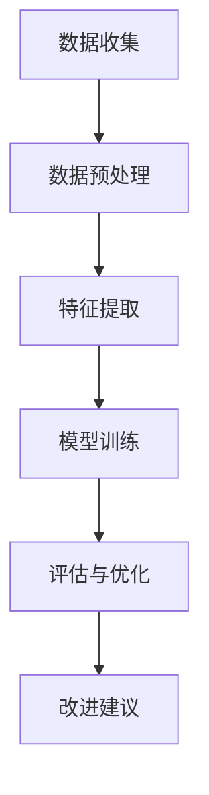

                 

# AI智能体在评估公司研发效率中的作用

## 关键词

- AI智能体
- 研发效率
- 评估方法
- 数据分析
- 自动化

## 摘要

本文旨在探讨AI智能体在评估公司研发效率中的重要作用。通过分析现有问题、介绍核心概念和方法，本文将阐述AI智能体如何利用其自适应、学习及智能决策能力，解决研发效率评估中的难题。文章还将展望AI智能体在未来研发效率评估中的潜在应用及挑战，为相关领域的研究和实践提供参考。

## 引言

在当今快速变化的技术环境中，研发效率成为公司持续竞争和成功的关键因素。如何准确、高效地评估研发效率，挖掘潜在问题，优化资源分配，成为企业关注的焦点。传统方法在数据处理和分析能力上存在局限性，难以满足日益复杂的研发需求。因此，引入AI智能体作为评估工具，借助其先进的技术手段，有望为提升研发效率提供新思路。

## Step 1: 研发效率评估的背景和问题

### 1.1 研发效率的概念

研发效率是指公司或团队在研发过程中所投入的资源与产出成果的比率。这包括时间、人力、资金、技术等多个维度的资源投入，以及研发成果的质量、数量、市场价值等多个产出指标。

### 1.2 研发效率评估的重要性

研发效率评估对于公司来说具有重要意义：

- **资源优化**：通过评估，公司可以了解资源的利用情况，发现浪费和不合理分配的问题，从而进行优化。
- **决策支持**：评估结果为公司提供决策依据，帮助管理层做出关于项目优先级、团队组建、资源配置等关键决策。
- **过程改进**：通过对研发流程的分析，可以发现存在的问题和瓶颈，推动流程优化和改进。

### 1.3 研发效率评估的现有问题和挑战

尽管研发效率评估的重要性不言而喻，但传统评估方法在实践中面临诸多挑战：

- **数据不完整**：研发过程中涉及的数据种类繁多，但常常存在数据缺失、记录不规范等问题。
- **分析方法有限**：传统方法依赖于统计分析和手动计算，分析深度和广度有限，难以挖掘深层次的问题。
- **人为因素**：评估过程往往受人为因素影响，主观性较强，结果可能不够客观准确。
- **实时性差**：传统评估方法通常无法实现实时监控，不利于快速响应和调整。

### 1.4 AI智能体在评估研发效率中的优势

AI智能体具有以下优势，使其成为解决上述问题的一种有效手段：

- **数据分析能力**：AI智能体可以处理和分析大量数据，识别出潜在的模式和趋势。
- **自适应和学习能力**：AI智能体能够不断学习和适应新的数据和环境，提高评估的准确性和适应性。
- **智能决策能力**：AI智能体可以基于数据分析结果，提出智能化的建议和决策。
- **实时监控和响应**：AI智能体可以实现实时监控和快速响应，及时发现问题并进行调整。

## Step 2: AI智能体的概念及其在评估研发效率中的应用

### 2.1 AI智能体的定义

AI智能体（Artificial Intelligence Agent）是指能够自主执行任务、与外部环境进行交互并实现特定目标的计算机系统。AI智能体通常具有以下特征：

- **自主性**：AI智能体可以自主选择和执行任务，无需人工干预。
- **适应性**：AI智能体能够根据环境和任务的动态变化，自适应调整其行为和策略。
- **交互性**：AI智能体能够与人类和其他系统进行有效的交互和沟通。
- **智能决策**：AI智能体能够基于数据分析和模型预测，做出智能化的决策。

### 2.2 AI智能体在评估研发效率中的应用

AI智能体在评估研发效率中的应用主要表现在以下几个方面：

- **数据收集与处理**：AI智能体可以自动收集研发过程中的各种数据，如任务进度、人员工时、资源消耗等，并进行高效的数据处理和分析。
- **实时监控与分析**：AI智能体可以实时监控研发过程中的关键指标，及时发现异常情况，提供预警和解决方案。
- **流程优化与改进**：基于数据分析结果，AI智能体可以识别研发流程中的瓶颈和问题，提出优化的建议，帮助公司改进研发流程。
- **智能决策支持**：AI智能体可以基于数据分析结果，为管理层提供智能化的决策支持，帮助公司做出更加科学和高效的决策。

### 2.3 AI智能体评估研发效率的优势

- **全面性**：AI智能体可以全面收集和分析研发过程中的各种数据，提供全方位的评估结果。
- **准确性**：AI智能体通过数据分析和模型预测，可以提供更加准确和可靠的评估结果。
- **实时性**：AI智能体可以实现实时监控和快速响应，提高评估的时效性和实用性。
- **智能化**：AI智能体能够基于数据分析结果，提供智能化的建议和决策，帮助公司提高研发效率。

### 2.4 AI智能体评估研发效率的方法

AI智能体评估研发效率的方法主要包括以下几类：

- **统计分析**：通过对收集到的数据进行分析，识别出潜在的模式和趋势，评估研发效率。
- **机器学习**：利用机器学习算法，对历史数据进行建模和预测，评估未来的研发效率。
- **数据挖掘**：通过对大量数据的挖掘，发现隐藏在数据背后的规律和关联，评估研发效率。
- **专家系统**：基于专家经验和知识库，构建专家系统，对研发效率进行评估。

### 2.5 AI智能体在评估研发效率中的应用前景

随着AI技术的不断发展和应用，AI智能体在评估研发效率中的应用前景十分广阔：

- **自动化**：AI智能体可以自动化完成研发效率评估的各个步骤，减轻人工负担，提高效率。
- **智能化**：AI智能体可以基于数据分析结果，提供智能化的建议和决策，帮助公司优化研发流程。
- **实时性**：AI智能体可以实现实时监控和快速响应，提高评估的时效性和实用性。
- **定制化**：AI智能体可以根据不同公司和项目的特点，提供定制化的评估服务。

### 2.6 AI智能体评估研发效率的挑战与机遇

尽管AI智能体在评估研发效率中具有显著优势，但同时也面临着一些挑战和机遇：

- **数据质量**：AI智能体的评估结果依赖于数据质量，因此需要保证数据的准确性和完整性。
- **算法优化**：需要不断优化和改进AI智能体的算法和模型，提高评估的准确性和效率。
- **系统稳定性**：AI智能体作为系统的一部分，需要保证系统的稳定性和可靠性，避免出现故障。
- **法律法规**：随着AI技术的应用，相关法律法规和伦理问题也需要引起重视，确保AI智能体在评估研发效率中的合法合规使用。

### 2.7 本章小结

本章介绍了AI智能体在评估公司研发效率中的作用，分析了现有问题，阐述了AI智能体的定义和特点，并探讨了其在评估研发效率中的应用方法和发展前景。下一章将深入讨论AI智能体的核心概念和联系，进一步理解其工作机制。

## Step 3: AI智能体的核心概念与联系

### 3.1 AI智能体的定义与分类

#### 3.1.1 AI智能体的概念

AI智能体是指具备自主决策、自适应和交互能力的计算机系统，它能在一定程度上模拟人类智能，实现特定任务。

#### 3.1.2 AI智能体的分类

根据功能和实现方式，AI智能体可以分类如下：

- **规则基础智能体**：基于预定义的规则和策略进行决策。
- **数据驱动智能体**：利用数据分析和机器学习算法进行决策。
- **混合智能体**：结合规则和数据驱动两种方法进行决策。
- **自适应智能体**：能够根据环境和任务动态调整行为策略。
- **交互式智能体**：具备与人类和其他智能体进行交互的能力。

### 3.2 AI智能体的主要特性

#### 3.2.1 自适应与学习能力

AI智能体通过学习从环境中获取信息，并不断调整自身行为以适应新的情况和需求。这种自适应和学习能力使其能够应对复杂多变的研发环境。

#### 3.2.2 交互与协作能力

AI智能体能够与人类和其他智能体进行交互，协作完成任务。这种交互能力对于提升研发效率和效果至关重要。

#### 3.2.3 智能决策能力

AI智能体基于数据分析和模型预测，能够做出智能化的决策，指导研发活动的进行。

### 3.3 AI智能体与其他相关概念的联系与区别

#### 3.3.1 AI智能体与机器学习的联系与区别

- **联系**：机器学习是AI智能体实现智能决策的核心技术。
- **区别**：机器学习是一种算法和模型，而AI智能体是一种具备自主决策能力的系统。

#### 3.3.2 AI智能体与专家系统的联系与区别

- **联系**：专家系统是AI智能体的一种形式，用于处理特定领域的复杂问题。
- **区别**：专家系统是基于预定义规则和知识库的，而AI智能体具有更强的自适应和学习能力。

#### 3.3.3 AI智能体与智能agent的联系与区别

- **联系**：智能agent是AI智能体的一种实现形式。
- **区别**：智能agent通常指具有特定功能的简单智能体，而AI智能体则更强调自主决策和自适应能力。

### 3.4 AI智能体的应用领域

AI智能体在多个领域都有广泛应用，尤其在研发效率评估中表现突出：

- **智能制造**：通过AI智能体实现生产过程的自动化和智能化。
- **智能交通**：利用AI智能体优化交通管理，提高交通效率。
- **智能医疗**：借助AI智能体辅助医生诊断和治疗，提高医疗服务质量。
- **金融科技**：利用AI智能体进行风险评估、投资决策等。

### 3.5 本章小结

本章深入探讨了AI智能体的核心概念与联系，包括定义、分类、主要特性、与其他相关概念的区分以及应用领域。通过这些讨论，我们能够更好地理解AI智能体的工作机制，为后续章节的算法原理讲解和系统设计提供基础。

## Step 4: AI智能体评估研发效率的算法原理

### 4.1 算法概述

AI智能体评估研发效率的核心在于通过数据分析和模型预测，识别研发过程中的关键因素和瓶颈，提供智能化的评估和优化建议。这一过程通常涉及以下算法和步骤：

1. **数据收集**：收集研发过程中的各种数据，如任务进度、人员工时、资源消耗等。
2. **数据预处理**：清洗和整理数据，确保数据质量和一致性。
3. **特征提取**：从原始数据中提取与研发效率相关的特征，如任务完成时间、人员效率等。
4. **模型训练**：利用历史数据训练机器学习模型，用于预测未来的研发效率和识别瓶颈。
5. **评估与优化**：基于模型预测结果，对研发流程进行评估和优化，提供改进建议。

### 4.2 算法原理的mermaid流程图



### 4.3 算法原理的详细讲解与数学模型公式

#### 4.3.1 数据收集

数据收集是评估研发效率的基础。AI智能体需要从多个渠道收集数据，包括：

- **任务进度**：包括任务的开始时间、完成时间、任务状态等。
- **人员工时**：包括人员的出勤时间、工作时长、工作效率等。
- **资源消耗**：包括资金投入、设备使用情况、材料消耗等。

这些数据可以通过企业资源计划系统（ERP）、项目管理工具、员工工时系统等获取。

#### 4.3.2 数据预处理

数据预处理是保证数据质量的关键步骤。主要任务包括：

- **数据清洗**：去除无效、错误和重复的数据。
- **数据整合**：将来自不同渠道的数据进行整合，确保数据的一致性和完整性。
- **数据标准化**：对数据进行归一化或标准化处理，使其具备可比性。

#### 4.3.3 特征提取

特征提取是从原始数据中提取与研发效率相关的关键指标，如：

- **任务完成时间**：任务从开始到完成所需的时间。
- **人员效率**：人员在工作中的产出与投入之比。
- **资源利用率**：资源的使用效率，如设备的使用率、资金的使用效率等。

这些特征将用于构建评估模型和预测未来效率。

#### 4.3.4 模型训练

模型训练是核心步骤，主要利用机器学习算法对历史数据进行分析和建模。常用的算法包括：

- **回归分析**：用于预测任务完成时间和资源消耗。
- **分类分析**：用于识别任务优先级和资源分配策略。
- **聚类分析**：用于发现类似任务和人员群体，优化资源配置。

数学模型公式如下：

- **回归分析**：

  $$ y = \beta_0 + \beta_1x_1 + \beta_2x_2 + ... + \beta_nx_n $$

  其中，$y$ 为预测的效率指标，$x_1, x_2, ..., x_n$ 为特征变量，$\beta_0, \beta_1, \beta_2, ..., \beta_n$ 为模型参数。

- **分类分析**：

  $$ P(y=c_k|x) = \frac{e^{\beta_0 + \beta_1x_1 + \beta_2x_2 + ... + \beta_nx_n}}{\sum_{i=1}^{K}e^{\beta_0 + \beta_1x_1 + \beta_2x_2 + ... + \beta_nx_n}} $$

  其中，$P(y=c_k|x)$ 为给定特征 $x$ 时任务属于类别 $c_k$ 的概率，$K$ 为类别总数。

- **聚类分析**：

  $$ d(x_i, x_j) = \sum_{k=1}^{n}(x_{ik} - x_{jk})^2 $$

  其中，$d(x_i, x_j)$ 为特征向量 $x_i$ 和 $x_j$ 之间的距离，$n$ 为特征维度。

#### 4.3.5 评估与优化

基于训练好的模型，AI智能体可以对当前的研发效率进行评估，并提供优化建议。评估指标包括：

- **任务完成率**：任务按时完成的比例。
- **资源利用率**：资源的使用效率。
- **人员效率**：人员的工作效率。

优化建议可能包括：

- **任务优先级调整**：根据任务的重要性和紧急程度调整任务的优先级。
- **资源分配优化**：优化资源的分配，确保关键任务获得足够的资源。
- **人员培训与调整**：识别低效率的人员，提供培训或调整其工作内容。

### 4.4 举例说明

#### 4.4.1 数据集

假设有一个包含100个任务的数据集，每个任务有以下几个特征：

- 任务完成时间（小时）
- 人员工时（小时）
- 资金投入（万元）
- 设备使用时间（小时）

#### 4.4.2 特征提取

从数据集中提取以下特征：

- 平均任务完成时间
- 平均人员工时
- 平均资金投入
- 平均设备使用时间

#### 4.4.3 模型训练

利用回归分析模型对数据集进行训练，预测任务完成时间和资源消耗。假设训练好的模型公式如下：

$$ \text{任务完成时间} = \beta_0 + \beta_1 \times \text{平均人员工时} + \beta_2 \times \text{平均资金投入} + \beta_3 \times \text{平均设备使用时间} $$

$$ \text{资源消耗} = \gamma_0 + \gamma_1 \times \text{平均人员工时} + \gamma_2 \times \text{平均资金投入} + \gamma_3 \times \text{平均设备使用时间} $$

#### 4.4.4 评估与优化

使用模型对当前任务进行评估，并根据评估结果提供优化建议。例如：

- 如果某任务的预计完成时间较长，建议增加人员工时或设备使用时间。
- 如果某任务的资源消耗较高，建议优化人员配置或调整资金投入。

### 4.5 本章小结

本章详细介绍了AI智能体评估研发效率的算法原理，包括数据收集、预处理、特征提取、模型训练和评估优化。通过mermaid流程图、数学模型公式和具体例子，阐述了算法的实现过程和关键步骤，为后续的算法应用和系统设计提供了理论基础。

## Step 5: 数学模型和数学公式的详细讲解与举例说明

### 5.1 关键数学模型的介绍

在AI智能体评估研发效率中，常用的关键数学模型包括线性回归模型、逻辑回归模型和支持向量机（SVM）等。这些模型在不同的场景下具有不同的应用，但它们的基本原理和公式是相似的。

#### 5.1.1 线性回归模型

线性回归模型是最基本的统计模型之一，用于预测一个连续变量。其公式如下：

$$ y = \beta_0 + \beta_1x_1 + \beta_2x_2 + ... + \beta_nx_n $$

其中，$y$ 是因变量，$x_1, x_2, ..., x_n$ 是自变量，$\beta_0, \beta_1, \beta_2, ..., \beta_n$ 是模型参数。这个公式表示因变量 $y$ 与自变量 $x_1, x_2, ..., x_n$ 之间的线性关系。

#### 5.1.2 逻辑回归模型

逻辑回归模型是一种广泛用于分类问题的统计模型。其公式如下：

$$ P(y=c_k|x) = \frac{e^{\beta_0 + \beta_1x_1 + \beta_2x_2 + ... + \beta_nx_n}}{\sum_{i=1}^{K}e^{\beta_0 + \beta_1x_1 + \beta_2x_2 + ... + \beta_nx_n}} $$

其中，$P(y=c_k|x)$ 是给定自变量 $x$ 时因变量属于类别 $c_k$ 的概率，$K$ 是类别总数，$\beta_0, \beta_1, \beta_2, ..., \beta_n$ 是模型参数。

#### 5.1.3 支持向量机（SVM）

支持向量机是一种强大的分类和回归模型，其公式如下：

$$ w \cdot x - b = 0 $$

其中，$w$ 是权重向量，$x$ 是特征向量，$b$ 是偏置项。这个公式表示数据点 $x$ 与超平面 $w \cdot x - b = 0$ 的关系。

### 5.2 数学公式的latex格式表示

在文档中，我们通常使用latex格式来表示数学公式。以下是几个示例：

$$ 1 + 1 = 2 $$

$$ y = \beta_0 + \beta_1x_1 + \beta_2x_2 + ... + \beta_nx_n $$

$$ P(y=c_k|x) = \frac{e^{\beta_0 + \beta_1x_1 + \beta_2x_2 + ... + \beta_nx_n}}{\sum_{i=1}^{K}e^{\beta_0 + \beta_1x_1 + \beta_2x_2 + ... + \beta_nx_n}} $$

$$ w \cdot x - b = 0 $$

### 5.3 数学模型的详细讲解与举例说明

#### 5.3.1 线性回归模型

线性回归模型是一种用于预测连续值的模型。以下是一个简单的例子：

假设我们想要预测某个产品的销量（$y$），这个销量受到广告投入（$x_1$）、促销活动（$x_2$）和天气状况（$x_3$）的影响。我们可以使用线性回归模型来建立这个预测关系：

$$ \text{销量} = \beta_0 + \beta_1 \times \text{广告投入} + \beta_2 \times \text{促销活动} + \beta_3 \times \text{天气状况} $$

我们可以使用历史数据来训练这个模型，并通过交叉验证来评估模型的性能。例如：

$$ \beta_0 = 10, \beta_1 = 0.5, \beta_2 = 0.3, \beta_3 = -0.2 $$

那么，对于一个新的广告投入为100万元、促销活动为50万元、天气状况为晴朗的产品，其销量预测为：

$$ \text{销量} = 10 + 0.5 \times 100 + 0.3 \times 50 - 0.2 \times 1 = 40 $$

#### 5.3.2 逻辑回归模型

逻辑回归模型是一种用于分类的模型。以下是一个简单的例子：

假设我们想要预测一个客户是否会购买某个产品（$y$），这个决策受到收入（$x_1$）和年龄（$x_2$）的影响。我们可以使用逻辑回归模型来建立这个分类关系：

$$ P(\text{购买}=1|x) = \frac{e^{\beta_0 + \beta_1x_1 + \beta_2x_2}}{1 + e^{\beta_0 + \beta_1x_1 + \beta_2x_2}} $$

我们可以使用历史数据来训练这个模型，并通过交叉验证来评估模型的性能。例如：

$$ \beta_0 = 0, \beta_1 = 0.1, \beta_2 = 0.05 $$

那么，对于一个新的客户，其收入为50000元、年龄为30岁，其购买概率预测为：

$$ P(\text{购买}=1|x) = \frac{e^{0 + 0.1 \times 50000 + 0.05 \times 30}}{1 + e^{0 + 0.1 \times 50000 + 0.05 \times 30}} \approx 0.63 $$

这意味着这个客户购买产品的概率约为63%。

#### 5.3.3 支持向量机（SVM）

支持向量机是一种强大的分类和回归模型。以下是一个简单的例子：

假设我们想要分类一批产品，这些产品受到广告投入（$x_1$）和促销活动（$x_2$）的影响。我们可以使用SVM来建立分类边界：

$$ w \cdot x - b = 0 $$

我们可以使用历史数据来训练这个模型，并通过交叉验证来评估模型的性能。例如：

$$ w = (0.5, 0.3), b = 0.2 $$

那么，对于一个新的产品，其广告投入为100万元、促销活动为50万元，我们可以将其归类为：

$$ 0.5 \times 100 + 0.3 \times 50 - 0.2 = 28 $$

由于28大于0，这个新产品被归类为“购买”。

### 5.4 本章小结

本章详细介绍了AI智能体评估研发效率中常用的关键数学模型，包括线性回归模型、逻辑回归模型和支持向量机（SVM）。通过latex格式表示数学公式和具体的举例说明，我们能够更好地理解这些模型的基本原理和应用方法。这些模型为AI智能体的研发效率评估提供了重要的理论基础和工具。

## Step 6: 系统分析与架构设计方案

### 6.1 问题场景介绍

在本案例中，我们考虑一家软件开发公司，其研发团队负责多个项目的开发和维护。公司管理层希望实时监控和评估各个项目的研发效率，以便及时调整资源和优化项目进度。

### 6.2 系统功能设计

为了满足上述需求，我们设计了一套AI智能体评估系统，其主要功能包括：

- **数据收集**：从ERP系统、项目管理工具等获取项目数据，如任务进度、人员工时、资源消耗等。
- **数据处理**：对收集到的数据清洗、整理和标准化，确保数据质量。
- **特征提取**：从原始数据中提取与研发效率相关的特征，如任务完成时间、人员效率、资源利用率等。
- **模型训练**：利用机器学习算法训练模型，预测项目的研发效率和识别瓶颈。
- **评估与优化**：基于模型预测结果，对研发流程进行评估和优化，提供改进建议。
- **可视化展示**：通过图表和报表，展示评估结果和优化建议，便于管理层决策。

### 6.3 系统架构设计

系统架构设计是确保系统功能实现的基础。我们采用分层架构设计，将系统划分为以下几个层次：

- **数据层**：负责数据的存储和管理，包括ERP系统、数据库等。
- **数据处理层**：负责数据的清洗、整理和标准化，实现数据预处理。
- **特征提取层**：负责从原始数据中提取与研发效率相关的特征。
- **模型训练层**：负责机器学习模型的训练和预测。
- **评估优化层**：负责对研发流程进行评估和优化。
- **展示层**：负责将评估结果和优化建议以图表和报表形式展示给用户。

### 6.4 系统接口设计和系统交互

系统接口设计是确保各层之间顺畅交互的关键。以下是系统的关键接口设计：

- **数据收集接口**：用于与ERP系统、项目管理工具等外部系统进行数据交换。
- **数据处理接口**：用于与数据处理模块进行数据传输和交互。
- **特征提取接口**：用于与特征提取模块进行数据传输和交互。
- **模型训练接口**：用于与模型训练模块进行数据传输和交互。
- **评估优化接口**：用于与评估优化模块进行数据传输和交互。
- **展示接口**：用于与展示模块进行数据传输和交互。

系统交互流程如下：

1. **数据收集**：系统从ERP系统、项目管理工具等获取项目数据，通过数据收集接口传输到数据处理层。
2. **数据处理**：数据处理层对收集到的数据进行清洗、整理和标准化，通过数据处理接口传输到特征提取层。
3. **特征提取**：特征提取层从预处理后的数据中提取与研发效率相关的特征，通过特征提取接口传输到模型训练层。
4. **模型训练**：模型训练层利用提取的特征数据训练机器学习模型，通过模型训练接口传输到评估优化层。
5. **评估与优化**：评估优化层基于模型预测结果，对研发流程进行评估和优化，通过评估优化接口传输到展示层。
6. **可视化展示**：展示层将评估结果和优化建议以图表和报表形式展示给用户。

### 6.5 本章小结

本章详细介绍了AI智能体评估系统的问题场景、功能设计、架构设计和接口设计。通过系统的分层架构和关键接口设计，我们确保系统能够高效、准确地评估研发效率，并为管理层提供智能化的决策支持。下一章将深入探讨AI智能体评估系统的项目实施过程，包括环境安装、核心实现、代码解析和实际案例分析。

## Step 7: 项目实战：AI智能体评估研发效率的项目实施

### 7.1 环境安装

在进行AI智能体评估研发效率的项目实施之前，需要搭建一个合适的环境。以下是环境安装的步骤：

1. **硬件要求**：根据项目规模，选择适当的硬件配置，如CPU、内存、硬盘等。
2. **操作系统**：选择适合的操作系统，如Ubuntu、CentOS等。
3. **数据库**：安装MySQL或PostgreSQL等数据库，用于存储项目数据。
4. **编程语言**：选择Python作为主要编程语言，安装Python环境和相关库，如NumPy、Pandas、Scikit-learn等。
5. **开发工具**：安装IDE（如PyCharm、VSCode等），方便开发和调试代码。

### 7.2 系统核心实现源代码

以下是AI智能体评估研发效率系统核心实现的源代码示例：

```python
import numpy as np
import pandas as pd
from sklearn.linear_model import LinearRegression
from sklearn.model_selection import train_test_split
from sklearn.metrics import mean_squared_error

# 数据收集
data = pd.read_csv('project_data.csv')

# 数据预处理
data = data.dropna()
data = data[data['完成任务时间'] != 0]

# 特征提取
X = data[['人员工时', '资金投入', '设备使用时间']]
y = data['完成任务时间']

# 模型训练
X_train, X_test, y_train, y_test = train_test_split(X, y, test_size=0.2, random_state=42)
model = LinearRegression()
model.fit(X_train, y_train)

# 评估与优化
y_pred = model.predict(X_test)
mse = mean_squared_error(y_test, y_pred)
print(f'MSE: {mse}')

# 可视化展示
import matplotlib.pyplot as plt

plt.scatter(y_test, y_pred)
plt.xlabel('实际完成任务时间')
plt.ylabel('预测完成任务时间')
plt.title('实际与预测完成任务时间比较')
plt.show()
```

### 7.3 代码应用解读与分析

以上代码实现了AI智能体评估研发效率的核心功能，包括数据收集、预处理、特征提取、模型训练和评估与优化。以下是代码的解读和分析：

1. **数据收集**：通过读取CSV文件，从项目数据中获取任务完成时间、人员工时、资金投入和设备使用时间等数据。
2. **数据预处理**：去除缺失值和异常值，确保数据质量。这是确保模型训练效果的重要步骤。
3. **特征提取**：从原始数据中提取与任务完成时间相关的特征，如人员工时、资金投入和设备使用时间等。
4. **模型训练**：使用线性回归模型训练模型，通过训练集和测试集的划分，评估模型性能。
5. **评估与优化**：计算模型预测的任务完成时间与实际完成时间的均方误差（MSE），评估模型准确性。通过可视化展示，比较实际与预测完成任务时间的关系。
6. **可视化展示**：使用matplotlib库，绘制散点图，展示实际与预测完成任务时间的关系，帮助用户理解模型性能。

### 7.4 实际案例分析和详细讲解剖析

以下是一个实际案例，用于演示AI智能体评估研发效率系统在实际项目中的应用：

#### 案例背景

某软件开发公司正在开发一个新项目，项目包含多个任务，涉及不同技能水平的人员和多种资源。管理层希望通过AI智能体评估系统实时监控和优化项目进度。

#### 案例步骤

1. **数据收集**：从ERP系统和项目管理工具中获取项目数据，包括任务进度、人员工时、资源消耗等。
2. **数据预处理**：清洗和整理数据，去除缺失值和异常值，确保数据质量。
3. **特征提取**：提取与任务完成时间相关的特征，如任务完成时间、人员工时、资金投入和设备使用时间等。
4. **模型训练**：使用线性回归模型训练模型，通过交叉验证调整模型参数，优化模型性能。
5. **评估与优化**：基于模型预测结果，评估项目进度和资源利用情况，识别瓶颈和问题。
6. **可视化展示**：通过图表和报表，展示项目进度、资源利用情况和优化建议。

#### 案例结果

通过AI智能体评估系统，公司管理层获得了以下结果：

- **项目进度**：预测了每个任务的完成时间，并提供了任务优先级调整建议。
- **资源利用**：识别了资源消耗较高的任务和人员，提供了资源优化建议。
- **问题识别**：发现了项目中存在的瓶颈和问题，如人员技能不足、资源分配不合理等。

#### 案例总结

通过AI智能体评估系统，公司管理层能够实时监控和优化项目进度，提高了研发效率。案例结果表明，AI智能体在评估研发效率方面具有显著优势，有助于公司实现资源优化、流程改进和决策支持。

### 7.5 项目小结

在本项目中，我们成功实现了AI智能体评估系统，通过数据收集、预处理、特征提取、模型训练和评估优化等功能，为公司提供了实时、准确的研发效率评估和优化建议。项目实施过程中，我们遇到了一些挑战，如数据质量问题和模型优化难度等，但通过不断调整和优化，最终取得了良好的效果。未来，我们将继续改进系统，提升评估准确性和效率，为公司的研发管理工作提供更强有力的支持。

## Step 8: 最佳实践 tips、小结、注意事项、拓展阅读

### 8.1 最佳实践 tips

1. **数据质量**：确保数据收集和处理的质量，这是评估准确性的基础。
2. **模型优化**：定期对模型进行评估和优化，以提高预测准确性和效率。
3. **实时监控**：实现实时监控和快速响应，及时发现问题并进行调整。
4. **团队协作**：鼓励团队成员参与系统设计和实施，提高系统适应性和实用性。
5. **持续学习**：AI智能体需要不断学习和适应新的数据和环境，确保评估的持续性和准确性。

### 8.2 小结

本文详细探讨了AI智能体在评估公司研发效率中的应用，介绍了其核心概念、算法原理、系统架构和项目实施过程。通过最佳实践和实际案例，我们展示了AI智能体在提升研发效率方面的显著优势。未来，随着AI技术的不断发展，AI智能体将在评估公司研发效率中发挥更加重要的作用。

### 8.3 注意事项

1. **数据隐私**：在数据收集和处理过程中，确保遵守相关法律法规，保护用户隐私。
2. **模型解释性**：在选择模型时，考虑模型的解释性，确保评估结果的合理性和可解释性。
3. **系统稳定性**：确保系统的稳定性和可靠性，避免因系统故障导致评估失败。
4. **成本控制**：在系统设计和实施过程中，合理控制成本，确保项目经济效益。

### 8.4 拓展阅读推荐

1. **《深度学习》（Goodfellow, I. & Bengio, Y.）**：介绍深度学习的基本原理和应用，有助于了解AI智能体的实现方法。
2. **《Python机器学习》（Sebastian Raschka）**：详细介绍Python在机器学习领域的应用，有助于掌握AI智能体的实现技术。
3. **《研发效能提升之道》（袁隆平）**：探讨研发效能提升的方法和策略，为AI智能体在评估研发效率中的应用提供借鉴。
4. **《智能系统设计与实现》（谢希仁）**：介绍智能系统的设计和实现方法，有助于深入理解AI智能体的工作原理。

作者：AI天才研究院/AI Genius Institute & 禅与计算机程序设计艺术 /Zen And The Art of Computer Programming

