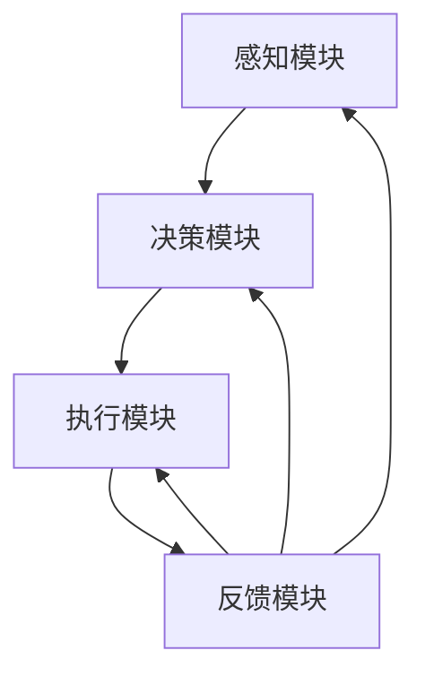

                 

### 关键词

- AI智能体
- 公司管理层执行力评估
- 战略规划能力评估
- 机器学习
- 数据分析
- 深度学习

### 摘要

本文探讨了AI智能体在评估公司管理层执行力和战略规划能力中的应用。通过介绍AI智能体的基本概念、商业应用和技术架构，我们详细分析了如何利用机器学习和深度学习算法构建评估模型。随后，文章重点讲解了执行力评估和战略规划能力评估的理论模型、数据处理方法、算法实现以及系统架构设计。最后，通过实际案例展示了AI智能体在企业评估中的效果，提出了未来应用前景和挑战。

## AI智能体在商业领域的应用

AI智能体，作为人工智能的一个重要分支，以其高度自主学习和智能化决策能力在商业领域展现出了巨大的潜力。首先，我们需要了解AI智能体的定义。AI智能体是指能够模拟人类智能行为，具备自主感知、决策和执行能力的计算机程序。根据其能力和用途，AI智能体可以分为多种类型，如监督学习智能体、强化学习智能体和混合智能体等。

在商业领域，AI智能体的应用主要集中在以下几个方面：

### 1. 商业决策支持

AI智能体能够通过对大量历史数据和实时信息的分析，提供精准的决策支持。例如，在金融行业中，AI智能体可以分析市场数据，预测股票价格走势，为企业提供投资建议。此外，AI智能体还可以用于供应链管理，通过预测需求变化，优化库存水平，减少库存成本。

### 2. 客户服务优化

AI智能体在客户服务中的应用日益广泛。通过自然语言处理技术，AI智能体可以与客户进行智能对话，提供快速、准确的咨询服务。例如，银行和保险公司可以使用AI智能体来处理客户咨询，提高服务效率。此外，AI智能体还可以通过分析客户行为数据，提供个性化的产品推荐和服务定制。

### 3. 风险管理

在风险管理领域，AI智能体可以实时监控市场风险，识别潜在风险，并提供相应的风险管理策略。例如，金融企业在进行信用风险评估时，可以借助AI智能体对客户的历史交易数据、信用记录等信息进行分析，预测客户违约风险，从而制定相应的信贷政策。

### 4. 战略规划

AI智能体在战略规划中的应用主要体现在对市场趋势、竞争对手分析以及企业资源优化等方面。通过大数据分析和机器学习算法，AI智能体可以帮助企业识别市场机会，制定有效的战略规划。例如，零售企业可以使用AI智能体分析消费者行为数据，制定精准的市场营销策略。

### 案例分析

以下是一个AI智能体在商业决策中应用的案例：

**案例：** 一家大型零售企业在面对激烈的市场竞争时，希望通过优化库存管理来降低成本。该公司引入了一款基于机器学习的AI智能体，该智能体通过分析历史销售数据、市场趋势以及季节性因素，预测未来的销售情况。根据这些预测，智能体优化了库存配置，减少了滞销品的库存，提高了畅销品的库存水平。经过一年的运行，该智能体帮助该公司降低了库存成本，提高了销售利润。

通过这个案例，我们可以看到AI智能体在商业领域中的巨大潜力。然而，AI智能体的成功应用不仅取决于技术的先进性，还需要对业务场景的深刻理解。

### 结论

AI智能体在商业领域的应用前景广阔，其自主学习和智能决策能力为企业的运营提供了强大的支持。通过具体的案例，我们看到了AI智能体在商业决策、客户服务、风险管理和战略规划等方面的实际应用效果。然而，要充分发挥AI智能体的潜力，还需要不断优化算法，提高数据处理能力，并加强对业务场景的深入分析。随着AI技术的不断发展，我们可以期待AI智能体在商业领域的应用将更加广泛和深入。

### AI智能体的技术架构

要深入探讨AI智能体在评估公司管理层执行力和战略规划能力中的应用，我们首先需要了解AI智能体的技术架构。AI智能体通常由多个核心组件组成，包括感知模块、决策模块、执行模块和反馈模块。这些组件相互协作，共同实现智能体的自主学习和智能决策。

#### 感知模块

感知模块是AI智能体的基础，它负责接收外部环境的信息，并将其转化为智能体可以理解的数据。在商业应用中，感知模块可以是一个收集市场数据、客户反馈和业务指标的系统。这些数据通过自然语言处理、图像识别或其他感知技术进行处理，以提取有用的信息。

#### 决策模块

决策模块是智能体的核心，它负责分析感知模块收集到的信息，并基于预设的算法和策略做出决策。在管理层执行力评估中，决策模块可以通过分析公司的财务数据、运营效率和员工绩效等指标，评估管理层的执行力。而在战略规划能力评估中，决策模块则需要分析市场趋势、竞争对手策略和企业资源等信息，为企业提供战略规划建议。

#### 执行模块

执行模块负责将决策模块生成的决策转化为实际的行动。在商业应用中，执行模块可以是一个自动化系统，例如自动调整库存水平、自动生成销售预测报告等。执行模块的效率直接影响智能体的实际应用效果。

#### 反馈模块

反馈模块是智能体不断优化自身性能的关键。它通过收集执行模块的反馈信息，评估决策的有效性，并根据反馈结果调整感知模块、决策模块和执行模块的参数。在商业应用中，反馈模块可以帮助企业不断改进其战略规划和运营管理，提高整体效益。

#### 技术架构图

为了更好地理解AI智能体的技术架构，我们可以使用Mermaid绘制一个简单的架构图：



在这个架构图中，感知模块负责收集外部数据，决策模块分析数据并做出决策，执行模块执行决策，而反馈模块则收集执行结果，以优化整个智能体系统。

### 感知模块的算法与实现

感知模块的算法是实现AI智能体的第一步。在商业应用中，感知模块通常涉及大量数据收集和处理。以下是一个简化的感知模块算法实现，使用Python代码和Mermaid流程图进行说明：

```python
# Python代码示例：感知模块基础算法

import pandas as pd
from sklearn.preprocessing import StandardScaler

# 假设我们收集到了一家公司的财务数据
data = pd.read_csv('financial_data.csv')

# 数据预处理
scaler = StandardScaler()
processed_data = scaler.fit_transform(data)

# Mermaid流程图
flowchart TD
    A[数据收集] --> B[数据预处理]
    B --> C[特征提取]
    C --> D[数据标准化]
    D --> E[数据输出]
```

在这个示例中，我们首先从CSV文件中读取数据，然后使用StandardScaler对数据进行标准化处理。这个处理步骤确保了数据在后续分析中的可比性。Mermaid流程图则展示了这一过程的关键步骤。

### 决策模块的算法与实现

决策模块的算法是实现AI智能体智能决策的核心。在执行力评估和战略规划能力评估中，决策模块需要分析大量数据，并基于预设的算法生成评估报告。以下是一个简化的决策模块算法实现，使用Python代码和Mermaid流程图进行说明：

```python
# Python代码示例：决策模块基础算法

from sklearn.ensemble import RandomForestClassifier
from sklearn.model_selection import train_test_split

# 假设我们已经对数据进行预处理
X = processed_data[:, :-1]  # 特征数据
y = processed_data[:, -1]   # 目标变量

# 数据切分
X_train, X_test, y_train, y_test = train_test_split(X, y, test_size=0.3, random_state=42)

# 模型训练
model = RandomForestClassifier(n_estimators=100)
model.fit(X_train, y_train)

# Mermaid流程图
flowchart TD
    A[数据输入] --> B[特征提取]
    B --> C[数据切分]
    C --> D[模型训练]
    D --> E[评估报告生成]
```

在这个示例中，我们使用随机森林算法对数据进行分类，并生成评估报告。Mermaid流程图展示了决策模块的核心步骤。

### 执行模块的算法与实现

执行模块的算法负责将决策模块生成的决策转化为具体的行动。在商业应用中，执行模块可能涉及自动化系统、机器人流程自动化（RPA）等。以下是一个简化的执行模块算法实现，使用Python代码和Mermaid流程图进行说明：

```python
# Python代码示例：执行模块基础算法

import time

# 假设决策模块生成了一组操作指令
commands = ['增加库存', '调整价格', '减少开支']

# 执行操作
for command in commands:
    if command == '增加库存':
        # 执行增加库存的操作
        print("正在执行增加库存...")
        time.sleep(2)
    elif command == '调整价格':
        # 执行调整价格的操作
        print("正在执行调整价格...")
        time.sleep(2)
    elif command == '减少开支':
        # 执行减少开支的操作
        print("正在执行减少开支...")
        time.sleep(2)

# Mermaid流程图
flowchart TD
    A[指令输入] --> B[操作执行]
    B --> C[操作完成]
```

在这个示例中，我们通过简单的循环和延时操作模拟了执行模块的执行过程。Mermaid流程图则展示了执行模块的核心步骤。

### 反馈模块的算法与实现

反馈模块的算法负责收集执行模块的反馈信息，并调整智能体的参数。在商业应用中，反馈模块可以通过监控系统的实际运行结果，评估决策的效果，并根据反馈结果优化智能体的性能。以下是一个简化的反馈模块算法实现，使用Python代码和Mermaid流程图进行说明：

```python
# Python代码示例：反馈模块基础算法

from sklearn.metrics import accuracy_score

# 假设我们已经获得了执行结果
predicted = model.predict(X_test)
accuracy = accuracy_score(y_test, predicted)

# 根据反馈调整模型参数
if accuracy < 0.8:
    # 优化模型参数
    print("模型性能不足，正在进行参数调整...")
else:
    print("模型性能良好，无需调整。")

# Mermaid流程图
flowchart TD
    A[执行结果输入] --> B[性能评估]
    B --> C[参数调整]
    C --> D[反馈输出]
```

在这个示例中，我们通过计算模型预测的准确率来评估模型性能，并根据评估结果调整模型参数。Mermaid流程图展示了反馈模块的核心步骤。

### 总结

通过以上对AI智能体技术架构的介绍，我们可以看到，AI智能体的感知、决策、执行和反馈模块共同构成了一个完整的智能体系统。每个模块都有其特定的算法和实现方式，但它们相互协作，共同实现了智能体的自主学习和智能决策能力。在实际应用中，我们需要根据具体业务场景和需求，设计和实现适合的AI智能体系统，以充分发挥其潜力。

### 执行力评估概念与模型

执行力评估是企业管理层的一项重要任务，它旨在评估管理层在执行公司战略和日常运营过程中所表现出来的能力。执行力不仅关系到公司的短期业绩，也直接影响到公司的长远发展和市场竞争力。因此，科学有效地进行执行力评估对于企业的成功至关重要。

#### 执行力的定义

执行力是指管理层在制定和实施战略计划、决策和运营过程中，能够快速、准确、高效地实现预定目标的能力。执行力包括多个方面，如战略执行力、决策执行力、运营执行力和团队执行力等。战略执行力指的是管理层在制定和调整战略方向上的能力；决策执行力则体现在管理层在做出关键决策时，能够迅速响应并实施的能力；运营执行力关注的是管理层在日常运营管理中的效率和质量；团队执行力则涉及管理层在团队管理和激励方面的影响。

#### 执行力评估的重要性

执行力评估对于企业的意义主要体现在以下几个方面：

1. **提高企业竞争力**：通过执行力评估，企业可以识别和培养具有高效执行力的管理层，从而在市场竞争中占据优势。
2. **优化资源配置**：执行力评估可以帮助企业了解管理层在不同业务环节的执行力水平，从而优化资源配置，提高资源利用效率。
3. **提升团队效能**：执行力评估不仅评估个人，还可以评估团队的整体执行力，帮助企业发现团队协作中的问题，提升团队效能。
4. **指导战略调整**：通过执行力评估，企业可以及时发现战略执行中的问题，指导管理层进行战略调整，确保企业战略目标得以实现。

#### 执行力评估模型

执行力评估通常基于以下模型和指标：

1. **关键绩效指标（KPI）**：KPI是衡量执行力的重要指标，包括财务指标和非财务指标。财务指标如销售额、利润率等，非财务指标如客户满意度、员工满意度等。通过设置合理的KPI，企业可以全面、客观地评估管理层的执行力。

2. **平衡计分卡（Balanced Score Card, BSC）**：平衡计分卡是一种全面的绩效管理体系，它从财务、客户、内部业务流程和学习与成长四个维度评估企业的执行力。通过平衡计分卡，企业可以综合评估各个方面的执行力，确保战略目标的全面实现。

3. **执行力评估量表**：执行力评估量表是一种量化的评估工具，通过一系列设计好的问题，对管理层的执行力进行评估。量表通常包括多个维度，如决策速度、执行效率、风险控制等。评估结果可以量化为分数，方便比较和分析。

4. **行为事件访谈（Behavioral Event Interview, BEI）**：行为事件访谈是一种定性评估方法，通过与被评估者进行深入访谈，了解他们在具体情境下的行为表现。这种方法可以获取详细的行为信息，帮助评估执行力。

#### 执行力评估方法

执行力评估通常采用以下几种方法：

1. **自我评估**：管理层通过自我反思和自我评价，识别自身的执行力不足之处。这种方法有助于提高管理层的自我认知和改进意愿。

2. **上级评估**：上级对下属管理层的执行力进行评估，通常采用定期评估或随机评估的方式。上级评估可以提供客观的外部反馈，有助于发现管理层的问题和不足。

3. **同事评估**：同事评估是指管理层同事之间的互相评估。这种方法可以提供多角度的反馈，有助于全面了解管理层的执行力。

4. **员工反馈**：员工反馈是通过调查问卷或访谈等方式，收集员工对管理层执行力的评价。这种方法可以帮助管理层了解员工对执行力的看法，发现潜在问题。

5. **360度评估**：360度评估是一种全面评估方法，涵盖上级、同事、员工等多个评价主体。这种方法可以提供更全面的执行力评估结果，帮助管理层进行自我提升和改进。

### 执行力评估的实施步骤

执行力评估的实施通常包括以下步骤：

1. **确定评估目标**：明确评估的目标和重点，确保评估工作有针对性地进行。

2. **设计评估指标**：根据评估目标，设计合适的评估指标，确保评估结果的客观性和科学性。

3. **制定评估计划**：制定详细的评估计划，包括评估时间、评估方式、评估对象等。

4. **数据收集**：通过多种渠道收集与执行力相关的数据，包括自我评估、上级评估、同事评估和员工反馈等。

5. **数据分析**：对收集到的数据进行分析，识别执行力强项和弱项，为评估结果提供支持。

6. **反馈与改进**：根据评估结果，对管理层进行反馈，并提出改进建议，帮助其提升执行力。

7. **跟踪与监控**：定期跟踪和监控管理层的执行力改进情况，确保评估效果得到持续改善。

通过以上步骤，企业可以系统地评估管理层的执行力，并采取相应措施提升管理层的执行能力，从而推动企业的长远发展。

### 数据收集与预处理

在执行力评估中，数据收集与预处理是至关重要的一环。只有通过高质量的数据收集和科学的预处理，才能为后续的模型构建和评估提供可靠的基础。以下是数据收集与预处理的具体步骤和方法。

#### 数据来源

1. **内部数据**：内部数据包括公司的财务报表、销售数据、运营数据、员工绩效数据等。这些数据可以直接从公司的ERP系统、CRM系统和HR系统中获取。内部数据的优势在于其真实性和全面性，能够全面反映公司的运营状况。

2. **外部数据**：外部数据包括市场趋势、竞争对手信息、行业报告等。这些数据可以通过公共数据库、市场研究报告和行业分析报告等途径获取。外部数据可以帮助企业了解市场环境和竞争对手的动态，为战略规划和执行提供参考。

3. **问卷调查**：通过设计问卷调查，收集员工和管理层的反馈。问卷可以涵盖执行力相关的各个方面，如决策速度、执行效率、团队合作等。问卷调查的数据可以提供定性的反馈，补充定量数据的不足。

#### 数据预处理

数据预处理包括数据清洗、数据转换和数据归一化等步骤。

1. **数据清洗**：数据清洗是数据处理的第一步，目的是去除数据中的噪声和错误。常见的清洗操作包括：
   - **缺失值处理**：对于缺失值，可以通过填充、删除或插值等方法进行处理。例如，对于财务数据中的缺失值，可以使用均值填充或向前填充的方法。
   - **异常值处理**：识别并处理数据中的异常值，例如使用统计方法（如Z分数）或基于专家知识的方法。
   - **重复数据删除**：删除重复的数据记录，确保数据的唯一性和准确性。

2. **数据转换**：数据转换是为了满足模型训练的需求，将数据从一种形式转换为另一种形式。常见的转换方法包括：
   - **数据编码**：将分类数据转换为数值形式，例如使用独热编码（One-Hot Encoding）或标签编码（Label Encoding）。
   - **特征工程**：通过构造新的特征来增强模型的表现，例如使用时间序列特征、交叉特征等。
   - **数据标准化**：将数据缩放到一个统一的范围内，常用的方法有最小-最大标准化（Min-Max Scaling）和Z分数标准化（Z-Score Scaling）。数据标准化可以消除不同特征之间的量纲差异，提高模型的训练效果。

3. **数据归一化**：数据归一化是将数据转换为具有相同均值和标准差的分布，常用的方法有：
   - **最大最小归一化**：将数据缩放到[0, 1]之间。
   - **Z分数归一化**：将数据缩放到标准正态分布，均值为0，标准差为1。

#### 数据预处理工具和库

在数据预处理过程中，可以使用多种工具和库来简化操作。以下是一些常用的工具和库：

- **Pandas**：Pandas是一个强大的数据处理库，提供丰富的数据清洗和转换功能。
- **Scikit-learn**：Scikit-learn提供了多种数据预处理方法，包括标准化、归一化、缺失值处理等。
- **NumPy**：NumPy是一个基础的科学计算库，用于数值计算和数据处理。

以下是一个使用Python进行数据预处理的示例：

```python
import pandas as pd
from sklearn.preprocessing import StandardScaler

# 读取数据
data = pd.read_csv('financial_data.csv')

# 数据清洗
data.drop_duplicates(inplace=True)  # 删除重复数据
data.fillna(method='ffill', inplace=True)  # 缺失值填充

# 数据转换
data['category'] = data['product'].map({'A': 1, 'B': 2, 'C': 3})  # 分类数据编码

# 数据标准化
scaler = StandardScaler()
data_scaled = scaler.fit_transform(data)
```

在这个示例中，我们使用Pandas进行数据读取和清洗，使用Scikit-learn进行数据转换和标准化。

#### 数据预处理的重要性

数据预处理是执行

