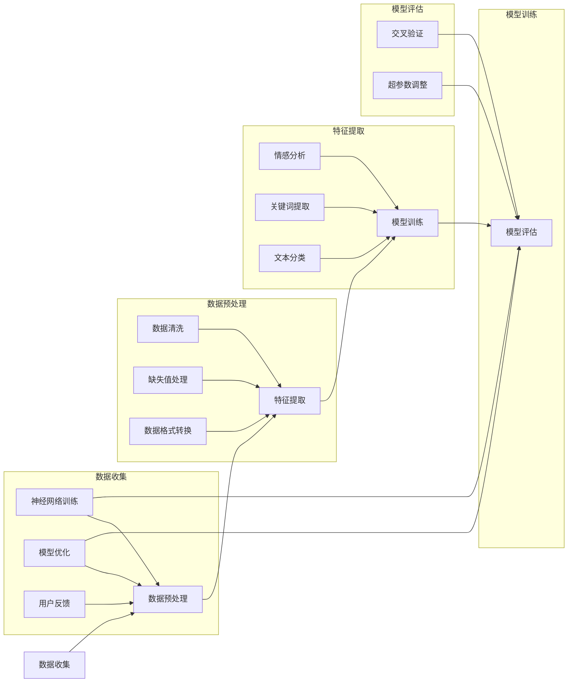

                 

## AI智能体在评估品牌价值中的作用

### 关键词：AI智能体、品牌价值评估、大数据、深度学习

> 摘要：随着人工智能技术的不断发展，AI智能体在各个领域的应用日益广泛。特别是在品牌价值评估方面，AI智能体凭借其强大的数据分析和处理能力，提供了全新的评估方法和思路。本文将从背景介绍、核心概念与联系、算法原理讲解、系统分析与架构设计、项目实战等多个角度，深入探讨AI智能体在评估品牌价值中的作用，旨在为相关领域的研究者和从业者提供有益的参考。

### 第一部分：背景介绍

#### 核心概念：问题背景、问题描述、问题解决、边界与外延、概念结构与核心要素组成

**问题背景：**

品牌价值是企业核心竞争力的重要体现，它不仅反映了企业的市场地位和影响力，还直接关系到企业的盈利能力和长期发展。然而，传统的品牌价值评估方法主要依赖于财务数据和市场调查，这些方法往往存在主观性较强、数据获取困难等问题，难以满足企业对品牌价值评估的精准性和实时性的需求。

随着人工智能技术的快速发展，特别是深度学习和自然语言处理技术的应用，AI智能体在品牌价值评估中具有巨大的潜力。AI智能体能够自动收集和分析品牌相关的各种信息，如社交媒体评论、新闻报道、用户反馈等，通过数据挖掘和机器学习算法，对品牌价值进行量化评估。因此，如何利用AI智能体来评估品牌价值，提高评估的准确性和效率，成为本研究的关键问题。

**问题描述：**

传统的品牌价值评估方法主要依赖于财务数据和市场调查，但这些方法往往存在以下问题：

1. **主观性较强**：财务数据和市场调查结果往往受到主观因素的影响，如调查人员的主观判断、受访者的主观感受等，导致评估结果存在一定的偏差。
2. **数据获取困难**：品牌相关的信息分布在各个渠道，如社交媒体、新闻报道、用户评论等，难以进行统一和有效的收集。
3. **处理效率低**：传统的品牌价值评估方法往往需要大量的人工操作和数据处理，耗时较长，难以满足实时评估的需求。

**问题解决：**

本研究通过引入AI智能体，构建一个基于大数据和深度学习技术的品牌价值评估模型。该模型能够自动收集和分析品牌相关的各种信息，如社交媒体评论、新闻报道、用户反馈等，通过数据挖掘和机器学习算法，对品牌价值进行量化评估。具体来说，本研究包括以下几个方面的内容：

1. **数据收集**：利用AI智能体自动收集品牌相关的信息，包括社交媒体评论、新闻报道、用户反馈等。
2. **数据预处理**：对收集到的数据进行清洗和预处理，包括去除噪声、缺失值处理、数据格式转换等。
3. **特征提取**：从预处理后的数据中提取对品牌价值有影响的特征，如情感倾向、关键词频次等。
4. **模型构建**：基于提取的特征，构建一个深度学习模型，用于对品牌价值进行量化评估。
5. **模型优化**：通过交叉验证和超参数调整，优化模型性能，提高评估的准确性和效率。

**边界与外延：**

本研究的边界主要集中在AI智能体在品牌价值评估中的应用，包括技术原理、应用场景和解决方案等方面。同时，本研究的外延还将涉及品牌价值的定义、评估方法的发展历程以及AI技术在其他领域的应用。

**概念结构与核心要素组成：**

本研究涉及以下几个核心概念：

1. **品牌价值**：品牌价值的定义、构成要素和评估方法。
2. **AI智能体**：AI智能体的定义、分类和工作原理。
3. **大数据**：大数据的概念、特点和应用。
4. **深度学习**：深度学习的原理、算法和应用。
5. **品牌价值评估模型**：品牌价值评估模型的设计、实现和优化。

这些核心概念相互关联，共同构成了本研究的内容框架。

### 核心概念与联系

#### 核心概念原理、概念属性特征对比表格和ER实体关系图架构的 Mermaid 流程图

**核心概念原理：**

1. **品牌价值**：品牌价值是指品牌在市场中所具有的经济价值和潜在价值。它不仅包括品牌的市场价值，还包括品牌的忠诚度、认知度、品牌形象等无形资产。品牌价值的评估方法主要包括财务指标评估法、市场指标评估法、消费者行为评估法等。

2. **AI智能体**：AI智能体是指具有自主学习和推理能力的人工智能系统，能够模拟人类的思维和行为，实现智能化的决策和行动。AI智能体的工作原理主要包括数据收集、数据预处理、特征提取、模型训练和模型评估等。

3. **大数据**：大数据是指数据量巨大、类型多样、价值密度低的数据集合，需要通过特殊的工具和技术进行采集、存储、处理和分析。大数据的应用场景包括商业智能分析、社交媒体分析、医疗数据分析等。

4. **深度学习**：深度学习是一种机器学习技术，通过多层神经网络对大量数据进行训练，提取数据中的特征，从而实现复杂的模式识别和预测。深度学习的应用场景包括图像识别、语音识别、自然语言处理等。

5. **品牌价值评估模型**：品牌价值评估模型是指基于AI智能体和大数据技术，对品牌价值进行量化评估的算法和模型。该模型通过收集品牌相关的数据，进行数据预处理、特征提取和模型训练，最终实现对品牌价值的量化评估。

**概念属性特征对比表格：**

| 概念 | 特征 |
| --- | --- |
| 品牌价值 | 经济价值、无形资产、市场价值 |
| AI智能体 | 自主学习、推理能力、智能化决策 |
| 大数据 | 数据量大、类型多、价值密度低 |
| 深度学习 | 多层神经网络、特征提取、复杂模式识别 |
| 品牌价值评估模型 | 基于AI智能体和大数据、量化评估、智能化 |

**ER实体关系图架构的 Mermaid 流程图：**

```mermaid
erDiagram
    BrandValue ||--|{ Data} : Contains
    AIEntity ||--|{ BrandValue AssessmentModel} : Uses for assessment
    Data ||--|{ AIEntity} : Provided by
    MarketData ||--|{ BrandValue} : Influences
    ConsumerFeedback ||--|{ BrandValue} : Influences
```

### 算法原理讲解

#### 使用 mermaid 画出算法 mermaid 流程图，然后使用 python 源代码来详细阐述，给出算法原理的数学模型和公式，进行详细讲解和通俗易懂地举例说明

**mermaid 流程图：**



**算法原理详细讲解：**

品牌价值评估算法主要分为以下几个步骤：

1. **数据收集**：
   - 通过AI智能体从社交媒体、新闻报道、用户反馈等渠道自动收集品牌相关的数据。
   - 数据类型包括文本、图片、视频等，其中文本数据是最为关键的。

2. **数据预处理**：
   - 数据清洗：去除无效数据、重复数据、噪声数据等。
   - 缺失值处理：对缺失的数据进行填充或删除。
   - 数据格式转换：将不同来源的数据格式进行统一，如将文本数据转换为处理模型可接受的格式。

3. **特征提取**：
   - 情感分析：对文本数据中的情感倾向进行分析，如正面、负面、中性等。
   - 关键词提取：从文本数据中提取重要的关键词，用于后续的文本分类和模型训练。
   - 文本分类：将文本数据分类为不同的类别，如品牌正面评价、负面评价等。

4. **模型训练**：
   - 神经网络训练：使用收集到的数据对神经网络进行训练，使其能够对品牌价值进行量化评估。
   - 模型优化：通过交叉验证和超参数调整，优化模型性能，提高评估的准确性和效率。

5. **模型评估**：
   - 交叉验证：通过将数据集划分为训练集和测试集，对模型进行多次训练和测试，评估模型的泛化能力。
   - 超参数调整：通过调整模型的超参数，如学习率、迭代次数等，优化模型性能。

**数学模型和公式：**

品牌价值评估算法的核心是深度学习模型，其基本原理是使用多层神经网络对输入数据进行训练和预测。具体来说，可以使用以下数学模型和公式：

$$
y = f(W_n \cdot \sigma(W_{n-1} \cdot \sigma(...\sigma(W_1 \cdot x + b_1) + b_0)...) + b_n)
$$

其中，$y$表示模型的输出，$f$表示激活函数，$\sigma$表示非线性变换，$W$和$b$分别表示权重和偏置，$x$表示输入数据。

**举例说明：**

假设我们有一个品牌价值评估模型，输入是品牌的相关文本数据，输出是品牌价值的量化评分。具体操作如下：

1. 数据收集：从社交媒体、新闻报道、用户反馈等渠道收集品牌的相关文本数据。

2. 数据预处理：对收集到的文本数据进行清洗、去噪、填充缺失值等处理。

3. 特征提取：对预处理后的文本数据进行情感分析、关键词提取等操作，提取对品牌价值有影响的特征。

4. 模型训练：使用提取的特征和品牌价值的量化评分对神经网络进行训练，优化模型参数。

5. 模型评估：使用交叉验证和超参数调整，评估模型性能，优化模型参数。

6. 预测：使用训练好的模型对新的品牌文本数据进行预测，得到品牌价值的量化评分。

通过上述步骤，我们可以利用AI智能体对品牌价值进行量化评估，从而为企业和管理者提供有价值的决策支持。

