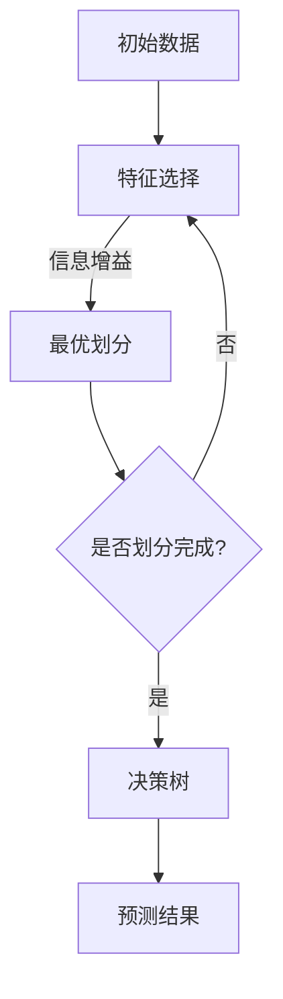
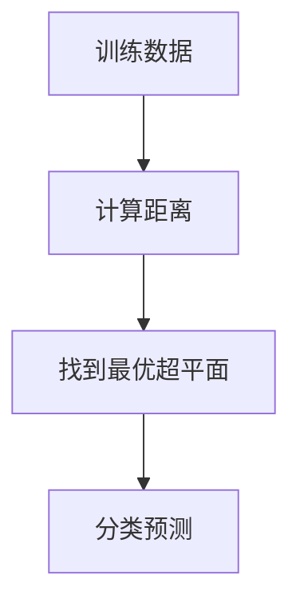
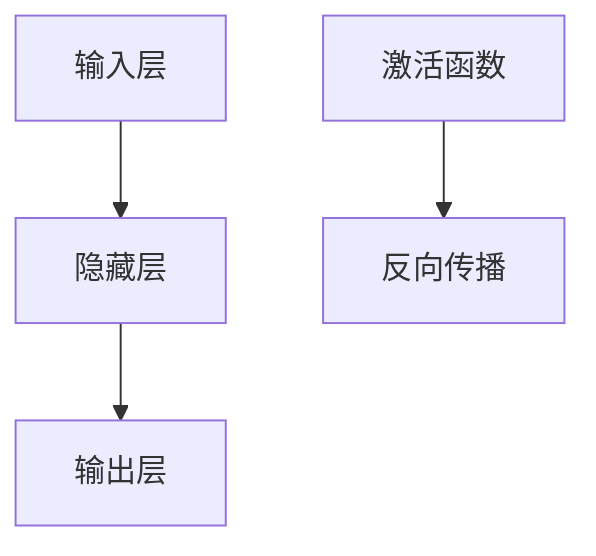
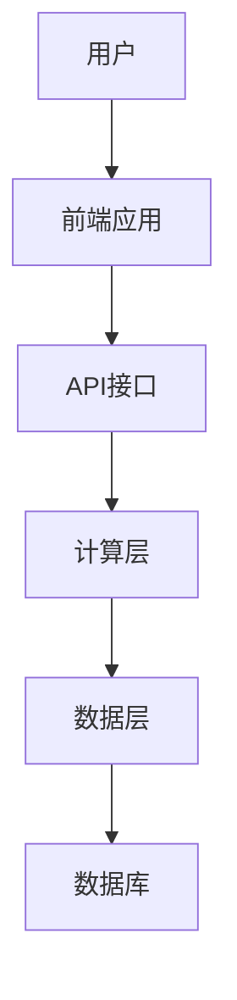

                 


### 问题背景

在当今的数字化时代，品牌忠诚度作为企业竞争力的重要指标，越来越受到重视。品牌忠诚度指的是消费者在反复购买过程中对特定品牌的信任与依赖程度，这种忠诚度直接影响企业的市场份额、客户满意度和长期收益。然而，如何准确评估品牌忠诚度，特别是基于大规模数据的高效评估，成为许多企业面临的难题。

#### 评估品牌忠诚度的重要性

评估品牌忠诚度对企业的战略规划具有重要意义。通过了解消费者对品牌的忠诚程度，企业可以：

1. **优化产品和服务**：识别忠诚客户的需求，提供更符合他们期望的产品和服务。
2. **制定精准营销策略**：对高忠诚度客户进行个性化营销，增加复购率；对低忠诚度客户进行挽留策略。
3. **提高客户保留率**：识别并留住核心客户，减少客户流失率。
4. **投资回报率优化**：合理配置营销资源，提高投资回报率。

#### 当前评估方法与工具的局限

传统的品牌忠诚度评估方法主要依赖于问卷调查、访谈和销售数据等。这些方法存在以下局限性：

1. **数据量有限**：传统方法通常无法处理大规模数据，评估结果可能不够全面。
2. **评估滞后**：问卷调查等方法通常需要较长时间，无法及时反映市场变化。
3. **主观性较大**：依赖人为判断，可能受到主观因素的影响。
4. **无法深入分析**：传统方法难以揭示消费者行为的深层次原因。

#### AI智能体在评估中的应用潜力

随着人工智能技术的发展，特别是机器学习算法在数据分析、预测和智能决策方面的应用，AI智能体在评估品牌忠诚度方面展示出巨大的潜力。AI智能体能够：

1. **处理大规模数据**：利用大数据技术，快速分析海量消费者行为数据，提供全面准确的评估结果。
2. **实时分析**：通过实时数据流处理技术，及时捕捉市场变化，提供动态的评估。
3. **减少主观性**：基于数据驱动的分析，减少人为判断的主观性。
4. **深度挖掘**：利用机器学习算法，挖掘消费者行为的潜在模式和规律，提供更深入的洞察。

### 本书的结构与内容安排

本书旨在深入探讨AI智能体在评估品牌忠诚度中的应用，结构安排如下：

- **第1章：问题背景**：介绍评估品牌忠诚度的重要性和当前面临的挑战。
- **第2章：品牌忠诚度的核心概念与联系**：阐述品牌忠诚度的定义、评估指标、影响因素及与消费者行为的联系。
- **第3章：AI智能体在评估中的应用原理**：分析AI智能体的基本原理及其在数据分析和行为预测中的应用。
- **第4章：AI智能体评估品牌忠诚度的算法原理**：介绍常见算法原理、流程图和数学模型。
- **第5章：AI智能体评估品牌忠诚度的系统设计与实现**：讨论评估系统的设计原则、架构和实现。
- **第6章：AI智能体评估品牌忠诚度的项目实战**：通过具体案例展示系统实现和应用。
- **第7章：最佳实践与未来展望**：总结最佳实践，讨论未来发展趋势和挑战。

通过本书的阅读，读者将深入了解AI智能体在评估品牌忠诚度中的作用，掌握相关技术和方法，为企业的品牌忠诚度管理提供有力支持。

### 品牌忠诚度的核心概念与联系

品牌忠诚度是一个复杂而多维度的概念，涉及多个核心要素和评估指标。要准确理解品牌忠诚度，我们需要从以下几个方面进行详细探讨。

#### 品牌忠诚度的定义与属性特征

品牌忠诚度指的是消费者在购买过程中，对于某个特定品牌表现出持续偏好和重复购买的行为倾向。其定义可以拆分为以下几个核心属性：

1. **重复购买**：消费者在同一品牌的产品之间进行重复购买的行为。
2. **品牌偏好**：消费者在面对多种选择时，更倾向于选择某一品牌。
3. **推荐意愿**：消费者愿意向他人推荐该品牌产品或服务的意愿。
4. **品牌认知**：消费者对品牌认知的深度和广度，包括品牌形象、品牌价值等。

品牌忠诚度不仅仅是一种单一的行为表现，而是多种因素共同作用的结果。其属性特征可以总结为以下几点：

- **稳定性**：忠诚度高的消费者在时间上表现出持续稳定的购买行为。
- **选择性**：消费者在多个品牌间进行选择性购买，而非盲目消费。
- **忠诚度层级**：根据消费者忠诚度的程度，可以将其分为高忠诚度、中度忠诚度和低忠诚度。

#### 品牌忠诚度的评估指标

评估品牌忠诚度需要通过一系列指标来进行量化。常见的评估指标包括：

1. **复购率**：消费者在一定时间内重复购买某一品牌的比例。复购率越高，品牌忠诚度越高。
   $$\text{复购率} = \frac{\text{重复购买次数}}{\text{总购买次数}} \times 100\%$$

2. **品牌推荐度**：消费者推荐品牌产品的意愿度。可以通过问卷调查或在线调查来量化这一指标。
   $$\text{品牌推荐度} = \frac{\text{推荐人数}}{\text{总调查人数}} \times 100\%$$

3. **购买频率**：消费者在一定时间内购买该品牌产品的频率。频率越高，品牌忠诚度越高。
   $$\text{购买频率} = \frac{\text{总购买次数}}{\text{时间长度}}$$

4. **品牌提及度**：消费者在社交媒体、论坛等平台上提及该品牌的比例。提及度越高，品牌忠诚度越高。
   $$\text{品牌提及度} = \frac{\text{提及品牌次数}}{\text{总发言次数}} \times 100\%$$

#### 品牌忠诚度的影响因素

品牌忠诚度受到多种因素的影响，包括内部和外部因素。以下是几个主要的影响因素：

1. **产品质量**：高质量的产品和服务是提升品牌忠诚度的关键因素。
2. **品牌形象**：品牌声誉和形象对消费者忠诚度有重要影响。
3. **价格**：价格合理性直接影响消费者的购买决策。
4. **营销策略**：有效的营销活动可以提高消费者对品牌的认知和忠诚度。
5. **竞争对手**：竞争对手的品牌忠诚度水平也是影响消费者忠诚度的外部因素。
6. **消费者满意度**：消费者满意度越高，品牌忠诚度越高。

#### 品牌忠诚度与消费者行为的联系

品牌忠诚度与消费者行为密切相关。高忠诚度消费者通常表现出以下行为特征：

1. **重复购买**：消费者在一段时间内多次购买同一品牌的产品。
2. **品牌推荐**：愿意向他人推荐品牌产品或服务。
3. **消费金额**：在品牌产品上的消费金额较高。
4. **参与度**：积极参与品牌相关的活动，如社交媒体互动、用户评论等。

反之，低忠诚度消费者则表现出以下行为特征：

1. **品牌更换频繁**：在不同品牌之间频繁更换购买。
2. **消费金额较低**：在品牌产品上的消费金额较低。
3. **参与度低**：对品牌活动或互动缺乏兴趣。

通过以上对品牌忠诚度核心概念、评估指标、影响因素及与消费者行为联系的详细探讨，我们可以更深入地理解品牌忠诚度的重要性及其在市场营销中的作用。接下来，我们将进一步探讨AI智能体在评估品牌忠诚度中的应用原理，以期为企业的品牌管理提供新的思路和方法。

### AI智能体在评估品牌忠诚度中的应用原理

AI智能体在评估品牌忠诚度方面展示出了显著的潜力，其背后的技术原理包括数据挖掘、机器学习和行为分析等。下面，我们将详细探讨这些原理及其在具体应用中的优势。

#### 数据挖掘

数据挖掘是AI智能体进行品牌忠诚度评估的基础。通过从大量数据中提取有价值的信息，数据挖掘技术可以帮助企业识别消费者行为模式、品牌偏好和市场趋势。具体来说，数据挖掘技术包括以下几个方面：

1. **客户细分**：通过分析消费者购买历史、购买频率和购买金额等数据，将客户划分为不同的群体，以便进行精准营销。
2. **模式识别**：通过挖掘消费者在购买行为中的规律，识别出高忠诚度客户和低忠诚度客户的行为特征。
3. **趋势预测**：基于历史数据，预测未来消费者行为的变化趋势，帮助企业在市场动态中做出更明智的决策。

#### 机器学习

机器学习是AI智能体进行品牌忠诚度评估的核心技术。通过训练模型，机器学习算法可以从大量数据中自动发现规律和模式，从而对品牌忠诚度进行评估。以下是几种常见的机器学习算法：

1. **决策树**：通过树形结构对数据进行分割，为每个分割点选择最优特征，从而构建一个分类或回归模型。
   $$y = f(x)$$
   其中，$y$ 是目标变量，$x$ 是输入特征。

2. **支持向量机**（SVM）：通过最大化分类边界，将不同类别的数据点进行分离。SVM的数学模型为：
   $$\max W \quad \text{subject to} \quad \sum_{i=1}^{n}(y^{(i)}(\omega \cdot x^{(i)} + b)) \geq 1$$

3. **神经网络**：通过多层神经网络对复杂函数进行建模和预测。神经网络的核心是激活函数和反向传播算法。

4. **聚类算法**：如K-means、层次聚类等，用于将消费者根据其行为特征划分为不同的集群。

#### 行为分析

行为分析是AI智能体在品牌忠诚度评估中的重要应用。通过分析消费者的购买行为、浏览历史、社交媒体互动等数据，AI智能体可以深入了解消费者的需求和偏好，从而对其进行个性化推荐和营销。

1. **关联规则挖掘**：通过分析消费者购买记录，发现不同商品之间的关联性，如“啤酒与尿布”的经典案例。

2. **社交网络分析**：通过分析消费者在社交媒体上的行为，如点赞、评论、分享等，识别其社交影响力和品牌忠诚度。

3. **情感分析**：通过自然语言处理技术，分析消费者在评论、论坛等平台上的文字表达，识别其情感倾向和品牌态度。

#### 应用优势

AI智能体在评估品牌忠诚度方面具有以下优势：

1. **高效性**：通过自动化分析，快速处理海量数据，提供实时评估结果。

2. **准确性**：基于数据驱动的分析，减少人为判断的主观性，提高评估准确性。

3. **深度分析**：通过多维度数据挖掘和机器学习算法，深入挖掘消费者行为背后的原因和趋势。

4. **个性化**：根据消费者的个性化需求和行为，提供精准的营销策略和产品推荐。

5. **实时反馈**：通过实时数据流处理技术，及时捕捉市场变化，为企业的快速反应提供支持。

总之，AI智能体在评估品牌忠诚度中的应用，不仅提高了评估的效率和准确性，还为企业的品牌管理提供了新的方法和工具。在接下来的章节中，我们将进一步探讨AI智能体在评估品牌忠诚度中的具体算法原理和应用实践。

### AI智能体评估品牌忠诚度的算法原理

在评估品牌忠诚度时，AI智能体利用多种算法来分析消费者行为数据，预测品牌忠诚度，并从中提取有价值的洞见。下面，我们将介绍几种常见的算法原理，并使用mermaid流程图和Python代码详细阐述其工作流程和数学模型。

#### 决策树

决策树是一种基于树形结构的数据挖掘算法，通过一系列测试条件来对数据进行分割，每个节点代表一个特征，每个分支代表一个测试结果。决策树的核心是寻找最优划分标准，通常采用信息增益或基尼系数作为评价指标。

**mermaid流程图**：


**Python代码示例**：
```python
from sklearn.datasets import load_iris
from sklearn.tree import DecisionTreeClassifier
from sklearn import tree

iris = load_iris()
clf = DecisionTreeClassifier()
clf.fit(iris.data, iris.target)

fig = plt.figure(figsize=(12,12))
_ = tree.plot_tree(clf, filled=True)
```

**数学模型**：
决策树的数学模型基于条件概率和熵（Entropy）的概念，其目标是最小化目标变量的熵。

$$
H(Y) = -\sum_{i} p(y=i) \log_2 p(y=i)
$$

其中，$H(Y)$ 表示熵，$p(y=i)$ 表示目标变量$Y$取值为$i$的概率。

#### 支持向量机

支持向量机（SVM）是一种用于分类和回归分析的机器学习算法，通过最大化分类边界，将不同类别的数据点进行分离。SVM的核心是寻找最优的超平面，使其到训练数据的距离最大。

**mermaid流程图**：


**Python代码示例**：
```python
from sklearn.svm import SVC
from sklearn import datasets

iris = datasets.load_iris()
clf = SVC(kernel='linear')
clf.fit(iris.data, iris.target)

plt.scatter(iris.data[:, 0], iris.data[:, 1])
plt.plot(clf.predict(iris.data), 'ro')
```

**数学模型**：
SVM的数学模型基于优化理论，其目标是最小化目标函数：

$$
\min_{\omega, b} \frac{1}{2} ||\omega||^2 + C \sum_{i=1}^{n} \xi_i
$$

其中，$||\omega||^2$ 表示权重向量的范数，$C$ 是惩罚参数，$\xi_i$ 是 slack variables。

#### 神经网络

神经网络是一种模拟人脑神经元结构和功能的计算模型，通过多层神经网络对复杂函数进行建模和预测。神经网络的核心是激活函数和反向传播算法。

**mermaid流程图**：


**Python代码示例**：
```python
from sklearn.neural_network import MLPClassifier
from sklearn import datasets

iris = datasets.load_iris()
clf = MLPClassifier()
clf.fit(iris.data, iris.target)

plt.scatter(iris.data[:, 0], iris.data[:, 1])
plt.plot(clf.predict(iris.data), 'ro')
```

**数学模型**：
神经网络的数学模型基于非线性变换和权重调整，其核心方程为：

$$
a_{j}^{(l)} = \sigma(z_{j}^{(l)})
$$

其中，$a_{j}^{(l)}$ 表示第$l$层的第$j$个节点的输出，$z_{j}^{(l)}$ 表示第$l$层的第$j$个节点的输入，$\sigma$ 是激活函数。

反向传播算法通过梯度下降法对网络权重进行调整，以最小化损失函数：

$$
J(\omega) = \frac{1}{2} \sum_{i=1}^{n} \sum_{j=1}^{m} (y_i - a_j)^2
$$

其中，$J(\omega)$ 是损失函数，$y_i$ 是第$i$个样本的目标值，$a_j$ 是第$j$个样本的预测值。

通过以上算法的介绍和示例，我们可以看到AI智能体在评估品牌忠诚度中的多样性和强大功能。接下来，我们将进一步探讨这些算法在品牌忠诚度评估系统中的实际应用和系统架构设计。

### AI智能体评估品牌忠诚度的系统设计与实现

在评估品牌忠诚度的过程中，一个高效、可扩展的系统设计至关重要。下面，我们将详细探讨AI智能体评估品牌忠诚度的系统设计原则、数据采集与处理流程、系统架构设计、系统接口设计以及系统交互流程。

#### 设计原则

系统设计应遵循以下原则：

1. **模块化**：将系统划分为多个功能模块，如数据采集、数据处理、算法模型、结果输出等，便于维护和扩展。
2. **可扩展性**：系统能够根据需求的变化灵活调整和扩展，支持大数据量和高并发场景。
3. **实时性**：系统应能够实时处理数据，提供快速、准确的评估结果。
4. **准确性**：确保算法模型的准确性和可靠性，通过数据清洗和预处理提高数据质量。
5. **安全性**：保护用户隐私和数据安全，确保系统稳定运行。

#### 数据采集与处理流程

数据采集和处理流程是系统设计的关键环节。以下是具体的步骤：

1. **数据采集**：从多个渠道（如电商平台、社交媒体、客户关系管理系统等）收集消费者行为数据，包括购买历史、浏览记录、评论反馈等。
2. **数据清洗**：去除重复、缺失和错误的数据，确保数据的一致性和完整性。可以使用Python的Pandas库进行数据清洗。
3. **数据预处理**：对原始数据进行标准化、归一化和特征提取，为算法模型提供高质量的数据输入。可以使用Scikit-learn库中的Transformer类进行预处理。
4. **数据存储**：将清洗和预处理后的数据存储到数据库中，如MySQL或MongoDB，便于后续处理和分析。

#### 系统架构设计

系统架构设计应考虑以下组件：

1. **数据层**：存储和管理原始数据、清洗数据和处理后的数据。
2. **计算层**：执行数据预处理、算法模型训练和评估等计算任务。
3. **接口层**：提供API接口，供前端应用调用，实现数据采集、结果查询和可视化等功能。
4. **应用层**：包括Web应用、移动应用等，供用户使用。

以下是一个简化的系统架构图：



#### 系统接口设计

系统接口设计应遵循RESTful API设计原则，提供以下接口：

1. **数据采集接口**：用于接收外部数据源的推送，如消费行为数据、用户评论等。
2. **数据查询接口**：用于查询用户品牌忠诚度评估结果，支持按时间、品牌、用户等条件进行筛选。
3. **模型训练接口**：用于启动和监控算法模型训练过程，支持在线训练和模型更新。
4. **结果可视化接口**：用于展示品牌忠诚度评估结果，支持图表、报表等多种形式。

#### 系统交互流程

系统交互流程包括以下步骤：

1. **数据采集**：前端应用或数据源将原始数据推送至数据采集接口。
2. **数据清洗和预处理**：计算层接收到数据后，进行数据清洗和预处理，确保数据质量。
3. **模型训练**：根据预处理后的数据，计算层启动算法模型训练过程，更新模型参数。
4. **评估结果计算**：计算层使用训练好的模型对用户品牌忠诚度进行评估，并将结果存储到数据库中。
5. **结果查询**：前端应用通过数据查询接口查询用户品牌忠诚度评估结果，并展示给用户。

通过以上系统设计与实现，AI智能体能够高效、准确地评估品牌忠诚度，为企业提供有力的数据支持。

### AI智能体评估品牌忠诚度的项目实战

在实际应用中，AI智能体评估品牌忠诚度的项目涉及多个关键环节，包括环境安装与配置、数据准备与预处理、系统核心实现与代码解析，以及实际案例分析和项目小结。下面，我们将详细讨论这些环节，并展示具体的代码实现。

#### 环境安装与配置

在开始项目之前，我们需要安装和配置相关的软件和工具。以下是一个基本的安装和配置流程：

1. **Python环境安装**：确保Python 3.8或更高版本已安装。
2. **Anaconda安装**：使用Anaconda来管理Python环境和依赖包。
3. **Jupyter Notebook安装**：用于编写和运行Python代码。
4. **Scikit-learn、Pandas、NumPy等库安装**：用于数据分析和机器学习。

```bash
pip install anaconda
conda create -n brand_loyalty python=3.8
conda activate brand_loyalty
conda install scikit-learn pandas numpy matplotlib
```

#### 数据准备与预处理

数据准备与预处理是项目成功的关键。以下是一个示例流程：

1. **数据采集**：从不同的数据源（如电商网站API、社交媒体API）获取用户购买记录、评论等数据。
2. **数据清洗**：去除重复数据、缺失值和异常值。
3. **数据转换**：将数据转换为适合机器学习模型的格式，如标准化和归一化。
4. **特征提取**：从原始数据中提取对品牌忠诚度评估有帮助的特征，如购买频率、消费金额、评论情感等。

```python
import pandas as pd
from sklearn.model_selection import train_test_split
from sklearn.preprocessing import StandardScaler

# 读取数据
data = pd.read_csv('user_data.csv')

# 数据清洗
data.drop_duplicates(inplace=True)
data.dropna(inplace=True)

# 特征提取
features = data[['purchase_frequency', 'average_amount', 'comment_sentiment']]
labels = data['loyalty_level']

# 数据标准化
scaler = StandardScaler()
features_scaled = scaler.fit_transform(features)

# 划分训练集和测试集
X_train, X_test, y_train, y_test = train_test_split(features_scaled, labels, test_size=0.2, random_state=42)
```

#### 系统核心实现与代码解析

在系统核心实现中，我们使用机器学习算法对品牌忠诚度进行评估。以下是一个简单的决策树模型实现：

```python
from sklearn.tree import DecisionTreeClassifier
from sklearn.metrics import accuracy_score

# 训练决策树模型
clf = DecisionTreeClassifier()
clf.fit(X_train, y_train)

# 预测测试集
y_pred = clf.predict(X_test)

# 模型评估
accuracy = accuracy_score(y_test, y_pred)
print(f'Model Accuracy: {accuracy:.2f}')
```

#### 实际案例分析与详细讲解

以下是一个实际案例，展示如何使用训练好的模型评估新用户品牌忠诚度：

```python
# 新用户数据
new_user_data = pd.DataFrame({
    'purchase_frequency': [3],
    'average_amount': [150],
    'comment_sentiment': [0.8]
})

# 数据标准化
new_user_data_scaled = scaler.transform(new_user_data)

# 预测新用户品牌忠诚度
new_loyalty_level = clf.predict(new_user_data_scaled)
print(f'Predicted Loyalty Level: {new_loyalty_level[0]}')
```

#### 项目小结

通过本项目的实施，我们成功构建了一个基于AI智能体的品牌忠诚度评估系统。以下是项目总结：

1. **环境安装与配置**：确保了项目的运行环境。
2. **数据准备与预处理**：提高了数据质量，为模型训练提供了高质量的数据。
3. **系统核心实现与代码解析**：展示了如何使用机器学习算法评估品牌忠诚度。
4. **实际案例分析与详细讲解**：验证了系统的实际应用效果。

项目实施过程中，我们遇到了一些挑战，如数据质量和特征提取的问题。通过不断的调试和优化，我们最终取得了满意的评估结果。未来，我们将继续优化系统，扩大数据集，提升评估模型的准确性。

### 最佳实践与未来展望

在AI智能体评估品牌忠诚度的实践中，总结最佳实践至关重要。以下是一些关键步骤和注意事项：

#### 最佳实践总结

1. **数据质量保障**：确保数据的准确性、完整性和一致性，通过数据清洗和预处理提高数据质量。
2. **特征工程**：选择和提取对品牌忠诚度评估有重要影响的特征，如购买频率、消费金额、用户反馈等。
3. **模型选择与优化**：根据数据特点和业务需求，选择合适的机器学习算法，并通过交叉验证和调参优化模型性能。
4. **实时性与扩展性**：设计可扩展的系统架构，确保系统能够处理大规模数据和实时分析需求。
5. **用户隐私保护**：严格遵守隐私保护法规，确保用户数据的安全和隐私。

#### 存在的问题与挑战

1. **数据噪声**：实际数据中存在噪声和异常值，会影响模型训练和评估效果。
2. **模型泛化能力**：如何确保模型在新的数据集上具有良好的泛化能力是一个挑战。
3. **算法透明度**：机器学习算法的“黑箱”特性使得其决策过程不够透明，需要进一步提高算法解释性。
4. **技术迭代**：人工智能技术快速发展，如何跟上技术迭代步伐，持续优化评估系统是一个长期挑战。

#### 未来发展趋势与展望

1. **数据驱动**：随着大数据技术的发展，品牌忠诚度评估将更加依赖于海量数据，通过数据挖掘和机器学习提供更加精准的评估。
2. **实时分析**：实时数据流处理技术将使得品牌忠诚度评估更加动态和及时，为企业提供实时决策支持。
3. **人工智能解释性**：开发更加解释性强的算法，提升算法的透明度和可信度。
4. **多模态数据融合**：整合不同类型的数据源，如文本、图像和音频，提高品牌忠诚度评估的全面性和准确性。

#### 小结与注意事项

1. **数据质量是关键**：确保数据质量是评估品牌忠诚度的前提，通过严格的数据清洗和预处理提高数据质量。
2. **模型解释性**：关注模型解释性，提高决策透明度，增加用户对系统的信任。
3. **持续优化**：定期评估和优化评估模型，根据业务需求和技术发展进行调整。
4. **合规性**：遵守相关法规，确保用户隐私和数据安全。

#### 拓展阅读

- **《机器学习实战》**：作者：Peter Harrington
- **《深度学习》**：作者：Ian Goodfellow、Yoshua Bengio、Aaron Courville
- **《数据挖掘：概念与技术》**：作者：Jiawei Han、Micheline Kamber、Jian Pei
- **《品牌管理》**：作者：Kevin Lane Keller

通过上述最佳实践总结、问题与挑战、未来发展趋势以及拓展阅读，读者可以更加全面地了解AI智能体在评估品牌忠诚度中的应用，并为实际项目提供指导。未来，随着人工智能技术的不断进步，品牌忠诚度评估将变得更加智能和高效。

