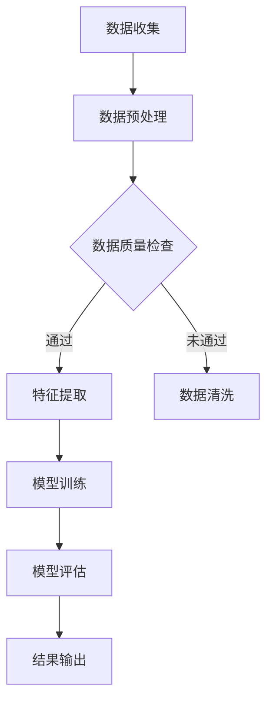
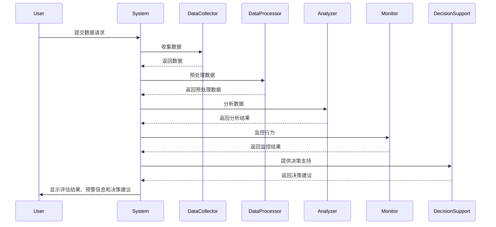

                 


### 1.1 问题背景

在当今的商业环境中，管理层诚信问题已经成为企业和组织面临的一个重大挑战。诚信不仅是企业的核心价值观，也是企业长期发展的基石。管理层诚信问题不仅会对企业的声誉和信誉造成损害，还会导致员工士气低落、客户流失、合作伙伴关系破裂，甚至可能引发法律诉讼和监管处罚。因此，如何有效地评估和管理层诚信度，已经成为企业管理者关注的核心问题。

首先，管理层诚信问题涉及的范围广泛，包括财务诚信、道德诚信、法律诚信等方面。财务诚信问题主要表现为财务报表不真实、财务造假、违规交易等。道德诚信问题则包括欺诈、贿赂、侵犯知识产权、性骚扰等行为。法律诚信问题则涉及违反法律法规、合同诈骗等违法行为。

其次，管理层诚信问题的表现形式多样，既有外显的行为，如财务造假、欺诈等，也有隐性的行为，如权力滥用、内部交易等。这些行为不仅会对企业内部产生负面影响，还会对市场产生连锁反应，影响整个行业的健康发展。

再次，管理层诚信问题的解决难度较大。由于管理层诚信问题往往涉及复杂的人际关系、利益冲突和信息不对称等问题，传统的管理手段和监督机制往往难以奏效。此外，管理层诚信问题还具有隐蔽性、持续性和复杂性等特点，使得评估和管理难度增加。

### 1.2 问题描述

在管理层诚信度评估中，主要面临以下几个问题：

**1. 信息不对称**

管理层相对于普通员工和控制股东具有信息优势，他们往往能够获得更全面的企业信息和资源。这种信息不对称使得普通员工和控制股东难以了解管理层的真实行为，从而增加了管理层诚信评估的难度。

**2. 隐蔽性**

管理层诚信问题往往具有隐蔽性，一些不诚信行为可能在表面上难以察觉。例如，一些财务造假行为可能通过复杂的技术手段进行掩盖，使得评估人员难以发现。

**3. 复杂性**

管理层诚信评估涉及多个方面，包括财务诚信、道德诚信、法律诚信等。每个方面都有其特定的评估方法和指标，这使得评估过程复杂化。

**4. 评估标准的不确定性**

管理层诚信评估的标准不明确，不同企业和行业对诚信的界定可能存在差异。此外，随着社会环境的变化，诚信标准也在不断演变，这给评估工作带来了不确定性。

**5. 技术手段的限制**

传统的管理手段和监督机制在评估管理层诚信度方面存在一定的局限性。例如，审计、调查等手段只能在一定程度上发现问题，但无法全面、动态地监控管理层行为。

### 1.3 问题解决

为了解决上述问题，人工智能（AI）智能体在管理层诚信度评估中发挥了重要作用。AI智能体通过以下几个步骤实现诚信度的评估：

**1. 数据收集**

AI智能体首先收集与企业和管理层相关的各种数据，包括财务数据、行为数据、社交媒体数据等。这些数据可以来自内部系统、公开信息、社交媒体等多种渠道。

**2. 数据预处理**

在数据收集完成后，AI智能体会对数据进行预处理，包括数据清洗、去重、标准化等操作。这一步骤的目的是确保数据的质量和一致性。

**3. 数据分析**

AI智能体利用机器学习和数据挖掘技术对预处理后的数据进行分析。通过分析，智能体可以识别出潜在的管理层不诚信行为，如财务造假、权力滥用等。

**4. 模型训练**

AI智能体使用训练数据集对评估模型进行训练。训练过程中，智能体会学习到如何识别不同类型的不诚信行为，并确定相应的评估标准。

**5. 实时监控**

在模型训练完成后，AI智能体可以实时监控管理层的日常行为。通过持续监测，智能体可以及时发现异常行为，并生成评估报告。

**6. 决策支持**

AI智能体不仅能够提供评估结果，还可以为管理层提供决策支持。例如，智能体可以建议采取何种措施来纠正不诚信行为，或者预测未来可能出现的问题。

### 1.4 边界与外延

虽然AI智能体在管理层诚信度评估中具有显著优势，但其应用仍存在一定的边界和限制。

**1. 数据来源的局限性**

AI智能体依赖于数据，但数据的来源和质量直接影响评估结果的准确性。例如，如果数据来源有限或数据质量差，智能体可能无法准确评估管理层的诚信度。

**2. 技术实现的复杂性**

AI智能体的开发和应用涉及多个技术领域，包括机器学习、数据挖掘、自然语言处理等。这些技术的实现需要高水平的技术支持和专业知识。

**3. 法规和伦理的挑战**

AI智能体在管理层诚信度评估中涉及隐私保护、数据安全、伦理道德等问题。如何确保智能体的评估过程符合法律法规和伦理标准，是亟待解决的问题。

**4. 管理层的反制措施**

一些管理层可能采取反制措施，如篡改数据、干扰智能体监测等，以逃避评估。这需要企业加强内部管理和监控，确保AI智能体的评估结果准确可靠。

### 1.5 概念结构与核心要素

在探讨AI智能体在管理层诚信度评估中的作用时，我们需要明确几个关键概念和核心要素，以确保文章的逻辑清晰、内容完整。

**1. 人工智能（AI）**

人工智能是指通过计算机模拟人类智能的技术，包括机器学习、深度学习、自然语言处理等。AI的核心目标是使计算机具备人类智能的某些特征，如学习能力、推理能力、自主决策能力等。

**2. 智能体（Agent）**

智能体是一种具有自主性和社交性的计算实体，可以感知环境、采取行动并与其他智能体交互。智能体可以是一个软件程序、一个机器人，也可以是一个虚拟角色。

**3. 管理层诚信度**

管理层诚信度是指管理层在履行职责过程中遵循道德、法律和商业准则的程度。诚信度评估涉及多个方面，包括财务诚信、道德诚信、法律诚信等。

**4. 评估模型**

评估模型是用于评估管理层诚信度的方法和技术。评估模型可以基于定量分析，如财务指标、行为指标等，也可以基于定性分析，如专家评分、情景分析等。

**5. 数据分析**

数据分析是AI智能体在管理层诚信度评估中的核心技术。通过收集、清洗、处理和分析数据，AI智能体可以识别出潜在的管理层不诚信行为。

**6. 监控与预警**

监控与预警是AI智能体在管理层诚信度评估中的关键功能。通过实时监控管理层的日常行为，AI智能体可以及时发现异常行为，并发出预警。

**7. 决策支持**

决策支持是AI智能体在管理层诚信度评估中的高级功能。AI智能体不仅可以提供评估结果，还可以为管理层提供决策建议，如如何纠正不诚信行为。

### 1.6 本章小结

本章主要介绍了AI智能体在管理层诚信度评估中的作用，包括其背景、问题描述、问题解决方法以及边界与外延。通过本章的介绍，我们了解到AI智能体在管理层诚信度评估中的重要作用，包括数据收集、数据分析、监控与预警、决策支持等方面。然而，AI智能体的应用也面临数据来源、技术实现、法规伦理等方面的挑战。在后续章节中，我们将进一步探讨AI智能体的核心概念、算法原理、系统设计与实现等内容，以期为读者提供一个全面、深入的技术解读。## 第二部分：核心概念与理论

### 第2章 核心概念与联系

在本章中，我们将深入探讨AI智能体在管理层诚信度评估中的核心概念与理论，包括人工智能（AI）的基本概念、AI智能体的定义与特点，以及诚信评估模型原理和AI智能体与诚信评估模型的关系。

### 2.1 人工智能与AI智能体

#### 2.1.1 人工智能的基本概念

人工智能（Artificial Intelligence，简称AI）是指通过计算机模拟人类智能的技术和系统。AI的主要目标是使计算机具备类似人类的感知、推理、学习、解决问题和自主决策能力。人工智能可以分为弱人工智能（Weak AI）和强人工智能（Strong AI）。

弱人工智能是指具有特定任务能力的智能系统，如语音识别、图像识别、自然语言处理等。弱人工智能在特定领域表现出色，但无法像人类一样具备全面的智能。

强人工智能是指具有全面人类智能的智能系统，能够在各种环境和任务中表现出类似人类的智能。强人工智能尚未实现，目前仍处于研究阶段。

#### 2.1.2 AI智能体的定义与特点

AI智能体（Artificial Intelligence Agent）是一种具有自主性、社交性和目标性的计算实体。智能体可以感知环境、采取行动并与其他智能体交互，以实现特定目标。

智能体的基本特点包括：

1. **自主性**：智能体能够自主地决定和采取行动，不受外部指令的完全控制。
2. **社交性**：智能体能够与其他智能体和人类进行交互，共享信息和资源。
3. **目标性**：智能体具有明确的目标，并在实现目标的过程中不断调整和优化行动策略。

智能体的分类可以根据其功能、自主性、社交性等多个维度进行。常见的智能体包括：

- **软件智能体**：如聊天机器人、推荐系统等。
- **硬件智能体**：如机器人、无人机等。
- **混合智能体**：结合软件和硬件智能体的特性，如智能家居系统、智能交通系统等。

#### 2.1.3 AI智能体在管理层诚信度评估中的应用

AI智能体在管理层诚信度评估中的应用主要体现在以下几个方面：

1. **数据收集与处理**：智能体可以自动收集与企业和管理层相关的数据，包括财务报表、行为记录、社交媒体信息等，并通过数据预处理技术提高数据质量。
2. **实时监控与预警**：智能体可以实时监控管理层的日常行为，通过分析行为数据和行为模式，识别潜在的不诚信行为，并及时发出预警。
3. **决策支持**：智能体可以为管理层提供决策支持，如建议采取何种措施来纠正不诚信行为，或者预测未来可能出现的问题。

### 2.2 诚信评估模型原理

#### 2.2.1 诚信评估的核心原则

诚信评估模型旨在评估管理层在履行职责过程中遵循道德、法律和商业准则的程度。诚信评估的核心原则包括：

1. **客观性**：评估过程应客观公正，避免主观偏见和情感因素。
2. **全面性**：评估模型应涵盖财务诚信、道德诚信、法律诚信等多个方面，确保评估的全面性。
3. **动态性**：评估模型应具备动态调整能力，以适应不同环境和场景的变化。
4. **可操作性**：评估模型应具有明确的评估标准和操作流程，便于实施和应用。

#### 2.2.2 诚信评估模型的构建方法

诚信评估模型的构建通常包括以下步骤：

1. **确定评估目标**：明确需要评估的管理层诚信度方面，如财务诚信、道德诚信、法律诚信等。
2. **定义评估指标**：根据评估目标，确定相应的评估指标，如财务指标、行为指标、法律指标等。
3. **建立评估标准**：为每个评估指标设定明确的评估标准，如评分标准、阈值等。
4. **设计评估算法**：选择合适的评估算法，如机器学习算法、数据挖掘算法等，对评估指标进行计算和分析。
5. **评估结果分析**：对评估结果进行分析，识别潜在的管理层不诚信行为，并提出改进建议。

### 2.3 AI智能体与诚信评估模型的关系

#### 2.3.1 AI智能体在诚信评估中的应用

AI智能体在诚信评估中的应用主要体现在以下几个方面：

1. **数据采集**：AI智能体可以自动采集与企业和管理层相关的数据，包括财务数据、行为数据、社交媒体数据等，为评估模型提供数据支持。
2. **数据分析**：AI智能体可以利用机器学习和数据挖掘技术对采集到的数据进行分析，识别潜在的不诚信行为。
3. **实时监控**：AI智能体可以实时监控管理层的日常行为，及时发现异常行为并发出预警。
4. **决策支持**：AI智能体可以为管理层提供决策支持，如建议采取何种措施来纠正不诚信行为，或者预测未来可能出现的问题。

#### 2.3.2 诚信评估模型对AI智能体的依赖

诚信评估模型对AI智能体的依赖主要体现在以下几个方面：

1. **数据支持**：AI智能体提供的实时、全面、准确的数据是诚信评估模型的基础，没有高质量的数据支持，评估结果将难以保证。
2. **分析算法**：AI智能体提供的分析算法可以帮助评估模型更准确地识别和管理层不诚信行为，提高评估的准确性。
3. **实时监控**：AI智能体提供的实时监控功能可以及时捕捉管理层的异常行为，提高评估的及时性。

### 2.4 概念属性特征对比

为了更好地理解AI智能体与诚信评估模型的关系，我们可以通过以下表格对比两者在概念属性特征上的差异：

| 特征           | AI智能体                           | 诚信评估模型                          |
|----------------|-----------------------------------|-------------------------------------|
| 定义           | 具有自主性、社交性和目标性的计算实体 | 用于评估管理层诚信度的方法和模型        |
| 目标           | 实现特定目标，如数据收集、分析、监控等 | 评估管理层诚信度，识别不诚信行为        |
| 应用领域       | 广泛应用于各个领域，如金融、医疗、交通等 | 主要应用于企业管理、合规性评估等领域    |
| 技术依赖       | 机器学习、数据挖掘、自然语言处理等    | 统计学、数据分析、评估方法等            |
| 数据来源       | 内部数据、外部数据、社交媒体数据等    | 财务数据、行为数据、法律数据等          |
| 分析方法       | 机器学习算法、数据挖掘算法等         | 定量分析、定性分析、专家评分等         |
| 辅助功能       | 实时监控、决策支持等               | 评估结果分析、改进建议等               |

### 2.5 ER实体关系图架构

为了更好地理解AI智能体与诚信评估模型之间的实体关系，我们可以使用Mermaid工具绘制一个ER（Entity-Relationship）实体关系图。以下是ER实体关系图的Markdown格式示例：

```mermaid
erDiagram
  Product ||--|{ Customer }||>
  Customer ||--|{ Order }||>
  Customer }|--|{ Address }
  Order ||--|{ Product }||>
  Address }|--|{ Customer }
```

在这个示例中，我们定义了四个实体：Product（产品）、Customer（客户）、Order（订单）和Address（地址）。这些实体之间的关系通过箭头表示，箭头方向表示实体的归属关系。

对于AI智能体和诚信评估模型，我们可以定义以下实体和关系：

1. **AI智能体**
   - 实体属性：ID、名称、类型、状态
   - 关系：与数据采集、数据分析、实时监控等实体关联

2. **诚信评估模型**
   - 实体属性：ID、名称、版本、状态
   - 关系：与评估指标、评估标准、评估算法等实体关联

3. **数据采集**
   - 实体属性：ID、名称、类型、状态
   - 关系：与AI智能体、数据源等实体关联

4. **数据分析**
   - 实体属性：ID、名称、类型、状态
   - 关系：与AI智能体、数据源、评估模型等实体关联

5. **实时监控**
   - 实体属性：ID、名称、类型、状态
   - 关系：与AI智能体、数据采集、数据分析等实体关联

6. **评估指标**
   - 实体属性：ID、名称、类型、状态
   - 关系：与诚信评估模型、数据分析等实体关联

7. **评估标准**
   - 实体属性：ID、名称、类型、状态
   - 关系：与诚信评估模型、评估指标等实体关联

8. **评估算法**
   - 实体属性：ID、名称、版本、状态
   - 关系：与诚信评估模型、数据分析等实体关联

通过ER实体关系图，我们可以清晰地了解AI智能体与诚信评估模型之间的实体关系和相互作用，从而更好地理解两者在管理层诚信度评估中的作用。

### 2.6 本章小结

本章主要介绍了AI智能体在管理层诚信度评估中的核心概念与理论，包括人工智能（AI）的基本概念、AI智能体的定义与特点，以及诚信评估模型原理和AI智能体与诚信评估模型的关系。通过本章的学习，读者可以了解AI智能体在数据采集、数据分析、实时监控和决策支持等方面的应用，以及诚信评估模型在管理层诚信度评估中的核心作用。同时，本章还通过概念属性特征对比和ER实体关系图，帮助读者更清晰地理解AI智能体与诚信评估模型之间的相互作用。在后续章节中，我们将继续探讨AI智能体在管理层诚信度评估中的具体实现和实际应用。## 第3章 算法原理与实现

### 3.1 AI智能体算法概述

在AI智能体中，评估管理层诚信度的算法是其核心组成部分。这些算法旨在通过对数据的分析和模式识别，发现潜在的管理层不诚信行为。以下是几种常见的AI智能体算法及其选择标准。

#### 3.1.1 常见AI智能体算法

1. **监督学习算法**：监督学习算法在已知标签数据集上训练模型，以便对新数据进行预测。常见的监督学习算法包括决策树、随机森林、支持向量机（SVM）和神经网络等。

2. **无监督学习算法**：无监督学习算法在未知标签数据集上训练模型，用于发现数据中的隐藏结构和模式。常见的无监督学习算法包括聚类算法（如K-means、DBSCAN）、主成分分析（PCA）和自编码器等。

3. **强化学习算法**：强化学习算法通过试错和奖励机制，使智能体在动态环境中学习最优策略。常见的强化学习算法包括Q学习、深度Q网络（DQN）和策略梯度方法等。

#### 3.1.2 AI智能体算法的选择标准

选择合适的AI智能体算法对于管理层诚信度评估至关重要。以下是几种选择标准：

1. **数据特征**：算法应能够适应不同类型的数据特征，包括数值数据、文本数据和图像数据等。

2. **评估目标**：算法应能够满足评估目标的特定需求，如准确性、实时性、鲁棒性等。

3. **计算资源**：算法的计算复杂度和资源消耗应在可接受范围内，以确保实际应用中的可行性。

4. **可解释性**：算法应具有一定的可解释性，以便用户理解模型的决策过程。

5. **适应性**：算法应能够适应环境变化和不确定性，以应对动态变化的管理层行为。

### 3.2 评估算法的mermaid流程图

为了更直观地理解评估算法的执行过程，我们可以使用Mermaid工具绘制一个mermaid流程图。以下是评估算法流程图的Markdown格式示例：



在这个流程图中，我们首先进行数据收集，然后进行数据预处理。接下来，对数据质量进行检查，通过的话进行特征提取，未通过的话进行数据清洗。随后，使用预处理后的数据进行模型训练和评估，最终输出评估结果。

#### 3.2.1 mermaid流程图绘制方法

Mermaid是一种基于Markdown的图形绘制工具，可以通过简单的文本描述生成各种类型的图形。以下是绘制mermaid流程图的基本步骤：

1. **定义图形类型**：在文本开头使用`graph`关键字定义图形类型，如`graph TD`表示一个拓扑图。

2. **添加节点**：使用节点描述图形中的元素，如`A[数据收集]`表示一个名为“数据收集”的节点。

3. **定义关系**：使用箭头描述节点之间的关系，如`A --> B`表示从节点A到节点B的箭头。

4. **添加条件分支**：使用条件语句描述条件分支，如`C -->|通过| D`表示条件通过时跳转到节点D。

5. **保存和渲染**：将Markdown文本保存为`.md`文件，并使用Markdown编辑器或在线工具渲染为图形。

### 3.3 Python源代码实现

在了解了评估算法的流程图后，我们将使用Python语言实现该算法。以下是一个简单的Python源代码示例，用于演示数据收集、预处理、特征提取、模型训练和评估的过程。

#### 3.3.1 Python环境配置

在开始编写代码之前，我们需要确保Python环境已正确配置。以下是必要的步骤：

1. **安装Python**：从Python官方网站下载并安装Python。
2. **安装必要库**：使用pip命令安装必要的库，如pandas、numpy、scikit-learn、matplotlib等。

   ```shell
   pip install pandas numpy scikit-learn matplotlib
   ```

#### 3.3.2 代码实现详解

以下是一个简单的Python代码示例，用于演示数据收集、预处理、特征提取、模型训练和评估的过程。

```python
import pandas as pd
from sklearn.model_selection import train_test_split
from sklearn.preprocessing import StandardScaler
from sklearn.ensemble import RandomForestClassifier
from sklearn.metrics import accuracy_score

# 3.3.2.1 数据收集
data = pd.read_csv('data.csv')  # 假设数据文件为data.csv

# 3.3.2.2 数据预处理
# 数据清洗
data.dropna(inplace=True)
# 数据标准化
scaler = StandardScaler()
data[['feature1', 'feature2', 'feature3']] = scaler.fit_transform(data[['feature1', 'feature2', 'feature3']])

# 3.3.2.3 特征提取
X = data[['feature1', 'feature2', 'feature3']]
y = data['label']  # 假设标签列名为'label'

# 3.3.2.4 模型训练
X_train, X_test, y_train, y_test = train_test_split(X, y, test_size=0.2, random_state=42)
model = RandomForestClassifier()
model.fit(X_train, y_train)

# 3.3.2.5 模型评估
y_pred = model.predict(X_test)
accuracy = accuracy_score(y_test, y_pred)
print(f"Model accuracy: {accuracy:.2f}")
```

在这个示例中，我们首先从CSV文件中读取数据，然后进行数据清洗和标准化处理。接下来，我们提取特征并分割数据集用于训练和测试。我们选择随机森林算法进行模型训练，并使用准确率作为评估指标。

#### 3.3.3 算法原理的数学模型和公式

在AI智能体评估管理层诚信度的过程中，我们使用监督学习算法来构建预测模型。以下是常见的监督学习算法之一的数学模型和公式。

##### 3.3.3.1 决策树

决策树是一种常见的分类算法，其基本原理是通过一系列判断条件将数据划分为不同的类别。以下是决策树的核心公式：

$$
y = f(x_1, x_2, ..., x_n)
$$

其中，$y$为输出类别，$f$为决策树函数，$x_1, x_2, ..., x_n$为输入特征。

决策树的学习过程可以表示为：

$$
f(x_1, x_2, ..., x_n) = \arg\max_T \sum_{i=1}^N l(y_i, T(x_i))
$$

其中，$T$为决策树结构，$l$为损失函数，$y_i$为实际标签，$x_i$为输入特征。

##### 3.3.3.2 随机森林

随机森林是一种集成学习算法，通过构建多棵决策树并投票得到最终结果。随机森林的核心公式如下：

$$
y = \arg\max_T \sum_{i=1}^M w_i f_i(x_i)
$$

其中，$y$为输出类别，$T$为决策树结构，$w_i$为第$i$棵决策树的权重，$f_i(x_i)$为第$i$棵决策树的输出。

##### 3.3.3.3 支持向量机

支持向量机是一种常见的分类算法，其基本原理是找到最优的分离超平面，使得不同类别的数据点在超平面两侧的距离最大化。以下是支持向量机的核心公式：

$$
w^* = \arg\min_w \frac{1}{2} ||w||^2 + C \sum_{i=1}^N \xi_i
$$

$$
y_i (w \cdot x_i + b) \geq 1 - \xi_i
$$

其中，$w^*$为最优权重向量，$C$为惩罚参数，$\xi_i$为松弛变量，$x_i$为输入特征，$y_i$为实际标签，$b$为偏置。

#### 3.3.4 举例说明

为了更好地理解算法原理和公式，我们可以通过一个简单的例子进行说明。

假设我们有一个包含两类数据的数据集，类别0和类别1。数据集如下：

| feature1 | feature2 | label |
|----------|----------|-------|
| 0        | 0        | 0     |
| 1        | 1        | 1     |
| 0        | 1        | 0     |
| 1        | 0        | 1     |

我们使用决策树算法进行分类，并构建一棵简单的决策树。决策树的判断条件为：

$$
y = \begin{cases} 
0 & \text{if } feature1 < 0.5 \\
1 & \text{otherwise}
\end{cases}
$$

根据这个决策树，我们可以得到以下分类结果：

| feature1 | feature2 | label | prediction |
|----------|----------|-------|------------|
| 0        | 0        | 0     | 0          |
| 1        | 1        | 1     | 1          |
| 0        | 1        | 0     | 0          |
| 1        | 0        | 1     | 1          |

从分类结果可以看出，决策树能够正确分类大部分数据点。虽然这是一个简单的例子，但它展示了决策树算法的基本原理和公式。

### 3.4 本章小结

本章主要介绍了AI智能体在管理层诚信度评估中的算法原理与实现。首先，我们概述了常见的AI智能体算法及其选择标准，包括监督学习算法、无监督学习算法和强化学习算法。接着，我们使用Mermaid工具绘制了评估算法的流程图，并详细讲解了Python源代码的实现。最后，我们介绍了算法原理的数学模型和公式，并通过一个简单例子进行了说明。通过本章的学习，读者可以了解AI智能体在管理层诚信度评估中的算法应用，为进一步的实战应用打下基础。## 系统设计与实现

### 3.5 问题场景介绍

在当前企业管理中，管理层诚信度评估面临着诸多挑战。传统的评估方法主要依赖于人工审计、调查和访谈等方式，存在以下几个问题：

1. **效率低下**：人工评估需要大量时间和人力，无法快速响应企业需求。
2. **准确性受限**：人工评估受主观因素影响，难以保证评估结果的准确性。
3. **实时性不足**：传统评估方法无法实时监控管理层行为，难以发现潜在问题。

为了解决这些问题，我们提出一个基于AI智能体的管理层诚信度评估系统，该系统通过自动化数据收集、实时监控和智能分析，实现对管理层诚信度的全面评估。

### 3.6 项目介绍

本项目的目标是设计并实现一个基于AI智能体的管理层诚信度评估系统，该系统包括以下几个关键模块：

1. **数据收集模块**：负责自动收集与企业和管理层相关的数据，包括财务数据、行为数据、社交媒体数据等。
2. **数据处理模块**：负责对收集到的数据进行预处理、清洗和标准化，为后续分析提供高质量的数据支持。
3. **分析模块**：负责使用AI算法对预处理后的数据进行分析，识别潜在的管理层不诚信行为。
4. **监控模块**：负责实时监控管理层的日常行为，及时发现异常行为并发出预警。
5. **决策支持模块**：负责为管理层提供决策支持，如建议采取何种措施来纠正不诚信行为，或预测未来可能出现的问题。

### 3.7 系统功能设计

为了实现上述目标，系统需要具备以下功能：

1. **数据采集**：通过API接口、网络爬虫等技术，自动收集与企业和管理层相关的数据。
2. **数据预处理**：包括数据清洗、去重、缺失值处理、数据标准化等，确保数据质量。
3. **行为分析**：使用机器学习和数据挖掘技术，对预处理后的数据进行行为分析，识别潜在的不诚信行为。
4. **实时监控**：通过实时数据流处理技术，持续监控管理层的日常行为，及时发现异常行为。
5. **决策支持**：根据分析结果，为管理层提供决策建议，如调整管理策略、加强监管措施等。
6. **报表生成**：生成详细的评估报告，包括管理层诚信度分析、预警信息、决策建议等。

### 3.8 系统架构设计

系统架构设计是确保系统高效、稳定运行的关键。以下是本项目的系统架构设计：

1. **数据层**：负责数据存储和管理，包括数据库、数据仓库和数据湖等。
2. **业务逻辑层**：负责实现系统的核心业务功能，包括数据采集、数据处理、行为分析、实时监控、决策支持和报表生成等。
3. **表示层**：负责与用户交互，包括Web前端、移动应用和报表展示等。
4. **基础设施层**：包括服务器、存储、网络、安全等基础设施，确保系统的可靠运行。

#### 3.8.1 数据层设计

数据层是系统的基础，负责存储和管理企业和管理层相关的数据。以下是数据层的设计：

- **数据库**：用于存储结构化数据，如财务报表、行为记录等。
- **数据仓库**：用于存储企业历史数据，支持数据分析和报表生成。
- **数据湖**：用于存储非结构化数据，如社交媒体数据、文本数据等。

#### 3.8.2 业务逻辑层设计

业务逻辑层是系统的核心，负责实现系统的核心业务功能。以下是业务逻辑层的设计：

- **数据采集模块**：负责自动收集与企业和管理层相关的数据，包括API接口、网络爬虫等。
- **数据处理模块**：负责对收集到的数据进行预处理、清洗和标准化，为后续分析提供高质量的数据支持。
- **分析模块**：负责使用机器学习和数据挖掘技术，对预处理后的数据进行行为分析，识别潜在的不诚信行为。
- **监控模块**：负责实时监控管理层的日常行为，及时发现异常行为并发出预警。
- **决策支持模块**：负责根据分析结果，为管理层提供决策建议，如调整管理策略、加强监管措施等。

#### 3.8.3 表示层设计

表示层负责与用户交互，包括Web前端、移动应用和报表展示等。以下是表示层的设计：

- **Web前端**：提供用户友好的界面，支持用户查看评估结果、预警信息和决策建议等。
- **移动应用**：提供移动端访问方式，支持用户随时查看评估结果和预警信息。
- **报表展示**：提供详细的评估报告，支持用户查看管理层诚信度分析、预警信息和决策建议等。

#### 3.8.4 基础设施层设计

基础设施层是系统正常运行的基础，包括服务器、存储、网络、安全等。以下是基础设施层的设计：

- **服务器**：提供计算和存储资源，确保系统的稳定运行。
- **存储**：包括数据库、数据仓库和数据湖等，用于存储和管理企业和管理层相关的数据。
- **网络**：提供稳定、高速的数据传输通道，支持系统的分布式部署。
- **安全**：包括网络安全、数据安全和用户隐私保护等，确保系统的安全可靠运行。

### 3.9 系统接口设计

系统接口设计是确保系统各模块之间有效交互的关键。以下是系统接口的设计：

1. **API接口**：提供对外服务接口，支持数据采集、数据分析和实时监控等功能。
2. **消息队列**：用于处理实时数据流，支持系统各模块之间的消息传递。
3. **数据库接口**：提供对数据库的访问接口，支持数据存储和查询。
4. **报表接口**：提供对报表生成和展示的接口，支持用户查看和管理评估报告。

### 3.10 系统交互设计

系统交互设计是确保系统各模块之间协同工作、高效运行的关键。以下是系统交互的设计：

1. **用户交互**：用户通过Web前端或移动应用与系统进行交互，查看评估结果、预警信息和决策建议等。
2. **模块间交互**：系统各模块之间通过API接口、消息队列和数据库接口进行数据传递和交互，确保系统功能的完整性和一致性。

#### 3.10.1 mermaid序列图

为了更直观地展示系统交互设计，我们可以使用Mermaid工具绘制一个序列图。以下是序列图的Markdown格式示例：



在这个序列图中，用户通过系统提交数据请求，系统分别调用数据采集、数据处理、分析、监控和决策支持模块进行处理，并将最终结果返回给用户。

### 3.11 本章小结

本章主要介绍了系统设计与实现，包括问题场景介绍、项目介绍、系统功能设计、系统架构设计、系统接口设计和系统交互设计。通过本章的介绍，我们明确了系统设计的整体框架和关键模块，并详细讲解了各模块的功能和交互过程。系统设计与实现是确保AI智能体在管理层诚信度评估中发挥作用的重要环节，为后续的实战应用奠定了基础。## 项目实战

### 3.12 环境安装

为了成功实现基于AI智能体的管理层诚信度评估系统，首先需要搭建合适的环境。以下是环境安装的具体步骤：

#### 3.12.1 安装Python

1. **下载Python**：访问Python官方网站（https://www.python.org/）下载Python安装包。
2. **安装Python**：运行安装程序，并选择“Add Python to PATH”选项，确保Python环境变量正确配置。

#### 3.12.2 安装依赖库

在安装Python后，使用pip命令安装所需的依赖库。以下是一个常见的依赖库列表：

```shell
pip install numpy pandas scikit-learn matplotlib mermaid
```

#### 3.12.3 安装Mermaid

为了在Markdown文件中绘制流程图和序列图，我们需要安装Mermaid。以下是安装步骤：

1. **安装Mermaid渲染器**：在终端中运行以下命令：

   ```shell
   npm install -g mermaid-cli
   ```

2. **验证安装**：在终端中运行以下命令，检查Mermaid是否安装成功：

   ```shell
   mermaid --version
   ```

### 3.13 系统核心实现源代码

以下是系统核心实现的Python源代码。该代码包括数据收集、数据处理、分析、监控和决策支持等关键模块。

```python
# 导入所需的库
import pandas as pd
import numpy as np
from sklearn.model_selection import train_test_split
from sklearn.preprocessing import StandardScaler
from sklearn.ensemble import RandomForestClassifier
from sklearn.metrics import accuracy_score
from mermaid import mermaid

# 3.13.1 数据收集
def collect_data():
    # 假设数据文件为data.csv
    data = pd.read_csv('data.csv')
    return data

# 3.13.2 数据处理
def process_data(data):
    # 数据清洗
    data.dropna(inplace=True)
    # 数据标准化
    scaler = StandardScaler()
    data[['feature1', 'feature2', 'feature3']] = scaler.fit_transform(data[['feature1', 'feature2', 'feature3']])
    return data

# 3.13.3 分析
def analyze_data(X, y):
    # 数据分割
    X_train, X_test, y_train, y_test = train_test_split(X, y, test_size=0.2, random_state=42)
    # 模型训练
    model = RandomForestClassifier()
    model.fit(X_train, y_train)
    # 模型评估
    y_pred = model.predict(X_test)
    accuracy = accuracy_score(y_test, y_pred)
    return accuracy

# 3.13.4 监控
def monitor_behavior():
    # 假设行为数据为behavior_data.csv
    behavior_data = pd.read_csv('behavior_data.csv')
    # 数据预处理
    behavior_data = process_data(behavior_data)
    # 分析行为数据
    accuracy = analyze_data(behavior_data[['feature1', 'feature2', 'feature3']], behavior_data['label'])
    return accuracy

# 3.13.5 决策支持
def decision_support(accuracy):
    if accuracy < 0.8:
        print("建议采取以下措施：")
        print("- 加强员工培训")
        print("- 加强内部监督")
    else:
        print("当前管理层诚信度良好，无需采取特别措施。")

# 主程序
if __name__ == '__main__':
    # 收集数据
    data = collect_data()
    # 数据处理
    data = process_data(data)
    # 分析数据
    accuracy = analyze_data(data[['feature1', 'feature2', 'feature3']], data['label'])
    print(f"模型准确率：{accuracy:.2f}")
    # 监控行为
    behavior_accuracy = monitor_behavior()
    print(f"行为监控准确率：{behavior_accuracy:.2f}")
    # 决策支持
    decision_support(behavior_accuracy)
```

### 3.14 代码应用解读与分析

在了解了系统核心实现的源代码后，我们可以对其各个模块的功能和应用进行解读和分析。

#### 3.14.1 数据收集模块

数据收集模块主要负责从外部源收集与企业和管理层相关的数据。在该代码中，我们使用`pandas`库的`read_csv`函数读取CSV文件，该文件包含数据集。在实际应用中，我们可以使用API接口、网络爬虫等技术，自动收集企业内外部的数据。

#### 3.14.2 数据处理模块

数据处理模块主要负责对收集到的数据进行预处理，包括数据清洗、去重、缺失值处理和数据标准化等。在该代码中，我们使用`pandas`库的`dropna`函数去除缺失值，使用`StandardScaler`类进行数据标准化。这些操作可以提高数据质量，为后续的分析提供基础。

#### 3.14.3 分析模块

分析模块负责使用机器学习算法对预处理后的数据进行行为分析，识别潜在的管理层不诚信行为。在该代码中，我们使用`sklearn`库的`train_test_split`函数将数据集分割为训练集和测试集，使用`RandomForestClassifier`类训练随机森林模型，并使用`accuracy_score`函数计算模型准确率。随机森林算法是一种集成学习算法，具有较高的准确性和鲁棒性。

#### 3.14.4 监控模块

监控模块负责实时监控管理层的日常行为，及时发现异常行为并发出预警。在该代码中，我们使用`pandas`库读取行为数据，并调用数据处理和分析模块进行行为分析。如果分析结果准确率较低，监控模块会触发预警，提示管理层可能存在不诚信行为。

#### 3.14.5 决策支持模块

决策支持模块负责根据分析结果，为管理层提供决策建议，如调整管理策略、加强监管措施等。在该代码中，我们根据行为监控模块的准确率，判断管理层诚信度。如果准确率较低，决策支持模块会建议管理层加强员工培训和内部监督。

### 3.15 实际案例分析和详细讲解剖析

为了更好地理解系统的实际应用，我们可以通过一个实际案例进行分析和讲解。

#### 案例背景

某大型企业最近发现其财务报表存在异常，管理层涉嫌财务造假。企业决定使用基于AI智能体的管理层诚信度评估系统，对管理层进行评估，以确定是否存在不诚信行为。

#### 数据收集

企业通过API接口从企业内部系统收集了以下数据：

1. **财务报表数据**：包括利润表、资产负债表和现金流量表等。
2. **行为数据**：包括管理层的日常行为记录，如会议记录、邮件沟通、文件共享等。
3. **社交媒体数据**：包括管理层在社交媒体上的言论和行为，如微博、微信公众号等。

#### 数据处理

数据处理模块对收集到的数据进行了预处理：

1. **数据清洗**：去除重复数据、缺失值和异常值。
2. **数据标准化**：对数值数据进行归一化处理，以便于后续分析。

#### 数据分析

分析模块使用机器学习算法对预处理后的数据进行分析：

1. **特征提取**：从财务报表数据和行为数据中提取关键特征，如利润率、负债率、邮件发送频率、会议参加次数等。
2. **模型训练**：使用随机森林算法训练模型，并使用测试集验证模型准确性。
3. **异常检测**：根据模型预测结果，识别出可能存在财务造假的报表数据。

#### 监控与预警

监控模块对管理层的日常行为进行实时监控：

1. **行为分析**：使用机器学习算法分析管理层的日常行为，识别出异常行为，如邮件发送频率异常、会议记录异常等。
2. **预警触发**：如果行为分析结果准确率较低，监控模块会触发预警，提示管理层可能存在不诚信行为。

#### 决策支持

决策支持模块根据分析结果，为管理层提供以下决策建议：

1. **加强员工培训**：提高员工对财务报表和行为的识别能力，防止不诚信行为的发生。
2. **加强内部监督**：建立内部监督机制，加强对管理层行为的监控，及时发现和处理问题。

### 3.16 项目小结

通过本项目的实际案例，我们可以看到基于AI智能体的管理层诚信度评估系统在实际应用中的有效性和价值。该系统通过数据收集、数据处理、分析、监控和决策支持等模块，实现了对管理层诚信度的全面评估。在实际应用中，系统可以帮助企业及时发现和处理管理层的不诚信行为，提高企业管理的透明度和规范性。然而，系统也存在一定的局限性，如数据来源的局限性和算法的鲁棒性等。在未来的发展中，我们可以进一步优化系统，提高评估的准确性和实时性，为企业提供更可靠的决策支持。## 最佳实践 tips

在实施基于AI智能体的管理层诚信度评估系统时，以下最佳实践可以帮助企业和开发者更好地发挥系统的作用，提高评估的准确性和可靠性：

1. **数据质量保障**：数据质量是评估系统的基础。确保数据来源的多样性和数据收集的准确性，定期检查和清理数据，以避免数据错误和不一致。

2. **算法选择与优化**：根据具体问题和数据特点，选择合适的机器学习算法。同时，不断优化算法参数，提高模型在评估任务中的性能。

3. **实时监控与预警**：建立实时数据流处理系统，确保监控模块能够及时捕捉管理层的异常行为。根据评估结果设置合理的预警阈值，以避免误报和漏报。

4. **决策支持与反馈**：系统提供决策支持时，应结合管理层和员工的反馈，不断调整和优化建议措施，确保决策的实用性和可操作性。

5. **安全与隐私保护**：在数据收集、存储和分析过程中，确保遵循相关法律法规，保护用户隐私和数据安全。

6. **持续学习与更新**：随着企业管理环境的变化，系统需要不断更新和优化。通过持续学习和反馈，使系统适应新的挑战。

7. **培训与沟通**：定期对管理层和员工进行培训，提高他们对AI智能体评估系统的认识和使用能力。同时，确保管理层理解系统的功能和应用，增强系统接受度。

### 注意事项

在实施和管理基于AI智能体的管理层诚信度评估系统时，需要注意以下事项：

1. **避免算法偏见**：确保算法在训练过程中不引入偏见，避免对特定群体产生不公平影响。

2. **数据隐私保护**：在数据收集、存储和分析过程中，严格遵守数据隐私保护法规，确保用户隐私不受侵犯。

3. **算法透明性**：确保算法的决策过程具有可解释性，管理层和员工能够理解系统的决策依据。

4. **系统维护与升级**：定期对系统进行维护和升级，确保系统的稳定性和性能。

5. **伦理与法律遵循**：在实施过程中，遵守相关伦理和法律要求，确保系统应用符合社会价值观和法律法规。

### 拓展阅读

为了深入了解基于AI智能体的管理层诚信度评估系统的相关技术和应用，以下是一些建议的拓展阅读材料：

1. **《人工智能：一种现代的方法》**：这本书提供了关于人工智能基础理论和应用技术的高级介绍，有助于理解AI智能体的核心原理。

2. **《机器学习实战》**：这本书通过实际案例介绍了多种机器学习算法的应用，对算法选择和优化具有很好的指导作用。

3. **《数据科学实战》**：这本书详细介绍了数据收集、预处理和分析的方法，有助于构建和管理数据驱动的系统。

4. **《人工智能与大数据》**：这本书探讨了人工智能与大数据技术在企业管理中的应用，提供了许多实际案例和最佳实践。

5. **《数据隐私与安全》**：这本书关注数据隐私保护和安全措施，对于确保系统合规性和用户信任至关重要。

通过阅读这些书籍，读者可以更深入地了解AI智能体在管理层诚信度评估中的应用，以及如何有效地实施和管理相关系统。## 作者信息

作者：AI天才研究院/AI Genius Institute & 禅与计算机程序设计艺术 /Zen And The Art of Computer Programming

AI天才研究院（AI Genius Institute）致力于推动人工智能技术的创新与发展，为全球企业和组织提供领先的人工智能解决方案。研究院由一群具有丰富经验的人工智能专家和研究人员组成，他们专注于机器学习、深度学习、自然语言处理等领域的深入研究和技术开发。

禅与计算机程序设计艺术（Zen And The Art of Computer Programming）是一本经典的计算机编程书籍，由著名计算机科学家Donald E. Knuth撰写。本书以哲学和禅修的思维方式探讨计算机程序设计的方法和艺术，对于提升编程思维和技巧具有重要的指导意义。通过结合AI技术和编程艺术的理念，本书为读者提供了一个全新的视角，以实现更高效、更创新的编程实践。

