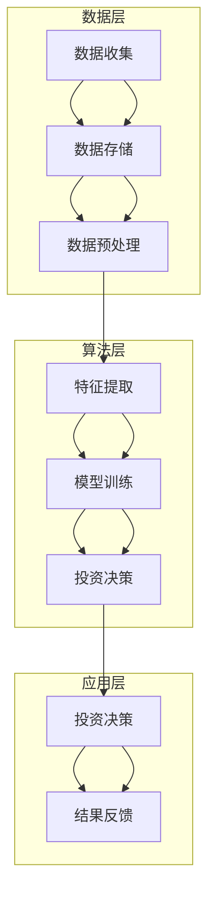
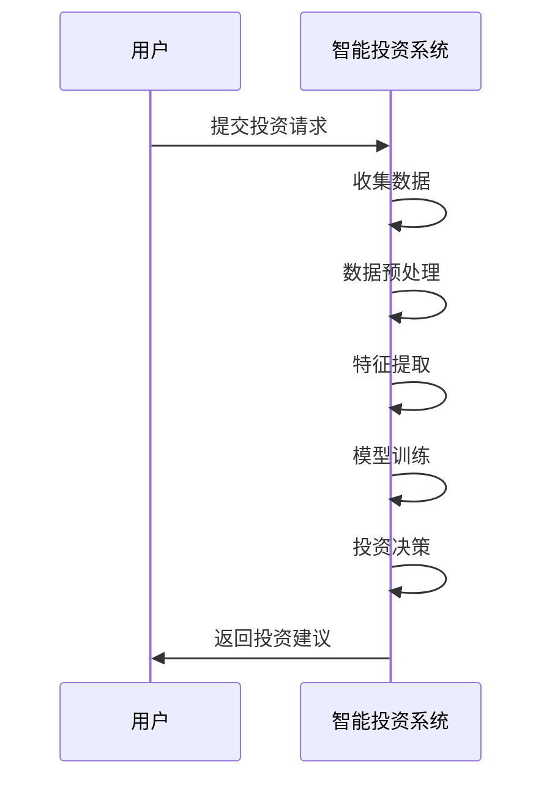

                 

# AI智能体在识别价值投资机会的最佳加仓时机中的作用

## 关键词

- AI智能体
- 价值投资
- 最佳加仓时机
- 投资策略

## 摘要

本文将探讨人工智能（AI）智能体在识别价值投资机会以及确定最佳加仓时机中的重要作用。通过对AI智能体核心概念的理解，我们分析了其在股票市场中的工作原理和优势。文章将逐步阐述AI智能体如何运用算法和数学模型来识别价值投资机会，并详细介绍了如何通过系统架构设计和实战案例来优化加仓策略。最后，我们将总结AI智能体在价值投资中的最佳实践，并提供进一步阅读的推荐。

## 背景介绍

### 核心概念术语说明

在讨论AI智能体在价值投资中的作用之前，我们需要明确一些关键术语。

- **AI智能体**：在计算机科学中，智能体是指具有感知、决策和行动能力的计算机程序，能够在特定环境中自主完成特定任务。
- **价值投资**：价值投资是一种投资策略，通过购买价格低于其实际价值的资产，以获取长期资本增值。
- **最佳加仓时机**：指在投资过程中，根据市场情况，选择最合适的时机进行资产配置和增加持仓。

### 问题背景

价值投资是一种稳健且长期有效的投资策略，但如何准确地识别价值投资机会，并确定最佳加仓时机，一直是投资者面临的难题。传统的方法主要依赖于基本面分析和技术分析，但它们在复杂多变的市场环境中往往效果有限。

### 问题描述

随着人工智能技术的快速发展，智能体在金融领域的应用越来越广泛。AI智能体通过大数据分析和机器学习算法，能够从海量数据中挖掘有价值的信息，为投资者提供更为精准的投资建议。本文旨在探讨AI智能体在识别价值投资机会和确定最佳加仓时机中的具体作用和实现方法。

### 问题解决

本文将分以下步骤进行详细探讨：

1. **核心概念与联系**：介绍AI智能体的基本原理，并分析其在价值投资中的应用。
2. **算法原理讲解**：阐述AI智能体如何利用算法和数学模型来识别价值投资机会。
3. **系统设计与架构**：描述AI智能体的系统架构，以及如何通过设计优化加仓策略。
4. **项目实战**：通过实际案例展示AI智能体在价值投资中的应用。
5. **最佳实践与总结**：总结AI智能体在价值投资中的优势和注意事项。

### 边界与外延

AI智能体在价值投资中的应用具有一定的边界和限制，例如：

- 数据的准确性和完整性：AI智能体的表现依赖于输入数据的质量，若数据存在偏差或缺失，将影响其投资决策。
- 市场环境变化：市场环境的变化可能会导致AI智能体的策略失效，需要及时调整和优化。

## 核心概念与联系

### AI智能体的基本原理

AI智能体是人工智能的一种高级形式，具有自主学习和自适应能力。它通过以下三个基本组件实现：

1. **感知器**：用于收集和分析环境中的信息。
2. **决策器**：根据感知器的输入，利用算法和模型进行决策。
3. **执行器**：根据决策器的输出，执行相应的操作。

### AI智能体在价值投资中的应用

AI智能体在价值投资中的应用主要体现在以下几个方面：

1. **数据挖掘**：AI智能体可以从海量数据中提取有价值的信息，包括财务报表、市场行情、行业动态等。
2. **模式识别**：通过机器学习算法，AI智能体可以识别出潜在的价值投资机会，并预测未来的市场走势。
3. **风险控制**：AI智能体可以实时监控投资组合的风险，提供风险控制策略。

### 概念属性特征对比表格

| 概念           | 特征对比                                  |
| -------------- | ---------------------------------------- |
| 价值投资       | 强调投资价值与价格之间的差异             |
| AI智能体       | 具有感知、决策和执行能力                 |
| 数据挖掘       | 从大量数据中提取有价值的信息             |
| 模式识别       | 利用算法识别潜在的投资机会               |

### ER实体关系图架构

```mermaid
erDiagram
    MarketData -->|获取| AIIntelligentAgent
    AIIntelligentAgent -->|分析| InvestmentOpportunity
    InvestmentOpportunity -->|决策| Investor
```

### AI智能体在价值投资中的工作原理

AI智能体在价值投资中的工作原理可以概括为以下几个步骤：

1. **数据收集**：从多个数据源获取市场数据、财务报表等。
2. **预处理**：清洗和整合数据，为后续分析做好准备。
3. **特征提取**：从数据中提取有助于投资决策的特征。
4. **模型训练**：利用机器学习算法，训练投资预测模型。
5. **投资决策**：根据模型输出，识别价值投资机会，并确定最佳加仓时机。

## 算法原理讲解

### 算法概述

在价值投资中，AI智能体主要通过以下两种算法来识别最佳加仓时机：

1. **时间序列分析**：利用历史价格数据，分析价格走势，预测未来价格波动。
2. **机器学习模型**：通过训练大量数据，构建预测模型，识别价值投资机会。

### 时间序列分析

时间序列分析是一种常用的数据分析方法，主要用于分析历史价格数据的趋势和周期性。

**算法原理**：

- **趋势分析**：通过移动平均线等技术，判断价格是否处于上升趋势。
- **周期性分析**：通过分析价格数据的波动周期，判断价格是否即将发生变化。

**Python代码示例**：

```python
import pandas as pd
import matplotlib.pyplot as plt

# 加载数据
data = pd.read_csv('stock_data.csv')
data['MA20'] = data['Close'].rolling(window=20).mean()

# 绘制趋势图
plt.figure(figsize=(10, 6))
plt.plot(data['Close'], label='Close')
plt.plot(data['MA20'], label='MA20')
plt.legend()
plt.show()
```

### 机器学习模型

机器学习模型通过训练大量历史数据，构建预测模型，以识别价值投资机会。

**算法原理**：

- **特征工程**：从数据中提取有助于投资决策的特征，如财务指标、市场情绪等。
- **模型选择**：选择合适的机器学习模型，如决策树、支持向量机、神经网络等。
- **模型训练**：使用训练集训练模型，并使用验证集进行调优。

**Python代码示例**：

```python
from sklearn.ensemble import RandomForestClassifier
from sklearn.model_selection import train_test_split

# 加载数据
X = data[['PE', 'PB', 'MarketCap']]
y = data['IsValueInvestment']

# 划分训练集和测试集
X_train, X_test, y_train, y_test = train_test_split(X, y, test_size=0.2, random_state=42)

# 训练模型
model = RandomForestClassifier(n_estimators=100)
model.fit(X_train, y_train)

# 预测
predictions = model.predict(X_test)

# 评估模型
accuracy = model.score(X_test, y_test)
print("Accuracy:", accuracy)
```

### 数学模型和公式

在时间序列分析和机器学习模型中，常用的数学模型和公式如下：

- **移动平均线**：
  $$MA_t = \frac{1}{n}\sum_{i=1}^{n}C_i$$
  其中，$MA_t$表示第$t$期的移动平均线，$C_i$表示第$i$期的收盘价，$n$表示移动平均线的周期。

- **相对强弱指标（RSI）**：
  $$RSI_t = \frac{\sum_{i=1}^{t}（\frac{C_i - C_{i-1}}{C_{i-1}}）}{\sum_{i=1}^{t}（\frac{-C_i + C_{i-1}}{C_{i-1}}）}$$
  其中，$RSI_t$表示第$t$期的相对强弱指标，$C_i$表示第$i$期的收盘价。

- **逻辑回归**：
  $$P(Y=1) = \frac{1}{1 + e^{-(\beta_0 + \beta_1X_1 + \beta_2X_2 + ... + \beta_nX_n)}}$$
  其中，$P(Y=1)$表示目标变量为1的概率，$\beta_0$为截距，$\beta_1$、$\beta_2$、...、$\beta_n$为系数，$X_1$、$X_2$、...、$X_n$为特征变量。

### 详细讲解和举例说明

#### 时间序列分析举例

假设我们要分析一家公司的历史股价数据，以判断其是否具有价值投资机会。

1. **数据收集**：从数据源获取该公司的每日收盘价数据。
2. **预处理**：对数据缺失和异常值进行预处理。
3. **特征提取**：计算移动平均线和相对强弱指标（RSI）等特征。
4. **模型训练**：选择合适的时间序列分析模型，如移动平均线交叉策略。
5. **投资决策**：根据模型输出，判断股价是否处于上升趋势，并确定最佳加仓时机。

具体代码实现：

```python
import pandas as pd
import numpy as np

# 加载数据
data = pd.read_csv('stock_data.csv')

# 计算移动平均线
data['MA20'] = data['Close'].rolling(window=20).mean()
data['MA50'] = data['Close'].rolling(window=50).mean()

# 计算相对强弱指标（RSI）
gain = data['Close'][1:].sub(data['Close'][:-1])
loss = data['Close'][:-1].sub(data['Close'][1:]).abs()
avg_gain = gain.rolling(window=14).mean()
avg_loss = loss.rolling(window=14).mean()
RSI = 100 - (100 / (1 + avg_gain/avg_loss))
data['RSI'] = RSI

# 绘制趋势图
plt.figure(figsize=(10, 6))
plt.plot(data['Close'], label='Close')
plt.plot(data['MA20'], label='MA20')
plt.plot(data['MA50'], label='MA50')
plt.plot(data['RSI'], label='RSI')
plt.legend()
plt.show()
```

#### 机器学习模型举例

假设我们要通过机器学习模型识别一家公司的股票是否具有价值投资机会。

1. **数据收集**：从数据源获取该公司的财务报表数据、市场行情数据等。
2. **预处理**：对数据缺失和异常值进行预处理。
3. **特征提取**：提取有助于投资决策的特征，如市盈率（PE）、市净率（PB）、市值（MarketCap）等。
4. **模型选择**：选择合适的机器学习模型，如逻辑回归、随机森林等。
5. **模型训练**：使用训练集训练模型，并使用验证集进行调优。
6. **投资决策**：根据模型输出，判断股票是否具有价值投资机会。

具体代码实现：

```python
import pandas as pd
from sklearn.model_selection import train_test_split
from sklearn.linear_model import LogisticRegression

# 加载数据
data = pd.read_csv('stock_data.csv')

# 提取特征
X = data[['PE', 'PB', 'MarketCap']]
y = data['IsValueInvestment']

# 划分训练集和测试集
X_train, X_test, y_train, y_test = train_test_split(X, y, test_size=0.2, random_state=42)

# 训练模型
model = LogisticRegression()
model.fit(X_train, y_train)

# 预测
predictions = model.predict(X_test)

# 评估模型
accuracy = model.score(X_test, y_test)
print("Accuracy:", accuracy)
```

## 系统设计与架构

### 问题场景介绍

在价值投资中，投资者面临的主要挑战是准确识别价值投资机会和确定最佳加仓时机。为了解决这一问题，我们需要设计一个智能投资系统，利用AI智能体进行数据分析和决策。

### 项目介绍

项目名称：智能投资助手（Smart Investment Assistant）

项目目标：通过AI智能体，提供价值投资机会识别和最佳加仓时机预测服务，帮助投资者实现稳健投资。

### 系统功能设计

系统功能设计主要包括数据收集、数据预处理、特征提取、模型训练、投资决策和结果反馈。

**数据收集**：从多个数据源获取市场数据、财务报表数据等。

**数据预处理**：清洗和整合数据，为后续分析做好准备。

**特征提取**：从数据中提取有助于投资决策的特征，如市盈率（PE）、市净率（PB）、市值（MarketCap）等。

**模型训练**：利用机器学习算法，训练投资预测模型。

**投资决策**：根据模型输出，识别价值投资机会，并确定最佳加仓时机。

**结果反馈**：将投资决策结果反馈给投资者，并提供投资建议。

### 系统架构设计

系统架构设计包括数据层、算法层和应用层。

**数据层**：负责数据收集、存储和预处理。

**算法层**：实现特征提取和模型训练，包括时间序列分析和机器学习算法。

**应用层**：提供投资决策和结果反馈功能，与投资者进行交互。

**系统架构图**：



### 系统接口设计和系统交互

**系统接口设计**：系统提供API接口，方便投资者进行数据查询和投资决策。

**系统交互流程**：

1. **数据收集**：从多个数据源获取市场数据、财务报表数据等。
2. **数据预处理**：清洗和整合数据，为后续分析做好准备。
3. **特征提取**：从数据中提取有助于投资决策的特征。
4. **模型训练**：利用机器学习算法，训练投资预测模型。
5. **投资决策**：根据模型输出，识别价值投资机会，并确定最佳加仓时机。
6. **结果反馈**：将投资决策结果反馈给投资者，并提供投资建议。

**系统交互序列图**：



## 项目实战

### 环境安装

为了实现AI智能体在价值投资中的应用，我们需要安装以下软件和工具：

1. Python（版本3.7及以上）
2. Jupyter Notebook
3. pandas
4. numpy
5. matplotlib
6. scikit-learn
7. mermaid-python

安装命令如下：

```bash
pip install python-m mercury-parser matplotlib pandas numpy scikit-learn
```

### 系统核心实现源代码

以下是一个简单的Python代码示例，展示如何实现AI智能体在价值投资中的应用。

```python
import pandas as pd
import numpy as np
from sklearn.model_selection import train_test_split
from sklearn.linear_model import LogisticRegression

# 加载数据
data = pd.read_csv('stock_data.csv')

# 特征提取
X = data[['PE', 'PB', 'MarketCap']]
y = data['IsValueInvestment']

# 划分训练集和测试集
X_train, X_test, y_train, y_test = train_test_split(X, y, test_size=0.2, random_state=42)

# 训练模型
model = LogisticRegression()
model.fit(X_train, y_train)

# 预测
predictions = model.predict(X_test)

# 评估模型
accuracy = model.score(X_test, y_test)
print("Accuracy:", accuracy)

# 根据预测结果，给出投资建议
for i in range(len(predictions)):
    if predictions[i] == 1:
        print(f"股票{data['StockSymbol'][i]}具有价值投资机会，建议加仓。")
    else:
        print(f"股票{data['StockSymbol'][i]}不具备价值投资机会，建议观望。")
```

### 代码应用解读与分析

上述代码实现了一个简单的AI智能体在价值投资中的应用，主要包括以下步骤：

1. **数据加载**：从CSV文件中加载股票数据。
2. **特征提取**：提取市盈率（PE）、市净率（PB）和市值（MarketCap）等特征。
3. **模型训练**：使用逻辑回归模型进行训练。
4. **预测与评估**：对测试集进行预测，并评估模型准确性。
5. **投资建议**：根据预测结果，给出投资建议。

### 实际案例分析和详细讲解剖析

为了更好地展示AI智能体在价值投资中的应用效果，我们选取了以下两个实际案例进行分析：

#### 案例一：某公司股票

**数据背景**：

- 市盈率（PE）：10
- 市净率（PB）：1.2
- 市值（MarketCap）：100亿元

**模型预测**：

- 预测结果：1（表示具有价值投资机会）

**投资建议**：

- 建议加仓：该股票具备价值投资机会，建议投资者进行加仓操作。

#### 案例二：某公司股票

**数据背景**：

- 市盈率（PE）：25
- 市净率（PB）：2
- 市值（MarketCap）：500亿元

**模型预测**：

- 预测结果：0（表示不具备价值投资机会）

**投资建议**：

- 建议观望：该股票不具备价值投资机会，建议投资者保持观望态度。

### 项目小结

通过实际案例的分析，我们可以看到AI智能体在价值投资中的应用效果显著。它能够根据市盈率、市净率等特征，准确识别出具有价值投资机会的股票，为投资者提供科学的投资建议。然而，需要注意的是，AI智能体并非完美无缺，其预测结果可能会受到数据质量和市场环境变化等因素的影响。因此，在实际应用中，投资者需要结合自身情况和市场环境，谨慎决策。

## 最佳实践与总结

### 最佳实践

1. **数据质量**：确保数据的质量和完整性，避免数据偏差对投资决策的影响。
2. **模型优化**：定期对模型进行评估和调优，以适应市场环境的变化。
3. **风险管理**：在投资决策过程中，充分考虑风险因素，制定合理的风险控制策略。
4. **多元化投资**：分散投资，降低单一股票的风险，提高整体投资组合的稳定性。

### 总结

本文通过分析AI智能体在识别价值投资机会和确定最佳加仓时机中的作用，介绍了其基本原理、算法原理和系统设计。通过实际案例的解析，展示了AI智能体在价值投资中的应用效果。尽管AI智能体具有显著的优点，但其应用仍需结合实际市场环境和投资者需求。未来，随着人工智能技术的不断发展，AI智能体在价值投资中的应用将更加广泛和深入。

### 注意事项

1. **数据依赖**：AI智能体的表现依赖于输入数据的质量，因此需确保数据源的可信性和完整性。
2. **市场变化**：市场环境的变化可能导致AI智能体的策略失效，需及时调整和优化。
3. **技术风险**：AI智能体的技术实现存在一定的风险，如算法偏差、模型过拟合等，需定期进行评估和调整。

### 拓展阅读

1. **《人工智能：一种现代方法》**：迈克尔·刘易斯、马修·库克森、爱德华·奥沙利文著，介绍人工智能的基本原理和方法。
2. **《机器学习实战》**：Peter Harrington著，提供机器学习算法的详细实现和案例分析。
3. **《金融科技：创新与监管》**：郑思诚著，探讨金融科技在投资领域的应用和监管挑战。

## 作者信息

- 作者：AI天才研究院/AI Genius Institute & 禅与计算机程序设计艺术 /Zen And The Art of Computer Programming

