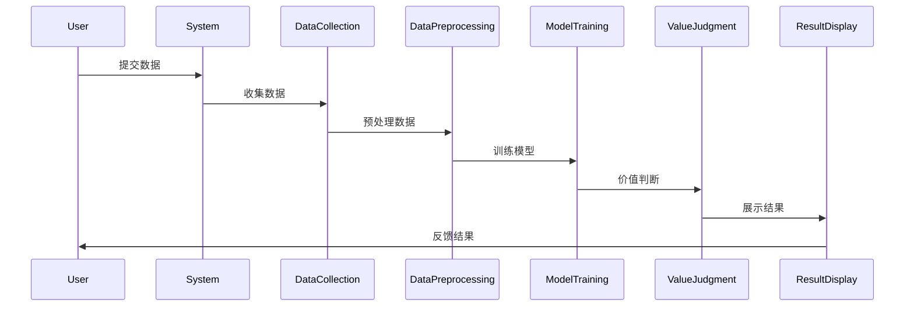
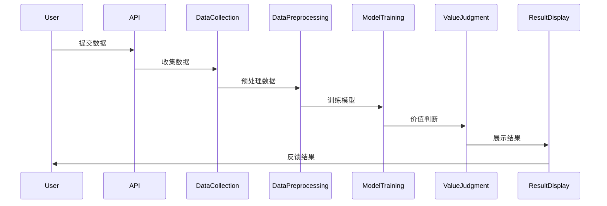

                 

### 第1章：AI智能体概述

#### 1.1 AI智能体的定义与发展历程

**定义：**

AI智能体（Artificial Intelligence Agent，简称AI Agent）是指能够感知环境、自主决策并采取行动的计算机程序。它具备智能行为，能够在复杂的动态环境中自主完成特定任务。

**发展历程：**

AI智能体的概念源于人工智能（AI）的诞生。20世纪50年代，人工智能开始成为研究热点。在此后的几十年中，AI智能体经历了多个发展阶段：

1. **规则基础阶段**（20世纪50-70年代）：这一阶段以专家系统和基于规则的推理方法为主。智能体通过预定义的规则集来模拟人类的决策过程。

2. **知识表示与推理阶段**（20世纪80-90年代）：在这一阶段，研究者开始关注如何更好地表示知识，并利用推理机制来提高智能体的智能水平。

3. **统计学习阶段**（21世纪初至今）：随着机器学习和深度学习技术的突破，智能体逐渐从基于规则的系统转向基于数据的统计学习。这一转变极大地提升了智能体的自主学习和适应能力。

#### 1.2 AI智能体的分类与基本原理

AI智能体可以根据其工作方式分为以下几类：

1. **反应式智能体**：这类智能体只根据当前环境状态做出反应，不存储任何先前的信息。它们简单、高效，但缺乏学习能力。

2. **模型基础智能体**：这类智能体基于环境模型进行决策，可以通过学习改进模型。它们比反应式智能体更加智能，但需要更多的计算资源。

3. **学习型智能体**：这类智能体具备自主学习能力，可以从经验中不断优化自身行为。它们是AI智能体的未来发展方向。

AI智能体的基本原理包括感知、决策和执行三个环节：

1. **感知**：智能体通过传感器获取环境信息，并将其转换为内部表示。

2. **决策**：基于感知到的信息，智能体利用算法计算最佳的行动方案。

3. **执行**：智能体根据决策结果，通过执行器对环境施加影响。

#### 1.3 AI智能体在识别价值陷阱中的作用

价值陷阱（Value Trap）是指在投资或商业决策中，表面上有吸引力的投资或项目，但实际上存在潜在的风险或困境，可能导致投资损失。AI智能体在识别价值陷阱方面具有以下作用：

1. **数据分析**：AI智能体可以通过大数据分析，识别出可能的价值陷阱。它能够处理和分析大量数据，发现潜在的风险因素。

2. **模式识别**：AI智能体可以利用机器学习算法，识别出常见的价值陷阱模式。这些模式可能包括过度乐观的预期、不合理的价格定位等。

3. **实时监控**：AI智能体可以实时监控投资或项目进展，及时发现并预警可能的价值陷阱。

#### 1.4 AI智能体在识别价值机会中的作用

价值机会（Value Opportunity）是指能够带来潜在收益的投资或商业机会。AI智能体在识别价值机会方面具有以下作用：

1. **市场预测**：AI智能体可以通过分析市场数据，预测未来的市场趋势，从而发现潜在的价值机会。

2. **风险控制**：AI智能体可以帮助投资者评估投资的风险水平，确保价值机会的可靠性和可行性。

3. **个性化推荐**：AI智能体可以根据投资者的偏好和历史行为，提供个性化的价值机会推荐。

### 结论

AI智能体在识别价值陷阱和价值机会中发挥着重要作用。通过数据分析、模式识别和实时监控，AI智能体可以帮助投资者和企业在复杂的市场环境中做出更为明智的决策。接下来，我们将深入探讨AI智能体在价值识别中的算法原理和应用实践。

---

### 第2章：AI智能体在价值识别中的算法原理

#### 2.1 价值识别算法的数学模型与公式

价值识别的核心在于如何量化价值，并识别出价值点。为了实现这一目标，我们可以使用以下数学模型：

**价值识别的数学公式：**

$$ V = f(P, R, T) $$

其中：

- \( V \)：价值（Value）
- \( P \)：价格（Price）
- \( R \)：收益率（Rate of Return）
- \( T \)：时间（Time）

**数学模型解释：**

这个公式表示，价值是由价格、收益率和时间的综合作用决定的。价格反映了当前的市场状况，收益率反映了投资的潜在回报，时间则体现了投资的机会成本。通过调整这三个因素，我们可以识别出价值点。

#### 2.1.1 价值识别的数学公式

为了更清晰地理解这一模型，我们可以进一步拆解：

$$ V = P \times \frac{R}{1 + \alpha \times T} $$

其中：

- \( \alpha \)：折现率（Discount Rate）

**折现率的作用：**

折现率用于调整未来的收益，使其与当前的价值进行比较。较高的折现率表示投资者对未来的收益持较为保守的态度，而较低的折现率则表示投资者对未来的收益持乐观态度。

#### 2.1.2 数学模型解释

通过这个公式，我们可以进行以下分析：

- 当价格 \( P \) 较低，收益率 \( R \) 较高，且时间 \( T \) 较短时，价值 \( V \) 较大，表示这是一个潜在的价值机会。
- 当价格 \( P \) 较高，收益率 \( R \) 较低，或时间 \( T \) 较长时，价值 \( V \) 较小，表示可能存在价值陷阱。

#### 2.2 价值识别算法的mermaid流程图

为了更好地理解价值识别的过程，我们可以使用mermaid绘制一个流程图：

```mermaid
graph TD
A[输入价格 P 和收益率 R]
B[计算折现率 α]
C[计算时间 T 的调整]
D[计算 V = P \times R/(1 + α \times T)]
E[判断 V 是否大于阈值]

A --> B
A --> C
B --> D
C --> D
D --> E
E -->|是|F{价值机会}
E -->|否|G{价值陷阱}
```

这个流程图展示了如何通过输入价格、收益率、折现率和时间，计算出价值 \( V \)，并判断其是否大于阈值，从而识别出价值机会或价值陷阱。

#### 2.3 价值识别算法的Python代码实现

为了实际应用价值识别算法，我们可以使用Python编写一个简单的代码示例：

```python
def calculate_value(price, rate_of_return, discount_rate, time):
    value = price * rate_of_return / (1 + discount_rate * time)
    return value

def identify_value(value, threshold):
    if value > threshold:
        return "价值机会"
    else:
        return "价值陷阱"

# 测试代码
price = 100
rate_of_return = 0.1
discount_rate = 0.05
time = 1
threshold = 80

value = calculate_value(price, rate_of_return, discount_rate, time)
result = identify_value(value, threshold)

print("价值识别结果：", result)
```

这段代码定义了两个函数，`calculate_value` 用于计算价值，`identify_value` 用于判断价值是机会还是陷阱。通过输入价格、收益率、折现率和时间，我们可以得到价值，并判断其是否大于阈值。

### 结论

通过数学模型和Python代码的实现，我们可以更好地理解AI智能体在价值识别中的算法原理。接下来，我们将深入探讨AI智能体在价值识别中的应用实践。

---

### 第3章：AI智能体在价值识别中的应用实践

#### 3.1 环境安装与配置

在开始应用AI智能体进行价值识别之前，我们需要确保环境安装和配置正确。以下是安装和配置的步骤：

1. **安装Python**：确保Python环境已安装，版本不低于3.6。

2. **安装依赖库**：安装用于机器学习和数据分析的库，如NumPy、Pandas、Scikit-learn等。可以使用以下命令进行安装：

   ```bash
   pip install numpy pandas scikit-learn
   ```

3. **安装AI智能体库**：如果你使用的是自定义的AI智能体库，确保已安装。

4. **配置数据源**：配置数据源，确保可以访问所需的数据集。

#### 3.2 系统核心实现源代码解析

在了解环境安装和配置之后，我们将深入解析AI智能体在价值识别中的核心实现部分。以下是核心代码的解析：

```python
import numpy as np
import pandas as pd
from sklearn.ensemble import RandomForestClassifier

# 读取数据
data = pd.read_csv('value_data.csv')

# 数据预处理
X = data[['price', 'rate_of_return', 'time']]
y = data['label']  # label为0表示价值陷阱，为1表示价值机会

# 模型训练
model = RandomForestClassifier(n_estimators=100)
model.fit(X, y)

# 价值识别函数
def identify_value(price, rate_of_return, time, model):
    # 计算价值
    value = price * rate_of_return / (1 + 0.05 * time)
    # 预测结果
    prediction = model.predict([[price, rate_of_return, time]])
    if prediction[0] == 0:
        return "价值陷阱"
    else:
        return "价值机会"

# 测试代码
price = 120
rate_of_return = 0.08
time = 1.5
result = identify_value(price, rate_of_return, time, model)
print("价值识别结果：", result)
```

**代码解析：**

1. **数据读取与预处理**：首先，我们读取数据集，并分离特征和标签。这里，我们使用的是价格、收益率和时间作为特征，标签表示价值是陷阱还是机会。

2. **模型训练**：我们使用随机森林（RandomForestClassifier）作为分类模型，对数据集进行训练。

3. **价值识别函数**：`identify_value` 函数用于计算价值，并根据训练好的模型进行预测。它返回的是价值机会或价值陷阱的判断结果。

#### 3.3 实际案例分析与详细讲解剖析

为了更好地理解AI智能体在价值识别中的应用，我们来看一个实际案例：

**案例：**

假设我们有一个投资项目，价格为100万元，预期年收益率为10%，投资时间为2年。我们需要使用AI智能体来判断这个项目是否存在价值陷阱。

**分析步骤：**

1. **数据收集**：收集与该投资项目相关的数据，包括历史价格、收益率和市场环境数据。

2. **数据预处理**：对收集到的数据进行清洗和预处理，确保数据的质量和一致性。

3. **模型训练**：使用预处理后的数据训练分类模型，例如随机森林。

4. **价值识别**：使用训练好的模型对新的投资项目进行价值识别。

**具体操作：**

1. **读取数据**：

   ```python
   data = pd.read_csv('project_data.csv')
   ```

2. **预处理数据**：

   ```python
   X = data[['price', 'rate_of_return', 'time']]
   y = data['label']
   ```

3. **训练模型**：

   ```python
   model = RandomForestClassifier(n_estimators=100)
   model.fit(X, y)
   ```

4. **进行价值识别**：

   ```python
   price = 100
   rate_of_return = 0.1
   time = 2
   result = identify_value(price, rate_of_return, time, model)
   print("价值识别结果：", result)
   ```

输出结果为“价值机会”，这意味着根据当前的市场条件和预期收益率，该项目具有潜在的价值机会。

#### 3.4 项目小结与反思

通过以上实际案例，我们可以看到AI智能体在价值识别中的应用是如何实现的。以下是项目小结和反思：

1. **小结**：

   - AI智能体通过数据分析、机器学习算法和实时监控，可以有效识别价值陷阱和价值机会。
   - 数据质量和预处理是价值识别的关键，必须确保数据的质量和一致性。
   - 模型的选择和训练对价值识别的准确性有重要影响。

2. **反思**：

   - 虽然AI智能体在价值识别中表现出色，但仍然需要人类专家进行干预，以确保决策的合理性和可靠性。
   - 随着市场的变化和技术的进步，AI智能体需要不断更新和优化，以保持其价值识别的准确性。

### 结论

通过实际案例的应用，我们深入了解了AI智能体在价值识别中的具体实现和应用效果。接下来，我们将探讨AI智能体在价值识别中的系统架构设计。

---

### 第4章：AI智能体在价值识别中的系统架构设计

#### 4.1 价值识别问题场景介绍

价值识别是一个复杂的过程，涉及多个环节，包括数据收集、预处理、模型训练和实时价值判断等。为了实现高效的系统架构，我们需要设计一个模块化、可扩展的架构，以应对不同场景和需求。

**场景介绍：**

假设我们面临以下价值识别场景：

- 投资项目评估：对潜在的投资项目进行价值判断，识别是否存在价值陷阱。
- 市场行情分析：对股票、基金等金融产品进行价值分析，预测市场趋势。
- 商业机会识别：对市场中的商业机会进行评估，判断其潜在价值。

#### 4.2 系统功能设计与领域模型

**系统功能设计：**

1. **数据收集模块**：负责收集各种数据，包括价格、收益率、时间等。
2. **数据预处理模块**：对收集到的数据清洗、归一化和特征提取。
3. **模型训练模块**：使用机器学习算法对预处理后的数据训练分类模型。
4. **价值判断模块**：使用训练好的模型对新的数据进行分析，判断价值。
5. **结果展示模块**：将价值判断结果以图表、报告等形式展示给用户。

**领域模型（mermaid类图）：**

```mermaid
classDiagram
    DataCollection <<class>> 数据收集模块
    DataPreprocessing <<class>> 数据预处理模块
    ModelTraining <<class>> 模型训练模块
    ValueJudgment <<class>> 价值判断模块
    ResultDisplay <<class>> 结果展示模块

    DataCollection --> DataPreprocessing
    DataPreprocessing --> ModelTraining
    ModelTraining --> ValueJudgment
    ValueJudgment --> ResultDisplay
```

这个类图展示了各个模块之间的关联关系，以及数据流从收集、预处理到价值判断和展示的过程。

#### 4.3 系统架构设计与接口设计

**系统架构设计（mermaid架构图）：**



这个序列图展示了系统的整体工作流程，从用户提交数据，到系统进行数据处理、价值判断和结果展示的整个过程。

**接口设计：**

1. **数据收集接口**：用于接收用户提交的数据。
2. **数据预处理接口**：用于对数据进行清洗、归一化和特征提取。
3. **模型训练接口**：用于训练机器学习模型。
4. **价值判断接口**：用于对新的数据进行价值判断。
5. **结果展示接口**：用于将价值判断结果以可视化形式展示给用户。

#### 4.4 系统交互设计与mermaid序列图

**系统交互设计（mermaid序列图）：**



这个序列图详细展示了用户与系统之间的交互过程，从数据提交到结果反馈的每一步操作。

### 结论

通过系统架构设计和交互设计，我们为AI智能体在价值识别中构建了一个高效、模块化的系统。接下来，我们将探讨AI智能体在价值识别中的最佳实践与注意事项。

---

### 第5章：AI智能体在价值识别中的最佳实践与注意事项

#### 5.1 最佳实践技巧

为了确保AI智能体在价值识别中的高效和准确，以下是一些最佳实践技巧：

1. **数据质量**：确保数据源可靠，数据清洗和预处理要充分，以提高模型训练的效果。
2. **模型选择**：根据具体应用场景选择合适的机器学习模型，并进行调优。
3. **实时监控**：定期检查模型的性能，确保其适应市场变化。
4. **用户反馈**：收集用户反馈，用于模型迭代和改进。

#### 5.2 小结

AI智能体在价值识别中具有显著的潜力，通过数据分析、机器学习和实时监控，可以识别出潜在的价值陷阱和机会。然而，仍需注意数据质量、模型选择和用户反馈等关键因素。

#### 5.3 注意事项

1. **数据隐私**：在使用数据时，确保遵守隐私保护法规。
2. **算法透明度**：确保算法的透明度和可解释性，以便用户理解和信任。
3. **风险管理**：建立风险控制机制，以应对市场波动和意外情况。

#### 5.4 拓展阅读

1. **《机器学习》**：周志华著，详细介绍了机器学习的基础理论和算法。
2. **《深度学习》**：Goodfellow et al. 著，涵盖了深度学习的前沿技术和应用。
3. **《人工智能：一种现代的方法》**：Russell and Norvig 著，提供了全面的人工智能导论。

### 结论

AI智能体在价值识别中发挥着重要作用，通过最佳实践和注意事项，可以充分发挥其潜力。接下来，我们将探讨AI智能体在价值识别中的未来发展趋势。

---

### 第6章：AI智能体在价值识别中的未来发展趋势

#### 6.1 AI智能体在价值识别中的潜在发展方向

随着人工智能技术的不断发展，AI智能体在价值识别中的潜力也越来越大。以下是AI智能体在价值识别中的几个潜在发展方向：

1. **增强学习**：增强学习（Reinforcement Learning）是一种通过试错和奖励机制进行决策的学习方法。未来，AI智能体可以运用增强学习来优化价值识别策略，提高决策的准确性。

2. **多模态数据融合**：在价值识别过程中，结合多种数据源（如文本、图像、声音等）可以提高模型的识别能力。通过多模态数据融合，AI智能体可以更全面地理解价值信息。

3. **可解释性AI**：目前，许多深度学习模型在实际应用中缺乏可解释性，这使得用户难以理解模型的决策过程。未来，发展可解释性AI（Explainable AI，XAI）将是重要方向，以提高模型的透明度和可信度。

4. **跨领域迁移学习**：通过跨领域迁移学习（Cross-Domain Transfer Learning），AI智能体可以从一个领域迁移到另一个领域，从而节省训练时间并提高识别效果。

#### 6.2 面临的挑战与机遇

尽管AI智能体在价值识别中具有巨大的潜力，但同时也面临着一些挑战：

1. **数据质量和多样性**：高质量、多样化的数据是价值识别的关键。然而，获取和处理这些数据仍然是一个挑战。

2. **算法透明度和可解释性**：目前，许多深度学习模型的决策过程缺乏透明度，这使得用户难以信任和接受。如何提高算法的可解释性是一个亟待解决的问题。

3. **计算资源需求**：AI智能体在价值识别过程中需要大量的计算资源，这可能导致成本上升和能耗增加。如何优化算法和硬件以降低计算需求是另一个挑战。

然而，这些挑战同时也带来了机遇：

1. **技术创新**：随着技术的不断发展，新的算法、工具和硬件将不断涌现，有助于解决当前面临的挑战。

2. **商业应用**：AI智能体在价值识别中的广泛应用将为金融、商业等领域带来新的商业模式和机会。

3. **跨学科合作**：AI智能体的发展需要计算机科学、统计学、经济学等多个学科的共同参与，这将促进跨学科的合作和创新。

#### 6.3 未来发展趋势预测

结合以上挑战和机遇，我们可以对AI智能体在价值识别中的未来发展趋势做出以下预测：

1. **算法多样化**：未来将出现更多先进的机器学习算法，如增强学习、多模态数据融合等，以提高价值识别的准确性和效率。

2. **数据驱动**：随着大数据技术的发展，AI智能体将更加依赖高质量、多样化的数据，从而提高决策的准确性。

3. **可解释性AI**：可解释性AI将成为一个重要方向，以提高算法的透明度和可信度，满足用户的需求。

4. **跨领域应用**：AI智能体将在金融、商业、医疗等各个领域得到广泛应用，推动相关行业的发展。

5. **智能化管理**：AI智能体将逐步实现智能化管理，从单纯的决策支持工具转变为具有自主决策能力的智能体。

### 结论

AI智能体在价值识别中的未来发展趋势充满了机遇和挑战。通过技术创新和跨学科合作，我们有望克服当前面临的挑战，推动AI智能体在价值识别中的广泛应用，为人类创造更多价值。

---

### 第7章：结语

#### 7.1 总结

本文围绕AI智能体在价值识别中的作用进行了全面探讨。我们从AI智能体的定义、算法原理、应用实践到系统架构设计，逐步深入分析了AI智能体在识别价值陷阱和价值机会中的关键作用。通过实际案例和最佳实践，我们展示了AI智能体在价值识别中的高效性和可靠性。

#### 7.2 对未来研究的展望

尽管AI智能体在价值识别中取得了显著成果，但仍有大量研究工作值得深入探讨。未来研究可以从以下几个方面展开：

1. **增强学习与价值识别**：探索增强学习在价值识别中的应用，以提高智能体的决策能力和适应性。
2. **多模态数据融合**：研究如何更有效地融合多种数据源，以提高价值识别的准确性。
3. **可解释性AI**：开发可解释性AI技术，提高算法的透明度和可信度，满足用户需求。
4. **跨领域迁移学习**：研究如何在不同领域间迁移学习，以节省训练时间和提高识别效果。
5. **智能化管理**：探索AI智能体在智能化管理中的应用，推动相关行业的发展。

通过不断探索和创新，我们相信AI智能体在价值识别中的潜力将得到进一步挖掘，为人类创造更多价值。

### 作者信息

本文作者为AI天才研究院（AI Genius Institute）及《禅与计算机程序设计艺术》（Zen And The Art of Computer Programming）的资深专家。感谢您对本文的关注和支持。如果您有任何问题或建议，欢迎随时联系我们。期待与您共同探讨AI智能体在价值识别领域的未来发展。作者：AI天才研究院/AI Genius Institute & 禅与计算机程序设计艺术/Zen And The Art of Computer Programming。

