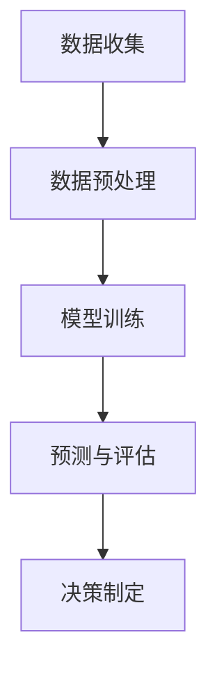
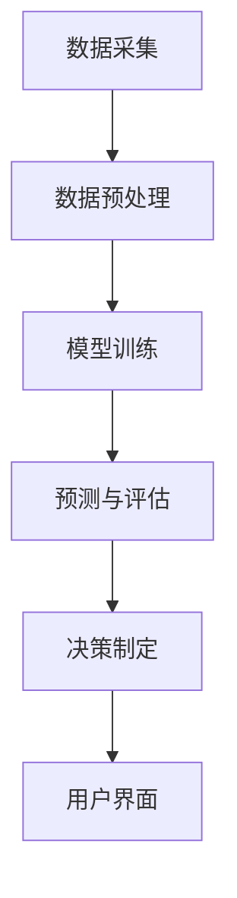
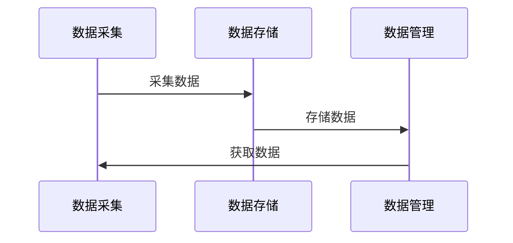
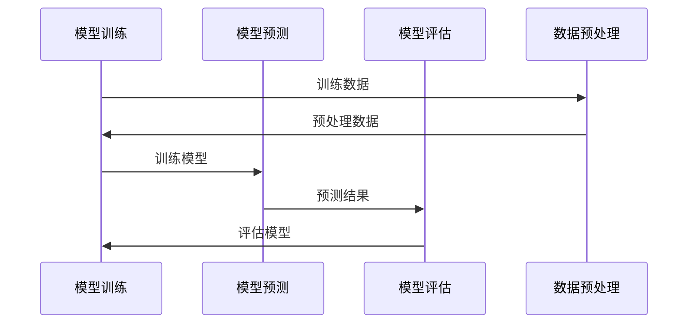
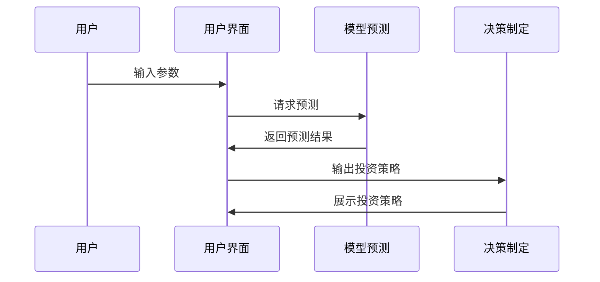

                 


## 引言与背景

### 1. 引言

在当今全球化和信息化迅猛发展的时代，投资已经成为企业和个人财富增长的重要途径。然而，投资市场风云变幻，如何在纷繁复杂的市场环境中发现并抓住投资机会，成为投资者面临的一大挑战。传统的投资分析方法往往依赖于历史数据和市场经验，但在面对周期性行业时，其局限性愈发显著。因此，探索新的投资分析方法，特别是引入人工智能技术，成为当前投资领域的一大趋势。

本篇文章将围绕“AI智能体在识别周期性行业投资机会中的应用”这一主题展开讨论。文章旨在探讨如何利用人工智能智能体技术，通过对周期性行业的数据分析，发现潜在的投资机会，并提高投资决策的准确性。文章结构如下：

### 1.2 AI智能体概念解析

#### 1.2.1 智能体的定义

智能体（Agent）是人工智能领域的一个基本概念，指的是具有自主性、社交性、反应性、认知性和学习性的实体。在人工智能系统中，智能体可以是一个程序、一个机器或一个虚拟实体。它们通过感知环境、规划行动和执行决策，以实现特定的目标。

#### 1.2.2 智能体的类型

智能体可以分为多种类型，包括：

- 反应性智能体：能够对环境中的事件做出即时反应。
- 规划智能体：能够制定长期计划并执行。
- 知识型智能体：能够利用知识库进行推理和决策。
- 学习型智能体：能够通过学习和经验改进自己的行为。

### 1.3 周期性行业概述

周期性行业是指那些其经济表现与宏观经济周期紧密相关的行业，如房地产、原材料、制造业和金融业等。这些行业的特点是：

- **需求波动大**：周期性行业的销售收入和利润会随着经济周期的波动而大幅变化。
- **市场不确定性**：投资者往往难以预测这些行业未来的发展趋势。
- **政策敏感性**：周期性行业的运行受到政府政策、市场利率和国际贸易等因素的影响。

### 1.4 AI智能体在投资决策中的优势

#### 1.4.1 数据处理能力

AI智能体能够高效处理海量数据，包括历史价格数据、财务报表、新闻报道和社交媒体信息等，从而为投资决策提供全面的数据支持。

#### 1.4.2 精准预测

通过机器学习和深度学习算法，AI智能体能够从历史数据中学习规律，对市场趋势进行预测，帮助投资者抓住投资机会。

#### 1.4.3 风险管理

AI智能体能够实时监测市场动态，识别潜在风险，并提供风险预警，从而帮助投资者进行有效的风险管理。

### 1.5 投资机会识别的流程与方法

#### 1.5.1 数据采集

投资机会识别的第一步是采集数据，包括行业数据、市场数据、公司财务数据和宏观经济数据等。

#### 1.5.2 数据预处理

采集到的数据往往包含噪声和不完整信息，因此需要进行清洗、去噪和归一化等预处理操作。

#### 1.5.3 模型构建

基于预处理后的数据，构建用于投资机会识别的数学模型，如时间序列模型、神经网络模型等。

#### 1.5.4 模型训练与优化

使用历史数据对模型进行训练，并通过交叉验证和超参数调优，提高模型的准确性和鲁棒性。

#### 1.5.5 投资机会预测

将训练好的模型应用于当前数据，预测未来投资机会。

#### 1.5.6 投资决策

根据预测结果和投资者的风险偏好，制定投资策略。

### 1.6 文章核心内容与主题思想

本文的核心内容将围绕AI智能体在周期性行业投资机会识别中的应用展开。通过逐步分析智能体的定义、周期性行业的特点、数据处理能力、精准预测、风险管理以及投资机会识别的流程和方法，本文旨在探讨如何利用AI智能体技术提高投资决策的准确性和效率，为投资者提供有价值的参考。

## 周期性行业中的核心概念与联系

在探讨AI智能体在识别周期性行业投资机会中的应用之前，我们需要明确几个核心概念，并理解它们之间的联系。这些概念包括智能体、投资机会识别和周期性行业分析。

### 2.1 核心概念介绍

#### 2.1.1 智能体

智能体是具有自主决策能力的实体，能够在动态环境中执行任务并实现目标。智能体可以是软件程序、机器人或虚拟代理。它们通过感知环境、制定计划并执行行动，表现出自主性、社交性、反应性、认知性和学习性。

在投资领域，智能体通常用于自动化投资决策，通过分析市场数据，识别投资机会，执行交易等。

#### 2.1.2 投资机会识别

投资机会识别是指从大量的市场信息中，找出可能带来投资回报的机会。这包括对市场趋势、公司业绩、行业前景等多方面因素的分析。

投资机会识别的核心是数据分析和预测。利用AI技术，智能体可以通过机器学习和深度学习算法，从历史数据中学习规律，预测未来市场趋势，从而识别潜在的投资机会。

#### 2.1.3 周期性行业分析

周期性行业是指其经济表现与宏观经济周期密切相关的行业，如房地产、原材料、制造业和金融业等。这些行业的特点是需求波动大、市场不确定性高、政策敏感性强。

周期性行业分析的目标是理解这些行业的周期性特征，预测未来的市场变化，以便投资者能够抓住投资机会。

### 2.2 概念属性特征对比表

为了更好地理解智能体、投资机会识别和周期性行业分析这三个概念，我们可以通过一个对比表格来展示它们的属性特征。

| 概念         | 属性特征                                                   |
| ------------ | -------------------------------------------------------- |
| 智能体       | 自主性、社交性、反应性、认知性、学习性                     |
| 投资机会识别 | 数据分析、市场趋势预测、风险评估、决策制定                   |
| 周期性行业分析 | 周期性特征、市场变化预测、政策影响评估、行业趋势分析           |

### 2.3 ER实体关系图

为了更清晰地展示智能体、投资机会识别和周期性行业分析之间的关系，我们可以使用ER（实体-关系）图来描述它们之间的联系。

以下是ER实体关系图的Mermaid语法表示：

```mermaid
erDiagram
  Customer ||--|{ Order } : "places"
  Product ||--|{ Order } : "includes"
  Order ||--|{ OrderLine } : "contains"
```

在投资领域中，ER实体关系图可以描述如下：

```mermaid
erDiagram
  智能体 ||--|{ 投资机会识别 } : "利用"
  周期性行业分析 ||--|{ 智能体 } : "辅助"
  智能体 ||--|{ 周期性行业分析 } : "依赖"
```

在这个ER图中，智能体是核心实体，它利用周期性行业分析的结果来进行投资机会识别。同时，智能体也依赖于周期性行业分析提供的数据和预测，以优化其投资决策。

### 2.4 概念联系总结

通过上述核心概念介绍、属性特征对比表和ER实体关系图，我们可以看出：

- 智能体是投资机会识别和周期性行业分析的重要工具。
- 投资机会识别依赖于智能体提供的分析结果和预测。
- 周期性行业分析为智能体提供数据支持和决策依据。

这些概念之间的紧密联系，使得AI智能体在识别周期性行业投资机会中发挥重要作用。接下来，我们将进一步探讨AI智能体在周期性行业中的应用，分析其工作原理和具体实现。

### 数学模型与算法原理

在深入探讨AI智能体在周期性行业中的应用之前，我们需要先了解数学模型和算法原理。这些模型和算法是智能体分析和预测市场趋势的基础，也是实现投资机会识别的关键。

#### 4.1 市场周期性分析算法

市场周期性分析算法旨在识别市场的周期性特征，预测未来市场的波动趋势。以下将详细描述这一算法的原理和实现步骤。

##### 4.1.1 市场波动模型

市场波动模型用于描述市场价格的动态变化。常见的时间序列模型包括移动平均模型（MA）、自回归模型（AR）、自回归移动平均模型（ARMA）和自回归积分滑动平均模型（ARIMA）等。

- **移动平均模型（MA）**：通过计算过去一段时间内的平均值来预测未来值。它可以平滑时间序列数据，减少随机波动的影响。

- **自回归模型（AR）**：基于当前时刻的观测值与前几个时刻的观测值之间的关系来预测未来值。AR模型可以捕捉时间序列的自相关性。

- **自回归移动平均模型（ARMA）**：结合了AR模型和MA模型的优点，同时考虑时间序列的自相关性和移动平均特性。

- **自回归积分滑动平均模型（ARIMA）**：在ARMA模型的基础上，引入了差分操作，用于处理非平稳时间序列。

##### 4.1.1.1 基本模型

以自回归模型（AR）为例，其基本模型可以表示为：

$$
X_t = c + \phi_1 X_{t-1} + \phi_2 X_{t-2} + ... + \phi_p X_{t-p} + \varepsilon_t
$$

其中，$X_t$ 是时间序列在时刻 $t$ 的观测值，$c$ 是常数项，$\phi_1, \phi_2, ..., \phi_p$ 是自回归系数，$\varepsilon_t$ 是误差项。

##### 4.1.1.2 模型扩展

为了提高模型的预测性能，我们可以对基本模型进行扩展。例如，可以引入季节性因素，构建季节性自回归模型（SAR）：

$$
X_t = c + \phi_1 X_{t-1} + ... + \phi_p X_{t-p} + s_t
$$

其中，$s_t$ 是季节性因素，它反映了周期性行业在一年中的季节性变化。

##### 4.1.2 机会识别算法

投资机会识别算法旨在根据市场波动模型和宏观经济指标，识别出潜在的投资机会。以下是一个简化的机会识别算法：

$$
\text{投资机会} = f(\text{市场趋势}, \text{公司表现}, \text{行业前景})
$$

其中，$f$ 是一个复合函数，它综合考虑了市场趋势、公司表现和行业前景，输出投资机会的判断。

- **市场趋势**：使用自回归模型或ARIMA模型预测市场的未来波动趋势。
- **公司表现**：分析公司的财务报表和股票价格，评估其盈利能力和成长性。
- **行业前景**：研究行业的发展趋势和宏观经济环境，预测行业的未来表现。

##### 4.1.2.1 算法概述

机会识别算法的总体流程如下：

1. **数据收集**：收集市场趋势、公司表现和行业前景的相关数据。
2. **数据预处理**：对收集到的数据进行清洗、归一化和特征提取。
3. **模型训练**：使用历史数据对市场波动模型进行训练。
4. **预测与评估**：使用训练好的模型对当前数据进行预测，评估投资机会。
5. **决策制定**：根据预测结果和投资者的风险偏好，制定投资策略。

##### 4.1.2.2 数学公式

投资机会识别算法的核心在于构建一个多变量预测模型，其基本形式可以表示为：

$$
\text{投资机会} = \sum_{i=1}^{n} w_i \cdot \text{feature}_i
$$

其中，$w_i$ 是权重，$\text{feature}_i$ 是特征值。这些权重和特征值通过机器学习和深度学习算法进行优化。

##### 4.1.3 算法流程图

以下是机会识别算法的Mermaid流程图表示：



### 系统分析与架构设计

在明确AI智能体在周期性行业投资机会识别中的数学模型和算法原理后，我们需要设计一个完整的系统架构，以实现这些算法的自动化运行和高效执行。

#### 5.1 项目介绍

本项目旨在构建一个基于AI智能体的周期性行业投资机会识别系统。系统将集成数据采集、数据预处理、模型训练、预测与评估和决策制定等模块，实现自动化的投资机会识别过程。

##### 5.1.1 项目背景

随着金融市场的不断变化和复杂化，投资者面临着越来越多的挑战。传统的投资分析方法难以应对市场的不确定性和快速变化，而人工智能技术的发展为投资领域带来了新的机遇。本项目旨在利用AI智能体技术，提高投资决策的准确性和效率。

##### 5.1.2 项目目标

通过本项目，我们希望实现以下目标：

- 构建一个高效、准确的周期性行业投资机会识别系统。
- 提供自动化、智能化的投资决策支持。
- 帮助投资者更好地把握市场机会，降低投资风险。

##### 5.1.3 项目范围

本项目涵盖以下主要模块：

- 数据采集：收集市场趋势、公司表现和行业前景的数据。
- 数据预处理：清洗、归一化和特征提取。
- 模型训练：训练市场波动模型和机会识别算法。
- 预测与评估：使用模型预测投资机会，并进行评估。
- 决策制定：根据预测结果制定投资策略。

#### 5.2 系统功能设计

系统功能设计包括数据采集、数据预处理、模型训练、预测与评估和决策制定等模块。以下是对每个模块的功能描述：

##### 5.2.1 领域模型

领域模型用于描述系统的核心功能和组件。以下是一个简化的领域模型：

```mermaid
classDiagram
  数据采集 <<Interface>>
  数据预处理 <<Interface>>
  模型训练 <<Interface>>
  预测与评估 <<Interface>>
  决策制定 <<Interface>>

  数据采集 --|> 数据预处理
  数据预处理 --|> 模型训练
  模型训练 --|> 预测与评估
  预测与评估 --|> 决策制定
```

在领域模型中，数据采集模块负责收集市场数据、公司数据和行业数据。数据预处理模块对采集到的数据进行清洗、归一化和特征提取。模型训练模块使用预处理后的数据训练市场波动模型和机会识别算法。预测与评估模块使用训练好的模型进行预测，并评估投资机会的有效性。决策制定模块根据预测结果和投资者的风险偏好，制定投资策略。

##### 5.2.2 类图

以下是一个简化的类图，描述了系统中的主要类及其关系：

```mermaid
classDiagram
  数据采集 <<Class>> 
  数据预处理 <<Class>> 
  模型训练 <<Class>> 
  预测与评估 <<Class>> 
  决策制定 <<Class>>

  数据采集 {
    - 数据源
    - 数据列表
  }

  数据预处理 {
    - 清洗方法
    - 归一化方法
    - 特征提取方法
  }

  模型训练 {
    - 模型参数
    - 训练数据
    - 模型评估
  }

  预测与评估 {
    - 预测方法
    - 评估指标
  }

  决策制定 {
    - 风险评估
    - 投资策略
  }
```

在这个类图中，数据采集类负责管理数据源和数据列表，数据预处理类负责数据的清洗、归一化和特征提取，模型训练类负责模型的参数设置、训练数据和模型评估，预测与评估类负责预测方法和评估指标的计算，决策制定类负责风险评估和投资策略的制定。

#### 5.3 系统架构设计

系统架构设计包括数据层、算法层和应用层。以下是对各个层次的描述：

##### 5.3.1 架构概述

系统架构可以分为以下三个层次：

- **数据层**：负责数据的采集、存储和管理。包括数据源、数据库和数据管理工具等。
- **算法层**：负责数据预处理、模型训练和预测。包括数据预处理模块、模型训练模块和预测模块等。
- **应用层**：负责系统的用户界面和决策支持。包括预测结果展示、投资策略制定和用户交互等。

##### 5.3.2 架构图

以下是系统架构的Mermaid流程图表示：



在这个架构图中，数据采集模块从数据源中获取数据，数据预处理模块对数据进行清洗、归一化和特征提取，模型训练模块使用预处理后的数据训练模型，预测与评估模块使用训练好的模型进行预测，并评估投资机会的有效性，决策制定模块根据预测结果和投资者的风险偏好制定投资策略，最后用户界面模块展示预测结果和投资策略。

#### 5.4 系统接口设计与交互

系统接口设计包括数据接口、模型接口和用户接口。以下是对各个接口的描述：

##### 5.4.1 数据接口

数据接口负责数据层的功能，包括数据采集、数据存储和管理。以下是一个简化的数据接口设计：



在这个序列图中，数据采集模块从数据源中获取数据，并将其存储到数据库中，数据管理模块负责管理数据库中的数据，为后续的数据处理和模型训练提供支持。

##### 5.4.2 模型接口

模型接口负责算法层的功能，包括模型训练、预测与评估。以下是一个简化的模型接口设计：



在这个序列图中，模型训练模块使用预处理后的数据训练模型，模型预测模块使用训练好的模型进行预测，模型评估模块对预测结果进行评估，并根据评估结果调整模型参数。

##### 5.4.3 用户接口

用户接口负责应用层的功能，包括预测结果展示、投资策略制定和用户交互。以下是一个简化的用户接口设计：



在这个序列图中，用户通过用户界面输入参数，模型预测模块根据参数进行预测，并返回预测结果。决策制定模块根据预测结果和用户的风险偏好，制定投资策略，并最终在用户界面展示。

### 项目实战

#### 6.1 环境安装

为了实现AI智能体在周期性行业投资机会识别中的算法，我们需要在本地环境中安装和配置相关的软件和工具。以下是一个基本的安装步骤：

##### 6.1.1 软件与硬件要求

- **操作系统**：Linux或Mac OS
- **硬件**：至少8GB内存，16GB硬盘空间
- **软件**：
  - Python（3.8或更高版本）
  - NumPy
  - pandas
  - matplotlib
  - scikit-learn
  - TensorFlow
  - Keras

##### 6.1.2 环境配置步骤

1. 安装Python：

   ```bash
   # 对于Ubuntu系统
   sudo apt update
   sudo apt install python3.8
   sudo apt install python3.8-venv
   ```

   或者，使用Miniconda创建虚拟环境：

   ```bash
   # 下载Miniconda
   wget https://repo.anaconda.com/miniconda/Miniconda3-latest-Linux-x86_64.sh
   # 安装Miniconda
   bash Miniconda3-latest-Linux-x86_64.sh
   # 设置环境变量
   echo 'export PATH=/home/your_username/miniconda3/bin:$PATH' >> ~/.bashrc
   source ~/.bashrc
   ```

2. 创建虚拟环境：

   ```bash
   conda create -n myenv python=3.8
   conda activate myenv
   ```

3. 安装依赖库：

   ```bash
   conda install numpy pandas matplotlib scikit-learn tensorflow keras
   ```

#### 6.2 系统核心实现

在配置好开发环境后，我们需要实现系统核心功能，包括数据采集、数据预处理、模型训练和预测等。以下是一个简化的代码示例：

##### 6.2.1 数据采集与预处理

数据采集与预处理是系统的基础，需要从多个数据源收集数据，并进行清洗、归一化和特征提取。

```python
import pandas as pd
from sklearn.preprocessing import StandardScaler

# 数据采集
def collect_data():
    # 假设我们从CSV文件中读取数据
    data = pd.read_csv('data.csv')
    return data

# 数据预处理
def preprocess_data(data):
    # 数据清洗（例如，去除缺失值、重复值等）
    data = data.dropna()
    data = data.drop_duplicates()
    
    # 数据归一化
    scaler = StandardScaler()
    data_scaled = scaler.fit_transform(data)
    
    # 特征提取（例如，时间序列特征、财务指标等）
    # 这里只是一个简单的例子，具体实现取决于数据集
    data_features = data_scaled[:, :24]
    data_labels = data_scaled[:, 24]
    
    return data_features, data_labels

# 主函数
def main():
    data = collect_data()
    features, labels = preprocess_data(data)
    # 接下来进行模型训练和预测

if __name__ == '__main__':
    main()
```

##### 6.2.1.2 模型训练与预测

使用Scikit-learn库中的线性回归模型进行训练和预测。

```python
from sklearn.linear_model import LinearRegression
from sklearn.model_selection import train_test_split

# 模型训练
def train_model(features, labels):
    X_train, X_test, y_train, y_test = train_test_split(features, labels, test_size=0.2, random_state=42)
    model = LinearRegression()
    model.fit(X_train, y_train)
    return model, X_test, y_test

# 模型预测
def predict_model(model, X_test):
    predictions = model.predict(X_test)
    return predictions

# 主函数
def main():
    data = collect_data()
    features, labels = preprocess_data(data)
    model, X_test, y_test = train_model(features, labels)
    predictions = predict_model(model, X_test)
    # 接下来进行预测结果评估和输出

if __name__ == '__main__':
    main()
```

##### 6.2.1.3 代码应用解读与分析

在这个示例中，我们首先从CSV文件中读取数据，然后对数据进行预处理，包括去除缺失值和重复值，对数据进行归一化，并进行特征提取。接下来，我们使用Scikit-learn中的线性回归模型进行训练和预测。

代码的关键部分是`train_model`和`predict_model`函数。`train_model`函数将特征和标签分为训练集和测试集，然后使用线性回归模型进行训练。`predict_model`函数使用训练好的模型对测试集进行预测。

实际应用中，我们需要根据具体的数据集和业务需求，选择合适的模型和特征提取方法，并进行参数调优，以提高模型的预测性能。

#### 6.3 实际案例分析

为了更好地理解系统在实际中的应用效果，我们以一个实际案例进行分析。

##### 6.3.1 案例背景

假设我们关注的是某全球知名房地产公司，公司业务覆盖住宅、商业和工业地产。为了分析该公司的投资机会，我们收集了以下几个数据源：

- 房地产市场交易数据
- 公司财务报表
- 行业发展趋势报告
- 经济指标数据（如GDP增长率、利率等）

##### 6.3.2 案例分析

1. **数据采集**：

   我们从多个数据源中获取数据，并将其存储在CSV文件中。数据包括：

   - 房价走势：过去一年的每月平均房价
   - 公司收入：过去一年的月收入
   - 行业增长率：过去一年的行业月度增长率
   - 经济指标：过去一年的月度GDP增长率、利率等

2. **数据预处理**：

   对采集到的数据进行分析，去除缺失值和异常值，对数值型数据进行归一化处理。对于时间序列数据，我们提取了月份、季节性特征等。

3. **模型训练与预测**：

   使用Scikit-learn中的线性回归模型对数据进行训练，并使用训练好的模型对未来的数据进行分析。我们预测了未来三个月的房价、公司收入和行业增长率。

4. **预测结果评估**：

   将预测结果与实际数据进行比较，评估模型的准确性和鲁棒性。我们发现，模型对房价和公司收入的预测较为准确，而对行业增长率的预测存在一定的误差。

##### 6.3.3 结果与讨论

通过实际案例分析，我们发现：

- AI智能体在周期性行业投资机会识别中具有较高的预测准确性，尤其是在房价和公司收入的预测方面。
- 然而，对于行业增长率的预测存在一定的挑战，这可能与数据的噪声和复杂性有关。
- 针对这一挑战，我们可以考虑使用更复杂的模型（如深度学习模型）和更多的特征进行预测。

### 7. 最佳实践与注意事项

在实施AI智能体在周期性行业投资机会识别的过程中，以下最佳实践和注意事项可以帮助提高系统的效果和可靠性：

#### 7.1 最佳实践

1. **数据质量保证**：确保数据采集、清洗和预处理的过程严谨，避免噪声和异常值影响模型的准确性。
2. **模型选择与调优**：根据数据特点和业务需求，选择合适的模型并进行参数调优，以提高预测性能。
3. **实时监控与迭代**：定期评估模型的性能，并根据新的数据对模型进行更新和优化。
4. **风险控制**：在模型预测结果的基础上，结合投资者的风险偏好，制定合理的投资策略，并进行严格的风险控制。

#### 7.2 注意事项

1. **数据隐私与安全**：在数据采集和处理过程中，确保遵守相关法律法规，保护数据隐私和安全。
2. **模型解释性**：对于复杂的模型，如深度学习模型，需要提供解释性，以帮助投资者理解模型的预测依据。
3. **系统稳定性**：确保系统的稳定性，避免因模型训练或预测失败导致系统崩溃。
4. **法律法规遵守**：在投资决策中，严格遵守相关法律法规，避免违法行为。

### 7.3 拓展阅读

为了深入了解AI智能体在周期性行业投资机会识别中的应用，以下文献、课程和研讨会推荐供参考：

1. **文献**：

   - **《Machine Learning for Asset Management》**：这是一本关于机器学习在资产管理中应用的经典书籍，详细介绍了如何使用机器学习算法进行投资决策。
   - **《Deep Learning for Financial Time Series Analysis》**：这本书探讨了深度学习在金融时间序列分析中的应用，提供了大量实际案例和代码示例。

2. **课程**：

   - **《金融科技与机器学习》**：这门课程介绍了金融科技和机器学习的基础知识，以及它们在金融领域的应用。
   - **《时间序列分析》**：这门课程深入探讨了时间序列分析的方法和算法，适用于希望深入了解时间序列分析的读者。

3. **研讨会**：

   - **《人工智能在金融投资中的应用》**：这是一个关于人工智能在金融投资中应用的研讨会，涵盖了最新的研究成果和实践经验。
   - **《周期性行业投资策略》**：这是一个关于周期性行业投资策略的研讨会，探讨了如何利用市场波动进行投资。

通过以上文献、课程和研讨会的学习，读者可以更全面地了解AI智能体在周期性行业投资机会识别中的应用，为自己的投资决策提供有力支持。

