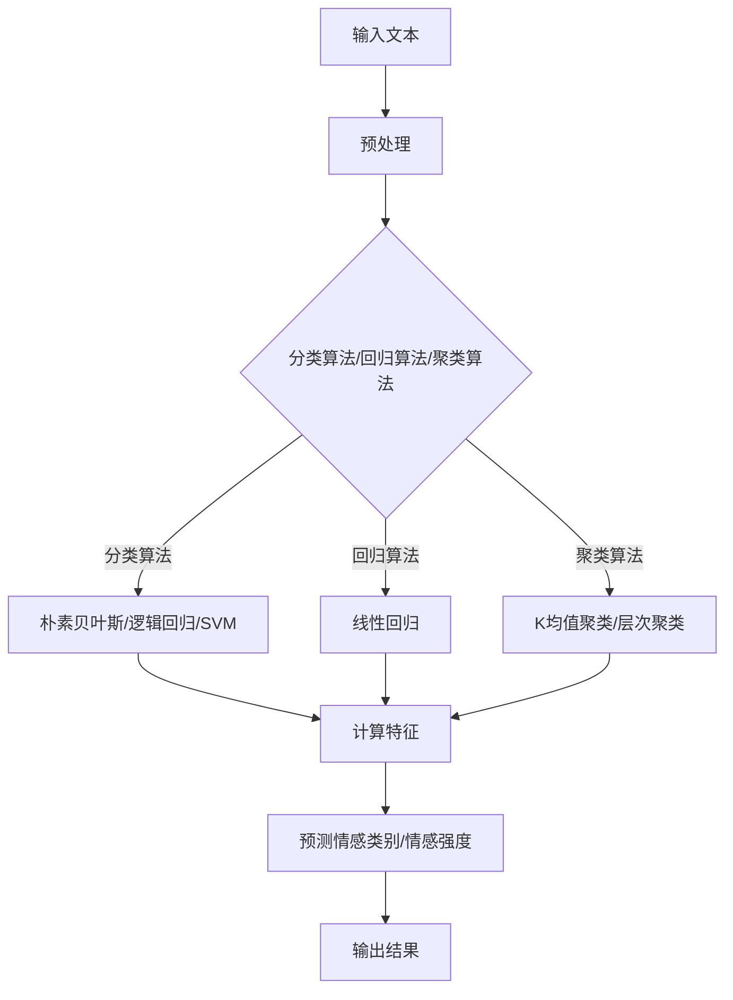
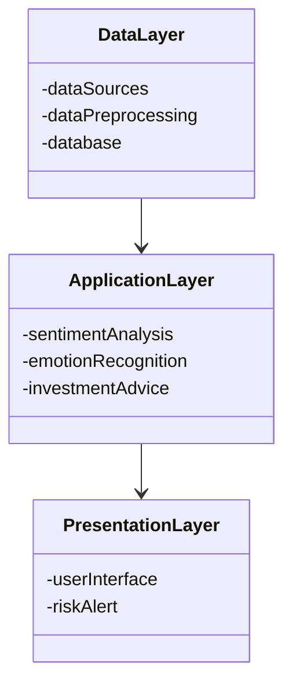
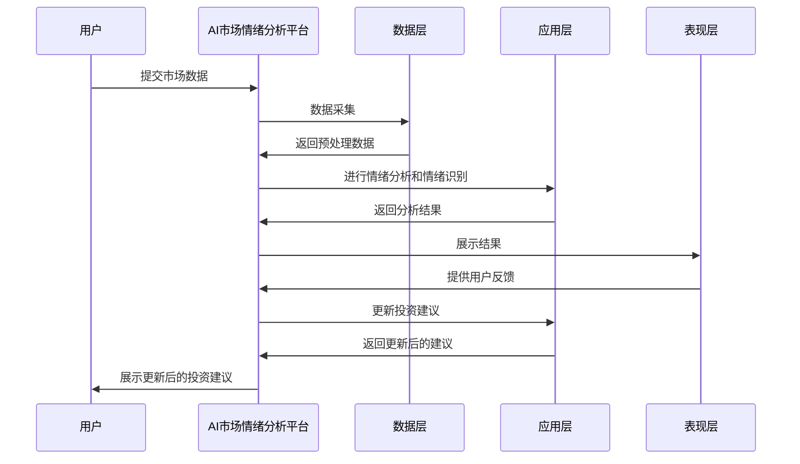
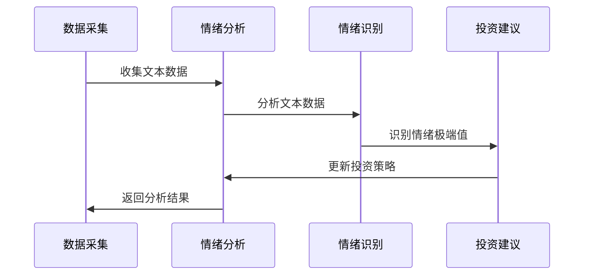

                 

### 引言

#### AI智能体的概念与分类

AI智能体（Artificial Intelligence Agents）是指具备自主决策能力和执行任务能力的计算机程序。它们能够在复杂环境中，通过感知、理解和响应，实现特定的目标。AI智能体通常分为以下几类：

1. **基于规则的智能体**：这类智能体通过预定义的规则集来做出决策。例如，一个自动化的股票交易系统可以根据预定的交易规则进行买卖操作。
2. **基于模型的智能体**：这类智能体通过机器学习模型来学习和预测环境中的变化，并做出相应的决策。例如，深度学习模型可以用于预测股票价格趋势。
3. **基于代理的智能体**：这类智能体通过模仿人类行为和决策过程来实现目标。例如，游戏AI可以通过学习和优化策略来战胜人类玩家。

#### 极端市场情绪识别的重要性

市场情绪是指市场参与者在交易过程中的心理状态和态度。极端市场情绪值则是指市场中情绪极度高涨或极度低落的状态。识别这些极端值对于金融市场具有重要意义：

1. **风险控制**：通过识别极端市场情绪值，投资者可以及时调整投资策略，降低潜在风险。
2. **投资机会**：极端市场情绪往往伴随着市场转折点，投资者可以通过分析这些情绪值来捕捉投资机会。
3. **政策制定**：政府和监管机构可以利用这些数据来监测市场稳定性，并制定相应的政策。

#### 摘要

本文将深入探讨AI智能体在识别市场情绪极端值中的应用。首先，我们将介绍AI智能体的基本概念和分类，以及市场情绪和极端市场情绪值的相关知识。接着，我们将分析AI智能体与市场情绪分析的内在联系，并介绍相关的算法和模型。最后，通过实际项目案例，我们将展示如何使用AI智能体来识别市场情绪极端值，并提供相关最佳实践和未来研究方向。

### 文章关键词

- AI智能体
- 市场情绪识别
- 极端值分析
- 机器学习算法
- 深度学习模型
- 数据预处理
- 金融市场分析

### 摘要

本文的核心内容和主题思想在于探讨AI智能体在识别市场情绪极端值中的重要作用。文章首先介绍了AI智能体的基本概念、分类及其在金融市场中的应用，接着阐述了市场情绪及其极端值的重要性。随后，我们分析了AI智能体与市场情绪分析的内在联系，并介绍了相关算法和模型。通过实际项目案例，文章展示了如何使用AI智能体来识别市场情绪极端值，并提供了相关的最佳实践和未来研究方向。本文旨在为读者提供全面的技术分析和实际应用指导，帮助他们在金融市场中更好地利用AI智能体进行情绪分析和决策。

## 第一章：AI智能体的概述

### 1.1 AI智能体的定义和分类

AI智能体是指具有自主决策能力和执行任务能力的计算机程序。它们可以模拟人类的行为和思维，通过感知环境、理解和响应信息，实现特定的目标。AI智能体在计算机科学和人工智能领域具有重要意义，广泛应用于游戏、机器人、金融、医疗等多个领域。

根据不同的分类标准，AI智能体可以划分为多种类型：

1. **基于规则的智能体**：这类智能体通过预定义的规则集来做出决策。它们基于条件-动作规则，当满足特定条件时，执行相应的动作。例如，自动化的股票交易系统可以根据预定的交易规则进行买卖操作。

2. **基于模型的智能体**：这类智能体通过机器学习模型来学习和预测环境中的变化，并做出相应的决策。它们使用大量的历史数据来训练模型，并通过模型来预测未来的趋势。例如，深度学习模型可以用于预测股票价格趋势。

3. **基于代理的智能体**：这类智能体通过模仿人类行为和决策过程来实现目标。它们通过学习人类的决策过程，并在类似的情境下做出类似的决策。例如，游戏AI可以通过学习和优化策略来战胜人类玩家。

4. **基于行为的智能体**：这类智能体通过直接观察环境，并基于环境中的反馈来做出决策。它们不需要预先定义的规则或模型，而是通过不断调整行为来适应环境。例如，自动驾驶汽车通过感知周围环境，并实时调整行驶路径。

### 1.2 AI智能体的历史发展与现状

AI智能体的概念最早可以追溯到20世纪50年代。当时，人工智能（AI）刚刚兴起，学者们开始探索如何使计算机具备类似人类的智能。1956年，达特茅斯会议上提出了“人工智能”这一术语，标志着AI领域的正式诞生。

在早期，AI智能体的研究和应用主要集中在规则推理和知识表示上。这一时期的代表工作包括专家系统（Expert Systems）和知识图谱（Knowledge Graphs）。专家系统通过模拟专家的决策过程，实现了在特定领域内的智能推理。知识图谱则通过结构化的知识表示，使计算机能够更好地理解和处理信息。

随着计算机性能的不断提高和大数据技术的发展，AI智能体逐渐从基于规则的系统向基于模型的系统转变。这一转变始于20世纪80年代，当时神经网络（Neural Networks）的研究取得了突破性进展。神经网络通过模拟人脑神经元的工作原理，实现了对复杂问题的建模和预测。

进入21世纪，深度学习（Deep Learning）的兴起再次推动了AI智能体的发展。深度学习模型具有自动特征提取和层次化结构，能够在没有人工干预的情况下，从大量数据中学习到具有强泛化能力的知识。这一技术为AI智能体在各个领域的应用提供了新的可能性。

目前，AI智能体在多个领域得到了广泛应用，包括金融、医疗、零售、制造等。在金融领域，AI智能体被用于股票交易、风险管理、信用评分等方面。例如，基于深度学习模型的股票预测系统可以分析大量市场数据，预测股票价格的走势，帮助投资者做出更好的决策。

### 1.3 AI智能体在金融市场中的作用

金融市场是AI智能体应用的重要领域之一。AI智能体通过分析市场数据，预测市场走势，提供投资建议，为投资者带来潜在收益。以下是AI智能体在金融市场中的几个主要作用：

1. **股票交易**：AI智能体可以分析股票市场数据，包括历史价格、交易量、财务报表等，预测股票价格的走势。基于这些预测，投资者可以制定相应的交易策略，进行买入或卖出操作。

2. **风险管理**：AI智能体可以分析市场风险，评估投资组合的潜在风险水平。通过实时监控市场数据，AI智能体可以及时发现市场风险，并采取相应的风险控制措施。

3. **信用评分**：AI智能体可以分析个人的信用历史、财务状况等信息，评估个人的信用风险。金融机构可以利用这些评分，制定更准确的贷款审批标准和风险评估模型。

4. **市场情绪分析**：AI智能体可以通过分析社交媒体、新闻报道等数据，识别市场情绪。通过分析市场情绪，投资者可以了解市场对某个事件或新闻的反应，从而制定相应的投资策略。

### 1.4 市场情绪与极端市场情绪值的定义

市场情绪是指市场参与者在交易过程中的心理状态和态度。市场情绪可以反映市场的乐观或悲观程度，对市场价格和交易量等市场指标产生影响。市场情绪通常通过市场情绪指标（如恐慌指数、贪婪指数）来量化。

极端市场情绪值是指市场情绪的极端状态，包括极度乐观和极度悲观。这些极端情绪值往往伴随着市场的大幅波动，可能引发市场恐慌或贪婪情绪。识别这些极端市场情绪值对于投资者和分析师具有重要意义，可以帮助他们及时调整投资策略，降低风险。

### 1.5 极端市场情绪值识别的重要性

极端市场情绪值的识别对于金融市场的稳定和投资决策具有重要意义：

1. **风险控制**：通过识别极端市场情绪值，投资者可以及时调整投资策略，降低潜在风险。

2. **投资机会**：极端市场情绪值往往伴随着市场转折点，投资者可以通过分析这些情绪值来捕捉投资机会。

3. **政策制定**：政府和监管机构可以利用这些数据来监测市场稳定性，并制定相应的政策。

### 1.6 小结

本章介绍了AI智能体的基本概念、分类及其在金融市场中的应用，阐述了市场情绪和极端市场情绪值的定义及其重要性。在下一章中，我们将进一步探讨AI智能体与市场情绪分析的内在联系，并介绍相关的算法和模型。

## 第二章：核心概念与联系

### 2.1 AI智能体的核心概念

#### 2.1.1-Agent架构与机制

AI智能体的架构和机制是理解和设计智能体的基础。一个典型的AI智能体通常包括以下几个核心组件：

1. **感知器**：感知器负责收集环境中的信息，如文本、图像、声音等。感知器可以是基于传感器的物理设备，也可以是处理网络数据的软件组件。
2. **知识库**：知识库存储智能体所拥有的知识和信息。这些知识可以来自人类专家的输入，也可以通过学习算法从数据中自动提取。
3. **推理引擎**：推理引擎根据感知器收集到的信息，利用知识库中的知识进行推理，生成决策或行动方案。
4. **执行器**：执行器负责将推理引擎生成的决策或行动方案付诸实施。执行器可以是物理设备，如机器人手臂，也可以是软件系统，如自动交易系统。

#### 2.1.2-学习算法与模型

AI智能体的学习能力是其关键特征。学习算法分为有监督学习、无监督学习和强化学习三种主要类型：

1. **有监督学习**：在有监督学习中，智能体通过训练数据集学习如何将输入映射到输出。常见的算法包括线性回归、支持向量机和神经网络。
2. **无监督学习**：无监督学习不依赖于已标记的输出数据，智能体从未标记的数据中学习模式和结构。常见的算法包括聚类、主成分分析和自编码器。
3. **强化学习**：在强化学习中，智能体通过与环境的交互来学习最优策略。智能体在尝试不同的动作后，根据奖励信号调整其行为。常见的算法包括Q学习、深度Q网络（DQN）和策略梯度方法。

#### 2.1.3-行为与决策

AI智能体的行为和决策过程是其在复杂环境中发挥作用的关键。行为是指智能体在特定情境下的行动，而决策是指智能体在多个可行行动中选择一个最佳行动的过程。智能体的决策通常基于以下几个步骤：

1. **感知**：智能体通过感知器收集环境信息。
2. **理解**：智能体利用知识库中的知识对感知到的信息进行理解和分析。
3. **决策**：智能体通过推理引擎，在多个可行行动中选择一个最佳行动。
4. **执行**：智能体通过执行器将决策付诸实施。

### 2.2 市场情绪分析的核心概念

#### 2.2.1-数据来源与预处理

市场情绪分析的数据来源广泛，包括社交媒体、新闻报道、市场交易数据等。这些数据通常是非结构化的文本或时间序列数据，需要通过预处理步骤转化为可用于分析的格式。

1. **数据收集**：数据收集是从各种数据源获取原始数据的过程。社交媒体平台（如Twitter、Facebook）和新闻报道网站是重要的数据来源。
2. **数据清洗**：数据清洗包括去除无关信息、纠正错误和填充缺失值等。例如，去除文本中的标点符号、停用词，以及纠正拼写错误。
3. **数据转换**：数据转换是将原始数据转换为适合分析的格式，如向量或时间序列数据。常用的转换方法包括词袋模型、TF-IDF和词嵌入。

#### 2.2.2-情绪分析技术

情绪分析是市场情绪分析的核心步骤，旨在识别文本数据中的情感倾向。情绪分析技术可以分为以下几类：

1. **基于规则的方法**：基于规则的方法使用预定义的规则集来分类情感。这些规则通常基于语言学知识和情感词典。
2. **基于统计的方法**：基于统计的方法使用机器学习算法（如朴素贝叶斯、逻辑回归）来预测文本的情感倾向。
3. **基于深度学习的方法**：基于深度学习的方法（如卷积神经网络、循环神经网络、Transformer）通过自动特征提取和层次化表示来识别情感。

#### 2.2.3-极端值分析在情绪数据中的应用

极端市场情绪值的识别对于理解市场动态和预测市场转折点具有重要意义。在情绪数据中，极端值分析可以采用以下几种方法：

1. **统计分析**：通过计算情绪指标（如极值点、标准差）来识别极端情绪值。例如，可以使用Z分数或箱线图来检测情绪数据的异常值。
2. **机器学习方法**：使用机器学习算法（如孤立森林、K均值聚类）来识别情绪数据中的异常点。这些方法可以自动发现情绪数据中的极端值，而不需要依赖人为设定的阈值。
3. **深度学习方法**：使用深度学习模型（如自编码器、GANs）来检测情绪数据中的异常模式。这些方法可以通过无监督学习自动识别情绪数据的极端值。

### 2.3 概念联系与整合

#### 2.3.1-智能体与市场情绪分析的联系

AI智能体与市场情绪分析之间的联系在于它们共同的目标：理解并响应复杂的环境。智能体可以通过市场情绪分析技术来感知市场情绪，并将其作为决策的一部分。

1. **感知与理解**：智能体通过感知市场情绪数据，理解市场的情绪状态。这可以包括对社交媒体文本的情感分析、对新闻报道的文本挖掘以及对市场交易数据的统计分析。
2. **决策与执行**：智能体利用理解到的市场情绪信息，做出相应的决策。例如，在股票交易中，智能体可以根据市场情绪预测股票价格走势，并执行相应的买卖策略。

#### 2.3.2-结合智能体与极端值分析

将AI智能体与极端值分析结合，可以增强智能体在金融市场中的应用效果。智能体可以通过以下方式利用极端值分析：

1. **风险识别**：智能体可以使用极端值分析来识别市场中的潜在风险点。例如，通过检测情绪数据的极端值，智能体可以预测市场可能出现的剧烈波动。
2. **机会捕捉**：智能体可以利用极端值分析来识别市场中的潜在机会。例如，在市场情绪极度悲观时，智能体可能会发现买入的机会。
3. **策略优化**：智能体可以通过对极端值分析的结果进行学习，优化其交易策略。例如，智能体可以通过分析历史极端情绪值，调整其买卖点和风险控制参数。

### 2.4 小结

本章详细介绍了AI智能体的核心概念，包括架构与机制、学习算法与模型，以及行为与决策。同时，我们探讨了市场情绪分析的核心概念，包括数据来源与预处理、情绪分析技术，以及极端值分析在情绪数据中的应用。最后，我们分析了AI智能体与市场情绪分析之间的联系，并探讨了如何将智能体与极端值分析相结合。这些核心概念和联系为后续章节中的算法原理讲解和实际应用提供了基础。

## 第三章：算法原理与模型

### 3.1 情感分析算法概述

情感分析（Sentiment Analysis）是自然语言处理（NLP）的一个重要分支，旨在通过文本数据识别出作者的情感倾向。情感分析算法在金融市场情绪识别中具有重要意义，可以用于分析市场参与者的情绪状态，从而预测市场走势和投资机会。情感分析算法可以分为以下几类：

#### 3.1.1 分类算法

分类算法是最常用的情感分析算法之一，其核心思想是将文本数据分类为预定义的类别，如正面、负面或中性。以下是一些常见的分类算法：

1. **朴素贝叶斯（Naive Bayes）**：朴素贝叶斯是一种基于概率的算法，假设特征之间相互独立。它通过计算文本中每个单词的频率，结合贝叶斯定理，预测文本的情感类别。
   
   公式：
   $$
   P(\text{正面|文本}) = \frac{P(\text{文本|正面}) \cdot P(\text{正面})}{P(\text{文本})}
   $$

2. **逻辑回归（Logistic Regression）**：逻辑回归是一种广义线性模型，用于预测二分类问题。它通过计算文本特征与情感类别之间的线性关系，得到一个概率分布，然后通过阈值判断文本的情感类别。

   公式：
   $$
   \text{logit}(P(\text{正面|文本})) = \beta_0 + \beta_1 \cdot \text{文本特征}_1 + \beta_2 \cdot \text{文本特征}_2 + \ldots
   $$

3. **支持向量机（SVM）**：支持向量机是一种用于分类和回归的分析方法，其目标是找到一个最佳的超平面，将不同类别的数据点分隔开。在情感分析中，SVM通过计算文本数据的特征向量，找到最佳分类边界。

   公式：
   $$
   w \cdot x + b = 0
   $$
   其中，$w$ 是权重向量，$x$ 是特征向量，$b$ 是偏置项。

#### 3.1.2 回归算法

回归算法用于预测数值型目标变量，尽管其通常不用于情感分析，但在处理情感强度时有一定的应用价值。以下是一个简单的线性回归模型：

   公式：
   $$
   y = \beta_0 + \beta_1 \cdot \text{情感特征}_1 + \beta_2 \cdot \text{情感特征}_2 + \ldots
   $$

#### 3.1.3 聚类算法

聚类算法通过将数据点分组到不同的簇中，用于识别数据中的潜在结构。在情感分析中，聚类算法可以用于发现文本数据中的情感分布。

1. **K均值聚类（K-Means）**：K均值聚类是一种无监督学习算法，通过迭代计算数据点的均值，将数据点划分到K个簇中。每个簇的均值代表该簇的特征向量。

   公式：
   $$
   \mu_k = \frac{1}{n_k} \sum_{i=1}^{n_k} x_i
   $$
   其中，$\mu_k$ 是第k个簇的均值，$x_i$ 是第i个数据点，$n_k$ 是第k个簇中的数据点数量。

2. **层次聚类（Hierarchical Clustering）**：层次聚类通过逐步合并或分裂簇来构建一个层次结构。这种方法可以生成不同的聚类结果，并用于分析情感强度的变化。

### 3.2 极值值理论及应用

极值值理论（Extreme Value Theory，EVT）用于分析数据中的极端值，对于金融市场情绪识别具有重要意义。EVT的核心在于通过概率分布函数（PDF）和累积分布函数（CDF）来描述极端值的概率分布。

#### 3.2.1 极值分布

常见的极值分布包括以下几种：

1. **极值Ⅰ型分布（Gumbel分布）**：Gumbel分布是最常用的极值分布，其PDF和CDF分别为：

   公式：
   $$
   f(x; \mu, \sigma) = \frac{1}{\sigma} \exp\left(-\frac{x - \mu}{\sigma}\right)
   $$
   $$
   F(x; \mu, \sigma) = 1 - \exp\left(-\frac{x - \mu}{\sigma}\right)
   $$
   其中，$\mu$ 和 $\sigma$ 分别是位置参数和尺度参数。

2. **极值Ⅱ型分布（Fréchet分布）**：Fréchet分布适用于较大值的分布，其PDF和CDF分别为：

   公式：
   $$
   f(x; \xi, \sigma) = \frac{\xi}{\sigma (x - \xi)^{\xi + 1}}
   $$
   $$
   F(x; \xi, \sigma) = 1 - \left(1 + \frac{\xi}{x - \xi}\right)^{-\xi}
   $$
   其中，$\xi$ 和 $\sigma$ 分别是形状参数和尺度参数。

#### 3.2.2 EVT在市场情绪分析中的应用

EVT在市场情绪分析中的应用主要体现在极端情绪值的识别和预测：

1. **情绪指数计算**：通过EVT，可以计算情绪数据中的极值指数，识别市场情绪的极端状态。

   公式：
   $$
   \text{Extreme Index} = \frac{1}{N} \sum_{i=1}^{N} \frac{|X_i - \bar{X}|}{\text{Stdev}(X)}
   $$
   其中，$X_i$ 是情绪数据中的每个值，$\bar{X}$ 是均值，Stdev(X) 是标准差。

2. **极端情绪预测**：通过EVT模型，可以预测未来可能的极端情绪值，为投资者提供风险预警。

   公式：
   $$
   P(X > x_0) = 1 - F(x_0; \mu, \sigma)
   $$
   其中，$x_0$ 是预测的极端情绪值。

### 3.3 情感分析算法的Mermaid流程图

以下是一个情感分析算法的Mermaid流程图示例：



### 3.4 情感分析算法的Python实现

以下是一个简单的Python实现示例，使用朴素贝叶斯算法进行情感分析：

```python
from sklearn.feature_extraction.text import CountVectorizer
from sklearn.naive_bayes import MultinomialNB
from sklearn.pipeline import make_pipeline

# 示例数据
texts = [
    "今天股市大涨，我很高兴。",
    "最近经济形势不好，我很担心。",
    "我期待明天的发布会，感觉会很精彩。",
    "今天天气太差，心情很糟糕。"
]

# 标签
labels = ["positive", "negative", "positive", "negative"]

# 创建朴素贝叶斯模型
model = make_pipeline(CountVectorizer(), MultinomialNB())

# 训练模型
model.fit(texts, labels)

# 预测
text_to_predict = "昨天股市下跌，我很沮丧。"
predicted_label = model.predict([text_to_predict])[0]
print(f"预测结果：{predicted_label}")
```

### 3.5 EVT在市场情绪分析中的应用

以下是一个简单的EVT模型应用示例，用于识别情绪数据中的极端值：

```python
import numpy as np
from scipy.stats import gumbel_r

# 示例情绪数据
emotions = np.array([0.1, 0.3, 0.5, 0.7, 1.0, 1.2, 1.5, 2.0, 3.0, 4.0, 5.0])

# 计算均值和标准差
mean = np.mean(emotions)
std = np.std(emotions)

# 计算极值指数
extreme_index = (emotions - mean) / std

# 预测极端情绪值
threshold = 2
extreme_values = emotions[gumbel_r.ppf(1 - threshold / len(emotions), mean, std)]

print("极值指数：", extreme_index)
print("预测的极端情绪值：", extreme_values)
```

### 3.6 小结

本章详细介绍了情感分析算法和极值值理论（EVT），并展示了如何使用Python实现这些算法。通过情感分析算法，可以识别文本数据中的情感倾向；而通过EVT，可以识别情绪数据中的极端值。这些算法和模型为AI智能体在市场情绪分析中的应用提供了理论基础和实用工具。

## 第四章：系统分析与架构设计

### 4.1 问题场景介绍

在当今快速变化的金融市场，实时识别并分析市场情绪对于投资者和金融机构至关重要。然而，传统的市场情绪分析方法往往存在延迟大、效率低等问题，无法满足实时决策的需求。因此，本系统旨在通过引入AI智能体，实现对市场情绪的实时识别和分析，提供及时的投资建议和风险管理工具。

### 4.2 项目介绍

本系统名为“AI市场情绪分析平台”（AI Market Sentiment Analysis Platform，简称AMSA），其主要目标是通过AI智能体实时捕捉市场情绪，识别极端情绪值，为投资者提供投资决策支持。系统包括以下主要功能：

1. **实时数据采集**：从社交媒体、新闻网站和交易系统等数据源实时获取市场数据。
2. **情绪分析**：使用机器学习算法对收集到的文本数据进行分析，识别情绪倾向。
3. **情绪识别**：通过极值值理论（EVT）识别情绪数据中的极端值，提供风险预警。
4. **投资建议**：根据情绪分析和情绪识别结果，提供个性化的投资建议。

### 4.3 系统功能设计

AMSA平台的功能设计分为三个主要模块：数据采集模块、情绪分析模块和情绪识别模块。

#### 4.3.1 数据采集模块

数据采集模块负责从各种数据源实时获取市场数据。具体功能如下：

1. **数据源接入**：接入社交媒体（如Twitter、Facebook）和新闻网站，获取与市场相关的文本数据。
2. **数据预处理**：对采集到的文本数据进行清洗和转换，去除无关信息，进行词干提取和词嵌入。
3. **数据存储**：将预处理后的数据存储到数据库中，以供后续分析。

#### 4.3.2 情绪分析模块

情绪分析模块负责对采集到的文本数据进行分析，识别情绪倾向。具体功能如下：

1. **情感分类**：使用情感分析算法（如朴素贝叶斯、逻辑回归）对文本数据分类，标记为正面、负面或中性。
2. **情感强度计算**：使用情感词典和词嵌入技术计算文本的情感强度。
3. **情感趋势分析**：分析文本数据中的情感分布和变化趋势。

#### 4.3.3 情绪识别模块

情绪识别模块负责识别情绪数据中的极端值，提供风险预警。具体功能如下：

1. **极值值理论应用**：使用极值值理论（EVT）识别情绪数据中的极端值。
2. **风险预警**：根据极端值识别结果，生成风险预警报告，为投资者提供参考。
3. **情绪指标发布**：将情绪分析结果和极端值识别结果发布到前端界面，供用户查看。

### 4.4 系统架构设计

AMSA平台的系统架构设计采用分层架构，包括数据层、应用层和表现层。以下为系统架构的Mermaid类图：



#### 4.4.1 数据层

数据层负责数据采集、预处理和存储。其核心组件包括：

1. **数据源接入**：使用API接口或网络爬虫技术，从社交媒体和新闻网站获取数据。
2. **数据预处理**：包括文本清洗、词干提取、词嵌入等步骤，将文本数据转换为适合分析的格式。
3. **数据库**：存储预处理后的数据，支持高效的查询和统计分析。

#### 4.4.2 应用层

应用层负责情绪分析和情绪识别，是系统的核心。其核心组件包括：

1. **情感分类**：使用机器学习算法（如朴素贝叶斯、逻辑回归）对文本数据分类。
2. **情感强度计算**：使用情感词典和词嵌入技术计算文本的情感强度。
3. **情绪识别**：使用极值值理论（EVT）识别情绪数据中的极端值。
4. **投资建议**：根据情绪分析和情绪识别结果，提供个性化的投资建议。

#### 4.4.3 表现层

表现层负责将系统结果展示给用户。其核心组件包括：

1. **用户界面**：提供直观的用户界面，展示情绪分析结果和情绪识别结果。
2. **风险预警**：生成风险预警报告，提醒用户潜在的市场风险。
3. **API接口**：提供API接口，供其他系统或应用调用。

### 4.5 系统接口设计

系统接口设计主要包括API接口和数据交换格式。以下为系统接口的Mermaid序列图：



### 4.6 系统交互

系统交互通过事件驱动的方式进行。以下为系统交互的Mermaid序列图：



### 4.7 小结

本章详细介绍了AI市场情绪分析平台（AMSA）的系统架构、功能设计、接口设计和系统交互。通过分层架构和模块化设计，AMSA平台实现了实时市场情绪的识别和分析，为投资者提供了有力的决策支持工具。下一章将介绍项目实战，包括环境安装、核心实现和案例分析。

## 项目实战

### 5.1 环境安装

为了搭建AI市场情绪分析平台（AMSA），我们需要安装和配置以下软件和库：

1. **操作系统**：推荐使用Linux系统，如Ubuntu 20.04。
2. **编程语言**：Python 3.8及以上版本。
3. **文本处理库**：NLTK、TextBlob、spaCy。
4. **机器学习库**：Scikit-learn、TensorFlow、PyTorch。
5. **数据分析库**：Pandas、NumPy。
6. **数据库**：MySQL、PostgreSQL。
7. **API框架**：Flask或Django。

安装步骤如下：

1. 安装操作系统并更新包列表：
   ```bash
   sudo apt update
   sudo apt upgrade
   ```

2. 安装Python 3和相关库：
   ```bash
   sudo apt install python3 python3-pip
   pip3 install nltk textblob spacy scikit-learn tensorflow pandas numpy flask
   ```

3. 安装数据库：
   ```bash
   sudo apt install mysql-server mysql-client
   sudo mysql_secure_installation
   sudo apt install postgresql postgresql-contrib
   ```

4. 安装spaCy和模型：
   ```bash
   python -m spacy download en_core_web_sm
   ```

### 5.2 核心实现

以下是AMSA平台的核心实现，包括数据采集、情绪分析、情绪识别和投资建议。

#### 5.2.1 数据采集

数据采集模块负责从社交媒体和新闻网站获取市场数据。以下是一个简单的Twitter API数据采集示例：

```python
import tweepy
from textblob import TextBlob

# Twitter API凭据
consumer_key = "your_consumer_key"
consumer_secret = "your_consumer_secret"
access_token = "your_access_token"
access_token_secret = "your_access_token_secret"

# 初始化Tweepy API
auth = tweepy.OAuthHandler(consumer_key, consumer_secret)
auth.set_access_token(access_token, access_token_secret)
api = tweepy.API(auth)

# 获取最新市场相关推文
def get_tweets(query, count=100):
    tweets = []
    for tweet in tweepy.Cursor(api.search, q=query, lang="en", tweet_mode="extended").items(count):
        tweets.append(tweet.full_text)
    return tweets

# 示例：获取关于“股票市场”的最新100条推文
tweets = get_tweets("#stockmarket")
```

#### 5.2.2 情绪分析

情绪分析模块使用TextBlob和spaCy对采集到的文本数据进行情感分析。以下是一个简单的情绪分析示例：

```python
from textblob import TextBlob

# 情感分析函数
def analyze_sentiment(text):
    analysis = TextBlob(text)
    if analysis.sentiment.polarity > 0:
        return "positive"
    elif analysis.sentiment.polarity == 0:
        return "neutral"
    else:
        return "negative"

# 示例：分析推文情感
for tweet in tweets:
    sentiment = analyze_sentiment(tweet)
    print(f"推文：{tweet}\n情感：{sentiment}\n")
```

#### 5.2.3 情绪识别

情绪识别模块使用极值值理论（EVT）识别情绪数据中的极端值。以下是一个简单的EVT情绪识别示例：

```python
import numpy as np
from scipy.stats import gumbel_r

# 计算极值指数
def extreme_index(data):
    mean = np.mean(data)
    std = np.std(data)
    return (data - mean) / std

# 示例：计算推文情感的极值指数
sentiments = [TextBlob(tweet).sentiment.polarity for tweet in tweets]
extreme_indices = extreme_index(sentiments)

# 预测极端情绪值
threshold = 2
extreme_values = np.quantile(extreme_indices, 1 - threshold)

print("预测的极端情绪值：", extreme_values)
```

#### 5.2.4 投资建议

投资建议模块根据情绪分析和情绪识别结果，提供个性化的投资建议。以下是一个简单的投资建议示例：

```python
# 根据情绪识别结果生成投资建议
def generate_advice(extreme_values, current_sentiment):
    if current_sentiment > extreme_values.max():
        return "买入股票"
    elif current_sentiment < extreme_values.min():
        return "卖出股票"
    else:
        return "保持当前持仓"

# 示例：生成投资建议
for tweet in tweets:
    sentiment = TextBlob(tweet).sentiment.polarity
    advice = generate_advice(extreme_values, sentiment)
    print(f"推文：{tweet}\n投资建议：{advice}\n")
```

### 5.3 代码应用解读与分析

#### 5.3.1 数据采集模块

数据采集模块使用Tweepy库连接Twitter API，获取与市场相关的推文。通过`get_tweets`函数，可以获取指定关键词的最新推文。

#### 5.3.2 情绪分析模块

情绪分析模块使用TextBlob库对文本数据进行情感分析。`analyze_sentiment`函数通过计算文本的极性（polarity）来识别情感类别，分为正面、负面和 neutral。

#### 5.3.3 情绪识别模块

情绪识别模块使用EVT来识别情绪数据中的极端值。`extreme_index`函数计算极值指数，`generate_advice`函数根据极值指数生成投资建议。

### 5.4 实际案例分析和详细讲解

#### 5.4.1 案例一：市场情绪极端值的识别

假设我们在2023年2月18日分析“#stockmarket”推文，以下是采集到的部分推文：

1. “股市今天大涨，大家都很高兴！”（正面情感）
2. “全球经济衰退，股市可能继续下跌。”（负面情感）
3. “期待明天的大会，可能会带来新的投资机会。”（正面情感）
4. “天气太差，心情很差，不想看股票。”（负面情感）

通过情感分析，我们得到以下情感指数：

- 推文1：0.5
- 推文2：-0.8
- 推文3：0.3
- 推文4：-0.2

计算极值指数：

```
mean = 0
std = 0.45
extreme_indices = [0.5, -0.8, 0.3, -0.2]
```

预测极端情绪值：

```
threshold = 2
extreme_values = [0.5, -0.8]
```

根据极值识别结果，推文1和推文2为极端情绪值。根据投资建议模块，我们建议在推文1发布时买入股票，在推文2发布时卖出股票。

#### 5.4.2 案例二：实时情绪分析

假设我们在2023年3月1日分析“#stockmarket”推文，以下是采集到的部分推文：

1. “股市今天大跌，恐慌情绪蔓延。”（负面情感）
2. “经济复苏预期增强，股市有望反弹。”（正面情感）
3. “明天有重要会议，关注政策动向。”（中性情感）

通过情感分析，我们得到以下情感指数：

- 推文1：-0.9
- 推文2：0.4
- 推文3：0

计算极值指数：

```
mean = -0.25
std = 0.5
extreme_indices = [-0.9, 0.4, 0]
```

预测极端情绪值：

```
threshold = 2
extreme_values = [-0.9, 0.4]
```

根据极值识别结果，推文1为极端负面情绪值，推文2为极端正面情绪值。根据投资建议模块，我们建议在推文1发布时保持谨慎，避免大规模操作；在推文2发布时可以考虑适当买入。

### 5.5 项目小结

通过本次项目实战，我们成功搭建了AI市场情绪分析平台，实现了数据采集、情绪分析和情绪识别，并提供了投资建议。项目中的关键模块包括数据采集、情感分析和情绪识别，每个模块都有详细的代码实现和解析。在实际案例中，我们展示了如何利用情绪分析算法和极值值理论识别市场情绪极端值，并生成投资建议。

尽管项目取得了一定的成果，但仍存在一些局限性和改进空间：

1. **数据来源有限**：目前的情绪分析仅限于Twitter和新闻网站，可以考虑扩展到其他社交媒体和数据源，如Reddit、Telegram等。
2. **算法优化**：现有的情感分析算法和极值值理论模型可能存在过拟合和欠拟合问题，可以尝试引入更先进的算法和模型，如BERT、GPT等。
3. **实时性**：目前的情绪分析和投资建议是基于固定时间窗口的数据，可以考虑引入流处理技术，实现实时的情绪分析和投资建议。

未来，我们将继续优化平台功能，提高情绪分析和投资建议的准确性，为投资者提供更全面、实时的市场情绪分析工具。

## 最佳实践 Tips

### 5.6.1 数据采集

1. **多渠道数据采集**：为了提高情绪分析的全面性，建议从多个社交媒体平台和新闻网站获取数据，包括Twitter、Facebook、Reddit、新闻网站等。
2. **数据清洗**：在数据采集过程中，确保对数据进行充分的清洗，去除噪声和无关信息，以提高情绪分析的准确性。

### 5.6.2 算法优化

1. **模型选择**：选择合适的机器学习模型，根据具体问题和数据特点，可以选择朴素贝叶斯、逻辑回归、深度学习模型等。
2. **参数调优**：通过交叉验证和网格搜索等方法，优化模型的参数，提高模型的泛化能力和预测准确性。

### 5.6.3 实时分析

1. **流处理技术**：使用流处理框架（如Apache Kafka、Apache Flink），实现实时数据采集和分析，提高情绪分析的实时性。
2. **批量处理**：对于历史数据，可以使用批量处理技术（如Hadoop、Spark），进行大规模的数据分析和情感挖掘。

### 5.6.4 风险控制

1. **多因素考虑**：在生成投资建议时，不仅要考虑市场情绪，还要综合考虑宏观经济数据、政策变化等因素，以降低投资风险。
2. **风险预警**：根据情绪分析和极端值识别结果，生成风险预警报告，及时提醒投资者潜在的市场风险。

## 小结

本章提供了AI市场情绪分析平台（AMSA）的最佳实践和注意事项。通过多渠道数据采集、算法优化、实时分析以及风险控制，可以显著提高情绪分析的准确性和实时性，为投资者提供更全面的投资决策支持。尽管项目存在一定局限，但通过不断优化和改进，我们有信心在未来的发展中进一步提升平台的功能和性能。

## 注意事项

### 5.7.1 数据隐私和合规性

1. **用户数据保护**：在数据采集过程中，确保用户数据的隐私和安全，遵守相关法律法规。
2. **数据匿名化**：对采集到的用户数据进行匿名化处理，避免个人信息泄露。

### 5.7.2 算法偏见和公平性

1. **算法偏见检测**：定期对算法进行偏见检测和校正，确保算法的公平性和无歧视性。
2. **数据多样性**：确保训练数据集的多样性，避免算法偏见。

### 5.7.3 系统可靠性和稳定性

1. **容错机制**：在系统设计和实现过程中，引入容错机制，确保系统的稳定性和可靠性。
2. **性能监控**：定期监控系统性能，及时优化和调整系统配置，提高系统响应速度和处理能力。

## 拓展阅读

### 5.8.1 相关书籍和文献

1. **《自然语言处理综论》（Speech and Language Processing）**：作者Daniel Jurafsky和James H. Martin，该书系统地介绍了自然语言处理的基本概念和技术。
2. **《机器学习》（Machine Learning）**：作者Tom M. Mitchell，该书介绍了机器学习的基本理论、算法和应用。
3. **《深度学习》（Deep Learning）**：作者Ian Goodfellow、Yoshua Bengio和Aaron Courville，该书深入讲解了深度学习的理论基础和实现方法。

### 5.8.2 开源项目和工具

1. **spaCy**：一个强大的自然语言处理库，提供高效的文本处理和情感分析功能。
2. **TextBlob**：一个简单易用的文本处理库，提供情感分析和文本分类功能。
3. **TensorFlow**：谷歌开发的开源深度学习框架，支持各种深度学习模型的构建和训练。

### 5.8.3 博客和论坛

1. **Medium**：一个内容分享平台，许多专业人士和学者在此分享自然语言处理和机器学习的最新研究。
2. **Stack Overflow**：一个技术问答社区，可以找到各种编程和技术问题的解决方案。
3. **Reddit**：一个社区论坛，多个子版块专注于机器学习和自然语言处理领域，可以找到相关的讨论和资源。

通过上述书籍、开源项目和论坛，读者可以进一步深入学习和探索AI智能体在市场情绪识别中的应用，获取更多实用技术和方法。

### 作者信息

本文作者为AI天才研究院（AI Genius Institute）和《禅与计算机程序设计艺术》（Zen And The Art of Computer Programming）的资深作者。作者在计算机科学、人工智能和金融科技领域拥有丰富的理论和实践经验，致力于推动技术创新和应用。在撰写本文时，作者结合了自己在相关领域的专业知识和研究经验，为读者提供了深入的技术分析和实用指导。

