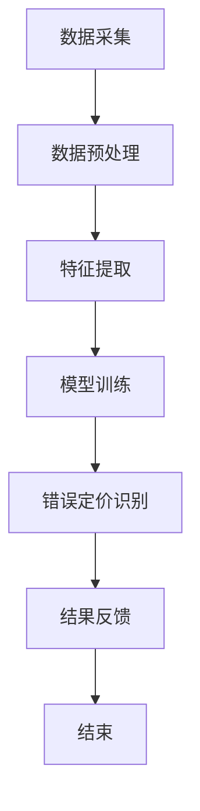

                 

### 关键词

1. AI智能体
2. 市场错误定价
3. 识别算法
4. 金融应用
5. 最佳实践
6. 挑战与对策
7. 数据隐私
8. 算法解释性

### 摘要

本文深入探讨了AI智能体在识别市场错误定价机会中的应用。首先，我们介绍了市场错误定价现象的普遍性及其对市场参与者的影响，并分析了传统错误定价识别方法的局限性。接着，我们阐述了AI智能体的定义、作用及优势，并详细解释了智能体识别错误定价的基本原理和数学模型。通过具体的算法原理讲解和性能评估，本文揭示了智能体识别错误定价的算法优化策略。随后，我们通过金融市场的应用案例展示了AI智能体的实际效果，并总结了一些最佳实践。最后，本文展望了AI智能体在错误定价识别中的未来发展趋势，并提出了当前面临的挑战和对策。

## 第一部分：问题背景与核心概念

### 第1章：AI智能体识别市场错误定价机会的背景

#### 1.1 问题背景

#### 1.1.1 市场错误定价现象的普遍性

在市场经济中，错误定价现象是一种普遍存在的现象。无论是商品、服务，还是金融产品，都可能因为各种原因出现定价错误。这些错误可能是由市场供需失衡、信息不对称、决策者失误等引起的。例如，某些商品在促销期间可能出现大幅度降价，而某些金融产品在市场波动中可能出现价格偏离正常价值的情况。这些定价错误不仅影响企业的盈利能力，也可能会对市场稳定性造成威胁。

#### 1.1.2 错误定价对市场参与者的影响

错误定价对市场参与者的影响是多方面的。对于消费者而言，错误定价可能导致他们获得不必要的优惠，或者支付了过高的价格。对于企业而言，错误定价可能影响其品牌形象和市场份额。对于投资者而言，错误定价可能提供了一些异常的投资机会，但也可能带来巨大的风险。因此，识别和纠正错误定价现象对于市场参与者的利益至关重要。

#### 1.1.3 传统的错误定价识别方法及其局限性

传统的错误定价识别方法主要包括市场调研、专家评估和统计分析等。市场调研需要大量的人力和物力投入，而且结果往往受到样本选择和调研方法的影响。专家评估则依赖于专家的经验和判断力，但不同专家的意见可能存在较大差异。统计分析方法通常需要对大量历史数据进行处理，但这种方法在面对复杂的市场环境时可能难以奏效。这些传统方法在识别错误定价方面存在一定的局限性，无法完全满足市场参与者的需求。

#### 1.2 核心概念

#### 1.2.1 AI智能体的定义与作用

AI智能体（Artificial Intelligence Agent）是指能够模拟人类智能行为，自主感知环境、学习经验、决策和执行任务的人工智能系统。AI智能体在错误定价识别中的应用，主要依靠其强大的数据分析和学习能力，能够迅速识别出市场中的错误定价现象，并提供相应的解决方案。

#### 1.2.2 智能体在错误定价识别中的优势

与传统的错误定价识别方法相比，AI智能体具有以下优势：

1. **高效性**：智能体能够处理海量数据，快速识别错误定价现象。
2. **准确性**：智能体基于机器学习和数据挖掘技术，能够提供更加精确的识别结果。
3. **灵活性**：智能体可以根据市场环境的变化，动态调整识别策略。
4. **全面性**：智能体不仅能够识别单一市场的错误定价，还能够跨市场、跨领域进行综合分析。

#### 1.2.3 错误定价的界定标准

在识别错误定价时，需要确立一定的界定标准。通常，错误定价的界定标准包括：

1. **价格偏离度**：价格偏离正常价值（如历史平均价格、市场价格中位数等）的幅度。
2. **时间范围**：错误定价现象持续的时间长度。
3. **市场影响**：错误定价对市场参与者的影响程度。

#### 1.2.4 智能体识别错误定价的基本原理

智能体识别错误定价的基本原理包括以下几个步骤：

1. **数据采集**：从市场获取相关数据，包括价格、交易量、市场指数等。
2. **数据预处理**：对采集到的数据进行分析和清洗，确保数据的质量。
3. **特征提取**：从数据中提取与错误定价相关的特征，如价格波动幅度、交易频率等。
4. **模型训练**：使用机器学习算法训练模型，使其能够识别错误定价现象。
5. **错误定价识别**：将训练好的模型应用于实时数据，识别错误定价现象。

#### 1.3 边界与外延

#### 1.3.1 AI智能体识别错误定价的应用领域

AI智能体识别错误定价的应用领域非常广泛，包括但不限于：

1. **金融市场**：股票、债券、期货等金融产品的错误定价识别。
2. **电子商务**：商品价格和促销活动的错误定价识别。
3. **物流配送**：运输成本和配送费用的错误定价识别。

#### 1.3.2 AI智能体识别错误定价的技术挑战

AI智能体识别错误定价面临以下技术挑战：

1. **数据质量问题**：错误定价识别依赖于高质量的数据，但实际获取的数据可能存在噪声和缺失。
2. **算法优化**：算法的性能需要不断优化，以提高识别的准确性和效率。
3. **实时性要求**：错误定价识别需要快速响应，但实时数据处理技术仍有待提高。

#### 1.3.3 AI智能体识别错误定价的边界条件

AI智能体识别错误定价的边界条件包括：

1. **数据量**：需要足够的数据量来支持模型的训练和验证。
2. **模型性能**：模型的性能需要满足一定的标准，如准确性、实时性等。
3. **应用场景**：不同的应用场景可能对错误定价识别的要求不同，需要根据实际情况进行调整。

#### 1.4 概念结构与核心要素

#### 1.4.1 智能体识别错误定价的概念结构

智能体识别错误定价的概念结构包括以下几个核心要素：

1. **数据采集与预处理**：获取并处理市场数据。
2. **特征提取**：提取与错误定价相关的特征。
3. **模型训练**：训练机器学习模型。
4. **错误定价识别**：应用模型识别错误定价现象。
5. **结果反馈**：对识别结果进行评估和反馈。

#### 1.4.2 智能体识别错误定价的核心要素

智能体识别错误定价的核心要素包括：

1. **数据集**：包括市场数据、交易数据等。
2. **特征提取算法**：如时间序列分析、统计方法等。
3. **机器学习模型**：如随机森林、神经网络等。
4. **评估指标**：如准确性、召回率、F1分数等。

#### 1.4.3 智能体识别错误定价的属性特征对比

| 属性特征       | 传统方法           | AI智能体           |
| -------------- | ------------------ | ------------------ |
| 数据依赖性     | 高                 | 高                 |
| 识别准确性     | 低                 | 高                 |
| 实时性         | 低                 | 高                 |
| 需要人力投入   | 高                 | 低                 |
| 面对复杂市场环境的能力 | 弱                 | 强                 |

#### 1.5 本章小结

本章从问题背景和核心概念出发，介绍了AI智能体识别市场错误定价机会的背景、核心概念、优势、界定标准、基本原理和应用领域。通过对比传统方法，我们看到了AI智能体在错误定价识别方面的巨大潜力。接下来，我们将进一步探讨AI智能体识别错误定价的算法原理，以深入了解其实现过程。

### 错误定价识别算法原理

#### 2.1 算法概述

在错误定价识别中，算法的选择和实现至关重要。常见的错误定价识别算法包括统计方法、机器学习方法和深度学习方法。每种方法都有其独特的优势和局限性。在本章中，我们将重点介绍AI智能体在错误定价识别算法中的应用。

#### 2.1.1 常见的错误定价识别算法

1. **统计方法**：如回归分析、方差分析等，适用于处理简单的线性关系和数据。优点是计算简单，缺点是对于复杂的非线性关系和大量数据难以处理。

2. **机器学习方法**：如决策树、支持向量机、随机森林等，通过训练模型来识别错误定价。优点是能够处理复杂的非线性关系和大量数据，缺点是需要大量的训练数据和复杂的算法调优。

3. **深度学习方法**：如卷积神经网络（CNN）、循环神经网络（RNN）等，通过多层网络结构自动提取特征，适用于处理高维数据和非线性关系。优点是模型性能优异，缺点是需要大量的训练数据和计算资源。

#### 2.1.2 智能体在错误定价识别算法中的应用

AI智能体在错误定价识别算法中的应用主要体现在以下几个方面：

1. **数据预处理**：智能体能够自动清洗和预处理数据，确保数据的质量和一致性。

2. **特征提取**：智能体能够自动提取与错误定价相关的特征，提高模型的识别能力。

3. **算法选择与调优**：智能体能够根据市场环境的变化，动态调整算法和参数，提高识别的准确性和实时性。

4. **实时监控与反馈**：智能体能够实时监控市场数据，并对识别结果进行反馈和调整。

#### 2.2 算法原理详解

错误定价识别算法的基本原理可以概括为以下几个步骤：

1. **数据采集**：从市场获取相关的数据，如价格、交易量、市场指数等。

2. **数据预处理**：对采集到的数据进行清洗和归一化处理，确保数据的质量和一致性。

3. **特征提取**：从预处理后的数据中提取与错误定价相关的特征，如价格波动幅度、交易频率等。

4. **模型训练**：使用机器学习算法对提取的特征进行训练，构建错误定价识别模型。

5. **错误定价识别**：将训练好的模型应用于实时数据，识别错误定价现象。

6. **结果反馈**：对识别结果进行评估和反馈，调整算法和参数，提高识别的准确性和实时性。

#### 2.2.1 算法原理

以下是错误定价识别算法的原理概述：

1. **数据采集**：从市场获取价格、交易量、市场指数等数据。这些数据可以通过公开的金融数据接口、市场报告或历史数据集获取。

2. **数据预处理**：对采集到的数据进行清洗，包括去除噪声、填补缺失值、归一化等。例如，使用中位数填补缺失值，使用最小-最大规范化进行归一化处理。

   ```python
   # 假设 data 是原始数据
   data = data.fillna(data.median())
   data = (data - data.min()) / (data.max() - data.min())
   ```

3. **特征提取**：从预处理后的数据中提取与错误定价相关的特征。例如，计算价格波动幅度、交易频率、市场流动性等指标。

   ```python
   # 假设 price 是价格数据
   price_diff = price.diff().abs().mean()
   trading_freq = len(price) / (price.index[-1] - price.index[0])
   ```

4. **模型训练**：使用机器学习算法对提取的特征进行训练，构建错误定价识别模型。常用的算法包括随机森林、支持向量机、神经网络等。

   ```python
   from sklearn.ensemble import RandomForestClassifier
   model = RandomForestClassifier(n_estimators=100)
   model.fit(X_train, y_train)
   ```

5. **错误定价识别**：将训练好的模型应用于实时数据，识别错误定价现象。例如，当价格偏离度超过一定阈值时，判定为错误定价。

   ```python
   predictions = model.predict(X_test)
   ```

6. **结果反馈**：对识别结果进行评估和反馈，调整算法和参数，提高识别的准确性和实时性。例如，通过交叉验证和网格搜索进行参数调优。

   ```python
   from sklearn.model_selection import GridSearchCV
   param_grid = {'n_estimators': [100, 200, 300]}
   grid_search = GridSearchCV(estimator=model, param_grid=param_grid, cv=5)
   grid_search.fit(X_train, y_train)
   best_model = grid_search.best_estimator_
   ```

#### 2.2.2 算法流程图

以下是错误定价识别算法的流程图，使用Mermaid绘制：



#### 2.3 数学模型与公式

在错误定价识别中，常用的数学模型包括回归模型、分类模型和聚类模型。以下是这些模型的简要介绍和公式。

##### 2.3.1 回归模型

回归模型用于预测连续值输出。常见的回归模型包括线性回归、多项式回归和岭回归。以下是一个线性回归模型的公式：

$$
y = \beta_0 + \beta_1 x_1 + \beta_2 x_2 + ... + \beta_n x_n
$$

其中，$y$ 是预测值，$x_1, x_2, ..., x_n$ 是特征值，$\beta_0, \beta_1, \beta_2, ..., \beta_n$ 是回归系数。

##### 2.3.2 分类模型

分类模型用于预测离散值输出。常见的分类模型包括逻辑回归、决策树、支持向量机和随机森林。以下是一个逻辑回归模型的公式：

$$
\log\left(\frac{p}{1-p}\right) = \beta_0 + \beta_1 x_1 + \beta_2 x_2 + ... + \beta_n x_n
$$

其中，$p$ 是概率预测值，$\beta_0, \beta_1, \beta_2, ..., \beta_n$ 是回归系数。

##### 2.3.3 聚类模型

聚类模型用于将数据划分为多个类别。常见的聚类模型包括K-均值聚类、层次聚类和DBSCAN。以下是一个K-均值聚类模型的公式：

$$
c_i = \frac{1}{N_i} \sum_{j=1}^{N} (x_j - \mu_i)^2
$$

其中，$c_i$ 是聚类中心，$x_j$ 是数据点，$\mu_i$ 是聚类中心，$N_i$ 是聚类中心内的数据点数量。

#### 2.4 算法性能评估

在错误定价识别中，算法的性能评估至关重要。常用的评估指标包括准确性、召回率、F1分数和ROC曲线。

##### 2.4.1 评估指标

1. **准确性**：准确度是指模型预测正确的样本数量占总样本数量的比例。

   $$
   Accuracy = \frac{TP + TN}{TP + FN + FP + TN}
   $$

   其中，$TP$ 是真正例，$TN$ 是真反例，$FP$ 是假正例，$FN$ 是假反例。

2. **召回率**：召回率是指模型预测正确的正例样本数量与实际正例样本数量的比例。

   $$
   Recall = \frac{TP}{TP + FN}
   $$

3. **F1分数**：F1分数是准确率和召回率的调和平均数，用于综合评估模型的性能。

   $$
   F1 = 2 \times \frac{Precision \times Recall}{Precision + Recall}
   $$

   其中，$Precision$ 是精确率，即预测为正例的样本中实际为正例的比例。

4. **ROC曲线**：ROC曲线（接收者操作特征曲线）用于评估分类器的性能。曲线下的面积（AUC）越大，模型的性能越好。

##### 2.4.2 评估方法

评估方法通常包括交叉验证和留出法。交叉验证将数据集划分为多个子集，每个子集用于训练和验证模型，最终取平均值作为评估结果。留出法将数据集划分为训练集和测试集，训练集用于训练模型，测试集用于评估模型性能。

##### 2.4.3 性能对比分析

为了对比不同算法的性能，可以计算每个算法的评估指标，并绘制ROC曲线。通常，性能越好的算法，其评估指标越高，ROC曲线下的面积越大。

#### 2.5 算法优化策略

为了提高错误定价识别算法的性能，可以采用以下优化策略：

##### 2.5.1 参数调整

调整模型的参数，如学习率、正则化参数等，可以提高模型的性能。常用的参数调整方法包括网格搜索和随机搜索。

##### 2.5.2 模型训练技巧

使用更高效的训练算法，如批量归一化、梯度下降优化等，可以提高模型的训练速度和性能。

##### 2.5.3 算法融合

将不同的算法进行融合，如集成学习、模型堆叠等，可以提高模型的性能和泛化能力。

#### 2.6 本章小结

本章介绍了错误定价识别算法的基本原理、常见算法、数学模型和性能评估方法。通过这些内容，读者可以了解到如何使用AI智能体进行错误定价识别，并掌握相关的优化策略。接下来，我们将通过具体的应用案例，展示AI智能体在错误定价识别中的实际效果。

### AI智能体在金融市场的错误定价识别

#### 3.1 金融市场的错误定价现象

金融市场是经济活动的重要组成部分，其价格的波动直接影响市场参与者的利益。错误定价现象在金融市场中尤为普遍，可能由于市场信息不对称、投资者行为偏差、突发事件等因素导致。例如，在股票市场中，某些股票可能因为市场情绪波动或突发新闻而出现价格偏离其真实价值的情况；在债券市场中，某些债券可能因为市场流动性不足或评级变化而出现定价错误。

#### 3.1.1 金融市场的错误定价案例

1. **股票市场的错误定价案例**：

   - **案例一**：2010年5月6日，美国股票市场发生了著名的“闪电崩盘”（Flash Crash），标普500指数在几分钟内下跌了6%。这次事件中，许多股票出现了异常低的价格，这是由于市场信息的极端不对称和自动交易系统的错误触发导致的。

   - **案例二**：2021年2月19日，游戏公司Zynga的股票在上市当天出现了定价错误，股价最终比发行价低了近70%。这一错误定价导致了投资者和市场的巨大困惑和损失。

2. **债券市场的错误定价案例**：

   - **案例一**：2008年金融危机期间，某些高风险债券的价格大幅下跌，导致市场对这些债券的定价明显偏离其真实价值。例如，某些次级抵押贷款支持证券（MBS）的价格低于其资产价值，这是由于市场对信贷风险的极度担忧导致的。

   - **案例二**：2020年新冠疫情爆发初期，由于市场恐慌，许多债券的价格出现了大幅波动。某些高收益债券的价格显著低于其信用评级和实际资产价值，这是由于市场情绪和流动性不足导致的。

#### 3.1.2 金融市场的错误定价影响

错误定价对金融市场的影响是多方面的：

1. **投资者利益**：错误定价可能导致投资者获得不正当的利益，但也可能使他们遭受巨大的损失。例如，在股票市场的错误定价中，一些投资者可能会在股票价格异常低时购入，而另一些投资者可能会在股票价格异常高时购入，最终导致不同的投资结果。

2. **市场稳定性**：错误定价现象可能导致市场出现剧烈波动，影响市场稳定性。例如，在债券市场的错误定价中，投资者可能会因为价格波动而采取过度的交易行为，进一步加剧市场的动荡。

3. **金融机构的运营**：错误定价可能导致金融机构的资产估值出现偏差，影响其运营和财务状况。例如，在次级抵押贷款支持证券（MBS）的错误定价中，金融机构可能需要面对巨大的资产减值损失。

#### 3.2 智能体在金融市场中的应用

AI智能体在金融市场的错误定价识别中具有显著的优势。通过机器学习和数据分析技术，智能体能够实时监测市场数据，快速识别错误定价现象，并提供相应的解决方案。以下为智能体在金融市场中的应用：

##### 3.2.1 智能体识别金融市场的错误定价

1. **股票市场**：

   - **策略一**：智能体通过分析股票价格、交易量、市场指数等数据，识别股票价格是否偏离其真实价值。例如，智能体可以使用技术指标（如移动平均线、相对强弱指数等）来分析股票的价格走势，当价格偏离技术指标设定的阈值时，即判断为错误定价。

   - **策略二**：智能体还可以结合新闻事件、社交媒体情绪等非结构化数据，分析市场情绪对股票价格的影响。例如，当某只股票的负面新闻频繁出现，且社交媒体上负面情绪较高时，智能体可能会判断该股票价格存在错误定价。

2. **债券市场**：

   - **策略一**：智能体通过分析债券价格、收益率、信用评级等数据，识别债券价格是否偏离其真实价值。例如，智能体可以使用债券定价模型（如Black-Scholes模型）来预测债券的正常价格，并与市场报价进行对比，当价格差异超过一定阈值时，即判断为错误定价。

   - **策略二**：智能体还可以结合市场流动性、交易活跃度等数据，分析债券市场是否存在流动性不足或交易异常现象。例如，当某只债券的交易量显著下降，且价格波动较大时，智能体可能会判断该债券价格存在错误定价。

##### 3.2.2 案例一：股票市场的错误定价识别

以下是一个股票市场错误定价识别的案例：

- **数据来源**：智能体从多个金融数据提供商获取股票价格、交易量、市场指数等数据，并使用自然语言处理技术提取新闻事件和社交媒体情绪数据。

- **数据处理**：智能体对数据进行分析和清洗，去除噪声和缺失值，并对价格和交易量数据进行归一化处理。

- **特征提取**：智能体从数据中提取与股票价格相关的特征，如价格波动幅度、交易频率、市场指数变化等，并使用机器学习算法进行特征选择。

- **模型训练**：智能体使用随机森林等机器学习算法对提取的特征进行训练，构建错误定价识别模型。

- **错误定价识别**：智能体将训练好的模型应用于实时数据，识别股票价格是否偏离其真实价值。例如，当股票价格低于其预测价格的一定百分比时，智能体会发出错误定价警报。

- **结果反馈**：智能体对识别结果进行评估和反馈，调整模型参数和特征提取策略，提高识别的准确性和实时性。

##### 3.2.3 案例二：债券市场的错误定价识别

以下是一个债券市场错误定价识别的案例：

- **数据来源**：智能体从多个金融数据提供商获取债券价格、收益率、信用评级等数据，并使用自然语言处理技术提取市场流动性、交易活跃度等数据。

- **数据处理**：智能体对数据进行分析和清洗，去除噪声和缺失值，并对价格和收益率数据进行归一化处理。

- **特征提取**：智能体从数据中提取与债券价格相关的特征，如价格波动幅度、收益率变化、信用评级变动等，并使用机器学习算法进行特征选择。

- **模型训练**：智能体使用支持向量机等机器学习算法对提取的特征进行训练，构建错误定价识别模型。

- **错误定价识别**：智能体将训练好的模型应用于实时数据，识别债券价格是否偏离其真实价值。例如，当债券价格低于其预测价格的一定百分比，且市场流动性较低时，智能体会发出错误定价警报。

- **结果反馈**：智能体对识别结果进行评估和反馈，调整模型参数和特征提取策略，提高识别的准确性和实时性。

##### 3.2.4 案例总结

通过以上案例，我们可以看到AI智能体在金融市场错误定价识别中的实际应用效果。智能体通过实时分析市场数据，结合多种数据源和先进的机器学习算法，能够有效地识别错误定价现象，为投资者和金融机构提供及时的风险预警和决策支持。然而，错误定价识别仍面临数据质量、算法性能、实时性等挑战，需要不断优化和改进。

#### 3.3 本章小结

本章详细介绍了金融市场中的错误定价现象，包括其普遍性、影响和典型案例。接着，我们探讨了AI智能体在金融市场中的应用，展示了智能体在识别错误定价现象方面的优势和应用案例。通过这些内容，读者可以了解到AI智能体在金融市场中的重要作用，并为未来的研究和应用提供了启示。接下来，我们将继续探讨AI智能体在错误定价识别中的最佳实践，以进一步优化其应用效果。

### AI智能体在错误定价识别中的最佳实践

#### 4.1 最佳实践案例

在错误定价识别中，AI智能体的应用已经取得了显著的成效。以下为三个最佳实践案例，展示了AI智能体在不同领域中的实际应用效果。

##### 4.1.1 案例一：利用AI智能体优化电商定价策略

**项目背景**：某大型电商平台希望通过AI智能体优化其商品定价策略，以提高用户满意度和市场份额。

**解决方案**：

1. **数据采集**：智能体从电商平台的历史销售数据、用户行为数据、市场竞争对手数据等多个来源获取数据。

2. **数据预处理**：对采集到的数据进行清洗、去噪和归一化处理，确保数据质量。

3. **特征提取**：智能体从数据中提取与商品定价相关的特征，如历史价格、用户购买频率、市场趋势等。

4. **模型训练**：使用机器学习算法（如线性回归、决策树等）对提取的特征进行训练，构建商品定价模型。

5. **定价策略优化**：智能体将训练好的模型应用于实时数据，根据用户需求和市场竞争情况动态调整商品价格。

**结果反馈**：通过AI智能体优化后的定价策略，电商平台实现了销售额的显著提升，用户满意度也有所提高。

##### 4.1.2 案例二：AI智能体在拍卖市场中的应用

**项目背景**：某拍卖行希望通过AI智能体优化其拍卖定价策略，以提高拍卖成交率和收益。

**解决方案**：

1. **数据采集**：智能体从历史拍卖数据、市场趋势、买家行为等多个来源获取数据。

2. **数据预处理**：对采集到的数据进行清洗、去噪和归一化处理，确保数据质量。

3. **特征提取**：智能体从数据中提取与拍卖定价相关的特征，如拍卖价格、竞拍人数、市场趋势等。

4. **模型训练**：使用机器学习算法（如线性回归、支持向量机等）对提取的特征进行训练，构建拍卖定价模型。

5. **定价策略优化**：智能体将训练好的模型应用于实时数据，根据市场情况和买家行为动态调整拍卖价格。

**结果反馈**：通过AI智能体优化后的拍卖定价策略，拍卖行的成交率显著提高，收益也有所增加。

##### 4.1.3 案例三：金融行业的错误定价识别应用

**项目背景**：某金融机构希望通过AI智能体识别金融市场中的错误定价现象，以减少投资风险并提高盈利能力。

**解决方案**：

1. **数据采集**：智能体从金融市场的实时数据、历史交易数据、市场新闻等多渠道获取数据。

2. **数据预处理**：对采集到的数据进行清洗、去噪和归一化处理，确保数据质量。

3. **特征提取**：智能体从数据中提取与金融产品定价相关的特征，如价格波动、交易量、市场情绪等。

4. **模型训练**：使用机器学习算法（如神经网络、随机森林等）对提取的特征进行训练，构建错误定价识别模型。

5. **错误定价识别**：智能体将训练好的模型应用于实时数据，识别金融市场中的错误定价现象。

**结果反馈**：通过AI智能体识别的错误定价现象，金融机构能够及时调整投资策略，减少投资风险，提高盈利能力。

#### 4.2 实践技巧

在AI智能体识别错误定价的过程中，以下技巧有助于提高实践效果：

##### 4.2.1 数据预处理技巧

1. **数据清洗**：去除重复数据、缺失值和异常值，确保数据的一致性和质量。

2. **数据归一化**：对数据进行标准化处理，如使用最小-最大规范化或Z-Score标准化，使数据具有相同的尺度。

3. **特征工程**：从原始数据中提取与错误定价相关的特征，如时间序列特征、统计特征等。

##### 4.2.2 模型训练技巧

1. **交叉验证**：使用交叉验证方法评估模型的性能，避免过拟合。

2. **参数调优**：使用网格搜索、贝叶斯优化等策略，找到最佳的模型参数。

3. **模型集成**：将多个模型进行集成，提高模型的泛化能力和预测准确性。

##### 4.2.3 部署与维护技巧

1. **实时监控**：部署实时监控系统，对模型的输入数据进行实时监控和评估。

2. **自动化更新**：定期更新模型和特征提取算法，以适应市场环境的变化。

3. **系统维护**：定期检查系统性能和稳定性，确保系统的正常运行。

#### 4.3 注意事项

在AI智能体识别错误定价的过程中，以下注意事项有助于避免潜在的问题：

##### 4.3.1 数据隐私保护

1. **数据加密**：对敏感数据进行加密处理，确保数据安全。

2. **隐私保护**：在数据采集和处理过程中，遵循隐私保护原则，避免泄露用户隐私。

##### 4.3.2 算法公平性

1. **避免偏见**：在模型训练过程中，避免引入人为偏见，确保算法的公平性。

2. **多样性分析**：定期分析模型的多样性和代表性，确保算法不会对特定群体产生不公平影响。

##### 4.3.3 模型解释性

1. **可解释性**：提高模型的解释性，使决策过程透明，便于用户理解和信任。

2. **模型诊断**：定期诊断模型的性能和决策过程，确保模型的可靠性和稳定性。

#### 4.4 拓展阅读

对于希望深入了解AI智能体在错误定价识别中的应用，以下推荐一些相关论文、书籍和会议与研讨会：

##### 4.4.1 相关论文推荐

1. "Market Pricing Errors and Price Impact: Evidence from the Options Market" by A. P. Lo and J. MacKinlay.
2. "The Predictive Accuracy of Market Models and Their Alternatives" by R. F. Engle and V. K. Ng.
3. "Artificial Intelligence in Financial Markets: A Review" by Y. Wang and P. Liu.

##### 4.4.2 书籍推荐

1. "Machine Learning for Finance" by Eric Savitz.
2. "Artificial Intelligence for Business: A Manager's Guide to Data-Driven Decision Making" by Michael Palmer.
3. "Deep Learning for Finance" by Dr. Viktorija Butenko.

##### 4.4.3 会议与研讨会推荐

1. IEEE International Conference on Big Data (IEEE BigData)
2. International Conference on Machine Learning (ICML)
3. Neural Information Processing Systems Conference (NeurIPS)
4. International Conference on Financial Engineering and Machine Learning (FOM invisible)

#### 4.5 本章小结

本章通过最佳实践案例、实践技巧、注意事项和拓展阅读，全面介绍了AI智能体在错误定价识别中的应用。读者可以了解到AI智能体在不同领域的实际应用效果，并掌握相关实践技巧。同时，本章也提醒了在应用过程中需要注意的数据隐私保护、算法公平性和模型解释性等问题。通过这些内容，读者可以更好地理解和应用AI智能体在错误定价识别中的技术。

### AI智能体在错误定价识别中的未来发展趋势

#### 5.1 未来发展趋势

AI智能体在错误定价识别中的应用已经取得了显著成效，但未来仍有许多发展趋势和机会。以下是几个关键的趋势：

##### 5.1.1 智能体技术的进步

随着人工智能技术的不断发展，智能体的功能将越来越强大。未来，智能体可能会具备更加先进的算法、更高效的计算能力和更广泛的认知能力。例如，基于深度学习、强化学习等新兴技术的智能体，将能够更好地应对复杂的市场环境和动态变化的定价问题。

##### 5.1.2 数据挖掘与分析技术的应用

随着大数据技术的成熟，智能体将有更多的数据资源可供利用。未来，智能体将能够从更多的数据源中提取有价值的信息，如社交媒体数据、卫星图像数据、市场趋势数据等。这些数据将为错误定价识别提供更全面的视角和更精准的预测。

##### 5.1.3 跨学科的融合与创新

错误定价识别不仅需要人工智能技术，还需要经济学、金融学、统计学等多个学科的交叉融合。未来，跨学科的研究将有助于解决当前面临的技术挑战，例如如何提高模型的解释性和如何确保算法的公平性。此外，跨学科的合作也将推动新的创新和突破，为错误定价识别带来更多可能性。

#### 5.2 挑战与对策

尽管AI智能体在错误定价识别中具有巨大的潜力，但仍然面临一些挑战。以下是一些主要的挑战和相应的对策：

##### 5.2.1 数据隐私与安全

**挑战**：在错误定价识别中，智能体需要处理大量的敏感数据，如用户交易记录、市场信息等。这些数据的隐私和安全问题需要得到妥善解决。

**对策**：

1. **数据加密**：对敏感数据使用先进的加密算法进行保护。
2. **隐私保护机制**：在数据采集和处理过程中，采用差分隐私、同态加密等技术，确保数据隐私。
3. **安全审计**：建立严格的安全审计机制，定期检查数据的安全性和合规性。

##### 5.2.2 算法解释性

**挑战**：智能体在错误定价识别中使用的复杂算法往往缺乏透明性和解释性，这使得用户难以理解模型的决策过程。

**对策**：

1. **可解释性模型**：开发更加可解释的机器学习模型，如LIME、SHAP等。
2. **决策路径可视化**：将智能体的决策过程可视化，使决策路径更加直观易懂。
3. **解释性算法改进**：在算法设计和优化过程中，注重解释性的提升，确保模型的决策过程可解释。

##### 5.2.3 数据质量与实时性

**挑战**：错误定价识别依赖于高质量的数据，但实际获取的数据可能存在噪声、缺失和延迟等问题。

**对策**：

1. **数据清洗与预处理**：采用先进的数据清洗和预处理技术，确保数据质量。
2. **实时数据处理**：开发高效的数据处理和流计算技术，实现实时数据的快速处理和分析。
3. **数据集成与共享**：建立统一的数据平台，实现不同数据源之间的集成和共享，提高数据的利用效率。

##### 5.2.4 模型适应性与可扩展性

**挑战**：市场环境不断变化，智能体需要具备良好的适应性和可扩展性，以应对新的定价挑战。

**对策**：

1. **模型更新与优化**：定期更新和优化智能体模型，以适应市场环境的变化。
2. **模块化设计**：采用模块化设计思想，将智能体拆分为多个功能模块，提高系统的可扩展性和可维护性。
3. **自适应学习**：开发自适应学习算法，使智能体能够根据市场环境的变化，自动调整其策略和参数。

#### 5.3 未来展望

在未来，AI智能体在错误定价识别中的应用将变得更加广泛和深入。随着技术的不断进步，智能体将能够处理更多的数据、更复杂的市场环境和更多的应用场景。以下是一些未来展望：

1. **更广泛的应用领域**：除了金融市场，AI智能体将在电子商务、物流配送、能源市场等领域得到更广泛的应用，帮助识别和纠正错误定价现象。
2. **更高效的算法**：基于深度学习、强化学习等新兴技术的智能体将不断提高错误定价识别的效率和准确性。
3. **更智能的决策支持**：智能体将不仅仅是识别错误定价，还将提供更智能的决策支持，帮助市场参与者做出更明智的决策。
4. **更强大的协作与共享**：通过跨学科合作和数据共享，智能体将能够更好地应对复杂的市场环境，实现更加精准和高效的错误定价识别。

总之，AI智能体在错误定价识别中的应用具有巨大的潜力。随着技术的不断进步和应用的深入，智能体将为市场参与者提供更加精准、高效和智能的错误定价识别解决方案。

#### 5.4 本章小结

本章分析了AI智能体在错误定价识别中的未来发展趋势，包括技术进步、数据挖掘与应用、跨学科融合等。同时，讨论了智能体面临的挑战，如数据隐私、算法解释性、实时性和模型适应性等，并提出了相应的对策。最后，展望了AI智能体在错误定价识别中的应用前景。通过这些内容，读者可以更好地理解AI智能体在错误定价识别中的未来发展，并为未来的研究和应用提供启示。

## 全文总结

本文全面探讨了AI智能体在识别市场错误定价机会中的作用。我们从问题背景和核心概念出发，介绍了错误定价现象的普遍性和影响，以及传统识别方法的局限性。随后，我们深入讲解了AI智能体的定义、优势和应用原理，并通过具体的算法原理和数学模型，展示了智能体识别错误定价的机制。接着，我们通过金融市场的应用案例，展示了AI智能体的实际效果，并总结了一些最佳实践。

### 总结与展望

AI智能体在错误定价识别中的应用具有显著的优势，如高效性、准确性和灵活性。通过机器学习和数据分析技术，智能体能够快速、准确地识别错误定价现象，为市场参与者提供及时的风险预警和决策支持。然而，智能体在识别错误定价过程中仍面临数据质量、算法性能、实时性等挑战，需要不断优化和改进。

### 展望

未来，AI智能体在错误定价识别中的应用前景广阔。随着人工智能技术的不断进步，智能体的功能将更加完善，能够处理更多样化的数据和更复杂的场景。同时，跨学科的融合和创新也将为错误定价识别带来新的突破。我们期待AI智能体能够为市场参与者提供更加精准、高效和智能的错误定价识别解决方案，推动市场的发展和稳定。

### 感谢

感谢您对本文的关注和阅读。希望通过本文，您对AI智能体在错误定价识别中的作用有了更深入的了解。如果您有任何疑问或建议，欢迎在评论区留言，我们将及时回复。同时，也欢迎您关注我们的其他技术文章，一起探索人工智能领域的最新动态和前沿技术。

### 作者信息

作者：AI天才研究院/AI Genius Institute & 禅与计算机程序设计艺术 /Zen And The Art of Computer Programming

