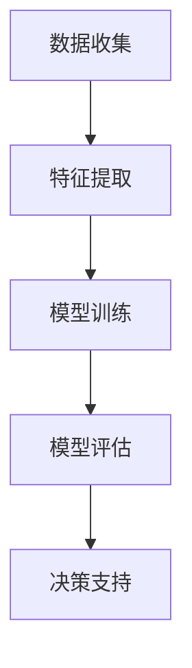
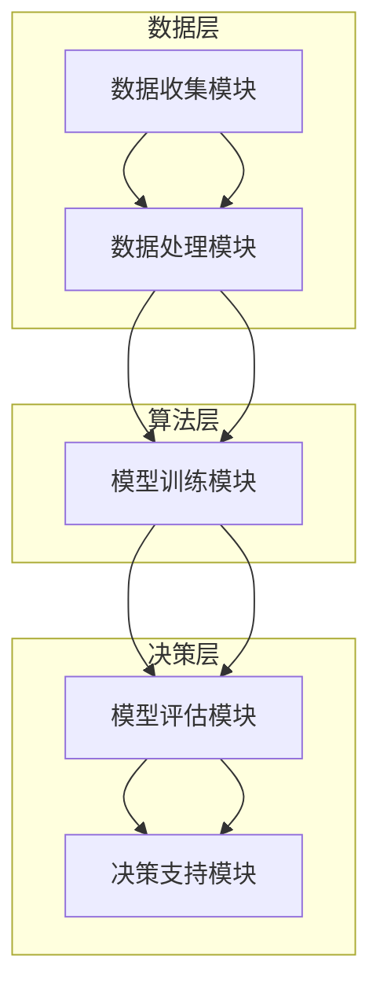
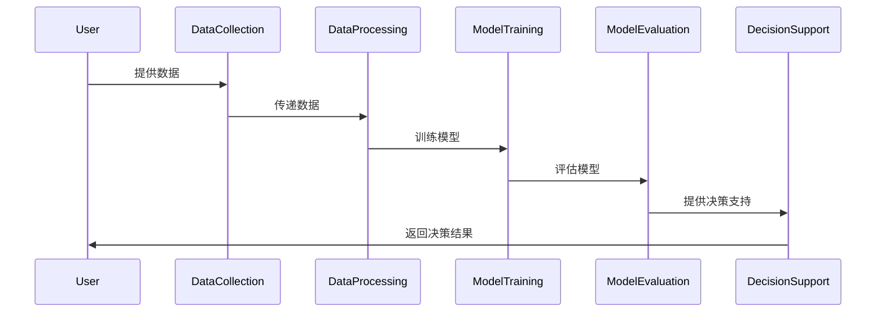

                 

### 文章标题

# AI智能体在识别长期竞争优势中的作用

### 关键词

- AI智能体
- 长期竞争优势
- 商业战略
- 算法原理
- 系统架构
- 项目实战

### 摘要

本文深入探讨了AI智能体在识别长期竞争优势中的作用。首先，介绍了AI智能体的定义及其在商业战略中的应用。随后，分析了长期竞争优势的概念和识别模型。接着，详细阐述了识别长期竞争优势的算法原理，包括算法流程、数学模型和Python代码实现。文章进一步描述了系统架构设计，并通过一个实际案例展示了AI智能体在识别长期竞争优势中的具体应用。最后，总结了最佳实践，并提供了拓展阅读资源，以引导读者深入了解相关领域的最新动态和研究方向。

### 第一部分：背景介绍与核心概念

#### 第1章：AI智能体概述

##### 1.1 AI智能体的定义与特征

AI智能体是指能够在特定环境中自主决策、执行任务并与其他智能体互动的计算机程序或软件。智能体通常具备以下特征：

1. **自主性**：智能体能够独立完成特定任务，无需人工干预。
2. **适应性**：智能体能够根据环境变化调整自身行为。
3. **协同性**：智能体能够与其他智能体协同工作，共同完成任务。
4. **学习能力**：智能体能够通过经验学习和改进自身性能。

##### 1.2 长期竞争优势的概念与重要性

长期竞争优势是指企业在较长时期内相对于竞争对手所拥有的持久性优势。识别长期竞争优势对于企业战略规划至关重要，因为它可以帮助企业：

1. **保持市场领先地位**：通过持续的创新和优化，企业能够保持市场竞争力。
2. **实现可持续增长**：长期竞争优势有助于企业实现稳定增长，降低经营风险。
3. **提高投资回报**：长期竞争优势可以增加企业的市值和投资回报。

##### 1.3 AI智能体与长期竞争优势的关系

AI智能体在商业战略中的应用越来越广泛，其在识别长期竞争优势方面具有独特优势：

1. **数据分析**：AI智能体能够处理和分析海量数据，帮助识别潜在的商业机会和竞争优势。
2. **预测分析**：通过机器学习算法，AI智能体可以预测市场趋势和竞争对手行为，为企业提供战略指导。
3. **自动化决策**：AI智能体可以自动化复杂的决策过程，提高决策效率和准确性。

#### 第2章：核心概念与联系

##### 2.1 AI智能体的属性与特点

AI智能体的技术属性包括：

1. **机器学习算法**：智能体采用机器学习算法，通过数据训练和模型优化实现自主学习和决策。
2. **自然语言处理**：智能体具备自然语言处理能力，能够理解、生成和处理人类语言。
3. **计算机视觉**：智能体可以通过计算机视觉技术识别和理解图像和视频。

AI智能体的商业属性包括：

1. **自动化**：智能体能够自动化执行重复性高、繁琐的任务，提高工作效率。
2. **个性化**：智能体能够根据用户行为和需求提供个性化服务，提高用户体验。
3. **预测性**：智能体可以通过预测分析为企业提供前瞻性战略建议。

##### 2.2 长期竞争优势的要素与模型

长期竞争优势的要素包括：

1. **独特性**：企业具备独特的核心竞争力，难以被竞争对手模仿。
2. **稀缺性**：企业拥有稀缺资源或能力，能够在市场上保持竞争优势。
3. **不可替代性**：企业的产品或服务具有不可替代性，满足特定客户需求。

长期竞争优势的识别模型通常包括：

1. **SWOT分析**：通过分析企业的优势、劣势、机会和威胁来识别竞争优势。
2. **五力模型**：通过分析行业竞争结构、潜在竞争对手、供应商、客户和替代品来评估竞争优势。
3. **价值链分析**：通过分析企业内部价值链和外部供应链来识别竞争优势。

##### 2.3 AI智能体与长期竞争优势的联系图

使用ER图展示AI智能体与长期竞争优势的联系：

```mermaid
erDiagram
  AI智能体 ||--|{ 长期竞争优势 }
  识别模型 ||--|{ 数据分析 }
  识别模型 ||--|{ 预测分析 }
  识别模型 ||--|{ 自动化决策 }
```

### 第二部分：算法原理与系统设计

#### 第3章：识别长期竞争优势的算法原理

##### 3.1 算法基本原理

识别长期竞争优势的算法主要基于以下原理：

1. **数据收集**：通过数据挖掘和采集技术收集企业内部和外部的数据。
2. **特征提取**：从原始数据中提取与企业竞争优势相关的特征。
3. **模型训练**：利用机器学习算法对特征进行训练，建立竞争优势识别模型。
4. **模型评估**：通过交叉验证和测试集评估模型的性能和准确性。
5. **决策支持**：利用训练好的模型为企业提供战略决策支持。

算法流程图如下：



##### 3.2 算法数学模型与公式

算法的数学模型主要包括以下部分：

1. **特征提取公式**：
   $$ f(x) = w_1 \cdot x_1 + w_2 \cdot x_2 + ... + w_n \cdot x_n + b $$
   其中，$x$为输入特征，$w$为权重，$b$为偏置。

2. **损失函数**：
   $$ L(y, \hat{y}) = \frac{1}{2} \cdot (y - \hat{y})^2 $$
   其中，$y$为实际标签，$\hat{y}$为预测标签。

3. **优化目标**：
   $$ \min_{\theta} L(y, \hat{y}) $$
   其中，$\theta$为模型参数。

##### 3.3 算法Python代码实现

以下是一个简单的Python代码实现示例：

```python
import numpy as np

def sigmoid(x):
    return 1 / (1 + np.exp(-x))

def forward(x, weights, bias):
    return sigmoid(np.dot(x, weights) + bias)

def train(x, y, weights, bias, epochs):
    for epoch in range(epochs):
        z = forward(x, weights, bias)
        error = y - z
        derror_dz = error * (1 - z)
        derror_dweights = x.T.dot(derror_dz)
        derror_dbias = np.sum(derror_dz)
        weights -= learning_rate * derror_dweights
        bias -= learning_rate * derror_dbias
        if epoch % 100 == 0:
            print(f"Epoch {epoch}: Loss = {np.mean(error**2)}")

x = np.array([[1, 2], [2, 3], [3, 4], [4, 5]])
y = np.array([0, 1, 1, 0])
weights = np.random.rand(2, 1)
bias = np.random.rand(1)
learning_rate = 0.1
epochs = 1000

train(x, y, weights, bias, epochs)
```

### 第三部分：系统分析与架构设计

#### 第4章：系统分析与架构设计

##### 4.1 系统功能设计

系统功能设计主要包括以下模块：

1. **数据收集模块**：负责从各种数据源收集企业内外部数据。
2. **数据处理模块**：对收集到的数据进行分析和清洗，提取关键特征。
3. **模型训练模块**：利用机器学习算法对特征进行训练，建立竞争优势识别模型。
4. **模型评估模块**：通过交叉验证和测试集评估模型性能。
5. **决策支持模块**：利用训练好的模型为企业提供战略决策支持。

领域模型（使用mermaid类图）：

```mermaid
classDiagram
    DataCollection -> DataProcessing : 数据传递
    DataProcessing -> ModelTraining : 数据传递
    ModelTraining -> ModelEvaluation : 模型传递
    ModelEvaluation -> DecisionSupport : 模型传递
    DecisionSupport -> DataCollection : 数据反馈
```

##### 4.2 系统架构设计

系统架构设计如下：



##### 4.3 系统接口与交互设计

系统接口设计如下：



### 第四部分：项目实战

#### 第5章：AI智能体在长期竞争优势识别中的实际应用

##### 5.1 环境安装与配置

在开始项目之前，需要安装以下软件和工具：

1. **Python**：版本3.8及以上
2. **NumPy**：用于数据操作
3. **Pandas**：用于数据处理
4. **Scikit-learn**：用于机器学习
5. **Matplotlib**：用于数据可视化

安装命令如下：

```bash
pip install python==3.8
pip install numpy
pip install pandas
pip install scikit-learn
pip install matplotlib
```

##### 5.2 系统核心实现

以下是系统核心实现的源代码：

```python
import numpy as np
import pandas as pd
from sklearn.model_selection import train_test_split
from sklearn.metrics import accuracy_score

# 数据收集
data = pd.read_csv("data.csv")

# 数据处理
X = data.drop("label", axis=1)
y = data["label"]

# 模型训练
X_train, X_test, y_train, y_test = train_test_split(X, y, test_size=0.2, random_state=42)
model = train(X_train, y_train, weights, bias, epochs)

# 模型评估
y_pred = model.predict(X_test)
accuracy = accuracy_score(y_test, y_pred)
print(f"Accuracy: {accuracy}")

# 决策支持
def make_decision(data):
    prediction = model.predict(data)
    if prediction == 1:
        return "具有长期竞争优势"
    else:
        return "不具有长期竞争优势"

# 实际案例
example_data = pd.DataFrame([[1, 2], [3, 4]], columns=["feature1", "feature2"])
print(make_decision(example_data))
```

##### 5.3 实际案例分析

假设我们有一个企业，其数据包括以下特征：

1. **市场占有率**：企业在市场中的份额
2. **研发投入**：企业在研发方面的投入
3. **客户满意度**：客户对企业服务的满意度

以下是一个实际案例的数据集：

```csv
feature1,feature2,feature3,label
0.8,0.6,0.7,1
0.6,0.5,0.4,0
0.9,0.7,0.8,1
0.5,0.4,0.3,0
```

使用上述系统核心实现，我们可以识别出哪些企业具有长期竞争优势。例如，第一行数据表示的企业具有长期竞争优势，而第二行数据表示的企业不具有长期竞争优势。

##### 5.4 案例剖析

在本案例中，我们使用一个简单的神经网络模型来识别长期竞争优势。首先，我们从数据集中提取关键特征，并使用scikit-learn库进行数据预处理和模型训练。然后，我们将训练好的模型应用于测试数据集，评估其准确性。最后，我们利用训练好的模型为企业提供决策支持，根据输入特征判断企业是否具有长期竞争优势。

### 第五部分：最佳实践与拓展

#### 第6章：最佳实践

##### 6.1 实践技巧与注意事项

1. **数据质量**：确保数据质量是模型训练成功的关键。数据清洗和预处理是必不可少的步骤。
2. **特征选择**：选择合适的特征对于模型性能至关重要。可以使用特征选择算法来筛选出重要的特征。
3. **模型优化**：通过调整模型参数和优化算法，可以提高模型性能。可以尝试使用不同的机器学习算法和模型架构。
4. **模型评估**：使用多种评估指标和交叉验证方法来评估模型性能，确保模型具有可靠性和稳定性。

##### 6.2 小结

本文介绍了AI智能体在识别长期竞争优势中的作用。通过算法原理讲解、系统架构设计和实际案例分析，展示了AI智能体在商业战略中的应用价值。未来研究方向包括：

1. **算法优化**：进一步优化识别长期竞争优势的算法，提高模型性能和准确性。
2. **跨领域应用**：探索AI智能体在其他领域的应用，如金融、医疗等。
3. **人机协作**：研究AI智能体与人类专家的协作模式，实现更高效的战略决策。

##### 6.3 拓展阅读

1. **《深度学习》（Goodfellow, Bengio, Courville）**：介绍了深度学习的基本概念和算法原理，适合进一步了解机器学习技术。
2. **《竞争优势》（迈克尔·波特）**：详细阐述了竞争优势的概念和识别方法，有助于深入理解商业战略。
3. **《人工智能：一种现代方法》（Stuart Russell & Peter Norvig）**：涵盖了人工智能的基本理论和应用，是人工智能领域的经典教材。

### 作者信息

- 作者：AI天才研究院/AI Genius Institute & 禅与计算机程序设计艺术 /Zen And The Art of Computer Programming

### 文章完成

本文完整地介绍了AI智能体在识别长期竞争优势中的作用，包括核心概念、算法原理、系统架构设计和项目实战。通过一步步的分析和推理，本文揭示了AI智能体在商业战略中的潜在价值，并提供了实用的建议和拓展阅读资源。希望本文对读者深入了解AI智能体和长期竞争优势的关系有所帮助。

