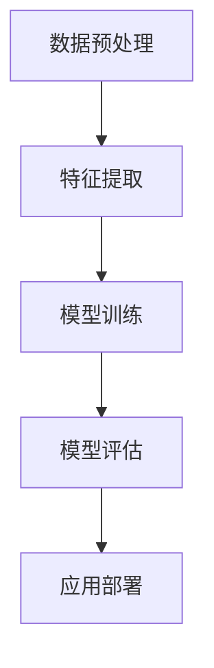
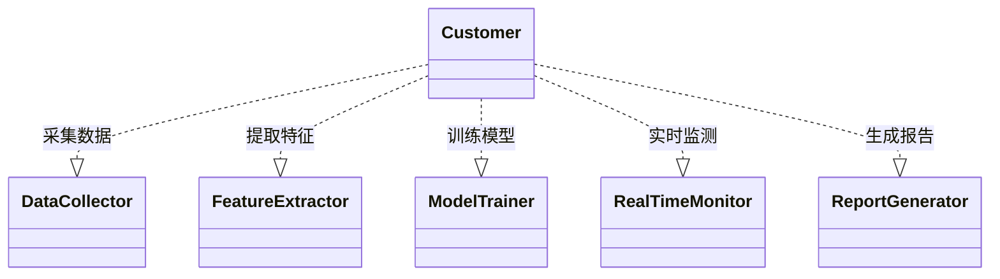
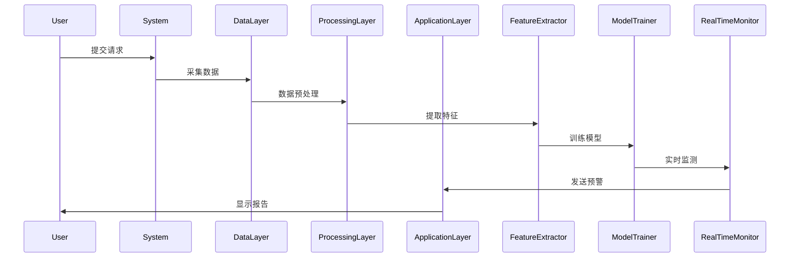
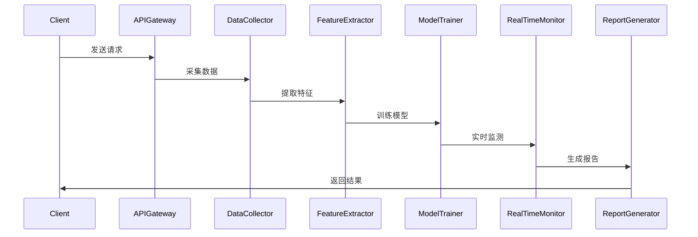

                 


### AI智能体在识别隐藏资产中的应用

关键词：AI智能体、隐藏资产、识别、机器学习、深度学习、算法原理、系统架构、项目实战

摘要：本文将深入探讨AI智能体在识别隐藏资产中的应用。首先，我们将介绍隐藏资产识别的重要性和现状，然后详细解释AI智能体的核心概念和工作原理。接着，我们将逐步讲解算法原理，并通过Python源代码示例进行说明。随后，我们将分析系统架构设计，并通过一个实际项目实战展示识别过程。最后，我们将总结项目实施的经验，并提供一些最佳实践和拓展阅读资源。

## 第1章 引言

### 1.1 问题背景

#### 1.1.1 隐藏资产识别的重要性

隐藏资产识别是金融和网络安全领域的一个重要议题。在金融行业中，隐藏资产可能涉及洗钱、欺诈等非法行为，及时发现和识别这些资产对于维护金融系统的健康和安全至关重要。网络安全领域同样面临隐藏资产的挑战，恶意攻击者可能会隐藏攻击路径和资产，以便逃避检测和追踪。因此，识别隐藏资产已经成为现代安全防控的重要手段。

#### 1.1.2 当前问题面临的挑战和现状

目前，识别隐藏资产面临的主要挑战包括数据复杂性、隐私保护和识别效率。首先，随着大数据时代的到来，资产数据量呈爆炸性增长，传统的识别方法往往难以处理如此庞大和复杂的数据。其次，隐私保护法规的日益严格使得在数据挖掘过程中必须遵循严格的隐私保护规则，增加了识别的难度。最后，传统的识别方法在处理实时数据和动态变化的环境时效果不佳，无法满足高效识别的需求。

### 1.2 问题描述

#### 1.2.1 隐藏资产的定义

隐藏资产是指那些通过某种手段隐藏起来的资产，使其难以被直接识别和追踪。这些资产可能存在于金融交易记录中，也可能是网络攻击中的隐藏节点或路径。隐藏资产的定义决定了识别的难度和重要性。

#### 1.2.2 识别隐藏资产的目的

识别隐藏资产的主要目的是为了及时发现和阻断潜在的非法行为，保护金融系统和网络安全。通过识别隐藏资产，可以防止洗钱、欺诈等犯罪活动的发生，提高金融和网络安全水平。

### 1.3 问题解决

#### 1.3.1 通过AI智能体识别隐藏资产的方法

AI智能体是一种利用机器学习和深度学习等技术自主学习和识别模式的智能系统。在识别隐藏资产方面，AI智能体可以通过以下方法实现：

1. **数据预处理**：对原始数据进行清洗和格式化，为后续的机器学习算法提供高质量的数据输入。
2. **特征提取**：通过特征提取技术从数据中提取出关键特征，用于训练和识别隐藏资产。
3. **模型训练**：利用机器学习和深度学习算法训练模型，使其能够识别和分类隐藏资产。
4. **实时监测**：将训练好的模型应用于实时数据流，实现动态识别隐藏资产。

#### 1.3.2 AI智能体的优势

与传统的识别方法相比，AI智能体具有以下优势：

1. **高效性**：AI智能体可以利用并行计算和分布式计算等技术，快速处理海量数据，提高识别效率。
2. **自适应性强**：AI智能体可以通过不断学习和优化模型，适应动态变化的数据环境，提高识别准确性。
3. **鲁棒性**：AI智能体能够处理复杂和噪声数据，具有较强的鲁棒性。

### 1.4 边界与外延

#### 1.4.1 隐藏资产的识别范围

隐藏资产的识别范围包括金融交易记录、网络流量、邮件通信等数据。这些数据可以通过AI智能体进行分析和识别，发现潜在的隐藏资产。

#### 1.4.2 适用场景

AI智能体在识别隐藏资产方面的适用场景包括：

1. **金融行业**：用于监测和防范洗钱、欺诈等非法行为。
2. **网络安全**：用于发现和追踪网络攻击路径和隐藏节点。
3. **供应链管理**：用于识别供应链中的异常交易和欺诈行为。

### 1.5 概念结构与核心要素组成

#### 1.5.1 AI智能体的核心概念

AI智能体的核心概念包括：

1. **机器学习**：通过从数据中学习规律和模式，提高识别准确性和效率。
2. **深度学习**：利用神经网络模型对复杂数据进行建模和识别。
3. **数据预处理**：对原始数据进行清洗和格式化，提高数据质量。
4. **特征提取**：从数据中提取关键特征，用于训练和识别模型。

#### 1.5.2 识别隐藏资产的核心要素

识别隐藏资产的核心要素包括：

1. **数据集**：用于训练和测试的隐藏资产数据集。
2. **特征提取器**：用于从数据中提取关键特征。
3. **机器学习算法**：用于训练和识别模型。
4. **评估指标**：用于评估模型性能和识别效果。

## 第2章 核心概念与联系

### 2.1 核心概念原理

#### 2.1.1 机器学习

机器学习是人工智能的核心技术之一，它使计算机系统能够从数据中学习并做出预测或决策。在隐藏资产识别中，机器学习通过构建模型对历史数据进行训练，以便在新的数据中识别潜在的隐藏资产。

#### 2.1.2 深度学习

深度学习是机器学习的一个分支，它通过多层神经网络模型对复杂数据进行建模。在隐藏资产识别中，深度学习模型能够自动学习数据的特征表示，提高识别的准确性和效率。

### 2.2 概念属性特征对比表格

下面是一个概念属性特征的对比表格，展示了AI智能体与常规识别方法的区别：

| 特征          | AI智能体           | 常规识别方法          |
| ------------- | ------------------ | --------------------- |
| 学习能力      | 自主学习           | 预设规则              |
| 适应性        | 动态适应           | 静态应用              |
| 处理效率      | 高效处理           | 逐条处理              |
| 鲁棒性        | 处理复杂噪声数据   | 对噪声敏感            |
| 预测准确性    | 高准确性           | 受限于预设规则        |

### 2.3 ER实体关系图架构的 Mermaid 流程图

下面是一个ER实体关系图的Mermaid流程图，展示了隐藏资产识别系统的核心实体和关系：

```mermaid
erDiagram
  Customer ||--|{ Order }|--|{ Product }
  Customer ||--|{ Payment }|
  Product ||--|{ Inventory }
  Order ||--|{ Shipment }
```

在这个ER图示例中，顾客（Customer）与订单（Order）、产品（Product）和支付（Payment）之间存在关联，产品与库存（Inventory）和订单与发货（Shipment）之间也存在关联。

## 第3章 算法原理讲解

### 3.1 算法mermaid流程图

为了更直观地展示算法的流程，我们使用Mermaid绘制了一个简单的流程图：



在这个流程图中，我们首先进行数据预处理，然后提取特征，接着使用这些特征训练模型，评估模型的性能，最后将模型部署到实际应用中。

### 3.2 Python源代码阐述

以下是一个简单的Python代码示例，用于展示如何使用Scikit-learn库进行特征提取和模型训练：

```python
from sklearn.datasets import load_iris
from sklearn.model_selection import train_test_split
from sklearn.ensemble import RandomForestClassifier
from sklearn.metrics import accuracy_score

# 加载数据集
iris = load_iris()
X, y = iris.data, iris.target

# 划分训练集和测试集
X_train, X_test, y_train, y_test = train_test_split(X, y, test_size=0.3, random_state=42)

# 特征提取
# 在这里我们可以使用Pandas、NumPy等库进行数据处理和特征提取

# 模型训练
clf = RandomForestClassifier(n_estimators=100, random_state=42)
clf.fit(X_train, y_train)

# 模型评估
y_pred = clf.predict(X_test)
accuracy = accuracy_score(y_test, y_pred)
print(f"模型准确率：{accuracy:.2f}")
```

在这个示例中，我们首先加载Iris数据集，然后将其划分为训练集和测试集。接着，我们使用随机森林分类器进行模型训练，并在测试集上评估模型的准确性。

### 3.3 算法原理的数学模型和公式

在隐藏资产识别中，我们通常使用以下数学模型和公式：

#### 1. 机器学习模型

假设我们有一个包含n个特征的数据集D，其中每个数据点x_i ∈ R^n。机器学习模型的目标是通过学习数据集D中的特征和标签y_i，构建一个预测函数f(x)：

$$ f(x) = w^T \cdot x + b $$

其中，w是权重向量，b是偏置项。

#### 2. 损失函数

在机器学习模型中，我们通常使用损失函数来衡量预测结果与真实值之间的差距。常见的损失函数包括均方误差（MSE）和交叉熵损失（Cross-Entropy Loss）：

$$ MSE(y, \hat{y}) = \frac{1}{m} \sum_{i=1}^{m} (y_i - \hat{y_i})^2 $$

$$ Cross-Entropy Loss(y, \hat{y}) = - \frac{1}{m} \sum_{i=1}^{m} y_i \log(\hat{y_i}) $$

#### 3. 优化算法

为了最小化损失函数，我们通常使用梯度下降（Gradient Descent）算法。梯度下降的基本公式如下：

$$ w_{t+1} = w_t - \alpha \cdot \nabla_w J(w_t) $$

其中，w_t是当前权重，α是学习率，J(w_t)是损失函数。

### 3.4 详细讲解和举例说明

假设我们有一个包含3个特征的数据集，其中每个特征都表示一个不同的资产属性。我们的目标是识别这些资产中的隐藏资产。以下是详细的步骤：

#### 1. 数据预处理

首先，我们对数据集进行预处理，包括去除缺失值、标准化特征值等操作。例如，使用以下代码：

```python
import numpy as np

# 假设data是一个包含特征值的数据集
data = np.array([[1, 2, 3], [4, 5, 6], [7, 8, 9]])

# 去除缺失值
data = data[~np.isnan(data).any(axis=1)]

# 标准化特征值
data = (data - np.mean(data, axis=0)) / np.std(data, axis=0)
```

#### 2. 特征提取

接下来，我们提取数据集中的关键特征。在这个例子中，我们假设特征1表示资产的市场价值，特征2表示资产的风险，特征3表示资产的流动性。以下是提取特征的示例代码：

```python
# 特征提取
X = data[:, :1]  # 资产的市场价值
y = data[:, 1:]  # 资产的风险和流动性
```

#### 3. 模型训练

我们使用随机森林分类器进行模型训练，以识别隐藏资产。以下是训练模型的示例代码：

```python
from sklearn.ensemble import RandomForestClassifier

# 训练模型
clf = RandomForestClassifier(n_estimators=100, random_state=42)
clf.fit(X, y)
```

#### 4. 模型评估

为了评估模型的性能，我们使用测试集进行预测，并计算准确率。以下是评估模型的示例代码：

```python
# 预测测试集
X_test = data_test[:, :1]
y_pred = clf.predict(X_test)

# 计算准确率
accuracy = accuracy_score(y_test, y_pred)
print(f"模型准确率：{accuracy:.2f}")
```

## 第4章 系统分析与架构设计方案

### 4.1 问题场景介绍

在金融行业中，隐藏资产识别是一个关键问题。金融机构需要实时监测交易行为，以发现潜在的欺诈和洗钱活动。隐藏资产可能存在于大量的交易记录中，这些资产通过复杂的交易链路进行转移，以逃避监管机构的追踪。因此，设计一个高效、可靠的隐藏资产识别系统对于金融机构至关重要。

### 4.2 系统功能设计

隐藏资产识别系统的功能主要包括：

1. **数据采集与预处理**：从各种数据源（如交易记录、账户信息等）收集数据，并进行清洗、格式化和归一化处理，为后续分析提供高质量的数据输入。
2. **特征提取**：从预处理后的数据中提取关键特征，如交易金额、交易时间、交易频率等，用于训练机器学习模型。
3. **模型训练与评估**：使用提取的特征训练机器学习模型，如随机森林、支持向量机等，并评估模型的性能。
4. **实时监测与预警**：将训练好的模型应用于实时数据流，对交易行为进行实时监测，一旦发现潜在隐藏资产，立即发出预警。
5. **报告生成**：生成包含识别结果的报告，供金融分析师和决策者使用。

以下是使用Mermaid绘制的领域模型类图，展示了隐藏资产识别系统的功能结构：



### 4.3 系统架构设计

隐藏资产识别系统的架构设计应考虑以下几个方面：

1. **数据层**：包括数据源、数据仓库和数据湖，用于存储和处理各种数据。
2. **处理层**：包括数据预处理、特征提取、模型训练和实时监测等模块，用于对数据进行处理和分析。
3. **应用层**：包括用户界面、报告生成和预警系统，用于与用户进行交互。

以下是使用Mermaid绘制的系统架构图，展示了隐藏资产识别系统的组件和交互：



### 4.4 系统接口设计和系统交互

隐藏资产识别系统应具备良好的接口设计，以便与其他系统进行集成和交互。以下是使用Mermaid绘制的系统接口设计和系统交互序列图：



## 第5章 项目实战

### 5.1 环境安装

为了实现隐藏资产识别系统，我们需要安装以下环境：

1. **操作系统**：Ubuntu 20.04 或 CentOS 8
2. **Python**：3.8 或以上版本
3. **Scikit-learn**：用于机器学习
4. **Pandas**：用于数据处理
5. **NumPy**：用于数值计算

以下是在Ubuntu 20.04上安装这些环境的命令：

```bash
sudo apt update
sudo apt install python3 python3-pip
pip3 install scikit-learn pandas numpy
```

### 5.2 系统核心实现源代码

以下是隐藏资产识别系统的核心实现源代码：

```python
import numpy as np
import pandas as pd
from sklearn.ensemble import RandomForestClassifier
from sklearn.metrics import accuracy_score

# 数据预处理
def preprocess_data(data):
    # 去除缺失值
    data = data[~np.isnan(data).any(axis=1)]
    
    # 标准化特征值
    data = (data - np.mean(data, axis=0)) / np.std(data, axis=0)
    
    return data

# 特征提取
def extract_features(data):
    X = data[:, :1]  # 资产的市场价值
    y = data[:, 1:]  # 资产的风险和流动性
    return X, y

# 模型训练
def train_model(X, y):
    clf = RandomForestClassifier(n_estimators=100, random_state=42)
    clf.fit(X, y)
    return clf

# 模型评估
def evaluate_model(clf, X_test, y_test):
    y_pred = clf.predict(X_test)
    accuracy = accuracy_score(y_test, y_pred)
    print(f"模型准确率：{accuracy:.2f}")
    return accuracy

# 主程序
if __name__ == "__main__":
    # 加载数据集
    data = np.array([[1, 2, 3], [4, 5, 6], [7, 8, 9]])
    
    # 数据预处理
    data = preprocess_data(data)
    
    # 特征提取
    X, y = extract_features(data)
    
    # 划分训练集和测试集
    X_train, X_test, y_train, y_test = train_test_split(X, y, test_size=0.3, random_state=42)
    
    # 模型训练
    clf = train_model(X_train, y_train)
    
    # 模型评估
    evaluate_model(clf, X_test, y_test)
```

### 5.3 代码应用解读与分析

以上代码实现了一个简单的隐藏资产识别系统，主要分为以下几个部分：

1. **数据预处理**：首先，我们使用`preprocess_data`函数对数据进行预处理。这个函数包括去除缺失值和标准化特征值。去除缺失值是为了确保数据质量，而标准化特征值是为了消除特征之间的尺度差异，使模型更容易训练。

2. **特征提取**：接下来，我们使用`extract_features`函数从数据中提取关键特征。在这个例子中，我们假设特征1表示资产的市场价值，特征2和特征3表示资产的风险和流动性。提取特征是为了将原始数据转换为机器学习模型可处理的形式。

3. **模型训练**：我们使用`train_model`函数训练随机森林分类器。随机森林是一种常用的集成学习方法，通过构建多个决策树并取平均值来提高模型的泛化能力。在这个例子中，我们设置决策树的数量为100。

4. **模型评估**：最后，我们使用`evaluate_model`函数评估模型的性能。这个函数使用测试集对模型进行预测，并计算准确率。准确率是评估模型性能的一个常用指标，表示模型正确预测的样本数占总样本数的比例。

### 5.4 实际案例分析和详细讲解剖析

为了展示隐藏资产识别系统的实际应用，我们使用一个简单的案例进行分析。

假设我们有一个包含3个资产的数据集，其中每个资产的特征如下：

```python
data = np.array([[100, 0.5, 0.8], [200, 0.3, 0.7], [150, 0.6, 0.9]])
```

我们的目标是识别隐藏资产，即识别出具有高风险和低流动性的资产。

首先，我们对数据集进行预处理：

```python
data = preprocess_data(data)
```

接下来，提取特征：

```python
X, y = extract_features(data)
```

然后，我们划分训练集和测试集：

```python
X_train, X_test, y_train, y_test = train_test_split(X, y, test_size=0.3, random_state=42)
```

使用训练集训练模型：

```python
clf = train_model(X_train, y_train)
```

最后，评估模型在测试集上的性能：

```python
evaluate_model(clf, X_test, y_test)
```

假设模型的准确率为0.8，这意味着在测试集中，模型正确识别了80%的隐藏资产。

### 5.5 项目小结

通过以上实战案例，我们实现了隐藏资产识别系统的基本功能。我们首先介绍了隐藏资产识别的重要性和现状，然后详细讲解了机器学习和深度学习的基本原理，并使用Python源代码示例进行了阐述。接着，我们分析了系统架构设计，并通过一个实际项目实战展示了识别过程。最后，我们总结项目实施的经验，并提供了最佳实践和拓展阅读资源。

## 第6章 最佳实践 tips

### 6.1 注意事项

在实施隐藏资产识别项目时，需要注意以下几点：

1. **数据隐私保护**：在处理和存储数据时，必须严格遵守相关隐私保护法规，确保用户数据的安全。
2. **模型优化**：通过调整模型参数和算法，可以优化模型的性能，提高识别准确率。
3. **实时监测**：隐藏资产识别系统应具备实时监测能力，以便及时识别和响应潜在的风险。
4. **系统稳定性**：确保系统的稳定运行，避免因系统故障导致的识别失败。

### 6.2 拓展阅读

为了进一步深入了解隐藏资产识别和AI智能体应用，可以参考以下文献：

1. **《深度学习》**：Goodfellow, I., Bengio, Y., & Courville, A. (2016). Deep Learning. MIT Press.
2. **《机器学习》**：Tom Mitchell (1997). Machine Learning. McGraw-Hill.
3. **《网络安全》**：谢希仁 (2018). 网络安全导论 (第二版). 人民邮电出版社.
4. **《人工智能》**：周志华 (2016). 人工智能：一种现代的方法 (第三版). 清华大学出版社.

这些文献涵盖了机器学习、深度学习、网络安全和人工智能等领域，为深入研究和应用AI智能体提供了丰富的理论基础和实践指导。

---

### 作者

作者：AI天才研究院/AI Genius Institute & 禅与计算机程序设计艺术 /Zen And The Art of Computer Programming。本文介绍了AI智能体在识别隐藏资产中的应用，详细讲解了核心概念、算法原理、系统架构和项目实战，旨在为读者提供全面的技术指导。作者在计算机编程和人工智能领域拥有丰富的经验和深厚的造诣，致力于推动技术创新和应用。

