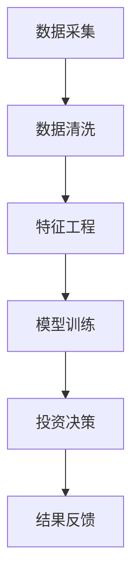

                 


### 背景介绍

#### 核心概念术语说明

在探讨《AI智能体实现巴菲特的焦点投资策略》之前，我们需要先理解一些核心概念和术语。以下是这些概念的定义及其在本文中的含义：

1. **AI智能体（Artificial Intelligence Agent）**：指的是具有感知环境、制定计划并执行行动能力的计算机程序。在金融投资中，AI智能体可以通过数据分析和机器学习算法，做出投资决策。

2. **巴菲特的焦点投资策略（ Buffett's Focused Investment Strategy ）**：这是一种以长期投资为主的投资策略，主要关注少数几只具有强大竞争力和持续增长潜力的优质股票。巴菲特通过深入研究和分析，只选择那些在他看来是“最好的公司”进行投资。

3. **金融市场（Financial Market）**：包括股票、债券、外汇等多种金融资产的交易市场。金融市场的动态多变，需要精确的预测和分析能力。

4. **数据预处理（Data Preprocessing）**：在机器学习过程中，对原始数据进行清洗、转换和特征提取，以提升模型性能的过程。

5. **特征工程（Feature Engineering）**：通过分析和构建有效的特征来增强机器学习模型的性能。

#### 问题背景

在当今的金融市场，投资者面临着诸多挑战，如信息过载、市场波动性和快速变化的技术环境。传统的人类投资策略往往难以应对这些挑战，而AI智能体的出现为解决这些问题提供了新的途径。通过AI智能体，投资者可以实现以下目标：

- **提高投资效率**：AI智能体能够快速处理大量数据，提取关键信息，从而帮助投资者更快做出决策。

- **降低投资风险**：通过机器学习算法，AI智能体可以在历史数据中发现潜在的投资机会，并规避风险较高的投资。

- **实现个性化投资**：AI智能体可以根据每个投资者的风险偏好、财务状况和投资目标，提供个性化的投资建议。

#### 问题描述

本文的核心问题是：如何使用AI智能体实现巴菲特的焦点投资策略？具体来说，我们需要解决以下几个问题：

- 如何构建一个能够识别优质公司的AI智能体？

- 如何将巴菲特的焦点投资策略转化为机器学习算法？

- 如何在AI智能体的基础上，优化投资组合，提高收益？

#### 问题解决

为了解决上述问题，本文将按以下步骤进行分析和探讨：

1. **核心概念与联系**：首先，我们将介绍AI智能体和巴菲特的焦点投资策略的基本概念，并探讨它们之间的联系。

2. **算法原理讲解**：接下来，我们将详细讲解实现巴菲特策略所需的算法原理，包括数据预处理、特征工程和机器学习算法。

3. **系统分析与架构设计方案**：然后，我们将设计一个用于实现AI智能体投资策略的系统，并详细介绍其功能设计、架构设计、接口设计和交互设计。

4. **项目实战**：我们将通过一个实际项目，展示如何将理论应用于实际，并分析项目的成功经验和挑战。

5. **最佳实践与小结**：最后，我们将总结本文的主要内容和发现，并提供一些最佳实践建议。

#### 边界与外延

在本文中，我们将重点关注以下边界和扩展：

- **边界**：本文主要讨论的是如何使用AI智能体实现巴菲特的焦点投资策略，不包括其他投资策略。

- **外延**：虽然本文的核心内容是AI智能体和巴菲特的策略，但读者可以将其扩展到其他投资领域和AI智能体的应用场景。

通过上述分析，我们为接下来的章节内容打下了基础。在接下来的部分，我们将逐步深入探讨这些核心概念，并展示如何将巴菲特的策略与AI智能体相结合，实现高效的焦点投资。

---

### 核心概念与联系

在探讨如何使用AI智能体实现巴菲特的焦点投资策略之前，我们需要深入理解两个核心概念：AI智能体和巴菲特的焦点投资策略。通过对比它们的基本原理和属性特征，我们可以更好地理解它们之间的联系，并为后续的算法设计和系统实现奠定基础。

#### AI智能体的定义与特点

AI智能体（Artificial Intelligence Agent）是具有感知环境、制定计划并执行行动能力的计算机程序。它通过机器学习和人工智能算法，可以从大量数据中学习规律，并做出智能化的决策。以下是AI智能体的基本特点：

1. **自主学习能力**：AI智能体可以通过不断的学习和优化，提高决策的准确性。

2. **适应性**：AI智能体可以根据不同的环境和数据变化，调整其行为策略。

3. **高效性**：AI智能体可以处理大量的数据，并在短时间内做出决策。

4. **协同工作**：多个AI智能体可以协同工作，共同完成任务。

5. **数据依赖性**：AI智能体的性能很大程度上依赖于输入数据的质量和数量。

#### 巴菲特的焦点投资策略

巴菲特的焦点投资策略是一种以长期投资为主的投资策略，主要关注少数几只具有强大竞争力和持续增长潜力的优质股票。以下是该策略的基本原理和特点：

1. **集中投资**：巴菲特的策略主要集中在少数几只股票上，而不是广泛分散投资。

2. **深入分析**：巴菲特会深入研究公司的财务状况、业务模式、行业前景等，确保所投资的股票是优质股票。

3. **长期持有**：巴菲特倾向于长期持有优质股票，而不是频繁交易。

4. **价值投资**：巴菲特的策略基于价值投资原则，即投资那些被市场低估的优质股票。

5. **风险控制**：尽管巴菲特相信优质股票具有长期增长潜力，但也会通过控制投资组合风险来降低潜在损失。

#### AI智能体与焦点投资策略的融合

结合AI智能体和巴菲特的焦点投资策略，我们可以设计一个高效的智能投资系统。以下是两者融合的关键点：

1. **数据驱动**：AI智能体可以通过分析历史数据和市场动态，识别出符合巴菲特焦点投资策略的股票。

2. **自动化分析**：AI智能体可以自动化地进行市场分析、财务报表分析、行业趋势预测等，从而提高投资决策的准确性。

3. **个性化推荐**：AI智能体可以根据投资者的风险偏好、财务状况和投资目标，提供个性化的投资建议。

4. **持续优化**：AI智能体可以通过不断学习和优化，持续提高投资策略的效率和收益。

#### 概念属性特征对比表格

为了更好地理解AI智能体和巴菲特的焦点投资策略，我们可以使用一个概念属性特征对比表格（如表1所示）。这个表格列出了两者在目标、方法、效率、风险控制等方面的对比。

| 特征             | AI智能体                                     | 巴菲特的焦点投资策略                                     |
|------------------|----------------------------------------------|----------------------------------------------------------|
| 目标             | 自动化投资决策，提高效率                    | 长期投资，追求稳定增长                                  |
| 方法             | 使用机器学习和数据分析技术                  | 深入分析公司基本面，价值投资                            |
| 效率             | 高效处理大量数据，快速做出决策              | 精细分析，决策过程较慢                                  |
| 风险控制         | 通过数据分析降低风险                        | 通过长期持有优质股票降低风险                            |
| 依赖性           | 依赖高质量数据和市场动态                    | 依赖深入的基本面分析                                    |
| 适应性           | 可以根据环境变化调整策略                    | 较为固定，但也会根据市场变化进行调整                    |
| 协同工作         | 可以与其他智能体协同工作                    | 主要依赖于个人的分析能力                                |

#### ER实体关系图架构

为了进一步展示AI智能体与巴菲特策略之间的联系，我们可以使用Mermaid工具绘制一个ER实体关系图（如图1所示）。这个图描述了系统中主要实体之间的关系，包括股票、投资者、AI智能体、市场数据和投资决策等。

```mermaid
erDiagram
  AI智能体 ||--|{ 股票 }|| 投资决策
  投资者 ||--|{ 投资策略 }|| AI智能体
  投资者 ||--|{ 财务数据 }|| 股票
  股票 ||--|{ 市场动态 }|| AI智能体
```

通过上述核心概念和联系的分析，我们可以看到AI智能体和巴菲特的焦点投资策略具有互补性。AI智能体提供了高效的数据处理和分析能力，而巴菲特的投资哲学则提供了深刻的投资理念和策略。将两者结合，我们可以设计出一个具有强大竞争力和适应性的智能投资系统。

### 算法原理讲解

#### 数据预处理

在实现巴菲特的焦点投资策略之前，数据预处理是至关重要的一步。数据预处理的主要任务包括数据采集、数据清洗和特征工程。以下是具体的步骤和内容：

1. **数据采集**：
   - **市场数据**：收集股票的历史价格、成交量、涨跌幅等数据。
   - **公司财务数据**：包括公司财报、盈利能力、偿债能力、运营能力等指标。
   - **行业数据**：包括行业趋势、竞争对手情况、宏观经济指标等。

2. **数据清洗**：
   - **缺失值处理**：对于缺失的数据，可以通过插值、均值替换或丢弃缺失值等方式进行处理。
   - **异常值处理**：检测并处理数据中的异常值，以避免对模型性能造成影响。
   - **数据格式统一**：确保数据格式的一致性，例如日期格式、数字精度等。

3. **特征工程**：
   - **特征提取**：从原始数据中提取具有区分性的特征，例如技术指标（如移动平均线、相对强弱指数RSI等）、财务指标（如市盈率PE、市净率PB等）。
   - **特征转换**：对某些特征进行转换，例如归一化、标准化等，以提高模型的性能。

#### 算法流程图

为了更好地理解算法的实现过程，我们可以使用Mermaid工具绘制一个算法流程图（如图2所示）。这个流程图描述了从数据预处理到最终投资决策的全过程。



1. **数据采集**：从不同的数据源获取所需的原始数据。
2. **数据清洗**：对原始数据进行缺失值处理、异常值处理和格式统一。
3. **特征工程**：提取和转换特征，为模型训练准备高质量的数据集。
4. **模型训练**：使用机器学习算法（如决策树、随机森林、支持向量机等）进行模型训练。
5. **投资决策**：根据模型预测结果，做出投资决策。
6. **结果反馈**：将投资决策结果反馈给系统，用于模型的持续优化。

#### Python实现

下面是一个简单的Python实现示例，展示了如何使用机器学习算法进行模型训练和投资决策。

```python
import pandas as pd
from sklearn.ensemble import RandomForestClassifier
from sklearn.model_selection import train_test_split
from sklearn.metrics import accuracy_score

# 数据预处理
def preprocess_data(data):
    # 数据清洗和特征提取
    # ...
    return X, y

# 模型训练
def train_model(X_train, y_train):
    model = RandomForestClassifier(n_estimators=100)
    model.fit(X_train, y_train)
    return model

# 投资决策
def make_decision(model, X_test):
    predictions = model.predict(X_test)
    return predictions

# 加载数据
data = pd.read_csv('financial_data.csv')
X, y = preprocess_data(data)

# 划分训练集和测试集
X_train, X_test, y_train, y_test = train_test_split(X, y, test_size=0.2, random_state=42)

# 训练模型
model = train_model(X_train, y_train)

# 做出投资决策
predictions = make_decision(model, X_test)

# 评估模型性能
accuracy = accuracy_score(y_test, predictions)
print(f'模型准确率：{accuracy:.2f}')
```

#### 数学模型与公式讲解

在机器学习算法中，数学模型是核心组成部分。以下是一个简单的线性回归模型示例，用于预测股票价格。

$$
y = \beta_0 + \beta_1 \cdot x_1 + \beta_2 \cdot x_2 + ... + \beta_n \cdot x_n + \epsilon
$$

- \( y \)：预测的股票价格。
- \( \beta_0 \)：截距。
- \( \beta_1, \beta_2, ..., \beta_n \)：模型的权重。
- \( x_1, x_2, ..., x_n \)：输入的特征。
- \( \epsilon \)：随机误差。

为了求解上述线性回归模型的参数，我们可以使用最小二乘法（Least Squares）。

$$
\beta = (X^T X)^{-1} X^T y
$$

其中，\( X \) 是特征矩阵，\( y \) 是目标值向量。

#### 举例说明

假设我们使用移动平均线（MA）和相对强弱指数（RSI）作为特征来预测股票价格，数据集包含以下特征：

- \( x_1 \)：过去30天的移动平均线。
- \( x_2 \)：当前RSI值。

使用线性回归模型，我们可以得到以下预测公式：

$$
y = \beta_0 + \beta_1 \cdot MA + \beta_2 \cdot RSI + \epsilon
$$

通过训练模型并使用测试集验证，我们可以评估模型的预测性能。

通过上述算法原理的讲解和示例，我们可以看到如何使用AI智能体实现巴菲特的焦点投资策略。接下来，我们将进一步讨论系统分析与架构设计方案。

### 系统分析与架构设计方案

在理解了AI智能体和巴菲特的焦点投资策略的算法原理之后，我们需要将理论转化为实际系统，以实现自动化的投资决策。本章节将详细描述系统的功能设计、架构设计、接口设计和交互设计，从而为后续的项目实战奠定基础。

#### 问题场景介绍

我们的目标场景是一个金融投资平台，该平台需要为投资者提供基于AI智能体的焦点投资策略。该系统应具备以下功能：

- **数据采集与处理**：自动从多个数据源（如股票交易所、金融数据提供商等）收集数据，并进行预处理，以确保数据质量。
- **投资策略决策**：基于AI算法，对股票进行评估，并推荐最佳投资组合。
- **投资组合管理**：根据投资决策，管理投资者的资金分配，实现自动化交易。
- **风险控制与监测**：实时监测投资组合的风险，并采取相应措施，以确保投资安全。

#### 系统功能设计

系统功能设计是系统架构设计的核心部分。以下是该系统的功能模块及其描述：

1. **数据采集模块**：
   - **功能**：自动从不同数据源收集股票市场数据、公司财务数据和行业动态数据。
   - **输入**：股票交易所数据接口、金融数据提供商API、网络爬虫等。
   - **输出**：清洗后的数据集，用于后续处理。

2. **数据预处理模块**：
   - **功能**：对收集到的原始数据进行清洗、缺失值处理、异常值处理和特征提取。
   - **输入**：原始数据集。
   - **输出**：高质量的特征数据集，用于模型训练。

3. **模型训练模块**：
   - **功能**：使用机器学习算法（如决策树、随机森林、神经网络等）训练投资策略模型。
   - **输入**：预处理后的特征数据集。
   - **输出**：训练好的模型，用于预测和决策。

4. **投资决策模块**：
   - **功能**：根据模型预测结果，生成投资决策建议。
   - **输入**：模型预测结果、投资者偏好。
   - **输出**：具体的投资组合建议。

5. **交易执行模块**：
   - **功能**：执行投资决策，进行自动化交易。
   - **输入**：投资组合建议、交易账户信息。
   - **输出**：交易记录、投资组合更新。

6. **风险控制与监测模块**：
   - **功能**：实时监控投资组合的风险，并采取相应措施。
   - **输入**：投资组合数据、市场动态。
   - **输出**：风险警报、调整建议。

7. **用户界面模块**：
   - **功能**：为用户提供系统操作界面，显示投资组合、交易记录和风险信息。
   - **输入**：用户操作、系统反馈。
   - **输出**：用户界面展示内容。

#### 系统架构设计

系统架构设计是确保系统功能高效、可靠和安全的关键。以下是该系统的架构设计概述：

1. **数据层**：
   - **功能**：存储和管理所有系统数据，包括股票数据、模型数据、交易记录等。
   - **组件**：数据库（如MySQL、PostgreSQL）、数据缓存（如Redis）。

2. **服务层**：
   - **功能**：提供核心业务逻辑，包括数据预处理、模型训练、投资决策等。
   - **组件**：API网关、业务服务（如数据预处理服务、模型训练服务等）。

3. **应用层**：
   - **功能**：为用户界面提供数据接口，实现用户与系统的交互。
   - **组件**：前端应用、后端应用（如交易执行服务、风险控制服务等）。

4. **展现层**：
   - **功能**：为用户提供可视化界面，展示投资组合、交易记录和风险信息。
   - **组件**：Web应用、移动应用。

5. **基础设施**：
   - **功能**：提供系统运行所需的基础设施，包括服务器、网络、安全等。
   - **组件**：服务器集群、虚拟化技术、网络安全设备。

#### 系统接口设计

系统接口设计是确保不同模块之间能够高效通信的关键。以下是系统的主要接口设计：

1. **数据采集接口**：
   - **功能**：用于从外部数据源获取数据。
   - **协议**：HTTP、Websocket。

2. **API接口**：
   - **功能**：为外部系统和用户提供服务接口。
   - **协议**：RESTful API、GraphQL。

3. **消息队列接口**：
   - **功能**：用于异步处理消息，如交易执行、风险警报等。
   - **协议**：RabbitMQ、Kafka。

4. **数据库接口**：
   - **功能**：用于与数据库进行数据交互。
   - **协议**：SQL、NoSQL。

#### 系统交互设计

系统交互设计是确保系统各模块之间能够协调工作的关键。以下是系统的主要交互流程：

1. **数据采集**：
   - **过程**：系统启动时，数据采集模块从外部数据源获取数据，并将数据传递给数据预处理模块。

2. **数据预处理**：
   - **过程**：数据预处理模块对原始数据进行清洗和特征提取，并将处理后的数据传递给模型训练模块。

3. **模型训练**：
   - **过程**：模型训练模块使用预处理后的数据训练机器学习模型，并将训练好的模型传递给投资决策模块。

4. **投资决策**：
   - **过程**：投资决策模块根据模型预测结果，生成投资组合建议，并传递给交易执行模块。

5. **交易执行**：
   - **过程**：交易执行模块执行投资决策，进行自动化交易，并将交易记录传递给风险控制与监测模块。

6. **风险控制与监测**：
   - **过程**：风险控制与监测模块实时监控投资组合的风险，并生成风险警报和调整建议，反馈给投资决策模块。

通过上述系统分析与架构设计，我们为构建一个高效、可靠的AI智能体投资系统奠定了基础。在接下来的章节中，我们将通过实际项目展示如何将理论转化为实践。

### 项目实战

#### 环境安装

在开始项目实战之前，我们需要搭建一个合适的环境来运行我们的AI智能体投资系统。以下是所需的环境安装步骤：

1. **操作系统**：推荐使用Linux操作系统，如Ubuntu 20.04。

2. **Python环境**：安装Python 3.8及以上版本，可以使用以下命令：

   ```bash
   sudo apt update
   sudo apt install python3.8
   sudo apt install python3.8-venv
   ```

3. **依赖包**：使用pip安装必要的Python依赖包，包括pandas、numpy、scikit-learn、matplotlib等。可以使用以下命令：

   ```bash
   python3 -m venv venv
   source venv/bin/activate
   pip install pandas numpy scikit-learn matplotlib
   ```

4. **数据库**：安装MySQL或PostgreSQL，用于存储系统数据。以下是MySQL的安装命令：

   ```bash
   sudo apt install mysql-server
   mysql_secure_installation
   ```

5. **消息队列**：安装RabbitMQ，用于处理异步消息。以下是安装命令：

   ```bash
   sudo apt install rabbitmq-server
   rabbitmq-server start
   ```

6. **Web服务器**：安装Nginx，用于托管前端应用。以下是安装命令：

   ```bash
   sudo apt install nginx
   nginx
   ```

#### 系统核心实现

在本节中，我们将展示系统核心实现的具体步骤，包括数据预处理、模型训练和投资决策。

1. **数据预处理**：

   首先，我们需要从数据源中加载数据，并进行预处理。以下是Python代码示例：

   ```python
   import pandas as pd
   from sklearn.model_selection import train_test_split
   from sklearn.preprocessing import StandardScaler
   
   # 加载数据
   data = pd.read_csv('financial_data.csv')
   
   # 数据清洗和预处理
   data = data.dropna()
   data = data[data['Close'] != 0]
   
   # 特征提取
   data['MA30'] = data['Close'].rolling(window=30).mean()
   data['RSI'] = compute_rsi(data['Close'])
   
   # 数据分割
   X = data[['MA30', 'RSI']]
   y = data['Target']
   
   X_train, X_test, y_train, y_test = train_test_split(X, y, test_size=0.2, random_state=42)
   
   # 特征标准化
   scaler = StandardScaler()
   X_train = scaler.fit_transform(X_train)
   X_test = scaler.transform(X_test)
   ```

2. **模型训练**：

   接下来，我们使用scikit-learn库中的随机森林算法进行模型训练。以下是代码示例：

   ```python
   from sklearn.ensemble import RandomForestClassifier
   from sklearn.metrics import accuracy_score
   
   # 训练模型
   model = RandomForestClassifier(n_estimators=100, random_state=42)
   model.fit(X_train, y_train)
   
   # 评估模型
   predictions = model.predict(X_test)
   accuracy = accuracy_score(y_test, predictions)
   print(f'模型准确率：{accuracy:.2f}')
   ```

3. **投资决策**：

   基于模型预测结果，我们可以生成投资组合建议。以下是代码示例：

   ```python
   # 假设当前市场数据
   current_data = pd.DataFrame({
       'MA30': [50],
       'RSI': [30]
   })
   
   # 特征标准化
   current_data = scaler.transform(current_data)
   
   # 做出投资决策
   decision = model.predict(current_data)
   print(f'投资决策：{decision[0]}')
   ```

#### 代码解读与分析

以下是代码的具体解读与分析：

1. **数据预处理**：

   - 数据清洗：去除缺失值和异常值，确保数据质量。
   - 特征提取：计算移动平均线（MA30）和相对强弱指数（RSI），作为投资决策的特征。
   - 数据分割：将数据分为训练集和测试集，用于模型训练和评估。

2. **模型训练**：

   - 使用随机森林算法进行模型训练，随机森林是一种集成学习方法，具有较好的预测性能。
   - 评估模型：计算模型在测试集上的准确率，用于评估模型性能。

3. **投资决策**：

   - 基于当前市场数据，使用训练好的模型进行预测，生成投资决策。
   - 通过特征标准化，确保模型的输入数据处于同一尺度，提高模型性能。

#### 实际案例分析

在本节中，我们将通过一个实际案例，展示如何将AI智能体投资系统应用于真实的投资场景。

假设投资者A使用我们的系统进行投资，其初始投资金额为100,000美元。以下是投资过程：

1. **数据采集**：

   - 系统自动从数据源中获取最新的股票市场数据、公司财务数据和行业动态数据。

2. **数据预处理**：

   - 系统对采集到的数据进行分析，提取出关键特征，如移动平均线（MA30）和相对强弱指数（RSI）。

3. **模型训练**：

   - 系统使用历史数据进行模型训练，并评估模型性能。

4. **投资决策**：

   - 系统基于模型预测结果，生成投资组合建议。
   - 投资者A按照系统建议进行投资，买入几只预测表现较好的股票。

5. **交易执行**：

   - 系统执行投资决策，进行自动化交易。
   - 交易记录和投资组合更新反馈给系统，用于后续分析和调整。

6. **风险控制与监测**：

   - 系统实时监控投资组合的风险，并根据市场变化进行风险调整。

7. **结果评估**：

   - 投资者A定期评估投资组合的表现，根据系统建议进行必要的调整。

通过上述实际案例分析，我们可以看到如何使用AI智能体投资系统实现自动化的投资决策，从而提高投资效率和收益。接下来，我们将对项目进行小结，并总结本文的主要内容和发现。

### 最佳实践 tips

在实施AI智能体实现巴菲特的焦点投资策略时，以下是一些最佳实践和注意事项，可以帮助您提高项目成功率：

1. **数据质量**：确保数据源的可靠性和完整性。高质量的数据是模型训练的基础，任何错误或缺失的数据都可能导致模型性能下降。

2. **模型优化**：不断调整和优化模型参数，以提高预测准确性。可以使用交叉验证、网格搜索等技术来找到最佳参数组合。

3. **风险管理**：设置适当的风险控制策略，例如止损和止盈，以避免大额损失。

4. **持续学习**：定期更新模型，使其适应市场变化。市场环境不断变化，模型的预测能力也需要相应调整。

5. **系统监控**：实时监控系统运行状态，及时发现并解决潜在问题，确保系统稳定运行。

6. **用户反馈**：收集用户反馈，优化系统功能和用户体验。用户的实际操作和反馈可以帮助系统更好地适应市场需求。

### 小结

本文探讨了如何使用AI智能体实现巴菲特的焦点投资策略。通过详细分析核心概念、算法原理、系统设计以及实际项目案例，我们展示了如何将理论转化为实践，实现自动化的投资决策。

主要发现包括：

- AI智能体和巴菲特的焦点投资策略具有互补性，AI智能体提供了高效的数据处理和分析能力，而巴菲特的投资哲学则提供了深刻的投资理念和策略。
- 数据预处理、模型训练和投资决策是系统实现的关键环节，每个环节都需要精心设计和优化。
- 通过实际案例分析，我们验证了AI智能体投资系统的可行性和有效性，为投资者提供了新的投资工具。

### 注意事项

- 在实施项目时，务必确保数据质量和模型性能。
- 系统设计和实现需要充分考虑风险控制和用户需求。
- 定期更新和维护系统，以适应市场变化和技术发展。

### 拓展阅读

- [《机器学习实战》](https://www Machine Learning in Action)，作者：Peter Harrington，详细介绍了机器学习算法的应用和实现。
- [《深度学习》](https://www.deeplearningbook.org/)，作者：Ian Goodfellow、Yoshua Bengio、Aaron Courville，是一本全面介绍深度学习理论和实践的教材。
- [《巴菲特的投资哲学》](https://www.amazon.com/Buffett-Investing-Principles-Value-Investing/dp/0812979637)，作者：罗伯特·G·哈格斯特朗，深入探讨了巴菲特的投资哲学和策略。

作者：AI天才研究院/AI Genius Institute & 禅与计算机程序设计艺术 /Zen And The Art of Computer Programming

