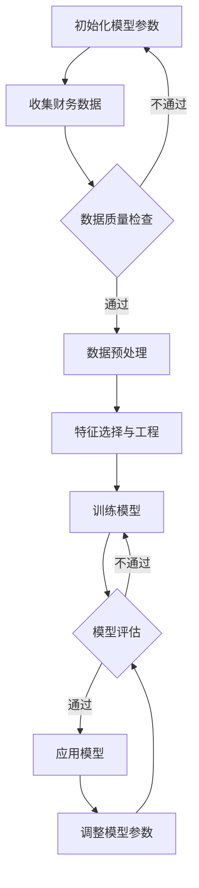

                 

## AI辅助的企业Working Capital优化

### 关键词：人工智能、工作资本、优化、财务分析、机器学习

### 摘要：
本文将深入探讨如何利用人工智能（AI）技术来优化企业的Working Capital（工作资本）。我们将从背景介绍、核心概念、算法原理、应用场景、系统架构、项目实战和最佳实践等多个角度，逐步分析AI辅助企业工作资本优化的实施路径与策略。文章旨在为读者提供清晰的指导，帮助他们在实际业务中应用AI技术，提升企业财务管理水平和运营效率。

---

### 1. 背景介绍

#### 1.1 问题背景

**工作资本的概念**

工作资本是指企业在日常运营中所需的资金，它包括流动资产（如现金、应收账款、存货等）和流动负债（如应付账款、短期借款等）。维持合适的工作资本水平对于企业的正常运转至关重要。

**企业工作资本的优化需求**

在激烈的市场竞争中，企业需要不断优化工作资本以降低运营成本、提高资金利用效率。传统的工作资本管理往往依赖于人工分析和经验，难以适应快速变化的市场环境。

**AI技术在企业财务优化中的应用潜力**

随着AI技术的发展，利用机器学习算法对大量财务数据进行分析，可以帮助企业更精准地预测资金需求、优化应收账款和存货管理，从而实现工作资本的优化。

#### 1.2 核心概念与联系

**AI概述**

- **定义与分类**：AI是一门模拟、延伸和扩展人类智能的科学，包括机器学习、深度学习、自然语言处理等多个分支。
- **核心原理**：AI通过算法模拟人类思维过程，如学习、推理、感知等，来实现特定任务。

**工作资本分析**

- **定义**：工作资本是企业为了维持正常运营所需的流动资产。
- **关键指标**：包括应收账款周转率、存货周转率、现金周转率等。

#### 1.3 企业财务优化的重要性

**企业财务优化的定义**

财务优化是指通过改进财务策略、优化资金使用效率，来实现企业的财务目标。

**企业财务优化的目标**

- 降低运营成本
- 提高资金利用效率
- 增强企业的市场竞争能力

**AI辅助财务优化的优势**

- **提高预测精度**：通过分析大量历史数据，AI可以更准确地预测未来资金需求。
- **自动化流程**：AI可以自动化应收账款催收、库存管理等流程，提高工作效率。
- **实时监控**：AI可以实时监控财务数据，为企业提供即时决策支持。

#### 1.4 边界与外延

**AI辅助企业工作资本优化的边界条件**

- 数据质量：AI算法的效果高度依赖于数据质量，因此需要确保数据的准确性和完整性。
- 模型适应性：AI模型需要不断调整和优化，以适应不断变化的市场环境。

**企业工作资本优化中AI应用的外延**

- **应收账款管理**：包括预测应收账款回收时间、优化催收策略等。
- **存货管理**：包括预测存货需求、优化库存配置等。
- **融资决策**：基于AI预测资金需求，为企业提供最佳融资方案。

#### 1.5 本章小结

通过对工作资本和AI技术的基本概念进行介绍，以及探讨AI在财务优化中的应用优势，本文为后续章节的深入讨论奠定了基础。接下来的章节将详细分析AI技术在企业工作资本优化中的应用原理和具体实践。

### 2. AI技术在企业工作资本优化中的应用

#### 2.1 AI核心算法原理

**机器学习基础**

**机器学习概述**

机器学习是AI的一个分支，它通过算法从数据中学习规律，并利用这些规律进行预测或决策。

**机器学习的数学基础**

机器学习算法依赖于线性代数、微积分、概率论等数学知识。例如，线性回归、逻辑回归等算法的核心在于建立输入和输出之间的数学模型。

**数据分析技术**

**数据预处理**

数据预处理是数据分析的重要步骤，包括数据清洗、数据集成、数据变换等。例如，缺失值处理、异常值检测和归一化。

**特征选择与工程**

特征选择和工程是提高模型性能的关键环节。通过选择合适的特征并进行变换，可以降低模型的复杂度和过拟合风险。

**深度学习**

**深度学习概述**

深度学习是机器学习的一个重要分支，它通过构建多层神经网络来提取数据中的高阶特征。

**深度学习架构**

常见的深度学习架构包括卷积神经网络（CNN）、循环神经网络（RNN）和变换器（Transformer）等。每种架构都有其特定的应用场景和优势。

#### 2.2 数学模型和公式讲解

**工作资本优化的数学模型**

工作资本优化的核心在于确定最优的流动资产和流动负债水平，以满足企业的运营需求。其基本模型可以表示为：

$$
\text{优化目标} = \min \sum_{i} w_i \cdot (A_i - L_i)
$$

其中，\(A_i\) 表示第 \(i\) 类流动资产，\(L_i\) 表示第 \(i\) 类流动负债，\(w_i\) 表示第 \(i\) 类资产或负债的权重。

**算法原理与Mermaid流程图**

Mermaid流程图是一种使用Markdown标记语言绘制的流程图。以下是一个简单的Mermaid流程图示例，用于描述工作资本优化的基本流程：



**算法原理讲解**

工作资本优化的算法原理基于机器学习和深度学习。首先，通过收集和预处理财务数据，然后使用机器学习算法（如线性回归、决策树、神经网络等）建立预测模型。接下来，根据模型预测结果调整企业的流动资产和流动负债，以达到优化工作资本的目的。

#### 2.3 AI在企业工作资本优化中的应用场景

**应收账款管理**

应收账款管理是工作资本优化的重要一环。AI技术可以用于以下几个方面：

- **应收账款预测**：通过分析历史数据，预测未来的应收账款回收时间，帮助企业制定合理的收款策略。
- **应收账款催收**：利用自然语言处理技术，自动生成催收邮件或短信，提高催收效率。

**存货管理**

存货管理是另一个关键领域。AI技术可以用于以下几个方面：

- **存货水平预测**：通过分析历史销售数据和市场需求，预测未来的存货水平，帮助企业制定合理的库存策略。
- **库存优化**：通过优化库存配置，降低库存成本，提高资金利用效率。

**融资决策**

AI技术还可以帮助企业做出更明智的融资决策。通过分析财务数据和市场环境，AI可以预测企业的资金需求，并提供最佳的融资方案。

#### 2.4 AI与企业工作资本优化的整合

**AI与企业财务管理流程的整合**

为了实现AI与企业工作资本优化的整合，需要将AI技术融入到企业的财务管理流程中。以下是一个简单的整合方案：

1. **数据收集与预处理**：从各个业务系统中收集财务数据，并进行预处理，确保数据质量。
2. **模型训练与部署**：使用收集到的数据训练AI模型，并将其部署到生产环境中。
3. **实时监控与调整**：实时监控模型预测结果，并根据实际情况进行调整。

**AI在财务分析中的应用**

AI在财务分析中的应用主要体现在以下几个方面：

- **财务报表分析**：通过分析财务报表，帮助企业了解财务状况，发现潜在的问题。
- **财务预测**：通过分析历史数据，预测未来的财务状况，为企业制定战略规划提供支持。

**AI在决策支持系统中的应用**

AI在决策支持系统中的应用可以帮助企业做出更明智的决策。以下是一个简单的决策支持系统架构：

1. **数据采集与预处理**：从各个业务系统中收集数据，并进行预处理。
2. **数据分析和预测**：使用AI模型对数据进行分析和预测，提供决策支持。
3. **用户界面**：为用户提供一个友好的界面，展示分析结果和预测结果，帮助用户做出决策。

#### 2.5 AI辅助工作资本优化案例分析

**案例一：某制造企业AI辅助应收账款管理**

某制造企业通过引入AI技术，对其应收账款管理进行了优化。具体做法如下：

1. **数据收集**：从企业ERP系统中收集历史应收账款数据。
2. **数据预处理**：对数据进行了清洗和预处理，确保数据质量。
3. **模型训练**：使用机器学习算法训练了应收账款预测模型。
4. **模型部署**：将训练好的模型部署到生产环境中，进行实时预测。
5. **结果分析**：根据模型预测结果，制定了新的应收账款管理策略。

通过AI技术的应用，该企业的应收账款回收周期明显缩短，资金利用效率提高，运营成本降低。

**案例二：某零售企业AI辅助存货管理**

某零售企业通过引入AI技术，对其存货管理进行了优化。具体做法如下：

1. **数据收集**：从企业CRM系统和库存管理系统中收集历史销售数据和库存数据。
2. **数据预处理**：对数据进行了清洗和预处理，确保数据质量。
3. **模型训练**：使用机器学习算法训练了存货水平预测模型。
4. **模型部署**：将训练好的模型部署到生产环境中，进行实时预测。
5. **结果分析**：根据模型预测结果，调整了库存配置，降低了库存成本。

通过AI技术的应用，该企业的存货周转率显著提高，库存资金利用效率得到优化。

#### 2.6 本章小结

通过本章节的讨论，我们了解了AI技术在企业工作资本优化中的应用原理和具体实践。接下来，我们将进一步探讨如何在实际项目中应用这些技术，以实现企业工作资本的优化。

### 3. 实际应用与最佳实践

#### 3.1 实际应用概述

**AI辅助企业工作资本优化项目的实施流程**

一个典型的AI辅助企业工作资本优化项目通常包括以下步骤：

1. **需求分析**：明确项目目标，了解企业的财务状况和业务流程。
2. **数据收集**：从企业ERP系统、CRM系统等业务系统中收集财务数据。
3. **数据预处理**：对数据进行清洗、整合和预处理，确保数据质量。
4. **模型选择与训练**：选择合适的机器学习算法，对数据进行训练，建立预测模型。
5. **模型评估与优化**：评估模型性能，根据评估结果调整模型参数，优化模型。
6. **模型部署与应用**：将训练好的模型部署到生产环境中，进行实时预测和应用。
7. **监控与维护**：对模型进行实时监控，定期更新数据集，确保模型的准确性。

**AI辅助工作资本优化的实施步骤**

1. **定义目标**：明确企业的工作资本优化目标，如降低运营成本、提高资金利用效率等。
2. **数据收集**：从企业各个业务系统中收集相关的财务数据，包括现金流、应收账款、存货等。
3. **数据预处理**：对收集到的数据进行清洗、去噪、整合和标准化，确保数据的质量和一致性。
4. **特征工程**：选择和构造与工作资本优化相关的特征，如历史销售数据、市场趋势、客户信用评分等。
5. **模型选择**：根据数据特点和业务需求，选择合适的机器学习算法，如线性回归、决策树、神经网络等。
6. **模型训练与评估**：使用训练集对模型进行训练，并在验证集上评估模型性能，调整模型参数。
7. **模型部署**：将训练好的模型部署到生产环境中，进行实时预测和应用。
8. **结果分析与反馈**：对模型预测结果进行分析，根据实际情况调整业务流程和策略。
9. **迭代与优化**：根据业务需求和模型性能，不断迭代和优化模型，提高预测准确性。

#### 3.2 环境安装与配置

**硬件与软件环境配置**

为了运行AI辅助企业工作资本优化项目，需要准备以下硬件和软件环境：

- **硬件要求**：
  - CPU：至少双核处理器，推荐使用四核或更高性能的处理器。
  - 内存：至少8GB内存，推荐使用16GB或更高内存。
  - 硬盘：至少500GB的硬盘空间，推荐使用固态硬盘（SSD）。
  - GPU（可选）：如果使用深度学习算法，推荐配备NVIDIA GPU，如Tesla K40、Tesla P100等。

- **软件要求**：
  - 操作系统：Linux或Windows，推荐使用Linux发行版，如Ubuntu 18.04。
  - 编程语言：Python 3.x，推荐使用Anaconda发行版，方便管理和安装相关库。
  - 数据库：MySQL、PostgreSQL或其他关系型数据库，用于存储财务数据。
  - 数据处理工具：NumPy、Pandas等Python库，用于数据处理和分析。
  - 机器学习库：scikit-learn、TensorFlow、PyTorch等，用于构建和训练机器学习模型。

**数据库与数据集准备**

1. **数据库安装与配置**：

   - 安装MySQL或PostgreSQL数据库。
   - 创建一个新的数据库，用于存储企业的财务数据。
   - 创建相应的数据表，定义字段和数据类型。

2. **数据集准备**：

   - 从企业ERP系统、CRM系统等业务系统中导出相关的财务数据。
   - 将导出的数据导入到数据库中，并进行必要的预处理，如数据清洗、去噪、整合等。
   - 对数据集进行划分，分为训练集、验证集和测试集，用于模型训练、评估和测试。

#### 3.3 系统核心实现

**系统架构设计**

系统架构设计是AI辅助企业工作资本优化项目的关键环节，它决定了系统的扩展性、稳定性和可维护性。以下是一个典型的系统架构设计：

1. **数据层**：

   - 数据库：用于存储企业的财务数据，包括现金流、应收账款、存货等。
   - 数据仓库：用于存储历史数据和统计报表，支持数据分析和决策支持。

2. **应用层**：

   - 数据处理模块：负责数据的清洗、预处理和特征工程。
   - 模型训练模块：负责机器学习模型的训练和评估。
   - 预测模块：负责实时预测和决策支持。

3. **表示层**：

   - 前端界面：用于展示预测结果和分析报表。
   - API接口：用于与其他系统进行数据交换和集成。

**系统接口设计与实现**

系统接口设计是确保系统模块之间能够无缝协作的关键。以下是一个简单的接口设计：

- **数据采集接口**：用于从ERP系统、CRM系统等业务系统中采集财务数据。
- **数据处理接口**：用于对采集到的数据进行清洗、预处理和特征工程。
- **模型训练接口**：用于训练机器学习模型。
- **预测接口**：用于生成预测结果和分析报表。
- **数据存储接口**：用于将处理结果和预测结果存储到数据库或数据仓库中。

**系统交互设计与实现**

系统交互设计描述了各个模块之间的交互逻辑和数据流。以下是一个简单的系统交互设计：

1. **数据采集**：从ERP系统、CRM系统等业务系统中采集财务数据，通过数据采集接口将数据传输到数据处理模块。
2. **数据处理**：数据处理模块对采集到的财务数据进行清洗、预处理和特征工程，将处理后的数据传输到模型训练模块。
3. **模型训练**：模型训练模块使用训练集对机器学习模型进行训练，评估模型性能，并将训练结果传输到预测模块。
4. **预测**：预测模块使用训练好的模型对新的数据进行预测，生成预测结果和分析报表。
5. **存储与展示**：将预测结果和分析报表存储到数据库或数据仓库中，并通过前端界面进行展示。

#### 3.4 代码应用解读与分析

**Python代码实现**

以下是一个简单的Python代码实现，用于训练一个线性回归模型，预测企业的应收账款回收时间。

```python
import pandas as pd
import numpy as np
from sklearn.linear_model import LinearRegression
from sklearn.model_selection import train_test_split
from sklearn.metrics import mean_squared_error

# 数据集准备
data = pd.read_csv('financial_data.csv')
X = data[['sales', 'credit_score']]
y = data['days_to_recover']

# 数据集划分
X_train, X_test, y_train, y_test = train_test_split(X, y, test_size=0.2, random_state=42)

# 模型训练
model = LinearRegression()
model.fit(X_train, y_train)

# 预测
y_pred = model.predict(X_test)

# 评估
mse = mean_squared_error(y_test, y_pred)
print(f'Mean Squared Error: {mse}')

# 预测结果可视化
import matplotlib.pyplot as plt

plt.scatter(y_test, y_pred)
plt.xlabel('Actual Days')
plt.ylabel('Predicted Days')
plt.title('Actual vs Predicted Days to Recover')
plt.show()
```

**代码解析与优化建议**

1. **数据预处理**：在训练模型之前，应确保数据的质量和一致性。例如，对缺失值进行填充，对异常值进行检测和处理。
2. **特征选择**：选择与预测目标高度相关的特征，避免冗余特征。可以通过特征选择算法（如递归特征消除RFE）来优化特征集合。
3. **模型评估**：使用多种评估指标（如MSE、RMSE、MAE等）来评估模型性能，选择最佳模型。
4. **模型调整**：根据评估结果，调整模型参数，优化模型性能。例如，调整正则化参数、批量大小、学习率等。
5. **模型集成**：考虑使用模型集成方法（如随机森林、梯度提升树等）来提高预测准确性。

#### 3.5 项目实战

**实际案例**

以下是一个实际的AI辅助企业工作资本优化项目案例。

**项目介绍**：

某制造企业希望通过引入AI技术，优化其应收账款管理，降低运营成本，提高资金利用效率。

**系统功能设计**：

- **应收账款预测**：使用机器学习模型预测未来的应收账款回收时间。
- **应收账款催收**：基于预测结果，自动生成催收邮件或短信，提高催收效率。
- **数据监控**：实时监控应收账款数据，发现潜在的问题。

**系统架构设计**：

1. **数据层**：使用MySQL数据库存储财务数据，包括应收账款、现金流、客户信息等。
2. **应用层**：包括数据处理模块、模型训练模块和预测模块。
3. **表示层**：包括前端界面和API接口。

**系统接口设计与实现**：

- **数据采集接口**：从企业ERP系统采集应收账款数据。
- **数据处理接口**：对采集到的数据进行清洗、预处理和特征工程。
- **模型训练接口**：使用训练集对机器学习模型进行训练。
- **预测接口**：使用训练好的模型预测未来的应收账款回收时间。
- **数据存储接口**：将处理结果和预测结果存储到MySQL数据库。

**实际案例分析**

1. **数据采集**：从ERP系统中导出应收账款数据，包括客户ID、应收账款金额、预计回收日期等。
2. **数据预处理**：对数据进行清洗，去除缺失值和异常值，对日期进行标准化处理。
3. **特征工程**：选择与应收账款回收时间相关的特征，如客户信用评分、历史回收记录等，进行特征工程。
4. **模型训练**：使用线性回归模型进行训练，评估模型性能。
5. **预测**：使用训练好的模型预测未来的应收账款回收时间。
6. **结果分析**：根据预测结果，制定新的催收策略，提高催收效率。
7. **迭代优化**：根据实际情况，不断调整模型参数，优化模型性能。

**项目小结**

通过实际案例，我们展示了如何利用AI技术优化企业的应收账款管理。项目的成功实施不仅降低了运营成本，提高了资金利用效率，还为企业的财务管理提供了有力的支持。

#### 3.6 最佳实践 tips

**AI辅助企业工作资本优化的最佳实践**

1. **数据质量保证**：确保数据质量是AI模型成功的关键。进行数据清洗、去噪、标准化等预处理操作，保证数据的准确性和一致性。
2. **特征选择与工程**：选择与预测目标高度相关的特征，避免冗余特征。进行特征工程，提高模型的预测性能。
3. **模型评估与调整**：使用多种评估指标评估模型性能，根据评估结果调整模型参数，优化模型。
4. **实时监控与反馈**：实时监控模型预测结果，根据实际情况进行调整，确保模型的准确性。
5. **系统集成与优化**：将AI技术与企业的财务管理流程进行整合，实现数据的自动采集、处理和预测，提高系统的效率。

**避免常见错误**

1. **数据不足**：确保有足够多的数据用于训练模型，避免数据不足导致模型过拟合。
2. **模型选择不当**：根据数据特点和业务需求选择合适的模型，避免使用不适合的模型。
3. **参数调整不当**：合理调整模型参数，避免参数调整不当导致模型性能下降。
4. **模型部署与维护不足**：确保模型部署到生产环境中，并进行定期维护和更新，避免模型失效。

#### 3.7 本章小结

通过本章节的讨论，我们了解了AI辅助企业工作资本优化的实际应用流程和最佳实践。在实际项目中，需要结合企业实际情况，灵活运用AI技术，实现工作资本的优化。下一章节将介绍如何在实际项目中实施AI辅助企业工作资本优化，并提供具体案例。

---

### 总结与展望

通过本文的详细探讨，我们揭示了人工智能（AI）在优化企业工作资本中的巨大潜力。从背景介绍、核心概念到算法原理，再到实际应用和最佳实践，我们逐步分析了如何利用AI技术提升企业的财务管理效率和资金利用效率。

**核心要点回顾**：

1. **背景介绍**：我们了解了工作资本的概念和优化需求，以及AI技术在企业财务优化中的应用潜力。
2. **核心概念与联系**：我们深入探讨了AI的基本原理和工作资本分析的关键指标。
3. **AI技术原理**：我们详细阐述了机器学习、深度学习等AI核心算法原理，以及它们在工作资本优化中的应用。
4. **应用场景**：我们分析了AI在应收账款管理和存货管理中的应用场景，展示了AI技术的具体应用实例。
5. **系统设计与实现**：我们介绍了AI辅助企业工作资本优化的系统架构设计、接口设计和代码实现。
6. **项目实战**：我们通过实际案例展示了AI技术在企业工作资本优化中的成功应用。
7. **最佳实践**：我们提供了AI辅助企业工作资本优化的最佳实践，并提醒了常见的实施错误。

**未来展望**：

随着AI技术的不断进步，未来在企业工作资本优化中的应用将更加广泛和深入。以下是一些可能的趋势和方向：

1. **更智能的数据分析**：随着数据量的增加和数据种类的丰富，AI将能够更准确地分析数据，提供更精细的财务预测和优化建议。
2. **实时优化**：实时监控和调整工作资本，实现动态优化，以应对快速变化的市场环境。
3. **多领域整合**：将AI技术与供应链管理、风险管理等领域进行整合，提供更全面的财务管理解决方案。
4. **智能化决策支持**：利用AI技术为企业提供更智能的决策支持，帮助企业实现长期战略目标。

总之，AI辅助的企业工作资本优化不仅是一个技术问题，更是一个战略问题。通过有效地利用AI技术，企业可以实现更高效、更智能的财务管理，从而在激烈的市场竞争中占据优势地位。

**作者信息**：

作者：AI天才研究院/AI Genius Institute & 禅与计算机程序设计艺术 /Zen And The Art of Computer Programming

---

感谢您的阅读，希望本文能为您在AI辅助企业工作资本优化领域的实践提供有益的启示和指导。

