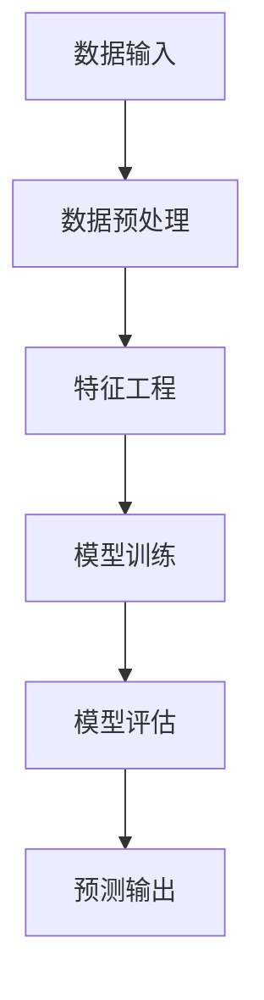

                 

### 第一部分：问题背景与核心概念

#### 第1章：问题背景

##### 1.1 信用周期的概念

**信用周期的定义**：信用周期是指企业从借款到还款的整个过程。在这个过程中，企业可能会面临各种不确定因素，如市场变化、内部管理问题等，这些因素都会对信用周期产生重要影响。

**信用周期的重要性**：信用周期对企业资金流转、风险管理等具有重要意义。一个合理的信用周期可以确保企业的资金流转顺畅，降低资金成本，提高资金使用效率。同时，准确的信用周期预测可以帮助企业提前识别潜在的风险，采取有效的风险控制措施，确保企业的稳定运营。

##### 1.2 企业信用风险

**信用风险的定义**：信用风险是指企业因借款无法按期偿还而导致的风险。信用风险通常分为贷款风险、贸易风险和信用违约风险等类型。

**信用风险的影响**：信用风险可能导致企业资金链断裂，影响企业的运营和发展。如果企业无法按时偿还借款，可能会面临高额的罚息和违约金，进一步加重财务负担。此外，信用风险还可能影响企业的声誉，降低其在资本市场上的融资能力。

##### 1.3 传统信用周期预测方法

**传统方法**：传统信用周期预测方法主要包括财务报表分析、信用评级等。

**财务报表分析**：通过对企业的财务报表进行分析，评估企业的财务状况，预测其还款能力。

**信用评级**：根据企业的信用记录、财务状况、行业地位等因素，对企业的信用等级进行评估，预测其还款能力。

**传统方法的局限性**：传统方法主要依赖于人工分析和主观判断，数据依赖性强，预测结果不准确。同时，传统方法难以应对复杂多变的市场环境，难以满足企业对信用周期预测的实时性需求。

#### 第2章：核心概念

##### 2.1 AI在信用周期预测中的应用

**AI的定义**：人工智能，指由人制造出来的系统能够思考、学习和行动。人工智能通过模拟人类的思维过程，实现对复杂问题的自动求解。

**AI在信用周期预测中的应用**：利用机器学习算法对大量数据进行挖掘和分析，提高预测准确性。机器学习算法可以从历史数据中学习到企业的信用周期规律，从而实现对未来的预测。

##### 2.2 机器学习算法

**机器学习算法的定义**：一种通过数据学习规律，自动进行预测和决策的技术。机器学习算法分为监督学习、无监督学习和半监督学习等类型。

**常用机器学习算法**：如线性回归、决策树、神经网络等。这些算法可以处理不同类型的数据和问题，适用于各种信用周期预测场景。

##### 2.3 数据预处理

**数据预处理的重要性**：确保数据质量，提高预测模型的性能。数据预处理包括数据清洗、归一化、特征选择等步骤。

**数据预处理方法**：如缺失值处理、异常值处理、数据标准化等。这些方法可以消除数据中的噪声和异常，提取有用的信息，为预测模型提供高质量的数据输入。

#### 第3章：模型构建

##### 3.1 模型构建流程

**数据收集与处理**：收集企业历史信用数据，进行预处理。数据预处理包括数据清洗、归一化、特征选择等步骤。

**特征工程**：提取与企业信用周期相关的特征。特征工程是提高预测模型性能的关键步骤。

**模型选择与训练**：选择合适的机器学习算法，进行模型训练。模型训练是建立预测模型的核心步骤，通过训练数据学习到信用周期的规律。

##### 3.2 模型评估

**评估指标**：如准确率、召回率、F1值等。评估指标用于衡量预测模型的性能。

**模型优化**：根据评估结果对模型进行调整和优化。模型优化可以进一步提高预测准确性。

---

### 第二部分：算法原理讲解

#### 第4章：机器学习算法原理

##### 4.1 线性回归

**线性回归模型**：通过线性模型来预测企业信用周期。线性回归模型是一种简单的预测模型，通过拟合一条直线来预测目标变量。

**数学模型与公式**：
$$ Y = \beta_0 + \beta_1X + \epsilon $$
其中，\( Y \) 为目标变量（信用周期），\( X \) 为自变量（企业特征），\( \beta_0 \) 和 \( \beta_1 \) 为模型的参数，\( \epsilon \) 为误差项。

**Python源代码**：
```python
# TODO: 留白，后续填充具体代码实现
```

##### 4.2 决策树

**决策树模型**：通过树形结构来预测企业信用周期。决策树模型是一种树形结构，通过一系列的规则和条件来判断企业的信用周期。

**算法原理与流程图**：


**Python源代码**：
```python
# TODO: 留白，后续填充具体代码实现
```

##### 4.3 神经网络

**神经网络模型**：通过多层神经网络来预测企业信用周期。神经网络模型是一种模拟人脑的算法，通过多个神经元层来提取和传递信息。

**数学模型与公式**：
$$ a_{i}^{(l)} = \sigma (z_{i}^{(l)}) $$
$$ z_{i}^{(l)} = \sum_{j} w_{ji}^{(l)}a_{j}^{(l-1)} + b_{i}^{(l)} $$
其中，\( a_{i}^{(l)} \) 为第 \( l \) 层第 \( i \) 个神经元的激活值，\( z_{i}^{(l)} \) 为第 \( l \) 层第 \( i \) 个神经元的输入值，\( w_{ji}^{(l)} \) 和 \( b_{i}^{(l)} \) 为模型的参数，\( \sigma \) 为激活函数。

**Python源代码**：
```python
# TODO: 留白，后续填充具体代码实现
```

---

### 第三部分：系统分析与架构设计

#### 第5章：系统架构设计

##### 5.1 系统功能设计

**功能需求**：根据企业信用周期预测的需求，设计系统功能。系统功能主要包括数据收集与处理、特征工程、模型训练与评估、预测输出等。

**领域模型**：
```mermaid
classDiagram
class 企业
    - 借款金额
    - 借款期限
    - 还款金额
    - 是否按时还款
class 数据库
    - 存储企业信用数据
class 模型训练模块
    - 输入企业数据
    - 输出信用周期预测结果
企业 -> 数据库 : 存储数据
企业 -> 模型训练模块 : 提供数据
```

##### 5.2 系统架构设计

**系统架构设计**：介绍系统架构的组成部分和各部分之间的关系。系统架构包括数据层、服务层和展示层等。

**系统架构图**：


##### 5.3 系统接口设计

**接口设计**：详细描述系统内部和外部的接口。系统接口包括数据接口、服务接口和展示接口等。

**接口文档**：

---

### 第四部分：项目实战

#### 第6章：项目实战

**项目实战**：本章节将详细介绍一个基于AI的企业信用周期预测项目。项目包括环境安装、系统核心实现、代码应用解读与分析、实际案例分析和详细讲解剖析等内容。

**环境安装**：介绍项目所需的开发环境，如Python、Scikit-learn、TensorFlow等。

**系统核心实现**：展示项目的主要功能实现，包括数据预处理、特征工程、模型训练与评估等。

**代码应用解读与分析**：对项目的核心代码进行解读和分析，解释代码的实现原理和作用。

**实际案例分析和详细讲解剖析**：通过实际案例展示项目的应用效果，并对案例进行详细讲解和剖析。

**项目小结**：对项目进行总结，分享项目中的经验和收获。

---

### 最佳实践 tips、小结、注意事项、拓展阅读等内容

**最佳实践 tips**：在信用周期预测项目中，需要注意以下几点：

1. 数据质量：确保数据的质量，进行数据清洗和预处理，以提高预测准确性。
2. 特征选择：选择与企业信用周期相关的特征，进行特征工程，提取有用的信息。
3. 模型选择：根据数据特点和预测任务选择合适的机器学习算法，进行模型训练和评估。

**小结**：本文介绍了AI辅助的企业信用周期预测模型，从问题背景、核心概念、算法原理到系统架构设计和项目实战，全面讲解了企业信用周期预测的方法和应用。

**注意事项**：在实施信用周期预测项目时，需要关注数据质量和特征选择，选择合适的机器学习算法，并进行模型优化，以提高预测准确性。

**拓展阅读**：

1. 《机器学习实战》：提供丰富的机器学习算法实现和案例，适合初学者和进阶者。
2. 《深度学习》：介绍深度学习的基本原理和应用，包括神经网络、卷积神经网络等。
3. 《Python数据科学手册》：涵盖数据科学中的各种技术和方法，包括数据预处理、特征工程、机器学习等。

