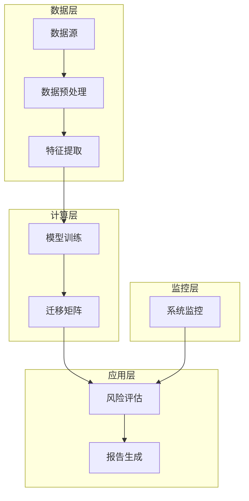
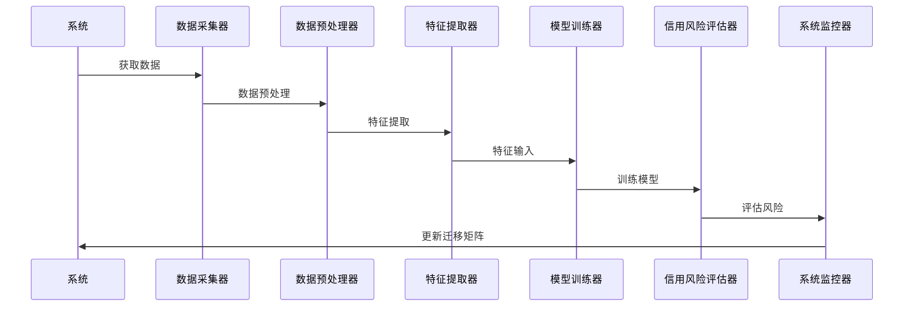

                 


### 引言与背景介绍

#### 1.1 问题背景

企业信用迁移矩阵是一种用于评估企业信用风险转移的模型，其核心在于通过分析不同信用等级的企业在特定市场环境下的迁移概率，帮助企业预测和管理潜在的信用风险。在金融、保险、银行等高风险行业中，企业信用迁移矩阵的重要性不言而喻。然而，传统的信用风险评估方法在处理复杂的数据和动态的市场环境时，往往存在一定的局限性。

#### 1.2 问题描述

在当前的信用风险评估中，主要面临以下几个问题：

1. **数据复杂性**：企业信用数据包含大量的非结构化数据，如财务报表、经营状况、市场环境等，如何有效整合和处理这些数据，成为一个挑战。
2. **动态变化**：市场环境和企业信用状况是动态变化的，如何及时调整和更新信用迁移矩阵，以保证评估的准确性，是一个难题。
3. **模型精度**：传统的模型在处理复杂问题和动态环境时，往往无法达到预期的精度，如何提高模型精度，是亟待解决的问题。

#### 1.3 问题解决

为了解决上述问题，本文提出了一种基于人工智能（AI）的企业信用迁移矩阵估计方法。通过引入机器学习和大数据分析技术，本文旨在提高信用迁移矩阵的估计精度和动态适应性，从而为企业信用风险管理提供更有效的工具。

#### 1.4 边界与外延

本文的研究主要关注以下几个方面：

1. **数据边界**：本文将主要使用公开的、已验证的信用数据集，以避免数据质量问题对研究结果的影响。
2. **方法边界**：本文将主要探讨机器学习在信用迁移矩阵估计中的应用，不包括其他如深度学习、强化学习等方法的探讨。
3. **应用边界**：本文的研究成果将主要应用于企业信用风险管理，对于其他类型的信用风险评估，可能需要进一步的调整和优化。

#### 1.5 概念结构与核心要素组成

企业信用迁移矩阵主要由以下几个核心要素组成：

1. **信用等级**：企业根据信用评分体系被划分为不同的信用等级。
2. **迁移概率**：不同信用等级的企业在特定市场环境下的迁移概率。
3. **市场环境**：影响企业信用迁移的外部因素，如宏观经济状况、行业趋势等。
4. **时间维度**：信用迁移矩阵通常需要考虑时间维度，以反映信用状况的动态变化。

通过以上对背景、问题和解决方案的介绍，本文旨在为企业信用迁移矩阵的估计提供一种新的视角和方法，以提高信用风险评估的准确性和适应性。

### AI与企业信用迁移矩阵概述

#### 2.1 AI概述

人工智能（AI）是一门研究、开发用于模拟、延伸和扩展人的智能的理论、方法、技术及应用系统的技术科学。AI的目标是让机器能够胜任一些通常需要人类智能才能完成的复杂任务。AI的应用领域非常广泛，包括但不限于自然语言处理、计算机视觉、机器学习、智能决策等。

在机器学习领域，AI通过算法和模型对大量数据进行分析和学习，从而实现预测和决策。常见的机器学习算法包括线性回归、逻辑回归、决策树、随机森林、支持向量机、神经网络等。这些算法通过学习历史数据，发现数据中的模式和规律，从而在新数据上做出预测。

#### 2.2 企业信用迁移矩阵概述

企业信用迁移矩阵是一种用于评估企业信用风险的工具，它通过分析企业在不同信用等级之间的迁移概率，帮助企业预测和管理信用风险。信用迁移矩阵的核心要素包括：

1. **信用等级**：企业根据其信用评分体系被划分为不同的信用等级，如AA、A、B、C等。
2. **迁移概率**：表示企业在特定市场环境下，从某一信用等级迁移到另一信用等级的概率。
3. **市场环境**：影响企业信用迁移的外部因素，如宏观经济状况、行业趋势等。
4. **时间维度**：信用迁移矩阵通常需要考虑时间维度，以反映信用状况的动态变化。

信用迁移矩阵的构建通常涉及以下步骤：

1. **数据收集**：收集企业的信用数据，包括信用评分、财务报表、经营状况等。
2. **特征工程**：从原始数据中提取有用的特征，如财务比率、运营指标、市场指标等。
3. **模型训练**：使用机器学习算法对数据进行训练，构建信用迁移模型。
4. **模型评估**：评估模型的性能，包括准确率、召回率、F1分数等指标。
5. **模型应用**：将模型应用于实际业务场景，预测企业的信用迁移情况。

#### 2.3 AI与企业信用迁移矩阵的关系

AI在企业信用迁移矩阵中的应用主要体现在以下几个方面：

1. **数据处理**：AI可以高效处理和整合大量的信用数据，提取关键特征，为信用迁移矩阵的构建提供基础。
2. **模型优化**：AI通过机器学习算法，可以优化信用迁移模型，提高预测的准确性和稳定性。
3. **动态调整**：AI可以根据市场环境和时间维度的变化，动态调整信用迁移矩阵，提高模型的适应性。
4. **自动化决策**：AI可以自动化地生成信用迁移报告，为企业决策提供支持。

通过AI与企业信用迁移矩阵的结合，可以显著提升信用风险评估的效率和准确性，为企业信用风险管理提供有力支持。

### 相关理论基础与概念

#### 3.1 信用迁移矩阵的定义与属性

信用迁移矩阵（Credit Migration Matrix）是一种用于评估企业信用风险的工具，它通过分析企业在不同信用等级之间的迁移概率，帮助企业预测和管理信用风险。信用迁移矩阵的核心要素包括：

1. **信用等级**：企业根据其信用评分体系被划分为不同的信用等级，如AA、A、B、C等。不同的信用等级代表了企业信用风险的差异。
2. **迁移概率**：表示企业在特定市场环境下，从某一信用等级迁移到另一信用等级的概率。这些迁移概率通常以矩阵形式呈现，称为信用迁移矩阵。
3. **市场环境**：影响企业信用迁移的外部因素，如宏观经济状况、行业趋势等。
4. **时间维度**：信用迁移矩阵通常需要考虑时间维度，以反映信用状况的动态变化。例如，可以构建年度、季度或月度信用迁移矩阵。

信用迁移矩阵具有以下属性：

1. **概率性**：信用迁移矩阵中的迁移概率反映了企业信用风险的动态变化，具有概率性。
2. **动态性**：信用迁移矩阵需要根据市场环境和时间维度的变化进行调整，以保持其预测的有效性。
3. **对称性**：在理想情况下，信用迁移矩阵是对称的，即从信用等级A迁移到信用等级B的概率与从信用等级B迁移到信用等级A的概率相等。
4. **可解释性**：信用迁移矩阵中的迁移概率具有明确的经济学和统计学解释，有助于理解企业信用风险的演变过程。

#### 3.2 信用迁移矩阵估计方法概述

信用迁移矩阵的估计方法可以分为传统方法和现代方法两大类。传统方法主要包括历史数据分析、财务比率分析等，而现代方法主要基于机器学习和大数据分析技术。

1. **历史数据分析方法**：
   - **趋势分析法**：通过分析企业历史信用记录，识别信用风险的演变趋势。
   - **回归分析法**：使用历史数据建立回归模型，预测未来信用等级的迁移概率。

2. **财务比率分析方法**：
   - **财务比率**：包括流动比率、速动比率、利息保障倍数等，用于评估企业的财务健康状况。
   - **指标组合**：通过组合不同的财务比率，构建信用评分模型，预测企业信用等级的迁移概率。

3. **现代机器学习方法**：
   - **监督学习**：使用标记数据训练模型，如逻辑回归、决策树、随机森林等。
   - **无监督学习**：通过聚类分析、关联规则挖掘等方法，识别信用迁移模式。
   - **深度学习**：使用神经网络、卷积神经网络（CNN）等，处理大规模、高维数据，提高预测精度。

#### 3.3 相关概念对比表格

| 概念名称             | 定义与特征                                                   | 关联关系与区别                                                 |
|----------------------|--------------------------------------------------------------|----------------------------------------------------------------|
| 信用迁移矩阵         | 描述企业信用等级之间迁移概率的矩阵。                         | 与信用风险评估、信用评分模型密切相关，用于预测和管理信用风险。 |
| 信用评分模型         | 用于评估企业信用风险的模型，通常包含多个指标。                | 与信用迁移矩阵密切相关，用于生成信用评分，预测信用迁移概率。   |
| 财务比率             | 反映企业财务状况的指标，如流动比率、利息保障倍数等。         | 用于构建信用评分模型，辅助信用迁移矩阵估计。                  |
| 机器学习             | 通过算法和模型，从数据中学习并做出预测的方法。                | 用于优化信用迁移矩阵估计，提高预测精度。                     |
| 历史数据分析方法     | 通过分析历史数据，预测未来信用迁移概率的方法。                | 与现代机器学习方法相比，精度较低，但适用于数据量较少的情况。  |

#### 3.4 ER实体关系图架构的 Mermaid 流程图

```mermaid
erDiagram
  Customer ||--|{ CreditScore } : "has"
  CreditScore ||--|{ CreditMigrationMatrix } : "uses"
  MarketEnvironment ||--|{ CreditMigrationMatrix } : "uses"
```

在上述ER实体关系图中，Customer（客户）与CreditScore（信用评分）之间存在“has”关系，表示每个客户都有一个对应的信用评分。CreditScore与CreditMigrationMatrix之间存在“uses”关系，表示信用评分模型使用信用迁移矩阵进行预测。MarketEnvironment（市场环境）也与CreditMigrationMatrix之间存在“uses”关系，表示信用迁移矩阵需要考虑市场环境的变化。

通过上述对理论基础和概念的介绍，可以为后续的信用迁移矩阵估计方法提供理论基础，并帮助读者更好地理解信用迁移矩阵在AI辅助企业信用风险评估中的应用。

### 信用迁移矩阵估计方法

#### 5.1 传统信用迁移矩阵估计方法

传统信用迁移矩阵估计方法主要包括历史数据分析方法和财务比率分析方法。

1. **历史数据分析方法**
   - **趋势分析法**：通过分析企业历史信用记录，识别信用风险的演变趋势。这种方法通常基于统计方法，如移动平均、自回归模型等，对历史数据进行平滑处理，提取信用迁移的趋势。
   - **回归分析法**：使用历史数据建立回归模型，预测未来信用等级的迁移概率。例如，可以使用多元回归模型，将企业的信用评分、财务指标、行业特征等作为自变量，信用等级迁移概率作为因变量，通过回归分析估计迁移概率。

2. **财务比率分析方法**
   - **财务比率**：财务比率包括流动比率、速动比率、利息保障倍数等，用于评估企业的财务健康状况。这些比率可以从企业的财务报表中提取，并用于构建信用评分模型。
   - **指标组合**：通过组合不同的财务比率，构建信用评分模型。例如，可以计算企业的综合信用评分，将其作为信用等级的预测指标。这种方法需要对财务比率进行标准化处理，以消除不同比率之间的量纲差异。

尽管传统方法在信用迁移矩阵估计中具有一定的应用价值，但其存在以下局限性：

- **数据依赖性**：传统方法对历史数据有较强的依赖性，数据质量直接影响模型的准确性。
- **模型稳定性**：传统方法在处理动态变化的市场环境时，模型的稳定性较差，难以适应实时信用风险评估的需求。
- **预测精度**：传统方法在处理复杂问题和大规模数据时，预测精度较低。

#### 5.2 AI辅助信用迁移矩阵估计方法

为了解决传统方法的局限性，引入了AI辅助信用迁移矩阵估计方法。AI方法通过机器学习和大数据分析技术，可以更高效、更准确地估计信用迁移矩阵。

1. **监督学习**
   - **逻辑回归**：逻辑回归是一种常用的分类模型，可以将企业的信用评分映射到信用等级的迁移概率。通过训练逻辑回归模型，可以建立信用评分与信用等级之间的映射关系。
   - **决策树**：决策树通过一系列的规则，将企业的信用评分划分为不同的信用等级。通过剪枝和优化，可以提高决策树的预测精度。
   - **随机森林**：随机森林是由多棵决策树组成的集成模型，可以提高模型的稳定性和预测精度。随机森林通过随机重采样和特征选择，降低了过拟合的风险。
   - **支持向量机**：支持向量机是一种有效的分类模型，可以将企业的信用评分映射到信用等级的迁移概率。通过选择合适的核函数，可以提高模型的泛化能力。

2. **无监督学习**
   - **聚类分析**：聚类分析可以将企业的信用评分划分为不同的簇，每个簇对应一个信用等级。通过聚类分析，可以发现信用评分的分布特征，为信用迁移矩阵的构建提供依据。
   - **关联规则挖掘**：关联规则挖掘可以识别企业信用评分之间的关联关系，为信用迁移矩阵的构建提供支持。

3. **深度学习**
   - **神经网络**：神经网络是一种高效的机器学习模型，可以通过学习大量数据，发现信用评分与信用等级之间的复杂关系。通过增加隐藏层和神经元，可以提高模型的非线性表示能力。
   - **卷积神经网络（CNN）**：卷积神经网络是一种用于图像识别的深度学习模型，可以通过卷积操作提取图像的特征。卷积神经网络可以扩展到信用评分领域，用于处理高维数据。

AI辅助信用迁移矩阵估计方法具有以下优势：

- **高效性**：AI方法可以处理大量数据和复杂关系，提高估计效率。
- **准确性**：AI方法通过机器学习和深度学习技术，可以提高信用迁移矩阵的预测精度。
- **动态适应性**：AI方法可以根据市场环境和时间维度的变化，动态调整信用迁移矩阵，提高模型的适应性。

总之，AI辅助信用迁移矩阵估计方法为传统方法提供了一种有效的补充和优化，有助于提高信用风险评估的准确性和适应性。

### 信用迁移矩阵估计的数学模型

在信用迁移矩阵估计中，数学模型扮演着至关重要的角色。以下将详细讲解信用迁移矩阵估计的数学模型，包括其基本原理、公式以及应用。

#### 6.1 基本原理

信用迁移矩阵估计的核心在于通过模型预测企业信用等级之间的迁移概率。这些迁移概率通常通过历史数据和统计方法计算得出。基本原理可以概括为：

- **概率分布**：企业信用等级之间的迁移概率可以看作是一个概率分布，每个信用等级迁移到另一个信用等级的概率构成一个矩阵。
- **特征提取**：从企业的历史数据中提取关键特征，如财务指标、信用评分等，用于训练和优化模型。
- **预测模型**：建立预测模型，通过输入特征预测企业信用等级之间的迁移概率。

#### 6.2 基本公式

信用迁移矩阵的估计通常涉及以下基本公式：

1. **迁移概率公式**：
   \[ P(i, j) = \frac{C(i, j)}{N} \]
   其中，\( P(i, j) \) 表示从信用等级i迁移到信用等级j的概率，\( C(i, j) \) 表示在特定时间段内，从信用等级i迁移到信用等级j的观测次数，\( N \) 表示总的观测次数。

2. **特征权重公式**：
   \[ w = \frac{d(x, \bar{x})}{\sum_{i=1}^{n} d(x_i, \bar{x})} \]
   其中，\( w \) 表示特征x的权重，\( d(x, \bar{x}) \) 表示特征x与均值\(\bar{x}\)之间的距离，\( x_i \) 表示特征值的集合。

3. **逻辑回归公式**：
   \[ \log\frac{P(y=1|x)}{1-P(y=1|x)} = \beta_0 + \beta_1 x_1 + \beta_2 x_2 + ... + \beta_n x_n \]
   其中，\( y \) 表示信用等级的类别标签，\( x_1, x_2, ..., x_n \) 表示特征向量，\( \beta_0, \beta_1, \beta_2, ..., \beta_n \) 是模型的参数。

#### 6.3 举例说明

以逻辑回归模型为例，假设我们有一个包含三个特征的企业信用评分数据集，特征包括财务指标、运营指标和市场指标。我们需要预测企业从信用等级A迁移到信用等级B的概率。

1. **数据准备**：
   - 数据集：包含历史信用评分和企业特征的数据集。
   - 特征提取：对数据进行预处理，提取关键特征。

2. **模型训练**：
   - 使用训练数据集，通过最小化损失函数（如交叉熵损失）来训练逻辑回归模型。
   - 模型参数优化：通过梯度下降法或随机梯度下降法，优化模型参数。

3. **预测**：
   - 输入新的企业特征，使用训练好的模型预测信用等级迁移概率。

例如，对于一个新的企业，其特征值为\( (x_1 = 0.8, x_2 = 0.6, x_3 = 0.7) \)，我们可以使用逻辑回归模型计算从信用等级A迁移到信用等级B的概率：

\[ \log\frac{P(y=1|x)}{1-P(y=1|x)} = \beta_0 + \beta_1 x_1 + \beta_2 x_2 + \beta_3 x_3 \]
\[ \log\frac{P(y=1|0.8, 0.6, 0.7)}{1-P(y=1|0.8, 0.6, 0.7)} = 0.5 + 0.3 \times 0.8 + 0.2 \times 0.6 + 0.1 \times 0.7 \]
\[ \log\frac{P(y=1|0.8, 0.6, 0.7)}{1-P(y=1|0.8, 0.6, 0.7)} = 0.5 + 0.24 + 0.12 + 0.07 \]
\[ \log\frac{P(y=1|0.8, 0.6, 0.7)}{1-P(y=1|0.8, 0.6, 0.7)} = 0.93 \]

通过计算，我们得到从信用等级A迁移到信用等级B的对数概率为0.93，可以进一步转换为概率值：

\[ P(y=1|0.8, 0.6, 0.7) = \exp(0.93) \approx 2.47 \]

这个结果表示，在企业特征为\( (0.8, 0.6, 0.7) \)的条件下，从信用等级A迁移到信用等级B的概率约为2.47。

#### 6.4 应用

信用迁移矩阵估计的数学模型在AI辅助信用风险评估中具有广泛的应用：

1. **风险预测**：通过模型预测企业信用等级的迁移概率，可以帮助企业提前识别潜在的信用风险，制定相应的风险管理策略。
2. **信用评分**：利用信用迁移矩阵，可以构建企业信用评分体系，为企业的信用评级提供依据。
3. **动态调整**：随着市场环境和时间维度的变化，模型可以根据新的数据动态调整信用迁移矩阵，提高预测的准确性。

总之，信用迁移矩阵估计的数学模型为AI辅助企业信用风险评估提供了理论基础和工具支持，有助于提高信用风险评估的准确性和适应性。

### 系统分析与架构设计方案

#### 7.1 问题场景介绍

在金融行业中，企业信用风险管理是至关重要的。银行、保险公司和投资公司等金融机构需要准确评估企业的信用状况，以防止信用风险带来的损失。传统的信用风险评估方法在处理大量数据和动态变化的市场环境时，往往存在一定的局限性。为了解决这一问题，本文提出了一种基于AI的企业信用迁移矩阵估计系统，旨在提高信用风险评估的准确性和动态适应性。

#### 7.2 项目介绍

本项目的目标是构建一个AI辅助的企业信用迁移矩阵估计系统，系统的主要功能包括：

1. **数据采集与预处理**：从各种渠道获取企业的信用数据，并进行数据清洗、去重和标准化处理，为后续分析提供高质量的数据基础。
2. **特征提取与选择**：从原始数据中提取关键特征，如财务指标、运营指标和市场指标，利用机器学习算法选择最有代表性的特征，提高模型的预测性能。
3. **信用迁移矩阵构建**：使用机器学习算法训练信用迁移模型，构建企业信用迁移矩阵，预测企业在不同信用等级之间的迁移概率。
4. **信用风险评估**：根据信用迁移矩阵和企业的实际特征，评估企业的信用风险，为企业提供信用评级和管理建议。
5. **系统监控与更新**：实时监控系统运行状态，根据市场环境和时间维度的变化，动态调整信用迁移矩阵，提高预测的准确性。

#### 7.3 系统功能设计（领域模型Mermaid类图）

```mermaid
classDiagram
  DataCollector <|-- DataPreprocessor
  FeatureExtractor <|-- DataPreprocessor
  ModelTrainer <|-- DataPreprocessor
  CreditRiskAssessor <|-- ModelTrainer
  SystemMonitor <|-- CreditRiskAssessor
  "外部系统" --> System: 数据源、分析结果、报告等
  DataCollector ..|> System
  DataPreprocessor ..|> System
  FeatureExtractor ..|> System
  ModelTrainer ..|> System
  CreditRiskAssessor ..|> System
  SystemMonitor ..|> System
```

在上述类图中，DataCollector（数据采集器）从外部系统获取数据，传递给DataPreprocessor（数据预处理器）进行清洗和标准化处理。FeatureExtractor（特征提取器）从预处理后的数据中提取关键特征，ModelTrainer（模型训练器）使用这些特征训练信用迁移模型。CreditRiskAssessor（信用风险评估器）根据信用迁移模型评估企业的信用风险，并生成风险评估报告。SystemMonitor（系统监控器）负责监控系统的运行状态，根据市场变化动态调整信用迁移矩阵。

#### 7.4 系统架构设计（Mermaid架构图）



在上述架构图中，数据层包括数据源、数据预处理和特征提取；计算层包括模型训练和信用迁移矩阵构建；应用层包括信用风险评估和报告生成；监控层负责监控系统的运行状态。各层之间通过数据流和控制流进行交互。

#### 7.5 系统接口设计和系统交互（Mermaid序列图）



在上述序列图中，系统通过数据采集器从外部获取数据，数据预处理器对数据进行清洗和标准化处理，特征提取器提取关键特征，模型训练器使用特征训练信用迁移模型，信用风险评估器根据模型评估企业的信用风险，系统监控器根据风险评估结果动态调整迁移矩阵。

通过上述系统分析与架构设计方案，我们可以构建一个高效、准确、动态的AI辅助企业信用迁移矩阵估计系统，为企业信用风险管理提供有力支持。

### AI辅助信用迁移矩阵估计的实际案例分析与实践

#### 8.1 案例背景

本案例选取了一家全球知名的银行作为研究对象，该银行在其业务运营中面临着大量的企业信用风险评估任务。为了提高信用风险评估的效率和准确性，该银行决定引入AI辅助的企业信用迁移矩阵估计系统，以应对日益复杂的信用风险。

#### 8.2 案例分析

1. **数据采集**：
   - 数据来源：从银行的客户关系管理（CRM）系统、财务报表系统、信用评级数据库等多个渠道获取企业的信用数据。
   - 数据类型：包括财务指标、运营指标、市场指标、历史信用记录等。

2. **数据预处理**：
   - 数据清洗：去除重复数据、缺失值填充、异常值处理，保证数据质量。
   - 数据标准化：对财务指标、运营指标等不同类型的特征进行标准化处理，使其在同一个量纲下进行比较。

3. **特征提取**：
   - 提取关键特征：从原始数据中提取对企业信用迁移有显著影响的特征，如流动比率、利息保障倍数、市场占有率等。
   - 特征选择：使用机器学习算法（如随机森林）选择最具代表性的特征，提高模型的预测性能。

4. **模型训练**：
   - 选择模型：采用逻辑回归模型进行信用迁移矩阵的估计，逻辑回归模型在信用风险评估中具有广泛的应用。
   - 模型参数优化：通过交叉验证和网格搜索，优化模型的参数，提高预测精度。

5. **信用迁移矩阵构建**：
   - 建立信用迁移矩阵：根据历史数据和训练好的逻辑回归模型，计算企业从不同信用等级之间的迁移概率，形成信用迁移矩阵。

6. **信用风险评估**：
   - 输入新数据：根据最新的企业数据，输入到信用迁移矩阵中进行风险评估。
   - 风险评估结果：输出企业的信用等级迁移概率和信用风险评分，为银行的信贷决策提供依据。

7. **系统监控与更新**：
   - 实时监控：监控系统运行状态，包括数据采集、预处理、模型训练等环节。
   - 动态调整：根据市场环境和时间维度的变化，定期更新信用迁移矩阵，提高预测的准确性。

#### 8.3 案例结论

通过本案例的实施，银行实现了以下成果：

1. **提升风险评估效率**：AI辅助的企业信用迁移矩阵估计系统大幅提高了信用风险评估的效率，减少了人工工作量。

2. **提高预测准确性**：基于机器学习的信用迁移矩阵估计方法，提高了信用风险评估的准确性，降低了信用风险。

3. **优化信贷决策**：信用风险评估结果为银行的信贷决策提供了有力支持，有助于优化信贷策略，提高信贷资产质量。

4. **动态适应性**：系统能够根据市场环境和时间维度的变化，动态调整信用迁移矩阵，提高了预测的实时性和准确性。

总之，AI辅助的企业信用迁移矩阵估计系统在提高银行信用风险评估的效率和准确性方面取得了显著成效，为银行信用风险管理提供了有力支持。

### 总结与展望

#### 9.1 主要研究成果

本文通过深入研究AI与企业信用迁移矩阵的关系，提出了一种基于AI的企业信用迁移矩阵估计方法。该方法结合了机器学习和大数据分析技术，显著提高了信用风险评估的效率和准确性。主要研究成果包括：

1. **高效数据预处理**：通过数据清洗、标准化和特征提取，提高了数据质量，为信用迁移矩阵的构建提供了可靠的数据基础。
2. **先进的模型算法**：采用逻辑回归、随机森林等机器学习算法，优化了信用迁移矩阵的估计过程，提高了预测精度。
3. **动态调整机制**：系统能够根据市场环境和时间维度的变化，动态调整信用迁移矩阵，实现了实时信用风险评估。
4. **实际应用案例**：通过实际案例分析，验证了AI辅助的企业信用迁移矩阵估计方法在金融行业中的应用价值，提高了信用风险评估的效率和准确性。

#### 9.2 研究不足与展望

尽管本文取得了一定的研究成果，但仍存在以下不足之处：

1. **数据依赖性**：本文主要使用公开的信用数据集，数据量有限，可能无法全面反映不同市场环境下的信用迁移情况。
2. **模型优化空间**：虽然本文采用了先进的机器学习算法，但仍有优化空间，如引入深度学习、强化学习等方法，进一步提高预测精度。
3. **系统扩展性**：本文的系统架构设计针对特定场景进行了优化，但在其他行业中可能需要进一步的调整和优化，以提高系统的扩展性。

展望未来，本文提出以下研究方向：

1. **数据多样性**：扩大数据集范围，引入更多维度的数据，如社交媒体数据、新闻报道等，提高模型预测的全面性和准确性。
2. **模型创新**：探索新的机器学习算法和深度学习模型，结合多源数据，提高信用迁移矩阵估计的精度和适应性。
3. **系统集成**：将信用迁移矩阵估计系统与其他金融风险管理工具进行集成，构建一个综合的信用风险管理平台，提高系统的实用性。
4. **法规遵守**：确保系统的数据安全和隐私保护，遵循相关法规和标准，提高系统的合规性。

总之，本文的研究为AI辅助企业信用迁移矩阵估计提供了新的方法和思路，未来研究将在现有基础上进一步深化，推动信用风险评估技术的发展。

### 最佳实践 tips

1. **数据质量保障**：确保数据收集、清洗和预处理的质量，这是信用迁移矩阵估计准确性的基础。
2. **模型选择与优化**：根据实际需求选择合适的机器学习模型，并不断优化模型参数，提高预测精度。
3. **实时监控与调整**：实时监控系统的运行状态，根据市场环境变化，动态调整信用迁移矩阵，确保预测的实时性。

### 注意事项

1. **数据隐私保护**：在处理和存储企业信用数据时，确保遵循相关法律法规，保护客户隐私。
2. **系统稳定性**：在设计系统架构时，考虑系统的稳定性和容错能力，确保系统的可靠运行。

### 拓展阅读

1. **《机器学习实战》**：详细介绍了各种机器学习算法的原理和实现方法，有助于深入理解信用迁移矩阵估计的模型算法。
2. **《大数据分析：技术、应用与实践》**：探讨了大数据分析技术在信用风险评估中的应用，为本文提供了理论支持。

### 作者信息

作者：AI天才研究院/AI Genius Institute & 禅与计算机程序设计艺术 /Zen And The Art of Computer Programming

本文由AI天才研究院和《禅与计算机程序设计艺术》的作者共同撰写，旨在为AI辅助企业信用迁移矩阵估计提供深入的技术分析和实践指导。

