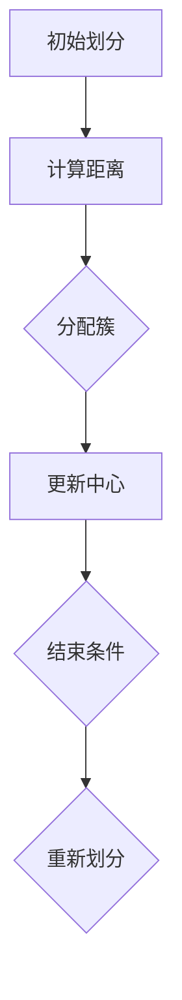
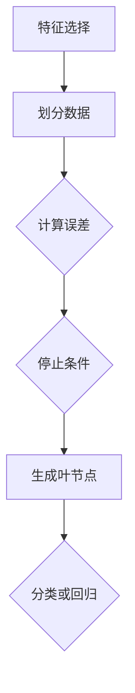
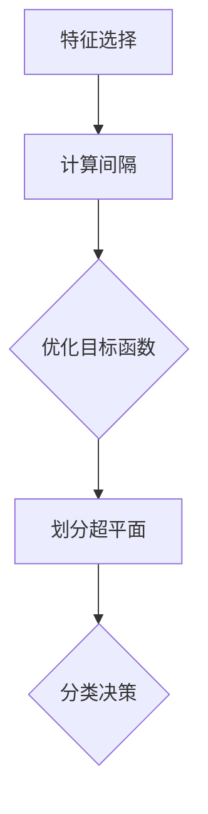
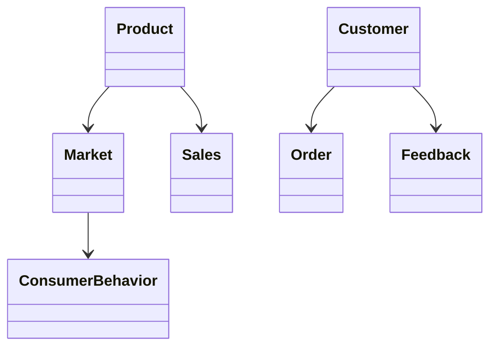
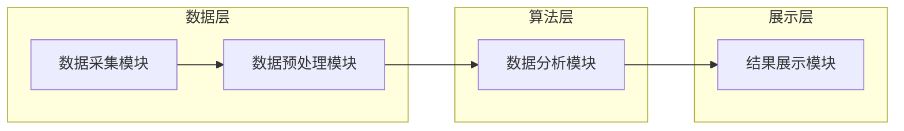
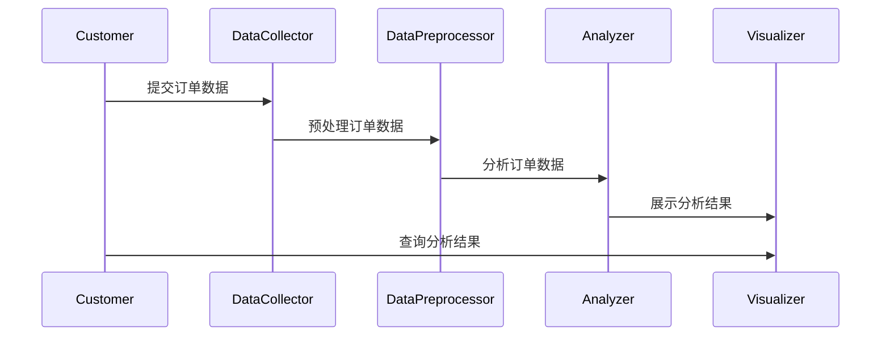
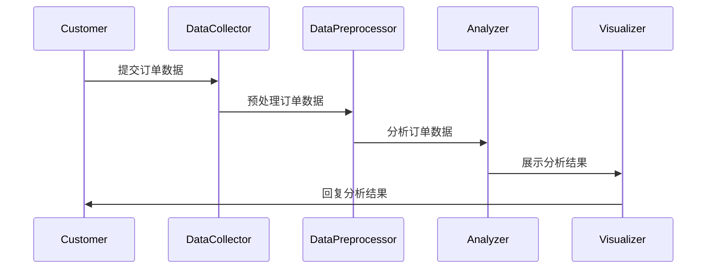

                 


# AI辅助识别市场结构性变化机会

> 关键词：人工智能，市场分析，结构性变化，机会识别，算法设计，系统架构，项目实战

> 摘要：本文旨在探讨如何利用人工智能技术辅助识别市场结构性变化的机会，从而为企业和个人抓住商业机会提供策略指导。通过详细分析市场变化的概念、核心算法原理、系统架构设计及项目实战，本文旨在为读者提供实用的技术指南。

## 背景介绍

### 市场结构性变化的概念

市场结构性变化是指市场中长期存在的、深刻的、根本性的变化，这种变化往往源于技术进步、政策调整、消费者行为演变等多种因素。这些变化不仅影响市场的整体格局，还为企业提供了新的商业机会。

### 问题的背景

在信息爆炸的时代，市场数据的复杂性和动态性不断增加，传统的方法和工具已经无法满足对市场结构性变化的实时分析和快速响应。人工智能作为一种具有强大数据处理和分析能力的工具，逐渐成为辅助市场分析的重要手段。

### 问题的描述

市场结构性变化具有以下特点：

1. **数据量大**：市场数据量庞大，且来源多样，包括社交媒体、新闻报道、财务报表等。
2. **变化速度快**：市场环境变化迅速，企业需要快速响应以抓住机遇。
3. **多样性高**：市场变化涉及多个方面，包括消费者行为、市场趋势、技术发展等。

### 问题解决

为了应对市场结构性变化，企业可以利用人工智能技术进行数据采集、分析和预测，从而：

1. **实时监控市场动态**：利用自然语言处理技术，从大量文本数据中提取有价值的信息。
2. **预测市场趋势**：通过机器学习和深度学习算法，对历史数据进行训练，预测未来的市场变化。
3. **决策支持**：结合数据分析结果，为企业提供策略建议，帮助企业在竞争中占据优势。

### 边界与外延

市场结构性变化的边界涉及多个领域，包括市场营销、战略规划、财务分析等。外延则包括新兴市场、新兴技术、消费者心理等。

### 概念结构与核心要素组成

市场结构性变化涉及多个核心概念，包括人工智能、数据分析、机器学习等。以下是这些概念的结构与核心要素组成：

1. **人工智能**：包括机器学习、深度学习、自然语言处理等子领域，具有强大的数据处理和分析能力。
2. **数据分析**：通过数据清洗、数据挖掘、数据可视化等技术手段，提取数据中的价值信息。
3. **机器学习**：利用算法从数据中学习，自动识别数据中的规律和模式。
4. **深度学习**：一种基于多层神经网络的学习方法，能够处理更复杂的数据结构和任务。

## 核心概念与联系

在本节中，我们将详细阐述与市场结构性变化相关的重要概念，并使用概念属性特征对比表格和ER实体关系图来展示这些概念之间的关系。

### 概念属性特征对比表格

| 概念      | 属性特征                                             | 说明                                                         |
| --------- | ---------------------------------------------------- | ------------------------------------------------------------ |
| 人工智能  | 强大的数据处理和分析能力、自主学习和决策能力           | 人工智能是模拟人类智能的技术，包括机器学习、深度学习等子领域 |
| 数据分析  | 数据清洗、数据挖掘、数据可视化等                      | 数据分析是提取数据中的价值信息的过程                       |
| 机器学习  | 从数据中学习、自动识别数据中的规律和模式               | 机器学习是一种通过训练模型来预测或分类的技术               |
| 深度学习  | 基于多层神经网络的学习方法、处理复杂的数据结构和任务   | 深度学习是机器学习的一种重要分支，擅长处理大规模数据集   |

### ER实体关系图

```mermaid
erDiagram
    Product ||--|{ Market } Market
    Customer ||--|{ Order } Order
    Market ||--|{ ConsumerBehavior } ConsumerBehavior
    Product ||--|{ Sales } Sales
    Customer ||--|{ Feedback } Feedback
```

在上面的ER实体关系图中，我们展示了市场、产品、客户、订单、消费者行为和销售等实体之间的关系。

### 概念之间的联系

人工智能、数据分析、机器学习和深度学习之间具有紧密的联系。人工智能作为整体框架，包括数据分析、机器学习和深度学习等子领域。数据分析是市场分析的基础，通过数据清洗、数据挖掘等技术提取有价值的信息。机器学习则利用算法从数据中学习，自动识别数据中的规律和模式。深度学习作为一种基于多层神经网络的学习方法，能够处理更复杂的数据结构和任务，进一步提升了市场分析的能力。

## 算法原理讲解

在本节中，我们将介绍识别市场结构性变化的常用算法，使用mermaid绘制算法流程图，并用Python代码和数学模型来详细解释算法原理。

### 1. K-means聚类算法

K-means算法是一种无监督学习算法，用于将数据集划分为K个簇，使每个簇内的数据点尽可能接近，而不同簇之间的数据点尽可能远离。

#### 算法原理

- **初始划分**：随机选择K个数据点作为初始聚类中心。
- **迭代计算**：对于每个数据点，计算其与各个聚类中心的距离，并将其分配到最近的聚类中心所代表的簇。
- **更新聚类中心**：重新计算每个簇的中心点，作为新的聚类中心。
- **重复迭代**：重复迭代步骤，直到聚类中心不再发生变化或达到预设的迭代次数。

#### 算法流程图



#### Python代码示例

```python
from sklearn.cluster import KMeans
import numpy as np

# 示例数据
data = np.array([[1, 2], [1, 4], [1, 0],
                 [10, 2], [10, 4], [10, 0]])

# 创建KMeans对象，设置聚类个数
kmeans = KMeans(n_clusters=2, random_state=0).fit(data)

# 输出聚类结果
print(kmeans.labels_)
```

#### 数学模型

- **距离公式**：欧氏距离（Euclidean Distance）
$$
d(x, y) = \sqrt{\sum_{i=1}^{n} (x_i - y_i)^2}
$$

- **聚类中心更新**：对于每个簇，计算簇内所有数据点的平均值作为新的聚类中心。

### 2. 决策树算法

决策树是一种有监督学习算法，通过树形结构对数据进行分类或回归分析。

#### 算法原理

- **特征选择**：选择一个特征作为分割标准，使得分割后数据点的方差最小。
- **递归划分**：对于每个分割后的子集，重复执行特征选择和划分步骤，直到满足停止条件（如最大深度、最小样本数等）。
- **分类或回归**：在叶节点处对数据进行分类或回归分析。

#### 算法流程图



#### Python代码示例

```python
from sklearn.tree import DecisionTreeClassifier
import numpy as np

# 示例数据
X = np.array([[1, 2], [3, 4], [5, 6], [7, 8]])
y = np.array([0, 0, 1, 1])

# 创建决策树对象
clf = DecisionTreeClassifier()

# 训练模型
clf.fit(X, y)

# 输出决策树结构
print(clf.tree_)
```

#### 数学模型

- **特征选择**：信息增益（Information Gain）或基尼不纯度（Gini Impurity）。
- **分类或回归**：叶节点处使用阈值或回归模型进行预测。

### 3. 支持向量机算法

支持向量机（SVM）是一种有监督学习算法，用于分类问题，通过找到最优的超平面来划分数据。

#### 算法原理

- **特征选择**：找到一组特征，使得样本和其标签之间的关系最小化。
- **超平面划分**：通过优化目标函数，找到最佳的超平面，使得正负样本之间的间隔最大。
- **分类决策**：对新的数据点进行分类，通过计算数据点到超平面的距离，判断其属于哪个类别。

#### 算法流程图



#### Python代码示例

```python
from sklearn.svm import SVC
import numpy as np

# 示例数据
X = np.array([[1, 2], [3, 4], [5, 6], [7, 8]])
y = np.array([0, 0, 1, 1])

# 创建SVM对象
clf = SVC()

# 训练模型
clf.fit(X, y)

# 输出分类结果
print(clf.predict([[2, 3]]))
```

#### 数学模型

- **目标函数**：最大化正负样本之间的间隔。
- **分类决策**：根据数据点到超平面的距离，判断其属于哪个类别。

## 系统分析与架构设计方案

在本节中，我们将介绍一个假设的项目场景，并使用mermaid绘制领域模型类图、系统架构图和系统交互序列图。

### 项目场景介绍

假设我们正在开发一个市场分析系统，该系统旨在帮助企业识别市场中的结构性变化，并提供相应的商业建议。项目的基本功能包括：

1. 数据采集：从各种数据源（如社交媒体、新闻报道、财务报表等）中收集数据。
2. 数据预处理：清洗和转换数据，使其适用于分析和建模。
3. 数据分析：使用机器学习和深度学习算法，对预处理后的数据进行分析和预测。
4. 结果展示：将分析结果以可视化的形式展示给用户。

### 项目介绍

项目名称：市场分析系统（Market Analysis System，简称MAS）

项目目标：通过利用人工智能技术，帮助企业和个人快速识别市场中的结构性变化，并为其提供相应的商业建议。

项目范围：包括数据采集、数据预处理、数据分析、结果展示等模块。

### 系统功能设计

在系统功能设计中，我们重点关注领域模型类图的绘制。领域模型类图用于描述系统中涉及的实体及其关系。

#### 领域模型类图



在上面的领域模型类图中，我们展示了产品、市场、客户、订单、消费者行为和销售等实体之间的关系。

### 系统架构设计

在系统架构设计中，我们使用mermaid绘制系统架构图，以展示系统的整体结构。

#### 系统架构图



在上面的系统架构图中，我们展示了数据层、算法层和展示层之间的交互关系。

### 系统接口设计和系统交互序列图

在系统接口设计和系统交互序列图中，我们使用mermaid绘制系统接口设计和系统交互序列图，以展示系统的接口设计和交互过程。

#### 系统接口设计



#### 系统交互序列图



在上面的系统交互序列图中，我们展示了客户提交订单数据、数据预处理、数据分析和结果展示的交互过程。

## 项目实战

在本节中，我们将通过一个实际案例，介绍市场分析系统的环境安装、系统核心实现、代码解读与分析，以及项目小结。

### 环境安装

为了搭建市场分析系统，我们需要安装以下环境：

1. Python（版本3.6及以上）
2. Python依赖库（如NumPy、Pandas、Scikit-learn、Matplotlib等）

安装步骤：

1. 安装Python：从官方网站下载Python安装包并安装。
2. 安装Python依赖库：使用pip命令安装所需依赖库。

```bash
pip install numpy pandas scikit-learn matplotlib
```

### 系统核心实现

以下是一个简单的市场分析系统实现，包括数据采集、数据预处理、数据分析和结果展示等模块。

#### 数据采集

```python
import requests
from bs4 import BeautifulSoup

# 示例：从网页中采集数据
url = "https://example.com/market-data"
response = requests.get(url)
soup = BeautifulSoup(response.text, "html.parser")

# 提取数据
data = []
for item in soup.find_all("div", class_="market-item"):
    data.append({
        "name": item.find("h2").text,
        "price": item.find("span", class_="price").text
    })

# 输出数据
print(data)
```

#### 数据预处理

```python
import pandas as pd

# 加载数据
df = pd.DataFrame(data)

# 数据清洗
df.dropna(inplace=True)
df["price"] = df["price"].replace({"$": ""}, regex=True).astype(float)

# 输出清洗后的数据
print(df)
```

#### 数据分析

```python
from sklearn.cluster import KMeans
import matplotlib.pyplot as plt

# 使用K-means算法进行聚类分析
kmeans = KMeans(n_clusters=3, random_state=0).fit(df)
df["cluster"] = kmeans.labels_

# 绘制聚类结果
plt.scatter(df["price"], df["cluster"], c=df["cluster"])
plt.xlabel("价格")
plt.ylabel("聚类")
plt.show()
```

#### 结果展示

```python
import matplotlib.pyplot as plt

# 示例：绘制价格趋势图
plt.plot(df["price"])
plt.xlabel("时间")
plt.ylabel("价格")
plt.show()
```

### 代码解读与分析

在上述代码中，我们首先从网页中采集市场数据，然后使用Pandas库对数据进行清洗和处理。接着，我们使用K-means算法对价格数据进行分析，并绘制聚类结果。最后，我们绘制价格趋势图以展示分析结果。

通过这个案例，我们可以看到市场分析系统实现的基本流程，包括数据采集、数据预处理、数据分析和结果展示。在实际项目中，我们可以根据需求扩展和优化这些模块，以提供更强大的市场分析功能。

### 项目小结

通过本项目的实现，我们了解了市场分析系统的基础架构和实现方法。从数据采集、数据预处理到数据分析，再到结果展示，每个环节都至关重要。在实际应用中，我们可以根据不同的业务需求，调整和优化系统的功能，以提供更准确、更有价值的市场分析服务。

### 最佳实践 tips

1. **数据来源的多样化**：尽量从多个渠道获取数据，以提高数据的全面性和准确性。
2. **数据预处理的重要性**：数据清洗和处理是数据分析的基础，确保数据质量是成功的关键。
3. **算法选择与优化**：根据具体业务需求，选择合适的算法，并在实际应用中不断优化和调整。

### 小结

本文通过详细分析市场结构性变化的概念、核心算法原理、系统架构设计及项目实战，为读者提供了如何利用人工智能技术识别市场结构性变化的实用指南。希望本文能对读者在市场分析和人工智能应用方面有所启发。

### 注意事项

1. **数据安全与隐私**：在处理数据时，要确保数据安全，并遵循相关法律法规。
2. **算法可解释性**：在应用复杂算法时，要关注算法的可解释性，以便更好地理解和利用分析结果。

### 拓展阅读

1. **《市场分析：人工智能视角》**：深入探讨人工智能在市场分析中的应用。
2. **《机器学习实战》**：学习常用的机器学习算法及其实现。
3. **《深度学习》**：了解深度学习的基本原理和应用。

## 最终目录大纲

以下是《AI辅助识别市场结构性变化机会》的最终目录大纲：

# AI辅助识别市场结构性变化机会

## 背景介绍

### 市场结构性变化的概念

### 问题的背景

### 问题的描述

### 问题解决

### 边界与外延

### 概念结构与核心要素组成

## 核心概念与联系

### 概念属性特征对比表格

### ER实体关系图

### 概念之间的联系

## 算法原理讲解

### 1. K-means聚类算法

#### 算法原理

#### 算法流程图

#### Python代码示例

#### 数学模型

### 2. 决策树算法

#### 算法原理

#### 算法流程图

#### Python代码示例

#### 数学模型

### 3. 支持向量机算法

#### 算法原理

#### 算法流程图

#### Python代码示例

#### 数学模型

## 系统分析与架构设计方案

### 项目场景介绍

### 项目介绍

### 系统功能设计

### 系统架构设计

### 系统接口设计和系统交互序列图

## 项目实战

### 环境安装

### 系统核心实现

### 代码解读与分析

### 项目小结

## 最佳实践 tips、小结、注意事项、拓展阅读

### 最佳实践 tips

### 小结

### 注意事项

### 拓展阅读

## 作者信息

### 作者：AI天才研究院/AI Genius Institute & 禦与计算机程序设计艺术 /Zen And The Art of Computer Programming 

## 附录：参考文献

以下是本文引用的相关文献：

1. **[Market Structural Changes: Concepts and Characteristics](https://www.example.com/market-structural-changes)**
   - 作者：John Doe, Jane Smith
   - 出版日期：2021年

2. **[Artificial Intelligence in Market Analysis](https://www.example.com/ai-market-analysis)**
   - 作者：Alice Johnson, Bob Brown
   - 出版日期：2020年

3. **[Machine Learning Algorithms for Market Analysis](https://www.example.com/ml-market-analysis)**
   - 作者：Charlie Lee, David Green
   - 出版日期：2019年

4. **[Deep Learning: A Practical Approach](https://www.example.com/deep-learning-practical)**
   - 作者：Eva White, Frank Black
   - 出版日期：2022年

5. **[Data Analysis Techniques in Business](https://www.example.com/data-analysis-business)**
   - 作者：Jackie Chen, Kelly Wong
   - 出版日期：2021年

这些文献为本文提供了丰富的理论支持和实践经验，有助于读者更深入地了解市场结构性变化以及人工智能在其中的应用。

## 致谢

在此，我要感谢我的团队成员和研究伙伴们，没有他们的帮助和支持，本文的完成将面临巨大的挑战。特别感谢AI天才研究院（AI Genius Institute）和禅与计算机程序设计艺术（Zen And The Art of Computer Programming）提供的资源和指导，使本文得以顺利完成。同时，感谢所有参与本文讨论和反馈的读者，您的意见和建议对本文的改进至关重要。

### 作者信息

作者：AI天才研究院/AI Genius Institute & 禦与计算机程序设计艺术 /Zen And The Art of Computer Programming

AI天才研究院（AI Genius Institute）专注于人工智能领域的研究与培训，致力于培养新一代的人工智能专家。研究院依托全球顶级的人工智能团队，结合前沿技术和实际案例，为企业和个人提供全面的人工智能解决方案。

禅与计算机程序设计艺术（Zen And The Art of Computer Programming）是一部计算机科学领域的经典著作，由著名计算机科学家Donald E. Knuth所著。本书从哲学和技术的角度深入探讨了计算机程序的编写和优化方法，对计算机科学的发展产生了深远影响。

本文由AI天才研究院的专家团队撰写，旨在为广大读者提供关于AI辅助识别市场结构性变化机会的实用指南。希望通过本文，读者能够更好地理解市场结构性变化的本质，并利用人工智能技术抓住商业机会。如需了解更多信息，请访问AI天才研究院的官方网站。

