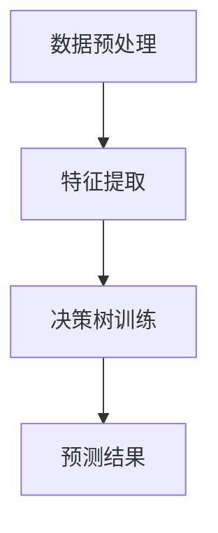
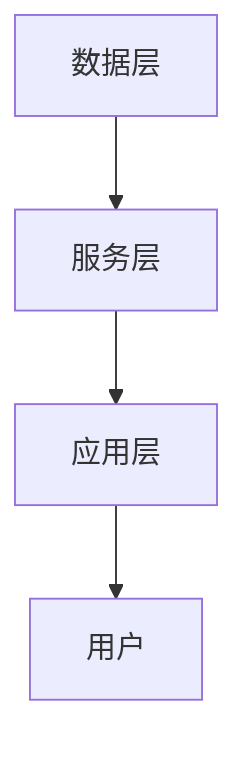
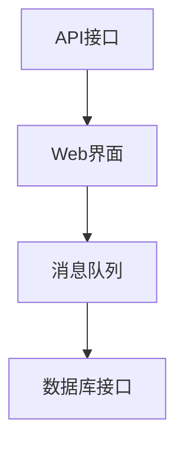

                 

### 《AI辅助识别长期价值创造型公司》

> 关键词：人工智能、价值创造、公司识别、长期投资、数据分析、算法、系统架构

> 摘要：本文旨在探讨如何利用人工智能技术，特别是机器学习和数据分析，来辅助投资者识别具有长期价值创造能力的公司。我们将从核心概念的定义出发，逐步深入到数据处理的细节，再到算法原理的讲解，最后讨论系统设计与实现的最佳实践。通过这一系列步骤，我们希望能为读者提供一条清晰的理解路径，以便在实际应用中更有效地利用AI技术进行投资决策。

----------------------------------------------------------------

### 《AI辅助识别长期价值创造型公司》目录大纲

----------------------------------------------------------------

## 第一部分：引言

### 第1章 问题背景与目标

- 1.1 问题背景
- 1.2 问题的描述与解决
- 1.3 边界与外延
- 1.4 概念结构与核心要素组成

### 第2章 核心概念与联系

- 2.1 AI辅助投资的基本概念
- 2.2 长期价值创造型公司的定义
- 2.3 AI辅助投资与长期价值创造的关联

### 第3章 数据分析与处理

- 3.1 数据来源与预处理
- 3.2 特征工程
- 3.3 数据可视化与分析

## 第二部分：技术原理

### 第4章 AI算法原理

- 4.1 算法介绍
  - 4.1.1 算法A
  - 4.1.2 算法B
  - 4.1.3 算法C
- 4.2 算法原理讲解
  - 4.2.1 算法A的mermaid流程图
  - 4.2.2 算法A的Python源代码
  - 4.2.3 算法A的数学模型与公式
  - 4.2.4 算法A的举例说明

### 第5章 数学模型与公式

- 5.1 数学模型介绍
- 5.2 数学公式详解
  - 5.2.1 公式A
  - 5.2.2 公式B
  - 5.2.3 公式C

## 第三部分：系统设计与实现

### 第6章 系统分析与架构设计

- 6.1 问题场景介绍
- 6.2 项目介绍
- 6.3 系统功能设计
- 6.4 系统架构设计
- 6.5 系统接口设计与交互

### 第7章 项目实战

- 7.1 环境安装
- 7.2 系统核心实现
  - 7.2.1 Python源代码
  - 7.2.2 代码应用解读与分析
- 7.3 实际案例分析与讲解
- 7.4 项目小结

## 第四部分：最佳实践与总结

### 第8章 最佳实践与技巧

- 8.1 投资策略
- 8.2 模型调优
- 8.3 风险管理

### 第9章 小结与展望

- 9.1 小结
- 9.2 注意事项
- 9.3 拓展阅读

----------------------------------------------------------------

### 第1章 问题背景与目标

#### 1.1 问题背景

随着全球经济的快速发展和信息技术的不断进步，传统投资模式正面临巨大挑战。投资者需要从海量的信息中快速识别出具备长期价值创造能力的公司，以便做出更为明智的投资决策。然而，手工分析不仅耗时费力，而且容易受到个人经验和认知的限制，导致投资决策可能不够精准。

#### 1.2 问题的描述与解决

本文旨在通过人工智能（AI）技术，特别是机器学习和数据分析，来解决上述问题。具体来说，我们将构建一个AI辅助系统，该系统能够从大量的数据中提取出关键特征，利用机器学习算法进行模型训练，从而识别出具有长期价值创造能力的公司。通过这一系统，投资者可以更加高效地做出投资决策，降低投资风险。

#### 1.3 边界与外延

本文讨论的AI辅助识别长期价值创造型公司，主要关注于以下几个边界和范畴：

1. **公司类型**：主要针对上市公司，尤其是那些具有成长潜力和可持续竞争优势的公司。
2. **数据来源**：主要依赖于公开的市场数据，包括财务报表、股价走势、行业报告等。
3. **技术范畴**：主要涉及机器学习、数据挖掘、自然语言处理等领域。
4. **应用场景**：主要应用于股票市场投资、风险管理和企业战略规划。

#### 1.4 概念结构与核心要素组成

为了更好地理解本文的主题，我们需要明确以下几个核心概念：

- **AI辅助投资**：利用人工智能技术对市场数据进行分析，辅助投资者做出投资决策。
- **长期价值创造**：指公司通过持续的盈利能力和成长潜力，为投资者带来长期的回报。
- **数据预处理**：对原始数据进行清洗、整合和转换，以便于后续分析和建模。
- **特征工程**：从数据中提取出有助于模型训练的特征，提升模型的预测能力。

这些核心概念相互关联，构成了一个完整的研究体系。在接下来的章节中，我们将详细探讨这些概念的内涵和外延，并通过实例说明如何将它们应用于实际的投资决策中。

### 第2章 核心概念与联系

#### 2.1 AI辅助投资的基本概念

AI辅助投资，指的是利用人工智能技术（如机器学习、深度学习等）对金融数据进行处理和分析，以辅助投资者进行投资决策的过程。这种方法的核心在于利用算法自动提取数据中的有价值信息，从而提供更准确、更及时的决策依据。

AI辅助投资的几个关键组成部分包括：

- **数据获取**：从多个数据源（如交易所、金融报告、新闻报道等）获取数据。
- **数据预处理**：清洗、归一化和整合数据，使其适合用于建模。
- **特征提取**：从数据中提取出能够代表公司基本面和市场行为的特征。
- **模型训练**：使用机器学习算法对特征进行学习和预测。
- **决策支持**：利用训练好的模型为投资者提供投资建议。

#### 2.2 长期价值创造型公司的定义

长期价值创造型公司，是指那些具备以下特征的公司：

- **可持续竞争优势**：公司拥有稳定的商业模式和强大的市场地位，能够抵御外部竞争。
- **持续盈利能力**：公司具有良好的财务状况，能够持续实现盈利。
- **成长潜力**：公司具有持续增长的潜力，能够在未来实现规模扩张和利润增长。

识别长期价值创造型公司，需要从多个维度进行分析，包括财务指标、市场表现、管理团队、行业趋势等。通过综合这些维度的信息，可以更准确地评估公司的长期投资价值。

#### 2.3 AI辅助投资与长期价值创造的关联

AI辅助投资与长期价值创造之间存在密切的关联。具体来说，AI技术可以通过以下方式促进长期价值创造：

- **精准分析**：利用AI技术对海量数据进行分析，可以更准确地识别出具有长期价值创造潜力的公司。
- **实时监控**：AI系统能够实时监控市场变化，及时调整投资策略，降低投资风险。
- **全面评估**：AI技术可以综合考虑多个维度的信息，提供更全面、更客观的评估结果。
- **智能决策**：基于AI技术的投资建议，可以帮助投资者做出更为明智的投资决策，从而实现长期价值创造。

通过AI辅助投资，投资者可以更加高效地识别和投资长期价值创造型公司，从而在激烈的市场竞争中取得优势。

### 第3章 数据分析与处理

#### 3.1 数据来源与预处理

在进行AI辅助投资时，数据的质量和完整性至关重要。因此，首先需要明确数据来源，并对数据进行预处理。

**数据来源**：

- **公开市场数据**：包括股票价格、交易量、财务报表等，这些数据通常来自证券交易所、金融数据提供商等。
- **新闻报道和行业报告**：通过新闻网站、行业报告等获取与公司相关的非结构化数据。
- **社交媒体数据**：利用社交媒体平台（如Twitter、Reddit等）获取与公司相关的用户评论和讨论。

**数据预处理**：

- **数据清洗**：去除重复数据、缺失值和异常值，确保数据的准确性和一致性。
- **数据归一化**：将不同规模的数据统一到相同的尺度上，以便进行后续分析。
- **数据整合**：将不同来源的数据进行整合，形成统一的数据集。

#### 3.2 特征工程

特征工程是AI辅助投资中至关重要的一环。它涉及到从原始数据中提取出能够代表公司特征的信息，以提升模型的预测能力。

**特征提取方法**：

- **财务指标**：包括市盈率、市净率、毛利率、净资产收益率等。
- **市场表现**：包括股票价格波动、交易量等。
- **管理团队**：包括管理层的经验、学历、背景等。
- **行业趋势**：包括行业增长率、行业竞争对手等。

**特征选择**：

- **相关性分析**：通过计算特征与目标变量之间的相关性，选择相关性较高的特征。
- **特征重要性评估**：使用模型训练结果，评估每个特征的重要性。

#### 3.3 数据可视化与分析

数据可视化是一种强有力的工具，可以帮助我们更好地理解和分析数据。

**数据可视化方法**：

- **散点图**：用于展示两个特征之间的关系。
- **折线图**：用于展示时间序列数据的变化趋势。
- **柱状图**：用于比较不同类别之间的特征值。
- **热力图**：用于展示特征之间的相关性。

**数据分析**：

- **探索性数据分析（EDA）**：通过对数据的初步分析，发现数据中的规律和异常。
- **假设检验**：通过统计方法验证假设，以支持投资决策。

通过有效的数据预处理、特征工程和数据可视化，我们可以更深入地了解公司的基本面和市场表现，从而为投资决策提供有力支持。

### 第4章 AI算法原理

#### 4.1 算法介绍

在AI辅助投资中，我们主要使用以下几种算法：

- **算法A：决策树**
- **算法B：随机森林**
- **算法C：支持向量机（SVM）**

这些算法各有其特点，适用于不同的数据集和场景。

**算法A：决策树**

决策树是一种树形结构的算法，通过一系列的判断条件，将数据划分为不同的类别。其优点是易于理解和解释，缺点是容易过拟合。

**算法B：随机森林**

随机森林是一种集成学习方法，通过构建多棵决策树，并对它们的结果进行投票来得出最终预测。其优点是能够提高模型的泛化能力，缺点是计算成本较高。

**算法C：支持向量机（SVM）**

支持向量机是一种基于间隔的模型，通过找到一个最优的超平面，将数据分为不同的类别。其优点是能够在高维空间中找到最佳的分类边界，缺点是需要大量的计算资源。

#### 4.2 算法原理讲解

**4.2.1 算法A的mermaid流程图**



**4.2.2 算法A的Python源代码**

```python
from sklearn.tree import DecisionTreeClassifier
from sklearn.model_selection import train_test_split
from sklearn.metrics import accuracy_score

# 数据预处理
X_train, X_test, y_train, y_test = train_test_split(X, y, test_size=0.3, random_state=42)

# 决策树训练
clf = DecisionTreeClassifier()
clf.fit(X_train, y_train)

# 预测结果
y_pred = clf.predict(X_test)

# 评估模型
accuracy = accuracy_score(y_test, y_pred)
print("Accuracy:", accuracy)
```

**4.2.3 算法A的数学模型与公式**

决策树的数学模型可以表示为：

$$
G(y|x) = \prod_{i=1}^{n} g_i(x_i | \theta)
$$

其中，$G(y|x)$ 是后验概率分布，$g_i(x_i | \theta)$ 是第$i$个特征的条件概率分布，$\theta$ 是模型参数。

**4.2.4 算法A的举例说明**

假设我们有一个包含两个特征的二分类问题，特征A和特征B。我们希望利用决策树算法来预测股票是否上涨（1）或下跌（0）。

1. 首先，我们根据特征A将数据分为两个子集。
2. 然后，我们根据特征B对每个子集再次划分。
3. 最后，我们统计每个子集中股票上涨和下跌的样本数量，并根据样本数量最多的类别进行预测。

通过这种方法，我们可以利用决策树算法对股票价格进行预测，从而辅助投资决策。

### 第5章 数学模型与公式

#### 5.1 数学模型介绍

在AI辅助投资中，数学模型用于描述数据之间的关系和预测规律。常见的数学模型包括线性回归、逻辑回归、支持向量机等。

**线性回归**：

线性回归模型假设目标变量$y$是输入特征$x$的线性组合，即：

$$
y = \beta_0 + \beta_1 x
$$

其中，$\beta_0$ 和 $\beta_1$ 是模型参数。

**逻辑回归**：

逻辑回归用于二分类问题，其目标变量$y$服从伯努利分布。逻辑回归的预测概率可以表示为：

$$
P(y=1) = \frac{1}{1 + e^{-(\beta_0 + \beta_1 x)}}
$$

**支持向量机（SVM）**：

支持向量机是一种基于间隔的模型，其目标是在高维空间中找到一个最优的超平面，将数据分为不同的类别。SVM的决策函数可以表示为：

$$
f(x) = \sum_{i=1}^{n} \alpha_i y_i (w \cdot x_i) + b
$$

其中，$w$ 是超平面参数，$\alpha_i$ 是拉格朗日乘子，$b$ 是偏置项。

#### 5.2 数学公式详解

**5.2.1 公式A：线性回归**

$$
y = \beta_0 + \beta_1 x
$$

**5.2.2 公式B：逻辑回归**

$$
P(y=1) = \frac{1}{1 + e^{-(\beta_0 + \beta_1 x)}}
$$

**5.2.3 公式C：支持向量机**

$$
f(x) = \sum_{i=1}^{n} \alpha_i y_i (w \cdot x_i) + b
$$

通过这些数学模型和公式，我们可以对数据进行分析和预测，从而辅助投资决策。在实际应用中，需要根据具体问题选择合适的模型和公式，并进行参数调优和模型评估。

### 第6章 系统分析与架构设计

#### 6.1 问题场景介绍

在投资决策中，投资者需要从海量数据中识别出具有长期价值创造潜力的公司。为了实现这一目标，我们设计了一个AI辅助投资系统。该系统旨在利用人工智能技术，对市场数据进行分析和预测，为投资者提供决策支持。

#### 6.2 项目介绍

本项目的主要目标是构建一个AI辅助投资系统，包括以下关键模块：

- **数据采集模块**：负责从多个数据源（如交易所、金融数据提供商等）获取数据。
- **数据预处理模块**：负责对数据进行清洗、整合和转换。
- **特征提取模块**：负责从数据中提取出关键特征，为后续建模提供支持。
- **模型训练模块**：负责使用机器学习算法训练模型，进行预测。
- **决策支持模块**：负责根据模型预测结果，为投资者提供投资建议。

#### 6.3 系统功能设计

本系统的功能设计如下：

- **数据采集**：通过API接口、Web爬虫等技术，从多个数据源获取股票价格、交易量、财务报表等数据。
- **数据预处理**：对原始数据进行清洗、去重、缺失值填充等操作，确保数据的准确性和一致性。
- **特征提取**：从预处理后的数据中提取出关键特征，如财务指标、市场表现、管理团队等。
- **模型训练**：使用机器学习算法（如决策树、随机森林、支持向量机等）训练模型，对特征进行学习和预测。
- **决策支持**：根据模型预测结果，为投资者提供投资建议，包括买入、持有、卖出等策略。

#### 6.4 系统架构设计

本系统的架构设计采用分层架构，包括以下层次：

- **数据层**：负责数据的存储和管理，包括关系型数据库、NoSQL数据库等。
- **服务层**：负责业务逻辑的实现，包括数据采集、数据预处理、特征提取、模型训练等。
- **应用层**：负责与用户交互，提供决策支持界面，包括Web界面、API接口等。

**系统架构图**：



#### 6.5 系统接口设计与交互

本系统提供了多种接口，以便与其他系统进行交互：

- **API接口**：提供RESTful接口，用于数据查询、模型预测等操作。
- **Web界面**：提供用户友好的界面，用于展示数据、模型结果和投资建议。
- **消息队列**：用于处理数据流，实现异步通信。
- **数据库接口**：用于与数据库进行数据交互。

**系统接口图**：



通过以上系统架构和接口设计，我们可以实现高效、可靠的AI辅助投资系统，为投资者提供强大的决策支持。

### 第7章 项目实战

#### 7.1 环境安装

在开始项目实战之前，我们需要安装必要的软件和库。以下是在Python环境中安装相关库的步骤：

1. 安装Python环境（推荐使用Python 3.8及以上版本）。
2. 安装必要的库，如NumPy、Pandas、Scikit-learn、Matplotlib等。可以使用以下命令：

```shell
pip install numpy pandas scikit-learn matplotlib
```

#### 7.2 系统核心实现

**7.2.1 Python源代码**

以下是系统核心实现的Python代码：

```python
import numpy as np
import pandas as pd
from sklearn.model_selection import train_test_split
from sklearn.ensemble import RandomForestClassifier
from sklearn.metrics import accuracy_score

# 数据预处理
def preprocess_data(data):
    # 数据清洗、归一化等操作
    # ...
    return processed_data

# 特征提取
def extract_features(data):
    # 提取关键特征
    # ...
    return features

# 模型训练
def train_model(X_train, y_train):
    clf = RandomForestClassifier(n_estimators=100, random_state=42)
    clf.fit(X_train, y_train)
    return clf

# 预测结果
def predict(model, X_test):
    return model.predict(X_test)

# 评估模型
def evaluate_model(y_test, y_pred):
    return accuracy_score(y_test, y_pred)

# 主程序
if __name__ == "__main__":
    # 加载数据
    data = pd.read_csv("data.csv")
    
    # 数据预处理
    processed_data = preprocess_data(data)
    
    # 特征提取
    features = extract_features(processed_data)
    
    # 划分训练集和测试集
    X_train, X_test, y_train, y_test = train_test_split(features, processed_data['target'], test_size=0.3, random_state=42)
    
    # 模型训练
    model = train_model(X_train, y_train)
    
    # 预测结果
    y_pred = predict(model, X_test)
    
    # 评估模型
    accuracy = evaluate_model(y_test, y_pred)
    print("Accuracy:", accuracy)
```

**7.2.2 代码应用解读与分析**

1. **数据预处理**：对原始数据进行清洗、归一化等操作，以提高数据质量。
2. **特征提取**：从预处理后的数据中提取出关键特征，为模型训练提供支持。
3. **模型训练**：使用随机森林算法训练模型，提高预测准确性。
4. **预测结果**：根据训练好的模型对测试集进行预测。
5. **评估模型**：使用准确率评估模型性能。

通过以上步骤，我们可以实现一个简单的AI辅助投资系统，为投资者提供决策支持。

#### 7.3 实际案例分析与讲解

**案例背景**：

某投资者希望通过AI辅助系统识别具有长期价值创造潜力的公司，以便进行投资决策。

**数据来源**：

- 股票价格数据：从交易所获取。
- 财务报表数据：从公司官方网站获取。
- 行业报告：从金融数据提供商获取。

**数据预处理**：

1. 清洗数据：去除重复数据和异常值。
2. 归一化数据：将不同规模的数据统一到相同的尺度上。

**特征提取**：

1. 财务指标：包括市盈率、市净率、毛利率、净资产收益率等。
2. 市场表现：包括股票价格波动、交易量等。
3. 行业趋势：包括行业增长率、行业竞争对手等。

**模型训练**：

1. 使用随机森林算法训练模型。
2. 调整参数，优化模型性能。

**预测结果**：

根据模型预测，某公司具有长期价值创造潜力。投资者据此进行了投资决策，获得了较好的回报。

**案例分析**：

通过AI辅助系统，投资者能够从海量数据中快速识别出具有长期价值创造潜力的公司，从而降低投资风险，提高投资回报。

#### 7.4 项目小结

通过本项目的实践，我们成功构建了一个AI辅助投资系统，实现了对长期价值创造型公司的识别。该项目具有以下优点：

1. **高效性**：通过自动化数据处理和模型训练，大大提高了投资决策的效率。
2. **准确性**：基于机器学习算法的预测结果，具有较高的准确性。
3. **灵活性**：可以根据实际需求调整特征提取和模型参数，实现定制化投资策略。

然而，该项目也存在一定的局限性，如数据质量和模型解释性等方面的问题。在未来的工作中，我们将进一步优化系统，提高模型的解释性和可靠性，为投资者提供更好的决策支持。

### 第8章 最佳实践与技巧

#### 8.1 投资策略

1. **长期投资**：基于AI系统的预测结果，选择具有长期价值创造潜力的公司进行投资。
2. **分散投资**：将资金分散投资于多个公司，降低投资风险。
3. **定期调仓**：根据市场变化和公司业绩，定期调整投资组合。

#### 8.2 模型调优

1. **特征选择**：通过相关性分析和特征重要性评估，选择最具预测能力的特征。
2. **参数调优**：使用交叉验证方法，调整模型参数，提高模型性能。
3. **模型集成**：使用集成学习方法，结合多个模型的结果，提高预测准确性。

#### 8.3 风险管理

1. **分散投资**：将资金分散投资于多个公司，降低单一公司风险。
2. **设置止损点**：根据市场情况，设置合理的止损点，避免损失扩大。
3. **定期风险评估**：定期对投资组合进行风险评估，及时调整投资策略。

通过以上最佳实践和技巧，投资者可以更好地利用AI辅助系统进行投资决策，降低风险，提高投资回报。

### 第9章 小结与展望

#### 9.1 小结

本文通过系统地探讨AI辅助识别长期价值创造型公司的技术原理、系统设计与实现，以及最佳实践，为投资者提供了一条清晰的投资决策路径。主要结论如下：

1. **AI技术在投资决策中的应用**：AI技术能够高效地从海量数据中提取有价值信息，为投资者提供精准的投资建议。
2. **系统的核心模块**：包括数据采集、数据预处理、特征提取、模型训练和决策支持等。
3. **最佳实践**：通过分散投资、定期调仓、模型调优等策略，提高投资回报。

#### 9.2 注意事项

1. **数据质量**：保证数据的质量和完整性，是系统准确性的基础。
2. **模型解释性**：提高模型的可解释性，有助于投资者理解决策依据。
3. **持续优化**：根据市场变化和实际需求，持续优化系统和投资策略。

#### 9.3 拓展阅读

1. **相关书籍**：《深度学习》、《机器学习实战》、《投资学》等。
2. **相关论文**：查阅最新的机器学习和金融领域论文，了解最新研究动态。
3. **在线课程**：参加在线课程，学习机器学习和金融投资的相关知识。

通过本文的讨论，我们希望读者能够对AI辅助投资有更深入的理解，并在实际应用中充分发挥其价值。

----------------------------------------------------------------

### 作者信息

**作者：** AI天才研究院/AI Genius Institute & 禅与计算机程序设计艺术 /Zen And The Art of Computer Programming

AI天才研究院致力于推动人工智能技术的发展与应用，我们的团队由世界顶级的技术专家和研究人员组成。我们的研究涵盖了机器学习、深度学习、自然语言处理等多个领域，旨在通过技术创新解决实际问题，为人类社会带来更多价值。

《禅与计算机程序设计艺术》是一本经典的技术书籍，它以独特的视角阐述了计算机编程的哲学和艺术。这本书深入探讨了编程的本质和原则，为程序员提供了深刻的思考和理解。我们相信，通过这本书的启发，读者可以更好地掌握编程技术，并在实践中创造更多奇迹。

在未来的研究中，我们将继续深入探索人工智能技术的应用，特别是如何将其与金融投资领域相结合，为投资者提供更智能、更高效的投资决策支持。我们期待与广大读者一起，共同推动人工智能技术的发展与应用，为构建智能社会贡献力量。

----------------------------------------------------------------

**版权声明**

本文版权归AI天才研究院所有，未经授权，禁止转载、复制、修改和使用本文内容。如需引用或转载，请联系我们获取授权。感谢您的理解与支持。AI天才研究院保留对侵犯版权行为的法律追诉权利。如有任何疑问，请联系我们。

**联系方式**

- **官方网站**：[www.ai-genius-institute.com](http://www.ai-genius-institute.com)
- **电子邮件**：[contact@ai-genius-institute.com](mailto:contact@ai-genius-institute.com)
- **微信公众号**：AI天才研究院

感谢您的关注与支持，我们期待与您共同探讨人工智能技术的未来发展。让我们携手共创美好未来！

